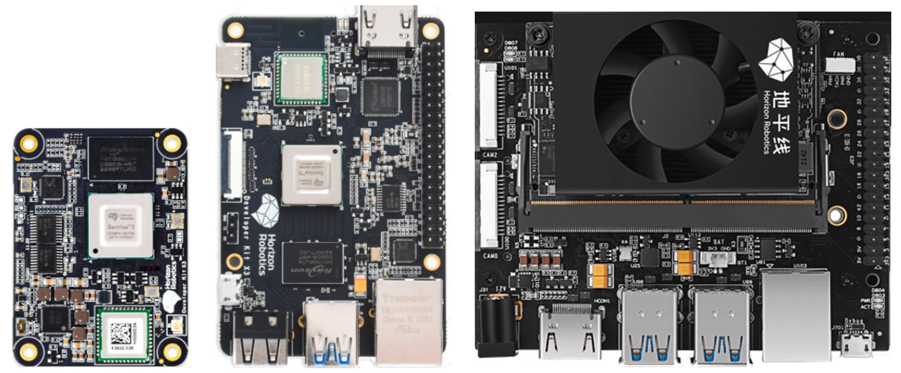

# 地平线RDK套件

本文档为地平线RDK套件的用户手册，为开发者提供关于RDK X3（旭日X3派）、RDK X3 Module（旭日X3模组）、RDK Ultra等产品的使用说明和开发指导，内容涵盖硬件设计、系统定制、应用开发、算法工具链等多个方面。欢迎用户更新体验，具体方法请参考 [快速开始](/category/installation) 章节。

:::info 注意

- 本文档中**RDK X3**均使用2.0版本Ubuntu操作系统，对于仍需使用**旭日X3派1.0版本系统**的用户，可从下述链接中获取资料： 
     [旭日X3派用户手册](https://developer.horizon.ai/api/v1/fileData/documents_pi/index.html) 
     [旭日X3派Ubuntu镜像](https://sunrise.horizon.cc/downloads/os_images/)，选择1.x.x 版本目录下的镜像 
     [旭日X3派资料包](https://developer.horizon.ai/api/v1/static/fileData/X3%E6%B4%BE%E8%B5%84%E6%96%99%E5%8C%85_20220711175326.zip) 

-  **RDK X3 Module**出厂已经烧写测试版本系统镜像，为确保使用最新版本的系统，建议参考本文档完成[最新版本系统镜像的烧写](/installation/install_os)。

用户如需确认系统版本号，可通过该命令查询 `cat /etc/version`
:::

## 地平线RDK套件概述

**Horizon Robotics Developer Kits**，简称地平线RDK套件，是基于地平线智能芯片打造的机器人开发者套件，包括RDK X3（旭日X3派）、RDK X3 Module（旭日X3模组）、RDK Ultra。
搭配TogetheROS.Bot机器人中间件，地平线RDK套件可以帮助发者快速搭建机器人原型，开展评测和验证工作。

本文将详细说明地平线RDK套件的使用方法，包括开发环境搭建、示例教程的运行、应用程序的开发、系统镜像的定制等方面内容。无论您选择使用哪种硬件，本文所介绍的内容都将为您提供一致的使用体验。

## 产品介绍

**RDK X3（旭日X3派）** 是一款全功能开发板，具有5Tops端侧推理算力。通过搭配丰富的传感器和扩展组件，为开发者提供了灵活的硬件扩展和连接选项。

**RDK X3 Module（旭日X3模组）** 是一款紧凑型核心模组，与RDK X3保持了同等规格，并在尺寸、接口上兼容树莓派CM4模组。通过搭配扩展板，可以为各种应用场景提供高效的计算和通信能力。

**RDK Ultra** 是一款高性能开发套件，具有96Tops端侧推理算力与8核ARM A55处理能力，支持4路MIPI Camera接入，4路USB3.0接口，3路PCIe3.0接口，充分满足各类场景的使用需求。

## 文档使用指引

下面将对用户手册的整体内容划分进行介绍，帮助用户快速了解文档的结构和内容，以便更好地利用文档进行开发、学习工作。

**[系统安装与登录](/category/installation)**  
介绍系统安装，硬件接口使用的入门说明，帮助用户快速上手使用开发板。  

**[系统配置](/category/configuration)**  
介绍一系列配置步骤和技巧，以确保系统能够正常工作并满足特定的需求，引导用户进行系统的配置，包括系统升级、网络、蓝牙的配置。  

**[第一个应用程序](/category/first_application)**  
介绍系统中预装的功能示例，如io管脚控制、视频采集，算法推理等。  

**[Python开发指南](/category/python_development)**  
介绍Python语言版本的视频、图像、算法简易接口的使用方法，此接口简单易用，方便用户快速上手，基于更底层的多媒体接口进行了封装。  

**[C/C++开发指南](/category/clang_development)**  
介绍C/C++语言版本视频、图像、算法简易接口和libdnn算法接口库的使用方法，本章节还提供了C/C++在RDK X3开发板上的应用示例，帮助用户更快速的开发。  

**[Linux开发指南](/category/linux_development)**  
介绍操作系统软件开发的相关内容，包括开发环境的安装和配置、平台Ubuntu系统的编译和构建方法、驱动程序的开发、系统调试和优化等方面的指引。  

**[多媒体开发指南](/category/multimedia_development)**  
介绍了视频、图像、多媒体底层接口的使用方法，涵盖了图像处理、音频处理、视频处理、视频编解码等方面的技术和示例，接口功能丰富，可以实现复杂、灵活的功能需求。

**[硬件开发指南](/category/hardware_development)**  
介绍了RDK X3（旭日X3派）、RDK X3 Module（旭日X3模组）、RDK Ultra的硬件规格接口、设计文件及设计指导，提供规格书、原理图、尺寸图等设计资料。

**[算法工具链开发指南](/category/toolchain_development)**  
介绍地平线算法量化工具链的使用方法，涵盖了常用的算法模型、开发工具的使用和优化技巧等内容。  

**[常见问题](/category/common_questions)**  
本章节回答了用户在使用开发者套件过程中可能遇到的常见问题和疑惑。它提供了解决方案和技巧，帮助用户解决常见问题并顺利进行开发工作。

## 版本发布记录

### 版本号：2.1.0

新增功能：

- 完善srpi-config系统配置工具，支持Wi-Fi连接，开/关SSH、VNC，使能/禁用40pin上的外设总线，本地化语言配置，设置CPU超频，设置ION内存大小等系统配置。
- 支持了/boot/config.txt系统配置文件，支持设置dtoverlay、cpu超频、io启动状态配置等选项。
- 添加yolov5s v6/v7 模型示例。

优化改进：

- 支持在hdmi显示器上输出启动日志和进入用户命令行，方便用户使用。
- 支持更多的hdmi显示分辨率，极大的增强了兼容性。
- 优化了Desktop和server版本的预装软件清单，删除冗余项，补充必要软件，如添加vlc。
- 优化了Desktop菜单栏的布局，精简选项。
- 默认开启蓝牙功能。
- 增加后处理的C++接口，提高后处理效率。
- 使用udisk2自动挂载U盘，解决NTFS文件系统自动挂载后不能访问的问题。
- 支持用户保留vnc密码文件。
- VNC服务默认不自动开启，可以减少系统的资源消耗。用户可以通过srpi-config工具打开。
- RDK X3 v2.1和RDK Module开发板CPU正常模式下最高运行在1.5GHz频率，超频后最高运行频率1.8GHz

问题修复：

- 删除Wi-Fi驱动的冗余内核日志。
- 修改apt源域名为sunrise.horizon.cc

其他更新：

- 支持 chromium 浏览器，用户可以使用 `sudo apt install chromium` 安装使用。

### 版本号：2.0.0

这次发布带来了许多令人期待的功能和改进，旨在提供更好的开发体验和更广泛的应用场景支持。以下是本次版本发布的主要亮点：

开放源代码：

- 我们完全开放了操作系统的源代码，包括系统核心模块和功能模块的源代码。开发者可以自由地查看和修改源代码，为定制化和优化提供了更大的灵活性。
- 详细的代码文档和注释将提供给开发者，以帮助他们更好地理解和使用源代码。
- 我们欢迎开发者通过开源社区参与代码贡献和讨论，共同推动操作系统的改进和优化，源码在 [HorizonRDK](https://github.com/HorizonRDK) 上维护。

支持RDK X3 Module：

- 我们引入了全新的核心板开发者套件，RDK X3 Module。
- RDK X3 Module拥有更小的尺寸，并兼容树莓派CM4接口。
- 开发者可以根据需求选择适配的第三方载板，从而扩展核心板的功能和应用场景。

其他更新：

- 我们对已有功能进行了优化，修复了已知问题和漏洞，提升了操作系统的稳定性和性能。
- 修订了文档和帮助文档，提供更全面、准确的技术资料和指南。
- 我们提供了更低层的API，方便开发者进行二次开发和集成，使其能够更加灵活地定制软件。