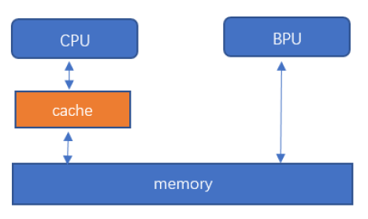

# 数据类型和数据结构

## 版本信息类

``HB_DNN_VERSION_MAJOR``

    #define HB_DNN_VERSION_MAJOR 1U

DNN主版本号信息。

``HB_DNN_VERSION_MINOR``

    #define HB_DNN_VERSION_MINOR 1U

DNN次版本号信息。

``HB_DNN_VERSION_PATCH``

    #define HB_DNN_VERSION_PATCH 0U

DNN补丁版本号信息。

:::info 备注

  注意，本小节中的版本信息类型的版本号随版本变化有所不同，此处的版本号仅供参考，实际版本请以您获取到的发布物为准。
:::

## 模型类

``HB_DNN_TENSOR_MAX_DIMENSIONS``

    #define HB_DNN_TENSOR_MAX_DIMENSIONS 8

张量最大的维度设置为 ``8``。

``HB_DNN_INITIALIZE_INFER_CTRL_PARAM``

    #define HB_DNN_INITIALIZE_INFER_CTRL_PARAM(param) \
    {                                                 \
        (param)->bpuCoreId = HB_BPU_CORE_ANY;         \
        (param)->dspCoreId = HB_DSP_CORE_ANY;         \
        (param)->priority = HB_DNN_PRIORITY_LOWEST;   \
        (param)->more = false;                        \
        (param)->customId = 0;                        \
        (param)->reserved1 = 0;                       \
        (param)->reserved2 = 0;                       \
    }

初始化控制参数。

``hbPackedDNNHandle_t``

    typedef void *hbPackedDNNHandle_t;

DNN句柄，指向打包的多个模型。

``hbDNNHandle_t``

    typedef void *hbDNNHandle_t;

DNN句柄，指向单一模型。

``hbDNNTaskHandle_t``

    typedef void *hbDNNTaskHandle_t;

任务句柄，指向一个任务。

``hbDNNTensorLayout``

    typedef enum {
      HB_DNN_LAYOUT_NHWC = 0,
      HB_DNN_LAYOUT_NCHW = 2,
      HB_DNN_LAYOUT_NONE = 255,
    } hbDNNTensorLayout;

张量的排布形式。 ``NHWC`` 分别代表Number、Height、Width和Channel。 

+ 成员

    | 成员名称           | 描述              |
    |------------------------|-----------------------|
    | ``HB_DNN_LAYOUT_NONE`` | 没有定义排布形式。    |
    | ``HB_DNN_LAYOUT_NHWC`` | 排布形式为 ``NHWC``。 |
    | ``HB_DNN_LAYOUT_NCHW`` | 排布形式为 ``NCHW``。 |

``hbDNNDataType``

    typedef enum {
      HB_DNN_IMG_TYPE_Y,
      HB_DNN_IMG_TYPE_NV12,
      HB_DNN_IMG_TYPE_NV12_SEPARATE,
      HB_DNN_IMG_TYPE_YUV444,
      HB_DNN_IMG_TYPE_RGB,
      HB_DNN_IMG_TYPE_BGR,
      HB_DNN_TENSOR_TYPE_S4,
      HB_DNN_TENSOR_TYPE_U4,
      HB_DNN_TENSOR_TYPE_S8,
      HB_DNN_TENSOR_TYPE_U8,
      HB_DNN_TENSOR_TYPE_F16,
      HB_DNN_TENSOR_TYPE_S16,
      HB_DNN_TENSOR_TYPE_U16,
      HB_DNN_TENSOR_TYPE_F32,
      HB_DNN_TENSOR_TYPE_S32,
      HB_DNN_TENSOR_TYPE_U32,
      HB_DNN_TENSOR_TYPE_F64,
      HB_DNN_TENSOR_TYPE_S64,
      HB_DNN_TENSOR_TYPE_U64,
      HB_DNN_TENSOR_TYPE_MAX
    } hbDNNDataType;

张量的类型。 ``S`` 代表有符号， ``U`` 代表无符号， ``F`` 代表浮点型，后面的数字代表bit数。

``HB_DNN_IMG_TYPE_NV12`` 与 ``HB_DNN_IMG_TYPE_NV12_SEPARATE`` 都代表NV12的数据，只是在存储上有差异。

推理NV12输入的模型时，用户可根据实际情况更改张量的 ``tensorType`` 属性为 ``HB_DNN_IMG_TYPE_NV12`` 或 ``HB_DNN_IMG_TYPE_NV12_SEPARATE``。

+ 成员

    | 成员名称                      | 描述                              |
    |-----------------------------------|-----------------------------------|
    | ``HB_DNN_IMG_TYPE_Y``             | 张量类型为仅有Y通道的图片。           |
    | ``HB_DNN_IMG_TYPE_NV12``       | 张量类型为一张NV12的图片。            |
    | ``HB_DNN_IMG_TYPE_NV12_SEPARATE`` | 张量类型为Y通道及UV通道为输入的图片。 |
    | ``HB_DNN_IMG_TYPE_YUV444``        | 张量类型为YUV444为输入的图片。        |
    | ``HB_DNN_IMG_TYPE_RGB``           | 张量类型为RGB为输入的图片。           |
    | ``HB_DNN_IMG_TYPE_BGR``           | 张量类型为BGR为输入的图片。           |
    | ``HB_DNN_TENSOR_TYPE_S4``         | 张量类型为有符号4bit。                |
    | ``HB_DNN_TENSOR_TYPE_U4``         | 张量类型为无符号4bit。                |
    | ``HB_DNN_TENSOR_TYPE_S8``         | 张量类型为有符号8bit。                |
    | ``HB_DNN_TENSOR_TYPE_U8``         | 张量类型为无符号8bit。                |
    | ``HB_DNN_TENSOR_TYPE_F16``        | 张量类型为浮点型16bit。               |
    | ``HB_DNN_TENSOR_TYPE_S16``        | 张量类型为有符号16bit。               |
    | ``HB_DNN_TENSOR_TYPE_U16``        | 张量类型为无符号16bit。               |
    | ``HB_DNN_TENSOR_TYPE_F32``        | 张量类型为浮点型32bit。               |
    | ``HB_DNN_TENSOR_TYPE_S32``        | 张量类型为有符号32bit。               |
    | ``HB_DNN_TENSOR_TYPE_U32``        | 张量类型为无符号32bit。               |
    | ``HB_DNN_TENSOR_TYPE_F64``        | 张量类型为浮点型64bit。               |
    | ``HB_DNN_TENSOR_TYPE_S64``        | 张量类型为有符号64bit。               |
    | ``HB_DNN_TENSOR_TYPE_U64``        | 张量类型为无符号64bit。               |
    | ``HB_DNN_TENSOR_TYPE_MAX``        | 代表最大的张量类型编号。              |

``hbDNNTensorShape``

    typedef struct {
      int32_t dimensionSize[HB_DNN_TENSOR_MAX_DIMENSIONS];
      int32_t numDimensions;
    } hbDNNTensorShape;

张量的形状。例如一张224x224的bgr彩色空间的图片 ``numDimensions=4``，若排布形式为NHWC，
则 ``dimensionSize`` 数组中按顺序存储图片 ``Number=1``、 ``Height=224``、 ``Width=224``、 ``Channel=3``。

+ 成员

    |    成员名称   |       描述       |
    |-------------------|----------------------|
    | ``dimensionSize`` | 张量每个维度的大小。 |
    | ``numDimensions`` |     张量的维度。     |

``hbDNNQuantiShift``

    typedef struct {
      int32_t shiftLen;
      uint8_t *shiftData;
    } hbDNNQuantiShift;

量化/反量化的移位数据。

**对于输入：** 若采集到浮点数据 ``data[i]``, 对应的移位数据是 ``shift[i]``， 则送入模型的推理数据为: :math:`data[i] * (1 << shift[i])` 取整；

**对于输出：** 若推理结果 ``data[i]``, 对应的移位数据是 ``shift[i]``， 则最终的推理结果为： :math:`data[i] / (1 << shift[i])`。

:::caution 注意

  其中 ``shiftLen`` 由数据 ``data`` 按照 ``per-axis`` 或 ``per-tensor`` （反）量化方式决定。
  当数据 ``data`` 按 ``per-tensor`` （反）量化时， ``shiftLen`` 等于 ``1``，此时不需要关注 ``quantizeAxis`` 数值；否则等于数据 ``data`` 的第 ``quantizeAxis`` 维度大小。
:::

+ 成员

    | 成员名称  | 描述           |
    |---------------|--------------------|
    | ``shiftLen``  | 移位数据的长度。   |
    | ``shiftData`` | 移位数据的首地址。 |

``hbDNNQuantiScale``

    typedef struct {
      int32_t scaleLen;
      float *scaleData;
      int32_t zeroPointLen;
      int8_t *zeroPointData;
    } hbDNNQuantiScale;

量化/反量化的缩放数据。

**对于输入：** 若采集到浮点数据 ``data[i]``, 对应的缩放数据是 ``scale[i]``， 零点偏移数据是 ``zeroPoint[i]``，则送入模型的推理数据为: :math:`g((data[i] / scale[i]) + zeroPoint[i])` , 其中： :math:`g(x) = clip(nearbyint(x))`, 使用fesetround(FE_TONEAREST)舍入方法, 截断到：U8: :math:`g(x)∈[0, 255]`, S8: :math:`g(x)∈[-128, 127]`;

**对于输出：** 若推理结果 ``data[i]``, 对应的缩放数据是 ``scale[i]``， 零点偏移数据是 ``zeroPoint[i]``，则最终的推理结果为： :math:`(data[i] - zeroPoint[i])* scale[i]`。

:::caution 注意

  其中 ``scaleLen`` 由数据 ``data`` 按照 ``per-axis`` 或 ``per-tensor`` （反）量化方式决定。
  当数据 ``data`` 按 ``per-tensor`` （反）量化时， ``scaleLen`` 等于 ``1``，此时不需要关注 ``quantizeAxis`` 数值；
  否则等于数据 ``data`` 第 ``quantizeAxis`` 维度大小。 ``zeroPointLen`` 与 ``scaleLen`` 保持一致。
:::

+ 成员

    |成员名称    |描述       |
    |---------------|--------------------|
    |``scaleLen``	   |     缩放数据的长度。|
    |``scaleData``	   |     缩放数据的首地址。|
    |``zeropointLen``  |    零点偏移数据的长度。|
    |``zeropointData`` |   零点偏移数据的首地址。|

``hbDNNQuantiType``

    typedef enum {
      NONE, 
      SHIFT,
      SCALE,
    } hbDNNQuantiType;

定点浮点转换的量化/反量化类型。
``NONE`` 代表不需要对数据做任何处理； ``SHIFT`` 类型对应的量化/反量化参数存储在 ``hbDNNQuantiShift`` 结构体中， ``SCALE`` 对应的量化/反量化参数存储在 ``hbDNNQuantiScale`` 结构体中。

+ 成员

    |成员名称     |描述       |
    |-----------|----------------|
    |``NONE``   |  没有量化。|
    |``SHIFT``  |  量化类型为 ``SHIFT``。|
    |``SCALE``  |  量化类型为 ``SCALE``。|

``hbDNNTensorProperties``

    typedef struct {
      hbDNNTensorShape validShape;
      hbDNNTensorShape alignedShape;
      int32_t tensorLayout;
      int32_t tensorType;
      hbDNNQuantiShift shift;
      hbDNNQuantiScale scale;
      hbDNNQuantiType quantiType;
      int32_t quantizeAxis;
      int32_t alignedByteSize;
      int32_t stride[HB_DNN_TENSOR_MAX_DIMENSIONS];
    } hbDNNTensorProperties;

张量的信息。

其中 ``alignedShape`` 从模型信息中获取时，为张量对齐后的形状；
在准备完输入数据之后， ``alignedShape`` 需要与张量真实输入的形状保持一致。

+ 成员

    |成员名称     |描述       |
    |-----------|----------------|
    |``validShape``     |   张量有效内容的形状。|
    |``alignedShape``   |   张量对齐内容的形状。|
    |``tensorLayout``   |   张量的排布形式。|
    |``tensorType``     |   张量的类型。|
    |``shift``          |   量化偏移量。|
    |``scale``          |   量化缩放量。|
    |``quantiType``     |   量化类型。|
    |``quantizeAxis``   |   量化通道，仅按per-axis量化时生效。|
    |``alignedByteSize``|   张量对齐内容的内存大小。|
    |``stride``         |   张量中validShape各维度步长|

:::info 备注

  通过接口获取的张量信息为模型要求的，您可以根据实际输入修改对应的张量信息，目前只允许修改 ``alignedShape`` 和 ``tensorType`` 的信息，而且必须符合要求。
  
  ``alignedShape``： 
  
  1. 若您根据 ``alignedShape`` 准备输入，则无需更改 ``alignedShape`` 。

  2. 若您根据 ``validShape`` 准备输入，则需更改 ``alignedShape`` 为  ``validShape`` ，推理库内部会对数据进行padding操作。
  
  ``tensorType``：

  推理NV12输入的模型时，您可根据实际情况更改张量的 ``tensorType`` 属性为 ``HB_DNN_IMG_TYPE_NV12`` 或 ``HB_DNN_IMG_TYPE_NV12_SEPARATE`` 。
:::

``hbDNNTaskPriority``

    typedef enum {
      HB_DNN_PRIORITY_LOWEST = 0,
      HB_DNN_PRIORITY_HIGHEST = 255,
      HB_DNN_PRIORITY_PREEMP = HB_DNN_PRIORITY_HIGHEST,
    } hbDNNTaskPriority;

Task优先级配置，提供默认参数。

``hbDNNTensor``

    typedef struct {
      hbSysMem sysMem[4];
      hbDNNTensorProperties properties;
    } hbDNNTensor;

张量。用于存放输入输出的信息。其中 ``NV12_SEPARATE`` 类型的张量需要用2个 ``hbSysMem``，其余都为1个。

+ 成员
  
    |成员名称     |描述       |
    |-----------|----------------|
    |``sysMem``      |     存放张量的内存。|
    |``properties``  |     张量的信息。|

``hbDNNRoi``

    typedef struct {
      int32_t left;
      int32_t top;
      int32_t right;
      int32_t bottom;
    } hbDNNRoi;

矩形的感兴趣区域。:math:`W∈[left, right], H∈[top, bottom]`。

+ 成员
  
    |成员名称     |描述       |
    |-----------|----------------|
    |``left``   |  感兴趣区域左上点宽度像素点。|
    |``top``    |  感兴趣区域左上点高度像素点。|
    |``right``  |  感兴趣区域右下点宽度像素点。|
    |``bottom`` |  感兴趣区域右下点高度像素点。|

``hbDNNInferCtrlParam``

    typedef struct {
      int32_t bpuCoreId;
      int32_t dspCoreId;
      int32_t priority;
      int32_t more;
      int64_t customId;
      int32_t reserved1;
      int32_t reserved2;
    } hbDNNInferCtrlParam;

模型推理的控制参数。
``bpuCoreId`` 与 ``dspCoreId`` 用于控制推理模型BPU和DSP节点使用的核；X3不支持DSP推理，``dspCoreId`` 仅作为占位符使用。
其中 ``more`` 参数用于小模型批量处理场景，当希望所有任务都执行完再获得输出时，除最后一个任务设置 ``more`` 为 ``0`` 外，
之前的任务 ``more`` 都设置为 ``1``，最多支持255个小模型的推理，小模型为resizer模型时，每一个roi都可能会被算作一个小模型。
``customId`` 参数用于用户自定义优先级，定义task的优先级大小，例如：时间戳、frame id等，数值越小优先级越高。优先级：priority > customId。

+ 成员

    |成员名称     |描述       |
    |-----------|----------------|
    |``bpuCoreId``	|  BPU核ID。|
    |``dspCoreId``	|  DSP核ID。|
    |``priority``	  |  任务优先级。|
    |``more``		    |  该任务后续是否有跟随任务。|
    |``customId``   |  自定义优先级。|
    |``reserved1``	|  保留字段1。|
    |``Reserved2``	|  保留字段2。|

## 系统类

``hbBPUCore``

    typedef enum {
      HB_BPU_CORE_ANY = 0,
      HB_BPU_CORE_0 = (1 << 0),
      HB_BPU_CORE_1 = (1 << 1)
    } hbBPUCore;

BPU核枚举。

+ 成员

    |成员名称     |描述       |
    |-----------|----------------|
    |``HB_BPU_CORE_ANY`` |  任意的BPU核。|
    |``HB_BPU_CORE_0``   |   BPU核0。|
    |``HB_BPU_CORE_1``   |   BPU核1。|

``hbDSPCore``

    typedef enum {
      HB_DSP_CORE_ANY = 0,
      HB_DSP_CORE_0 = (1 << 0),
      HB_DSP_CORE_1 = (1 << 1)
    } hbDSPCore;

DSP核枚举。

+ 成员

    |成员名称     |描述       |
    |-----------|----------------|
    |``HB_DSP_CORE_ANY``|   任意的DSP核。|
    |``HB_DSP_CORE_0``   |  DSP核0。|
    |``HB_DSP_CORE_1``   |  DSP核1。|

``hbSysMem``

    typedef struct {
      uint64_t phyAddr;
      void *virAddr;
      uint32_t memSize;
    } hbSysMem;

系统内存结构体，用于申请系统内存。

+ 成员

    |成员名称     |描述       |
    |-----------|----------------|
    |``phyAddr`` |   物理地址。|
    |``virAddr`` |   虚拟地址。|
    |``memSize`` |   内存大小。|

``hbSysMemFlushFlag``

    typedef enum {
      HB_SYS_MEM_CACHE_INVALIDATE = 1,
      HB_SYS_MEM_CACHE_CLEAN = 2
    } hbSysMemFlushFlag;

系统内存与缓存同步参数。CPU与内存之间有一个缓存区，导致缓存中内容与内存中内容会出现不同步的情况，为了每次都能够拿到最新的数据，
我们需要在CPU读前、写后进行数据更新。CPU读前，将内存中数据更新到缓存中。CPU写后，将缓存中数据更新到内存中。

+ 成员

    |成员名称     |描述       |
    |-----------|----------------|
    | ``HB_SYS_MEM_CACHE_INVALIDATE``  | 将内存同步到缓存中，CPU读前使用。     |
    | ``HB_SYS_MEM_CACHE_CLEAN``       | 将缓存数据同步到内存中，CPU写后使用。 |

## 前处理类

``HB_DNN_INITIALIZE_RESIZE_CTRL_PARAM``

    #define HB_DNN_INITIALIZE_RESIZE_CTRL_PARAM(param)     \
      {                                                     \
        (param)->bpuCoreId = HB_BPU_CORE_ANY;              \
        (param)->resizeType = HB_DNN_RESIZE_TYPE_BILINEAR; \
        (param)->priority = HB_DNN_PRIORITY_LOWEST;        \
        (param)->reserved1 = 0;                             \
        (param)->reserved2 = 0;                             \
        (param)->reserved3 = 0;                             \
        (param)->reserved4 = 0;                             \
      }

初始化控制参数。

``hbDNNResizeType``

    typedef enum {
      HB_DNN_RESIZE_TYPE_BILINEAR = 0,
    } hbDNNResizeType;

``Resize`` 类型。

+ 成员

    |成员名称     |描述       |
    |-----------|----------------|
    |``HB_DNN_RESIZE_TYPE_BILINEAR`` |  Resize类型为双线性插值。|

``hbDNNResizeCtrlParam``

    typedef struct {
      int32_t bpuCoreId;
      int32_t priority;
      hbDNNResizeType resizeType;
      int32_t reserved1;
      int32_t reserved2;
      int32_t reserved3;
      int32_t reserved4;
    } hbDNNResizeCtrlParam;

``Resize`` 的控制参数。

+ 成员

    |成员名称     |描述       |
    |-----------|----------------|
    |``bpuCoreId``  | BPU核ID。|
    |``priority``   | 任务优先级。|
    |``resizeType`` | Resize类型。|
    |``reserved1``  | 保留字段1。|
    |``Reserved2``  | 保留字段2。|
    |``Reserved3``  | 保留字段3。|
    |``Reserved4``  | 保留字段4。|
