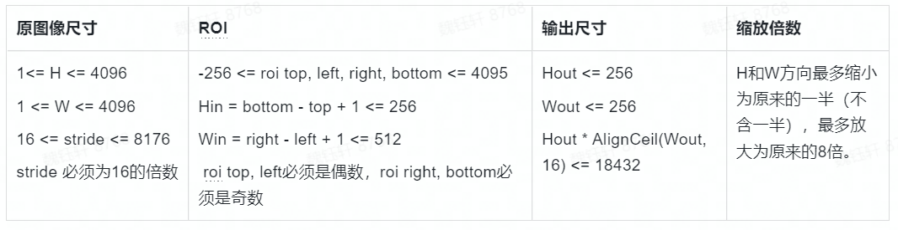

# 模型推理 API

## hbDNNInfer()

**【函数原型】**  

``int32_t hbDNNInfer(hbDNNTaskHandle_t *taskHandle, hbDNNTensor **output, const hbDNNTensor *input, hbDNNHandle_t dnnHandle, hbDNNInferCtrlParam *inferCtrlParam)``

**【功能描述】** 

根据输入参数执行推理任务。调用方可以跨函数、跨线程使用返回的 ``taskHandle``。

**【参数】**

- [out]     ``taskHandle``          任务句柄指针。
- [in/out]  ``output``              推理任务的输出。
- [in]      ``input``               推理任务的输入。
- [in]      ``dnnHandle``           DNN句柄指针。
- [in]      ``inferCtrlParam``      控制推理任务的参数。

**【返回类型】** 

- 返回 ``0`` 则表示API成功执行，否则执行失败。

:::info 备注

  使用该接口提交任务时应提前将 ``taskHandle`` 置为 ``nullptr``，除非是给指定 ``taskHandle`` 追加任务（即使用 ``inferCtrlParam::more`` 功能）。

  最多支持同时存在32个模型任务。

  对于batch模型，允许分开设置输入张量的内存地址。例如：模型的输入validShape/alignedShape为[4, 3, 224, 224], 可以申请四个hbDNNTensor， 每个hbDNNTensor的validShape/alignedShape都设置为[1, 3, 224, 224],存放每个batch的数据。当模型有多个输入时， ``input`` 的顺序应为input0[batch0], input0[batch1], ..., inputn[batch0], inputn[batch1], ...。
:::

## hbDNNRoiInfer()

**【函数原型】**  

``int32_t hbDNNRoiInfer(hbDNNTaskHandle_t *taskHandle, hbDNNTensor **output, const hbDNNTensor *input, hbDNNRoi *rois, int32_t roiCount, hbDNNHandle_t dnnHandle, hbDNNInferCtrlParam *inferCtrlParam)``

**【功能描述】** 

根据输入参数执行ROI推理任务。根据输入参数执行ROI推理任务。调用方可以跨函数、跨线程使用返回的 ``taskHandle``。

**【参数】**

- [out]     ``taskHandle``       任务句柄指针。
- [in/out]  ``output``           推理任务的输出。
- [in]      ``input``            推理任务的输入。
- [in]      ``rois``             Roi框信息。
- [in]      ``roiCount``         Roi框数量。
- [in]      ``dnnHandle``        dnn句柄指针。
- [in]      ``inferCtrlParam``   控制推理任务的参数。

**【返回类型】** 

- 返回 ``0`` 则表示API成功执行，否则执行失败。

:::info 备注

  若使用 **RDK X3** ,请遵循如下规则：
  | 该接口支持批处理操作，假设需要推理的数据批数为 ``batch``，模型输入个数为 ``input_count``，其中resizer输入源的数量为 ``resizer_count``。
  | 准备输入参数 ``input``：第i个 ``batch`` 对应的 ``input`` 数组下标范围是 :math:`[i * input\_count`, :math:`(i + 1) * input\_count)，i=[0,batch)`;
  | 准备输入参数 ``rois``：每个resizer输入源的输入都应匹配一个roi，第i个 ``batch`` 对应的 ``rois`` 数组下标范围是 :math:`[i * resizer\_count`, :math:`(i + 1) * resizer\_count)，i=[0,batch)`; 每个batch的roi顺序应和输入的顺序保持一致；
  | 关于 ``batch`` 数量限制：其范围应该在[1, 255];

  模型限制：模型需要在编译时将编译参数 ``input_source`` 设置为 ``resizer``, 模型的 h*w 要小于18432;

  使用该接口提交任务时应提前将 ``taskHandle`` 置为 ``nullptr``，除非是给指定 ``taskHandle`` 追加任务（即使用 ``inferCtrlParam::more`` 功能）。

  ``roi`` 的 ``left`` 和 ``top`` 必须是偶数， ``right`` 和 ``bottom`` 必须是奇数。

  ``roi`` 大小要求是 :math:`16 <= width < 256`, :math:`16 <= height < 256`。

  缩放范围是 :math:`0.5 < roi / src <=8`。

  最多支持同时存在32个模型任务。

  API示例： 可参考[模型推理DNN API使用示例说明文档](/toolchain_development/intermediate/runtime_sample#模型推理dnn-api使用示例说明)的 ``roi_infer.sh`` 说明。

  模型限制：在模型转换时，将编译参数 input_source 设置为 {'input_name': 'resizer'}即可生成resizer模型，具体参数配置细节可参考[PTQ量化原理及步骤说明的转换模型](/toolchain_development/intermediate/ptq_process#model_conversion)中的介绍。

  

  目前也支持多输入的nv12数据，resizer常用的输出尺寸(HxW)：128x128、128x64、64x128、160x96
:::

:::info 备注

  若使用 **RDK Ultra** ,请遵循如下规则：

  - ``input_count`` : 模型输入分支数量
  - ``output_count`` : 模型输出分支数量
  - ``resizer_count`` : 模型输入源为 resizer 的分支数量（≤input_count），模型处理一批数据时，一个 resizer 输入源分支处理一个 roi
  - ``roiCount`` : roi 总数，其数值为 ``batch * resizer_count``
  - ``data_batch`` : 模型需要推理的数据批数，其数值为 ``roiCount / resizer_count``
  - ``model_batch`` : 模型内部的 batch 数量。即模型实际推理时，输入给模型的 batch_size。地平线工具链支持将模型编译为 batch model

  输入/输出示例说明：

  以较为复杂的多输入模型为例，假设模型有 3 个输入分支（2个resizer输入源，1个ddr输入源）和 1 个输出分支，并以 ``batch=2`` 编译，模型共需处理 3 批数据共 6 个 roi（即每批数据有2个roi），那么现有如下信息：

  - ``input_count`` = 3
  - ``output_count`` = 1
  - ``resizer_count`` = 2
  - ``roiCount`` = 6
  - ``data_batch`` = 3
  - ``model_batch`` = 2

  所以模型推理这 3 批数据需要准备独立地址的 input_tensor 数量为 ``input_count * data_batch = 9``。

  另假设模型输入/输出的静态信息如下：

  - 模型输入（model_info）：

    - tensor_0_resizer: [2, 3, 128, 128]
    - tensor_1_resizer: [2, 3, 256, 256]
    - tensor_2_ddr: [2, 80, 1, 100]

  - 模型输出（model_info）：

    - tensor_out：[2, 100, 1, 56]

  那么模型在推理时的动态信息则为：

  - 模型输入（input_tensors）：

    - [1x3x128x128, 1x3x256x256, 1x80x1x100, 1x3x128x128, 1x3x256x256, 1x80x1x100, 1x3x128x128, 1x3x256x256, 1x80x1x100]

  - 模型输出（output_tensors）：
  
    - [4x100x1x56]

  其中，因为 ``model_batch = 2``，所以底层 BPU 单次执行可处理 2 批数据；又因为 ``data_batch = 3``，所以 output_tensor 最高维的计算公式为 ``ceil[(data_batch) / model_batch] * model_batch``，可见其一定为 ``model_batch`` 的整数倍，这也是 BPU 硬件指令要求，缺少的输入会自动忽略计算。

  接口限制说明：

  - 关于 ``batch`` 数量限制：其范围应该在[1, 255]。
  - 使用该接口提交任务时应提前将 ``taskHandle`` 置为 ``nullptr``，除非是给指定 ``taskHandle`` 追加任务（即使用 ``inferCtrlParam::more`` 功能）。
  - ``roi`` 大小要求是 :math:`2 <= width <= 4096`, :math:`2 <= height <= 4096`。
  - 原图尺寸要求是 :math:`1 <= W <= 4096`, :math:`16 <= stride <= 131072`， ``stride`` 必须是16的倍数。
  - 输出尺寸要求是 :math:`2 <= Wout`, :math:`2 <= Hout`。
  - roi缩放倍数限制 :math:`0 <= step <= 262143`，step计算公式 :math:`step = ((src\_len - 1)*65536 + (dst\_len - 1)/2)/(dst\_len - 1)`，其中src_len为roi的W或H，dst_len为模型要求的W或H。
  - 最多支持同时存在32个模型任务。
:::

## hbDNNWaitTaskDone()

**【函数原型】**  

``int32_t hbDNNWaitTaskDone(hbDNNTaskHandle_t taskHandle, int32_t timeout)``

**【功能描述】** 

等待任务完成或超时。

**【参数】**

- [in]  ``taskHandle``         任务句柄指针。
- [in]  ``timeout``            超时配置（单位：毫秒）。

**【返回类型】** 

- 返回 ``0`` 则表示API成功执行，否则执行失败。

:::info 备注

  1. ``timeout > 0`` 表示等待时间；
  2. ``timeout <= 0`` 表示一直等待，直到任务完成。
:::

## hbDNNReleaseTask()

**【函数原型】**  

``int32_t hbDNNReleaseTask(hbDNNTaskHandle_t taskHandle)``

**【功能描述】** 

释放任务，如果任务未执行则会直接取消并释放任务，如果已经执行则会在运行到某些节点后取消并释放任务。

**【参数】**

- [in]  ``taskHandle``         任务句柄指针。

**【返回类型】** 

- 返回 ``0`` 则表示API成功执行，否则执行失败。
