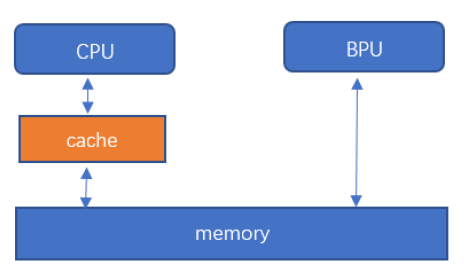
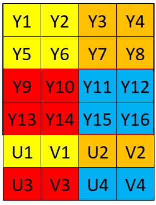

# 6.3 模型推理接口说明

:::tip 小技巧

  模型推理API接口所用的头文件和lib库文件，请在 `《交付物说明》 <../quant_toolchain_development/horizon_intermediate/env_install.html#id4>`_ 的 package/host/host_package/xj3_aarch64/dnn文件夹获取。 
:::

## 模型推理库版本信息获取 API

### hbDNNGetVersion()

**【函数原型】**  

``const char *hbDNNGetVersion()``

**【功能描述】**  

获取 ``DNN`` 预测库版本信息。

**【参数】**

无

**【返回类型】**  

返回版本信息。

## 模型加载/释放 API

### hbDNNInitializeFromFiles()

**【函数原型】**  

``int32_t hbDNNInitializeFromFiles(hbPackedDNNHandle_t *packedDNNHandle, const char **modelFileNames, int32_t modelFileCount)``

**【功能描述】**  

从文件完成对 ``packedDNNHandle`` 的创建和初始化。

**【参数】**

- [out] ``packedDNNHandle``  Horizon DNN句柄，指向多个模型。
- [in]  ``modelFileNames``   模型文件的路径。
- [in]  ``modelFileCount``   模型文件的个数。

**【返回类型】**  

- 返回 ``0`` 则表示API成功执行，否则执行失败。

### hbDNNInitializeFromDDR()

**【函数原型】**  

``int32_t hbDNNInitializeFromDDR(hbPackedDNNHandle_t *packedDNNHandle, const void **modelData, int32_t *modelDataLengths, int32_t modelDataCount)``

**【功能描述】**  

从内存完成对 ``packedDNNHandle`` 的创建和初始化。

**【参数】**

- [out] ``packedDNNHandle``  Horizon DNN句柄，指向多个模型。
- [in]  ``modelData``        模型文件的指针。
- [in]  ``modelDataLengths`` 模型数据的长度。
- [in]  ``modelDataCount``   模型数据的个数。

**【返回类型】**  

- 返回 ``0`` 则表示API成功执行，否则执行失败。

### hbDNNRelease()

**【函数原型】**  

``int32_t hbDNNRelease(hbPackedDNNHandle_t packedDNNHandle)``

**【功能描述】**  

将 ``packedDNNHandle`` 所指向的模型释放。

**【参数】**

- [in] ``packedDNNHandle``  Horizon DNN句柄，指向多个模型。

**【返回类型】**  

- 返回 ``0`` 则表示API成功执行，否则执行失败。

## 模型信息获取 API

### hbDNNGetModelNameList()

**【函数原型】**  

``int32_t hbDNNGetModelNameList(const char ***modelNameList, int32_t *modelNameCount, hbPackedDNNHandle_t packedDNNHandle)``

**【功能描述】**  

获取 ``packedDNNHandle`` 所指向模型的名称列表和个数。

**【参数】**

- [out] ``modelNameList``    模型名称列表。
- [out] ``modelNameCount``   模型名称个数。
- [in]  ``packedDNNHandle``  Horizon DNN句柄，指向多个模型。

**【返回类型】**  

- 返回 ``0`` 则表示API成功执行，否则执行失败。

### hbDNNGetModelHandle()

**【函数原型】**  

``int32_t hbDNNGetModelHandle(hbDNNHandle_t *dnnHandle, hbPackedDNNHandle_t packedDNNHandle, const char *modelName)``

**【功能描述】** 

从 ``packedDNNHandle`` 所指向模型列表中获取一个模型的句柄。

**【参数】**

- [out] ``dnnHandle``         DNN句柄，指向一个模型。
- [in]  ``packedDNNHandle``   DNN句柄，指向多个模型。
- [in]  ``modelName``         模型名称。

**【返回类型】**  

- 返回 ``0`` 则表示API成功执行，否则执行失败。

### hbDNNGetInputCount()

**【函数原型】**  

``int32_t hbDNNGetInputCount(int32_t *inputCount, hbDNNHandle_t dnnHandle)``

**【功能描述】** 

获取 ``dnnHandle`` 所指向模型输入张量的个数。

**【参数】**

- [out] ``inputCount``  模型输入张量的个数。
- [in]  ``dnnHandle``   DNN句柄，指向一个模型。

**【返回类型】**  

- 返回 ``0`` 则表示API成功执行，否则执行失败。

### hbDNNGetInputName()

**【函数原型】**  

``int32_t hbDNNGetInputName(const char **name, hbDNNHandle_t dnnHandle, int32_t inputIndex)``

**【功能描述】** 

获取模型输入张量的 ``name``

**【参数】**

- [out] ``name``        模型输入张量的名称。
- [in]  ``dnnHandle``   DNN句柄，指向一个模型。
- [in]  ``inputIndex``  模型输入张量的编号。

**【返回类型】**  

- 返回 ``0`` 则表示API成功执行，否则执行失败。

### hbDNNGetInputTensorProperties()

**【函数原型】**  

``int32_t hbDNNGetInputTensorProperties(hbDNNTensorProperties *properties, hbDNNHandle_t dnnHandle, int32_t inputIndex)``

**【功能描述】** 

获取 ``dnnHandle`` 所指向模型特定输入张量的属性。

**【参数】**

- [out] ``properties``   输入张量的信息。
- [in]  ``dnnHandle``    DNN句柄，指向一个模型。
- [in]  ``inputIndex``   模型输入张量的编号。

**【返回类型】**  

- 返回 ``0`` 则表示API成功执行，否则执行失败。

### hbDNNGetOutputCount()

**【函数原型】**  

``int32_t hbDNNGetOutputCount(int32_t *outputCount, hbDNNHandle_t dnnHandle)``

**【功能描述】** 

获取 ``dnnHandle`` 所指向模型输出张量的个数。

**【参数】**

- [out] ``outputCount``  模型输出张量的个数。
- [in]  ``dnnHandle``    DNN句柄，指向一个模型。

**【返回类型】**  

- 返回 ``0`` 则表示API成功执行，否则执行失败。

### hbDNNGetOutputName()

**【函数原型】**  

``int32_t hbDNNGetOutputName(const char **name, hbDNNHandle_t dnnHandle, int32_t outputIndex)``

**【功能描述】** 

获取模型输出张量的 ``name``

**【参数】**

- [out] ``name``        模型输出张量的名称。
- [in]  ``dnnHandle``   DNN句柄，指向一个模型。
- [in]  ``outputIndex``  模型输出张量的编号。

**【返回类型】**  

- 返回 ``0`` 则表示API成功执行，否则执行失败。

### hbDNNGetOutputTensorProperties()

**【函数原型】**  

``int32_t hbDNNGetOutputTensorProperties(hbDNNTensorProperties *properties, hbDNNHandle_t dnnHandle, int32_t outputIndex)``

**【功能描述】** 

获取 ``dnnHandle`` 所指向模型特定输出张量的属性。

**【参数】**

- [out] ``properties``    输出张量的信息。
- [in]  ``dnnHandle``     DNN句柄，指向一个模型。
- [in]  ``outputIndex``   模型输出张量的编号。

**【返回类型】** 

- 返回 ``0`` 则表示API成功执行，否则执行失败。

## 模型推理 API

### hbDNNInfer()

**【函数原型】**  

``int32_t hbDNNInfer(hbDNNTaskHandle_t *taskHandle, hbDNNTensor **output, const hbDNNTensor *input, hbDNNHandle_t dnnHandle, hbDNNInferCtrlParam *inferCtrlParam)``

**【功能描述】** 

根据输入参数执行推理任务。

**【参数】**

- [out]     ``taskHandle``          任务句柄指针。
- [in/out]  ``output``              推理任务的输出。
- [in]      ``input``               推理任务的输入。
- [in]      ``dnnHandle``           DNN句柄指针。
- [in]      ``inferCtrlParam``      控制推理任务的参数。

**【返回类型】** 

- 返回 ``0`` 则表示API成功执行，否则执行失败。

:::info 备注

  使用该接口提交任务时应提前将 ``taskHandle`` 置为 ``nullptr``，除非是给指定 ``taskHandle`` 追加任务（即使用 ``inferCtrlParam::more`` 功能）。

  最多支持同时存在32个模型任务。

  对于batch模型，允许分开设置输入张量的内存地址。例如：模型的输入validShape/alignedShape为[4, 3, 224, 224], 可以申请四个hbDNNTensor， 每个hbDNNTensor的validShape/alignedShape都设置为[1, 3, 224, 224],存放每个batch的数据。当模型有多个输入时， ``input`` 的顺序应为input0[batch0], input0[batch1], ..., inputn[batch0], inputn[batch1], ...。
:::

### hbDNNRoiInfer()

**【函数原型】**  

``int32_t hbDNNRoiInfer(hbDNNTaskHandle_t *taskHandle, hbDNNTensor **output, const hbDNNTensor *input, hbDNNRoi *rois, int32_t roiCount, hbDNNHandle_t dnnHandle, hbDNNInferCtrlParam *inferCtrlParam)``

**【功能描述】** 

根据输入参数执行ROI推理任务。

**【参数】**

- [out]     ``taskHandle``       任务句柄指针。
- [in/out]  ``output``           推理任务的输出。
- [in]      ``input``            推理任务的输入。
- [in]      ``rois``             Roi框信息。
- [in]      ``roiCount``         Roi框数量。
- [in]      ``dnnHandle``        dnn句柄指针。
- [in]      ``inferCtrlParam``   控制推理任务的参数。

**【返回类型】** 

- 返回 ``0`` 则表示API成功执行，否则执行失败。

:::info 备注

  | 该接口支持批处理操作，假设需要推理的数据批数为 ``batch``，模型输入个数为 ``input_count``，其中resizer输入源的数量为 ``resizer_count``。
  | 准备输入参数 ``input``：第i个 ``batch`` 对应的 ``input`` 数组下标范围是 :math:`[i * input\_count`, :math:`(i + 1) * input\_count)，i=[0,batch)`;
  | 准备输入参数 ``rois``：每个resizer输入源的输入都应匹配一个roi，第i个 ``batch`` 对应的 ``rois`` 数组下标范围是 :math:`[i * resizer\_count`, :math:`(i + 1) * resizer\_count)，i=[0,batch)`; 每个batch的roi顺序应和输入的顺序保持一致；
  | 关于 ``batch`` 数量限制：其范围应该在[1, 255];

  模型限制：模型需要在编译时将编译参数 ``input_source`` 设置为 ``resizer``, 模型的 h*w 要小于18432;

  使用该接口提交任务时应提前将 ``taskHandle`` 置为 ``nullptr``，除非是给指定 ``taskHandle`` 追加任务（即使用 ``inferCtrlParam::more`` 功能）。

  最多支持同时存在32个模型任务。

  API示例： 可参考 `模型推理DNN API使用示例说明文档 <../quant_toolchain_development/horizon_intermediate/horizon_runtime_samples/dnn_api_user_guide/basic-sample.html#api-tutorial>`_ 的 ``roi_infer.sh`` 说明。

  模型限制：在模型转换时，将编译参数 input_source 设置为 {'input_name': 'resizer'}即可生成resizer模型，具体参数配置细节可参考 `PTQ量化原理及步骤说明的转换模型 <../quant_toolchain_development/horizon_intermediate/ptq_user_guide/chapter_model_conversion.html#model-conversion>`_ 中的介绍。

  

  目前也支持多输入的nv12数据，resizer常用的输出尺寸(HxW)：128x128、128x64、64x128、160x96
:::

### hbDNNWaitTaskDone()

**【函数原型】**  

``int32_t hbDNNWaitTaskDone(hbDNNTaskHandle_t taskHandle, int32_t timeout)``

**【功能描述】** 

等待任务完成或超时。

**【参数】**

- [in]  ``taskHandle``         任务句柄指针。
- [in]  ``timeout``            超时配置（单位：毫秒）。

**【返回类型】** 

- 返回 ``0`` 则表示API成功执行，否则执行失败。

:::info 备注

  1. ``timeout > 0`` 表示等待时间；
  2. ``timeout <= 0`` 表示一直等待，直到任务完成。
:::

### hbDNNReleaseTask()

**【函数原型】**  

``int32_t hbDNNReleaseTask(hbDNNTaskHandle_t taskHandle)``

**【功能描述】** 

释放任务，如果任务未执行则会直接取消并释放任务，如果已经执行则会在运行到某些节点后取消并释放任务。

**【参数】**

- [in]  ``taskHandle``         任务句柄指针。

**【返回类型】** 

- 返回 ``0`` 则表示API成功执行，否则执行失败。

## 模型内存操作 API

### hbSysAllocMem()

**【函数原型】**  

``int32_t hbSysAllocMem(hbSysMem *mem, uint32_t size)``

**【功能描述】** 

申请BPU内存。

**【参数】**

- [in]  ``size``                申请内存的大小。
- [out] ``mem``                 内存指针。

**【返回类型】** 

- 返回 ``0`` 则表示API成功执行，否则执行失败。

### hbSysAllocCachedMem()

**【函数原型】**  

``int32_t hbSysAllocCachedMem(hbSysMem *mem, uint32_t size)``

**【功能描述】** 

申请缓存的BPU内存。

**【参数】**

- [in]  ``size``              申请内存的大小。
- [out] ``mem``               内存指针。

**【返回类型】**

- 返回 ``0`` 则表示API成功执行，否则执行失败。

### hbSysFlushMem()

**【函数原型】**  

``int32_t hbSysFlushMem(hbSysMem *mem, int32_t flag)``

**【功能描述】** 

对缓存的BPU内存进行刷新。

**【参数】**

- [in]  ``mem``               内存指针。
- [in]  ``flag``              刷新标志符。

**【返回类型】**

- 返回 ``0`` 则表示API成功执行，否则执行失败。

### hbSysFreeMem()

**【函数原型】**  

``int32_t hbSysFreeMem(hbSysMem *mem)``

**【功能描述】** 

释放BPU内存。

**【参数】**

- [in]  ``mem``               内存指针。

**【返回类型】**

- 返回 ``0`` 则表示API成功执行，否则执行失败。

### hbSysWriteMem()

**【函数原型】**  

``int32_t hbSysWriteMem(hbSysMem *dest, char *src, uint32_t size)``

**【功能描述】** 

写入BPU内存。

**【参数】**

- [out] ``dest``                内存指针。
- [in]  ``src``                 数据指针。
- [in]  ``size``                数据大小。

**【返回类型】**

- 返回 ``0`` 则表示API成功执行，否则执行失败。

### hbSysReadMem()

**【函数原型】**  

``int32_t hbSysReadMem(char *dest, hbSysMem *src, uint32_t size)``

**【功能描述】** 

读取BPU内存。

**【参数】**

- [out] ``dest``               数据指针。
- [in]  ``src``                内存指针。
- [in]  ``size``               数据大小。

**【返回类型】**

- 返回 ``0`` 则表示API成功执行，否则执行失败。

### hbSysRegisterMem()

**【函数原型】**  

``int32_t hbSysRegisterMem(hbSysMem *mem)``

**【功能描述】** 

将已知物理地址的内存区间注册成可被BPU使用的内存标识，得到的内存是cacheable的。

**【参数】**

- [in/out] ``mem``               内存指针。

**【返回类型】**

- 返回 ``0`` 则表示API成功执行，否则执行失败。

### hbSysUnregisterMem()

**【函数原型】**  

``int32_t hbSysUnregisterMem(hbSysMem *mem)``

**【功能描述】** 

注销由 ``hbSysRegisterMem`` 注册的内存标识。

**【参数】**

- [in] ``mem``               内存指针。

**【返回类型】**

- 返回 ``0`` 则表示API成功执行，否则执行失败。

## 模型前处理 API

### hbDNNResize()

**【函数原型】**  

``int32_t hbDNNResize(hbDNNTaskHandle_t *taskHandle, hbDNNTensor *output, const hbDNNTensor *input, const hbDNNRoi *roi, hbDNNResizeCtrlParam *resizeCtrlParam)``

**【功能描述】** 

根据输入参数进行resize任务。

:::info 备注
  此接口为兼容老版本，后续不在维护，若需对模型输入进行Resize，请参考使用 ``hbDNNRoiInfer()`` 函数进行模型推理
:::

**【参数】**

- [out]  ``taskHandle``           任务句柄指针。
- [in/out] ``output``             resize任务的输出。
- [in]   ``input``                resize任务的输入。
- [in]   ``roi``                  输入的roi信息。
- [in]   ``resizeCtrlParam``      控制resize任务的参数。

**【返回类型】**

- 返回 ``0`` 则表示API成功执行，否则执行失败。

:::info 备注

  1. 目前只支持相同 ``hbDNNDataType`` 的resize，并且必须为 ``IMG`` 类型；
  2. 对于 ``HB_DNN_IMG_TYPE_NV12``， ``HB_DNN_IMG_TYPE_NV12_SEPARATE`` 类型的输入，宽和高必须为2的倍数；
  3. 缩放范围是 :math:`dst / src ∈ [1/185, 256)`；
  4. 原图尺寸要求是 :math:`1 <= W <= 4080`, :math:`16 <= stride <= 4080`， ``stride`` 必须是16的倍数；
  5. 输出尺寸要求是 :math:`Wout <= 4080`, :math:`Hout <= 4080`；
  6. ``roi`` 必须在图像的内部。
  7. 最多支持同时存在32个reisze任务。
:::

## 数据类型和数据结构

### 版本信息类

``HB_DNN_VERSION_MAJOR``

    #define HB_DNN_VERSION_MAJOR 1U

DNN主版本号信息。

``HB_DNN_VERSION_MINOR``

    #define HB_DNN_VERSION_MINOR 1U

DNN次版本号信息。

``HB_DNN_VERSION_PATCH``

    #define HB_DNN_VERSION_PATCH 0U

DNN补丁版本号信息。

:::info 备注

  注意，本小节中的版本信息类型的版本号随版本变化有所不同，此处的版本号仅供参考，实际版本请以您获取到的发布物为准。
:::

### 模型类

``HB_DNN_TENSOR_MAX_DIMENSIONS``

    #define HB_DNN_TENSOR_MAX_DIMENSIONS 8

张量最大的维度设置为 ``8``。

``HB_DNN_INITIALIZE_INFER_CTRL_PARAM``

    #define HB_DNN_INITIALIZE_INFER_CTRL_PARAM(param) \
    {                                                 \
        (param)->bpuCoreId = HB_BPU_CORE_ANY;         \
        (param)->dspCoreId = HB_DSP_CORE_ANY;         \
        (param)->priority = HB_DNN_PRIORITY_LOWEST;   \
        (param)->more = false;                        \
        (param)->customId = 0;                        \
        (param)->reserved1 = 0;                       \
        (param)->reserved2 = 0;                       \
    }

初始化控制参数。

``hbPackedDNNHandle_t``

    typedef void *hbPackedDNNHandle_t;

DNN句柄，指向打包的多个模型。

``hbDNNHandle_t``

    typedef void *hbDNNHandle_t;

DNN句柄，指向单一模型。

``hbDNNTaskHandle_t``

    typedef void *hbDNNTaskHandle_t;

任务句柄，指向一个任务。

``hbDNNTensorLayout``

    typedef enum {
      HB_DNN_LAYOUT_NHWC = 0,
      HB_DNN_LAYOUT_NCHW = 2,
      HB_DNN_LAYOUT_NONE = 255,
    } hbDNNTensorLayout;

张量的排布形式。 ``NHWC`` 分别代表Number、Height、Width和Channel。 

+ 成员

    | 成员名称           | 描述              |
    |------------------------|-----------------------|
    | ``HB_DNN_LAYOUT_NONE`` | 没有定义排布形式。    |
    | ``HB_DNN_LAYOUT_NHWC`` | 排布形式为 ``NHWC``。 |
    | ``HB_DNN_LAYOUT_NCHW`` | 排布形式为 ``NCHW``。 |

``hbDNNDataType``

    typedef enum {
      HB_DNN_IMG_TYPE_Y,
      HB_DNN_IMG_TYPE_NV12,
      HB_DNN_IMG_TYPE_NV12_SEPARATE,
      HB_DNN_IMG_TYPE_YUV444,
      HB_DNN_IMG_TYPE_RGB,
      HB_DNN_IMG_TYPE_BGR,
      HB_DNN_TENSOR_TYPE_S4,
      HB_DNN_TENSOR_TYPE_U4,
      HB_DNN_TENSOR_TYPE_S8,
      HB_DNN_TENSOR_TYPE_U8,
      HB_DNN_TENSOR_TYPE_F16,
      HB_DNN_TENSOR_TYPE_S16,
      HB_DNN_TENSOR_TYPE_U16,
      HB_DNN_TENSOR_TYPE_F32,
      HB_DNN_TENSOR_TYPE_S32,
      HB_DNN_TENSOR_TYPE_U32,
      HB_DNN_TENSOR_TYPE_F64,
      HB_DNN_TENSOR_TYPE_S64,
      HB_DNN_TENSOR_TYPE_U64,
      HB_DNN_TENSOR_TYPE_MAX
    } hbDNNDataType;

张量的类型。 ``S`` 代表有符号， ``U`` 代表无符号， ``F`` 代表浮点型，后面的数字代表bit数。

+ 成员

    | 成员名称                      | 描述                              |
    |-----------------------------------|-----------------------------------|
    | ``HB_DNN_IMG_TYPE_Y``             | 张量类型为仅有Y通道的图片。           |
    | ``HB_DNN_TENSOR_TYPE_NV12``       | 张量类型为一张NV12的图片。            |
    | ``HB_DNN_IMG_TYPE_NV12_SEPARATE`` | 张量类型为Y通道及UV通道为输入的图片。 |
    | ``HB_DNN_IMG_TYPE_YUV444``        | 张量类型为YUV444为输入的图片。        |
    | ``HB_DNN_IMG_TYPE_RGB``           | 张量类型为RGB为输入的图片。           |
    | ``HB_DNN_IMG_TYPE_BGR``           | 张量类型为BGR为输入的图片。           |
    | ``HB_DNN_TENSOR_TYPE_S4``         | 张量类型为有符号4bit。                |
    | ``HB_DNN_TENSOR_TYPE_U4``         | 张量类型为无符号4bit。                |
    | ``HB_DNN_TENSOR_TYPE_S8``         | 张量类型为有符号8bit。                |
    | ``HB_DNN_TENSOR_TYPE_U8``         | 张量类型为无符号8bit。                |
    | ``HB_DNN_TENSOR_TYPE_F16``        | 张量类型为浮点型16bit。               |
    | ``HB_DNN_TENSOR_TYPE_S16``        | 张量类型为有符号16bit。               |
    | ``HB_DNN_TENSOR_TYPE_U16``        | 张量类型为无符号16bit。               |
    | ``HB_DNN_TENSOR_TYPE_F32``        | 张量类型为浮点型32bit。               |
    | ``HB_DNN_TENSOR_TYPE_S32``        | 张量类型为有符号32bit。               |
    | ``HB_DNN_TENSOR_TYPE_U32``        | 张量类型为无符号32bit。               |
    | ``HB_DNN_TENSOR_TYPE_F64``        | 张量类型为浮点型64bit。               |
    | ``HB_DNN_TENSOR_TYPE_S64``        | 张量类型为有符号64bit。               |
    | ``HB_DNN_TENSOR_TYPE_U64``        | 张量类型为无符号64bit。               |
    | ``HB_DNN_TENSOR_TYPE_MAX``        | 代表最大的张量类型编号。              |

``hbDNNTensorShape``

    typedef struct {
      int32_t dimensionSize[HB_DNN_TENSOR_MAX_DIMENSIONS];
      int32_t numDimensions;
    } hbDNNTensorShape;

张量的形状。例如一张224x224的bgr彩色空间的图片 ``numDimensions=4``，若排布形式为NHWC，
则 ``dimensionSize`` 数组中按顺序存储图片 ``Number=1``、 ``Height=224``、 ``Width=224``、 ``Channel=3``。

+ 成员

    |    成员名称   |       描述       |
    |-------------------|----------------------|
    | ``dimensionSize`` | 张量每个维度的大小。 |
    | ``numDimensions`` |     张量的维度。     |

``hbDNNQuantiShift``

    typedef struct {
      int32_t shiftLen;
      uint8_t *shiftData;
    } hbDNNQuantiShift;

量化/反量化的移位数据。

**对于输入：** 若采集到浮点数据 ``data[i]``, 对应的移位数据是 ``shift[i]``， 则送入模型的推理数据为: :math:`data[i] * (1 << shift[i])` 取整；

**对于输出：** 若推理结果 ``data[i]``, 对应的移位数据是 ``shift[i]``， 则最终的推理结果为： :math:`data[i] / (1 << shift[i])`。

+ 成员

    | 成员名称  | 描述           |
    |---------------|--------------------|
    | ``shiftLen``  | 移位数据的长度。   |
    | ``shiftData`` | 移位数据的首地址。 |

``hbDNNQuantiScale``

    typedef struct {
      int32_t scaleLen;
      float *scaleData;
      int32_t zeroPointLen;
      int8_t *zeroPointData;
    } hbDNNQuantiScale;

量化/反量化的缩放数据。

**对于输入：** 若采集到浮点数据 ``data[i]``, 对应的缩放数据是 ``scale[i]``， 零点偏移数据是 ``zeroPoint[i]``，则送入模型的推理数据为: :math:`g((data[i] / scale[i]) + zeroPoint[i])` , 其中： :math:`g(x) = clip(nearbyint(x))`, 使用fesetround(FE_TONEAREST)舍入方法, 截断到：U8: :math:`g(x)∈[0, 255]`, S8: :math:`g(x)∈[-128, 127]`;

**对于输出：** 若推理结果 ``data[i]``, 对应的缩放数据是 ``scale[i]``， 零点偏移数据是 ``zeroPoint[i]``，则最终的推理结果为： :math:`(data[i] - zeroPoint[i])* scale[i]`。

+ 成员

    |成员名称    |描述       |
    |---------------|--------------------|
    |``scaleLen``	   |     缩放数据的长度。|
    |``scaleData``	   |     缩放数据的首地址。|
    |``zeropointLen``  |    零点偏移数据的长度。|
    |``zeropointData`` |   零点偏移数据的首地址。|

``hbDNNQuantiType``

    typedef enum {
      NONE, 
      SHIFT,
      SCALE,
    } hbDNNQuantiType;

定点浮点转换的量化/反量化类型。
``NONE`` 代表不需要对数据做任何处理； ``SHIFT`` 类型对应的量化/反量化参数存储在 ``hbDNNQuantiShift`` 结构体中， ``SCALE`` 对应的量化/反量化参数存储在 ``hbDNNQuantiScale`` 结构体中。

+ 成员

    |成员名称     |描述       |
    |-----------|----------------|
    |``NONE``   |  没有量化。|
    |``SHIFT``  |  量化类型为 ``SHIFT``。|
    |``SCALE``  |  量化类型为 ``SCALE``。|

``hbDNNTensorProperties``

    typedef struct {
      hbDNNTensorShape validShape;
      hbDNNTensorShape alignedShape;
      int32_t tensorLayout;
      int32_t tensorType;
      hbDNNQuantiShift shift;
      hbDNNQuantiScale scale;
      hbDNNQuantiType quantiType;
      int32_t quantizeAxis;
      int32_t alignedByteSize;
    } hbDNNTensorProperties;

张量的信息。

其中 ``alignedShape`` 从模型信息中获取时，为张量对齐后的形状；
在准备完输入数据之后， ``alignedShape`` 需要与张量真实输入的形状保持一致。

+ 成员

    |成员名称     |描述       |
    |-----------|----------------|
    |``validShape``     |   张量有效内容的形状。|
    |``alignedShape``   |   张量对齐内容的形状。|
    |``tensorLayout``   |   张量的排布形式。|
    |``tensorType``     |   张量的类型。|
    |``shift``          |   量化偏移量。|
    |``scale``          |   量化缩放量。|
    |``quantiType``     |   量化类型。|
    |``quantizeAxis``   |   量化通道。|
    |``alignedByteSize``|   张量对齐内容的内存大小。|

``hbDNNTaskPriority``

    typedef enum {
      HB_DNN_PRIORITY_LOWEST = 0,
      HB_DNN_PRIORITY_HIGHEST = 255,
      HB_DNN_PRIORITY_PREEMP = HB_DNN_PRIORITY_HIGHEST,
    } hbDNNTaskPriority;

Task优先级配置，提供默认参数。

``hbDNNTensor``

    typedef struct {
      hbSysMem sysMem[4];
      hbDNNTensorProperties properties;
    } hbDNNTensor;

张量。用于存放输入输出的信息。其中 ``NV12_SEPARATE`` 类型的张量需要用2个 ``hbSysMem``，其余都为1个。

+ 成员
  
    |成员名称     |描述       |
    |-----------|----------------|
    |``sysMem``      |     存放张量的内存。|
    |``properties``  |     张量的信息。|

``hbDNNRoi``

    typedef struct {
      int32_t left;
      int32_t top;
      int32_t right;
      int32_t bottom;
    } hbDNNRoi;

矩形的感兴趣区域。:math:`W∈[left, right], H∈[top, bottom]`。

+ 成员
  
    |成员名称     |描述       |
    |-----------|----------------|
    |``left``   |  感兴趣区域左上点宽度像素点。|
    |``top``    |  感兴趣区域左上点高度像素点。|
    |``right``  |  感兴趣区域右下点宽度像素点。|
    |``bottom`` |  感兴趣区域右下点高度像素点。|

``hbDNNInferCtrlParam``

    typedef struct {
      int32_t bpuCoreId;
      int32_t dspCoreId;
      int32_t priority;
      int32_t more;
      int64_t customId;
      int32_t reserved1;
      int32_t reserved2;
    } hbDNNInferCtrlParam;

模型推理的控制参数。
其中 ``more`` 参数用于小模型批量处理场景，当希望所有任务都执行完再获得输出时，除最后一个任务设置 ``more`` 为 ``0`` 外，
之前的任务 ``more`` 都设置为 ``1``，最多支持255个小模型的推理。
``customId`` 参数用于用户自定义优先级，定义task的优先级大小，例如：时间戳、frame id等，数值越小优先级越高。优先级：priority > customId。

+ 成员

    |成员名称     |描述       |
    |-----------|----------------|
    |``bpuCoreId``	|  BPU核ID。|
    |``dspCoreId``	|  DSP核ID。|
    |``priority``	  |  任务优先级。|
    |``more``		    |  该任务后续是否有跟随任务。|
    |``customId``   |  自定义优先级。|
    |``reserved1``	|  保留字段1。|
    |``Reserved2``	|  保留字段2。|

### 系统类

``hbBPUCore``

    typedef enum {
      HB_BPU_CORE_ANY = 0,
      HB_BPU_CORE_0 = (1 << 0),
      HB_BPU_CORE_1 = (1 << 1)
    } hbBPUCore;

BPU核枚举。

+ 成员

    |成员名称     |描述       |
    |-----------|----------------|
    |``HB_BPU_CORE_ANY`` |  任意的BPU核。|
    |``HB_BPU_CORE_0``   |   BPU核0。|
    |``HB_BPU_CORE_1``   |   BPU核1。|

``hbDSPCore``

    typedef enum {
      HB_DSP_CORE_ANY = 0,
      HB_DSP_CORE_0 = (1 << 0),
      HB_DSP_CORE_1 = (1 << 1)
    } hbDSPCore;

DSP核枚举。

+ 成员

    |成员名称     |描述       |
    |-----------|----------------|
    |``HB_DSP_CORE_ANY``|   任意的DSP核。|
    |``HB_DSP_CORE_0``   |  DSP核0。|
    |``HB_DSP_CORE_1``   |  DSP核1。|

``hbSysMem``

    typedef struct {
      uint64_t phyAddr;
      void *virAddr;
      uint32_t memSize;
    } hbSysMem;

系统内存结构体，用于申请系统内存。

+ 成员

    |成员名称     |描述       |
    |-----------|----------------|
    |``phyAddr`` |   物理地址。|
    |``virAddr`` |   虚拟地址。|
    |``memSize`` |   内存大小。|

``hbSysMemFlushFlag``

    typedef enum {
      HB_SYS_MEM_CACHE_INVALIDATE = 1,
      HB_SYS_MEM_CACHE_CLEAN = 2
    } hbSysMemFlushFlag;

系统内存与缓存同步参数。CPU与内存之间有一个缓存区，导致缓存中内容与内存中内容会出现不同步的情况，为了每次都能够拿到最新的数据，
我们需要在CPU读前、写后进行数据更新。CPU读前，将内存中数据更新到缓存中。CPU写后，将缓存中数据更新到内存中。

+ 成员

    |成员名称     |描述       |
    |-----------|----------------|
    | ``HB_SYS_MEM_CACHE_INVALIDATE``  | 将内存同步到缓存中，CPU读前使用。     |
    | ``HB_SYS_MEM_CACHE_CLEAN``       | 将缓存数据同步到内存中，CPU写后使用。 |

### 前处理类

``HB_DNN_INITIALIZE_RESIZE_CTRL_PARAM``

    #define HB_DNN_INITIALIZE_RESIZE_CTRL_PARAM(param)     \
      {                                                     \
        (param)->bpuCoreId = HB_BPU_CORE_ANY;              \
        (param)->resizeType = HB_DNN_RESIZE_TYPE_BILINEAR; \
        (param)->priority = HB_DNN_PRIORITY_LOWEST;        \
        (param)->reserved1 = 0;                             \
        (param)->reserved2 = 0;                             \
        (param)->reserved3 = 0;                             \
        (param)->reserved4 = 0;                             \
      }

初始化控制参数。

``hbDNNResizeType``

    typedef enum {
      HB_DNN_RESIZE_TYPE_BILINEAR = 0,
    } hbDNNResizeType;

``Resize`` 类型。

+ 成员

    |成员名称     |描述       |
    |-----------|----------------|
    |``HB_DNN_RESIZE_TYPE_BILINEAR`` |  Resize类型为双线性插值。|

``hbDNNResizeCtrlParam``

    typedef struct {
      int32_t bpuCoreId;
      int32_t priority;
      hbDNNResizeType resizeType;
      int32_t reserved1;
      int32_t reserved2;
      int32_t reserved3;
      int32_t reserved4;
    } hbDNNResizeCtrlParam;

``Resize`` 的控制参数。

+ 成员

    |成员名称     |描述       |
    |-----------|----------------|
    |``bpuCoreId``  | BPU核ID。|
    |``priority``   | 任务优先级。|
    |``resizeType`` | Resize类型。|
    |``reserved1``  | 保留字段1。|
    |``Reserved2``  | 保留字段2。|
    |``Reserved3``  | 保留字段3。|
    |``Reserved4``  | 保留字段4。|

## 数据排布及对齐规则

### 数据排布

硬件内部为了提高计算效率，其数据使用特殊的排布方式以使得卷积运算中同一批次乘加用到的feature map和kernel在内存中相邻排放。
下面简要介绍X3中数据排布（layout）的概念。

神经网络模型中的变量可以用一个4维的张量表示，每个数字是这个张量中的元素，我们称之为自然排布。
将不同维度的不同元素按一定规则紧密排列在一起，形成一个独立的小块（block），然后将这些小块看成新的元素，组成新的4维张量，
我们称之为带有数据排布的张量。

输入输出数据会用到不同的layout数据排布，用户可通过API获取layout描述信息，不同的layout数据不可以直接比较。

:::info 备注

  需要注意的是，在进行数据排布转换时，如果需要padding，则padding的值建议设置为零。

此处介绍两种数据排布： ``NHWC_NATIVE`` 和 ``NCHW_NATIVE`` ，以 ``NHWC_NATIVE`` 为例，其数据排布如下：
:::

  | <!-- -->    | <!-- -->    |<!-- --> |
  |-----------|----------------|-----|
  | N0H0W0C0    | N0H0W0C1    | ……    |
  | N0H0W1C0    | N0H0W1C1    | ……    |
  | ……          | ……          | ……    |
  | N0H1W0C0    | N0H1W0C1    | ……    |
  | ……          | ……          | ……    |
  | N1H0W0C0    | N1H0W0C1    | ……    |
  | ……          | ……          | ……    |

一个N*H*W*C大小的张量可用如下4重循环表示：

    for (int32_t n = 0; n < N; n++) {
        for (int32_t h = 0; h < H; h++) {
            for (int32_t w = 0; w < W; w++) {
                for (int32_t c = 0; c < C; c++) {
                    int32_t native_offset = n*H*W*C + h*W*C + w*C + c;
                }
            }
        }
    }

其中 ``NCHW_NATIVE`` 和 ``NHWC_NATIVE`` 相比，只是排布循环顺序不一样，此处不再单独列出。

:::caution
  下文中提到的native都特指该layout。
:::

### BPU对齐限制规则

本节内容介绍使用BPU的对齐限制规则。

#### 模型输入要求

BPU不限制模型输入大小或者奇偶。既像YOLO这种416x416的输入可以支持，对于像SqueezeNet这种227x227的输入也可以支持。
对于NV12输入比较特别，要求HW都是偶数，是为了满足UV是Y的一半的要求。

#### stride要求

BPU有 ``stride`` 要求。通常可以在 ``hbDNNTensorProperties`` 中根据 ``validShape`` 和 ``alignedShape`` 来确定。
``alignedShape`` 就是 ``stride`` 对齐的要求。对于NV12或Y输入的有些特别，只要求W的 ``stride`` 是16的倍数，不需要完全按照 ``alignedShape`` 进行对齐。
在后续场景使用时，考虑到对齐要求，建议按照 ``alignedByteSize`` 大小来申请内存空间。

### NV12介绍

#### YUV格式

YUV格式主要用于优化彩色视频信号的传输。
YUV分为三个分量：Y表示明亮度，也就是灰度值；而U和V表示的则是色度，作用是描述影像色彩及饱和度，用于指定像素的颜色。

#### NV12排布

NV12图像格式属于YUV颜色空间中的YUV420SP格式，每四个Y分量共用一组U分量和V分量，Y连续排序，U与V交叉排序。

排列方式如下：

## 模型推理DEBUG方法

### 错误码

    HB_DNN_SUCCESS = 0                   // 执行成功
    HB_DNN_INVALID_ARGUMENT              // 非法参数
    HB_DNN_INVALID_MODEL                 // 非法模型
    HB_DNN_MODEL_NUMBER_EXCEED_LIMIT     // 模型个数超过限制
    HB_DNN_INVALID_PACKED_DNN_HANDLE     // 非法packed handle
    HB_DNN_INVALID_DNN_HANDLE            // 非法handle
    HB_DNN_CAN_NOT_OPEN_FILE             // 文件不存在
    HB_DNN_OUT_OF_MEMORY                 // 没有足够的内存
    HB_DNN_TIMEOUT                       // 超时
    HB_DNN_TASK_NUM_EXCEED_LIMIT         // 任务数量超限制
    HB_DNN_TASK_BATCH_SIZE_EXCEED_LIMIT  // 多任务处理数量超限制
    HB_DNN_INVALID_TASK_HANDLE           // 非法task handle
    HB_DNN_RUN_TASK_FAILED               // 任务执行失败
    HB_DNN_MODEL_IS_RUNNING              // 任务执行中
    HB_DNN_INCOMPATIBLE_MODEL            // 不兼容的模型
    HB_DNN_API_USE_ERROR                 // 接口使用错误
    
    HB_SYS_SUCCESS                       // 执行成功
    HB_SYS_INVALID_ARGUMENT              // 非法参数
    HB_SYS_OUT_OF_MEMORY                 // 没有足够的内存
    HB_SYS_REGISTER_MEM_FAILED           // 注册内存失败

### 配置信息{#configuration_information}

1. 日志等级。 ``dnn`` 中的日志主要分为4个等级，：

   - ``HB_DNN_LOG_NONE = 0``，不输出日志；
   - ``HB_DNN_LOG_WARNING = 3``，该等级主要用来输出代码中的告警信息；
   - ``HB_DNN_LOG_ERROR = 4``，该等级主要用来输出代码中的报错信息；
   - ``HB_DNN_LOG_FATAL = 5``，该等级主要用来输出代码中的导致退出的错误信息。

2. 日志等级设置规则：

   若发生的LOG等级 >= 设置的等级，则该LOG可以被打印，反之被屏蔽；设置的LOG等级越小，打印信息越多（等级0除外，0不输出日志）。
   例如：设置LOG等级为3，即为 ``WARNING`` 级别，则3,4,5等级的LOG均可以被打印；
   预测库默认LOG等级为 ``HB_DNN_LOG_WARNING`` ，则以下LOG级别的信息可以被打印： 
   ``WARNING`` 、 ``ERROR`` 、 ``FATAL``。

3. 日志等级设置方式：
   可通过环境变量 ``HB_DNN_LOG_LEVEL`` 设置日志等级。
   比如： ``export HB_DNN_LOG_LEVEL=3``，则输出 ``WARNING`` 级以上级别的日志。

4. 常用环境变量

        HB_DNN_LOG_LEVEL                // 设置日志等级。
        HB_DNN_CONV_MAP_PATH            // 模型卷积层配置文件路径；编译参数layer_out_dump为true时产生的json文件。
        HB_DNN_DUMP_PATH                // 模型卷积层结果输出路径，与HB_DNN_CONV_MAP_PATH配合使用。
        HB_DNN_PLUGIN_PATH              // 自定义CPU算子动态链接库所在目录。
        HB_DNN_PROFILER_LOG_PATH        // 模型运行各阶段耗时统计信息dump路径。
        HB_MAX_THREAD_NUM               // 处理CPU算子的线程个数，默认为4。
        HB_MAX_TASK_NUM                 // 同时处理任务的最大个数，默认为8。
        HB_DNN_SIM_PLATFORM             // x86模拟器模拟平台设置，可设置为BERNOULLI、BERNOULLI2、BAYES。
        HB_DNN_SIM_BPU_MEM_SIZE         // x86模拟器设置BPU内存大小，单位MB。

### 开发机模拟器使用注意事项

1. 开发机模拟器在使用时，可以通过设置环境变量 ``HB_DNN_SIM_PLATFORM`` 来指定需要模拟的处理器架构，可执行如下命令：

   - ``export HB_DNN_SIM_PLATFORM=BERNOULLI``，为 ``BERNOULLI`` 架构，模拟地平线 ``xj2`` 平台；
   - ``export HB_DNN_SIM_PLATFORM=BERNOULLI2``，为 ``BERNOULLI2`` 架构，模拟地平线 ``x3`` 平台；
   - ``export HB_DNN_SIM_PLATFORM=BAYES``，为 ``BAYES`` 架构，模拟地平线 ``j5`` 平台。

2. 如果不设置 ``HB_DNN_SIM_PLATFORM`` 环境变量，会根据第一次加载的模型架构来设置模拟器平台，例如：第一次加载的模型是 ``BERNOULLI2`` 架构，则程序默认设置的平台为 ``x3``。

3. 在开发机模拟器中执行 ``resize`` 相关操作之前，需要通过 ``HB_DNN_SIM_PLATFORM`` 环境变量指定平台。
