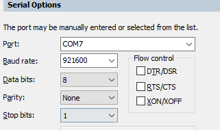
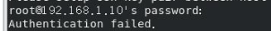

# 10.2 接口类

### 40PIN接口

<font color='Blue'>【问题】</font> 

- 开发板是否支持40PIN中的VDD_5V作为电源输入

<font color='Green'>【解答】</font> 

- 开发板V1.2及以上版本可以支持，版本号可通过开发板丝印信息确认

<font color='Blue'>【问题】</font> 

- 开发板是否支持40PIN的C/C++接口功能

<font color='Green'>【解答】</font>

- 可参考论坛文章，[旭日X3派WiringPi](https://developer.horizon.ai/forumDetail/109609560406362634)

### 串口

<font color='Blue'>【问题】</font> 

- 开发板上电后，串口无日志显示

<font color='Green'>【解答】</font> 

- 检查开发板红色电源指示灯是否点亮
- 检查开发板和串口转接板的连接方式，可参考[调试串口](../installation/hardware_interface#debug_uart)章节
- 检查终端软件的串口参数配置，正确配置如下所示：  


### 网络接口

<font color='Blue'>【问题】</font> 

- 开发板无法上网

<font color='Green'>【解答】</font> 

- 需要确认网络配置，具体请参考[网络配置](../configuration/network)章节

<font color='Blue'>【问题】</font> 

- 开发板无法通过SSH连接

<font color='Green'>【解答】</font> 

- 提示`Connection timed out`，说明网络通讯异常。请参考[SSH登录](../installation/remote_login#ssh)章节确认网络配置
- 提示 `Authentication failed`，说明登录使用的用户、密码错误，请确认后重试  


<font color='Blue'>【问题】</font> 

- 开发板使用无线网络时，连接不稳定、传输速度慢

<font color='Green'>【解答】</font> 

- 开发板无线网络容易受到金属外壳、散热器等因素影响导致信号强度减弱，可安装外置天线增强信号

<font color='Blue'>【问题】</font> 

- 开发板无线网络无法使用，使用`ifconfig`命令查询不到`wlan0`设备

<font color='Green'>【解答】</font> 

- 执行`rfkill unblock wlan`命令重新使能无线网络  

### USB接口

<font color='Blue'>【问题】</font> 

- 开发板接入USB摄像头后，默认设备节点是什么

<font color='Green'>【解答】</font> 

- USB摄像头的设备节点为`/dev/video8`

<font color='Blue'>【问题】</font> 

- 开发板插入USB摄像头后，没有生成`/dev/video8`设备节点

<font color='Green'>【解答】</font> 

- 确认USB摄像头是否正常，可接入电脑确认是否能够识别
- 确认摄像头正常插入，可重新插拔后再试
- 确认开发板的`Micro USB`接口没有接入数据线

<font color='Blue'>【问题】</font> 

- 开发板接入遥控手柄无法使用，没有生成`/dev/input/js0`设备节点

<font color='Green'>【解答】</font> 

- 更新开发板系统，并按照以下步骤安装驱动和工具包：
    - 加载驱动： `sudo modprobe -a joydev` 
    - 安装测试工具： `sudo apt install joystick`
    - 测试命令：`jstest /dev/input/js0`

### MIPI CSI接口

<font color='Blue'>【问题】</font> 

- 开发板接入MIPI摄像头后无法使用，`i2cdetect`命令无法检测到i2c地址

<font color='Green'>【解答】</font> 

- 请参考[MIPI摄像头](../installation/hardware_interface#mipi_port)章节，确认摄像头连接方式
- 请勿在开发板通电情况下插拔摄像头，否则会因短路而损坏摄像头

<font color='Blue'>【问题】</font> 

- 运行MIPI摄像头示例时报错:
    ```bash
    sunrise@ubuntu:/app/pydev_demo/03_mipi_camera_sample$ python3 mipi_camera.py
    Traceback (most recent call last):
    File "mipi_camera.py", line 29, in <module>
        disp_w, disp_h = get_display_res()
    File "mipi_camera.py", line 27, in get_display_res
        return int(res[1]), int(res[0])
    ValueError: invalid literal for int() with base 10: b'open device /dev/lt8618_ioctl failed\ndevice not open\n1080'
    ```

<font color='Green'>【解答】</font> 

- 使用`sunrise`账户运行示例程序时，需要`sudo`权限，例如`sudo python3 mipi_camera.py`

### 显示接口

<font color='Blue'>【问题】</font> 

- 开发板`HDMI`接口可以支持的分辨率？

<font color='Green'>【解答】</font> 

- 支持的分辨率类型，可参考[HDMI接口](../installation/hardware_interface#hdmi_interface)章节