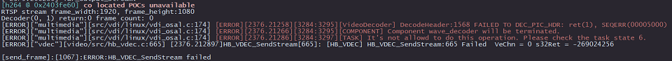

# 10.3 多媒体类

## 视频编\解码

<font color='Blue'>【问题】</font> 

- 开发板解码rtsp视频流报错，错误如下：  


<font color='Green'>【解答】</font> 

- 推流服务器推送的rtsp码流里面需要包含`PPS`和`SPS`参数信息

- 使用`ffmpeg`打开`.mp4 .avi`等格式的视频文件推流时，需要添加`-vbsf h264_mp4toannexb`选项，以添加码流的`PPS` 和`SPS`信息，例如：

    ```
    ffmpeg -re -stream_loop -1 -i xxx.mp4 -vcodec copy -vbsf h264_mp4toannexb -f rtsp rtsp://192.168.1.195:8554/h264_stream
    ```

- rtsp视频流目前仅支持1080p分辨率

- 不支持使用vlc软件进行rtsp推流，原因是vlc软件不支持添加`PPS`和`SPS`信息
