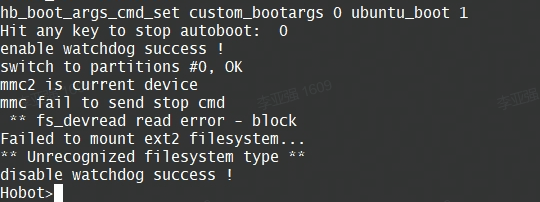
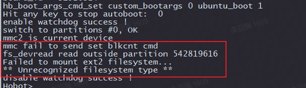
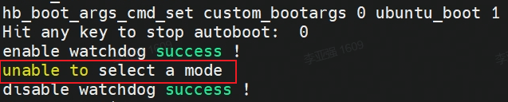
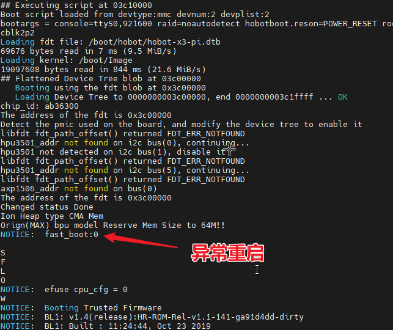
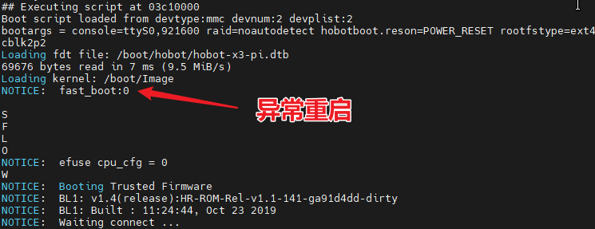
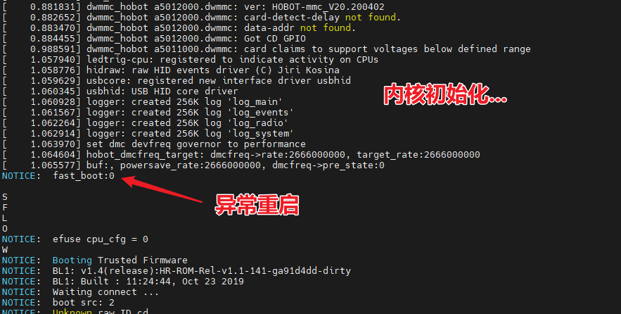

# 10.1 系统类

## 开发板上电后无显示

<font color='Blue'>【问题】</font> 

- 开发板上电后，显示器持续无画面输出，连接串口发现系统反复重启或者阻塞在uboot命令行

<font color='Green'>【解答】</font> 

- 供电不足导致反复重启，更换符合开发板要求的5V/3A适配器，推荐使用官方推荐的适配器
- 使用的USB线质量不好，会引起供电的不稳定导致异常断电、反复重启
- 串口误触导致阻塞在uboot，重新给设备上电恢复
- Micro SD卡镜像格式错误，当串口提示如下log时，需要重新制作镜像 


- Micro SD卡质量问题，当串口提示如下log，说明Micro SD卡损坏，需要更换新卡  

  



## 开发板供电异常的常见现象

如果发现开发板上电后状态灯一直不熄灭或者不闪烁，HDMI显示器上也不显示任何画面，则建议先排查供电是否正常。

- 需要使用支持**5V 3A**的电源适配器为开发板供电，推荐使用[基础配件清单](/hardware_development/rdk_x3/accessory#basic_accessories)中推荐的电源适配器型号。
- 如果使用自己的充电器，请选用正规品牌的USB Type C 口供电线，并且满足**5V 3A**
- 不要直接使用电脑的USB口给开发板供电

要确定是否由供电问题导致无法正常启动，我们需要将开发板连接到串口，并观察启动日志，目前以下现象可以明确判断是供电异常。

### 现象1：从Uboot引导内核时重启

此时处在uboot阶段，uboot的大部分任务已经完成，在把内核、设备树等从SD卡上加载到内存中时，或在跳转进内核执行时，开发板异常重启了。





### 现象2：已运行至内核，数秒后重启

此时内核加载并已经运行，正在进行内核、驱动的加载和初始化，开发板异常重启。



### 其他现象：

当前供电不足的现象只能通过串口日志分析，如果启动日志上观察到启动过程中，没有任何的**错误**和**告警**信息，开发板直接打印 `NOTICE:  fast_boot:0` 重启，那么基本可以判断是供电不足。

目前因为供电不足引起的现象容易和其他比如SD卡不识别、硬件损坏等现象混淆，如果不接入串口查看日志则不好明确判断。推荐使用[基础配件清单](/hardware_development/rdk_x3/accessory#basic_accessories)中推荐的电源适配器型号。

## 开发板默认账户

<font color='Blue'>【问题】</font> 

- 开发板默认支持的账户类型

<font color='Green'>【解答】</font> 

- 开发板默认支持两种账户，具体如下：
  - 默认账户：用户名`sunrise`  密码`sunrise` 
  - root账户：用户名`root`  密码`root`

## NTFS文件系统挂载
<font color='Blue'>【问题】</font> 

- NTFS文件系统挂载后，如何支持读写模式

<font color='Green'>【解答】</font> 

- 安装ntfs-3g功能包后，再挂载NTFS文件系统即可支持写模式。安装命令如下：
    ```bash
    sudo apt -y install ntfs-3g
    ```

## vscode工具支持
<font color='Blue'>【问题】</font> 

- 开发板是否支持`vscode`开发工具

<font color='Green'>【解答】</font> 

- 开发板不支持`vscode`本地安装，用户可在PC端通过`ssh-remote`插件方式远程链接开发板

## adb调试功能
<font color='Blue'>【问题】</font> 

- 开发板如何启动adb调试功能

<font color='Green'>【解答】</font> 

- Ubuntu系统中默认启动了`adbd`服务，用户只需在电脑安装adb工具后即可使用，方法可参考[bootloader镜像更新](https://developer.horizon.ai/forumDetail/88859074455714818)。

## apt update更新失败

<font color='Blue'>【问题】</font> 

- Ubuntu系统中运行`apt update`命令，提示以下错误：
    ```bash
    Reading package lists... Done
    E: Could not get lock /var/lib/apt/lists/lock. It is held by process 4299 (apt-get)
    N: Be aware that removing the lock file is not a solution and may break your system.
    E: Unable to lock directory /var/lib/apt/lists/
    ```

<font color='Green'>【解答】</font> 

- Ubuntu系统自动运行的更新程序，跟用户`apt update`操作发生冲突。可以杀死系统自动运行的更新进程后重试，例如`kill 4299`。

## 开发板文件传输方式

<font color='Blue'>【问题】</font> 

- 开发板和电脑之间的文件传输的方式有哪些

<font color='Green'>【解答】</font> 

- 可以通过网络、USB等方式进行传输。其中，网络可使用ftp工具、scp命令等方式，USB可使用u盘、adb等方式。以scp命令为例，文件传输的方式如下：

    - 拷贝`local_file`单个文件到开发板：

    ```bash
    scp local_file sunrise@192.168.1.10:/userdata/
    ```

    - 拷贝`local_folder`整个目录到开发板：

    ```bash
    scp -r local_folder sunrise@192.168.1.10:/userdata/
    ```