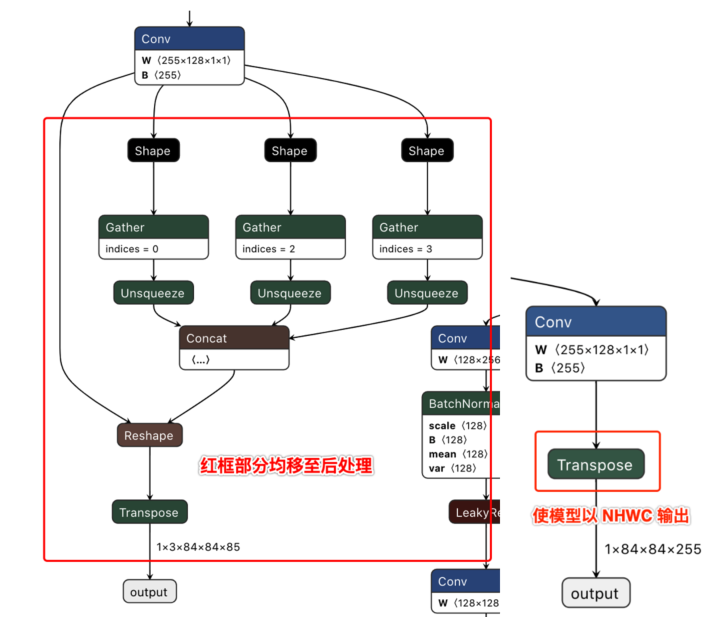

# 10.4 算法工具链类

### 模型量化错误及解决方法{#model_convert_errors_and_solutions}

#### hb_mapper checker (01_check.sh) 模型验证错误

<font color='Blue'>【问题】</font> 


```bash
  ERROR The shape of model input:input is [xxx] which has dimensions of 0. Please specify input-shape parameter. 
```

<font color='Green'>【解答】</font> 


- 发生此错误的原因可能是模型输入为动态shape。针对此错误，您可使用参数 ``--input-shape input_name input_shape`` 来指定输入节点的shape信息。

<font color='Blue'>【问题】</font> 


```bash
  ERROR HorizonRT not support these cpu operators: {op_type}
```

<font color='Green'>【解答】</font> 


- 发生此错误的原因可能是使用的CPU算子为地平线不支持的CPU算子。 针对此错误，您可以根据我们提供的算子支持列表中的内容对算子进行替换；若不被支持的CPU算子为模型核心算子，请您联系地平线对此进行开发评估。

<font color='Blue'>【问题】</font> 


```bash
  Unsupported op {op_type} 
```

<font color='Green'>【解答】</font> 


- 发生此错误的原因可能是使用的BPU算子为地平线不支持的BPU算子。针对此错误，若模型整体性能可满足需要，您可以忽略该日志；若模型整体性能不能达到您的预期，您可以根据我们提供的算子支持列表中的内容对算子进行替换。

<font color='Blue'>【问题】</font> 


```bash
  ERROR nodes:['{op_type}'] are specified as domain:xxx, which are not supported by official onnx. Please check whether these ops are official onnx ops or defined by yourself 
```

<font color='Green'>【解答】</font> 


- 发生此错误的原因可能是使用的自定义算子为地平线不支持的自定义算子。针对此错误，您可以根据我们提供的算子支持列表中的内容对算子进行替换或参考自定义算子开发完成自定义CPU算子注册。


#### hb_mapper makertbin (03_build.sh) 模型转换错误

<font color='Blue'>【问题】</font> 


  ```bash
  Layer {op_name}  
      xxx expect data shape range:[[xxx][xxx]], but the data shape is [xxx]
  Layer {op_name}
      Tensor xxx expects be n dimensions, but m provided
  ```

<font color='Green'>【解答】</font> 


- 发生此错误的原因可能是，{op_name}算子超过支持限制被回退到CPU计算。针对此错误，若CPU算子带来的性能损耗您可接受，则无需关注该信息；若性能不能达到您的要求，您可以根据我们提供的算子支持列表中的内容将该op修改至BPU可支持的范围。

<font color='Blue'>【问题】</font> 


  ```bash
  INFO： Layer {op_name} will be executed on CPU
  ```

<font color='Green'>【解答】</font> 


- 发生此错误的原因可能是，{op_name}算子由于shape（CxHxW）超过8192被回退到CPU计算。针对此错误，若仅少数算子被回退CPU计算且模型整体性能满足要求，则无需关注该信息；若性能不满足要求，建议查看算子支持列表，替换为其他无shape限制的BPU算子。

<font color='Blue'>【问题】</font> 


  ```bash
  ERROR There is an error in pass: {op_name}. Error message:xxx
  ```

<font color='Green'>【解答】</font> 


- 发生此错误的原因可能是，{op_name}算子优化失败。针对此错误，请您将模型以及.log文件收集好后提供给地平线技术人员进行分析处理。

<font color='Blue'>【问题】</font> 


  ```bash
  Error There is an error in pass:constant_folding. Error message: Could not find an implementation for the node {op_name}
  ```

<font color='Green'>【解答】</font> 


- 发生此错误的原因可能是该算子onnxruntime暂未支持。针对此错误，您可以根据我们提供的算子支持列表中的内容对算子进行替换，如不被支持的算子为核心算子，请您联系地平线对此进行开发评估。

<font color='Blue'>【问题】</font> 


  ```bash
  WARNING input shape [xxx] has length: n  ERROR list index out of range
  ```

<font color='Green'>【解答】</font> 


- 发生此错误的原因可能是目前模型输入暂不支持非四维输入。针对此错误，建议您将模型输入修改至四维（例如HxW -> 1x1xHxW）。

<font color='Blue'>【问题】</font> 


  ```bash
  Start to parse the onnx model
  core dump
  ```
<font color='Green'>【解答】</font> 


- 发生此错误的原因可能是模型解析失败（可能是导出模型时只为一个output/input节点指定了name）。针对此错误，建议您重新导出onnx并确认其有效性（导出onnx模型时不指定output/input name，或者依次为每个output/input节点指定名称）。

<font color='Blue'>【问题】</font> 


  ```bash
  Start to calibrate/quantize the model
  core dump
  
  Start to compile the model 
  core dump
  ```

<font color='Green'>【解答】</font> 


- 发生此错误的原因可能是模型量化/编译失败。针对此错误，请您将模型以及.log文件收集好后提供给地平线技术人员进行分析处理。

<font color='Blue'>【问题】</font> 


  ```bash
  ERROR model conversion faild: Inferred shape and existing shape differ in dimension x: (n) vs (m)
  ```

<font color='Green'>【解答】</font> 


- 发生此错误的原因可能是onnx模型的输入shape非法，或者是工具优化pass有误。针对此错误，请您确保onnx模型的有效性，若onnx模型可正常推理，请将模型提供给地平线技术人员进行分析处理。

<font color='Blue'>【问题】</font> 


  ```bash
  WARNING got unexpected input/output/sumin threshold on conv {op_name}! value: xxx
  ```

<font color='Green'>【解答】</font> 


- 发生此错误的原因可能是数据预处理有误，或该节点weight值太小/太大。针对此错误，1.请您检查数据预处理是否有误；2.我们建议您使用BN算子优化数据分布。

<font color='Blue'>【问题】</font> 


  ```bash
  ERROR hbdk-cc compile hbir model failed with returncode -n
  ```

<font color='Green'>【解答】</font> 


- 发生此错误的原因可能是模型编译失败。针对此错误，请您将模型以及.log文件收集好后提供给地平线技术人员进行分析处理。

<font color='Blue'>【问题】</font> 


  ```bash
  ERROR {op_type}  only support 4 dim input
  ```

<font color='Green'>【解答】</font> 


- 发生此错误的原因可能是工具链暂不支持该op输入维度为非四维。针对此错误，我们建议您将该op输入维度调整为四维输入。

<font color='Blue'>【问题】</font> 


  ```bash
  ERROR {op_type} Not support this attribute/mode=xxx
  ```

<font color='Green'>【解答】</font> 


- 发生此错误的原因可能是工具链暂不支持op的该属性。针对此错误，您可以根据我们提供的算子支持列表中的内容进行替换或联系地平线对此进行开发评估。

<font color='Blue'>【问题】</font> 


  ```bash
  ERROR There is no node can execute on BPU in this model, please make sure the model has at least one conv node which is supported by BPU.
  ```

<font color='Green'>【解答】</font> 


- 发生此错误的原因可能是模型中没有可量化的BPU节点。针对此错误，请您确保onnx模型的有效性，且模型中至少使用了一个conv；若前述条件均已满足，请您将模型以及.log文件收集好后提供给地平线技术人员进行分析处理。

<font color='Blue'>【问题】</font> 


  ```bash
  ERROR [ONNXRuntimeError] : 9 : NOT_IMPLEMENTED : could not find a implementation for the node of {op_name}:{op_type}(opset) 
  ```

<font color='Green'>【解答】</font> 


- 发生此错误的原因可能是模型opset版本超出工具链支持限制。 针对此错误，请您重新导出模型，确保 ``opset_version=10或者11`` 。

<font color='Blue'>【问题】</font> 


  ```bash
  ERROR The opset version of the onnx model is n, only model with opset_version 10/11 is supported 
  ```

<font color='Green'>【解答】</font> 


- 发生此错误的原因可能是模型opset版本超出工具链支持限制。针对此错误，请您重新导出模型，确保 ``opset_version=10 或者 11`` 。

<font color='Blue'>【问题】</font> 


  ```bash
  使用run_on_bpu后转换报错。
  ```

<font color='Green'>【解答】</font> 


- 发生此错误的原因可能是目前暂不支持将该算子run_on_bpu。``run_on_bpu`` 暂仅支持指定模型尾部的 ``Relu/Softmax/pooling（maxpool、avgpool等）`` 算子以及CPU*+Transpose组合（可通过声明 ``Transpose`` 节点名称，将 ``CPU*+Transpose`` 都运行在BPU上，CPU*特指BPU支持的op），若满足前述条件但仍 ``run_on_bpu`` 失败，请您联系地平线技术人员对此进行分析处理；若不满足前述条件，可联系地平线技术人员对此进行开发评估。

<font color='Blue'>【问题】</font> 


  ```bash
  ERROR tool limits for max output num is 32
  ```

<font color='Green'>【解答】</font> 


- 发生此错误的原因可能是工具链仅支持模型输出节点数量不超过32。针对此错误，建议您将模型输出节点数量控制在32个以内。

<font color='Blue'>【问题】</font> 


  ```bash
  ERROR xxx file parse failed.
  ERROR xxx does not exist in xxx.
  ```
<font color='Green'>【解答】</font> 


- 发生此错误的原因可能是，环境配置不正确。请使用地平线提供的docker环境进行量化。

<font color='Blue'>【问题】</font> 


  ```bash
  ERROR exception in command: makertbin.
  ERROR cannot reshape array of size xxx into shape xxx.
  ```
<font color='Green'>【解答】</font> 


- 发生此错误的原因可能是，数据预处理异常导致，请参考我们的文档中预处理相关信息。

<font color='Blue'>【问题】</font> 


  ```bash
  ERROR load cal data for input xxx error
  ERROR cannot reshape array of size xxx into shape xxx
  ```
<font color='Green'>【解答】</font> 


- 发生此错误的原因可能是工具链版本不匹配，请使用我们提供的SDK中对应的工具链版本。

<font color='Blue'>【问题】</font> 


  ```bash
  ERROR [ONNXRuntimeError] : 1 : FAIL : Non-zero status code returned while running HzCalibration node.Name:'xxx'Status Message :CUDA error cudaErrorNoKernelImageForDevice:no kernel image is available for execution on the device
  ```

<font color='Green'>【解答】</font> 


- 发生此错误的原因可能是docker加载错误。 建议您加载Docker时换用nvidia docker加载命令

<font color='Blue'>【问题】</font> 


  ```bash
  [ONNXRuntimeError] : 10 : INVALID_GRAPH : Load model from xxx.onnx failed:This is an invalid model. In Node, ("xxx", HzSQuantizedPreprocess, "", -1) : ("images": tensor(int8),"xxx": tensor(int8),"xxx": tensor(int32),"xxx": tensor(int8),) -> ("xxx": tensor(int8),) , Error No Op registered for HzSQuantizedPreprocess with domain_version of 11
  ```

<font color='Green'>【解答】</font> 


- 发生此错误的原因可能onnx版本不匹配，重新导出onnx opset10版本并采用opencv方法做预处理

<font color='Blue'>【问题】</font> 


  ```bash
  [E:onnxruntime:, sequential_executor.cc:183 Execute] Non-zero status code returned while running Resize node. Name:'xxx' Status Message: upsample.h:299 void onnxruntime::UpsampleBase::ScalesValidation(const std::vector<float>&, onnxruntime::UpsampleMode) const scales.size() == 2 || (scales.size() == 4 && scales[0] == 1 && scales[1] == 1) was false. 'Linear' mode and 'Cubic' mode only support 2-D inputs ('Bilinear', 'Bicubic') or 4-D inputs with the corresponding outermost 2 scale values being 1 in the Resize operator
  ```

<font color='Green'>【解答】</font> 


- 发生此错误的原因可能是onnxruntime自己的问题，不能batch校准，只能1张张校准，因为模型里边有reshape, batch 后维度对不上了，对结果不影响。

<font color='Blue'>【问题】</font> 


  ```bash
  ERROR No guantifiable nodes were found, and the model is not supported
  ```

<font color='Green'>【解答】</font> 


- 发生此错误的原因可能是模型结构中没有包含输出节点导致的原因。


### 算法模型上板错误及解决方法

<font color='Blue'>【问题】</font> 


  ```bash
  (common.h:79): HR:ERROR: op_name:xxx invalid attr key xxx
  ```

<font color='Green'>【解答】</font> 


- 发生此错误的原因可能是libDNN暂不支持该op的某个属性。针对此错误，您可以根据我们提供的算子支持列表中的内容进行替换或联系地平线对此进行开发评估。

<font color='Blue'>【问题】</font> 


  ```bash
  (hb_dnn_ndarray.cpp:xxx): data type of ndarray do not match specified type. NDArray dtype_: n, given：m
  ```

<font color='Green'>【解答】</font> 


- 发生此错误的原因可能是libDNN暂不支持该输入类型（后续我们将逐步把算子约束前移至模型转换阶段提醒）。针对此错误，您可以根据我们提供的算子支持列表中的内容进行替换或联系地平线对此进行开发评估。

<font color='Blue'>【问题】</font> 


  ```bash
  (validate_util.cpp:xxx)：tensor aligned shape size is xxx , but tensor hbSysMem memSize is xxx, tensor hbSysMem memSize should >= tensor aligned shape size!
  ```

<font color='Green'>【解答】</font> 


- 发生此错误的原因可能是输入数据申请内存不足。针对此错误，请使用hbDNNTensorProperties.alignedByteSize来申请内存空间。

<font color='Blue'>【问题】</font> 


  ```bash
  (bpu_model_info.cpp:xxx): HR:ERROR: hbm model input feature names must be equal to graph node input names
  ```

<font color='Green'>【解答】</font> 


- 针对此错误，请您完整更新最新版本的工具链SDK开发包。


### 模型量化及上板使用技巧

#### Transformer使用说明

本章节将对各个transformer的概念及参数进行说明，并为您提供参考使用示例，方便您进行tranformer操作。

在文档内容开始阅读前，以下内容请您注意：

-  图片数据为 ``三维数据``，但地平线提供的transformer都是以 ``四维数据`` 的方式来进行获取和处理的，transformer只会对输入数据中的 ``第0张`` 图片做该操作。

##### AddTransformer

**说明**：

对输入图片中的所有像素值做增加value的操作。该transformer会在输出时, 将数据格式转为float32。

**参数**：

- value: 对每个像素做增加的数值, 注意value的取值可以为负数, 如 -128。

**使用举例**：

``` bash
  # 对图像数据做减去128的操作
  AddTransformer(-128)

  # 对图像数据做增加127的操作
  AddTransformer(127)
```

##### MeanTransformer

**说明**：

对输入图片中的所有像素值做减去 mean_value 的操作。

**参数**：

- means: 对每个像素做增加的数值, 注意value的取值可以为负数, 如 -128。

- data_format: 输入的layout类型，取值范围为["CHW","HWC"], 默认 "CHW"。

**使用举例**：

``` bash
  # 每个像素减去128.0 输入的类型为CHW
  MeanTransformer(np.array([128.0, 128.0, 128.0])) 

  # 每个像素减去不同的数值，103.94, 116.78, 123.68，输入的类型为 HWC
  MeanTransformer(np.array([103.94, 116.78, 123.68]), data_format="HWC") 
```

##### ScaleTransformer

**说明**：

对输入图片中的所有像素值做乘以data_scale系数的操作。

**参数**：

- scale_value: 需要乘以的系数，如0.0078125 或者1/128。

**使用举例**：

```bash

  # 将取值范围-128~127，所有的像素的调整到-1~1之间
  ScaleTransformer(0.0078125) 
  # 或者
  ScaleTransformer(1/128)
```

##### NormalizeTransformer

**说明**：

用于对输入图片进行归一化的操作。该transformer会在输出时, 将数据格式转为float32。

**参数**：

- std：输入的第一张图片，需要除以的数值。

**使用举例**：

``` bash
  # 将取值范围[-128, 127] 所有的像素的调整到-1~1之间
  NormalizeTransformer(128) 
```

##### TransposeTransformer

**说明**：

用于做layout转换的操作。

**参数**：

- order: 对输入图片做layout转换后的顺序（顺序与原有的layout顺序有关）。如：HWC的顺序为0,1,2，需要转为CHW时，order为(2,0,1)。

**使用举例**：

``` bash
  # HWC转到CHW
  TransposeTransformer((2, 0, 1))
  # CHW转到HWC
  TransposeTransformer((1, 2, 0))
```

##### HWC2CHWTransformer

**说明**：

用于将NHWC转换为NCHW的操作。

**参数**：不涉及。

**使用举例**：

``` bash
  # NHWC转到NCHW
  HWC2CHWTransformer()
```

##### CHW2HWCTransformer

**说明**：

用于将NCHW转换为NHWC的操作。

**参数**：不涉及。

**使用举例**：

``` bash
  # NCHW转到 NHWC
  CHW2HWCTransformer()
```

##### CenterCropTransformer

**说明**：

以直接截断取值的方式从图片中心裁剪出一个正方形的图片的操作。该transformer会在输出时, 将数据格式转为float32。当data_type的值为uint8时，输出为uint8。

**参数**：

- crop_size: 中心裁剪的正方形的边长size。

- data_type: 输出结果的类型，取值范围为["float", "uint8"]。

**使用举例**：

``` bash
  # 以224*224的方式，做中心裁剪，默认输出类型为float32
  CenterCropTransformer(crop_size=224) 

  # 以224*224的方式，做中心裁剪，输出类型为uint8
  CenterCropTransformer(crop_size=224, data_type="uint8")
```

##### PILCenterCropTransformer

**说明**：

使用PIL的方式从图片中心裁剪出一个正方形的图片的操作。该transformer会在输出时, 将数据格式转为float32。

**参数**：

- size: 中心裁剪的正方形的边长size。

**使用举例**：

``` bash
  # 以224*224的方式，使用PIL的方式做中心裁剪
  PILCenterCropTransformer(size=224)
```

##### LongSideCropTransformer

**说明**：

用于做长边裁剪的操作。该 transformer 会在输出时, 将数据格式转为float32。

当宽度比高度的数值大时，会裁剪出一个中心以高度大小为准的正方形，如宽100，高70，裁剪之后大小为70*70。

当高度比宽度的数值大时，会裁剪出一个中心以宽度大小不变，高度为差值的一半+宽度 的长方形，如宽70，高100，裁剪之后大小为 `70*（100-70）/2+70` ，即70* 85大小的长方形。

**参数**：不涉及。

**使用举例**：

``` bash
  LongSideCropTransformer()
```

##### PadResizeTransformer

**说明**：

使用填充的方式做图像放大的操作。该 transformer 会在输出时, 将数据格式转为float32。

**参数**：

- target_size：目标大小，值为元组，如(240,240)。

- pad_value：填充到数组中的值，默认值为127。

- pad_position：填充的位置，取值范围为["boundary"， "bottom_right"]，默认值为 "boundary"。

**使用举例**：

``` bash
  # 裁剪一个大小为512*512，填充到右下角，填充值为0
  PadResizeTransformer((512, 512), pad_position='bottom_right', pad_value=0)

  # 裁剪一个大小为608*608，填充到边框，填充值为 127
  PadResizeTransformer(target_size=(608, 608))
```

##### ResizeTransformer

**说明**：

用于调整图像大小的操作。

**参数**：

- target_size：目标大小，值为元组，如(240,240)。

- mode：图片处理模式，取值范围为("skimage"，"opencv")，默认值为 "skimage"。

- method：插值的方法，此参数仅在mode为skimage时生效。取值范围为0-5，默认值为1，其中：

  - 0代表Nearest-neighbor；

  - 1代表Bi-linear(default)；

  - 2代表Bi-quadratic;

  - 3代表Bi-cubic;

  - 4代表Bi-quartic;

  - 5代表Bi-quintic。

- data_type：输出的类型，取值范围为(uint8，float)，默认为float类型。当被设置为uint8时，输出类型为uint8 ，其他情况为float32。

- interpolation：插值的方法，此参数仅在mode为opencv时生效。默认为空，取值范围为(opencv的插值方式)，
  目前interpolation仅支持为空或opencv中的INTER_CUBIC两种插值方法，当interpolation为空时，默认使用INTER_LINEAR方式。

  以下为opencv中支持的插值方式及说明（目前未支持的插值方式将在后续迭代中逐步支持）：

  - INTER_NEAREST，最近邻插值；

  - INTER_LINEAR，双线性插值，当interpolation为空时，默认使用这种方法。

  - INTER_CUBIC，双三次插值4x4像素邻域内的双立方插值。

  - INTER_AREA，使用像素面积关系重采样。它可能是图像抽取的首选方法，因为它可以提供无莫尔条纹的结果。但是当图像被缩放时，它类似于INTER_NEAREST方法。

  - INTER_LANCZOS4，8x8邻域的Lanczos插值。

  - INTER_LINEAR_EXACT，位精确双线性插值。

  - INTER_NEAREST_EXACT，位精确最近邻插值。这将产生与PIL、scikit-image或Matlab中的最近邻方法相同的结果。

  - INTER_MAX，插值代码的掩码。

  - WARP_FILL_OUTLIERS，标志，填充所有目标图像像素。如果其中一些对应于源图像中的异常值，则将它们设置为零。

  - WARP_INVERSE_MAP，标志，逆变换。

**使用举例**：

``` bash
  # 将输入图片大小调整为224*224，采用 opencv 的方式处理图片，插值的方式为双线性，输出为float32
  ResizeTransformer(target_size=(224, 224), mode='opencv', method=1)

  # 将输入图片大小调整为256*256，采用skimage的方式处理图片，插值的方式为双线性，输出为float32
  ResizeTransformer(target_size=(256, 256))

  # 将输入图片大小调整为256*256，采用skimage的方式处理图片，插值的方式为双线性，输出为uint8
  ResizeTransformer(target_size=(256, 256), data_type="uint8")
```

##### PILResizeTransformer

**说明**：

使用PIL库做调整图像大小的操作。

**参数**：

- size：目标大小，值为元组，如(240,240)。

- interpolation：指定插值的方式，取值范围：(Image.NEAREST，Image.BILINEAR，Image.BICUBIC，Image.LANCZOS)， 默认值为Image.BILINEAR。

  - Image.NEAREST：最近邻采样；

  - Image.BILINEAR：线性插值；

  - Image.BICUBIC：三次样条插值；

  - Image.LANCZOS：高质量下采样滤波器。

**使用举例**：

``` bash
  # 将输入图片大小调整为256*256 插值的方式为线性插值
  PILResizeTransformer(size=256)

  # 将输入图片大小调整为256*256 插值的方式为高质量下采样滤波器
  PILResizeTransformer(size=256, interpolation=Image.LANCZOS)
```

##### ShortLongResizeTransformer

**说明**：

按照原比例对输入图片进行缩放的操作，新图片的大小与设置的参数有关。操作方式如下：

1. 先以short_size的大小除以原图片的宽和高里最小值，以这个值为缩放比例系数。

2. 当缩放比例系数乘以原图片的宽和高中的最大值，得到的结果大于long_size的数值时，缩放比例系数将变更为long_size除以原图片的宽和高中的最大值。

3. 使用opencv中的resize方法，根据上方得到的缩放比例系数重新裁剪图片。

**参数**：

- short_size：预期裁剪后的短边的长度。

- long_size：预期裁剪后的长边的长度。

- include_im：默认值为True，设置为True时, 会在返回时除了返回处理后的图片, 还会返回原图片。

**使用举例**：

``` bash
  # 短边长度为20，长边长度为100，返回处理后的图片及原图片
  ShortLongResizeTransformer(short_size=20, long_size=100)
```

##### PadTransformer

**说明**：

通过用目标大小的size值除以输入图片宽或者高里的最大值为系数，然后使用这个系数乘以原有的宽高，resize图片。
然后根据新图片的大小，除以size_divisor后向上取整后，再乘以size_divisor，为新的宽高，生成新的图片的操作。

**参数**：

- size_divisor：大小除数 ，默认值为128。

- target_size：目标大小，默认值为512。

**使用举例**：

``` bash
  # pad大小为1024*1024
  PadTransformer(size_divisor=1024, target_size=1024)
```

##### ShortSideResizeTransformer

**说明**：

根据期望的短边的长度，使用现在的长短边的比例，中心裁剪出新的图片大小的操作。

**参数**：

- short_size：预期的短边的长度。

- data_type：输出结果的类型，取值范围为("float","uint8")，默认取值"float32", 以 float32 类型输出，设置为uint8时，输出类型将为uint8。

- interpolation：指定插值的方式，取值范围为 opencv 中采用的插值方式，默认为空。
  
  目前interpolation仅支持为空或opencv中的INTER_CUBIC两种插值方法，当interpolation为空时，默认使用INTER_LINEAR方式。

  以下为opencv中支持的插值方式及说明（目前未支持的插值方式将在后续迭代中逐步支持）：

  - INTER_NEAREST，最近邻插值；

  - INTER_LINEAR，双线性插值，当interpolation为空时，默认使用这种方法。

  - INTER_CUBIC，双三次插值4x4像素邻域内的双立方插值。

  - INTER_AREA，使用像素面积关系重采样。它可能是图像抽取的首选方法，因为它可以提供无莫尔条纹的结果。但是当图像被缩放时，它类似于INTER_NEAREST方法。

  - INTER_LANCZOS4，8x8邻域的Lanczos插值。

  - INTER_LINEAR_EXACT，位精确双线性插值。

  - INTER_NEAREST_EXACT，位精确最近邻插值。这将产生与PIL、scikit-image或Matlab中的最近邻方法相同的结果。

  - INTER_MAX，插值代码的掩码。

  - WARP_FILL_OUTLIERS，标志，填充所有目标图像像素。如果其中一些对应于源图像中的异常值，则将它们设置为零。

  - WARP_INVERSE_MAP，标志，逆变换。

**使用举例**：

``` bash
  # 将短边大小调整为256，插值方式为双线性插值
  ShortSideResizeTransformer(short_size=256)

  # 将短边大小调整为256，插值方式为8x8像素邻域内的Lanczos插值
  ShortSideResizeTransformer(short_size=256, interpolation=Image.LANCZOS4) 
```

##### PaddedCenterCropTransformer

**说明**：

使用填充的方式对图片中心进行裁剪的操作。

.. attention::

  仅适用于EfficientNet-lite相关实例模型。

  计算方式为：

  1. 计算系数，int((float( image_size ) / ( image_size + crop_pad ))。

  2. 计算中心size的大小， 系数 * np.minimum( 原始图片的高度, 原始图片的宽度 ))。

  3. 根据计算出来的size大小，做中心裁剪。

**参数**：

- image_size：图片的大小，默认值为224。

- crop_pad：中心填充的大小，默认值为32。

**使用举例**：

``` bash
  # 裁剪大小为240*240，填充值为32
  PaddedCenterCropTransformer(image_size=240, crop_pad=32)

  # 裁剪大小为224*224，填充值为32
  PaddedCenterCropTransformer()
```

##### BGR2RGBTransformer

**说明**：

将输入格式由BGR转成RGB的操作。

**参数**：

- data_format：数据格式，取值范围为(CHW,HWC)，默认值为CHW。

**使用举例**：

``` bash
  # layout为NCHW时，做BGR转为RGB
  BGR2RGBTransformer() 

  # layout为NHWC时，做BGR转为RGB
  BGR2RGBTransformer(data_format="HWC")
```

##### RGB2BGRTransformer

**说明**：

将输入格式由RGB转成BGR的操作。

**参数**：

- data_format：数据格式，取值范围为(CHW,HWC)，默认值为CHW。

**使用举例**：

``` bash
  # layout为NCHW时，做RGB转成BGR
  RGB2BGRTransformer() 

  # layout为NHWC时，做RGB转成BGR
  RGB2BGRTransformer(data_format="HWC")
```

##### RGB2GRAYTransformer

**说明**：

将输入格式由RGB转成GRAY的操作。

**参数**：

- data_format：输入的layout类型，取值范围("CHW","HWC")，默认为"CHW"。

**使用举例**：

``` bash
  # layout为NCHW时，做RGB转成GRAY
  RGB2GRAYTransformer(data_format='CHW')

  # layout为NHWC时，做RGB转成GRAY
  RGB2GRAYTransformer(data_format='HWC')
```

##### BGR2GRAYTransformer

**说明**：

将输入格式由 BGR 转成 GRAY 的操作。

**参数**：

- data_format：输入的layout类型，取值范围 ["CHW","HWC"]，默认值为"CHW"。

**使用举例**：

``` bash
  # layout为NCHW时，做BGR转成GRAY
  BGR2GRAYTransformer(data_format='CHW')

  # layout为NHWC时，做BGR转成GRAY
  BGR2GRAYTransformer(data_format='HWC')
```

##### RGB2GRAY_128Transformer

**说明**：

输入格式由RGB转成GRAY_128的操作。GRAY_128取值范围为(-128,127)。

**参数**：

- data_format：输入的layout类型，取值范围为["CHW","HWC"]，默认值为"CHW"，此项为必填项。

**使用举例**：

``` bash
  # layout为NCHW时，做RGB转成GRAY_128
  RGB2GRAY_128Transformer(data_format='CHW')

  # layout为NHWC时，做RGB转成GRAY_128
  RGB2GRAY_128Transformer(data_format='HWC')
```

##### RGB2YUV444Transformer

**说明**：

将输入格式由RGB转成YUV444的操作。

**参数**：

- data_format：输入的layout类型，取值范围为["CHW", "HWC"]，默认值为"CHW"，此项为必填项。

**使用举例**：

``` bash
  # layout为NCHW时，做BGR转成YUV444
  BGR2YUV444Transformer(data_format='CHW')

  # layout为NHWC时，做BGR转成YUV444
  BGR2YUV444Transformer(data_format='HWC')
```

##### BGR2YUV444Transformer

**说明**：

将输入格式由BGR转成YUV444的操作。

**参数**：

- data_format：输入的layout类型，取值范围为["CHW","HWC"]，默认值为 "CHW"，此项为必填项。

**使用举例**：

``` bash
  # layout为NCHW时，做BGR转成YUV444
  BGR2YUV444Transformer(data_format='CHW')

  # layout为NHWC时，做BGR转成YUV444
  BGR2YUV444Transformer(data_format='HWC')
```

##### BGR2YUV444_128Transformer

**说明**：

将输入格式由BGR转成YUV444_128的操作。YUV444_128取值范围为(-128,127)。

**参数**：

- data_format：输入的layout类型，取值范围为["CHW","HWC"]，默认值为 "CHW"，此项为必填项。

**使用举例**：

``` bash
  # layout为NCHW时，做BGR转成YUV444_128
  BGR2YUV444_128Transformer(data_format='CHW') 

  # layout为NHWC时，做BGR转成YUV444_128
  BGR2YUV444_128Transformer(data_format='HWC')
```

##### RGB2YUV444_128Transformer

**说明**：

将输入格式由RGB转成YUV444_128的操作。YUV444_128取值范围为(-128,127)。

**参数**：

- data_format：输入的layout类型，取值范围为["CHW","HWC"]，默认值为"CHW"，此项为必填项。

**使用举例**：

``` bash
  # layout为NCHW时，做RGB转成 YUV444_128
  RGB2YUV444_128Transformer(data_format='CHW') 

  # layout为NHWC时，做RGB转成 YUV444_128
  RGB2YUV444_128Transformer(data_format='HWC')
```

##### BGR2YUVBT601VIDEOTransformer

**说明**：

将输入格式由BGR转成YUV_BT601_Video_Range的操作。

YUV_BT601_Video_Range，某些摄像头输入数据都是YUV BT601(Video Range)格式的，取值范围为16~235，该transformer就是适配这种格式的数据产生的。

**参数**：

- data_format：输入的layout类型，取值范围为["CHW","HWC"]，默认值为"CHW"，此项为必填项。

**使用举例**：

``` bash
  # layout为 NCHW时，做BGR转成YUV_BT601_Video_Range
  BGR2YUVBT601VIDEOTransformer(data_format='CHW')

  # layout为NHWC时，做BGR转成YUV_BT601_Video_Range
  BGR2YUVBT601VIDEOTransformer(data_format='HWC')
```

##### RGB2YUVBT601VIDEOTransformer

**说明**：

将输入格式由RGB转成YUV_BT601_Video_Range的操作。

YUV_BT601_Video_Range，某些摄像头输入数据都是YUV BT601(Video Range)格式的，取值范围为16~235，该transformer就是适配这种格式的数据产生的。

**参数**：

- data_format：输入的layout类型，取值范围为["CHW","HWC"]，默认值为"CHW"，此项为必填项。

**使用举例**：

``` bash
  # layout为NCHW时，做RGB转成YUV_BT601_Video_Range
  RGB2YUVBT601VIDEOTransformer(data_format='CHW')

  # layout为NHWC时，做RGB转成YUV_BT601_Video_Range
  RGB2YUVBT601VIDEOTransformer(data_format='HWC')
```

##### YUVTransformer

**说明**：

将输入格式转成YUV444的操作。

**参数**：

- color_sequence：颜色序列，此项为必填项。

**使用举例**：

``` bash
  # 将BGR读入的图片转为YUV444
  YUVTransformer(color_sequence="BGR")

  # 将RGB读入的图片转为YUV444
  YUVTransformer(color_sequence="RGB")
```

##### ReduceChannelTransformer

**说明**：

将C通道缩减为单通道的操作。该transformer主要是针对于C通道，如shape为1*3*224*224 改为1*1*224*224。 使用时layout一定要和data_format值对齐，避免造成删错通道。

**参数**：

- data_format：输入的layout类型，取值范围为["CHW", "HWC"]，默认值为"CHW"。

**使用举例**：

``` bash  
  # 删除layout为NCHW的C通道
  ReduceChannelTransformer()
  # 或者
  ReduceChannelTransformer(data_format="CHW") 

  # 删除layout为NHWC的C通道
  ReduceChannelTransformer(data_format="HWC")
```

##### BGR2NV12Transformer

**说明**：

将输入格式由BGR转成NV12的操作。

**参数**：

- data_format：输入的layout类型，取值范围为["CHW","HWC"]，默认值为"CHW"。

- cvt_mode：cvt模式，取值范围为(rgb_calc，opencv)，默认值为rgb_calc。

  - rgb_calc，采用mergeUV的方式处理图片；

  - opencv，采用opencv的方式处理图片。

**使用举例**：

``` bash
  # layout为NCHW时，由BGR转为NV12，采用rgb_calc模式处理图片
  BGR2NV12Transformer()
  # 或者
  BGR2NV12Transformer(data_format="CHW") 

  # layout为NHWC时，由BGR转为NV12，采用opencv模式处理图片
  BGR2NV12Transformer(data_format="HWC", cvt_mode="opencv")
```

##### RGB2NV12Transformer

**说明**：

将输入格式由RGB转成NV12的操作。

**参数**：

- data_format：输入的 layout 类型，取值范围 ["CHW", "HWC"], 默认值为"CHW"。

- cvt_mode：cvt模式，取值范围为(rgb_calc,opencv)，默认值为rgb_calc。

  - rgb_calc，采用mergeUV的方式处理图片；

  - opencv，采用opencv的方式处理图片。

**使用举例**：

``` bash
  # layout为NCHW时，有RGB转为NV12，采用rgb_calc模式处理图片
  RGB2NV12Transformer()
  # 或者
  RGB2NV12Transformer(data_format="CHW") 

  # layout为NHWC时，有RGB转为NV12，采用opencv模式处理图片
  RGB2NV12Transformer(data_format="HWC", cvt_mode="opencv")
```

##### NV12ToYUV444Transformer

**说明**：

将输入格式由NV12转成YUV444的操作。

**参数**：

- target_size：目标大小，值为元组，如(240,240)。
- yuv444_output_layout：yuv444输出的layout，取值范围为(HWC,CHW)，默认值为"HWC"。

**使用举例**：

``` bash
  # layout为NCHW ，大小为768*768, nv12转yuv444 
  NV12ToYUV444Transformer(target_size=(768, 768))

  # layout为NHWC ，大小为224*224, nv12转yuv444 
  NV12ToYUV444Transformer((224, 224), yuv444_output_layout="HWC") 
```

##### WarpAffineTransformer

**说明**：

用于做图像仿射变换的操作。

**参数**：

- input_shape：输入的shape值。

- scale：乘以的系数。

**使用举例**：

``` bash
  # 大小为512*512，长边长度为1.0
  WarpAffineTransformer((512, 512), 1.0)
```

##### F32ToS8Transformer

**说明**：

用于做输入格式从float32转换为int8的操作。

**参数**：不涉及。

**使用举例**：

``` bash
  # 输入格式从 float32转为 int8 
  F32ToS8Transformer()
```

##### F32ToU8Transformer


**说明**：

用于做输入格式从float32转换为uint8的操作。

**参数**：不涉及。

**使用举例**：

``` bash
  # 输入格式从 float32 转为 uint8 
  F32ToU8Transformer()
```

#### 示例YOLOv5x模型使用说明

1. YOLOv5x模型：

  - 可以从URL:[yolov5-2.0](https://github.com/ultralytics/yolov5/releases/tag/v2.0) 中下载相应的pt文件。

    在clone代码时，请确认您使用的Tags是 ``v2.0`` ，否则将导致转换失败。

  - md5sum码:

|           **md5sum**             | **File**   |
| -------------------------------- | -----------|
| 2e296b5e31bf1e1b6b8ea4bf36153ea5 | yolov5l.pt |
| 16150e35f707a2f07e7528b89c032308 | yolov5m.pt |
| 42c681cf466c549ff5ecfe86bcc491a0 | yolov5s.pt |
| 069a6baa2a741dec8a2d44a9083b6d6e | yolov5x.pt |

  - 为了更好地适配后处理代码，我们在ONNX模型导出前对Github代码做了如下修改
    （代码参见：https://github.com/ultralytics/yolov5/blob/v2.0/models/yolo.py）：

```python

    def forward(self, x):
        # x = x.copy()  # for profiling
        z = []  # inference output
        self.training |= self.export
        for i in range(self.nl):
            x[i] = self.m[i](x[i])  # conv
            bs, _, ny, nx = x[i].shape  # x(bs,255,20,20) to x(bs,3,20,20,85)
            #  x[i] = x[i].view(bs, self.na, self.no, ny, nx).permute(0, 1, 3, 4, 2).contiguous()
            x[i] = x[i].permute(0, 2, 3, 1).contiguous()
```

-   **说明:** 
      去除了每个输出分支尾部从4维到5维的reshape（即不将channel从255拆分成3x85），然后将layout从NHWC转换成NCHW再输出。

    以下左图为修改前的模型某一输出节点的可视化图，右图则为修改后的对应输出节点可视化图。

    

- 下载完成后通过脚本 https://github.com/ultralytics/yolov5/blob/v2.0/models/export.py 进行pt文件到ONNX文件的转换。

-    **注意事项**

      在使用export.py脚本时，请注意：

      1. 由于地平线AI工具链支持的ONNX opset版本为 ``10`` 和 ``11``，请将 ``torch.onnx.export`` 的 ``opset_version`` 参数根据您要使用的版本进行修改。
      2. 将 ``torch.onnx.export`` 部分的默认输入名称参数由 ``'images'`` 
         改为 ``'data'``，与模型转换示例包的YOLOv5x示例脚本保持一致。
      3. 将 ``parser.add_argument`` 部分中默认的数据输入尺寸640x640改为模型转换示例包YOLOv5x示例中的672x672。

#### 模型精度调优checklist{#checklist}

请严格按照下图中步骤1-5来进行模型精度验证并保留每个步骤的代码和结果：


**在进行排查前，请确认当前模型转换所用的Docker镜像或转换环境版本，并保留版本信息**

##### 1. 验证浮点onnx模型的推理结果

进入模型转换环境，来测试浮点onnx模型(特指从DL框架导出的onnx模型)的单张结果，此步骤结果应与训练后的模型推理结果完全一致（nv12格式除外，可能会引入少许差异）

可参考如下示例代码步骤，来确认浮点onnx模型的推理的步骤、数据预处理、后处理代码是否正确！

```python  

  from horizon_tc_ui import HB_ONNXRuntime
  import numpy as np
  import cv2

  def preprocess(input_name):
      # BGR->RGB、Resize、CenterCrop···      
      # HWC->CHW      
      # normalization      
      return data

  def main(): 
      # 加载模型文件
      sess = HB_ONNXRuntime(model_file=MODEL_PATH)
      # 获取输入&输出节点名称
      input_names = [input.name for input in sess.get_inputs()]
      output_names = [output.name for output in sess.get_outputs()]
      # 准备模型输入数据
      feed_dict = dict()
      for input_name in input_names:
          feed_dict[input_name] = preprocess(input_name)
          
      # 原始浮点onnx，数据dtype=float32     
      outputs = sess.run_feature(output_names, feed_dict, input_offset=0)     
      
      # 后处理
      postprocess(outputs)
          
  if __name__ == '__main__':
      main()

```

##### 2. 验证yaml配置文件以及前、后处理代码的正确性

测试 original_float.onnx 模型的单张结果，应与浮点onnx模型推理结果完全一致（nv12格式除外，由于nv12数据本身有损，可能会引入少许差异）

使用开源工具 Netron 打开 ``original_float.onnx`` 模型，并查看预处理节点 ``HzPreprocess`` 算子的详细属性，获取我们 ``数据预处理`` 需要的参数：``data_format`` 和 ``input_type``。

由于HzPreprocess节点的存在，会使得转换后的模型其预处理操作可能会和原始模型有所不同，该算子是在进行模型转换时，根据yaml配置文件中的配置参数（input_type_rt、input_type_train以及norm_type、mean_value、scale_value）来决定是否为模型加入HzPreprocess节点，预处理节点的生成细节，请参考PTQ原理及步骤详解章节的 ``norm_type 配置参数说明`` 内容，另外预处理节点会出现在转换过程产生的所有产物中。

理想状态下，这个HzPreprocess节点应该完成 input_type_rt 到 input_type_train 的完整转换， 但实际情况是整个type转换过程需要使用地平线AI芯片硬件完成，但ONNX模型里面并没有包含硬件转换的部分，因此ONNX的真实输入类型会使用一种中间类型，这种中间类型就是硬件对 input_type_rt 的处理结果类型， 故针对图像输入数据类型为：RGB/BGR/NV12/YUV444/GRAY，并且数据dtype= uint8的模型时，在预处理代码中需要做 ``-128`` 的操作，``featuremap`` 数据类型因为使用的是float32，因此预处理代码中 ``不需要-128`` 的操作； original_float.onnx的数据layout(NCHW/NHWC)会保持和原始浮点模型的输入layout一致。 

可参考如下示例代码步骤，来确认 original_float.onnx 模型的推理的步骤、数据预处理、后处理代码是否正确！

**数据预处理部分建议参考使用地平线模型转换 ``horizon_model_convert_sample`` 示例包中的caffe、onnx等示例模型的预处理步骤方法**

```python

  from horizon_tc_ui import HB_ONNXRuntime
  import numpy as np
  import cv2

  def preprocess(input_name):
      # BGR->RGB、Resize、CenterCrop···      
      # HWC->CHW（通过onnx模型输入节点的具体shape来判断是否需要做layout转换）
      # normalization（若已通过yaml文件将norm操作放入了模型中，则不要在预处理中做重复操作）
      #-128（图像输入模型，仅在使用hb_session.run接口时需要自行在预处理完成-128，其他接口通过input_offset控制即可）
      return data

  def main(): 
      # 加载模型文件
      sess = HB_ONNXRuntime(model_file=MODEL_PATH)
      # 获取输入&输出节点名称
      input_names = [input.name for input in sess.get_inputs()]
      output_names = [output.name for output in sess.get_outputs()]
      # 准备模型输入数据
      feed_dict = dict()
      for input_name in input_names:
          feed_dict[input_name] = preprocess(input_name)
      #图像输入的模型（RGB/BGR/NV12/YUV444/GRAY），数据dtype= uint8     
      outputs = sess.run(output_names, feed_dict, input_offset=128)         
      # featuremap模型，数据dtype=float32, 若模型输入非featuremap，请注释掉下行代码！
      outputs = sess.run_feature(output_names, feed_dict, input_offset=0)     
      # 后处理
      postprocess(outputs)
          
  if __name__ == '__main__':
      main()

```

##### 3. 验证模型的图优化阶段未引入精度误差

测试 optimize_float.onnx 模型的单张结果，应与original_float.onnx推理结果完全一致

使用开源工具 Netron 打开 ``optimize_float.onnx`` 模型，并查看预处理节点 ``HzPreprocess`` 算子的详细属性，获取我们数据预处理需要的参数：``data_format``和 ``input_type``; 

optimize_float.onnx模型的推理可参考如下示例代码步骤，来确认 optimize_float.onnx 模型的推理的步骤、数据预处理、后处理代码是否正确！

**数据预处理部分建议参考使用地平线模型转换 ``horizon_model_convert_sample`` 示例包中的caffe、onnx等示例模型的预处理步骤方法**

```python

  from horizon_tc_ui import HB_ONNXRuntime
  import numpy as np
  import cv2

  def preprocess(input_name):
      # BGR->RGB、Resize、CenterCrop···      
      # HWC->CHW（通过onnx模型输入节点的具体shape来判断是否需要做layout转换）
      # normalization（若已通过yaml文件将norm操作放入了模型中，则不要在预处理中做重复操作）
      #-128（图像输入模型，仅在使用hb_session.run接口时需要自行在预处理完成-128，其他接口通过input_offset控制即可）
      return data

  def main(): 
      # 加载模型文件
      sess = HB_ONNXRuntime(model_file=MODEL_PATH)
      # 获取输入&输出节点名称
      input_names = [input.name for input in sess.get_inputs()]
      output_names = [output.name for output in sess.get_outputs()]
      # 准备模型输入数据
      feed_dict = dict()
      for input_name in input_names:
          feed_dict[input_name] = preprocess(input_name)
      #图像输入的模型（RGB/BGR/NV12/YUV444/GRAY），数据dtype= uint8     
      outputs = sess.run(output_names, feed_dict, input_offset=128)         
      # featuremap模型，数据dtype=float32, 若模型输入非featuremap，请注释掉下行代码！
      outputs = sess.run_feature(output_names, feed_dict, input_offset=0)     
      # 后处理
      postprocess(outputs)
          
  if __name__ == '__main__':
      main()

```

##### 4. 验证量化精度是否满足预期  

测试quantized.onnx的精度指标。

使用开源工具 Netron 打开 ``quantized.onnx`` 模型，并查看预处理节点 ``HzPreprocess`` 算子的详细属性，获取我们数据预处理需要的参数：``data_format``和 ``input_type``; 

quantized.onnx模型的推理可参考如下示例代码步骤，来确认 quantized.onnx 模型的推理的步骤、数据预处理、后处理代码是否正确！

**数据预处理部分建议参考使用地平线模型转换 ``horizon_model_convert_sample`` 示例包中的caffe、onnx等示例模型的预处理步骤方法**

```python

  from horizon_tc_ui import HB_ONNXRuntime
  import numpy as np
  import cv2

  def preprocess(input_name):
      # BGR->RGB、Resize、CenterCrop···      
      # HWC->CHW（通过onnx模型输入节点的具体shape来判断是否需要做layout转换）
      # normalization（若已通过yaml文件将norm操作放入了模型中，则不要在预处理中做重复操作）
      #-128（图像输入模型，仅在使用hb_session.run接口时需要自行在预处理完成-128，其他接口通过input_offset控制即可）
      return data

  def main(): 
      # 加载模型文件
      sess = HB_ONNXRuntime(model_file=MODEL_PATH)
      # 获取输入&输出节点名称
      input_names = [input.name for input in sess.get_inputs()]
      output_names = [output.name for output in sess.get_outputs()]
      # 准备模型输入数据
      feed_dict = dict()
      for input_name in input_names:
          feed_dict[input_name] = preprocess(input_name)
      #图像输入的模型（RGB/BGR/NV12/YUV444/GRAY），数据dtype= uint8     
      outputs = sess.run(output_names, feed_dict, input_offset=128)         
      # featuremap模型，数据dtype=float32, 若模型输入非featuremap，请注释掉下行代码！
      outputs = sess.run_feature(output_names, feed_dict, input_offset=0)     
      # 后处理
      postprocess(outputs)
          
  if __name__ == '__main__':
      main()

```

##### 5. 确保模型编译过程无误且板端推理代码正确

使用 ``hb_model_verifier`` 工具验证quantized.onnx和.bin的一致性，模型输出应至少满足小数点后2-3位对齐

hb_model_verifier工具（详细介绍可参考）的使用方法，请参考PTQ原理及步骤详解章节的 ``hb_model_verifier 工具`` 内容。

若模型一致性校验通过，则请仔细检查开发板端的前、后处理代码！

若quantized.onnx与.bin模型一致性校验失败，请联系地平线技术人员

#### 模型量化yaml配置文件模板

##### RDK X3 Caffe模型量化yaml文件模板{#rdk_x3_caffe_yaml_template}

请新建 caffe_config.yaml 文件，并直接拷贝以下内容，然后只需填写标记为 **``必选参数``** 的参数即可进行模型转换，若需了解更多参数的使用说明，可参考 [yaml配置文件详解](../toolchain_development/intermediate/ptq_process#yaml_config) 章节内容。

```python

# Copyright (c) 2020 Horizon Robotics.All Rights Reserved.

# 模型转化相关的参数
model_parameters:

  # 必选参数
  # Caffe浮点网络数据模型文件, 例如：caffe_model: './horizon_x3_caffe.caffemodel'
  caffe_model: ''  

  # 必选参数
  # Caffe网络描述文件, 例如：prototxt: './horizon_x3_caffe.prototxt'
  prototxt: ''

  march: "bernoulli2"
  layer_out_dump: False
  working_dir: 'model_output'
  output_model_file_prefix: 'horizon_x3'

# 模型输入相关参数
input_parameters:

  input_name: ""
  input_shape: ''
  input_type_rt: 'nv12'
  input_layout_rt: ''

  # 必选参数
  # 原始浮点模型训练框架中所使用训练的数据类型，可选的值为rgb/bgr/gray/featuremap/yuv444, 例如：input_type_train: 'bgr'
  input_type_train: ''

  # 必选参数
  # 原始浮点模型训练框架中所使用训练的数据排布, 可选值为 NHWC/NCHW, 例如：input_layout_train: 'NHWC'
  input_layout_train: ''

  #input_batch: 1
  
  # 必选参数  
  # 原始浮点模型训练框架中所使用数据预处理方法，可配置：no_preprocess/data_mean/data_scale/data_mean_and_scale
  # no_preprocess 不做任何操作，对应的 mean_value  或者 scale_value 均无需配置
  # data_mean 减去通道均值mean_value，对应的 mean_value 需要配置，并注释掉scale_value
  # data_scale 对图像像素乘以data_scale系数，对应的 scale_value需要配置，并注释掉mean_value
  # data_mean_and_scale 减去通道均值后再乘以scale系数，标识下方对应的 mean_value  和 scale_value 均需配置
  norm_type: ''

  # 必选参数
  # 图像减去的均值, 如果是通道均值，value之间必须用空格分隔
  # 例如：mean_value: 128.0 或者 mean_value: 111.0 109.0 118.0 
  mean_value: 

  # 必选参数
  # 图像预处理缩放比例，如果是通道缩放比例，value之间必须用空格分隔，计算公式：scale = 1/std
  # 例如：scale_value: 0.0078125 或者 scale_value: 0.0078125 0.001215 0.003680
  scale_value: 

# 模型量化相关参数
calibration_parameters:

  # 必选参数
  # 模型量化的参考图像的存放目录，图片格式支持Jpeg、Bmp等格式，图片来源一般是从测试集中选择100张图片，并要覆盖典型场景，不要是偏僻场景，如过曝光、饱和、模糊、纯黑、纯白等图片 
  # 请根据 02_preprocess.sh 脚本中的文件夹路径来配置，例如：cal_data_dir: './calibration_data_yuv_f32'
  cal_data_dir: ''

  cal_data_type: 'float32'
  calibration_type: 'default'
  # max_percentile: 0.99996

# 编译器相关参数
compiler_parameters:

  compile_mode: 'latency'
  debug: False
  # core_num: 2
  optimize_level: 'O3'

```

##### RDK X3 ONNX模型量化yaml文件模板{#rdk_x3_onnx_yaml_template}

请新建 onnx_config.yaml 文件，并直接拷贝以下内容，然后只需填写标记为 **``必选参数``** 的参数即可进行模型转换，若需了解更多参数的使用说明，可参考 [yaml配置文件详解](../toolchain_development/intermediate/ptq_process#yaml_config) 章节内容。

```python

# Copyright (c) 2020 Horizon Robotics.All Rights Reserved.

# 模型转化相关的参数
model_parameters:

  # 必选参数
  # Onnx浮点网络数据模型文件, 例如：onnx_model: './horizon_x3_onnx.onnx'
  onnx_model: ''

  march: "bernoulli2"
  layer_out_dump: False
  working_dir: 'model_output'
  output_model_file_prefix: 'horizon_x3'

# 模型输入相关参数
input_parameters:

  input_name: ""
  input_shape: ''
  input_type_rt: 'nv12'
  input_layout_rt: ''

  # 必选参数
  # 原始浮点模型训练框架中所使用训练的数据类型，可选的值为rgb/bgr/gray/featuremap/yuv444, 例如：input_type_train: 'bgr'
  input_type_train: ''

  # 必选参数
  # 原始浮点模型训练框架中所使用训练的数据排布, 可选值为 NHWC/NCHW, 例如：input_layout_train: 'NHWC'
  input_layout_train: ''

  #input_batch: 1
  
  # 必选参数  
  # 原始浮点模型训练框架中所使用数据预处理方法，可配置：no_preprocess/data_mean/data_scale/data_mean_and_scale
  # no_preprocess 不做任何操作，对应的 mean_value  或者 scale_value 均无需配置
  # data_mean 减去通道均值mean_value，对应的 mean_value 需要配置，并注释掉scale_value
  # data_scale 对图像像素乘以data_scale系数，对应的 scale_value需要配置，并注释掉mean_value
  # data_mean_and_scale 减去通道均值后再乘以scale系数，标识下方对应的 mean_value  和 scale_value 均需配置
  norm_type: ''

  # 必选参数
  # 图像减去的均值, 如果是通道均值，value之间必须用空格分隔
  # 例如：mean_value: 128.0 或者 mean_value: 111.0 109.0 118.0 
  mean_value: 

  # 必选参数
  # 图像预处理缩放比例，如果是通道缩放比例，value之间必须用空格分隔，计算公式：scale = 1/std
  # 例如：scale_value: 0.0078125 或者 scale_value: 0.0078125 0.001215 0.003680
  scale_value: 

# 模型量化相关参数
calibration_parameters:

  # 必选参数
  # 模型量化的参考图像的存放目录，图片格式支持Jpeg、Bmp等格式，图片来源一般是从测试集中选择100张图片，并要覆盖典型场景，不要是偏僻场景，如过曝光、饱和、模糊、纯黑、纯白等图片 
  # 请根据 02_preprocess.sh 脚本中的文件夹路径来配置，例如：cal_data_dir: './calibration_data_yuv_f32'
  cal_data_dir: ''

  cal_data_type: 'float32'
  calibration_type: 'default'
  # max_percentile: 0.99996

# 编译器相关参数
compiler_parameters:

  compile_mode: 'latency'
  debug: False
  # core_num: 2
  optimize_level: 'O3'

```

##### RDK Ultra Caffe模型量化yaml文件模板{#rdk_ultra_caffe_yaml_template}

请新建 caffe_config.yaml 文件，并直接拷贝以下内容，然后只需填写标记为 **``必选参数``** 的参数即可进行模型转换，若需了解更多参数的使用说明，可参考 [yaml配置文件详解](../toolchain_development/intermediate/ptq_process#yaml_config) 章节内容。

```python

# Copyright (c) 2020 Horizon Robotics.All Rights Reserved.

# 模型转化相关的参数
model_parameters:

  # 必选参数
  # Caffe浮点网络数据模型文件, 例如：caffe_model: './horizon_ultra_caffe.caffemodel'
  caffe_model: ''  

  # 必选参数
  # Caffe网络描述文件, 例如：prototxt: './horizon_ultra_caffe.prototxt'
  prototxt: ''

  march: "bayes"
  layer_out_dump: False
  working_dir: 'model_output'
  output_model_file_prefix: 'horizon_ultra'

# 模型输入相关参数
input_parameters:

  input_name: ""
  input_shape: ''
  input_type_rt: 'nv12'
  input_layout_rt: ''

  # 必选参数
  # 原始浮点模型训练框架中所使用训练的数据类型，可选的值为rgb/bgr/gray/featuremap/yuv444, 例如：input_type_train: 'bgr'
  input_type_train: ''

  # 必选参数
  # 原始浮点模型训练框架中所使用训练的数据排布, 可选值为 NHWC/NCHW, 例如：input_layout_train: 'NHWC'
  input_layout_train: ''

  #input_batch: 1
  
  # 必选参数  
  # 原始浮点模型训练框架中所使用数据预处理方法，可配置：no_preprocess/data_mean/data_scale/data_mean_and_scale
  # no_preprocess 不做任何操作，对应的 mean_value  或者 scale_value 均无需配置
  # data_mean 减去通道均值mean_value，对应的 mean_value 需要配置，并注释掉scale_value
  # data_scale 对图像像素乘以data_scale系数，对应的 scale_value需要配置，并注释掉mean_value
  # data_mean_and_scale 减去通道均值后再乘以scale系数，标识下方对应的 mean_value  和 scale_value 均需配置
  norm_type: ''

  # 必选参数
  # 图像减去的均值, 如果是通道均值，value之间必须用空格分隔
  # 例如：mean_value: 128.0 或者 mean_value: 111.0 109.0 118.0 
  mean_value: 

  # 必选参数
  # 图像预处理缩放比例，如果是通道缩放比例，value之间必须用空格分隔，计算公式：scale = 1/std
  # 例如：scale_value: 0.0078125 或者 scale_value: 0.0078125 0.001215 0.003680
  scale_value: 

# 模型量化相关参数
calibration_parameters:

  # 必选参数
  # 模型量化的参考图像的存放目录，图片格式支持Jpeg、Bmp等格式，图片来源一般是从测试集中选择100张图片，并要覆盖典型场景，不要是偏僻场景，如过曝光、饱和、模糊、纯黑、纯白等图片 
  # 请根据 02_preprocess.sh 脚本中的文件夹路径来配置，例如：cal_data_dir: './calibration_data_yuv_f32'
  cal_data_dir: ''

  cal_data_type: 'float32'
  calibration_type: 'default'
  # max_percentile: 0.99996

# 编译器相关参数
compiler_parameters:

  compile_mode: 'latency'
  debug: False
  # core_num: 2
  optimize_level: 'O3'

```

##### RDK Ultra ONNX模型量化yaml文件模板{#rdk_ultra_onnx_yaml_template}

请新建 onnx_config.yaml 文件，并直接拷贝以下内容，然后只需填写标记为 **``必选参数``** 的参数即可进行模型转换，若需了解更多参数的使用说明，可参考 [yaml配置文件详解](../toolchain_development/intermediate/ptq_process#yaml_config) 章节内容。

```python

# Copyright (c) 2020 Horizon Robotics.All Rights Reserved.

# 模型转化相关的参数
model_parameters:

  # 必选参数
  # Onnx浮点网络数据模型文件, 例如：onnx_model: './horizon_ultra_onnx.onnx'
  onnx_model: ''

  march: "bayes"
  layer_out_dump: False
  working_dir: 'model_output'
  output_model_file_prefix: 'horizon_ultra'

# 模型输入相关参数
input_parameters:

  input_name: ""
  input_shape: ''
  input_type_rt: 'nv12'
  input_layout_rt: ''

  # 必选参数
  # 原始浮点模型训练框架中所使用训练的数据类型，可选的值为rgb/bgr/gray/featuremap/yuv444, 例如：input_type_train: 'bgr'
  input_type_train: ''

  # 必选参数
  # 原始浮点模型训练框架中所使用训练的数据排布, 可选值为 NHWC/NCHW, 例如：input_layout_train: 'NHWC'
  input_layout_train: ''

  #input_batch: 1
  
  # 必选参数  
  # 原始浮点模型训练框架中所使用数据预处理方法，可配置：no_preprocess/data_mean/data_scale/data_mean_and_scale
  # no_preprocess 不做任何操作，对应的 mean_value  或者 scale_value 均无需配置
  # data_mean 减去通道均值mean_value，对应的 mean_value 需要配置，并注释掉scale_value
  # data_scale 对图像像素乘以data_scale系数，对应的 scale_value需要配置，并注释掉mean_value
  # data_mean_and_scale 减去通道均值后再乘以scale系数，标识下方对应的 mean_value  和 scale_value 均需配置
  norm_type: ''

  # 必选参数
  # 图像减去的均值, 如果是通道均值，value之间必须用空格分隔
  # 例如：mean_value: 128.0 或者 mean_value: 111.0 109.0 118.0 
  mean_value: 

  # 必选参数
  # 图像预处理缩放比例，如果是通道缩放比例，value之间必须用空格分隔，计算公式：scale = 1/std
  # 例如：scale_value: 0.0078125 或者 scale_value: 0.0078125 0.001215 0.003680
  scale_value: 

# 模型量化相关参数
calibration_parameters:

  # 必选参数
  # 模型量化的参考图像的存放目录，图片格式支持Jpeg、Bmp等格式，图片来源一般是从测试集中选择100张图片，并要覆盖典型场景，不要是偏僻场景，如过曝光、饱和、模糊、纯黑、纯白等图片 
  # 请根据 02_preprocess.sh 脚本中的文件夹路径来配置，例如：cal_data_dir: './calibration_data_yuv_f32'
  cal_data_dir: ''

  cal_data_type: 'float32'
  calibration_type: 'default'
  # max_percentile: 0.99996

# 编译器相关参数
compiler_parameters:

  compile_mode: 'latency'
  debug: False
  # core_num: 2
  optimize_level: 'O3'

```

#### X3多核BPU使用说明

因X3中有2颗BPU核，所以在BPU使用中存在单核模型和双核模型的情况，多核BPU的使用注意事项参考文档：[X3多核BPU的合理使用技巧与建议](https://developer.horizon.ai/forumDetail/136488103547258549)

#### 定点.bin模型上板多batch使用说明

- 1.模型转换时，在yaml配置文件里通过input_batch配置batch_size；
- 2.上板bin模型输入时，以原始模型维度1×3×224×224，修改input_batch为10，也就是10×3×224×224这个维度举例：
- 准备数据：

    Image图像数据：设置 ``aligned_shape = valid_shape`` ，然后按单张数据准备的方式，把10张图片依次按顺序写入申请的内存空间；

    FeatureMap数据：按aligned_shape把数据padding好，然后按单batch数据准备的方式，把10份数据依次按顺序写入申请的内存空间，模型推理流程和单batch模型推理流程一致；
