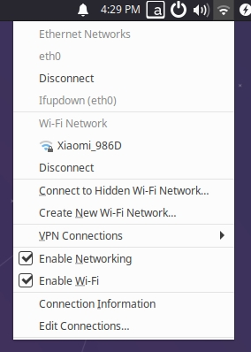

# 2.1 网络配置

本章节主要介绍开发板有线、无线网络配置的修改方法。

## 有线网络{#config_ethnet}

<iframe src="//player.bilibili.com/player.html?aid=700903305&bvid=BV1rm4y1E73q&cid=1196557461&page=11" scrolling="no" border="0" frameborder="no" framespacing="0" width="100%" height="500" allowfullscreen="true"> </iframe>

开发板有线网络默认采用静态IP配置，初始IP地址为`192.168.1.10`。用户可通过如下方法实现静态、DHCP模式的切换。

### 修改静态IP配置 
开发板静态网络配置保存在`/etc/network/interfaces`文件中，通过修改`address`、`netmask`、`gateway`等字段，可完成对静态IP配置的修改，`metric`是网络优先级配置，设置为`700`是为了让有线网络的优先级更低，当有线和无线网络同时使能时优先会使用无线网络，例如：

```shell
sudo vim /etc/network/interfaces
```

```shell
# interfaces(5) file used by ifup(8) and ifdown(8)
# Include files from /etc/network/interfaces.d:
source-directory /etc/network/interfaces.d
auto eth0
iface eth0 inet static
    address 192.168.1.10
    netmask 255.255.255.0
    gateway 192.168.1.1 
    metric 700
```

修改完成后，命令行输入`sudo restart_network`命令让配置生效。

### 修改DHCP配置
DHCP(Dynamic Host Configuration Protocol，动态主机配置协议)通常被应用在局域网络环境中，主要作用是集中的管理、分配IP地址，使网络环境中的主机动态的获得IP地址、Gateway地址、DNS服务器地址等信息，并能够提升地址的使用率。

开发板的DHCP网络配置保存在`/etc/network/interfaces`文件，通过修改eth0相关配置，可完成对DHCP模式的修改，例如：

```shell
sudo vim /etc/network/interfaces
```

```shell
source-directory /etc/network/interfaces.d
auto lo
iface lo inet loopback
auto eth0
iface eth0 inet dhcp
    metric 700
```

修改完成后，命令行输入`sudo restart_network`命令让配置生效。

### 修改MAC地址配置
如需修改开发板默认MAC地址，可通过在`/etc/network/interfaces`文件中增加`pre-up`配置信息，指定用户需要的MAC地址，例如：

```shell
sudo vim /etc/network/interfaces
```

```shell
# interfaces(5) file used by ifup(8) and ifdown(8)
# Include files from /etc/network/interfaces.d:
source-directory /etc/network/interfaces.d
auto eth0
iface eth0 inet static
    address 192.168.1.10
    netmask 255.255.255.0
    gateway 192.168.1.1 
    pre-up ifconfig eth0 hw ether 00:11:22:9f:51:27
```

修改完成后，`reboot`重启让配置生效。

## 无线网络

<iframe src="//player.bilibili.com/player.html?aid=700903305&bvid=BV1rm4y1E73q&cid=1196557610&page=12" scrolling="no" border="0" frameborder="no" framespacing="0" width="100%" height="500" allowfullscreen="true"> </iframe>

开发板集成了2.4GHz无线WiFi模块，支持Soft AP和Station两种模式，默认运行在Station模式下。下面介绍两种模式的使用方法。

### Station模式
Station模式下，开发板作为客户端，接入路由器无线热点进行联网。

- 对于使用Ubuntu Desktop版本系统的用户，可点击桌面右上角Wi-Fi图标，选择对应热点并输入密码以完成网络配置，如下图：  


- 对于使用Ubuntu Server版本系统的用户，可通过命令行完成无线网络配置，步骤如下：

1. 使用`sudo nmcli device wifi rescan`命令扫描热点。如返回如下信息，说明扫描过于频繁，需要稍后再试
    ```shell
    root@ubuntu:~# sudo nmcli device wifi rescan
    Error: Scanning not allowed immediately following previous scan.
    ```
2. 使用`sudo nmcli device wifi list`命令列出扫描到的热点
3. 使用 `sudo wifi_connect "SSID" "PASSWD"`命令连接热点，返回如下信息，说明网络连接成功
    ```shell
    root@ubuntu:~# sudo wifi_connect "WiFi-Test" "12345678" 
    Device 'wlan0' successfully activated with 'd7468833-4195-45aa-aa33-3d43da86e1a7'.
    ```
    :::tip
    如果连接热点后，返回如下信息，说明热点没有找到，可以执行`sudo nmcli device wifi rescan`命令重新扫描后再次连接
    
    ```shell
    root@ubuntu:~# sudo wifi_connect "WiFi-Test" "12345678" 
    Error: No network with SSID 'WiFi-Test' found.
    ```
    :::

### Soft AP模式

开发板无线网络默认运行在Station模式下，如需使用Soft AP模式，请按照以下步骤进行配置。

1. 安装`hostapd` 和 `isc-dhcp-server`

    ```shell
    sudo apt update
    sudo apt install hostapd
    sudo apt install isc-dhcp-server
    ```

2. 运行 `sudo vim /etc/hostapd.conf`命令来配置`hostapd.conf`，主要关注下面几个字段:

    ```shell
    interface=wlan0 #作为AP热点的网卡
    ssid=Sunrise #WiFi名字
    wpa=2 #0为WPA 2为WPA2 一般为2
    wpa_key_mgmt=WPA-PSK #加密算法 一般为WPA-PSK
    wpa_passphrase=12345678 #密码
    wpa_pairwise=CCMP #加密协议，一般为CCMP
    ```

      - 无密码的热点配置，请在`hostapd.conf`文件添加以下内容：

    ```shell
    interface=wlan0
    driver=nl80211
    ctrl_interface=/var/run/hostapd
    ssid=Sunrise
    channel=6
    ieee80211n=1
    hw_mode=g
    ignore_broadcast_ssid=0
    ```

      - 有密码的热点配置，请在`hostapd.conf`文件添加以下内容：

    ```shell
    interface=wlan0
    driver=nl80211
    ctrl_interface=/var/run/hostapd
    ssid=Sunrise
    channel=6
    ieee80211n=1
    hw_mode=g
    ignore_broadcast_ssid=0
    wpa=2
    wpa_key_mgmt=WPA-PSK
    rsn_pairwise=CCMP
    wpa_passphrase=12345678
    ```

3. 配置`isc-dhcp-server`文件，步骤如下：

    - 执行 `sudo vim /etc/default/isc-dhcp-server`修改`isc-dhcp-server`文件，添加如下定义的网络接口：
    ```shell
    INTERFACESv4="wlan0"
    ```
    -  执行 `sudo vim /etc/dhcp/dhcpd.conf`修改`dhcpd.conf`文件， 取消以下字段的注释：
    ```shell
      authoritative;
    ```
    - 然后在 `/etc/dhcp/dhcpd.conf`文件末尾增加以下配置：
    ```shell
      subnet 10.5.5.0 netmask 255.255.255.0 { #网段和子网掩码
      range 10.5.5.100 10.5.5.254;#可获取的IP范围
      option subnet-mask 255.255.255.0; #子网掩码
      option routers 10.5.5.1;#默认网关
      option broadcast-address 10.5.5.31;#广播地址
      default-lease-time 600;#默认租约期限，单位秒
      max-lease-time 7200;#最长租约期限，单位秒
    }
    ```

4. 停止 `wpa_supplicant` 服务，并重启 `wlan0`

    ```bash
    systemctl stop wpa_supplicant

    ip addr flush dev wlan0
    sleep 0.5
    ifconfig wlan0 down
    sleep 1
    ifconfig wlan0 up
    ```

5. 按如下步骤启动 `hostapd`服务
   - 执行`sudo hostapd -B /etc/hostapd.conf`命令
   ```bash
    root@ubuntu:~# sudo hostapd -B /etc/hostapd.conf
   
    Configuration file: /etc/hostapd.conf
    Using interface wlan0 with hwaddr 08:e9:f6:af:18:26 and ssid "sunrise"
    wlan0: interface state UNINITIALIZED->ENABLED
    wlan0: AP-ENABLED
   ```
   - 通过`ifconfig`命令，配置无线接口`wlan0`的IP和网段，注意要跟第三步的配置保持一致
    ```bash
    sudo ifconfig wlan0 10.5.5.1 netmask 255.255.255.0
    ```
   - 最后开启`dhcp`服务器，连上热点会从`10.5.5.100`到`10.5.5.255`之间分配一个ip地址给客户端
    ```bash
    sudo ifconfig wlan0 10.5.5.1 netmask 255.255.255.0
    sudo systemctl start isc-dhcp-server
    sudo systemctl enable isc-dhcp-server
    ```

6. 连接开发板热点，例如 `sunrise`   
  

7. 如需切换回`Station`模式，可按如下方式进行：
    ```bash
    # 停止 hostapd
    killall -9 hostapd
    
    # 清除 wlan0 的地址
    ip addr flush dev wlan0
    sleep 0.5
    ifconfig wlan0 down
    sleep 1
    ifconfig wlan0 up
    
    # 重启 wpa_supplicant
    systemctl restart wpa_supplicant
    
    # 连接热点,，具体操作可以查看上一章节 “无线网络”
    wifi_connect "WiFi-Test" "12345678"
    ```

## DNS服务

<iframe src="//player.bilibili.com/player.html?aid=700903305&bvid=BV1rm4y1E73q&cid=1196557655&page=13" scrolling="no" border="0" frameborder="no" framespacing="0" width="100%" height="500" allowfullscreen="true"> </iframe>

DNS(Domain Name Server)是进行域名(domain name)和与之相对应的IP地址转换的服务器。

开发板DNS配置通过`/etc/systemd/resolved.conf`文件管理，用户可通过修改该文件完成DNS相关配置，步骤如下：
1. 修改`resolved.conf`文件，添加DNS服务器地址，例如：

    ```bash
    DNS=8.8.8.8 114.114.114.114
    ```

2. 通过如下命令，使能DNS配置：

    ```bash
    sudo systemctl restart systemd-resolved
    sudo systemctl enable systemd-resolved
    sudo mv /etc/resolv.conf  /etc/resolv.conf.bak
    sudo ln -s /run/systemd/resolve/resolv.conf /etc/
    ```