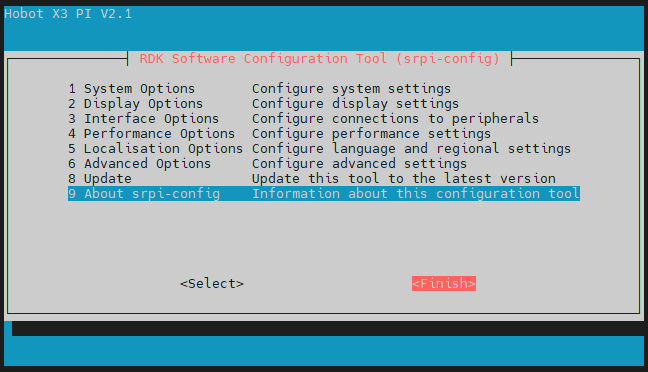

# 2.3 配置工具 srpi-config 使用指南

:::info 注意
`srpi-config`配置工具仅适用于`RDK X3`和`RDK X3 Module`开发板，不适用于`RDK Ultra`开发板
:::

## 简介

`srpi-config`是一个系统配置工具，要打开配置工具，请在命令行中键入以下命令：

```
sudo srpi-config
```

> sudo 是提权管理命令，这里必须输入，这样就可以root权限来进行配置管理，默认的sunrise账号不具备系统文件修改权限。


如果您使用的是桌面系统，那么您可以在菜单中找到`RDK Configuration`应用来进行配置。同样会打开如上图一样的配置终端。


## System Options

系统选项菜单，允许对Wi-Fi网络、用户密码、主机名、系统登录模式、浏览器选择等各个部分进行配置更改，以及一些系统级别的更改。


- **Wireless LAN**

  设置无线网络的`SSID`和`密码`。

- **Password**

  更改“默认”用户密码，默认账号为 `sunrise`。

- **Hostname**

  设置当前设备在网络上的可见名称。

- **Boot / Auto login**

  选择是引导到控制台还是桌面，以及是否需要自动登录。如果选择自动登录，会使用系统默认账号 `sunrise` 的身份进行登录。

- **Power LED**

  如果 RDK 的型号允许，可以在这个选项中更改电源 LED 的行为。默认是熄灭或者闪烁。

- **Browser**

  如果使用的桌面系统，可以设置默认的浏览器。不配置的情况下默认使用 `firefox`， 用户可以通过命令 `sudo apt install chromium`安装`chromium`浏览器。

## Display Options

显示选项菜单。


- **FB Console Resolution**

  支持设置`Server`系统和`console`模式下的HDMI显示分辨率。

## Interface Options

接口选项菜单，有以下选项可启用/禁用：SSH、VNC、SPI、I2C、I2S、Serial等功能。


- **SSH**

  使用 SSH 启用/禁用对`RDK`的远程登录。默认情况下系统是启用SSH选项的。

- **VNC**

  启用/禁用 X11vnc 虚拟网络计算服务器。

> VNC (Virtual Network Console)是虚拟网络控制台的缩写，它是一款远程控制软件，远程访问桌面系统时可以启用这个选项。

- **Peripheral bus config**

  启用/禁用40pin接口上的 SPI、I2C、Serial Port、I2S等接口。本配置方式会直接修改使用的设备树文件的对应总线的`status`，重启后生效。

  

- **Configure Wi-Fi antenna**
  切换Wi-Fi天线模式，支持设置使用板载还是外置天线。

> 当前进RDK X3 V2.1 版本支持。

## Performance Options

性能选项，包括超频、CPU运行模式和定频设置、调整ION内存大小等功能。


- **CPU frequency**

  可以使用此工具对的 RDK 的 CPU 进行超频，一般不建议开启，如果做好充分散热工作可以尝试修改此选项。

  

- **ION memory**

  可以通过此选项配置ION内存的常用大小。

> ION 内存是预留出来给BPU和图像、视频多媒体功能的物理内存空间。默认配置大小为672MB，如果需要运行比较大的算法模型、同时编解码多路视频时，请根据具体需要调整该内存大小。

## Localisation Options

本地化选项，为您提供以下选项供您选择：本地语言、时区、键盘布局。


- **Locale**

  选择一个语言环境，例如配置中文环境`zh_CN.UTF-8`，重启生效。

- **Time Zone**

  选择您当地的时区，从地区开始，例如亚洲，然后选择一个城市，例如上海。键入一个字母以将列表向下跳到字母表中的该点。

- **Keyboard**

  读取所有键盘类型需要很长时间才能显示。更改通常会立即生效，但可能需要重新启动。

## Advanced Options

高级选项，可以对磁盘扩展、网络代理等选项进行设置。


- **Expand Filesystem**

  此选项将扩展安装以填满整个 TF 卡，提供更多空间用于文件系统。

> 如果系统是通过从另一张已经完成初始化配置的系统中复制而来的，那么系统的`TF`卡容量可能不会被自动调整为当前TF卡的容量。使用此功能可以方便地完成扩展。

- **Network Proxy Settings**

  配置网络的代理设置。

- **Boot Order**

  RDK X3 Module支持从eMMC和SD卡两种模式启动系统，本选项用于切换启动模式。

## Update

将`srpi-config`工具更新到最新版本。

## About srpi-config

关于 `srpi-config` 的信息

选择此选项会显示以下信息：


## Finish 按钮



完成更改后选中 `Finish` 按钮。系统将询问您是否要重新启动。首次使用时，最好重新启动。
