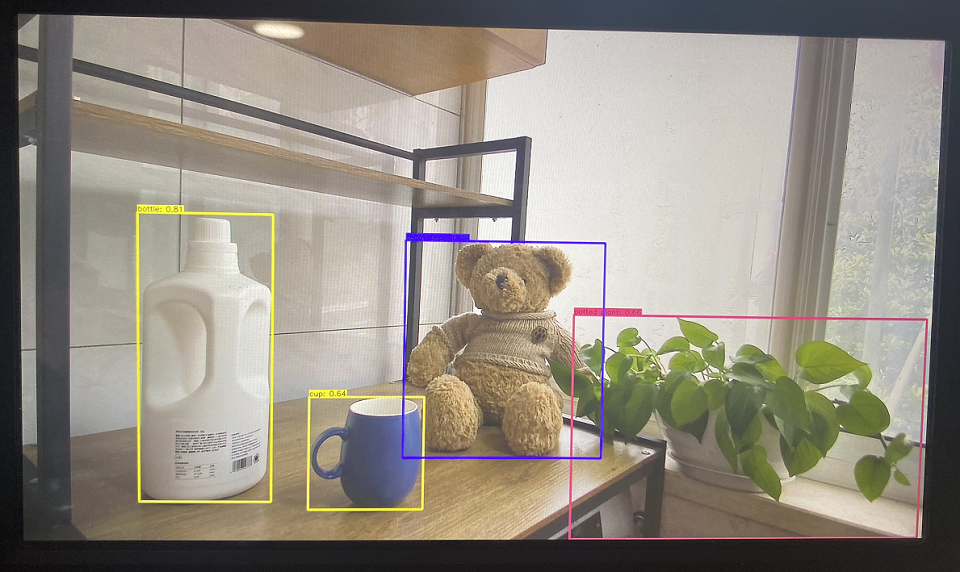

# 3.3 USB摄像头使用

<iframe src="//player.bilibili.com/player.html?aid=700903305&bvid=BV1rm4y1E73q&cid=1196558282&page=18" scrolling="no" border="0" frameborder="no" framespacing="0" width="100%" height="500" allowfullscreen="true"> </iframe>

开发板上安装了 `usb_camera_fcos.py` 程序用于测试USB摄像头的数据通路，该示例会实时采集USB摄像头的图像数据，然后运行目标检测算法，最后把图像数据和检测结果融合后通过HDMI接口输出。

## 环境准备

  - USB摄像头接入到开发板上，确认生成`/dev/video8`设备节点
  - 通过HDMI线缆连接开发板和显示器

## 运行方式
按照以下命令执行程序

  ```shell
  sunrise@ubuntu:~$ cd /app/pydev_demo/02_usb_camera_sample/
  sunrise@ubuntu:/app/pydev_demo/02_usb_camera_sample$ sudo python3 ./usb_camera_fcos.py
  ```

## 预期效果
程序执行后，显示器会实时显示摄像头画面及目标检测算法的结果(目标类型、置信度)，如下所示：  
  

:::tip

详细代码实现说明请查阅[基于USB摄像头推理](/python_development/pydev_dnn_demo/usb_camera)章节。

:::