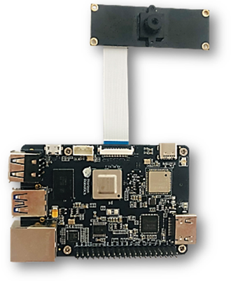
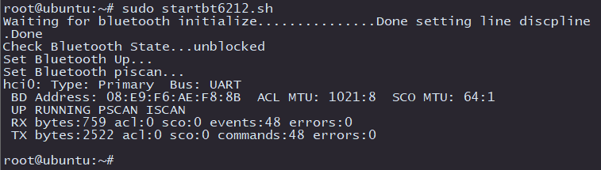
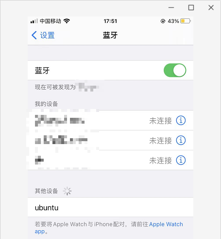
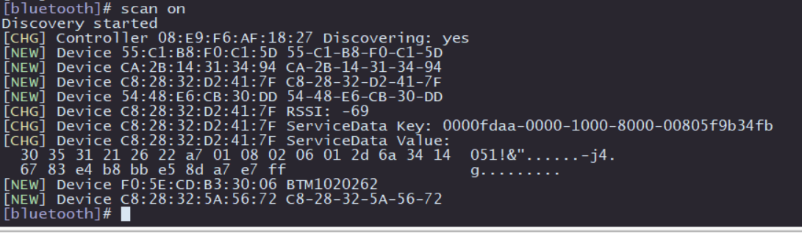
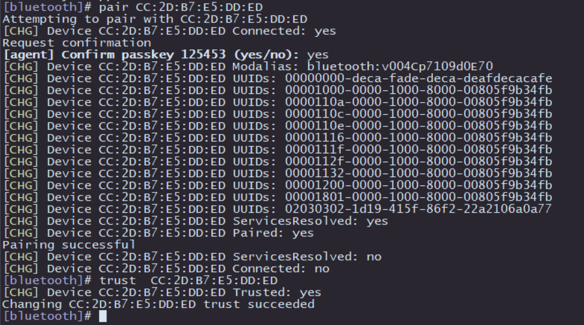
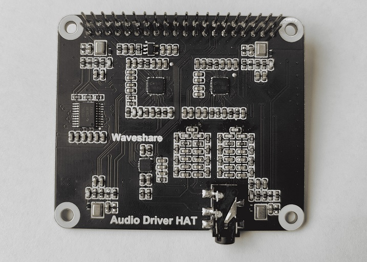
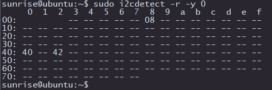
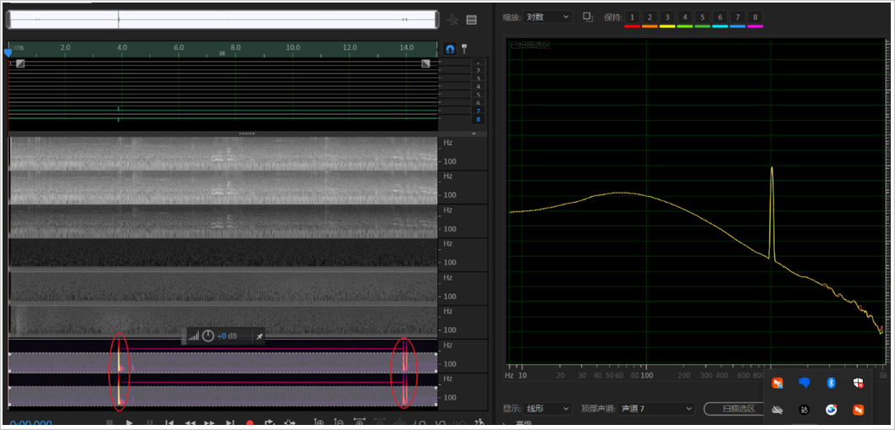

# 1.4 硬件接口说明

## 接口总览

RDK X3开发板提供了网口、USB、摄像头、LCD、HDMI、40PIN等功能接口，方便用户进行图像多媒体、深度学习算法等应用的开发和测试。开发板接口布局如下：


| 序号 | 功能 | 序号 | 功能 | 序号 | 功能 |
| -------- | ---------------------------- | -------- | ----------------------- | ----------------------- | ----------------------- |
| 1        | USB Type C 供电接口         | 6                                  | USB 3.0 Type A接口                  | 11                                 | Wi-Fi天线接口                   |
| 2        | MIPI CSI 摄像头接口         | 7                                  | 千兆以太网口                        | 12                                 | TF卡接口（底面）                    |
| 3        | 调试串口                     | 8                                  | 40PIN接口                           | 13                                 | MIPI 接口的LCD屏接口                |
| 4        | Micro USB 2.0 接口           | 9                                  | HDMI接口                            | 14 | 触摸屏接口 |
| 5 | USB 2.0 Type A接口两路 | 10                                 | 电源和状态LED指示灯                 |  |  |

## 电源接口

开发板提供一路USB Type C接口(接口1)，作为供电接口，需要使用支持**5V/3A**的电源适配器为开发板供电。将电源适配器接入开发板后，**开发板红色电源指示灯亮起**，说明开发板供电正常。

注意，请不要使用电脑USB接口为开发板供电，否则会因供电不足造成开发板**异常断电、反复重启**等情况。

## 调试串口{#debug_uart}

开发板提供一路调试串口(接口3)，以实现串口登录、调试功能。电脑串口工具的参数配置如下：

- 波特率（Baud rate）：921600
- 数据位（Data bits）：8
- 奇偶校验（Parity）：None
- 停止位（Stop bits）：1
- 流控（Flow Control）：无

串口连接时，需要将杜邦线接入开发板接口3，串口USB转接板接入电脑。连接完成后如下图：  


## 有线网口

开发板提供一路千兆以太网接口(接口7)，支持1000BASE-T、100BASE-T标准，默认采用静态IP模式，IP地址`192.168.1.10`。如需确认开发板IP地址，可通过串口登录设备，并用`ifconfig`命令进行查看 `eth0`网口的配置：
```bash
sunrise@ubuntu:/# ifconfig 
eth0: flags=4163<UP,BROADCAST,RUNNING,MULTICAST>  mtu 1500
        inet 192.168.1.10  netmask 255.255.255.0  broadcast 192.168.1.255
        inet6 fe80::211:22ff:fe6f:de17  prefixlen 64  scopeid 0x20<link>
        ether 00:11:22:6f:de:17  txqueuelen 1000  (Ethernet)
        RX packets 112  bytes 7327 (7.3 KB)
        RX errors 0  dropped 0  overruns 0  frame 0
        TX packets 197  bytes 8678 (8.6 KB)
        TX errors 0  dropped 0 overruns 0  carrier 0  collisions 0
        device interrupt 39  base 0xc000 
```
开发板插入网线后，以太网驱动会建立连接，如果系统有如下打印，说明网线连接正常：
```bash
[13293.952661] st_gmac a5014000.ethernet eth0: Link is Down
[13295.062996] st_gmac a5014000.ethernet: Link is Up - 1000/Full 
[13296.000750] st_gmac a5014000.ethernet eth0: Link is Up - 1Gbps/Full - flow control rx/tx
```

## HDMI接口{#hdmi_interface}

开发板提供一路HDMI(接口9)显示接口，最高支持1080P分辨率。开发板通过HDMI接口在显示器输出Ubuntu系统桌面(Ubuntu Server版本显示logo图标)。此外，HDMI接口还支持实时显示摄像头、网络流画面功能。

目前HDMI接口支持的显示分辨率如下：

- 1920x1080
- 1280x720
- 1024x600
- 800x480

## USB接口

由于X3芯片只提供一路USB接口，开发板通过硬件电路实现了多路USB接口扩展，满足用户对多路USB设备接入的需求，接口描述如下：

| 接口类型 | 接口序号 |  接口数量 |  接口描述  |
| ------ | ------ | ------- | ------- |
| Micro USB 2.0  | 接口4 | 1路 | USB Device模式，用于连接主机实现ADB、Fastboot、UVC等功能 |
| USB 2.0 Type A | 接口5 | 2路 | USB Host模式，用于接入USB 2.0外设 |
| USB 3.0 Type A | 接口6 | 1路 | USB Host模式，用于接入USB 3.0外设 |

USB主从模式切换完全由硬件电路实现，用户只需按照上表的逻辑连接设备即可。

开发板USB Host、Device功能互斥，Device接口接入设备后，Host接口会自动失效。

**接入U盘**  

<iframe src="//player.bilibili.com/player.html?aid=700903305&bvid=BV1rm4y1E73q&cid=1196553711&page=5" scrolling="no" border="0" frameborder="no" framespacing="0" width="100%" height="500" allowfullscreen="true"> </iframe>

开发板USB Type A接口(接口5和6)，支持U盘功能，可自动检测U盘接入并挂载，默认挂载目录为`/media/sda1`。用户可通过touch命令确认U盘工作正常，如下：

```bash
sunrise@ubuntu:/media/sda1$ sudo touch test
[sudo] password for sunrise: 
sunrise@ubuntu:/media/sda1$ ls -l test 
-rwxr-xr-x 1 root root 0 Apr 30 21:19 test
sunrise@ubuntu:/media/sda1$
```

**接入USB串口转接板**

开发板USB Type A接口(接口5和6)，支持USB串口转接板功能，可自动检测USB串口转接板接入并创建设备节点`/dev/ttyUSB*` 或者 `/dev/ttyACM*`（星号代表0开始的数字）。用户可参考 [使用串口](../python_software_development/40pin_user_guide#40pin_uart_usage) 章节对串口进行使用。

## USB摄像头

<iframe src="//player.bilibili.com/player.html?aid=700903305&bvid=BV1rm4y1E73q&cid=1196554247&page=6" scrolling="no" border="0" frameborder="no" framespacing="0" width="100%" height="500" allowfullscreen="true"> </iframe>

开发板USB Type A接口(接口5和6)，支持USB摄像头功能，可自动检测USB摄像头接入并创建设备节点`/dev/video8`。用户可通过`v4l2`命令确认USB摄像头工作正常，如下：

```bash
sunrise@ubuntu:/media/sda1$ sudo v4l2-ctl -d /dev/video8 --all
Driver Info:
        Driver name      : uvcvideo
        Card type        : FHD Camera: FHD Camera
        Bus info         : usb-xhci-hcd.0.auto-1.2
        Driver version   : 4.14.87
        Capabilities     : 0x84200001
                Video Capture
                Streaming
                Extended Pix Format
                Device Capabilities
        Device Caps      : 0x04200001
                Video Capture
                Streaming
                Extended Pix Format
Media Driver Info:
        Driver name      : uvcvideo
        Model            : FHD Camera: FHD Camera
        Serial           : 12345
        Bus info         : 1.2
        Media version    : 4.14.87
        Hardware revision: 0x00000020 (32)
        Driver version   : 4.14.87
Interface Info:
        ID               : 0x03000002
        Type             : V4L Video
Entity Info:
        ID               : 0x00000001 (1)
        Name             : FHD Camera: FHD Camera
        Function         : V4L2 I/O
        Pad 0x01000004   : Sink
          Link 0x0200000a: from remote pad 0x1000007 of entity 'Processing 2': Data, Enabled, Immutable
Priority: 2
Video input : 0 (Camera 1: ok)
Format Video Capture:
        Width/Height      : 1920/1080
        Pixel Format      : 'MJPG' (Motion-JPEG)
        Field             : None
        Bytes per Line    : 0
        Size Image        : 4147200
        Colorspace        : Default
        Transfer Function : Default (maps to Rec. 709)
        YCbCr/HSV Encoding: Default (maps to ITU-R 601)
        Quantization      : Default (maps to Full Range)
        Flags             : 
Crop Capability Video Capture:
        Bounds      : Left 0, Top 0, Width 1920, Height 1080
        Default     : Left 0, Top 0, Width 1920, Height 1080
        Pixel Aspect: 1/1
Selection Video Capture: crop_default, Left 0, Top 0, Width 1920, Height 1080, Flags: 
Selection Video Capture: crop_bounds, Left 0, Top 0, Width 1920, Height 1080, Flags: 
Streaming Parameters Video Capture:
        Capabilities     : timeperframe
        Frames per second: 30.000 (30/1)
        Read buffers     : 0
```

## MIPI摄像头{#mipi_port}

<iframe src="//player.bilibili.com/player.html?aid=700903305&bvid=BV1rm4y1E73q&cid=1196554333&page=7" scrolling="no" border="0" frameborder="no" framespacing="0" width="100%" height="500" allowfullscreen="true"> </iframe>

开发板提供1路MIPI CSI接口(接口2)，可实现MIPI摄像头的接入。目前开发板适配了多种规格的摄像头模组，模组型号、规格如下：

| 序号 | Sensor |   分辨率  |  FOV  | I2C 设备地址 |
| --- | ------ | ------- | ------- | ------- |
|  1  | GC4663 | 400W | H:104 V:70 D:113 | 0x29 |
|  2  | JXF37  | 200W | H:62  V:37 D:68   | 0x40 |
|  3  | IMX219  | 800W | H:62  V:37 D:68   | 0x10 |
|  4  | IMX477  | 1200W | H:62  V:37 D:68   | 0x1a |
|  5  | OV5647  | 500W | H:62  V:37 D:68   | 0x36 |

摄像头模组通过FPC排线跟开发板连接，注意排线两端蓝面向上插入连接器。

:::caution 注意
重要提示：严禁在开发板未断电的情况下插拔摄像头，否则非常容易烧坏摄像头模组。
:::

以JXF37摄像头模组为例，安装完成后如下图：  


安装完成后，用户可以通过i2cdetect命令确认模组I2C地址能否正常检测到。如检测不到，用户需要检查FPC排线连接是否正常。成功探测到I2C地址时，log打印如下所示：
```bash
# 首先使能sensor的24MHz主时钟
sunrise@ubuntu:~# sudo bash -c "echo 1 > /sys/class/vps/mipi_host0/param/snrclk_en"
sunrise@ubuntu:~# sudo bash -c "echo 24000000 > /sys/class/vps/mipi_host0/param/snrclk_freq"
# 执行 i2cdetect 命令探测， 其中显示的 40 即JXF37这颗sensor的i2c设备地址，说明摄像头连接正常
sunrise@ubuntu:~# sudo i2cdetect -y -r 1
     0  1  2  3  4  5  6  7  8  9  a  b  c  d  e  f
00:          -- -- -- -- -- -- -- -- -- -- -- -- -- 
10: -- -- -- -- -- -- -- -- -- -- -- -- -- -- -- -- 
20: -- -- -- -- -- -- -- -- -- -- -- -- -- -- -- -- 
30: -- -- -- -- -- -- -- -- -- -- -- UU -- -- -- -- 
40: 40 -- -- -- -- -- -- -- -- -- -- -- -- -- -- -- 
50: -- -- -- -- -- -- -- -- -- -- -- -- -- -- -- -- 
60: -- -- -- -- -- -- -- -- -- -- -- -- -- -- -- -- 
70: -- -- -- -- -- -- -- --                         
```

## Micro SD接口

开发板提供1路Micro SD存储卡接口(接口12)。推荐使用至少8GB容量的存储卡，以便满足Ubuntu操作系统及相关功能包的安装要求。

开发板使用中禁止热插拔TF存储卡，否则会造成系统运行异常，甚至造成存储卡文件系统损坏。

## Wi-Fi天线接口

<iframe src="//player.bilibili.com/player.html?aid=700903305&bvid=BV1rm4y1E73q&cid=1196557162&page=8" scrolling="no" border="0" frameborder="no" framespacing="0" width="100%" height="500" allowfullscreen="true"> </iframe>

开发板的无线网络支持板载和外置天线两种配置，通常情况下板载天线可以满足使用需求。当开发板安装金属材质外壳后，需要连接外置天线到（接口11），以增强信号强度。

## 40pin header接口

RDK X3开发板提供40pin header接口，IO信号采用3.3V电平设计。管脚定义兼容树莓派等产品，详细管脚定义、复用关系如下：


开发板40PIN接口位置提供了丝印网表，方便用户对照操作，PIN1、PIN40位置如下：


40PIN各功能的使用方法请查看 [40PIN 功能使用](../python_software_development/40pin_user_guide.md) 章节。

## 蓝牙

<iframe src="//player.bilibili.com/player.html?aid=700903305&bvid=BV1rm4y1E73q&cid=1196557328&page=9" scrolling="no" border="0" frameborder="no" framespacing="0" width="100%" height="500" allowfullscreen="true"> </iframe>

### 初始化

开发板蓝牙功能默认没有开启，需要执行 `/usr/bin/startbt6212.sh`脚本进行初始化，该脚本完成以下工作：

- 复位蓝牙
- 创建 `messagebus` 用户和用户组，`dbus-daemon` 程序运行时需要使用该用户
- 运行 `brcm_patchram_plus` 完成蓝牙的驱动加载和固件加载
- 循环检查 `/sys/class/bluetooth/hci0` 目录是否存在，确认蓝牙驱动已经正常运行
- 出现 **Done setting line discpline**  表示蓝牙启用成功
- 执行 `hciconfig hci0 up`  完成蓝牙的Link Up
- 执行 `hciconfig hci0 piscan` 进行蓝牙扫描，本步骤可以根据情况去掉

脚本执行成功后的log如下：



此外，用户可以使用命令查询蓝牙进程是否正常，命令如下：

```bash
ps ax | grep "/usr/bin/dbus-daemon\|brcm_patchram_plus\|/usr/lib/bluetooth/bluetoothd"`
/usr/bin/dbus-daemon

brcm_patchram_plus

/usr/lib/bluetooth/bluetoothd
```

### 配网连接

执行`sudo bluetoothctl`进入交互模式下的蓝牙配置界面，出现了类似下图的设备信息表示蓝牙被识别到了，然后用`show`来查看蓝牙信息，留意蓝牙的`powered`和`discoverable`状态。


执行 `power on` 使能蓝牙，如下图所示：


为了能够使蓝牙被附近的设备发现，需要执行`discoverable on`使能蓝牙并打开蓝牙可发现属性，如下图所示：


此时使用手机或者电脑扫描蓝牙就可以发现 `ubuntu` 这个名称的蓝牙设备：



接下来测试蓝牙的主动扫描功能，在`bluetoothctl`的交互界面输入`scan on`即可打开主动扫描，它会周期性地打印附近的设备，可以看到已经发现了我的手机设备，`scan off`关闭扫描功能并汇总打印扫描到的蓝牙设备：




然后就是和其他蓝牙的配对：

- 配对命令：`pair [targetMAC] `，输入该命令后，根据提示输入`yes`，对端蓝牙设备选择`配对`选项完成配对。

- 配对成功后可以使用`trust [targetMAC]`来让下次自动连接



经过以上操作后，蓝牙的扫描、配对的基本功能就完成了，如需使用更多功能，可查阅 `BlueZ`的官方帮助说明。

## 音频子板

<iframe src="//player.bilibili.com/player.html?aid=700903305&bvid=BV1rm4y1E73q&cid=1196557429&page=10" scrolling="no" border="0" frameborder="no" framespacing="0" width="100%" height="500" allowfullscreen="true"> </iframe>

RDK X3的40PIN接口上有两路i2s接口，通过他们可以外接音频`codec`，实现音频采集和播放。地平线提供音频模块供开发调试使用，该转接板提供I2S的传输通路，实现音频数据在音频子板与RDK X3单板之间的传输；提供DAC与模拟信号接口，实现外置扬声器的接入；并且提供AEC功能需要的参考信号回传。音频模块设计框图、实物图如下：





### 接口连接

音频子板对齐插入RDK X3位号J23的40pin插针，二者引脚与引脚均应对齐；实物连接图如下：


### 驱动初始化

首先上电检查i2c是否可以和`ES7210`, `ES8156`正常通信，接好单板后，运行 `sudo i2cdetect -r -y 0`检查设备接入情况，其中`08`是`ES8156`的设备地址，`40`和`42`是 `ES7210`的设备地址。



加载驱动音频codec驱动和X3音频框架驱动：

```bash
sudo modprobe es7210
sudo modprobe es8156
sudo modprobe hobot-i2s-dma
sudo modprobe hobot-cpudai
sudo modprobe hobot-snd-7210 snd_card=5
```

成功加载后，运行 `ls  /dev/snd` 命令可以看到已经生成音频控制节点，pcm的录音、播放节点。


### 录音及播音

采集4通道麦克风的录音5秒钟：

```
tinycap ./4chn_test.wav -D 0 -d 0 -c 4 -b 16 -r 48000 -p 512 -n 4 -t 5
```

采集2通道麦克风的录音5秒钟：

```
tinycap ./2chn_test.wav -D 0 -d 0 -c 2 -b 16 -r 48000 -p 512 -n 4 -t 5
```

播放**2通道**的音频（**不支持直接播放4通道录音**）：

```
tinyplay ./2chn_test.wav -D 0 -d 1
```

然后使用音箱或者3.5mm接口耳塞接入插口中，试听音频效果。


### AEC功能使用

若想使用AEC功能，先使用下面录音指令启动录音：
```shell
tinycap ./8chn_test.wav -D 0 -d 0 -c 8 -b 16 -r 48000 -p 512 -n 4 -t 5
```
然后使用下面指令播放测试音频：
```shell
tinyplay ./2chn_test.wav -D 0 -d 1
```
那么保存下来的录音文件即AEC回传的参考信号音频。可通过专业音频软件分析其频谱。

**AEC测试分析：**

播放频率为1k的测试音频；获取AEC的回采信号，分析如图



回采信号在7-8声道，在播放开始和结束的瞬间有爆破音，其余时间的底噪很低。

### 桌面系统使用音频子板

当您在使用RDK X3的桌面系统时，此时想要通过浏览器看视频，听音频的时候，可以按照以下方法配置，使能音频播放功能。

**安装播放软件**

安装smplayer播放软件
```bash
sudo apt update
sudo apt-get install smplayer
```
安装pulseaudio声音服务器
```bash
sudo apt install pavucontrol
sudo apt install pulseaudio
```
完成以上软件安装后，修改如下配置项：

1. 打开文件 `/etc/pulse/default.pa`, 找到`.ifexists module-udev-detect.so` 这一行，修改为如下内容：
```bash
### Automatically load driver modules depending on the hardware available
.ifexists module-udev-detect.so
#load-module module-udev-detect
load-module module-alsa-source device=hw:0,0
load-module module-alsa-sink device=hw:0,1 mmap=false tsched=0 fragments=2 fragmm
ent_size=960 rate=48000 channels=1 rewind_safeguard=960
.else
### Use the static hardware detection module (for systems that lack udev supportt
)
```
2. 打开文件`/etc/rc.loacl`, 在文件**最后**添加音频驱动的加载命令：
```bash
modprobe es7210
modprobe es8156
modprobe hobot-i2s-dma
modprobe hobot-cpudai
modprobe hobot-snd-7210 snd_card=5
```
配置完成后，重启开发板。

**注意事项**
1. 修改后识别不到设备，通过以下方式在终端执行
```bash
# 启动pulseaudio服务
pulseaudio --start

# 显示加载的模块信息
pactl list sinks
```
检查是否能显示加载到的模块信息。如果不显示任何模块信息，表示pulseaudio服务启动失败。终端执行pulseaudio -vvv，打开debug log检查pulseaudio服务挂在何处。

2. 按照修改项配置修改后，桌面系统依然识别不到设备
模块加载时的device=hw:0,1，依赖当前环境下加载到的设备。
通过命令`aplay -l`确认当前环境真实输出设备对应的节点。例如这里得到的为card 0、device 1。因此对应的device=hw:0,1。那么`/etc/pulse/default.pa`配置中的节点信息依据现实情况做改动。
```bash
root@ubuntu:~# aplay -l
**** List of PLAYBACK Hardware Devices ****
card 0: hobotsnd5 [hobotsnd5], device 1: (null) es8156.0-0008-1 []
  Subdevices: 1/1
  Subdevice #0: subdevice #0
```
