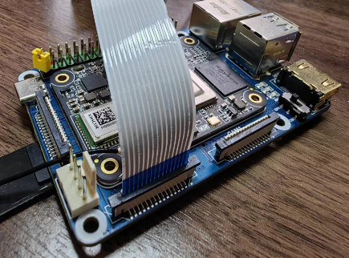

# 9.2 RDK X3 Module硬件说明

## 硬件资料

本章节提供RDK X3 Module（旭日X3模组）的规格书、数据手册、参考设计、硬件设计指导等资料，帮助开发者全面了解产品，并为硬件设计工作提供指导。

### 基础手册

规格书
- [RDK X3 Module规格书](http://archive.sunrisepi.tech/downloads/hardware/rdk_x3_module/RDK_X3_Module_Product_Brief.pdf)

数据手册
- [RDK X3 Module数据手册](http://archive.sunrisepi.tech/downloads/hardware/rdk_x3_module/RDK_X3_Module_Datasheet.pdf)

### 参考设计资料

主要包含原理图、PCB、3d模型、BOM list、gerber等资料内容，下载链接如下：

- [RDK X3 Module参考设计资料](http://archive.sunrisepi.tech/downloads/hardware/rdk_x3_module/reference_design)

**说明：** RDK X3 Module原理图、PCB等设计资料暂不开放。

### 设计指导手册

硬件设计指导
- [RDK X3 Module硬件设计指导](http://archive.sunrisepi.tech/downloads/hardware/rdk_x3_module/RDK_X3_Module_Design_Guide.pdf)

管脚复用说明
- [RDK X3 Module Pinmux说明](http://archive.sunrisepi.tech/downloads/hardware/rdk_x3_module/RDK_X3_Module_PINMUX.xlsx)

### 40PIN管脚说明
RDK X3 Module开发者套件的40PIN管脚定义、复用关系如下：


## 认证配件清单

### 基础配件

| 类型 | 供应商 | 型号 | 描述 | 购买链接 |
| --- | --------- | -------- | --------------- | --------- |
| 电源 | 微雪 | ORD-PSU-12V2A-5.5-2.1-US | 12V/2A 定制电源 | [购买链接](https://www.waveshare.net/shop/ORD-PSU-12V2A-5.5-2.1-US.htm)  |
| 接口板 | 微雪 | CM4-IO-BASE-B | 定制接口板 | [购买链接](https://www.waveshare.net/shop/CM4-IO-BASE-B.htm)  |
| 散热器 | 微雪 | CM4-HEATSINK-B | 散热器 | [购买链接](https://www.waveshare.net/shop/CM4-HEATSINK-B.htm)  |
| 散热器 | 微雪 | CM4-HEATSINK | 散热器带风扇 | [购买链接](https://www.waveshare.net/shop/CM4-FAN-3007-5V.htm)  |
| Wi-Fi天线 | 微雪 | ORD-CM4-ANTENNA | SMA天线 支持2.4G/5G WiFi频段 | [购买链接](https://www.waveshare.net/shop/ORD-CM4-ANTENNA.htm)  |
| 板级连接器 | 广濑 | DF40C-100DS-0.4V(51) | 接口板连接器 | N/A  |

### <span id="camera"/>摄像头

| 类型 | 供应商 | 型号 | 描述 | 购买链接 |
| --- | --------- | -------- | --------------- | --------- |
| MIPI | 微雪 | OV5647摄像头 | OV5647传感器，500W像素，FOV 对角160度 | [购买链接](https://www.waveshare.net/shop/RPi-Camera-G.htm)  |
| MIPI | 微雪 | IMX219摄像头 | IMX219传感器，800W像素，FOV 对角200度 | [购买链接](https://www.waveshare.net/shop/IMX219-200-Camera.htm)  |
| MIPI | 微雪 | IMX477摄像头 | IMX477传感器，1230W像素，FOV 对角160度 | [购买链接](https://www.waveshare.net/shop/IMX477-160-12.3MP-Camera.htm)  |
| MIPI | 亚博 | IMX219摄像头 | IMX219传感器，800W像素，FOV 对角77度 | [购买链接](https://detail.tmall.com/item.htm?abbucket=2&id=710344235988&rn=f64e2bbcef718a13a9f9c261124febd2&spm=a1z10.5-b-s.w4011-22651484606.110.4df82edcjJ7wap)  |
| USB | 亚博 | USB摄像头 | 免驱USB麦克风摄像头，720p | [购买链接](https://detail.tmall.com/item.htm?abbucket=2&id=633040443710&rn=ed9c7f0eecc103e742248e32a32ba62e&spm=a1z10.5-b-s.w4011-22651484606.152.c3406a83G6l62o)  |
| USB | 轮趣 | USB摄像头 | 免驱USB摄像头，金属外壳，1080p | [购买链接](https://detail.tmall.com/item.htm?abbucket=12&id=666156389569&ns=1&spm=a230r.1.14.1.13e570f3eFF1sJ&skuId=4972914294771)  |


### 显示屏

| 类型 | 供应商 | 型号 | 描述 | 购买链接 |
| --- | --------- | -------- | --------------- | --------- |
| HDMI | 微雪 | 5英寸触控屏  | 分辨率800×480，钢化玻璃面板，支持触控 | [购买链接](https://www.waveshare.net/shop/5inch-HDMI-LCD-H.htm)  |
| HDMI | 微雪 | 7英寸触控屏 | 分辨率1024x600，钢化玻璃面板，支持触控 | [购买链接](https://www.waveshare.net/shop/7inch-HDMI-LCD-H.htm)  |
| HDMI | 微雪 | 10英寸触控屏 | 分辨率1280x800，钢化玻璃面板，高色域触控屏 | [购买链接](https://www.waveshare.net/shop/10.1HP-CAPLCD-Monitor.htm)  |
| HDMI | 微雪 | 13.3英寸触控屏 | 分辨率1920x1080，钢化玻璃面板，高色域触控屏 | [购买链接](https://www.waveshare.net/shop/13.3inch-HDMI-LCD-H-with-Holder-V2.htm)  |
| MIPI | 微雪 | 4.3英寸MIPI LCD | 分辨率800×480，IPS广视角，MIPI DSI接口  | [购买链接](https://www.waveshare.net/shop/4.3inch-DSI-LCD.htm)  |

## 微雪载板使用说明

本章节介绍RDK X3 Module配合第三方载板的使用方法。该载板是微雪为树莓派CM4设计的第三方载板，由于RDK X3 Module接口兼容树莓派CM4，因此可以配套使用以实现摄像头采集、HDMI/LCD显示、网络/USB连接等功能。载板接口说明如下：  
  

载板通过Type C接口供电，推荐使用认证配件清单中推荐的5V/3A适配器。

### 系统烧录

对于系统镜像的烧录方法，请参考[安装系统](../getting_start/install_os)章节。

RDK X3 Module支持从eMMC和SD卡两种模式启动系统：

- 当模组上的eMMC没有烧录过系统镜像的情况下，插入制作好系统的SD卡到载板即可通过从SD卡启动系统。

- 如果模组上的eMMC已经烧录过系统镜像，可以按照以下步骤进行eMMC和SD卡启动的切换。

  1、默认情况下会从eMMC启动系统

  2、禁用eMMC的启动切换到使用SD卡启动系统，登录系统后，执行以下命名把eMMC的第二个分区的启动标志删除，并重启系统生效：

  ```shell
  sudo parted /dev/mmcblk0 set 2 boot off
  sudo reboot
  ```

  3、在uboot下会发现eMMC没有启动分区而去寻找去sd卡启动分区，从SD卡加载系统启动，登录系统后执行`mount`命令可以看到跟文件系统挂载在 SD 卡的 第二个分区，config分区也使用的SD卡的第一个分区。 

  ```txt
  /dev/mmcblk2p2 on / type ext4 (rw,relatime,data=ordered) 
  /dev/mmcblk2p1 on /boot/config type vfat
  ```

- 从SD卡启动切换回从eMMC启动

  当在使用SD卡启动系统时，并且eMMC上已经烧录过系统，执行以下命令恢复回从eMMC启动，重启系统生效。

  ```shell
  sudo parted /dev/mmcblk0 set 2 boot on
  sudo reboot
  ```


### USB接口

在微雪载板上USB 2.0 接口默认不可用。如果需要启动，你需要执行以下命令使能：

```shell
sudo bash -c "echo host > /sys/devices/platform/soc/b2000000.usb/b2000000.dwc3/role"
```

### MIPI摄像头使用

载板提供`CAM0`、`CAM1`两路MIPI CSI接口，可以支持OV5647、IMX219、IMX477等MIPI摄像头的接入。由于示例程序中已实现摄像头自适应，因此CSI接口跟摄像头无连接顺序限制。摄像头接入时，需保持排线蓝面朝外，接入方式如下：  



**重要提示：**
- **严禁在开发板未断电的情况下插拔摄像头，否则容易引起短路并烧坏摄像头模组。**

开发板上安装了`mipi_camera.py`程序用于测试MIPI摄像头的数据通路，该示例会实时采集MIPI摄像头的图像数据，然后运行目标检测算法，最后把图像数据和检测结果融合后通过HDMI接口输出。

- 运行方式：按照以下命令执行程序

  ```bash
  sunrise@ubuntu:~$ cd /app/pydev_demo/03_mipi_camera_sample/
  sunrise@ubuntu:/app/pydev_demo/03_mipi_camera_sample$ sudo python3 ./mipi_camera.py 
  ```

- 预期效果：程序执行后，显示器会实时显示摄像头画面及目标检测算法的结果(目标类型、置信度)。

### MIPI DSI显示屏使用

载板提供一路MIPI DSI接口，可以支持MIPI LCD屏幕显示。官方推荐的LCD屏幕型号如下：


| 类型 | 供应商 | 型号            | 描述                                   | 购买链接                                                     |
| ---- | ------ | --------------- | -------------------------------------- | ------------------------------------------------------------ |
| MIPI | 微雪   | 4.3英寸MIPI LCD | 分辨率800×480，IPS广视角，MIPI DSI接口 | [购买链接](https://www.waveshare.net/shop/4.3inch-DSI-LCD.htm) |

屏幕连接方式如下图所示：


**重要提示：**

- **严禁在开发板未断电的情况下插拔屏幕，否则容易引起短路并烧坏屏幕模组。**

由于RDK X3 Module 系统默认采用HDMI输出，需要通过命令切换到LCD显示方式，首先执行下面命令备份`DTB`

```shell
sudo cp /boot/hobot/hobot-x3-cm.dtb /boot/hobot/hobot-x3-cm_backup.dtb
```

执行以下命令确定当前显示类型：

```shell
sudo fdtget /boot/hobot/hobot-x3-cm.dtb /chosen bootargs
```
以`HDMI`为例，执行上述命令将会打印：

```shell
sunrise@ubuntu:~$ sudo fdtget /boot/hobot/hobot-x3-cm.dtb /chosen bootargs
earlycon loglevel=8 kgdboc=ttyS0 video=hobot:x3sdb-hdmi
```

执行以下命令修改`chosen`节点：

```shell
sudo fdtput -t s /boot/hobot/hobot-x3-cm.dtb /chosen bootargs "earlycon loglevel=8 kgdboc=ttyS0 video=hobot:cm480p"
```
执行以下命令打印出修改后的节点，确定修改成功：

```shell
sudo fdtget /boot/hobot/hobot-x3-cm.dtb /chosen bootargs
```


输入以下命令重启开发板：

```shell
sync
sudo reboot
```

此时的显示方式就从`HDMI`切换成`DSI`了。

如果想切回`HDMI`显示，进入内核后，执行下面命令：

```shell
sudo cp /boot/hobot/hobot-x3-cm_backup.dtb /boot/hobot/hobot-x3-cm.dtb
sync
```

然后`sudo reboot`重启开发板即可。
