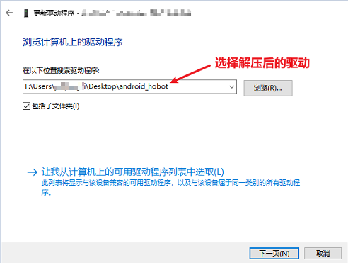

# 8.2 RDK X3 Module硬件说明

## 硬件资料

本章节提供RDK X3 Module（旭日X3模组）的规格书、数据手册、参考设计、硬件设计指导等资料，帮助开发者全面了解产品，并为硬件设计工作提供指导。

### 基础手册

**规格书**
- [RDK X3 Module规格书](http://archive.sunrisepi.tech/downloads/hardware/rdk_x3_module/RDK_X3_Module_Product_Brief.pdf)
- [RDK X3 Module载板规格书](http://archive.sunrisepi.tech/downloads/hardware/rdk_x3_module/RDK_X3_Module_Carrier_Board_Product_Brief.pdf)

**数据手册**
- [RDK X3 Module数据手册](http://archive.sunrisepi.tech/downloads/hardware/rdk_x3_module/RDK_X3_Module_Datasheet.pdf)

### 参考设计资料

主要包含原理图、PCB、3d模型、BOM list、gerber等资料内容，下载链接如下：

- [RDK X3 Module参考设计资料](http://archive.sunrisepi.tech/downloads/hardware/rdk_x3_module/reference_design)

**说明：** RDK X3 Module原理图、PCB等设计资料暂不开放。

### 设计指导手册

**硬件设计指导**
- [RDK X3 Module硬件设计指导](http://archive.sunrisepi.tech/downloads/hardware/rdk_x3_module/RDK_X3_Module_Design_Guide.pdf)

**管脚复用说明**
- [RDK X3 Module管脚复用说明](http://archive.sunrisepi.tech/downloads/hardware/rdk_x3_module/RDK_X3_Module_PINMUX.xlsx)

## 官方载板接口说明

本章节介绍RDK X3 Module官方载板的接口功能和使用方法。载板提供了以太网口、USB、HDMI、MIPI CSI、MIPI DSI、40PIN等多种外围接口，方便用户对RDK X3 Module进行功能验证、开发测试等工作。

RDK X3 Module载板接口布局如下：

 

| 序号 | 接口功能 | 序号 | 接口功能 | 序号 | 接口功能 |
| -------- | -------------- | -------- | ----- | -------------- | ----------------------- |
| 1  | 电源接口                  | 7  | Micro USB2.0 Device接口  | 13 | 功能控制IO header        |
| 2  | HDMI接口                  | 8  | 工作指示灯                | 14 | IO电平选择header      |
| 3  | USB3.0 Host接口           | 9  | 40pin header            | 15 | debug口，USB转串口    |
| 4  | RTC电池接口                | 10  | MIPI DSI接口            | 16 | CAM2接口，2lane     |
| 5  | 风扇接口                   | 11 | CAM1接口，4lane           | 17 | CAM0接口，2lane     |
| 6  | 千兆以太网口                | 12 | 核心模组接口              | 18 | Micro SD卡接口（背面） |


### 核心模组接口

RDK X3 Module载板提供一组200pin板板连接器，用于核心模组的安装。安装时需要首先确认正确的方向和定位，避免对核心模组、载板的连接器造成损伤。

 

模组安装方法如下：

1. 对照核心模组上主芯片、DDR、Wi-Fi模组与载板三个丝印的左右顺序，确认安装方向正确。
2. 将核心模组放于载板正上方，并确认周围四个定位孔位置对齐。
3. 从核心模组中心向下按压，当模组发出咔哒的声响后，表示安装到位。

### 电源接口

RDK X3 Module载板通过DC接口供电，推荐使用认证配件清单中推荐的**12V/2A**适配器。接入电源后，如红色电源指示灯正常点亮（接口8），说明设备供电正常。

### HDMI接口

RDK X3 Module载板提供一路HDMI显示接口（接口2），最高支持1080P分辨率。开发板通过HDMI接口在显示器输出Ubuntu系统桌面(Ubuntu Server版本显示logo图标)。此外，HDMI接口还支持实时显示摄像头、网络流画面功能。

目前HDMI接口支持的显示分辨率如下：

- 1920x1080
- 1280x720
- 1024x600
- 800x480

### MIPI CSI接口

RDK X3 Module载板提供CAM 0/1/2三组MIPI CSI接口，可以满足3路Camera模组的同时接入，满足不同用户的使用需求，具体说明如下：

1. CAM 0/2（接口16/17），采用15pin FPC连接器，可直接接入树莓派OV5647、IMX219、IMX477等多种Camera模组。
2. CAM 1（接口11），采用24pin FPC连接器，支持F37、GC4663、IMX415等多种Camera模组。

摄像头模组的基础规格如下：

| 序号 | Sensor |   分辨率  |  FOV  | I2C 设备地址 |
| --- | ------ | ------- | ------- | ------- |
|  1  | GC4663 | 400W | H:104 V:70 D:113 | 0x29 |
|  2  | JXF37  | 200W | H:62  V:37 D:68   | 0x40 |
|  3  | IMX219  | 800W | H:62  V:37 D:68   | 0x10 |
|  4  | IMX477  | 1200W | H:62  V:37 D:68   | 0x1a |
|  5  | OV5647  | 500W | H:62  V:37 D:68   | 0x36 |

上述Camera模组的购买方式可参考[购买链接](./rdk_x3_module.md#认证配件清单)。

:::caution 注意
重要提示：严禁在开发板未断电的情况下插拔摄像头，否则非常容易烧坏摄像头模组。
:::

### MIPI DSI接口

RDK X3 Module载板提供一路MIPI DSI接口（接口10），可以用于LCD显示屏等接入。接口采用15pin FPC连接器，可直接接入树莓派多款LCD显示屏。

对于MIPI DSI接口的详细使用方法，可参考[MIPI DSI显示屏使用](./rdk_x3_module.md#mipi-dsi显示屏使用)。

### USB接口

RDK X3核心模组只支持一路USB3.0接口，因此载板通过外围电路及USB HUB扩展，实现了4路USB3.0 Host接口和1路Micro USB2.0 Device接口，满足用户对USB接口的多样需求，接口描述如下：

| 接口类型 | 接口序号 |  接口数量 |  接口描述  |
| ------ | ------ | ------- | ------- |
| USB3.0 Type A Host         | 接口3 | 4路 | 用于USB外设接入 |
| Micro USB2.0 Device | 接口7 | 1路 | 用于adb调试、fastboot烧录 |

:::caution 注意
USB主从模式切换完全由硬件电路实现，用户只需按照上表的逻辑连接设备即可。

开发板USB Host、Device功能互斥，Device接口接入设备后，Host接口会自动失效。
:::

### Micro SD卡接口

RDK X3 Module载板提供一路Micro SD存储卡接口（接口18）。推荐使用至少8GB容量的存储卡，以便满足Ubuntu操作系统及相关功能包的安装要求。

:::caution 注意
开发板使用中禁止热插拔TF存储卡，否则会造成系统运行异常，甚至造成存储卡文件系统损坏。
:::

### 调试接口{#debug_uart}

RDK X3 Module载板提供一路调试（接口15），使用CH340芯片将核心模组调试串口转换为USB接口。用户可使用该接口进行设备修复、故障调试等工作。如需使用串口，电脑串口工具的参数需按如下方式配置：

- 波特率（Baud rate）：921600
- 数据位（Data bits）：8
- 奇偶校验（Parity）：None
- 停止位（Stop bits）：1
- 流控（Flow Control）：无

通常情况下，用户第一次使用该接口时需要在电脑上安装CH340驱动，用户可搜索`CH340串口驱动`关键字进行下载、安装。

### 功能控制接口

RDK X3 Module载板提供一组控制IO接口，用户使用跳线帽短接相应管脚，可实现对核心模组多种功能模式的控制，管脚功能定义如下：

| 管脚号 | 管脚名称 |  功能描述 |  使用方式  |
| -- | ------ | ------- | ------- |
| 1 | BOOT  | 用于控制fastboot烧录模式的进入 | 跳线帽接地后，重新上电 |
| 2 | GL_EN | 用于关闭核心板输入电源         | 跳线帽接地后，核心板断电 |
| 3 | R_PG  | 用于指示核心板工作状态         | 高电平代表核心板工作正常 |
| 4 | W_EN  | 用于关闭Wi-Fi功能            | 跳线帽接地后Wi-Fi关闭，重启系统恢复 |
| 5 | BT_EN | 用于关闭蓝牙功能              | 跳线帽接地后蓝牙关闭，重启系统恢复 |
| 6 | RXD2  | 串口UART2接收信号            | 串口UART2接收信号 |
| 7 | TXD2  | 串口UART2发送信号            | 串口UART2接收信号 |
| 8 | GND   | GDN                        | GND |

此外，为方便用户查询，上述管脚定义在载板丝印也有体现。

### IO电平切换接口

RDK X3 Module载板提供IO电平切换功能，用于控制40pin header电平模式，支持1.8V、3.3V两种电平。。

接口信号从上往下分别为3.3V、VREF、1.8V，具体如下图：


需要说明的是，**该接口不能悬空，否则核心模组会因供电异常无法开机**。

:::caution 当需要切换电平时，请严格按照下述步骤进行。
默认情况下，RDK X3 Module核心模组固件、载板电平配置为3.3V，如需要切换IO电平时，需要按如下步骤进行：
1. 下载支持1.8V电平配置的启动固件，[固件下载地址](http://archive.sunrisepi.tech/downloads/miniboot)。
2. 使用官方烧录工具`hbupdate`，更新核心板启动固件，具体方法请参考[镜像烧录](./rdk_x3_module.md#系统烧录)。
3. 设备断电，使用跳线帽将`vref`、`1.8V`信号短接后重新上电。
:::

### 40pin header接口

RDK X3 Module载板提供一组40pin header接口（接口9），接口信号电平由IO电平切换header指定（接口14），支持1.8V、3.3V两种模式。管脚定义兼容树莓派等产品，详细管脚定义、复用关系如下：


:::caution 注意
默认情况下，RDK X3 Module核心模组固件、载板电平配置为3.3V，如需要切换IO电平时，请参考[IO电平选择header接口](./rdk_x3_module.md#io电平选择header接口)。
:::

## <span id="firmware download"/>系统烧录

RDK X3模组支持eMMC存储方式，当烧录系统到eMMC时，需要使用地平线hbupdate烧录工具，请按照以下步骤进行工具的下载和安装：
1. 下载hbupdate烧录工具，下载链接：[hbupdate](http://archive.sunrisepi.tech/downloads/hbupdate/)。
2. 工具分为Windows、Linux两种版本，分别命名为 `hbupdate_win64_vx.x.x_rdk.tar.gz`、 `hbupdate_linux_gui_vx.x.x_rdk.tar.gz。
3. 解压烧录工具，解压目录需要不包含**空格、中文、特殊字符**。

### 安装USB驱动

在使用刷机工具前，需要在PC上安装USB驱动程序，请按照如下步骤进行：

1. 点击 [android_hobot](http://archive.sunrisepi.tech/downloads/hbupdate/android_hobot.zip) 下载驱动程序。
2. 解压 `android_hobot.zip` ，进入解压后的目录，以管理员身份运行 `5-runasadmin_register-CA-cer.cmd` 完成驱动程序的注册。
3. 使用跳线帽将`Boot`管脚接地，管脚位置参考[功能控制接口](./rdk_x3_module.md#功能控制接口)。
4. 将Micro USB接口与电脑通过USB线连接，然后给设备上电。
5. 如PC设备管理器出现`USB download gadget`未知设备时，需要更新设备驱动，选择解压出的驱动文件夹`andriod_hobot`，然后点击下一步，完成驱动安装，如下图：  
    
  
6. 驱动安装完成后，设备管理器会显示fastboot设备`Android Device`，如下图：
  

### 烧录系统{#flash_system}

确认PC设备管理器显示fastboot设备`Android Device`后，运行`hbupdate.exe`打开烧录工具，并按照以下步骤进行烧录：


1）选择开发板型号，必选项。

- RDK_X3_2GB： RDK X3（旭日X3派），2GB内存版本，仅支持烧写最小系统镜像

- RDK_X3_4GB： RDK X3（旭日X3派），4GB内存版本，仅支持烧写最小系统镜像

- RDK_X3_MD_2GB： RDK X3 Module，2GB内存版本

- RDK_X3_MD_4GB： RDK X3 Module，4GB内存版本


2）点击`Browse`按钮选择将要烧录的镜像文件，必选项。


3）点击`Start`按钮开始刷机，根据弹窗提示开始烧录：


- 烧录镜像时，需要通过跳线帽将`BOOT`管脚接地，管脚位置参考[功能控制接口](./rdk_x3_module.md#功能控制接口)

- 将Micro USB接口连接到电脑，电脑设备管理器中会识别出`Android Device`的设备，如上一节安装USB下载驱动所描述

- 烧录完毕断开电源，断开和电脑的连接线，将BOOT管脚跳线帽拔下，重新上电即可

- 如果启动正常，在硬件上的`ACT LED`灯会进入`两次快闪一次慢闪`的状态

4）检查升级结果
- 镜像烧录成功时，工具提示如下：


- 镜像烧录失败时，工具提示如下，此时需要确认PC设备管理器是否存在`Android Device`设备


## MIPI摄像头使用

RDK X3 Module载板提供`CAM0`、`CAM2`两路15pin MIPI CSI接口，可以支持OV5647、IMX219、IMX477等树莓派摄像头的接入。摄像头排线接入时，需保持蓝面朝上。此外示例程序中已实现摄像头自动探测，因此用户无需关心CAM接口跟摄像头的对应关系。

开发板上安装了`mipi_camera.py`程序用于测试MIPI摄像头的数据通路，该示例会实时采集MIPI摄像头的图像数据，然后运行目标检测算法，最后把图像数据和检测结果融合后通过HDMI接口输出。

- 运行方式：按照以下命令执行程序

  ```bash
  sunrise@ubuntu:~$ cd /app/pydev_demo/03_mipi_camera_sample/
  sunrise@ubuntu:/app/pydev_demo/03_mipi_camera_sample$ sudo python3 ./mipi_camera.py 
  ```

- 预期效果：程序执行后，显示器会实时显示摄像头画面及目标检测算法的结果(目标类型、置信度)。

## MIPI显示屏使用

RDK X3 Module载板提供一路MIPI DSI接口，支持多种LCD屏幕的接入。下文以4.3英寸MIPI LCD为例，介绍显示屏接入和使用方法。

屏幕连接方式如下图所示：


:::caution 注意
严禁在开发板未断电的情况下插拔屏幕，否则容易引起短路并烧坏屏幕模组。
:::

由于RDK X3 Module 系统默认采用HDMI输出，需要通过命令切换到LCD显示方式，首先执行下面命令备份`DTB`

```shell
sudo cp /boot/hobot/hobot-x3-cm.dtb /boot/hobot/hobot-x3-cm_backup.dtb
```

执行以下命令确定当前显示类型：

```shell
sudo fdtget /boot/hobot/hobot-x3-cm.dtb /chosen bootargs
```
以`HDMI`为例，执行上述命令将会打印：

```shell
sunrise@ubuntu:~$ sudo fdtget /boot/hobot/hobot-x3-cm.dtb /chosen bootargs
earlycon loglevel=8 kgdboc=ttyS0 video=hobot:x3sdb-hdmi
```

执行以下命令修改`chosen`节点：

```shell
sudo fdtput -t s /boot/hobot/hobot-x3-cm.dtb /chosen bootargs "earlycon loglevel=8 kgdboc=ttyS0 video=hobot:cm480p"
```
执行以下命令打印出修改后的节点，确定修改成功：

```shell
sudo fdtget /boot/hobot/hobot-x3-cm.dtb /chosen bootargs
```


输入以下命令重启开发板：

```shell
sync
sudo reboot
```

此时的显示方式就从`HDMI`切换成`DSI`了。

如果想切回`HDMI`显示，进入内核后，执行下面命令：

```shell
sudo cp /boot/hobot/hobot-x3-cm_backup.dtb /boot/hobot/hobot-x3-cm.dtb
sync
```

然后输入`sudo reboot`重启开发板即可。

## 认证配件清单

### 基础配件

| 类型 | 供应商 | 型号 | 描述 | 购买链接 |
| --- | --------- | -------- | --------------- | --------- |
| 电源 | 微雪 | ORD-PSU-12V2A-5.5-2.1-US | 12V/2A 定制电源 | [购买链接](https://www.waveshare.net/shop/ORD-PSU-12V2A-5.5-2.1-US.htm)  |
| 接口板 | 微雪 | CM4-IO-BASE-B | 定制接口板 | [购买链接](https://www.waveshare.net/shop/CM4-IO-BASE-B.htm)  |
| 散热器 | 微雪 | CM4-HEATSINK-B | 散热器 | [购买链接](https://www.waveshare.net/shop/CM4-HEATSINK-B.htm)  |
| 散热器 | 微雪 | CM4-HEATSINK | 散热器带风扇 | [购买链接](https://www.waveshare.net/shop/CM4-FAN-3007-5V.htm)  |
| Wi-Fi天线 | 微雪 | ORD-CM4-ANTENNA | SMA天线 支持2.4G/5G WiFi频段 | [购买链接](https://www.waveshare.net/shop/ORD-CM4-ANTENNA.htm)  |
| 板级连接器 | 广濑 | DF40C-100DS-0.4V(51) | 接口板连接器 | N/A  |

### <span id="camera"/>摄像头

| 类型 | 供应商 | 型号 | 描述 | 购买链接 |
| --- | --------- | -------- | --------------- | --------- |
| MIPI | 微雪 | OV5647摄像头 | OV5647传感器，500W像素，FOV 对角160度 | [购买链接](https://www.waveshare.net/shop/RPi-Camera-G.htm)  |
| MIPI | 微雪 | IMX219摄像头 | IMX219传感器，800W像素，FOV 对角200度 | [购买链接](https://www.waveshare.net/shop/IMX219-200-Camera.htm)  |
| MIPI | 微雪 | IMX477摄像头 | IMX477传感器，1230W像素，FOV 对角160度 | [购买链接](https://www.waveshare.net/shop/IMX477-160-12.3MP-Camera.htm)  |
| MIPI | 亚博 | IMX219摄像头 | IMX219传感器，800W像素，FOV 对角77度 | [购买链接](https://detail.tmall.com/item.htm?abbucket=2&id=710344235988&rn=f64e2bbcef718a13a9f9c261124febd2&spm=a1z10.5-b-s.w4011-22651484606.110.4df82edcjJ7wap)  |
| USB | 亚博 | USB摄像头 | 免驱USB麦克风摄像头，720p | [购买链接](https://detail.tmall.com/item.htm?abbucket=2&id=633040443710&rn=ed9c7f0eecc103e742248e32a32ba62e&spm=a1z10.5-b-s.w4011-22651484606.152.c3406a83G6l62o)  |
| USB | 轮趣 | USB摄像头 | 免驱USB摄像头，金属外壳，1080p | [购买链接](https://detail.tmall.com/item.htm?abbucket=12&id=666156389569&ns=1&spm=a230r.1.14.1.13e570f3eFF1sJ&skuId=4972914294771)  |


### 显示屏

| 类型 | 供应商 | 型号 | 描述 | 购买链接 |
| --- | --------- | -------- | --------------- | --------- |
| HDMI | 微雪 | 5英寸触控屏  | 分辨率800×480，钢化玻璃面板，支持触控 | [购买链接](https://www.waveshare.net/shop/5inch-HDMI-LCD-H.htm)  |
| HDMI | 微雪 | 7英寸触控屏 | 分辨率1024x600，钢化玻璃面板，支持触控 | [购买链接](https://www.waveshare.net/shop/7inch-HDMI-LCD-H.htm)  |
| HDMI | 微雪 | 10英寸触控屏 | 分辨率1280x800，钢化玻璃面板，高色域触控屏 | [购买链接](https://www.waveshare.net/shop/10.1HP-CAPLCD-Monitor.htm)  |
| HDMI | 微雪 | 13.3英寸触控屏 | 分辨率1920x1080，钢化玻璃面板，高色域触控屏 | [购买链接](https://www.waveshare.net/shop/13.3inch-HDMI-LCD-H-with-Holder-V2.htm)  |
| MIPI | 微雪 | 4.3英寸MIPI LCD | 分辨率800×480，IPS广视角，MIPI DSI接口  | [购买链接](https://www.waveshare.net/shop/4.3inch-DSI-LCD.htm)  |