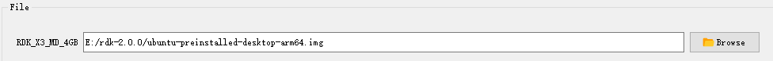

# 系统烧录

RDK X3 Module支持从eMMC和SD卡两种模式启动系统：

- 当模组上的eMMC没有烧录过系统镜像的情况下，插入制作好系统的SD卡到载板即可通过从SD卡启动系统。

- 如果模组上的eMMC已经烧录过系统镜像，可以按照以下步骤进行eMMC和SD卡启动的切换。

  1、默认情况下会从eMMC启动系统

  2、禁用eMMC的启动切换到使用SD卡启动系统，登录系统后，执行以下命名把eMMC的第二个分区的启动标志删除，并重启系统生效：

  ```
  sudo parted /dev/mmcblk0 set 2 boot off
  sudo reboot
  ```

  3、在uboot下会发现eMMC没有启动分区而去寻找去sd卡启动分区，从SD卡加载系统启动，登录系统后执行`mount`命令可以看到跟文件系统挂载在 SD 卡的 第二个分区，config分区也使用的SD卡的第一个分区。

  ```
  /dev/mmcblk2p2 on / type ext4 (rw,relatime,data=ordered) 
  /dev/mmcblk2p1 on /boot/config type vfat
  ```

- 从SD卡启动切换回从eMMC启动

  当在使用SD卡启动系统时，并且eMMC上已经烧录过系统，执行以下命令恢复回从eMMC启动，重启系统生效。

  ```
  sudo parted /dev/mmcblk0 set 2 boot on
  sudo reboot
  ```

当RDK X3模组需要烧录系统到SD上，不从eMMC模式启动时，请参考[安装系统](../getting_start/install_os.md)完成SD卡系统的烧录。

当RDK X3模组需要烧录系统到eMMC时，需要使用地平线hbupdate烧录工具，请按照以下步骤进行工具的下载和安装，并且参考接下来的`安装USB驱动` 和 `烧录系统`两个章节完成eMMC系统的烧录。

1. 下载hbupdate烧录工具，下载链接：[hbupdate](http://archive.sunrisepi.tech/downloads/hbupdate/)。
2. 工具分为Windows、Linux两种版本，分别命名为 `hbupdate_win64_vx.x.x_rdk.tar.gz`、 `hbupdate_linux_gui_vx.x.x_rdk.tar.gz`。
3. 解压烧录工具，解压目录需要不包含**空格、中文、特殊字符**。

## 安装USB驱动

在使用刷机工具前，需要在PC上安装USB驱动程序，请按照如下步骤进行：

1. 点击 [android_hobot](http://archive.sunrisepi.tech/downloads/hbupdate/android_hobot.zip) 下载驱动程序。
2. 解压 `android_hobot.zip` ，进入解压后的目录，以管理员身份运行 `5-runasadmin_register-CA-cer.cmd` 完成驱动程序的注册。
3. 使用跳线帽将`Boot`管脚接地，管脚位置参考[功能控制接口](./rdk_x3_module.md#功能控制接口)。
4. 将Micro USB接口与电脑通过USB线连接，然后给设备上电。
5. 如PC设备管理器出现`USB download gadget`未知设备时，需要更新设备驱动，选择解压出的驱动文件夹`andriod_hobot`，然后点击下一步，完成驱动安装，如下图：  
     
   
6. 驱动安装完成后，设备管理器会显示fastboot设备`Android Device`，如下图：
   

## 烧录系统{#flash_system}

确认PC设备管理器显示fastboot设备`Android Device`后，运行`hbupdate.exe`打开烧录工具，并按照以下步骤进行烧录：


1）选择开发板型号，必选项。

- RDK_X3_2GB： RDK X3（旭日X3派），2GB内存版本，仅支持烧写最小系统镜像

- RDK_X3_4GB： RDK X3（旭日X3派），4GB内存版本，仅支持烧写最小系统镜像

- RDK_X3_MD_2GB： RDK X3 Module，2GB内存版本

- RDK_X3_MD_4GB： RDK X3 Module，4GB内存版本


2）点击`Browse`按钮选择将要烧录的镜像文件，必选项。



3）点击`Start`按钮开始刷机，根据弹窗提示开始烧录：


- 烧录镜像时，需要通过跳线帽将`BOOT`管脚接地，管脚位置参考[功能控制接口](./rdk_x3_module.md#功能控制接口)

- 将Micro USB接口连接到电脑，电脑设备管理器中会识别出`Android Device`的设备，如上一节安装USB下载驱动所描述

- 烧录完毕断开电源，断开和电脑的连接线，将BOOT管脚跳线帽拔下，重新上电即可

- 如果启动正常，在硬件上的`ACT LED`灯会进入`两次快闪一次慢闪`的状态

4）检查升级结果

- 镜像烧录成功时，工具提示如下：


- 镜像烧录失败时，工具提示如下，此时需要确认PC设备管理器是否存在`Android Device`设备


