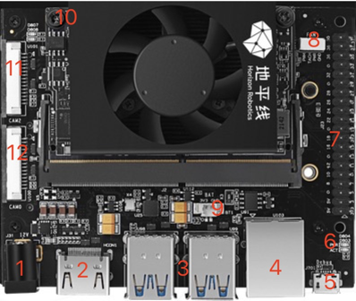
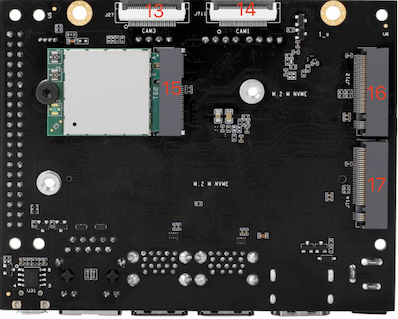
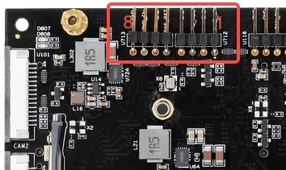
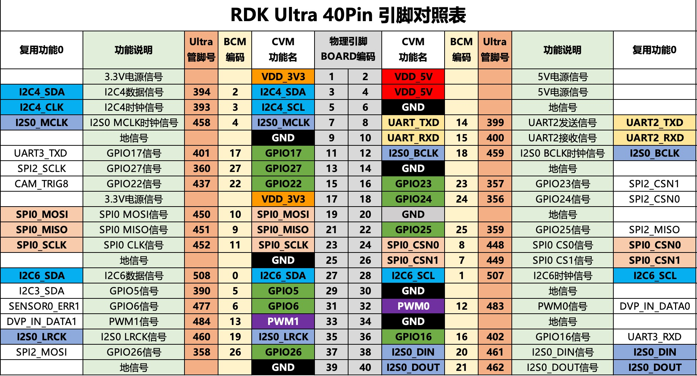

# 接口说明

RDK Ultra开发套件提供了以太网口、USB、HDMI、MIPI CSI、40PIN等多种外围接口，方便用户对RDK Ultra开发套件进行功能体验、开发测试等工作，接口布局如下：

 

| 序号 | 接口功能        | 序号 | 接口功能                | 序号 | 接口功能               |
| ---- | --------------- | ---- | ----------------------- | ---- | ---------------------- |
| 1    | 电源接口        | 7    | 40pin header                     | 13   | CAM3接口，24PIN，4lane     |
| 2    | HDMI显示接口        | 8    | PWM风扇接口                    | 14   | CAM1接口，24PIN，4lane       |
| 3    | 4组USB3.0接口   | 9    | rtc电池接口                        | 15   | 无线网卡接口，PCIe M.2-E    |
| 4    | 千兆以太网口     | 10   |  功能控制接口                      | 16   | SSD硬盘接口，PCIe M.2-M     |
| 5    | 调试接口         | 11   | CAM2接口，15PIN，2lane            | 17   | SSD硬盘接口，PCIe M.2-M        |
| 6    | 状态指示灯       | 12   | CAM0接口，15PIN，2lane             |  |  |

## 电源接口

RDK Ultra开发板通过DC接口供电，推荐使用套件中自带的电源适配器，或者使用至少**12V/5A**的电源适配器供电。接入电源后，如红色电源指示灯点亮（接口6），说明设备供电正常。

## HDMI接口

RDK Ultra开发板提供一路HDMI显示接口（接口2），最高支持1080P分辨率。开发板上电后会通过HDMI接口输出Ubuntu图形界面，配合特定的示例程序，HDMI接口还支持摄像头、视频流画面的预览显示功能。

目前HDMI接口只支持1080p60的显示模式，更多的显示模式会在后续的软件版本中支持。

## MIPI CSI接口

RDK Ultra开发板提供`CAM 0~3`四组摄像头接口，可以满足4路MIPI Camera模组的同时接入，使用注意事项如下：

1. CAM 0/2（接口11/12），采用15pin FPC连接器，支持接入树莓派OV5647、IMX219、IMX477等Camera模组。
2. CAM 1/3（接口13/14），采用24pin FPC连接器，支持接入F37、GC4663、IMX415等Camera模组。

摄像头模组的规格参数如下：

| 序号 | Sensor | 分辨率 | FOV              | I2C 设备地址 |
| ---- | ------ | ------ | ---------------- | ------------ |
| 1    | GC4663 | 400W   | H:104 V:70 D:113 | 0x29         |
| 2    | JXF37  | 200W   | H:62  V:37 D:68  | 0x40         |
| 3    | IMX219 | 800W   | H:62  V:37 D:68  | 0x10         |
| 4    | IMX477 | 1200W  | H:62  V:37 D:68  | 0x1a         |
| 5    | OV5647 | 500W   | H:62  V:37 D:68  | 0x36         |

Camera模组的购买方式可参考社区配件页，[购买链接](https://developer.horizon.cc/accessory)。

:::caution 注意
重要提示：严禁在开发板未断电的情况下插拔摄像头，否则非常容易烧坏摄像头模组。
:::

## USB接口

RDK Ultra开发板提供了四路USB3.0标准接口（接口3），可以满足4路USB外设同时接入使用。需要注意的是，RDK Ultra的USB接口只支持Host模式。

## 调试接口{#debug_uart}

RDK Ultra开发板提供了一路调试接口（接口5），硬件上通过`CH340`芯片将核心模组调试串口转换为USB接口，用户可使用该接口进行各种调试工作。电脑串口工具的参数需按如下方式配置：

- 波特率（Baud rate）：921600
- 数据位（Data bits）：8
- 奇偶校验（Parity）：None
- 停止位（Stop bits）：1
- 流控（Flow Control）：无

通常情况下，用户第一次使用该接口时需要在电脑上安装CH340驱动，用户可搜索`CH340串口驱动`关键字进行下载、安装。

## 功能控制接口

RDK Ultra开发板提供了一组功能控制接口（接口10），可实现对核心模组功能模式的控制，管脚功能定义如下：

| 管脚号 | 管脚名称 | 功能描述                       | 使用方式                            |
| ------ | -------- | ------------------------------ | ----------------------------------- |
| 1      | WAKE_UP  | 用于唤醒开发板                 | 使用跳线帽跟GND短接                      |
| 2      | GND      | 地信号                        | GND                                     |
| 3      | FC_REC   | 强制开发板进入recovery模式      | 使用跳线帽跟GND短接                     |
| 4      | GND      | 地信号                        |  GND                                    |
| 5      | SYS_RST  | 用于复位系统                   | 使用跳线帽跟GND短接后断开，系统复位        |
| 6      | GND      | 地信号                        | GND                                      |
| 7      | PWR_EN   | 供电使能信号                   | 使用跳线帽跟GND短接，关闭核心板供电        |
| 8      | GND      | GDN                          | GND                                 |

  

## 40pin header接口

RDK Ultra开发板提供一组40pin header接口（接口7），支持GPIO、UART、I2C、SPI、I2S等多种接口，详细管脚定义、复用关系如下：

