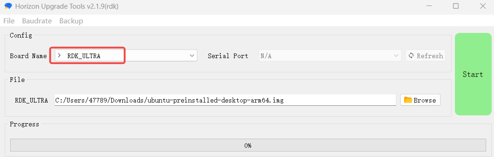
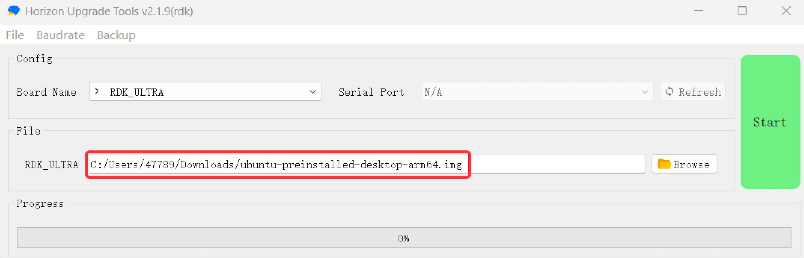
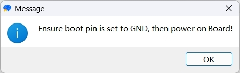
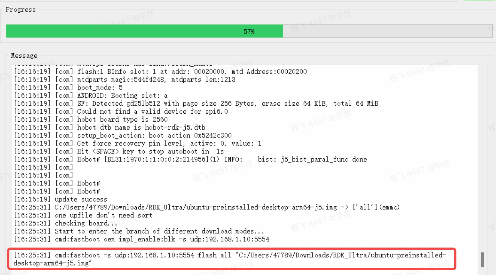
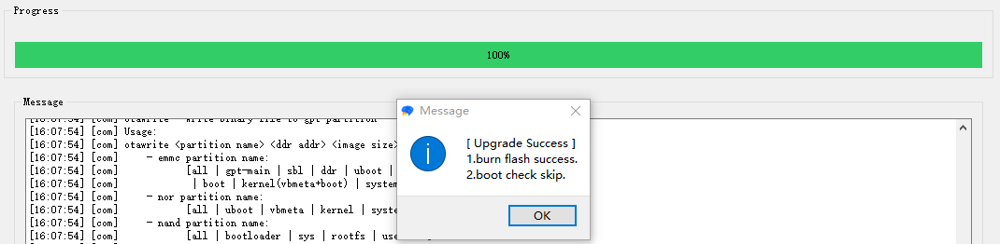
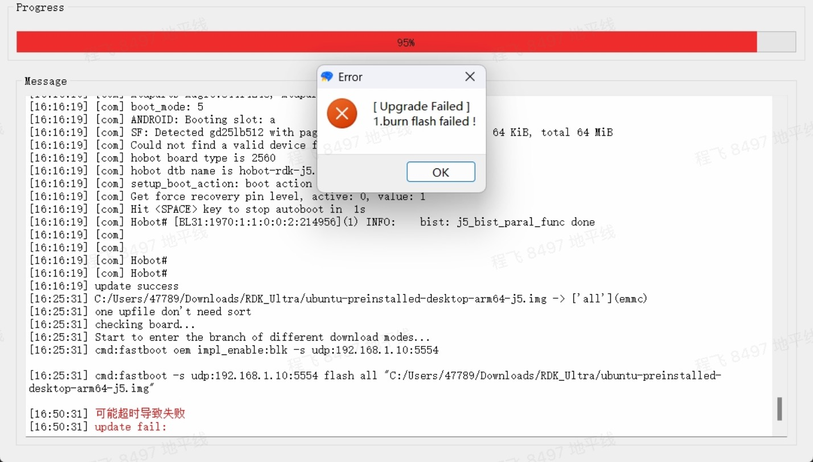

# 系统烧录

:::tip

系统镜像下载与烧录的完整步骤，请[**点击查看该章节**](/installation/install_os)。

:::

RDK Ultra开发套件烧录Ubuntu系统时，需要使用地平线`hbupdate`烧录工具。目前工具支持Windows、Linux两种版本，分别以 `hbupdate_win64`、 `hbupdate_linux` 开头，工具下载链接：[hbupdate](https://sunrise.horizon.cc/downloads/hbupdate/)。

工具使用注意事项如下：
- 解压工具压缩包，注意解压路径中不要包含**空格、中文、特殊字符**等内容。
- 工具通过网口跟RDK Ultra通讯，为保证烧录速度，请确保**PC支持千兆网口，并采用直连方式**。
- PC端网络需要提前配置为**静态IP方式**，具体如下：
  - IP：192.168.1.195
  - netmask：255.255.255.0
  - gateway：192.168.1.1

## 烧录步骤{#flash_system}

1）通过网线将RDK Ultra和PC机直连，并确保网络可以ping通。

2）将功能控制接口（接口10）的`FC_REC`和`GND`信号短接。

3）运行`hbupdate`主程序，打开下载工具并选择开发板型号为`RDK_ULTRA`，必选项。

4）点击`Browse`按钮选择将要烧录的镜像文件，必选项。

5）点击`Start`按钮开始刷机，根据提示信息确认操作无误后，点击`OK`按钮：

6）当工具显示如下打印时，说明进入烧写过程，该过程耗时依赖于网络传输速度，请耐心等待。

7）等待工具升级完成，并检查升级结果。

- 镜像烧录成功时，工具提示如下：

- 工具提示如下错误时，请确认步骤1~3是否操作正确。

- 工具提示如下错误时，说明网络传输速度过慢，建议更换性能更好的PC后重新升级。

