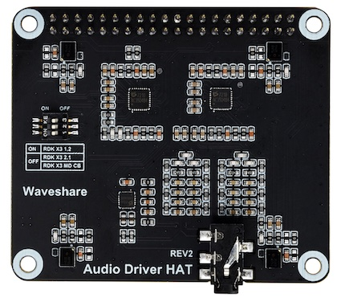
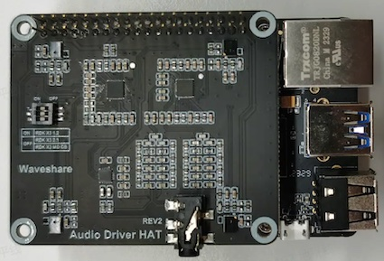
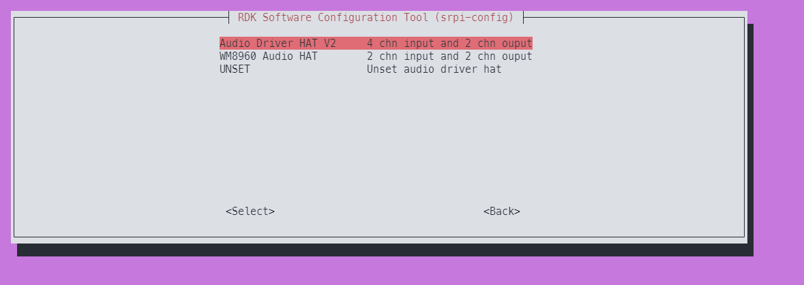
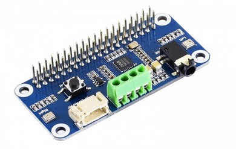
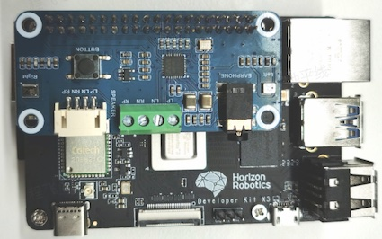
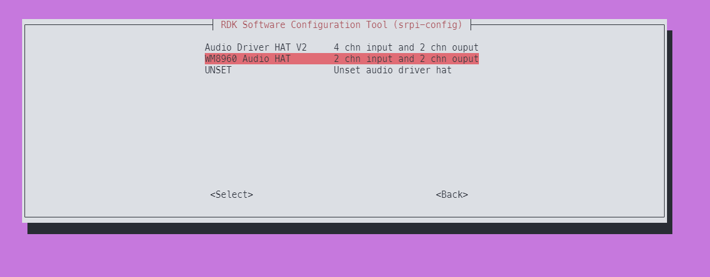

# 音频转接板

RDK X3目前提供对**Audio Driver HAT**、**WM8960 Audio HAT**两款音频转接板的支持，用于满足不同语音场景的功能需求，下面将对两种音频板的使用方法进行详细介绍。

:::note 提示

如果安装驱动后提示Miniboot版本不是最新，请进入`1 System Options` -> `S7 Update Miniboot` 更新miniboot

:::


## Audio Driver HAT REV2

### 产品简介

Audio Driver HAT REV2是由微雪电子生产的一款音频转接板，采用ES7210+ES8156双Codec方案，可实现环形4麦克风录音、双通道音频播放、音频信号回采等功能。转接板外观如下图：



关于音频子板的详细介绍，请参考[Audio Driver HAT](https://www.waveshare.net/shop/Audio-Driver-HAT.htm)。

### 安装方法

1. 按照下图方式，将转接板接入RDK X3的40pin header。  


2. 使用命令`cat /sys/class/socinfo/som_name`，查询开发板类型，并根据返回值设置音频子板的拨码开关状态。
   - 返回值为5或者6时，3个拨码开关全部拨到`ON`位置。
   - 返回值为8时，3个拨码开关全部拨到`OFF`位置。

3. 使用`srpi-config`配置音频板  
进入`3 Interface Options`->`I5 Audio`  
选择`Audio Driver HAT V2`：
  

4. 运行命令`sync && reboot`重启开发板，如/dev/snd下出现如下设备节点，说明转接板安装成功。
    ```shell
    root@ubuntu:/userdata# ls /dev/snd
    by-path  controlC0  pcmC0D0c  pcmC0D1p  timer
    ```
### 卸载方法
1. 使用`srpi-config`配置音频板   
进入`3 Interface Options`->`I5 Audio`  
选择`UNSET`,即可卸载音频驱动和相关配置

### 音频节点
该音频板在`RDK X3`上的的播放节点为`pcmC0D0p`，录制节点为`pcmC0D1c`

### 录音播放测试

测试使用`tinyalsa`库的工具集：使用`tinycap`进行录制，使用`tinyplay`进行播放

`tinycap`使用说明：
```shell
tinycap
Usage: tinycap {file.wav | --} [-D card] [-d device] [-c channels] [-r rate] [-b bits] [-p period_size] [-n n_periods] [-t time_in_seconds]

Use -- for filename to send raw PCM to stdout
```
`tinyplay`使用说明：
```shell
tinyplay
usage: tinyplay file.wav [options]
options:
-D | --card   <card number>    The device to receive the audio
-d | --device <device number>  The card to receive the audio
-p | --period-size <size>      The size of the PCM's period
-n | --period-count <count>    The number of PCM periods
-i | --file-type <file-type >  The type of file to read (raw or wav)
-c | --channels <count>        The amount of channels per frame
-r | --rate <rate>             The amount of frames per second
-b | --bits <bit-count>        The number of bits in one sample
-M | --mmap                    Use memory mapped IO to play audio
```
如果想了解更多关于`tinyalsa`库的信息，请查阅它们的[仓库地址](https://github.com/tinyalsa/tinyalsa)


- 2通道麦克风录音：

```
tinycap ./2chn_test.wav -D 0 -d 1 -c 2 -b 16 -r 48000 -p 512 -n 4 -t 5
```

- 4通道麦克风录音：

```
tinycap ./4chn_test.wav -D 0 -d 1 -c 4 -b 16 -r 48000 -p 512 -n 4 -t 5
```

- 双通道音频播放：

```
tinyplay ./2chn_test.wav -D 0 -d 0
```

### 音频回采测试

音频板的播放回采信号，使用了录音通道7&8，因此需要使用8通道录音命令进行采集。

- 启动8通道麦克风录音
```shell
tinycap ./8chn_test.wav -D 0 -d 1 -c 8 -b 16 -r 48000 -p 512 -n 4 -t 5
```

- 启动双通道音频播放
```
tinyplay ./2chn_test.wav -D 0 -d 0
```

录制完成后，可使用音频软件查看`2chn_test.wav`文件中通道7&8的频谱信息。

### 注意事项

由于老款Audio Driver HAT REV1音频板已经停产，RDK X3将逐渐停止对该硬件的维护工作，推荐用户尽量升级到REV2版本使用。

对于Audio Driver HAT REV1音频板的使用方法，可参考FAQ章节。

## WM8960 Audio HAT

### 产品简介

WM8960 Audio HAT是由微雪电子生产的一款音频转接板，采用WM8960 Codec方案，可实现双通道麦克风录音、音频播放功能，转接板外观如下图：



该音频子板只兼容RDK X3 2.0版本，版本号查询方法如下，返回值8代表设备为2.0版本。
```shell
root@ubuntu:/userdata# cat /sys/class/socinfo/som_name
8
```

关于音频转接板的详细介绍，请参考[WM8960音频转接板](https://www.waveshare.net/wiki/WM8960_Audio_HAT)。

### 安装方法

1. 按照下图方式，将转接板接入RDK X3的40pin header  


2. 使用`srpi-config`配置音频板  
进入`3 Interface Options`->`I5 Audio`  
选择`WM8960 Audio HAT`：
 

3. 运行命令`sync && reboot`重启开发板，如/dev/snd下出现如下设备节点，说明转接板安装成功
    ```shell
    root@ubuntu:~# ls /dev/snd/
    by-path  controlC0  pcmC0D0c  pcmC0D0p  pcmC0D1c  pcmC0D1p  timer
    ```

### 卸载方法
1. 使用`srpi-config`配置音频板   
进入`3 Interface Options`->`I5 Audio`  
选择`UNSET`,即可卸载音频驱动和相关配置

### 音频节点
该音频板在`RDK X3`上的的播放节点为`pcmC0D1p`，录制节点为`pcmC0D0c`

### 录音播放测试

测试使用`tinyalsa`库的工具集：使用`tinycap`进行录制，使用`tinyplay`进行播放

`tinycap`使用说明：
```shell
tinycap
Usage: tinycap {file.wav | --} [-D card] [-d device] [-c channels] [-r rate] [-b bits] [-p period_size] [-n n_periods] [-t time_in_seconds]

Use -- for filename to send raw PCM to stdout
```
`tinyplay`使用说明：
```shell
tinyplay
usage: tinyplay file.wav [options]
options:
-D | --card   <card number>    The device to receive the audio
-d | --device <device number>  The card to receive the audio
-p | --period-size <size>      The size of the PCM's period
-n | --period-count <count>    The number of PCM periods
-i | --file-type <file-type >  The type of file to read (raw or wav)
-c | --channels <count>        The amount of channels per frame
-r | --rate <rate>             The amount of frames per second
-b | --bits <bit-count>        The number of bits in one sample
-M | --mmap                    Use memory mapped IO to play audio
```
如果想了解更多关于`tinyalsa`库的信息，请查阅它们的[仓库地址](https://github.com/tinyalsa/tinyalsa)


- 2通道麦克风录音：

```
tinycap ./2chn_test.wav -D 0 -d 0 -c 2 -b 16 -r 48000 -p 512 -n 4 -t 5
```

- 双通道音频播放：

```
tinyplay ./2chn_test.wav -D 0 -d 1
```


## 音频子板和USB声卡共存

如果您有USB声卡，并且想它和上述的音频子板共存，请参考下列的教程进行操作：

1. 根据上面教程，确保音频子板可用

2. 接入USB声卡，驱动加载完成后观察`/dev/snd`下面的新增节点，此处以`WM8960` + USB**全双工**声卡为例：
```bash
    root@ubuntu:~# ls /dev/snd/
    by-path  controlC0  pcmC0D0c  pcmC0D0p  pcmC0D1c  pcmC0D1p  pcmC1D0c  pcmC1D0p  timer
```
其中`pcmC1D0c  pcmC1D0p`为USB声卡节点，全双工共用一个节点

3. 修改`/etc/pulse/default.pa`，在`load-module module-alsa-source`下面添加对应的节点信息：
```apacheconf
...

.ifexists module-udev-detect.so
load-module module-alsa-sink device=hw:0,1 mmap=false tsched=0 fragments=2 fragment_size=960 rate=48000 channels=2 rewind_safeguard=960
load-module module-alsa-source device=hw:0,0 mmap=false tsched=0 fragments=2 fragment_size=960 rate=48000 channels=2
load-module alsa device=hw:1,0 #对应上面的节点
load-module module-alsa-source device=hw:1,0 #对应上面的节点
.else

...
```

4. 保存配置，并重启开发板