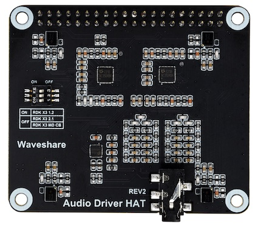
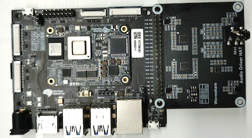
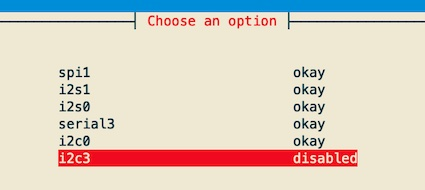
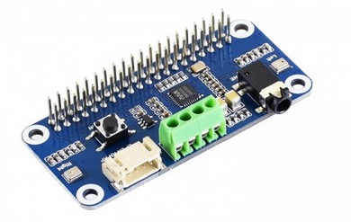
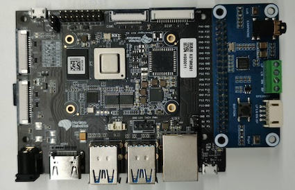

# 音频转接板使用
RDK X3 Module目前提供对**Audio Driver HAT**、**WM8960 Audio HAT**两款音频转接板的支持，用于满足不同语音场景的功能需求，下面将对两种音频板的使用方法进行详细介绍。

## Audio Driver HAT REV2

### 产品简介

Audio Driver HAT REV2是由微雪电子生产的一款音频转接板，采用ES7210+ES8156双Codec方案，可实现环形4MIC录音、双通道音频播放、音频信号回采功能，转接板外观如下图：



关于音频转接板的详细介绍，请参考[Audio Driver HAT](https://www.waveshare.net/shop/audio-driver-hat.htm)。

### 安装方法

1. 按照下图方式，将转接板接入RDK X3 Module的40pin header  


2. 使用`srpi-config`配置工具关闭`I2C3`功能，如下图：  


3. 使用命令`git clone git@github.com:HorizonRDK/hobot-audio.git`，拉取配置文件，执行安装脚本并输入`2`
    ```shell
    cd hobot-audio
    sudo ./install.sh
    What type of audio board do you have?
    1. WM8960 Audio HAT
    2. Audio Driver HAT
    ```
4. 运行命令`sync && reboot`重启开发板，如/dev/snd下出现如下设备节点，说明转接板安装成功
    ```shell
    root@ubuntu:/userdata# ls /dev/snd
    by-path  controlC0  pcmC0D0p  pcmC0D1c  timer
    ```

### 录音播放测试

- 2通道麦克风录音：

```
tinycap ./2chn_test.wav -D 0 -d 1 -c 2 -b 16 -r 48000 -p 512 -n 4 -t 5
```

- 4通道麦克风录音：

```
tinycap ./4chn_test.wav -D 0 -d 1 -c 4 -b 16 -r 48000 -p 512 -n 4 -t 5
```

- 双通道音频播放：

```
tinyplay ./2chn_test.wav -D 0 -d 0
```

### 音频回采测试

该音频板的播放回采信号，使用了录音通道7&8，因此需要使用8通道录音命令进行采集。

- 启动8通道麦克风录音
```shell
tinycap ./8chn_test.wav -D 0 -d 1 -c 8 -b 16 -r 48000 -p 512 -n 4 -t 5
```

- 启动双通道音频播放
```
tinyplay ./2chn_test.wav -D 0 -d 0
```

录制完成后，可使用音频软件查看`2chn_test.wav`文件中通道7&8的频谱信息。

### 注意事项

RDK X3 Module不支持老款Audio Driver HAT REV1音频板，请用户升级到REV2版本使用。

## WM8960 Audio HAT

### 产品简介

WM8960 Audio HAT是由微雪电子生产的一款音频转接板，采用WM8960 Codec方案，可实现双通道麦克风录音、音频播放功能，转接板外观如下图：



关于音频转接板的详细介绍，请参考[WM8960音频转接板](https://www.waveshare.net/wiki/WM8960_Audio_HAT)。

### 安装方法

1. 按照下图方式，将转接板接入RDK X3的40pin header  


2. 使用命令`git clone git@github.com:HorizonRDK/hobot-audio.git`，拉取配置文件，执行安装脚本并输入`1`
    ```shell
    cd hobot-audio
    sudo ./install.sh
    What type of audio board do you have?
    1. WM8960 Audio HAT
    2. Audio Driver HAT
    ```
3. 运行命令`sync && reboot`重启开发板，如/dev/snd下出现如下设备节点，说明转接板安装成功
    ```shell
    root@ubuntu:~# ls /dev/snd/
    by-path  controlC0  pcmC0D0c  pcmC0D0p  pcmC0D1c  pcmC0D1p  timer
    ```

### 录音播放测试

- 2通道麦克风录音：

```
tinycap ./2chn_test.wav -D 0 -d 0 -c 2 -b 16 -r 48000 -p 512 -n 4 -t 5
```

- 双通道音频播放：

```
tinyplay ./2chn_test.wav -D 0 -d 1
```