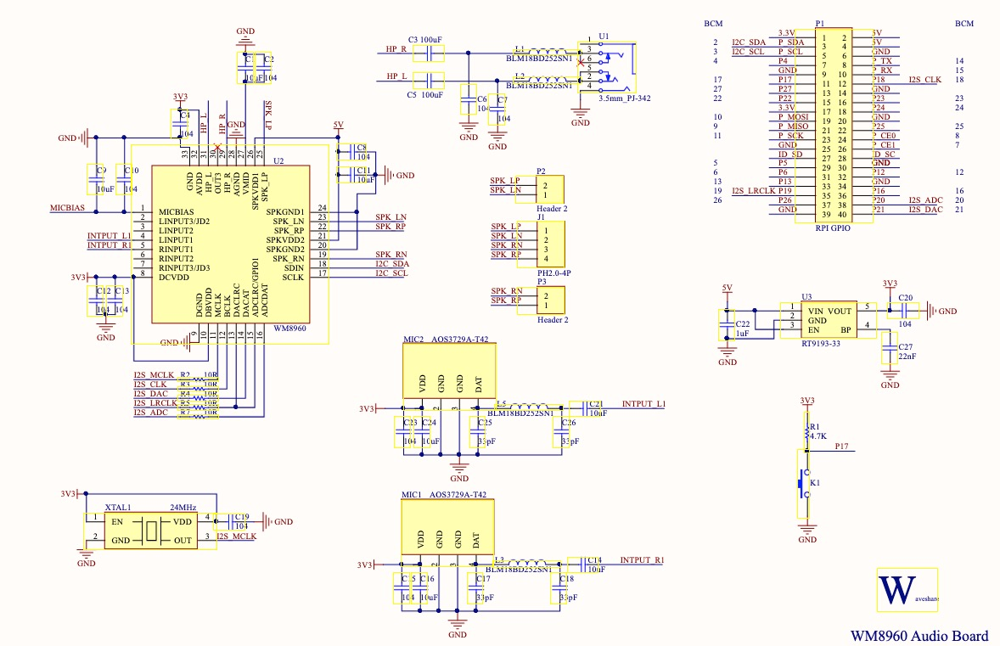
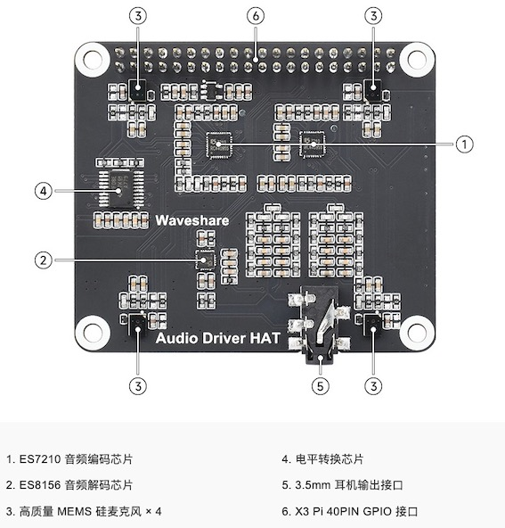

# 音频子板使用

RDK X3 Module 40pin header提供一路i2s信号，管脚定义兼容树莓派40pin，通过外接音频子板，可以满足不同场景的语音需求。下面介绍几种已经适配的音频子板及方案特点。

## WM8960音频子板

该配件是由微雪电子生产的一款音频子板，采用WM8960低功耗立体声编解码器，通过I2C接口控制，I2S接口传输音频。板载标准3.5mm耳机接口，可通过外接耳机播放音乐,同时也可通过双通道喇叭接口外接喇叭播放。板子左右两边有一个高质量MEMS硅麦克风，可以立体声录音。

电路方案如下：

需要注意的是，单独开启录音或者播放功能时，需要跟i2s模式配置保持一致，否则会导致功能异常。

关于音频子板的详细介绍，请参考[WM8960音频子板](https://www.waveshare.net/wiki/WM8960_Audio_HAT)。

## ES7210+ES8156音频子板

该配件是由微雪电子生产的一款音频子板，采用 ES7210 高性能四通道编码芯片、ES8156 高性能立体声音频解码芯片，通过I2C接口控制，I2S接口传输音频。板载标准3.5mm耳机接口，可通过外接耳机播放音乐。板子左右四角各有一个高质量MEMS硅麦克风，可以立体声录音。 

完整的电路方案可参考[原理图](https://www.waveshare.net/w/upload/2/2f/Audio_Driver_HAT.pdf)。

需要注意的是，单独开启录音或者播放功能时，需要跟i2s模式配置保持一致，否则会导致功能异常。

关于音频子板的详细介绍，请参考[ES7210+ES8156音频子板](https://www.waveshare.net/wiki/Audio_Driver_HAT)。