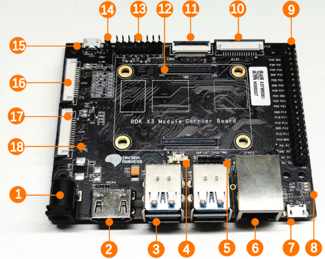
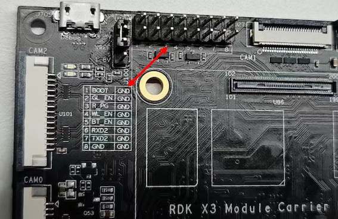

# 接口说明

本章节介绍RDK X3 Module官方载板的接口功能和使用方法。载板提供了以太网口、USB、HDMI、MIPI CSI、MIPI DSI、40PIN等多种外围接口，方便用户对RDK X3 Module进行功能验证、开发测试等工作。

RDK X3 Module载板接口布局如下：

 

| 序号 | 接口功能        | 序号 | 接口功能                | 序号 | 接口功能               |
| ---- | --------------- | ---- | ----------------------- | ---- | ---------------------- |
| 1    | 电源接口        | 7    | Micro USB2.0 Device接口 | 13   | 功能控制IO header      |
| 2    | HDMI接口        | 8    | 工作指示灯              | 14   | IO电平选择header       |
| 3    | USB3.0 Host接口 | 9    | 40pin header            | 15   | debug口，USB转串口     |
| 4    | RTC电池接口     | 10   | MIPI DSI接口            | 16   | CAM2接口，2lane        |
| 5    | 风扇接口        | 11   | CAM1接口，4lane         | 17   | CAM0接口，2lane        |
| 6    | 千兆以太网口    | 12   | 核心模组接口            | 18   | Micro SD卡接口（背面） |

## 核心模组接口

RDK X3 Module载板提供一组200pin板板连接器，用于核心模组的安装。安装时需要首先确认正确的方向和定位，避免对核心模组、载板的连接器造成损伤。

 

模组安装方法如下：

1. 对照核心模组上主芯片、DDR、Wi-Fi模组与载板三个丝印的左右顺序，确认安装方向正确。
2. 将核心模组放于载板正上方，并确认周围四个定位孔位置对齐。
3. 从核心模组中心向下按压，当模组发出咔哒的声响后，表示安装到位。

## 电源接口

RDK X3 Module载板通过DC接口供电，推荐使用认证配件清单中推荐的**12V/2A**适配器。接入电源后，如红色电源指示灯正常点亮（接口8），说明设备供电正常。

## HDMI接口

RDK X3 Module载板提供一路HDMI显示接口（接口2），最高支持1080P分辨率。开发板通过HDMI接口在显示器输出Ubuntu系统桌面(Ubuntu Server版本显示logo图标)。此外，HDMI接口还支持实时显示摄像头、网络流画面功能。

目前HDMI接口支持的显示分辨率如下：

- 1920x1080
- 1280x720
- 1024x600
- 800x480

## MIPI CSI接口

RDK X3 Module载板提供CAM 0/1/2三组MIPI CSI接口，可以满足3路Camera模组的同时接入，满足不同用户的使用需求，具体说明如下：

1. CAM 0/2（接口16/17），采用15pin FPC连接器，可直接接入树莓派OV5647、IMX219、IMX477等多种Camera模组。
2. CAM 1（接口11），采用24pin FPC连接器，支持F37、GC4663、IMX415等多种Camera模组。

摄像头模组的基础规格如下：

| 序号 | Sensor | 分辨率 | FOV              | I2C 设备地址 |
| ---- | ------ | ------ | ---------------- | ------------ |
| 1    | GC4663 | 400W   | H:104 V:70 D:113 | 0x29         |
| 2    | JXF37  | 200W   | H:62  V:37 D:68  | 0x40         |
| 3    | IMX219 | 800W   | H:62  V:37 D:68  | 0x10         |
| 4    | IMX477 | 1200W  | H:62  V:37 D:68  | 0x1a         |
| 5    | OV5647 | 500W   | H:62  V:37 D:68  | 0x36         |

上述Camera模组的购买方式可参考[购买链接](./accessory.md)。

:::caution 注意
重要提示：严禁在开发板未断电的情况下插拔摄像头，否则非常容易烧坏摄像头模组。
:::

## MIPI DSI接口

RDK X3 Module载板提供一路MIPI DSI接口（接口10），可以用于LCD显示屏等接入。接口采用15pin FPC连接器，可直接接入树莓派多款LCD显示屏。

对于MIPI DSI接口的详细使用方法，可参考[MIPI DSI显示屏使用](./display.md)。

## USB接口

RDK X3核心模组只支持一路USB3.0接口，因此载板通过外围电路及USB HUB扩展，实现了4路USB3.0 Host接口和1路Micro USB2.0 Device接口，满足用户对USB接口的多样需求，接口描述如下：

| 接口类型            | 接口序号 | 接口数量 | 接口描述                  |
| ------------------- | -------- | -------- | ------------------------- |
| USB3.0 Type A Host  | 接口3    | 4路      | 用于USB外设接入           |
| Micro USB2.0 Device | 接口7    | 1路      | 用于adb调试、fastboot烧录 |

:::caution 注意
USB主从模式切换完全由硬件电路实现，用户只需按照上表的逻辑连接设备即可。

开发板USB Host、Device功能互斥，Device接口接入设备后，Host接口会自动失效。
:::

## Micro SD卡接口

RDK X3 Module载板提供一路Micro SD存储卡接口（接口18）。推荐使用至少8GB容量的存储卡，以便满足Ubuntu操作系统及相关功能包的安装要求。

:::caution 注意
开发板使用中禁止热插拔TF存储卡，否则会造成系统运行异常，甚至造成存储卡文件系统损坏。
:::

## 调试接口{#debug_uart}

RDK X3 Module载板提供一路调试（接口15），硬件上通过`CH340`芯片将核心模组调试串口转换为USB接口，用户可使用该接口进行各种调试工作。电脑串口工具的参数需按如下方式配置：

- 波特率（Baud rate）：921600
- 数据位（Data bits）：8
- 奇偶校验（Parity）：None
- 停止位（Stop bits）：1
- 流控（Flow Control）：无

通常情况下，用户第一次使用该接口时需要在电脑上安装CH340驱动，用户可搜索`CH340串口驱动`关键字进行下载、安装。

## 功能控制接口

RDK X3 Module载板提供一组控制IO接口（接口13），用户使用跳线帽短接相应管脚，可实现对核心模组多种功能模式的控制，管脚功能定义如下：

| 管脚号 | 管脚名称 | 功能描述                       | 使用方式                            |
| ------ | -------- | ------------------------------ | ----------------------------------- |
| 1      | BOOT     | 用于控制fastboot烧录模式的进入 | 跳线帽接地后，重新上电              |
| 2      | GL_EN    | 用于关闭核心板输入电源         | 跳线帽接地后，核心板断电            |
| 3      | R_PG     | 用于指示核心板工作状态         | 高电平代表核心板工作正常            |
| 4      | W_EN     | 用于关闭Wi-Fi功能              | 跳线帽接地后Wi-Fi关闭，重启系统恢复 |
| 5      | BT_EN    | 用于关闭蓝牙功能               | 跳线帽接地后蓝牙关闭，重启系统恢复  |
| 6      | RXD2     | 串口UART2接收信号              | 串口UART2接收信号                   |
| 7      | TXD2     | 串口UART2发送信号              | 串口UART2接收信号                   |
| 8      | GND      | GDN                            | GND                                 |

此外，为方便用户查询，上述管脚定义在载板丝印也有体现。  

  

## IO电平切换接口

RDK X3 Module载板提供IO电平切换功能，用于控制40pin header电平模式，支持1.8V、3.3V两种电平。。

接口信号从上往下分别为3.3V、VREF、1.8V，具体如下图：

需要说明的是，**该接口不能悬空，否则核心模组会因供电异常无法开机**。

:::caution 当需要切换电平时，请严格按照下述步骤进行。
默认情况下，RDK X3 Module核心模组固件、载板电平配置为3.3V，如需要切换IO电平时，需要按如下步骤进行：

1. 下载支持1.8V电平配置的启动固件，[固件下载地址](https://sunrise.horizon.cc/downloads/miniboot)。
2. 使用官方烧录工具`hbupdate`，更新核心板启动固件，具体方法请参考[镜像烧录](./system.md)。
3. 设备断电，使用跳线帽将`vref`、`1.8V`信号短接后重新上电。
:::

## 40pin header接口

RDK X3 Module载板提供一组40pin header接口（接口9），接口信号电平由IO电平切换header指定（接口14），支持1.8V、3.3V两种模式。管脚定义兼容树莓派等产品，详细管脚定义、复用关系如下：

:::caution 注意
默认情况下，RDK X3 Module核心模组固件、载板电平配置为3.3V，如需要切换IO电平时，请参考[IO电平选择header接口](#io电平切换接口)。
:::
