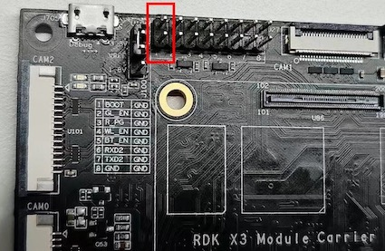
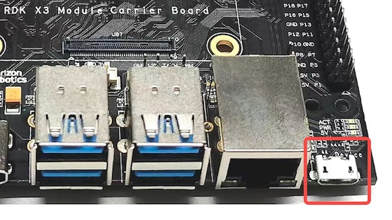
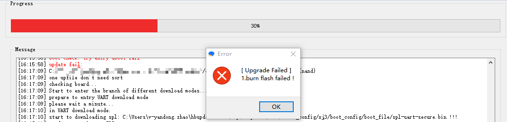

# 系统烧录

:::info 注意

**RDK X3 Module**出厂已经烧写测试版本系统镜像，为确保使用最新版本的系统，<font color='Red'>建议参考本文档完成[最新版本系统镜像的烧写](/installation/install_os)</font>。

:::

RDK X3 Module支持从eMMC和SD卡两种模式启动系统：

- 当模组上的eMMC没有烧录过系统镜像的情况下，插入制作好系统的SD卡到载板即可通过从SD卡启动系统。

- 如果模组上的eMMC已经烧录过系统镜像，可以按照以下步骤进行eMMC和SD卡启动的切换。

  1、默认情况下会从eMMC启动系统

  2、禁用eMMC的启动切换到使用SD卡启动系统，登录系统后，执行以下命名把eMMC的第二个分区的启动标志删除，并重启系统生效：

  ```
  sudo parted /dev/mmcblk0 set 2 boot off
  sudo reboot
  ```

  3、在uboot下会发现eMMC没有启动分区而去寻找SD卡的启动分区，从SD卡加载系统启动，登录系统后执行`mount`命令可以看到跟文件系统挂载在 SD 卡的 第二个分区，config分区也使用的SD卡的第一个分区。

  ```
  /dev/mmcblk2p2 on / type ext4 (rw,relatime,data=ordered) 
  /dev/mmcblk2p1 on /boot/config type vfat
  ```

- 从SD卡启动切换回从eMMC启动

  当在使用SD卡启动系统时，并且eMMC上已经烧录过系统，执行以下命令恢复回从eMMC启动，重启系统生效。

  ```
  sudo parted /dev/mmcblk0 set 2 boot on
  sudo reboot
  ```

当RDK X3模组需要烧录系统到SD上，不从eMMC模式启动时，请参考[安装系统](../../installation/install_os.md)完成SD卡系统的烧录。

RDK X3模组烧录eMMC系统镜像时，需要使用地平线`hbupdate`烧录工具。目前工具支持Windows、Linux两种版本，分别以 `hbupdate_win64`、 `hbupdate_linux` 开头，工具下载链接：[hbupdate](https://sunrise.horizon.cc/downloads/hbupdate/)。

工具使用注意事项如下：
- 解压工具压缩包，注意解压路径中不要包含**空格、中文、特殊字符**等内容。
- 工具通过USB口跟RDK X3模组通讯，需要提前安装USB驱动，具体方法见下文描述。

## 安装USB驱动

对于使用Windows系统的PC，在使用刷机工具前，需要确认是否安装过fastboot驱动程序，请按照如下步骤进行确认：

1. 使用跳线帽将RDK X3载板的`Boot`管脚接地，管脚位置参考下图。    
     
2. 将载板的Micro USB接口与电脑通过USB线连接，接口位置参考下图。  
     
3. 给设备上电，然后观察电脑设备管理器端口状态，如出现`USB download gadget`未知设备时，需要更新设备驱动，否则可跳过下述步骤。  
     
4. 下载并解压驱动包 `android_hobot.zip`，下载链接 [android_hobot](https://sunrise.horizon.cc/downloads/hbupdate/android_hobot.zip) 。
5. 进入解压后的目录，以管理员身份运行 `5-runasadmin_register-CA-cer.cmd`，完成驱动程序的注册。
6. 双击`USB download gadget`未知设备，选择驱动包解压目录，然后点击下一步。   
   
7. 驱动安装完成后，设备管理器会显示fastboot设备`Android Device`。   
   

## 烧录系统{#flash_system}

确认PC设备管理器显示fastboot设备`Android Device`后，运行`hbupdate.exe`打开烧录工具，并按照以下步骤进行烧录：


1）选择开发板型号，必选项。

- RDK_X3_2GB： RDK X3（旭日X3派），2GB内存版本，仅支持烧写最小系统镜像

- RDK_X3_4GB： RDK X3（旭日X3派），4GB内存版本，仅支持烧写最小系统镜像

- RDK_X3_MD_2GB： RDK X3 Module，2GB内存版本

- RDK_X3_MD_4GB： RDK X3 Module，4GB内存版本


2）点击`Browse`按钮选择将要烧录的镜像文件，必选项。


3）点击`Start`按钮开始刷机，根据弹窗提示开始烧录：


- 烧录镜像时，需要通过跳线帽将`BOOT`管脚接地，管脚位置参考[功能控制接口](../rdk_x3_module/interface#功能控制接口)

- 将Micro USB接口连接到电脑，电脑设备管理器中会识别出`Android Device`的设备，如上一节安装USB下载驱动所描述

- 烧录完毕断开电源，断开和电脑的连接线，将BOOT管脚跳线帽拔下，重新上电即可

- 如果启动正常，在硬件上的`ACT LED`灯会进入`两次快闪一次慢闪`的状态

4）检查升级结果

- 镜像烧录成功时，工具提示如下：


- 镜像烧录失败时，工具提示如下，此时需要确认PC设备管理器是否存在`Android Device`设备


