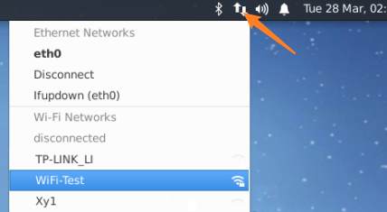
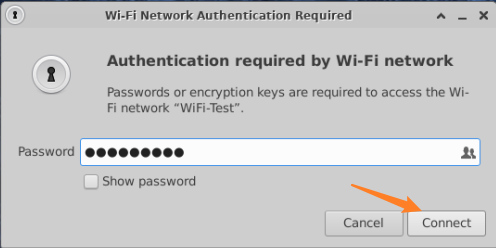
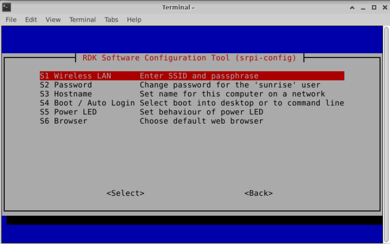
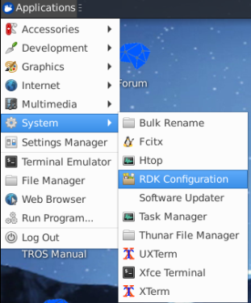
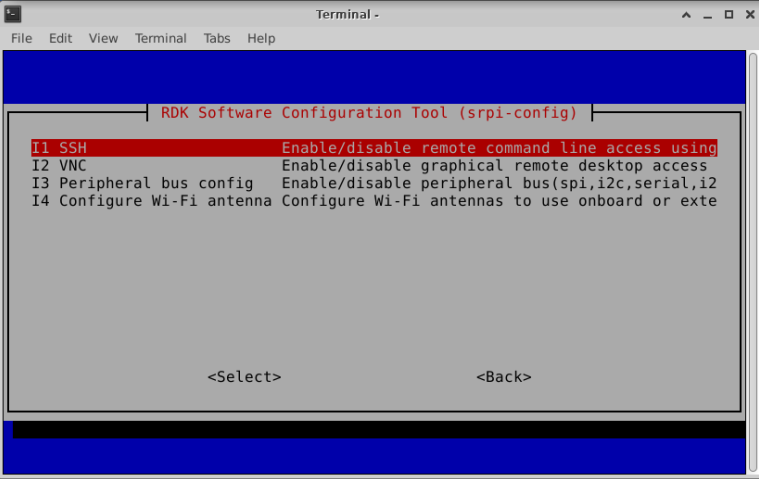
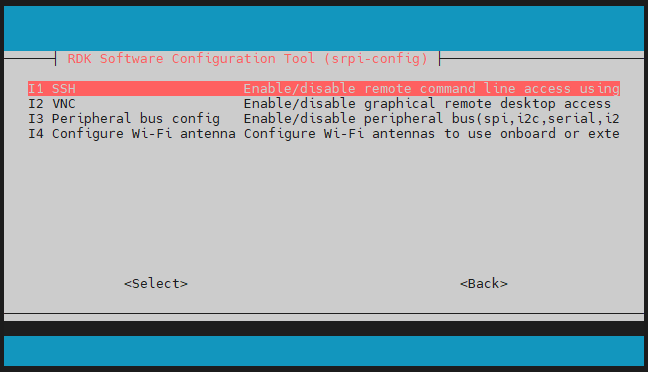
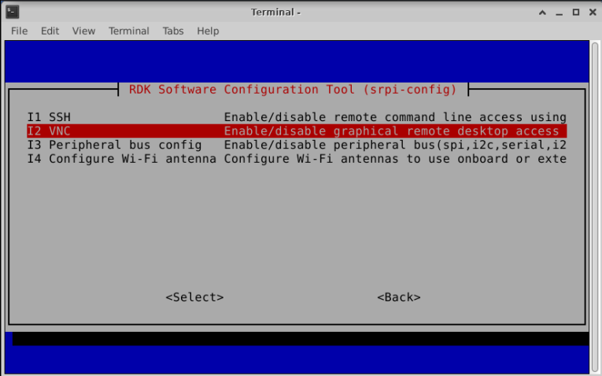
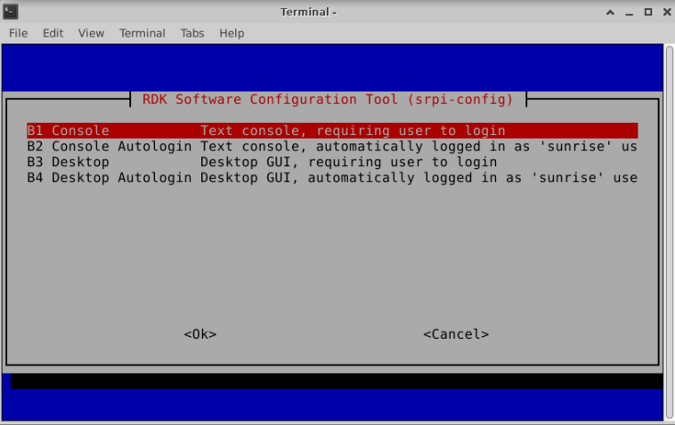
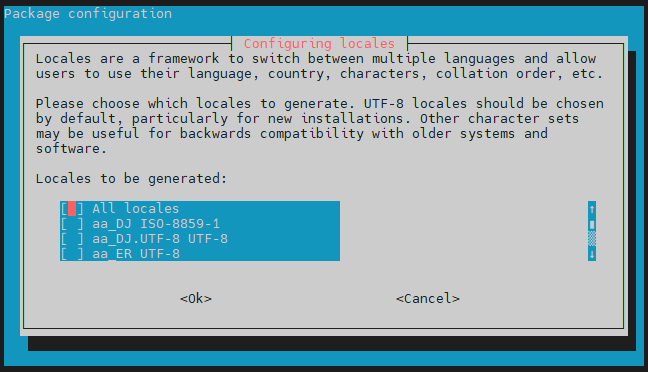

# 1.3 入门配置

:::tip

本章节介绍的入门配置方式仅在RDK X3 和 RDK X3 Module型号上支持；

系统版本不低于 `2.1.0`。

:::

```mdx-code-block
import Tabs from '@theme/Tabs';
import TabItem from '@theme/TabItem';
```

## 连接Wi-Fi

<Tabs groupId="rdk-type">
<TabItem value="desktop" label="Desktop">

使用菜单栏右上角的Wi-Fi管理工具连接Wi-Fi，如下图所示，点击需要连接的Wi-Fi名，然后在弹出的对话框中输入Wi-Fi密码。





</TabItem>

<TabItem value="server" label="Server">

使用srpi-config工具连接Wi-Fi。

执行 `sudo srpi-config` 命令，选择 System Options -> Wireless LAN ，根据提示依次输入Wi-Fi名（`SSID`） 和 密码（`passwd`）。



</TabItem>
</Tabs>

## 开启SSH服务

当前系统版本默认开启 SSH 登录服务，用户可以使用本方法开关该服务。

<Tabs groupId="rdk-type">
<TabItem value="desktop" label="Desktop">

通过菜单栏找到`RDK Configuration` 项，点击打开。



选择 Interface Options -> SSH 项，根据提示选择使能或者关闭 `SSH` 服务。



</TabItem>

<TabItem value="server" label="Server">

执行 `sudo srpi-config`命令进入配置菜单。选择 Interface Options -> SSH 项，根据提示选择使能或者关闭 `SSH` 服务。



</TabItem>

</Tabs>

SSH的使用请查看 [远程登录 - SSH登录](../installation/remote_login#ssh)。

## 开启VNC服务

<Tabs groupId="rdk-type">
<TabItem value="desktop" label="Desktop">

通过菜单栏找到`RDK Configuration` 项，点击打开。


选择 Interface Options -> VNC 项，根据提示选择使能或者关闭`VNC` 服务。选择使能 `VNC` 时需要设置登录密码，密码必须是一个8位长度的由数字、字符组成的字符串。



</TabItem>
</Tabs>

VNC的使用请查看 [远程登录 - VNC登录](../installation/remote_login#vnc登录)。

## 设置登录模式

<Tabs groupId="rdk-type">
<TabItem value="desktop" label="Desktop">

桌面图形化系统，支持四种登录模式：

1. 开启图形化界面，自动登录
2. 开启图形化界面，用户手动登录
3. 字符终端，自动登录
4. 字符终端，用户手动登录

通过菜单栏找到`RDK Configuration` 项，点击打开。选择 System Options -> Boot / Auto Login 项进入如下配置项。根据需求选择对应项。



重启后生效。

</TabItem>

<TabItem value="server" label="Server">

桌面图形化系统，支持四种登录模式：

1. 字符终端，自动登录
2. 字符终端，用户手动登录

执行 `sudo srpi-config`命令进入配置菜单。选择 System Options -> Boot / Auto Login 项进入如下配置项。根据需求选择对应项。

重启后生效。

</TabItem>
</Tabs>

## 设置中文环境

<Tabs groupId="rdk-type">
<TabItem value="desktop" label="Desktop">

通过菜单栏找到`RDK Configuration` 项，点击打开。选择 Localisation Options -> Locale 项进入如下配置。

第一步：选择选择需要用到的语言环境（多选），一般选中 `en_US.UTF-8 UTF-8` 和 `zh_CN.UTF-8 UTF-8`两项即可。回车确认进入下一步。



第二步：选择默认的语言环境，中文环境选择 `zh_CN.UTF-8 UTF-8` 即可。回车确认后需要等待一会完成配置。

第三步：重启机器，使最新配置生效。`sudo reboot`

:::tip

开机会提示：要不要更新home目录下的几个常用文件夹的名称。
建议选择 `Don't ask me again` `Keep Old Name`， 这样可以保持用户工作目录下的 `Desktop  Documents  Downloads` 等目录名不随语言环境发生变化。

:::

</TabItem>

<TabItem value="server" label="Server">

执行 `sudo srpi-config`命令进入配置菜单。选择 Localisation Options -> Locale 项进入如下配置。

第一步：选择选择需要用到的语言环境（多选），一般选中 `en_US.UTF-8 UTF-8` 和 `zh_CN.UTF-8 UTF-8`两项即可。回车确认进入下一步。


第二步：选择默认的语言环境，中文环境选择 `zh_CN.UTF-8 UTF-8` 即可。回车确认后需要等待一会完成配置。

第三步：重启机器，使最新配置生效。`sudo reboot`

</TabItem>
</Tabs>
