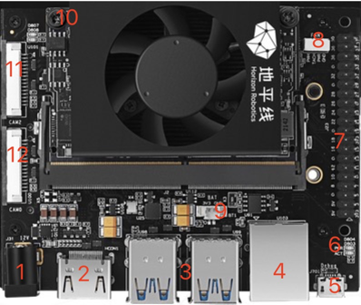
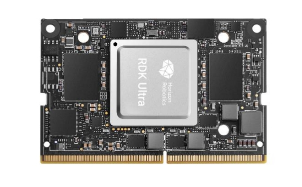
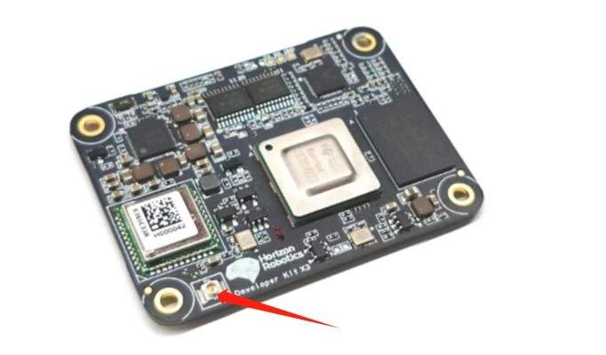
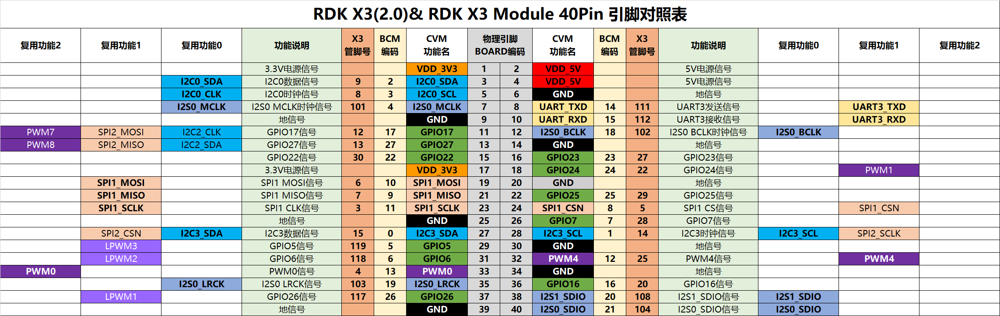
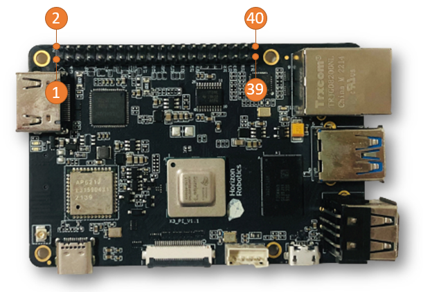
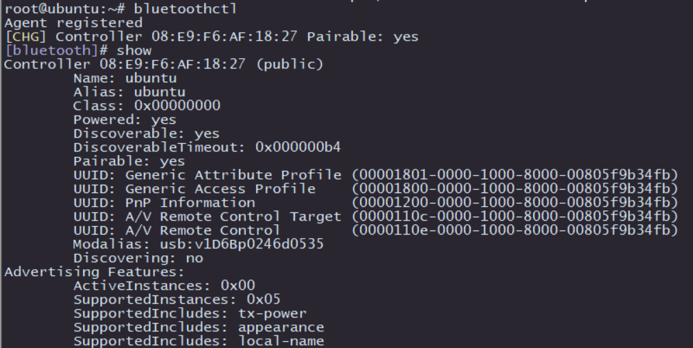
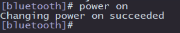
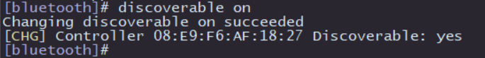
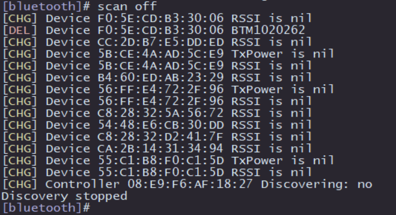

# 1.5 硬件接口说明

```mdx-code-block
import Tabs from '@theme/Tabs';
import TabItem from '@theme/TabItem';
```

## 接口总览

<Tabs groupId="rdk-type">
<TabItem value="x3" label="RDK X3">

RDK X3提供了网口、USB、摄像头、LCD、HDMI、40PIN等功能接口，方便用户进行图像多媒体、深度学习算法等应用的开发和测试。开发板接口布局如下：


| 序号 | 功能 | 序号 | 功能 | 序号 | 功能 |
| -------- | ---------------------------- | -------- | ----------------------- | ----------------------- | ----------------------- |
| 1        | USB Type C 供电接口         | 6                                  | USB 3.0 Type A接口                  | 11                                 | Wi-Fi天线接口                   |
| 2        | MIPI CSI 摄像头接口         | 7                                  | 千兆以太网口                        | 12                                 | TF卡接口（底面）                    |
| 3        | 调试串口                     | 8                                  | 40PIN接口                           | 13                                 | MIPI 接口的LCD屏接口                |
| 4        | Micro USB 2.0 接口           | 9                                  | HDMI接口                            | 14 | 触摸屏接口 |
| 5 | USB 2.0 Type A接口两路 | 10                                 | 电源和状态LED指示灯                 |  |  |
</TabItem>

<TabItem value="x3md" label="RDK X3 Module">

RDK X3 Module官方载板提供了以太网口、USB、HDMI、MIPI CSI、MIPI DSI、40PIN等多种外围接口，方便用户对RDK X3 Module进行功能验证、开发测试等工作。接口布局如下：

 

| 序号 | 接口功能        | 序号 | 接口功能                | 序号 | 接口功能               |
| ---- | --------------- | ---- | ----------------------- | ---- | ---------------------- |
| 1    | 电源接口        | 7    | Micro USB2.0 Device接口 | 13   | 功能控制IO header      |
| 2    | HDMI接口        | 8    | 工作指示灯              | 14   | IO电平选择header       |
| 3    | USB3.0 Host接口 | 9    | 40pin header            | 15   | debug口，USB转串口     |
| 4    | RTC电池接口     | 10   | MIPI DSI接口            | 16   | CAM2接口，2lane        |
| 5    | 风扇接口        | 11   | CAM1接口，4lane         | 17   | CAM0接口，2lane        |
| 6    | 千兆以太网口    | 12   | 核心模组接口            | 18   | Micro SD卡接口（背面） |

</TabItem>

<TabItem value="ulrta" label="RDK Ultra">

RDK Ultra开发套件提供了以太网口、USB、HDMI、MIPI CSI、40PIN等多种外围接口，方便用户对RDK Ultra开发套件进行功能体验、开发测试等工作，接口布局如下：


 

| 序号 | 接口功能      | 序号 | 接口功能               | 序号 | 接口功能                 |
| ---- | ------------- | ---- | ---------------------- | ---- | ------------------------ |
| 1    | 电源接口      | 7    | 40pin header           | 13   | CAM3接口，24PIN，4lane   |
| 2    | HDMI显示接口  | 8    | PWM风扇接口            | 14   | CAM1接口，24PIN，4lane   |
| 3    | 4组USB3.0接口 | 9    | rtc电池接口            | 15   | 无线网卡接口，PCIe M.2-E |
| 4    | 千兆以太网口  | 10   | 功能控制接口           | 16   | SSD硬盘接口，PCIe M.2-M  |
| 5    | 调试接口      | 11   | CAM2接口，15PIN，2lane | 17   | SSD硬盘接口，PCIe M.2-M  |
| 6    | 状态指示灯    | 12   | CAM0接口，15PIN，2lane |      |                          |

</TabItem>

</Tabs>


## 核心模组接口

<Tabs groupId="rdk-type">
<TabItem value="x3" label="RDK X3">

全板载设计， 无核心模组。

</TabItem>

<TabItem value="x3md" label="RDK X3 Module">

RDK X3 Module载板提供一组200pin板板连接器，用于核心模组的安装。安装时需要首先确认正确的方向和定位，避免对核心模组、载板的连接器造成损伤。

 

模组安装方法如下：

1. 对照核心模组上主芯片、DDR、Wi-Fi模组与载板三个丝印的左右顺序，确认安装方向正确。
2. 将核心模组放于载板正上方，并确认周围四个定位孔位置对齐。
3. 从核心模组中心向下按压，当模组发出咔哒的声响后，表示安装到位。

</TabItem>

<TabItem value="ulrta" label="RDK Ultra">

RDK Ultra Module核心板硬件接口兼容 Jetson Orin 系列开发板，方便用户快速集成和产品化落地。



</TabItem>

</Tabs>


## 电源接口

<Tabs groupId="rdk-type">
<TabItem value="x3" label="RDK X3">

开发板提供一路USB Type C接口(接口1)，作为供电接口，需要使用支持**5V/3A**的电源适配器为开发板供电。将电源适配器接入开发板后，**开发板<font color='Red'>红色</font>电源指示灯亮起**，说明开发板供电正常。

</TabItem>

<TabItem value="x3md" label="RDK X3 Module">

RDK X3 Module载板通过DC接口供电，推荐使用认证配件清单中推荐的**12V/2A**适配器。接入电源后，如<font color='Red'>红色</font>电源指示灯正常点亮（接口8），说明设备供电正常。

</TabItem>

<TabItem value="ulrta" label="RDK Ultra">

RDK Ultra开发板通过DC接口供电，推荐使用套件中自带的电源适配器，或者使用至少**12V/5A**的电源适配器供电。接入电源后，如红色电源指示灯点亮（接口6），说明设备供电正常。

</TabItem>

</Tabs>


:::caution

请不要使用电脑USB接口为开发板供电，否则会因供电不足造成开发板**异常断电、反复重启**等情况。

:::


## 调试串口{#debug_uart}

<Tabs groupId="rdk-type">
<TabItem value="x3" label="RDK X3">

开发板提供一路调试串口(接口3)，以实现串口登录、调试功能。电脑串口工具的参数配置如下：

- 波特率（Baud rate）：921600
- 数据位（Data bits）：8
- 奇偶校验（Parity）：None
- 停止位（Stop bits）：1
- 流控（Flow Control）：无

串口连接时，需要将杜邦线接入开发板接口3，串口USB转接板接入电脑。连接完成后如下图：  


</TabItem>

<TabItem value="x3md" label="RDK X3 Module">

RDK X3 Module载板提供一路调试（接口15），硬件上通过`CH340`芯片将核心模组调试串口转换为USB接口，用户可使用该接口进行各种调试工作。电脑串口工具的参数需按如下方式配置：

- 波特率（Baud rate）：921600
- 数据位（Data bits）：8
- 奇偶校验（Parity）：None
- 停止位（Stop bits）：1
- 流控（Flow Control）：无

通常情况下，用户第一次使用该接口时需要在电脑上安装CH340驱动，用户可搜索`CH340串口驱动`关键字进行下载、安装。

</TabItem>

<TabItem value="ulrta" label="RDK Ultra">

RDK Ultra开发板提供了一路调试接口（接口5），硬件上通过`CH340`芯片将核心模组调试串口转换为USB接口，用户可使用该接口进行各种调试工作。电脑串口工具的参数需按如下方式配置：

- 波特率（Baud rate）：921600
- 数据位（Data bits）：8
- 奇偶校验（Parity）：None
- 停止位（Stop bits）：1
- 流控（Flow Control）：无

通常情况下，用户第一次使用该接口时需要在电脑上安装CH340驱动，用户可搜索`CH340串口驱动`关键字进行下载、安装。

</TabItem>

</Tabs>


## 有线网口

<Tabs groupId="rdk-type">
<TabItem value="x3" label="RDK X3">

开发板提供一路千兆以太网接口(接口7)，支持1000BASE-T、100BASE-T标准，默认采用静态IP模式，IP地址`192.168.1.10`。如需确认开发板IP地址，可通过串口登录设备，并用`ifconfig`命令进行查看 `eth0`网口的配置：

```bash
sunrise@ubuntu:/# ifconfig 
eth0: flags=4163<UP,BROADCAST,RUNNING,MULTICAST>  mtu 1500
        inet 192.168.1.10  netmask 255.255.255.0  broadcast 192.168.1.255
        inet6 fe80::211:22ff:fe6f:de17  prefixlen 64  scopeid 0x20<link>
        ether 00:11:22:6f:de:17  txqueuelen 1000  (Ethernet)
        RX packets 112  bytes 7327 (7.3 KB)
        RX errors 0  dropped 0  overruns 0  frame 0
        TX packets 197  bytes 8678 (8.6 KB)
        TX errors 0  dropped 0 overruns 0  carrier 0  collisions 0
        device interrupt 39  base 0xc000 
```

开发板插入网线后，以太网驱动会建立连接，如果系统有如下打印，说明网线连接正常：

```bash
[13293.952661] st_gmac a5014000.ethernet eth0: Link is Down
[13295.062996] st_gmac a5014000.ethernet: Link is Up - 1000/Full 
[13296.000750] st_gmac a5014000.ethernet eth0: Link is Up - 1Gbps/Full - flow control rx/tx
```

</TabItem>

<TabItem value="x3md" label="RDK X3 Module">

开发板提供一路千兆以太网接口(接口6)，支持1000BASE-T、100BASE-T标准，默认采用静态IP模式，IP地址`192.168.1.10`。如需确认开发板IP地址，可通过串口登录设备，并用`ifconfig`命令进行查看 `eth0`网口的配置：

```bash
sunrise@ubuntu:/# ifconfig 
eth0: flags=4163<UP,BROADCAST,RUNNING,MULTICAST>  mtu 1500
        inet 192.168.1.10  netmask 255.255.255.0  broadcast 192.168.1.255
        inet6 fe80::211:22ff:fe6f:de17  prefixlen 64  scopeid 0x20<link>
        ether 00:11:22:6f:de:17  txqueuelen 1000  (Ethernet)
        RX packets 112  bytes 7327 (7.3 KB)
        RX errors 0  dropped 0  overruns 0  frame 0
        TX packets 197  bytes 8678 (8.6 KB)
        TX errors 0  dropped 0 overruns 0  carrier 0  collisions 0
        device interrupt 39  base 0xc000 
```

开发板插入网线后，以太网驱动会建立连接，如果系统有如下打印，说明网线连接正常：

```bash
[13293.952661] st_gmac a5014000.ethernet eth0: Link is Down
[13295.062996] st_gmac a5014000.ethernet: Link is Up - 1000/Full 
[13296.000750] st_gmac a5014000.ethernet eth0: Link is Up - 1Gbps/Full - flow control rx/tx
```

</TabItem>

<TabItem value="ulrta" label="RDK Ultra">

开发板提供一路千兆以太网接口(接口4)，支持1000BASE-T、100BASE-T标准，默认采用静态IP模式，IP地址`192.168.1.10`。如需确认开发板IP地址，可通过串口登录设备，并用`ifconfig`命令进行查看 `eth0`网口的配置：

```bash
sunrise@ubuntu:/# ifconfig 
eth0: flags=4163<UP,BROADCAST,RUNNING,MULTICAST>  mtu 1500
        inet 192.168.1.10  netmask 255.255.255.0  broadcast 192.168.1.255
        inet6 fe80::211:22ff:fe6f:de17  prefixlen 64  scopeid 0x20<link>
        ether 00:11:22:6f:de:17  txqueuelen 1000  (Ethernet)
        RX packets 112  bytes 7327 (7.3 KB)
        RX errors 0  dropped 0  overruns 0  frame 0
        TX packets 197  bytes 8678 (8.6 KB)
        TX errors 0  dropped 0 overruns 0  carrier 0  collisions 0
        device interrupt 39  base 0xc000 
```

开发板插入网线后，以太网驱动会建立连接，如果系统有如下打印，说明网线连接正常：

```bash
[13293.952661] st_gmac a5014000.ethernet eth0: Link is Down
[13295.062996] st_gmac a5014000.ethernet: Link is Up - 1000/Full 
[13296.000750] st_gmac a5014000.ethernet eth0: Link is Up - 1Gbps/Full - flow control rx/tx
```

</TabItem>

</Tabs>


## HDMI接口{#hdmi_interface}

<Tabs groupId="rdk-type">
<TabItem value="x3" label="RDK X3">

开发板提供一路HDMI(接口9)显示接口，最高支持1080P分辨率。开发板通过HDMI接口在显示器输出Ubuntu系统桌面(Ubuntu Server版本显示logo图标)。此外，HDMI接口还支持实时显示摄像头、网络流画面功能。

目前HDMI接口支持的显示分辨率如下：

- 1920x1080
- 1280x720
- 1024x600
- 800x480

</TabItem>

<TabItem value="x3md" label="RDK X3 Module">

RDK X3 Module载板提供一路HDMI显示接口（接口2），最高支持1080P分辨率。开发板通过HDMI接口在显示器输出Ubuntu系统桌面(Ubuntu Server版本显示logo图标)。此外，HDMI接口还支持实时显示摄像头、网络流画面功能。

目前HDMI接口支持的显示分辨率如下：

- 1920x1080
- 1280x720
- 1024x600
- 800x480

</TabItem>

<TabItem value="ulrta" label="RDK Ultra">

RDK Ultra开发板提供一路HDMI显示接口（接口2），最高支持1080P分辨率。开发板上电后会通过HDMI接口输出Ubuntu图形界面，配合特定的示例程序，HDMI接口还支持摄像头、视频流画面的预览显示功能。

目前HDMI接口只支持1080p60的显示模式，更多的显示模式会在后续的软件版本中支持。

</TabItem>

</Tabs>

## USB接口

<Tabs groupId="rdk-type">
<TabItem value="x3" label="RDK X3">

由于X3芯片只提供一路USB接口，开发板通过硬件电路实现了多路USB接口扩展，满足用户对多路USB设备接入的需求，接口描述如下：

| 接口类型       | 接口序号 | 接口数量 | 接口描述                                                 |
| -------------- | -------- | -------- | -------------------------------------------------------- |
| Micro USB 2.0  | 接口4    | 1路      | USB Device模式，用于连接主机实现ADB、Fastboot、UVC等功能 |
| USB 2.0 Type A | 接口5    | 2路      | USB Host模式，用于接入USB 2.0外设                        |
| USB 3.0 Type A | 接口6    | 1路      | USB Host模式，用于接入USB 3.0外设                        |

USB主从模式切换完全由硬件电路实现，用户只需按照上表的逻辑连接设备即可。

开发板USB Host、Device功能互斥，Device接口接入设备后，Host接口会自动失效。

### 接入U盘

<iframe src="//player.bilibili.com/player.html?aid=700903305&bvid=BV1rm4y1E73q&cid=1196553711&page=5" scrolling="no" border="0" frameborder="no" framespacing="0" width="100%" height="500" allowfullscreen="true"> </iframe>

开发板USB Type A接口(接口5和6)，支持U盘功能，可自动检测U盘接入并挂载，默认挂载目录为`/media/sda1`。用户可通过touch命令确认U盘工作正常，如下：

```bash
sunrise@ubuntu:/media/sda1$ sudo touch test
[sudo] password for sunrise: 
sunrise@ubuntu:/media/sda1$ ls -l test 
-rwxr-xr-x 1 root root 0 Apr 30 21:19 test
sunrise@ubuntu:/media/sda1$
```

### 接入USB串口转接板

开发板USB Type A接口(接口5和6)，支持USB串口转接板功能，可自动检测USB串口转接板接入并创建设备节点`/dev/ttyUSB*` 或者 `/dev/ttyACM*`（星号代表0开始的数字）。用户可参考 [使用串口](../python_development/40pin_user_guide/uart.md#40pin_uart_usage) 章节对串口进行使用。

</TabItem>

<TabItem value="x3md" label="RDK X3 Module">

RDK X3核心模组只支持一路USB3.0接口，因此载板通过外围电路及USB HUB扩展，实现了4路USB3.0 Host接口和1路Micro USB2.0 Device接口，满足用户对USB接口的多样需求，接口描述如下：

| 接口类型            | 接口序号 | 接口数量 | 接口描述                  |
| ------------------- | -------- | -------- | ------------------------- |
| USB3.0 Type A Host  | 接口3    | 4路      | 用于USB外设接入           |
| Micro USB2.0 Device | 接口7    | 1路      | 用于adb调试、fastboot烧录 |

:::caution 注意
USB主从模式切换完全由硬件电路实现，用户只需按照上表的逻辑连接设备即可。

开发板USB Host、Device功能互斥，Device接口接入设备后，Host接口会自动失效。
:::

</TabItem>

<TabItem value="ulrta" label="RDK Ultra">

RDK Ultra开发板提供了四路USB3.0标准接口（接口3），可以满足4路USB外设同时接入使用。需要注意的是，RDK Ultra的USB接口只支持Host模式。

</TabItem>

</Tabs>


## USB摄像头

<iframe src="//player.bilibili.com/player.html?aid=700903305&bvid=BV1rm4y1E73q&cid=1196554247&page=6" scrolling="no" border="0" frameborder="no" framespacing="0" width="100%" height="500" allowfullscreen="true"> </iframe>

开发板USB Type A接口，支持USB摄像头功能，可自动检测USB摄像头接入并创建设备节点`/dev/video8`。用户可通过`v4l2`命令确认USB摄像头工作正常，如下：

```bash
sunrise@ubuntu:/media/sda1$ sudo v4l2-ctl -d /dev/video8 --all
Driver Info:
        Driver name      : uvcvideo
        Card type        : FHD Camera: FHD Camera
        Bus info         : usb-xhci-hcd.0.auto-1.2
        Driver version   : 4.14.87
        Capabilities     : 0x84200001
                Video Capture
                Streaming
                Extended Pix Format
                Device Capabilities
        Device Caps      : 0x04200001
                Video Capture
                Streaming
                Extended Pix Format
Media Driver Info:
        Driver name      : uvcvideo
        Model            : FHD Camera: FHD Camera
        Serial           : 12345
        Bus info         : 1.2
        Media version    : 4.14.87
        Hardware revision: 0x00000020 (32)
        Driver version   : 4.14.87
Interface Info:
        ID               : 0x03000002
        Type             : V4L Video
Entity Info:
        ID               : 0x00000001 (1)
        Name             : FHD Camera: FHD Camera
        Function         : V4L2 I/O
        Pad 0x01000004   : Sink
          Link 0x0200000a: from remote pad 0x1000007 of entity 'Processing 2': Data, Enabled, Immutable
Priority: 2
Video input : 0 (Camera 1: ok)
Format Video Capture:
        Width/Height      : 1920/1080
        Pixel Format      : 'MJPG' (Motion-JPEG)
        Field             : None
        Bytes per Line    : 0
        Size Image        : 4147200
        Colorspace        : Default
        Transfer Function : Default (maps to Rec. 709)
        YCbCr/HSV Encoding: Default (maps to ITU-R 601)
        Quantization      : Default (maps to Full Range)
        Flags             : 
Crop Capability Video Capture:
        Bounds      : Left 0, Top 0, Width 1920, Height 1080
        Default     : Left 0, Top 0, Width 1920, Height 1080
        Pixel Aspect: 1/1
Selection Video Capture: crop_default, Left 0, Top 0, Width 1920, Height 1080, Flags: 
Selection Video Capture: crop_bounds, Left 0, Top 0, Width 1920, Height 1080, Flags: 
Streaming Parameters Video Capture:
        Capabilities     : timeperframe
        Frames per second: 30.000 (30/1)
        Read buffers     : 0
```


## MIPI CSI{#mipi_port}

<Tabs groupId="rdk-type">
<TabItem value="x3" label="RDK X3">
<iframe src="//player.bilibili.com/player.html?aid=700903305&bvid=BV1rm4y1E73q&cid=1196554333&page=7" scrolling="no" border="0" frameborder="no" framespacing="0" width="100%" height="500" allowfullscreen="true"> </iframe>

开发板提供1路MIPI CSI接口(接口2)，可实现MIPI摄像头的接入。目前开发板适配了多种规格的摄像头模组，模组型号、规格如下：

| 序号 | Sensor |   分辨率  |  FOV  | I2C 设备地址 |
| --- | ------ | ------- | ------- | ------- |
|  1  | GC4663 | 400W | H:104 V:70 D:113 | 0x29 |
|  2  | JXF37  | 200W | H:62  V:37 D:68   | 0x40 |
|  3  | IMX219  | 800W | H:62  V:37 D:68   | 0x10 |
|  4  | IMX477  | 1200W | H:62  V:37 D:68   | 0x1a |
|  5  | OV5647  | 500W | H:62  V:37 D:68   | 0x36 |

摄像头模组通过FPC排线跟开发板连接，注意排线两端蓝面向上插入连接器。

以JXF37摄像头模组为例，安装完成后如下图：  


安装完成后，用户可以通过i2cdetect命令确认模组I2C地址能否正常检测到。如检测不到，用户需要检查FPC排线连接是否正常。成功探测到I2C地址时，log打印如下所示：
```bash
# 首先使能sensor的24MHz主时钟
sunrise@ubuntu:~# sudo bash -c "echo 1 > /sys/class/vps/mipi_host0/param/snrclk_en"
sunrise@ubuntu:~# sudo bash -c "echo 24000000 > /sys/class/vps/mipi_host0/param/snrclk_freq"
# 执行 i2cdetect 命令探测， 其中显示的 40 即JXF37这颗sensor的i2c设备地址，说明摄像头连接正常
sunrise@ubuntu:~# sudo i2cdetect -y -r 1
     0  1  2  3  4  5  6  7  8  9  a  b  c  d  e  f
00:          -- -- -- -- -- -- -- -- -- -- -- -- -- 
10: -- -- -- -- -- -- -- -- -- -- -- -- -- -- -- -- 
20: -- -- -- -- -- -- -- -- -- -- -- -- -- -- -- -- 
30: -- -- -- -- -- -- -- -- -- -- -- UU -- -- -- -- 
40: 40 -- -- -- -- -- -- -- -- -- -- -- -- -- -- -- 
50: -- -- -- -- -- -- -- -- -- -- -- -- -- -- -- -- 
60: -- -- -- -- -- -- -- -- -- -- -- -- -- -- -- -- 
70: -- -- -- -- -- -- -- --                         
```
</TabItem>

<TabItem value="x3md" label="RDK X3 Module">

RDK X3 Module载板提供CAM 0/1/2三组MIPI CSI接口，可以满足3路Camera模组的同时接入，满足不同用户的使用需求，具体说明如下：

1. CAM 0/2（接口16/17），采用15pin FPC连接器，可直接接入树莓派OV5647、IMX219、IMX477等多种Camera模组。
2. CAM 1（接口11），采用24pin FPC连接器，支持F37、GC4663、IMX415等多种Camera模组。

摄像头模组的基础规格如下：

| 序号 | Sensor | 分辨率 | FOV              | I2C 设备地址 |
| ---- | ------ | ------ | ---------------- | ------------ |
| 1    | GC4663 | 400W   | H:104 V:70 D:113 | 0x29         |
| 2    | JXF37  | 200W   | H:62  V:37 D:68  | 0x40         |
| 3    | IMX219 | 800W   | H:62  V:37 D:68  | 0x10         |
| 4    | IMX477 | 1200W  | H:62  V:37 D:68  | 0x1a         |
| 5    | OV5647 | 500W   | H:62  V:37 D:68  | 0x36         |

上述Camera模组的购买方式可参考[购买链接](/hardware_development/rdk_x3_module/accessory)。

</TabItem>

<TabItem value="ulrta" label="RDK Ultra">

RDK Ultra开发板提供`CAM 0~3`四组摄像头接口，可以满足4路MIPI Camera模组的同时接入，使用注意事项如下：

1. CAM 0/2（接口11/12），采用15pin FPC连接器，支持接入树莓派OV5647、IMX219、IMX477等Camera模组。
2. CAM 1/3（接口13/14），采用24pin FPC连接器，支持接入F37、GC4663、IMX415等Camera模组。

摄像头模组的规格参数如下：

| 序号 | Sensor | 分辨率 | FOV              | I2C 设备地址 |
| ---- | ------ | ------ | ---------------- | ------------ |
| 1    | GC4663 | 400W   | H:104 V:70 D:113 | 0x29         |
| 2    | JXF37  | 200W   | H:62  V:37 D:68  | 0x40         |
| 3    | IMX219 | 800W   | H:62  V:37 D:68  | 0x10         |
| 4    | IMX477 | 1200W  | H:62  V:37 D:68  | 0x1a         |
| 5    | OV5647 | 500W   | H:62  V:37 D:68  | 0x36         |

Camera模组的购买方式可参考社区配件页，[购买链接](https://developer.horizon.cc/accessory)。

</TabItem>

</Tabs>

:::caution
重要提示：严禁在开发板未断电的情况下插拔摄像头，否则非常容易烧坏摄像头模组。
:::

## MIPI DSI接口

<Tabs groupId="rdk-type">
<TabItem value="x3" label="RDK X3">

无该接口。

</TabItem>

<TabItem value="x3md" label="RDK X3 Module">

RDK X3 Module载板提供一路MIPI DSI接口（接口10），可以用于LCD显示屏等接入。接口采用15pin FPC连接器，可直接接入树莓派多款LCD显示屏。

对于MIPI DSI接口的详细使用方法，可参考[MIPI DSI显示屏使用](/hardware_development/rdk_x3_module/display)。

</TabItem>

<TabItem value="ulrta" label="RDK Ultra">

无该接口。

</TabItem>

</Tabs>

## Micro SD接口

<Tabs groupId="rdk-type">
<TabItem value="x3" label="RDK X3">

开发板提供1路Micro SD存储卡接口(接口12)。推荐使用至少8GB容量的存储卡，以便满足Ubuntu操作系统及相关功能包的安装要求。

</TabItem>

<TabItem value="x3md" label="RDK X3 Module">

RDK X3 Module载板提供一路Micro SD存储卡接口（接口18）。推荐使用至少8GB容量的存储卡，以便满足Ubuntu操作系统及相关功能包的安装要求。

</TabItem>

<TabItem value="ulrta" label="RDK Ultra">

无该接口。

</TabItem>

</Tabs>

:::caution

开发板使用中禁止热插拔TF存储卡，否则会造成系统运行异常，甚至造成存储卡文件系统损坏。

:::

## Wi-Fi天线接口

<Tabs groupId="rdk-type">
<TabItem value="x3" label="RDK X3">

<iframe src="//player.bilibili.com/player.html?aid=700903305&bvid=BV1rm4y1E73q&cid=1196557162&page=8" scrolling="no" border="0" frameborder="no" framespacing="0" width="100%" height="500" allowfullscreen="true"> </iframe>

开发板的无线网络支持板载和外置天线两种配置，通常情况下板载天线可以满足使用需求。当开发板安装金属材质外壳后，需要连接外置天线到（接口11），以增强信号强度。

:::tip 
通过以下命令可以将板载天线转化为外置天线 sed -i 's/trace/cable/g' /etc/init.d/hobot-wifi ，重启后生效。
使用以下命令 sed -i 's/cable/trace/g' /etc/init.d/hobot-wifi 重启后进行复原。
:::

</TabItem>

<TabItem value="x3md" label="RDK X3 Module">

RDK X3 Module无板载天线，通常情况下需要连接外置天线，以增强信号强度。



</TabItem>

<TabItem value="ulrta" label="RDK Ultra">

开发板出厂已安装好无线网卡模块及天线（接口15）。

</TabItem>

</Tabs>

## 40pin header接口

<Tabs groupId="rdk-type">
<TabItem value="x3" label="RDK X3">

RDK X3开发板提供40pin header接口，IO信号采用3.3V电平设计。管脚定义兼容树莓派等产品，详细管脚定义、复用关系如下：


RDK X3 2.0 & Module 外扩40PIN管脚及其定义如下：



开发板40PIN接口位置提供了丝印网表，方便用户对照操作，PIN1、PIN40位置如下：



40PIN各功能的使用方法请查看 [40PIN 功能使用](../python_development/40pin_user_guide/40pin_define.md) 章节。

</TabItem>

<TabItem value="x3md" label="RDK X3 Module">

RDK X3 Module载板提供一组40pin header接口（接口9），接口信号电平由IO电平切换header指定（接口14），支持1.8V、3.3V两种模式。管脚定义兼容树莓派等产品，详细管脚定义、复用关系如下：


:::caution 注意
默认情况下，RDK X3 Module核心模组固件、载板电平配置为3.3V，如需要切换IO电平时，请参考[IO电平选择header接口](#io电平切换接口)。
:::

</TabItem>

<TabItem value="ulrta" label="RDK Ultra">

RDK Ultra开发板提供一组40pin header接口（接口7），支持GPIO、UART、I2C、SPI、I2S等多种接口，详细管脚定义、复用关系如下：


</TabItem>

</Tabs>


## 功能控制接口

<Tabs groupId="rdk-type">
<TabItem value="x3" label="RDK X3">

无该接口。

</TabItem>

<TabItem value="x3md" label="RDK X3 Module">

RDK X3 Module载板提供一组控制IO接口（接口13），用户使用跳线帽短接相应管脚，可实现对核心模组多种功能模式的控制，管脚功能定义如下：

| 管脚号 | 管脚名称 | 功能描述                       | 使用方式                            |
| ------ | -------- | ------------------------------ | ----------------------------------- |
| 1      | BOOT     | 用于控制fastboot烧录模式的进入 | 跳线帽接地后，重新上电              |
| 2      | GL_EN    | 用于关闭核心板输入电源         | 跳线帽接地后，核心板断电            |
| 3      | R_PG     | 用于指示核心板工作状态         | 高电平代表核心板工作正常            |
| 4      | W_EN     | 用于关闭Wi-Fi功能              | 跳线帽接地后Wi-Fi关闭，重启系统恢复 |
| 5      | BT_EN    | 用于关闭蓝牙功能               | 跳线帽接地后蓝牙关闭，重启系统恢复  |
| 6      | RXD2     | 串口UART2接收信号              | 串口UART2接收信号                   |
| 7      | TXD2     | 串口UART2发送信号              | 串口UART2接收信号                   |
| 8      | GND      | GDN                            | GND                                 |

此外，为方便用户查询，上述管脚定义在载板丝印也有体现。  

  

</TabItem>

<TabItem value="ulrta" label="RDK Ultra">

RDK Ultra开发板提供了一组功能控制接口（接口10），可实现对核心模组功能模式的控制，管脚功能定义如下：

| 管脚号 | 管脚名称 | 功能描述                   | 使用方式                            |
| ------ | -------- | -------------------------- | ----------------------------------- |
| 1      | WAKE_UP  | 用于唤醒开发板             | 使用跳线帽跟GND短接                 |
| 2      | GND      | 地信号                     | GND                                 |
| 3      | FC_REC   | 强制开发板进入recovery模式 | 使用跳线帽跟GND短接                 |
| 4      | GND      | 地信号                     | GND                                 |
| 5      | SYS_RST  | 用于复位系统               | 使用跳线帽跟GND短接后断开，系统复位 |
| 6      | GND      | 地信号                     | GND                                 |
| 7      | PWR_EN   | 供电使能信号               | 使用跳线帽跟GND短接，关闭核心板供电 |
| 8      | GND      | GDN                        | GND                                 |


  

</TabItem>

</Tabs>


## IO电平切换接口

<Tabs groupId="rdk-type">
<TabItem value="x3" label="RDK X3">

无该接口。

</TabItem>

<TabItem value="x3md" label="RDK X3 Module">

RDK X3 Module载板提供IO电平切换功能，用于控制40pin header电平模式，支持1.8V、3.3V两种电平。。

接口信号从上往下分别为3.3V、VREF、1.8V，具体如下图：


需要说明的是，**该接口不能悬空，否则核心模组会因供电异常无法开机**。

:::caution 当需要切换电平时，请严格按照下述步骤进行。
默认情况下，RDK X3 Module核心模组固件、载板电平配置为3.3V，如需要切换IO电平时，需要按如下步骤进行：

1. 下载支持1.8V电平配置的启动固件，[固件下载地址](https://sunrise.horizon.cc/downloads/miniboot)。
2. 使用官方烧录工具`hbupdate`，更新核心板启动固件，具体方法请参考[镜像烧录](./system.md)。
3. 设备断电，使用跳线帽将`vref`、`1.8V`信号短接后重新上电。
:::

</TabItem>

<TabItem value="ulrta" label="RDK Ultra">

无该接口。

</TabItem>

</Tabs>


## 蓝牙

<iframe src="//player.bilibili.com/player.html?aid=700903305&bvid=BV1rm4y1E73q&cid=1196557328&page=9" scrolling="no" border="0" frameborder="no" framespacing="0" width="100%" height="500" allowfullscreen="true"> </iframe>

### 初始化

开发板蓝牙功能默认没有开启，需要执行 `/usr/bin/startbt6212.sh`脚本进行初始化，该脚本完成以下工作：

- 复位蓝牙
- 创建 `messagebus` 用户和用户组，`dbus-daemon` 程序运行时需要使用该用户
- 运行 `brcm_patchram_plus` 完成蓝牙的驱动加载和固件加载
- 循环检查 `/sys/class/bluetooth/hci0` 目录是否存在，确认蓝牙驱动已经正常运行
- 出现 **Done setting line discpline**  表示蓝牙启用成功
- 执行 `hciconfig hci0 up`  完成蓝牙的Link Up
- 执行 `hciconfig hci0 piscan` 进行蓝牙扫描，本步骤可以根据情况去掉

脚本执行成功后的log如下：


此外，用户可以使用命令查询蓝牙进程是否正常，命令如下：

```bash
ps ax | grep "/usr/bin/dbus-daemon\|/usr/lib/bluetooth/bluetoothd"
/usr/bin/dbus-daemon

/usr/lib/bluetooth/bluetoothd
```

### 配网连接

执行`sudo bluetoothctl`进入交互模式下的蓝牙配置界面，出现了类似下图的设备信息表示蓝牙被识别到了，然后用`show`来查看蓝牙信息，留意蓝牙的`powered`和`discoverable`状态。



执行 `power on` 使能蓝牙，如下图所示：



为了能够使蓝牙被附近的设备发现，需要执行`discoverable on`使能蓝牙并打开蓝牙可发现属性，如下图所示：



此时使用手机或者电脑扫描蓝牙就可以发现 `ubuntu` 这个名称的蓝牙设备：


接下来测试蓝牙的主动扫描功能，在`bluetoothctl`的交互界面输入`scan on`即可打开主动扫描，它会周期性地打印附近的设备，可以看到已经发现了我的手机设备，`scan off`关闭扫描功能并汇总打印扫描到的蓝牙设备：




然后就是和其他蓝牙的配对：

- 配对命令：`pair [targetMAC] `，输入该命令后，根据提示输入`yes`，对端蓝牙设备选择`配对`选项完成配对。

- 配对成功后可以使用`trust [targetMAC]`来让下次自动连接


经过以上操作后，蓝牙的扫描、配对的基本功能就完成了，如需使用更多功能，可查阅 `BlueZ`的官方帮助说明。
