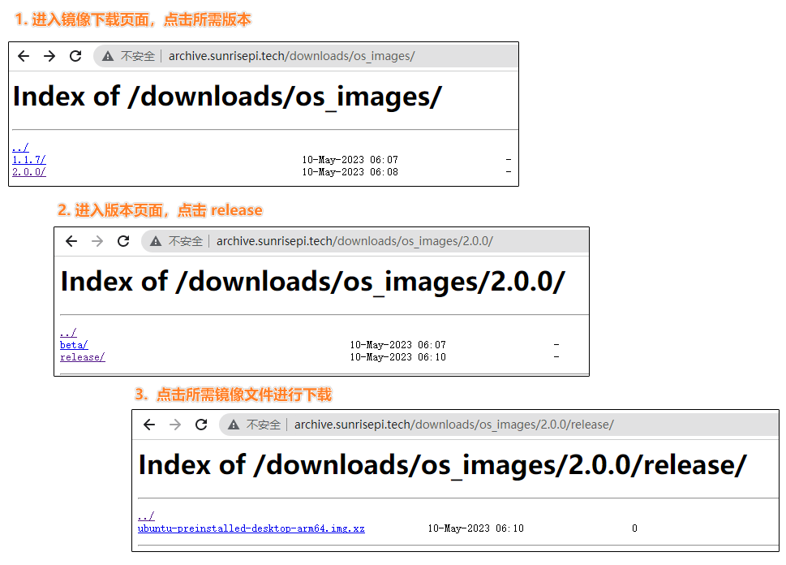
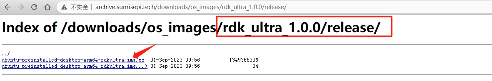
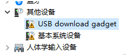
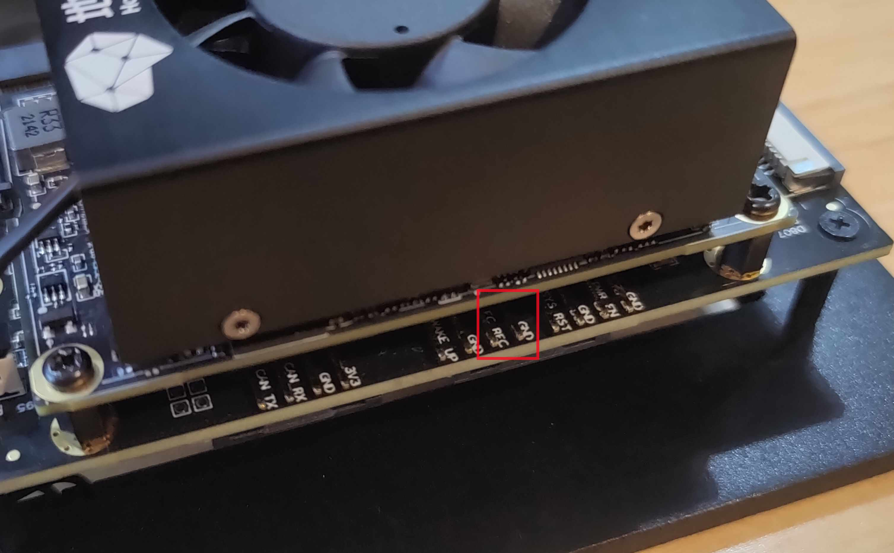
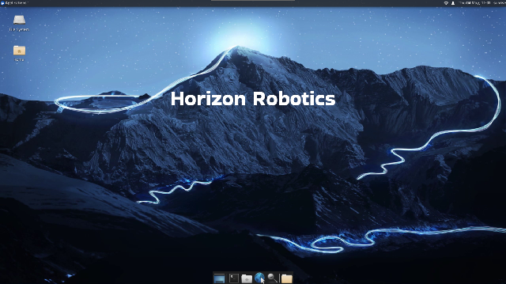

# 1.2 系统烧录
```mdx-code-block
import Tabs from '@theme/Tabs';
import TabItem from '@theme/TabItem';
```

RDK套件目前提供Ubuntu 20.04系统镜像，可支持Desktop桌面图形化交互。

:::info 注意

**RDK X3 Module**出厂已经烧写测试版本系统镜像，为确保使用最新版本的系统，<font color='Red'>建议参考本文档完成最新版本系统镜像的烧写</font>。
:::

## 镜像下载 {#img_download}

<Tabs groupId="rdk-type">
<TabItem value="x3" label="RDK X3">

<iframe src="//player.bilibili.com/player.html?aid=700903305&bvid=BV1rm4y1E73q&cid=1196536307&page=1" scrolling="no" border="0" frameborder="no" framespacing="0" width="100%" height="500" allowfullscreen="true"> </iframe>

点击 [**下载镜像**](https://sunrise.horizon.cc/downloads/os_images)，进入版本选择页面，选择对应版本目录，进入文件下载页。以下载2.0.0版本的系统镜像为例：



下载完成后，解压出Ubuntu系统镜像文件，如`ubuntu-preinstalled-desktop-arm64.img`

**版本说明：**

- 2.0版本：基于RDK Linux开源代码包制作，支持RDK X3派、X3模组等全系列硬件
- 1.0版本：旭日X3派历史版本，仅支持旭日X3派硬件，系统镜像名为`system_sdcard.img`

</TabItem>

<TabItem value="x3md" label="RDK X3 Module">

点击 [**下载镜像**](https://sunrise.horizon.cc/downloads/os_images)，进入版本选择页面，选择对应版本目录，进入文件下载页。以下载2.0.0版本的系统镜像为例：


下载完成后，解压出Ubuntu系统镜像文件，如`ubuntu-preinstalled-desktop-arm64.img`

**版本说明：**

- 2.0版本：基于RDK Linux开源代码包制作，支持RDK X3派、X3模组等全系列硬件
- 1.0版本：旭日X3派历史版本，仅支持旭日X3派硬件，系统镜像名为`system_sdcard.img`

</TabItem>

<TabItem value="ulrta" label="RDK Ultra">

点击 [**下载镜像**](https://sunrise.horizon.cc/downloads/os_images)，选择rdk_ultra目录，选择对应版本，进入文件下载页。以下载1.0.0版本的系统镜像为例：



下载完成后，解压出Ubuntu系统镜像文件，如`ubuntu-preinstalled-desktop-arm64-rdkultra.img`

</TabItem>

</Tabs>

:::tip

- desktop：带有桌面的Ubuntu系统，可以外接屏幕、鼠标操作
- server：无桌面的Ubuntu系统，可以通过串口、网络远程连接操作
:::


## 系统烧录

<Tabs groupId="rdk-type">
<TabItem value="x3" label="RDK X3">

:::tip

在烧录Ubuntu系统镜像前，需要做如下准备：
- 准备至少8GB容量的Micro SD卡
- SD 读卡器
- 下载镜像烧录工具balenaEtcher（可[点击此处下载](https://www.balena.io/etcher/)）
:::

balenaEtcher是一款支持Windows/Mac/Linux等多平台的PC端启动盘制作工具，制作SD启动卡流程如下：
1. 打开balenaEtcher工具，点击`Flash frome file`按钮，选择解压出来的`ubuntu-preinstalled-desktop-arm64.img`文件作为烧录镜像 

    

2. 点击`Select target`按钮，选择对应的Micro SD存储卡作为目标存储设备  

    

3. 点击`Flash`按钮开始烧录，待工具提示`Flash Complete`时，表示镜像烧录完成，可以关闭balenaEtcher并取出存储卡

    

</TabItem>

<TabItem value="x3md" label="RDK X3 Module">

RDK X3 Module支持从eMMC和SD卡两种模式启动系统：

- **使用SD卡**：如需烧录系统到SD上（不从eMMC模式启动），系统烧录步骤与RDK X3相同；
- **使用eMMC**：需要使用地平线`hbupdate`烧录工具。（**以下主要介绍该方法**）

`hbupdate`工具支持Windows、Linux两种版本，分别以 `hbupdate_win64`、 `hbupdate_linux` 开头，工具下载链接：[hbupdate](https://sunrise.horizon.cc/downloads/hbupdate/)。

:::tip 注意事项

  - 解压工具压缩包，注意解压路径中不要包含**空格、中文、特殊字符**等内容。
  - 工具通过USB口跟RDK X3模组通讯，需要提前安装USB驱动，具体方法见下文描述。
:::

1. 对于使用Windows系统的PC，在使用刷机工具前，需要确认是否安装过fastboot驱动程序，请按照如下步骤进行确认：

   （1）使用跳线帽将RDK X3载板的`Boot`管脚接地，管脚位置参考下图。    
     

   （2）将载板的Micro USB接口与电脑通过USB线连接，接口位置参考下图。  
     

   （3）给设备上电，然后观察电脑设备管理器端口状态，如出现`USB download gadget`未知设备时，需要更新设备驱动，否则可跳过下述步骤。  
     

   （4）下载并解压驱动包 `android_hobot.zip`，下载链接 [android_hobot](https://sunrise.horizon.cc/downloads/hbupdate/android_hobot.zip) 。

   （5）进入解压后的目录，以管理员身份运行 `5-runasadmin_register-CA-cer.cmd`，完成驱动程序的注册。

   （6）双击`USB download gadget`未知设备，选择驱动包解压目录，然后点击下一步。   
   

   （7）驱动安装完成后，设备管理器会显示fastboot设备`Android Device`。   
   

   

2. 确认PC设备管理器显示fastboot设备`Android Device`后，运行`hbupdate.exe`打开烧录工具，按照以下步骤进行烧录：

   

   （1）选择开发板型号，必选项。

   - RDK_X3_2GB： RDK X3（旭日X3派），2GB内存版本，仅支持烧写最小系统镜像

   - RDK_X3_4GB： RDK X3（旭日X3派），4GB内存版本，仅支持烧写最小系统镜像

   - RDK_X3_MD_2GB： RDK X3 Module，2GB内存版本

   - RDK_X3_MD_4GB： RDK X3 Module，4GB内存版本

   

   （2）点击`Browse`按钮选择将要烧录的镜像文件，必选项。

   

   （3）点击`Start`按钮开始刷机，根据弹窗提示开始烧录：

   

   - 烧录镜像时，需要通过跳线帽将`BOOT`管脚接地，管脚位置参考[功能控制接口](/hardware_development/rdk_x3_module/interface#功能控制接口)

   - 将Micro USB接口连接到电脑，电脑设备管理器中会识别出`Android Device`的设备，如上一节安装USB下载驱动所描述

   - 烧录完毕断开电源，断开和电脑的连接线，将BOOT管脚跳线帽拔下，重新上电即可

   - 如果启动正常，在硬件上的`ACT LED`灯会进入`两次快闪一次慢闪`的状态

   （4）检查升级结果

   - 镜像烧录成功时，工具提示如下：

   

   - 镜像烧录失败时，工具提示如下，此时需要确认PC设备管理器是否存在`Android Device`设备

   

</TabItem>

<TabItem value="ulrta" label="RDK Ultra">

RDK Ultra开发套件烧录Ubuntu系统时，需要使用地平线`hbupdate`烧录工具。目前工具支持Windows、Linux两种版本，分别以 `hbupdate_win64`、 `hbupdate_linux` 开头，工具下载链接：[hbupdate](https://sunrise.horizon.cc/downloads/hbupdate/)。

:::tip 注意事项

  - 解压工具压缩包，注意解压路径中不要包含**空格、中文、特殊字符**等内容。
  - 工具通过网口跟RDK Ultra通讯，为保证烧录速度，请确保**PC支持千兆网口，并采用直连方式**。
  - PC端网络需要提前配置为**静态IP方式**，具体如下：
    - IP：192.168.1.195
    - netmask：255.255.255.0
    - gateway：192.168.1.1
:::

1. 通过网线将RDK Ultra和PC机直连，并确保网络可以ping通。

2. 将功能控制接口（接口10）的`FC_REC`和`GND`信号短接。




3. 运行`hbupdate`主程序，打开下载工具并选择开发板型号为`RDK_ULTRA`，必选项。


4. 点击`Browse`按钮选择将要烧录的镜像文件，必选项。


5. 点击`Start`按钮开始刷机，根据提示信息确认操作无误后，点击`OK`按钮：


6. 当工具显示如下打印时，说明进入烧写过程，该过程耗时依赖于网络传输速度，请耐心等待。


7. 等待工具烧录完成，并检查烧录结果：

- 镜像烧录成功时，工具提示如下：


- 工具提示如下错误时，请确认步骤1~3是否操作正确。


- 工具提示如下错误时，说明网络传输速度过慢，建议更换性能更好的PC后重新升级。
  

</TabItem>

</Tabs>

:::caution

如烧录过程发生中断，请按照上述步骤重新进行。
:::


## 启动系统

<Tabs groupId="rdk-type">
<TabItem value="x3" label="RDK X3">

首先保持开发板断电，然后将制作好的存储卡插入开发板的Micro SD卡槽，并通过HDMI线缆连接开发板与显示器，最后给开发板上电。

系统首次启动时会进行默认环境配置，整个过程持续45秒左右，配置结束后会在显示器输出Ubuntu系统桌面。


:::tip 开发板指示灯说明


* **<font color='Red'>红色</font>**指示灯：点亮代表硬件上电正常
* **<font color='Green'>绿色</font>**指示灯：点亮代表系统启动中，熄灭或闪烁代表系统启动完成


如果开发板上电后长时间没有显示输出（2分钟以上），说明开发板启动异常。此时用户可通过指示灯确认系统状态，方法如下：

* **<font color='Green'>绿灯</font>**常亮：说明系统启动失败，可检查使用的电源适配器是否满足要求，可尝试重新制作系统镜像
* **<font color='Green'>绿灯</font>**熄灭或闪烁：说明系统启动成功，但显示服务启动失败，请确认连接的显示器符合支持列表规格

:::

</TabItem>

<TabItem value="x3md" label="RDK X3 Module">

RDK X3 Module支持从eMMC和SD卡两种模式启动系统：

- 当模组上的eMMC没有烧录过系统镜像的情况下，插入制作好系统的SD卡到载板即可通过从SD卡启动系统。

- 如果模组上的eMMC已经烧录过系统镜像，可以按照以下步骤进行eMMC和SD卡启动的切换。

  1、默认情况下会从eMMC启动系统

  2、禁用eMMC的启动切换到使用SD卡启动系统，登录系统后，执行以下命名把eMMC的第二个分区的启动标志删除，并重启系统生效：

  ```
  sudo parted /dev/mmcblk0 set 2 boot off
  sudo reboot
  ```

  3、在uboot下会发现eMMC没有启动分区而去寻找SD卡的启动分区，从SD卡加载系统启动，登录系统后执行`mount`命令可以看到跟文件系统挂载在 SD 卡的 第二个分区，config分区也使用的SD卡的第一个分区。

  ```
  /dev/mmcblk2p2 on / type ext4 (rw,relatime,data=ordered) 
  /dev/mmcblk2p1 on /boot/config type vfat
  ```

- 从SD卡启动切换回从eMMC启动

  当在使用SD卡启动系统时，并且eMMC上已经烧录过系统，执行以下命令恢复回从eMMC启动，重启系统生效。

  ```
  sudo parted /dev/mmcblk0 set 2 boot on
  sudo reboot
  ```

</TabItem>

<TabItem value="ulrta" label="RDK Ultra">

首先保持开发板断电，去除功能控制接口（接口10）的FC_REC和GND信号短接线，通过HDMI线缆连接开发板与显示器，最后给开发板上电。

系统首次启动时会进行默认环境配置，整个过程持续45秒左右，配置结束后会在显示器输出Ubuntu系统桌面。

</TabItem>

</Tabs>


Ubuntu Desktop版本系统启动完成后，会通过HDMI接口在显示器上输出系统桌面，如下图：


