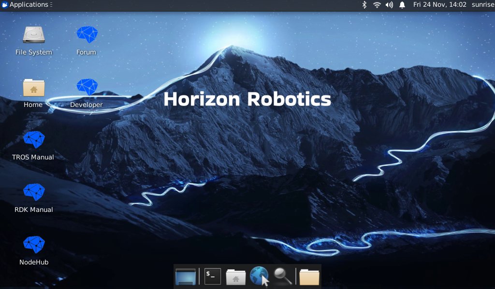

# 1.2 安装系统

<iframe src="//player.bilibili.com/player.html?aid=700903305&bvid=BV1rm4y1E73q&cid=1196536307&page=1" scrolling="no" border="0" frameborder="no" framespacing="0" width="100%" height="500" allowfullscreen="true"> </iframe>

开发板支持Ubuntu 20.04 Desktop系统版本，支持图形化交互。

Ubuntu Desktop版本系统启动完成后，会通过HDMI接口在显示器上输出系统桌面，如下图：

## 镜像下载 {#img_download}

下载Ubuntu镜像压缩包，解压出Ubuntu系统镜像文件：`ubuntu-preinstalled-desktop-arm64.img`

**版本说明：**

- 2.0版本：基于RDK Linux开源代码包制作，支持RDK X3派、X3模组等全系列硬件
- 1.0版本：旭日X3派历史版本，仅支持旭日X3派硬件，系统镜像名为`system_sdcard.img`

点击 [**下载镜像**](http://archive.sunrisepi.tech/downloads/os_images) 进入版本选择页面，选择对应版本目录，进入文件下载页。以下载2.0.0版本的系统镜像为例：

:::tip
- desktop：带有桌面的Ubuntu系统，可以外接屏幕、鼠标操作
- server：无桌面的Ubuntu系统，可以通过串口、网络远程连接操作
:::

## 烧录系统到Micro SD卡

在烧录Ubuntu系统镜像前，用户需要做如下准备：

- 准备至少8GB容量的Micro SD卡
- SD 读卡器
- 下载镜像烧录工具balenaEtcher，下载链接：[https://www.balena.io/etcher/](https://www.balena.io/etcher/)

balenaEtcher是一款支持Windows/Mac/Linux等多平台的PC端启动盘制作工具，制作SD启动卡流程如下：
1. 打开balenaEtcher工具，点击`Flash frome file`按钮，选择解压出来的`ubuntu-preinstalled-desktop-arm64.img`文件作为烧录镜像 

    

2. 点击`Select target`按钮，选择对应的Micro SD存储卡作为目标存储设备  

    

3. 点击`Flash`按钮开始烧录，待工具提示`Flash Complete`时，表示镜像烧录完成，您可以关闭balenaEtcher工具并取出存储卡

    

    

    

如Micro SD存储卡烧录过程发生中断，用户需要按照上述步骤重新进行。

## 启动系统

首先保持开发板断电，然后将制作好的存储卡插入开发板的Micro SD卡槽，并通过HDMI线缆连接开发板与显示器，最后给开发板上电。用户可通过指示灯判断开发板状态，指示灯说明如下：

* **红色**指示灯：点亮代表硬件上电正常
* **绿色**指示灯：点亮代表系统启动中，熄灭或闪烁代表系统启动完成

系统首次启动时会进行默认环境配置，整个过程持续45秒左右，配置结束后会在显示器输出Ubuntu系统桌面。

如果开发板上电后长时间没有显示输出（2分钟以上），说明开发板启动异常。此时用户可通过指示灯确认系统状态，方法如下：

* **绿灯**常亮：说明系统启动失败，可检查使用的电源适配器是否满足**5V3A**的要求，可尝试重新制作Micro SD卡系统镜像
* **绿灯**熄灭或闪烁：说明系统启动成功，但显示服务启动失败，请确认连接的显示器符合支持列表规格
