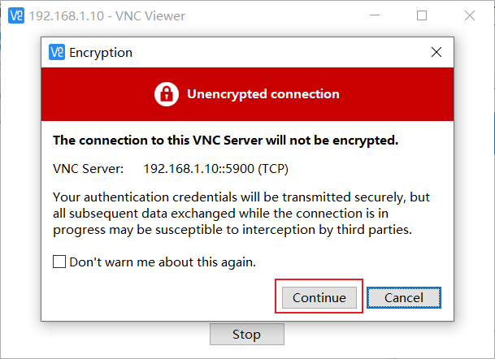
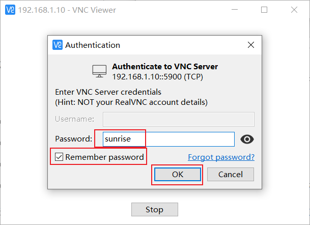

# 1.4 远程登录

本章节旨在向需要通过个人电脑(PC)远程访问开发板的用户介绍如何通过串口、网络(VNC、SSH)方式进行远程登录。

:::tip

通过网络方式远程登录前，开发板需要通过有线以太网或者无线WiFi方式接入网络，配置好开发板IP地址。对于两种连接方式下的IP地址信息可参考如下描述：

- 有线以太网：开发板默认采用静态IP模式，IP地址为`192.168.1.10`，掩码`255.255.255.0`，网关 `192.168.1.1`
- 无线WiFi：开发板IP地址一般由路由器分配，可在设备命令行中通过`ifconfig`命令查看wlan0网络的IP地址

:::

## 串口登录{#login_uart}

<iframe src="//player.bilibili.com/player.html?aid=700903305&bvid=BV1rm4y1E73q&cid=1196550506&page=2" scrolling="no" border="0" frameborder="no" framespacing="0" width="100%" height="500" allowfullscreen="true"> </iframe>

在使用串口登录前，需要确认开发板串口线跟电脑正确连接，连接方法可参考[调试串口](/installation/hardware_interface#debug_uart)章节。串口登录需要借助PC终端工具，目前常用的工具有`Putty`、`MobaXterm`等，用户可根据自身使用习惯来选择。不同工具的端口配置流程基本类似，下面以`MobaXterm`为例，介绍新建串口连接过程：

- 当串口USB转接板首次插入电脑时，需要安装串口驱动。驱动程序可从资源中心的[工具子栏目](https://developer.horizon.ai/resource)获取。驱动安装完成后，设备管理器可正常识别串口板端口，如下图：  


- 打开`MobaXterm`工具，点击`Session`，然后选择`Serial`

- 配置端口号，例如`COM3`，实际使用的串口号以PC识别到的串口号为准

- 设置串口配置参数，如下：
  
  | 配置项               | 参数值 |
  | -------------------- | ------ |
  | 波特率（Baud rate）  | 921600 |
  | 数据位（Data bits）  | 8      |
  | 奇偶校验（Parity）   | None   |
  | 停止位（Stop bits）  | 1      |
  | 流控（Flow Control） | 无     |
  
- 点击`OK`，输入用户名：`root`、密码：`root`登录设备  


此时，可使用`ifconfig`命令查询开发板IP地址，其中eth0、wlan0分别代表有线、无线网络：
```bash
root@ubuntu:~# ifconfig
eth0: flags=4163<UP,BROADCAST,RUNNING,MULTICAST>  mtu 1500
        inet 192.168.1.10  netmask 255.255.255.0  broadcast 192.168.1.255
        inet6 fe80::211:22ff:feaa:7637  prefixlen 64  scopeid 0x20<link>
        ether 00:11:22:aa:76:37  txqueuelen 1000  (Ethernet)
        RX packets 767  bytes 54006 (54.0 KB)
        RX errors 0  dropped 0  overruns 0  frame 0
        TX packets 5766  bytes 246466 (246.4 KB)
        TX errors 0  dropped 0 overruns 0  carrier 0  collisions 0
        device interrupt 43  base 0xa000  

lo: flags=73<UP,LOOPBACK,RUNNING>  mtu 65536
        inet 127.0.0.1  netmask 255.0.0.0
        inet6 ::1  prefixlen 128  scopeid 0x10<host>
        loop  txqueuelen 1000  (Local Loopback)
        RX packets 3847  bytes 339115 (339.1 KB)
        RX errors 0  dropped 0  overruns 0  frame 0
        TX packets 3847  bytes 339115 (339.1 KB)
        TX errors 0  dropped 0 overruns 0  carrier 0  collisions 0

wlan0: flags=4099<UP,BROADCAST,MULTICAST>  mtu 1500
        ether 08:e9:f6:ae:f8:8a  txqueuelen 1000  (Ethernet)
        RX packets 0  bytes 0 (0.0 B)
        RX errors 0  dropped 0  overruns 0  frame 0
        TX packets 0  bytes 0 (0.0 B)
        TX errors 0  dropped 0 overruns 0  carrier 0  collisions 0
```

## 网络状态确认{#network_config}

<iframe src="//player.bilibili.com/player.html?aid=700903305&bvid=BV1rm4y1E73q&cid=1196554007&page=3" scrolling="no" border="0" frameborder="no" framespacing="0" width="100%" height="500" allowfullscreen="true"> </iframe>

在使用远程登录前，需要确保电脑、开发板网络通信正常，如无法`ping`通，需按如下步骤进行确认：
- 确认开发板、电脑IP地址配置，一般前三段需要是一样的，例如开发板：`192.168.1.10`  电脑：`192.168.1.100`
- 确认开发板、电脑的子网掩码、网关配置是否一致
- 确认电脑网络防火墙是否处于关闭状态

开发板有线以太网默认采用静态IP模式，IP地址为`192.168.1.10`。对于开发板、电脑网络直连的情况，只需要将电脑配置为静态IP，保证跟开发板处于同一网段即可。以WIN10系统为例，电脑静态IP修改方法如下：

- 在网络连接中找到对应的以太网设备并双击打开
- 找到Internet协议版本4选项并双击打开
- 在下图红框位置填入对应的网络参数，点击确定


如需将开发板有线网络配置为动态获取DHCP模式，可参考[有线网络](../configuration/network#config_ethnet)章节进行配置。

## VNC登录

<iframe src="//player.bilibili.com/player.html?aid=700903305&bvid=BV1rm4y1E73q&cid=1196553936&page=4" scrolling="no" border="0" frameborder="no" framespacing="0" width="100%" height="500" allowfullscreen="true"> </iframe>

本章节面向使用Ubuntu Desktop系统版本的用户，介绍如何通过`VNC Viewer`实现远程桌面登录功能。`VNC Viewer`是一个图形桌面共享软件，可在电脑上实现设备远程登录和控制桌面。该软件可以通过电脑显示器预览开发板系统桌面，并使用电脑的鼠标、键盘进行远程操作。用户通过VNC Viewer操作，可以获得跟开发板本地操作相同的效果，下载链接[VNC Viewer](https://www.realvnc.com/en/connect/download/viewer/)。

**连接开发板**  
目前VNC支持直接、云端两种连接方式，用户可以根据自身情况选择。本文推荐使用直接连接方式，连接步骤如下：

- 输入设备ip地址，例如：192.168.1.10  


- 输入IP地址后回车，弹出链接未加密的提示，点击 `Continue`  


- 输入密码 `sunrise`，勾选 `Remember password`, 点击 `OK`连接  


## SSH登录{#ssh}
除了VNC登录远程桌面外，还可以通过SSH连接登录开发板。下面分别介绍终端软件、终端命令行两种方法的创建步骤。

### 终端软件
目前常用终端工具有`Putty`、`MobaXterm`等，用户可根据自身使用习惯来选择。不同工具的端口配置流程基本类似，下面以`MobaXterm`为例，介绍新建SSH连接过程：

1. 打开`MobaXterm`工具，点击`Session`，然后选择`SSH`
2. 输入开发板IP地址，例如`192.168.1.10`
3. 选中`specify username`，输入`sunrise`
4. 点击OK后，输入用户名（sunrise）、密码（sunrise）即可完成登录


### 电脑命令行 
用户也可通过命令行方式进行SSH登录，步骤如下：

1. 打开终端窗口，输入SSH登录命令，例如`ssh sunrise@192.168.1.10`
2. 弹出连接确认提示，输入YES
3. 输入密码（sunrise）即可完成登录


