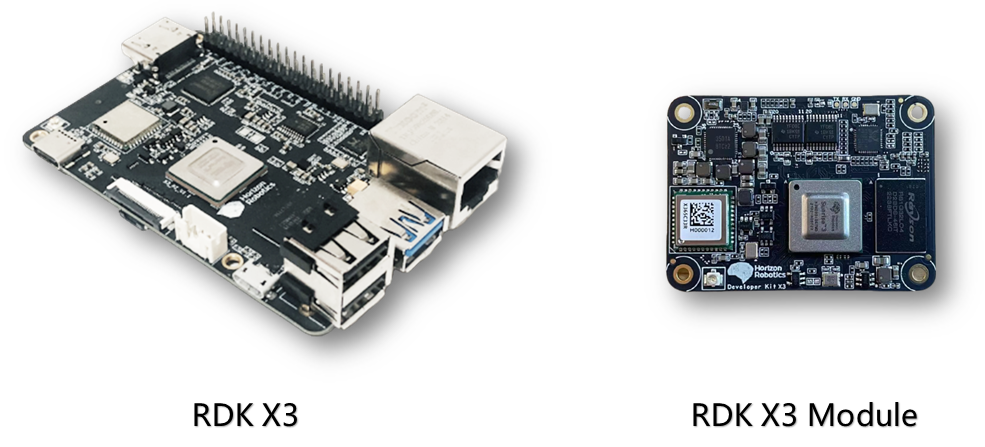

# 1.1 地平线RDK套件概述

**Horizon Robotics Developer Kits**，简称地平线RDK套件，是基于地平线智能芯片打造的机器人开发者套件，包括RDK X3（旭日X3派）、RDK X3 Module（旭日X3模组）。
搭配TogetheROS.Bot机器人中间件，地平线RDK套件可以帮助发者快速搭建机器人原型，开展评测和验证工作。

本文将详细说明地平线RDK套件的使用方法，包括开发环境搭建、示例教程的运行、应用程序的开发、系统镜像的定制等方面内容。无论您选择使用哪种硬件，本文所介绍的内容都将为您提供一致的使用体验。

## 1.1.1 产品介绍

**RDK X3（旭日X3派）** 是一款全功能开发板，具备强大的处理能力和丰富的外设接口，通过搭配丰富的传感器和扩展组件，为开发者提供了灵活的硬件扩展和连接选项。

**RDK X3 Module（旭日X3模组）** 是一款紧凑型核心模组，与RDK X3保持了同等规格，并在尺寸、接口上兼容树莓派CM4模组。通过搭配扩展板，可以为各种应用场景提供高效的计算和通信能力。

