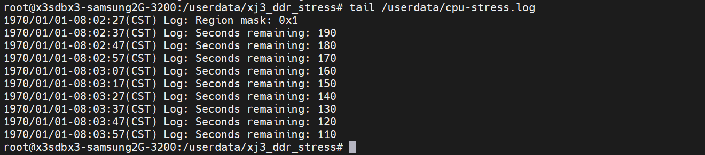

# DDR压力测试方案

## 目的

本文主要介绍DDR颗粒在高低温环境下长时间大压力运行的测试方法。

## 名词解释

判定术语：
PASS：测试完成后，DUT所有功能、性能符合预期，无异常发生
FAIL：测试完成后，DUT功能出现损坏或功能失效，或未达到指标要求

## 测试项

| **测试类别**    | **环境温度** | **测试时长** |
| --------------- | ------------ | ------------ |
| DDR常温压力测试 | 25度         | 48H          |
| DDR高温压力测试 | 60度         | 48H          |
| DDR低温压力测试 | -25度        | 48H          |

## 测试环境

### DUT压力程序

| **ITEM** | **版本号/设备编号**   | **适用测试项** |
| -------- | --------------------- | -------------- |
| 测试脚本 | xj3_ddr_stress.tar.gz | 压力测试通用   |
| DUT数量  | 5台及以上             | 压力测试通用   |

从 [unittest](https://sunrise.horizon.cc/downloads/unittest/) 选择对应sdk版本的目录下载 `xj3_ddr_stress_gcc9.3.tar.gz`

### 压力程序使用方法

1、通过网口或者其他工具将 `xj3_ddr_stress_gcc9.3.tar.gz`  传输到 XJ3 的 userdata 目录下

2、进入 XJ3 侧的 userdata 目录 cd /userdata

3、解压测试文件

```
tar -zxvf xj3_ddr_stress_gcc9.3.tar.gz 
```

4、给 xj3_ddr_stress 文件夹加权限

```
 chmod 777 xj3_ddr_stress 
```

5、进入 cd xj3_ddr_stress 目录

```
cd xj3_ddr_stress 
```

6、设置CPU模式和降频温度

```
# 若设备重启需再次配置这两条指令
echo performance > /sys/devices/system/cpu/cpufreq/policy0/scaling_governor 
echo 105000 > /sys/devices/virtual/thermal/thermal_zone0/trip_point_1_temp
```

7、执行压力测试脚本, 后台运行cpu test和bpu test

```
sh ./scripts/xj3-stress.sh
```

8、top检查运行状态


9、cpu test log存放目录在 /userdata/cpu-stress.log， 查看当前运行状态

```
# 10s 会打印一次
tail /userdata/cpu-stress.log
```



注：程序默认连续运行48h（如下图-s参数后面的172800，单位：s） 

10、bpu test log 存放在/userdata/bpu-stress.log，查看当前运行状态

```
# 只要 log 在更新，就是在测试，默认一直运行
tail /userdata/bpu-stress.log
```

11、检查cpu test result, 如果/userdata/cpu-stress.log最后Status显示PASS，且日志中未出现"error" 或者 "miscompare" 关键字，表示测试PASS; 


12、如果/userdata/cpu-stress.log最后Status显示FAIL，或者日志中出现了"error" 或者 "miscompare" 关键字，表示测试FAIL;  


13、检查bpu test result, 如果bpu_stress.log 中出现 error 或者 system hung 等关键字，表示测试FAIL。 
