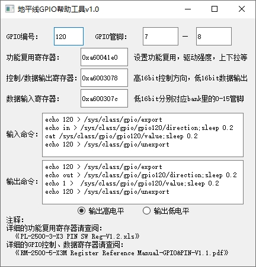

# GPIO调试指南

X3 芯片共有121个IO功能管脚，每个管脚都可以配置工作在gpio模式下，但是需要注意和其他功能管脚的复用关系。

## 管脚查询

IO管脚的复用和配置可以在 [datasheets](https://sunrise.horizon.cc/downloads/datasheets/) 查阅《PL-2500-3-X3 PIN SW Reg-V1.2.xls》 和《RM-2500-5-X3M Register Reference Manual-GPIO&PIN-V1.1.pdf》。

在 《PL-2500-3-X3 PIN SW Reg-V1.2.xls》可以比较直观的查询到管脚的上电默认状态、复用、驱动能力、上下拉、施密特触发配置。

在 《RM-2500-5-X3M Register Reference Manual-GPIO&PIN-V1.1.pdf》文档中查询对应管脚的gpio寄存器信息。

### 示例

以查询`gpio120`号管脚的复用、方向控制、数据寄存器地址为例进行说明：

**功能复用寄存器说明：**

- 打开 《PL-2500-3-X3 PIN SW Reg-V1.2.xls》，选择  `PIN SW Register` 的数据表。
- 第一行会标明功能复用的基地为`0xA6004000`。

- 在`GPIO`列找到 `GPIO[120]`，这一项对应的信息即是管脚 `120`的上电默认状态、复用、驱动能力、上下拉、施密特触发配置。如下图所示。


- 找到以上配置项后，基地址加上偏移的值即该管家的复用控制寄存器，例如`GPIO120`的复用寄存器为 `0xA6004000 + 0x1E0 = 0xA600410E0`。
- 配置功能复用寄存器时，建议先把该值先读出来，然后设置想要设置的对应bit后再写回。例如配置`GPIO120`为`GPIO`模式，则只设置 `0xA600410E0` 寄存器的低两位为`0x3`，保持其他启动强度、上下拉、斯密特触发配置不变，除非你明确知道你需要对它们也做修改。

**GPIO控制和数据寄存器：**

- 打开 《RM-2500-5-X3M Register Reference Manual-GPIO&PIN-V1.1.pdf》，本文档分两个主要章节，`GPIO`章节是描述管脚的控制寄存器、输出数据寄存器、输入数据寄存器和管脚电压域配置寄存器（偏移为0x170 和 0x174的两个寄存器是管脚电压域配置寄存器）。`Pin Group`章节与寄存器复用《PL-2500-3-X3 PIN SW Reg-V1.2.xls》表内容一样。
- 控制、数据寄存器的基地址在每页表格的第一行会显示，为`BASE_ADDR:0xA600_3000 `，查询到的偏移地址加上本基地址就是对应的完整寄存器地址。
- 旭日X3M芯片总共有`120`个可用的管脚，分成7个bank，每个bank最多16个管脚，控制和数据寄存器以一个bank为一个控制单元。例如`GPIO120`的bank为`120除以16后取整为7`，在bank中的管脚编号为`120对16取余数为8`。由此我们就可以找到对应的寄存器地址为如下图所示。`GPIO120`的寄存器即以下图中寄存器`GPIO7_xxx`中对应的`bit8`（从bit0开始计算）。


### GPIO帮助工具

通过以上章节，相信你已经具备自主查询、设置各管脚的配置的能力。针对旭日X3M芯片，地平线还提供了一个小软件帮助用户快速完成以上寄存器的查询，并且提供管脚设置的帮助命令，可以从 [地平线GPIO帮助工具](https://pan.horizon.ai/index.php/s/JTitK4g8SLzSGa6/download?path=%2FGpio_tools&files=%E5%9C%B0%E5%B9%B3%E7%BA%BFGPIO%E5%B8%AE%E5%8A%A9%E5%B7%A5%E5%85%B7v1.0.exe)下载使用。

工具的界面如下图所示，用户可以控制输入 `GPIO编号` 或者 `GPIO管脚 `来查询管脚的各种寄存器地址，并且生成gpio功能的帮助命令，命令说明请查看 [GPIO用户空间使用说明](#user-space)了解详情。



## 驱动代码

```bash
drivers/gpio/gpio-hobot-x3.c # gpio驱动源文件
```

### 内核配置

CONFIG_GPIO_HOBOT_X3


### 内核DTS配置

```c
/* arch/arm64/boot/dts/hobot/hobot-xj3.dtsi */
gpios: gpio@0xA6003000 {
    compatible = "hobot,x3-gpio";
    reg = <0 0xA6003000 0 0x100>;
    gpio-controller;
    #gpio-cells = <2>; 
    gpio-ranges = <&pinctrl 0 0 121>;
    interrupts = <0 54 4>;
    interrupt-parent = <&gic>;
    interrupt-controller;
    #interrupt-cells = <2>; 
};
```

:::info 备注
hobot-xj3.dtsi中的节点主要声明一些寄存器、中断的resource，均为soc共有特性，和具体电路板无关，一般情况下不用修改。
:::

## GPIO使用

### Kernel Space

#### DTS配置

GPIO设备树节点的属性命名方式一般为names-gpios或names-gpio，举例如下：

```c
/* arch/arm64/boot/dts/hobot/hobot/hobot-x3-sdb.dtsi */
&usb_id {
        status = "okay";  
        id-gpio = <&gpios 65 GPIO_ACTIVE_HIGH>;
        host-rst-gpio = <&gpios 115 GPIO_ACTIVE_HIGH>;
        host-exrst-gpio = <&gpios 38 GPIO_ACTIVE_LOW>;
};
```

#### 驱动代码接口

```c
/* include/linux/gpio.h */
/* 申请GPIO */
int gpio_request(unsigned gpio, const char *label);
/* GPIO初始化为输出。并设置输出电平*/
int gpio_direction_output(unsigned gpio, int value);
/* GPIO初始化为输入 */
int gpio_direction_input(unsigned gpio);
/* 获取GPIO的电平 */
int gpio_get_value(unsigned int gpio);
/* 设置GPIO的电平 */
void gpio_set_value(unsigned int gpio, int value);
/* 释放GPIO */
void gpio_free(unsigned gpio)
/* 申请GPIO中断，返回的值可以传给request_irq和free_irq */
int gpio_to_irq(unsigned int gpio);
```

#### X3J3 GPIO IRQ

X3 GPIO共有121个pin，硬件中断数量为4个，使用时通过GPIO模块寄存器的设置可以将121个pin中的最多4个pin映射到4个IRQ中断上，映射过程由GPIO驱动管理，通过gpio_to_irq申请GPIO IRQ号，4个irq都被申请完，后续申请都会失败，irq映射管理的代码如下：

```bash
/* drivers/gpio/gpio-hobot-x3.c */
/* 初始化irq映射表 */
void init_irqbank*struct x3_gpio *gpo) {
    int i = 0;
    for (i = 0; i < GPIO_IRQ_BANK_NUM; i++) {
        gpo->irqbind[i] = GPIO_IRQ_NO_BIND;
    }
}

/* request irq并更新映射表 */
int request_irqbank(struct x3_gpio *gpo, unsigned long gpio) {
    int i = 0, index = GPIO_IRQ_NO_BIND;
    index = find_irqbank(gpo, gpio);
    if(index == GPIO_IRQ_NO_BIND) {
        for (i = 0; i < GPIO_IRQ_BANK_NUM; i++) {
            if(gpo->irqbind[i] == GPIO_IRQ_NO_BIND) {
                gpo->irqbind[i] = gpio;
                index = i;
                break;
            }
        }
    } else {
        dev_err(gpo->dev, "gpio(%ld) has be binded\n", gpio);
        return GPIO_IRQ_NO_BIND;
    }
    return index;
}

/* free gpio并更新映射表 */
void release_irqbank(struct x3_gpio *gpo, unsigned long gpio) {
    int index = GPIO_IRQ_NO_BIND;
    index = find_irqbank(gpo, gpio);
    if(index != GPIO_IRQ_NO_BIND) {
        gpo->irqbind[index] = GPIO_IRQ_NO_BIND;
    }
}
```

:::info 备注 
X3 GPIO在Kernel Space的接口都是Linux的标准接口，更多使用方法请参考Documentation/gpio/consumer.txt。
:::

### User Space{#user-space}

#### 控制接口

```bash
/sys/class/gpio/export #用户空间可以通过写入gpio号申请将gpio的控制权导出到用户空间，比如 echo 42 > export
/sys/class/gpio/unexport # 和export相反
/sys/class/gpio/gpiochip0 # gpio控制器
```

#### 调用接口

使用export导出gpio的控制权以后会有路径/sys/class/gpio/gpio42/，路径下有如下属性：

-   direction：表示GPIO端口方向，读取为"in"或"out"，写入"in"或者"out"可以设置输入或输出
-   value：表示GPIO的电平，0为低电平，1为高电平，如果GPIO配置为输出，则value值可写
-   edge：表示中断触发方式，有"none" "rising" "falling" "both" 4种类型，"none"表示GPIO不为中断引脚，"rising"表示引脚为上升沿触发的中断，"falling"表示引脚为下降沿触发的中断，"both"表示引脚为边沿触发的中断。

#### 调用示例

以下示例演示导出  JTG_TRSTN 管脚，设置为输出模式，输出高电平，最后反导出。

```bash
echo 4 > /sys/class/gpio/export
echo out > /sys/class/gpio/gpio4/direction
echo 1 > /sys/class/gpio/gpio4/value
# echo 0 > /sys/class/gpio/gpio4/value
echo 4 > /sys/class/gpio/unexport
```

#### 调试接口

如果在内核配置中打开了Linux Kernel的CONFIG_DEBUG_FS 选项，并且挂载了debugfs文件系统

```
mount -t debugfs none /sys/kernel/debug
```

则可以通过如下节点查看GPIO的申请列表。

```bash
root@x3dvbx3-hynix1G-2666:~# cat /sys/kernel/debug/gpio
gpiochip0: GPIOs 0-120, parent: platform/a6003000.gpio:
gpio-42  (           |sysfs     ) in hi
gpio-64  (           |cd        ) in lo IRQ
gpio-65  (           |id        ) in hi IRQ
gpio-100 (           |?         ) out lo
gpio-120 (           |?         ) out hi
root@x3dvbx3-hynix1G-2666:~#
```

:::info 备注  
X3 GPIO在User Space的接口都是Linux的标准接口，更多使用方法请参考Documentation/gpio/sysfs.txt
:::
