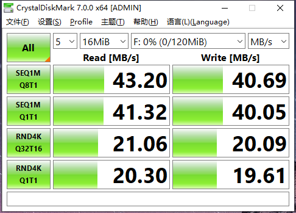

# USB驱动性能测试

## 测试方法

### 开发板侧

1. 使用`CrystalDiskMark`进行测试（软件包在`09-usb_test`目录下）。
2. 开发板输入下面命令:  

```bash
service adbd stop
cd /tmp
dd if=/dev/zero of=/tmp/700M.img bs=1M count=700
losetup -f /tmp/700M.img
losetup -a 
modprobe g_mass_storage file=/dev/loop0 removable=1
```

### PC侧

1. PC端会出现新磁盘设备的提醒，将其格式化为FAT32格式。
2. PC打开`CrystalDiskMark`，选择刚挂载的X3设备，点击`All`开始测试，若出现空间不足的提示，则调整测试文件大小。
3. 测试完成之后，前两项`SEQ1M*`表示顺序读写速度，后面两项`RND4K*`表示4k小文件随机读写速度。
     


  **图片中的速度仅供参考**

## 测试标准

测试结果取CrystalDiskMark SEQ1MQ8T1读写数据  
USB 2.0 : 读写超过**40**MB/s  
USB 3.0 : 读写超过**370**MB/s  