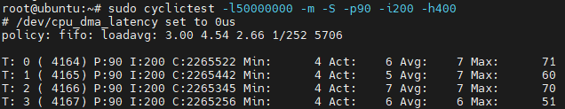
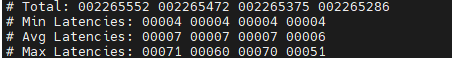

# 6.5 应用实时内核

本章节旨在描述如何在`RDK X3` 和 `RDK X3 Module`上启用实时内核（Preempt-RT kernel），并提供了相应的命令以便于用户使用。实时内核是一种能够提供更加精确和可靠的响应时间的操作系统内核，通常用于对时间敏感性要求较高的应用程序，在机器人控制、工业自动化等应用场景使用较多。以下是启用和禁用实时内核的相关命令以及一些常见用途和测试方法。

## 实时内核启用命令

要在RDK X3上启用实时内核，请执行以下命令：

```bash
sudo apt update
sudo apt install hobot-kernel-headers=2.0.0-01~rt hobot-boot=2.0.2-01~rt hobot-bpu-drivers=2.0.0-01~rt
sudo reboot
```

这些命令将安装与实时内核兼容的内核头文件、内核文件、驱动程序和BPU驱动，完成后重新启动系统以使更改生效，使用 `uname -a`命令可以看到 `PREEMPT RT`的内核版本信息说明。


## 恢复为标准内核命令

如果需要恢复为标准内核，可以执行以下命令：

```bash
sudo apt install hobot-kernel-headers hobot-boot hobot-bpu-drivers
sudo reboot
```

这些命令将卸载实时内核相关的组件，并且安装标准内核对应的组件，完成后重新启动系统以切换回标准内核。

## 实时性能测

当需要对实时内核的性能进行测试时，一个常用的性能测试工具是`rt-tests`，它包括了多个测试程序，可以用来测试实时内核的性能。以下是一个使用`rt-tests`进行性能测试的示例：

### 安装rt-tests工具

如果尚未安装`rt-tests`工具，可以使用以下命令进行安装：

```
sudo apt install rt-tests
```

### 运行cyclictest测试

`cyclictest`测试是`rt-tests`中的一个常用测试，它用于评估系统的定时行为和响应时间。执行以下命令运行`cyclictest`测试：

```
sudo cyclictest -l50000000 -m -S -p90 -i200 -h400
```

这个命令将运行一个实时性能测试，其中：

- `-l50000000`: 设置测试运行的循环次数。
- `-m`: 指 `cyclictest` 在测试期间将当前和接下来的内存通过mlock锁定，防止发生swap影响测试。
- `-S`: 指标准smp架构测试，所有的线程将使用相同的-a -t -n和优先级。
- `-p90`: 指定实时线程的优先级。`-p90` 表示测试将在优先级 90 的实时调度类别中运行。
- `-i200`: 设置测试线程睡眠的时间。
- `-h400`: 测试完成后输出一个直方图，并输出延时小于指定值（400）微秒的次数统计。

测试结果将显示出系统的最小、最大和平均延迟，以及一些其他性能统计信息。

### 分析测试结果

分析`cyclictest`测试结果以评估实时内核的性能表现。关注最小延迟和最大延迟，以确保它们在可接受范围内。较小的最大延迟和更加一致的延迟表明实时内核的性能较好。下图是使用实时内核，并且运行了 `/app/pydev_demo/03_mipi_camera_sample` 示例的情况下测试的结果。





`cyclictest` 输出中的每个字段含义如下：

- `T`: 测试运行的线程编号和线程号。
- `P`: 测试运行时使用的优先级。在你的输出中，它的值为 90，表示测试在优先级 90 的实时调度类别中运行。
- `I`: 延迟测量线程的预期唤醒周期，以微秒为单位。
- `C`: 测量延迟的次数，即循环计数。
- `Min`: 当前测试周期的最小延迟，以微秒为单位。
- `Act`: 当前测试周期的实际延迟，以微秒为单位。
- `Avg`: 当前测试周期的平均延迟，以微秒为单位。
- `Max`: 当前测试周期的最大延迟，以微秒为单位。