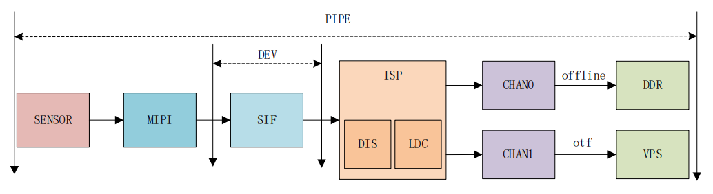
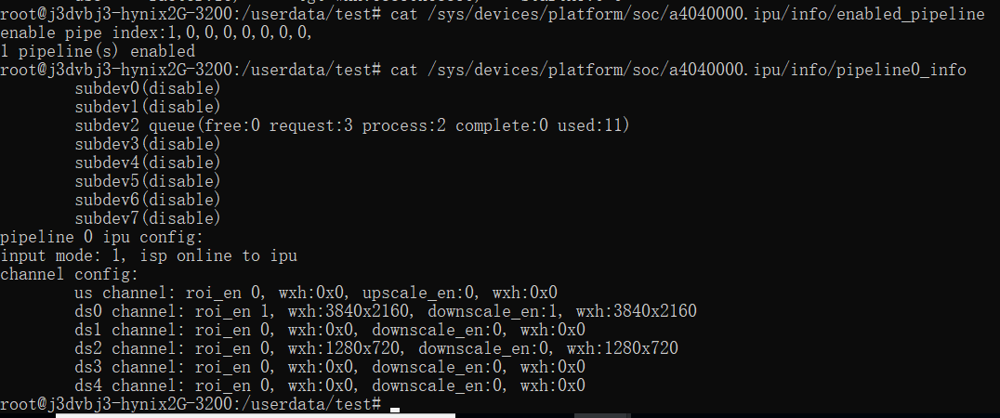
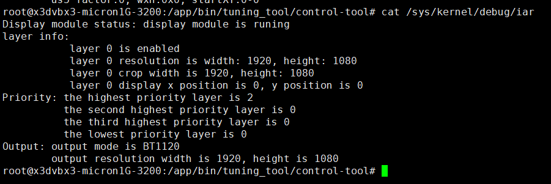
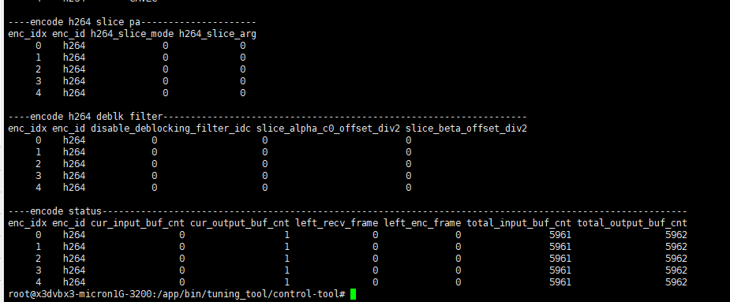
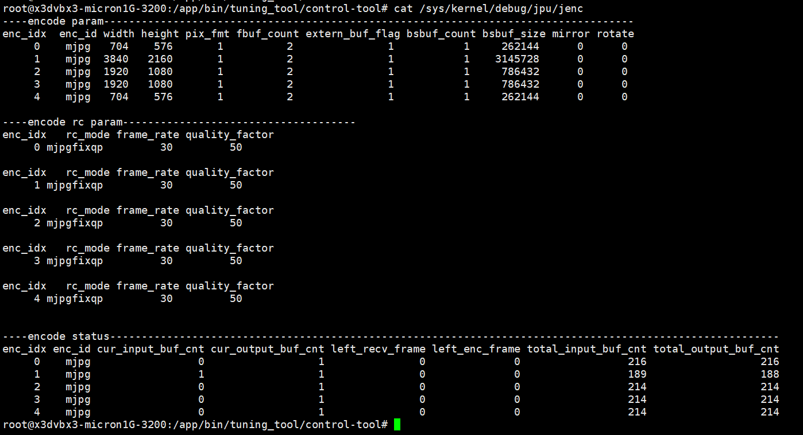

# 7.11 查询多媒体模块调试信息

## 驱动与多媒体系统交互

在VIN中，camera相关的控制全部在用户态完成，而mipi/ISP的控制则在驱动中完成，通过将用户态相关的配置传递给驱动，由驱动使用，对硬件进行设置，各个相关的设备节点如下：



- **mipi_host0\~4:** mipi host配置节点，主要完成mipi\_host的初始化。
- **mipi\_dphy:** dphy相关节点。
- **mipi_dev0:** 该设备节点会在配置中使能，配置mipi\_dev输出。

- **SIF共有两个节点：**
  - **sif_capture:** 设置sif相关属性信息，对sif模块初始化，可以dump sif模块出来的图像。
  - **sif_ddrin:** 设置ddrin节点的属性信息/尺寸/格式等，sif-offline-isp场景才使用，负责读内存数据给isp。

- **ISP相关节点：**

  - **ac\_calib:** calibration效果库设置。

  - **ac_isp:** isp效果调节接口使用。

  - **ac_isp4uf0\~7:** isp驱动算法库发command使用。

  - **ac_sbuf0\~7:** 算法库通过该设备节点与isp驱动同步一些算法数据。

  - **video0\~7:** isp v4l2设备节点，设置尺寸/格式/大小，内存映射通过该节点与设备交互。

VIN中，MIPI/SIF的功能相对简单，对于MIPI实际上就是硬件上抽象出来的几个节点，用于用户配置参数，从而设置MIPI
HOST到对应的状态，能够接受sensor的MIPI数据输入；

而SIF则是将MIPI HOST收到的数据再进行一定的处理，比如将不同sensor的数据保存到不同的ddr地址等；

ISP的功能相对来说是最复杂的，它需要和sensor交互/需要加载对应的算法库/需要加载对应的效果库，在配置代码中：


- **ispAlgoState:**  这个标签表示使用3A算法，将会使用lib_algo.so库的算法；

- **calib：** 这个则是不同sensor配置出来的效果库，用于调整sensor效果；

## VIO调试信息

### SIF调试信息

查看SIF调试信息：

```
cat /sys/devices/platform/soc/a4001000.sif/cfg_info
```


### ISP调试信息

查看ISP调试信息：

```
cat /sys/devices/platform/soc/b3000000.isp/isp_status
```


>   

### IPU调试信息

查看当前哪些pipe使能：

```bash
cat /sys/devices/platform/soc/a4040000.ipu/info/enabled_pipeline
```

查看各pipe配置情况：

```bash
cat /sys/devices/platform/soc/a4040000.ipu/info/pipelinex_info # x 取值0-7
# 示例
cat /sys/devices/platform/soc/a4040000.ipu/info/pipeline0_info
```



说明：

subdev0对应ipu src，sbudev1\~6对应ipu
us/ds0\~ds4。subdev后面括号里的信息表示这个通道的buffer在各个状态的数量。

### PYM调试信息

查看当前哪些pipe使能：

```
cat /sys/devices/platform/soc/a4042000.pym/info/enabled_pipeline
```

查看各pipe配置情况：

```bash
cat /sys/devices/platform/soc/a4042000.pym/info/pipelinex_info # x取值0-7
# 示例
cat /sys/devices/platform/soc/a4042000.pym/info/pipeline0_info
```


### IAR调试信息

查看IAR调试信息：

```
cat /sys/kernel/debug/iar
```



## VPU调试信息

### VENC调试信息

查看编码信息：

```
cat /sys/kernel/debug/vpu/venc
```




### VDEC调试信息

查看解码信息：

```
cat /sys/kernel/debug/vpu/vdec
```


## JPU调试信息

### JENC调试信息

查看编码信息：

```
cat /sys/kernel/debug/jpu/jenc
```



### JDEC调试信息

查看解码信息：

```
cat /sys/kernel/debug/jpu/jdec
```


## 媒体模块日志查看

### 日志级别

控制台输出日志和logcat查看日志是二选一的关系，通过环境变量LOGLEVEL来控制。

如export LOGLEVEL=14，即把比Debug级别高的日志（\<=14）全部输出到Console。

如果想通过logcat查看Debug及更高级别的日志，需要export LOGLEVEL=4。

| 控制台输出日志        |      | 通过logcat查看日志 |      |
| --------------------- | ---- | ------------------ | ---- |
| CONSOLE_DEBUG_LEVEL   | 14   | ALOG_DEBUG_LEVEL   | 4    |
| CONSOLE_INFO_LEVEL    | 13   | ALOG_INFO_LEVEL    | 3    |
| CONSOLE_WARNING_LEVEL | 12   | ALOG_WARNING_LEVEL | 2    |
| CONSOLE_ERROR_LEVEL   | 11   | ALOG_ERROR_LEVEL   | 1    |

### 日志标签

媒体模块内部定义了一些LOG_TAG，所有TAG如下：

| vio-core vio-devop ipu sif dwe gdc pym vin isp rgn mipi vp vps venc vdec audio vot vio-bufmgr ffmedia multimedia |
|------------------------------------------------------------------------------------------------------------------|

注意：

没有标签的日志不能过滤，在满足LOG
LEVEL级别的情况下会被打印出来（一般见于应用程序或没加TAG的模块）。

如果想给应用程序加上TAG：

1.  可以在文件最开头定义\#define LOG_TAG “APP”

2.  包含相关头文件 \#include “logging.h”

3.  应用程序中的日志打印用logging.h头文件中的pr_xxx开关的宏定义

### 日志过滤

各模块日志均可通过logcat来过滤查看，这里介绍下模块相关如何过滤。logcat是开源的命令，其他参数可自行探索。

例如只想打印vps部分且日志级别高于Debug的日志，并输出到文件可以这样操作：

logcat vps:D -f log.txt

想查看多个模块的日志可以在后面追加过滤如查看vps/vin模块且级别高于Debug的日志：

logcat vps:D vin:D -f log.txt

### 日志存储

内核日志会保存在/userdata/log/kernel/目录；

LOGLEVEL设置为4，上层日志会保存在/userdata/log/usr/目录；
