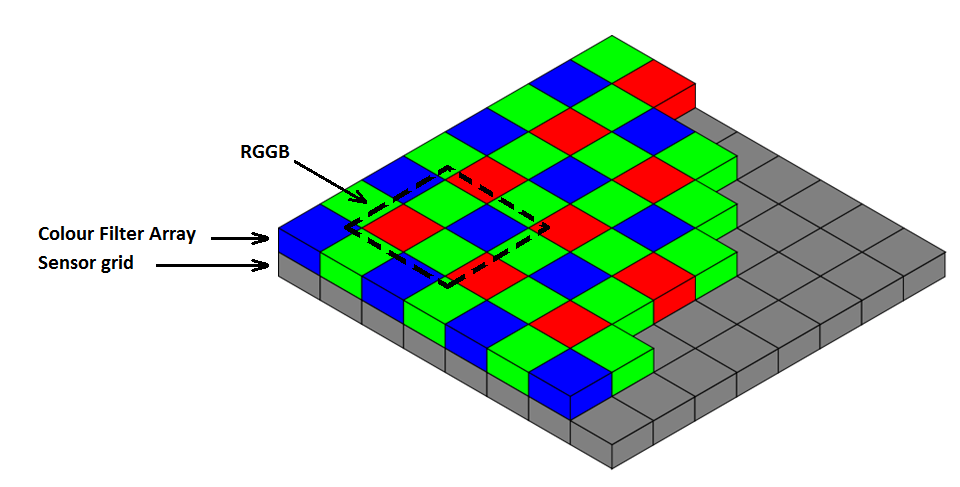
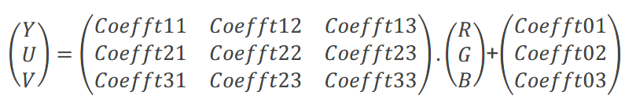
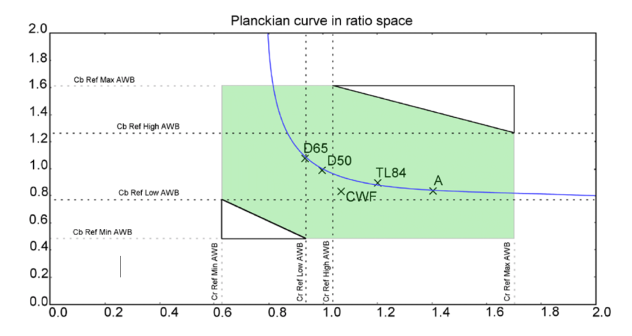
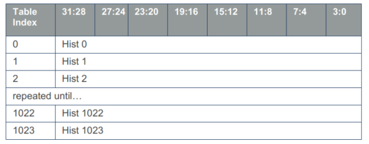
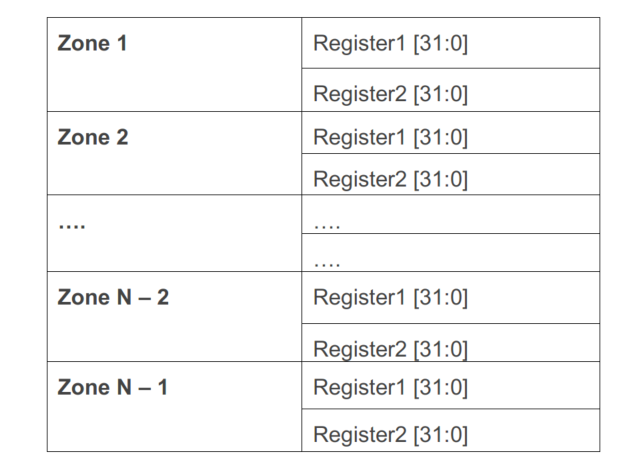
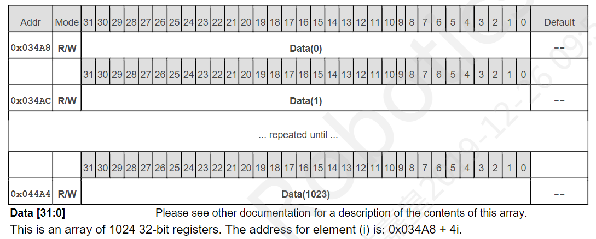
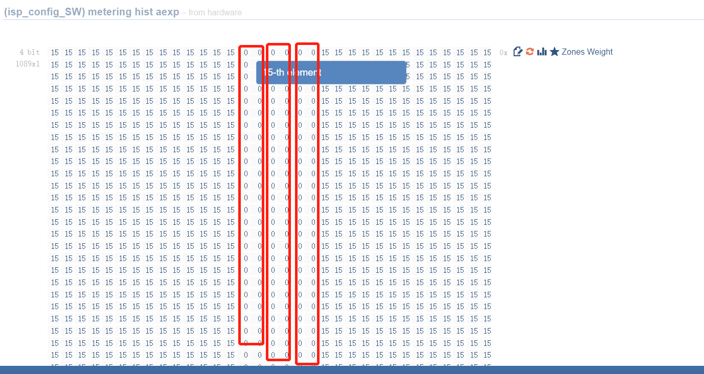

# 7.5 ISP图像系统

## 概述

### AE

AE算法通过分析直方图进行操作，以计算相对于校准中设置的AE target的新EV值。AE
target由算法动态控制，以确保正确曝光低动态范围场景和高动态范围场景。例如，在低动态范围场景中，AE
target将基于AE_LDR_Target（18％灰度目标）。对于高动态范围场景，该算法将动态修改AE
target，保证亮区不会过曝。本地色调映射引擎（Iridix）将确保阴影被显示并正确曝光。HDR目标值需要根据 Sensor的动态范围校准，Iridix引擎来还原低亮区域的内容 。

#### 重要概念

曝光时间：图像传感器内部积累电荷的时间，是pixel从开始曝光到电量被读出的这段时间，决定了sensor受光时间的长短，曝光时间可以以行长为单位。

曝光增益：对sensor 的输出电荷的总的放大系数，一般有数字增益和模拟增益，模拟增益引入的噪声会稍小，所以一般优先用模拟增益。

#### 基本原理

AE算法通过分析直方图统计并结合校准的AE目标值来得到新的EV（exposure value）值。为了兼顾低动态场景和高动态场景都能准确曝光，算法会动态的调整AE目标值。

### AWB

AWB模块负责实现色彩稳定，因为图像传感器对中性色调的响应取决于场景光照情况，不具有人眼的不同光照色温下的色彩恒定性，使得这些在白色和灰色等中性色调中最为明显。因此白平衡模块就需要将人眼看来白色的物体进行色彩的还原,使其在照片上也呈现为白色。AWB算法处理范围广泛的照明条件和光谱，以避免不良的偏色。

#### 重要概念

色温：具有一定表面温度的黑体(blackbody)的辐射光的光谱特性。

颜色恒常性：在照度条件发生变化时，人们对物体表面颜色的知觉趋于稳定的心理倾向。

#### 基本原理

白平衡各通道校正由AWB统计信息和算法基于静态校正结果完成的。该校正结果不会在帧数据
中更新，而是作为配置的一部分在下一帧更新。

### Demosaic

Demosaic单元负责从覆盖有颜色过滤器阵列（CFA）的图像传感器输出的（空间欠采样）颜色样本中重建出全彩色图像。此外，该模块提供了对图像的高级控制锐化。

数码相机传感器元件本身只能记录落在它们上面光线的强度，无法区分不同的颜色，因此仅产生灰度图像。要捕获颜色信息，必须在每个像素传感器上放置滤镜，它仅允许特定颜色的光通过。使用的滤镜必须能够重建——每个像素具有红色，绿色和蓝色（RGB）值的全彩色图像。这种彩色滤光片阵列最常见的类型称为“拜耳阵列”，之所以这么称呼，是因为滤镜安排每2x2像素组以RGGB方式排列。

所有像素的一半是绿色（G），四分之一是红色（R）和蓝色（B）。与蓝色同一行中的绿色单元格标记为Gb，与红色同一行中的绿色单元格标记为Gr。模式可以以R，Gr，Gb或B中的任何一个开头。

彩色滤光片的这种布置实质上导致了色彩信息空间欠采样，去马赛克单元负责从这种不完整色彩信息中重建全彩色图像（每个像素含R、G、B三色信息）。

该模块由许多滤波器组成，这些滤波器根据内插的亮度通道重建色度通道。它还考虑了信号相关的传感器噪声（基于较早确定的噪声轮廓），以保持边缘的清晰度和区域均匀的平滑度，同时插补缺失的像素分量。也因此，缺失像素分量的插值包含了传感器的噪声。内置的锐化最大程度地减少了高频噪声的放大。

### Sharpen

通常称之为后端锐化，此模块旨在与Demosaic模块的Sharpen协同作用。Demosaic模块的锐化是在RGB域控制锐化，用于达到要求分辨率，但过度锐化会导致伪像和看起来不自然的纹理。

暗区使用配置寄存器：luma thresh low 以及 luma slope low；

亮区使用配置寄存器：luma thresh high 以及 luma slope high。
下图显示了这四个参数对于sharpen效果的影响：

### Gamma

该模块对输出Gamma进行编码，通常设置为匹配BT.709或sRGB Gamma曲线。

此模块分别为三个（R，G，B）颜色通道中的每一个应用Gamma LUT。

在典型配置中，LUT具有129个均匀间隔的节点，标记为0…128，硬件在这些节点之间应用线性插值。

每个数据值都是16位无符号数，因此可以预计Gamma [0] = 0和Gamma [128] =
0xFFFF，其他127个值定义Gamma校正曲线。

注意：

自适应对比度增强由Iridix模块动态执行。应根据所需输出的Gamma特性对LUT进行静态修改。同时Gamma会影响 AE、 CCM、 Iridix模块，因此Gamma变动时需要重新验证这几个模块。

### Iridix

Iridix®使用本地色调映射进行动态范围压缩（DRC），尝试从HDR场景中可见性低的区域恢复细节，而又不影响全局图像。总体而言，通过增加相对于场景内容的增益，增加了可用于本地区域的色调范围。

### CNR

CNR模块通过对周边色度均值智能估计的方式进行α-混合来矫正YUV空间中每个pixel的颜色，从而降低图像中的色度噪声。在此过程中，该模块会保持图像的强度信息完整，仅处理其色度部分。

该模块内部按YUV域处理，会先将RGB图像转换为YUV域，并根据颜色部分进一步细分，分别处理U和V通道，然后再将YUV转换回RGB域。

> 注意：此YUV不会直接输出, CNR后面模块会把RGB转换成YUV输出到IPU或DDR

对U和V的处理是将高斯核应用于相应段的每个U和V通道，并通过相应的偏移或斜率参数进行配置。为了最大程度地减少硬件实现或减少大内核的行数，垂直高斯滤波被新兴的递归滤波器代替。

另外，为了进一步减小面积，在处理之前先对色彩通道进行下采样，然后在输出阶段进行上采样。输出的U通道和V通道分别是经过处理的U通道和V通道与原始U通道和V通道的混合，这些通道由增量偏移或斜率参数配置。然后将已处理的U和V以及未处理的Y转换回RGB域。

### CCM

大多数情况下，标准颜色无法提供最佳图像质量。根据应用程序或客户喜好，CCM模块可以对颜色进行校正和调整。该模块更改图像的色度值以匹配标准色彩空间的色度值。

通过捕获该模块对输入的{R，G，B}或{R，G，B，Ir}像素值应用线性颜色校正。计算系数矩阵如图所示：

In1、In2、In3和In4是输入（分别是R、G、B和Ir），A11到A34是可配置的矩阵系数。系数为s4.8数字格式的13位值，其中Msbit(12bits)为符号位。负值的MSbit(12bits)设置为1。

> 注意：如果CFA模式是RGGB，则Ir系数和Ir信道偏移必须设置为零。

### Sinter

Sinter®是一种先进的空间降噪模块，结合了一组算法来抑制传感器噪声，该滤波器作用于RAW数据域空间，在保持纹理和细节的同时，可有效降低图像中的人眼感知到的噪声，使得处理得到的图像更自然。

通过使用外部生成的sensor Noise Profile LUT可以简化该模块的使用。正确配置了LUT表之后，可通过较少的一组寄存器来控制模块。大多数情况下，仅需要修改Sinter的阈值以调整噪声滤波器的强度。

Sinter:Thresh Long和Sinter:Thresh Short寄存器分别对应于长曝光和短曝光，用于WDR模式。当曝光比例为1或WDR模式禁止时，Sinter:Thresh Long和Sinter:Thresh Short应该被设置为相同的值。阈值是在标准校正过程中使用以各种ISO值捕获的图像确定的，并通过系统增益进行调制。如果图像是使用frame-switching创建的，则应根据曝光比相应地设置这些值。

### Temper

该模块是运动自适应时间降噪滤波器。通过在当前帧中检测到的局部运动程度设置的递归级别来将当前帧与先前历史帧进行递归平均。滤波器工作在RAW域，并且需要两帧外部存储，数据位宽是视频位宽+4位。

>  注意：在WDR模式下，视频位宽会更大。

可以增加或减少Recursion_Limit来调整递归的深度，反过来会影响进行递归平均操作的有效帧数。增大此参数将导致较小的递归深度、较小的降噪效果以及最小的运动伪影。

当Recursion_Limit设置为 0 时，最多16帧可以被平均。

当Recursion_Limit设置为 0xf 时，不对帧进行平均，这等同于禁止Temper。

Temper的阈值用于调节Temper噪声滤波器的强度。该模块的性能由外部生成的sensor Noise
Profile LUT来保证。参考数据通过DMA存储在DDR中，有2个读DMA和2个写DMA管理参考数据的存储。

### Mesh Shading

由于镜头光学折射不均匀，导致画面出现中心亮四周暗的现象。网格着色校正为非线性着色失真提供了进一步的校正，并微调径向着色校正所产生的效果。

该模块使用最大64x 64区域的网格对图像应用网格着色校正。网格校正有3页（R/G/B）的校正表，4种不同模式：

设置 Mesh Alpha Mode = 0<br/>


设置 Mesh Alpha Mode = 1<br/>


设置 Mesh Alpha Mode = 2<br/>


设置 Mesh Alpha Mode = 3<br/>


### Radial Shading

与mesh shading相对应，径向阴影也是一种校正 Lens Shading 校正方法。利用透镜阴影的径向性质，可以校正偏心和椭圆形阴影效果。

径向着色系数存储在类型为32位的4x129条目LUT中，系数采用x.12格式，其中低12位为小数。对于每个颜色平面，从中心到外边缘存储系数。

### Color Space Conversion

此模块将输入的{R，G，B}像素值转换为{Y，U，V}值，并使用标准3x3矩阵乘法和向量偏移。如果转换未激活，则ISP输出RGB格式的像素。

如果需要，可以对参数进行修改，以提供不同的转换。以BT.709为例进行说明，公式如下所示：

则calibration中RGB2YUV_CONVERSION中对应的参数如公式所示：

其中，若Coefft11 (Coefft12, Coefft13, Coefft21, Coefft22, Coefft23, Coefft31,
Coefft32, Coefft33)
参数为正，clibration中参数为Coefft11\*256取整；若该参数为负，则calibraiton中参数为(\|Coefft11\*256\|+1\<\<15)取整。calibration
中参数为Coefft01(Coefft02, Coefft01)\*1024取整。

### 统计信息

3A统计信息包含AWB，AE和AF。

AWB模块收集的统计信息用来给软件做白平衡，它累积区域级R/G和B/G统计信息，也收集全帧统计信息。

AE自动曝光统计信息用于调整传感器曝光，这是通过收集5-bin、1024-bin直方图完成的。

AF模块计算图像中的统计清晰度值。软件使用此值/统计信息来调整镜头，使其在感兴趣区域（ROI）上具有最佳聚焦。该模块计算区域和整个图像的边缘值。

ISP为各统计模块提供可编程的标记点。

#### AWB统计信息

AWB有全局和区域统计信息。

全局统计信息：整幅图像的R/G和B/G均值及有效统计点个数。

区域统计信息：最大支持图像的33x33分块，每个分块输出R/G，B/G的均值以及有效统计点个数。

AWB_stats_mode寄存器可用来配置均值的类别：R/G，B/G还是G/R，G/B。

通过寄存器配置，可限定有效像素：

Cb_Ref_Min/Max，Cr_Ref_Min/Max这4个值限定了R/G，B/G的最大值和最小值。

另外，可通过Cb_Ref_Low/High，Cr_Ref_Low/High来限定更小的R/G，B/G范围。



全局统计信息：由三个寄存器AWB RG，AWB BG，SUM来存储；

区域统计信息：

#### AE统计信息

在应用黑电平、白平衡和ISP增益之后收集自动曝光（AE）统计信息。包含两种直方图类型：

5-bin局部和全局直方图；

1024-bin全局直方图；

#### 5-bin直方图

使用可调整的直方图bin边界，为每个区域和整个图像生成5-bin标准化直方图。Statistics_Hist_Thresh[i][j]用来定义i
bin，j bin间的强度阈值。

Statistics_Hist[i] 提供i bin的全局归一化像素数，总和归一化为0xFFFF。

不提供中间bin的直方图，但可通过软件来计算得到：

包含Histx数据的内部表提供了每个区域的直方图的归一化值，如下表中mxn区域所示。区域的顺序是从图像的左上角开始的栅格顺序。对于每个区域，直方图数据的总和被标准化为0xFFFF。

最多支持


33x33分块。

#### 1024-bin直方图

为整个图像构建全局1024-bin直方图。全局直方图可设置区域权重，但未标准化，ISP
Firmware会执行统计数据的标准化。

#### AF统计信息

自动对焦统计信息由感兴趣区域（ROI）或区域的、标准化的全图像多方向对比度指标组成。CPU使用此对比度度量来确定镜头的位置，以实现最佳聚焦。

AF 统计模块的清晰度评价函数计算像素点四个方向的对比度，计算示意如下图所示，

需要注意的是，AF统计模块不支持修改清晰度评价函数的系数。用户可修改kernel改变清晰度计算的像素点位置来适配不同的场景。AF统计模块不同kernel下清晰度计算方式如下图所示。

对于AF模块，可以通过软件配置区域。模块为每个像素计算区域对比度度量，并在整个区域内进行累积。对于每个像素，沿4个方向计算对比度。除此之外，还可以使用内核选择配置参数来控制对角线的角度方向，如上表所示。为了改善在弱光和低通成像情况下的响应，所计算的对比度为四级（四次对比度总和）。

这些区域度量标准不会在硬件中加权，但是软件可以在计算后应用基于区域的权重。

下图表明当AF对比度指标达到最高点时可以实现最佳对焦：

#### AF度量数据计算

区域累积对比度度量标准以16b尾数和5b指数的浮点格式存储。除了对比度指标外，我们还在该区域上累积平方图像和四次图像数据，如下图所示I2值是指图1所示四个方向像素的差值的平方和，I4是图1四个方向像素差的四次方和，E4是4个kernel下像素差四次方和累加，如图2，16b Mantissa存的是底数，5b Exponent存的是指数，Register1和Register2合起来64bit使用，用户不需要自己直接去计算，可以直接使用HB_ISP_GetMeteringData拿到cv值。

每个区域累积的统计信息如下表所示：

AF区域数据以如下形式存储：

除了区域统计，AF还累积归一化的四次边沿和，它存储在一个32位寄存器中。

#### Auto Level统计信息

iridix模块提供的1024bin统计数据。


#### 平均亮度和平均亮度方差统计信息

ISP提供YUV域的区域亮度平均值的统计信息和区域亮度平均值的方差。该模块始终使用32x16的固定区域大小（水平x垂直），此统计模块提供可用结果所需的最小帧分辨率为512x256。这些统计信息存储在512个位置的SRAM中，每个位置包含每个区域的10位（LSB）平均值信息和12位（MSB）亮度平均值信息的方差。其存储方法为10bits
reserved + 12bits亮度方差 + 10bits 亮度平均值。

## 功能描述

### 交互数据

#### 算法库与ISP Firmware交互框图

MEM中的内容有两部分，一是提供给算法库的数据，二是算法库给ISP Driver传入的值，ISP
Driver中如AWB收到算法配置的值会更新到ISP寄存器空间；

-   这是一个上下文（对应一路sensor）的情况，多个sensor多套数据结构；

-   黄颜色块是可替换部分，Algo
    Lib需要几个回调接口，见“API参考”一节；另外需要一些输入输出的数据，见“数据结构”一节；

-   Sensor Driver包含了常用的sensor增益、曝光配置方法，一般情况不需要修改；

#### 算法库与ISP Firmware交互数据

| **Module** | **ISP Fw -\> 算法库**                             | **算法库 -\> ISP Fw**  |
|------------|---------------------------------------------------|------------------------|
| **AE**     | stats_data[ISP_FULL_HISTOGRAM_SIZE]               | ae_exposure            |
|            | histogram_sum                                     | ae_exposure_ratio      |
|            | hist4[33 \* 33]                                   | frame_id               |
| **AWB**    | stats_data[MAX_AWB_ZONES]                         | awb_red_gain           |
|            | curr_AWB_ZONES                                    | awb_green_even_gain    |
|            |                                                   | awb_green_odd_gain     |
|            |                                                   | awb_blue_gain          |
|            |                                                   | temperature_detected   |
|            |                                                   | p_high                 |
|            |                                                   | light_source_candidate |
|            |                                                   | awb_warming[3]         |
|            |                                                   | mix_light_contrast     |
|            |                                                   | frame_id               |
| **AF**     | stats_data[AF_ZONES_COUNT_MAX][2]                 | frame_to_skip          |
|            | zones_horiz                                       | af_position            |
|            | zones_vert                                        | af_last_sharp          |
|            | frame_num                                         |                        |
|            | skip_cur_frame                                    |                        |
|            | zoom_step_info                                    |                        |
| **Gamma**  | stats_data[ISP_FULL_HISTOGRAM_SIZE]               | gamma_gain             |
|            | fullhist_sum                                      | gamma_offset           |
|            |                                                   | frame_id               |
| **Iridix** | N/A（using AE statistics data from AE algorithm） | strength_target        |
|            |                                                   | iridix_dark_enh        |
|            |                                                   | iridix_global_DG       |
|            |                                                   | iridix_contrast        |
|            |                                                   | frame_id               |

### 开发说明

ISP
Firmware有两部分，分用户空间和内核空间。内核空间Firmware随系统启动而初始化，用户空间Firmware（内含默认3A算法）由HB_VIN_StartPipe接口启动，Firmware启动过程中会优先选择外部3A算法，如果未注册外部3A算法，那么启动默认3A算法。每一类算法都会有对应的两个输入参数——统计数据（stats）、输入参数（input），和一个输出参数——输出参数（output）。在每帧统计数据Ready后ISP
Firmware会调用proc_func回调，并传入两个输入参数，proc_func是实际的算法实现，算法计算后要填充好输出参数，ISP
Firmware会把输出参数应用到Sensor或ISP硬件。

#### AE算法注册

AE向ISP Firmware注册回调函数：

| From  | 用户需要实现 | To           |
|-------|--------------|--------------|
| AELIB | init_func    | ISP Firmware |
|       | proc_func    |              |
|       | deinit_func  |              |

接口说明：

| 回调函数    | 说明                                                                                                                                                         |
|-------------|--------------------------------------------------------------------------------------------------------------------------------------------------------------|
| init_func   | 算法初始化函数                                                                                                                                               |
| proc_func   | 实际算法实现，如target、exposure计算。ISP Firmware在每帧AE统计数据Ready时会调用该函数。proc_func传入参数和需要传出的参数见[结构体描述](#_1_HB_ISP_AE_FUNC_S) |
| deinit_func | 算法去初始化函数                                                                                                                                             |

#### AWB算法注册

AWB向ISP Firmware注册回调函数：

| From   | 用户需要实现 | To           |
|--------|--------------|--------------|
| AWBLIB | init_func    | ISP Firmware |
|        | proc_func    |              |
|        | deinit_func  |              |

接口说明：

| 回调函数    | 说明                                                                                                                                    |
|-------------|-----------------------------------------------------------------------------------------------------------------------------------------|
| init_func   | 算法初始化函数                                                                                                                          |
| proc_func   | 实际算法实现， ISP Firmware在每帧AWB统计数据Ready时会调用该函数。proc_func传入参数和需要传出的参数见[结构体描述](#_2_HB_ISP_AWB_FUNC_S) |
| deinit_func | 算法去初始化函数                                                                                                                        |

#### AF算法注册

AF向ISP Firmware注册回调函数：

| From  | 用户需要实现 | To           |
|-------|--------------|--------------|
| AFLIB | init_func    | ISP Firmware |
|       | proc_func    |              |
|       | deinit_func  |              |

接口说明：

| 回调函数    | 说明                                                                                                                                  |
|-------------|---------------------------------------------------------------------------------------------------------------------------------------|
| init_func   | 算法初始化函数                                                                                                                        |
| proc_func   | 实际算法实现， ISP Firmware在每帧AF统计数据Ready时会调用该函数。proc_func传入参数和需要传出的参数见[结构体描述](#_2_HB_ISP_AF_FUNC_S) |
| deinit_func | 算法去初始化函数                                                                                                                      |

#### 算法注册举例

以AWB算法为例：

```c
ISP_AWB_FUNC_S stAwbFunc = {

        .init_func = awb_init_func,

        .proc_func = awb_proc_func,

        .deinit_func = awb_deinit_func,

};

HB_ISP_AWBLibRegCallback(0, "libawb.so", &stAwbFunc);

void *awb_init_func(uint32_t ctx_id)

{

        pr_info("ctx id is %d", ctx_id);

        return NULL;

}

int32_t awb_proc_func(void *awb_ctx, awb_stats_data_t *stats, awb_input_data_t *input, awb_output_data_t *output)

{
        awb_acamera_core_obj_t *p_awb_core_obj = (awb_acamera_core_obj_t *)awb_ctx;

        awb_acamera_input_t *p_acamera_input = (awb_acamera_input_t *)input->acamera_input;

        awb_calibration_data_t *p_cali_data = &( p_acamera_input->cali_data );

        awb_acamera_output_t *p_acamera_output = (awb_acamera_output_t *)output->acamera_output;

        //具体算法实现，传入input、统计数据进行计算

        awb_calc_avg_weighted_gr_gb_mesh( p_awb_core_obj, stats, input );

        awb_detect_light_source( p_awb_core_obj );

        awb_calculate_warming_effect( p_awb_core_obj, p_cali_data );

        //计算结果赋值给输出参数

        p_acamera_output->rg_coef = p_awb_core_obj->rg_coef;

        p_acamera_output->bg_coef = p_awb_core_obj->bg_coef;

        p_acamera_output->temperature_detected = p_awb_core_obj->temperature_detected;

        p_acamera_output->p_high = p_awb_core_obj->p_high;

        p_acamera_output->light_source_candidate = p_awb_core_obj->light_source_candidate;

        memcpy( p_acamera_output->awb_warming, p_awb_core_obj->awb_warming, sizeof( p_acamera_output->awb_warming ) );

        p_acamera_output->awb_converged = p_awb_core_obj->awb_converged;

        return 0;

}

int32_t awb_deinit_func(void *awb_ctx)

{

        pr_info("done");

        return 0;

}
```

## API参考

### HB_ISP_SetFWState/HB_ISP_GetFWState

【函数声明】
```c
int HB_ISP_SetFWState(uint8_t pipeId, const ISP_FW_STATE_E enState);

int HB_ISP_GetFWState(uint8_t pipeId, ISP_FW_STATE_E *penState);
```
【功能描述】

设置/获取ISP Firmware的状态。

【参数描述】

| 参数名称 | 描述             | 输入/输出 |
|----------|------------------|-----------|
| pipeId   | Pipeline索引号   | 输入      |
| penState | ISP Firmware状态 | 输入      |

【返回值】

| 返回值 | 描述 |
|--------|------|
| 0      | 成功 |
| 非0    | 失败 |

【注意事项】

【参考代码】

### HB_ISP_SetRegister/HB_ISP_GetRegister

【函数声明】
```c
int HB_ISP_SetRegister(uint8_t pipeId, uint32_t u32Addr, uint32_t u32Value);

int HB_ISP_GetRegister(uint8_t pipeId, uint32_t u32Addr, uint32_t *pu32Value);
```
【功能描述】

设置/获取ISP寄存器。

【参数描述】

| 参数名称 | 描述           | 输入/输出 |
|----------|----------------|-----------|
| pipeId   | Pipeline索引号 | 输入      |
| u32Addr  | ISP寄存器地址  | 输入      |
| u32Value | 要设置的值     | 输入      |

【返回值】

| 返回值 | 描述 |
|--------|------|
| 0      | 成功 |
| 非0    | 失败 |

【注意事项】

【参考代码】

### HB_ISP_SetModuleControl/ HB_ISP_GetModuleControl

【函数声明】
```c
int HB_ISP_SetModuleControl(uint8_t pipeId, const ISP_MODULE_CTRL_U *punModCtrl);

int HB_ISP_GetModuleControl(uint8_t pipeId, ISP_MODULE_CTRL_U *punModCtrl);
```
【功能描述】

设置/获取ISP内部各模块的bypass情况。

【参数描述】

| 参数名称   | 描述                     | 输入/输出 |
|------------|--------------------------|-----------|
| pipeId     | Pipeline索引号           | 输入      |
| punModCtrl | ISP 内部各模块bypass控制 | 输入      |

【返回值】

| 返回值 | 描述 |
|--------|------|
| 0      | 成功 |
| 非0    | 失败 |

【注意事项】

【参考代码】

### HB_ISP_SwitchScence

【函数声明】
```c
int HB_ISP_SwitchScence(uint8_t pipeId, const char *cname);
```
【功能描述】

设置calibration库。

【参数描述】

| 参数名称 | 描述                | 输入/输出 |
|----------|---------------------|-----------|
| pipeId   | Pipeline索引号      | 输入      |
| cname    | Calibration库的路径 | 输入      |

【返回值】

| 返回值 | 描述 |
|--------|------|
| 0      | 成功 |
| 非0    | 失败 |

【注意事项】

【参考代码】

### HB_ISP_StartI2CBus/HB_ISP_StopI2CBus

【函数声明】
```c
int HB_ISP_StartI2CBus(uint8_t pipeId);

void HB_ISP_StopI2CBus(uint8_t pipeId);
```
【功能描述】

启动、停止写I2C线程。

【参数描述】

| 参数名称 | 描述           | 输入/输出 |
|----------|----------------|-----------|
| pipeId   | Pipeline索引号 | 输入      |

【返回值】

| 返回值 | 描述 |
|--------|------|
| 0      | 成功 |
| 非0    | 失败 |

【注意事项】StartI2Cbus前需要HB_ISP_GetSetInit初始化和sensor初始化。

【参考代码】

### HB_ISP_SendI2CData

【函数声明】
```c
int HB_ISP_SendI2CData(ISP_I2C_DATA_S data);
```
【功能描述】

写I2C数据。

【参数描述】

| 参数名称 | 描述             | 输入/输出 |
|----------|------------------|-----------|
| data     | 要发送的data信息 | 输入      |

【返回值】

| 返回值 | 描述 |
|--------|------|
| 0      | 成功 |
| 非0    | 失败 |

【注意事项】

在使用前要调用HB_ISP_StartI2CBus接口启动写I2C线程。

【参考代码】

### HB_ISP_AELibRegCallback

【函数声明】
```c
int HB_ISP_AELibRegCallback(uint8_t pipeId, char *name,
ISP_AE_FUNC_S *pstAeFunc);
```
【功能描述】

注册AE算法库。

【参数描述】

| 参数名称  | 描述                       | 输入/输出           |
|-----------|----------------------------|---------------------|
| pipeId    | Pipeline索引号             | 输入                |
| name      | 库名字，固定拷贝20字符长度 | 输入 预留项，可缺省 |
| pstAeFunc | AE算法回调函数指针         | 输入                |

【返回值】

| 返回值 | 描述 |
|--------|------|
| 0      | 成功 |
| 非0    | 失败 |

【注意事项】

HB_VIN_StartPipe会启动ISP算法，需要在调用HB_VIN_StartPipe函数前进行算法注册。

【参考代码】见[算法注册举例](#_算法注册举例)

### HB_ISP_AWBLibRegCallback

【函数声明】
```c
int HB_ISP_AWBLibRegCallback(uint8_t pipeId, char *name,
ISP_AWB_FUNC_S *pstAWBFunc);
```
【功能描述】

注册AWB算法库。

【参数描述】

| 参数名称   | 描述                       | 输入/输出           |
|------------|----------------------------|---------------------|
| pipeId     | Pipeline索引号             | 输入                |
| name       | 库名字，固定拷贝20字符长度 | 输入 预留项，可缺省 |
| pstAWBFunc | AWB算法回调函数指针        | 输入                |

【返回值】

| 返回值 | 描述 |
|--------|------|
| 0      | 成功 |
| 非0    | 失败 |

【注意事项】

HB_VIN_StartPipe会启动ISP算法，需要在调用HB_VIN_StartPipe函数前进行算法注册。

【参考代码】见[算法注册举例](#_算法注册举例)

### HB_ISP_AFLibRegCallback

【函数声明】
```c
int HB_ISP_AFLibRegCallback(uint8_t pipeId, char *name,
ISP_AF_FUNC_S *pstAFFunc);
```
【功能描述】

注册AF算法库。

【参数描述】

| 参数名称  | 描述                       | 输入/输出           |
|-----------|----------------------------|---------------------|
| pipeId    | Pipeline索引号             | 输入                |
| name      | 库名字，固定拷贝20字符长度 | 输入 预留项，可缺省 |
| pstAFFunc | AF算法回调函数指针         | 输入                |

【返回值】

| 返回值 | 描述 |
|--------|------|
| 0      | 成功 |
| 非0    | 失败 |

【注意事项】

HB_VIN_StartPipe会启动ISP算法，需要在调用HB_VIN_StartPipe函数前进行算法注册。

【参考代码】见[算法注册举例](#_算法注册举例)

### HB_ISP_AELibUnRegCallback

【函数声明】
```c
int HB_ISP_AELibUnRegCallback(uint8_t pipeId);
```
【功能描述】

去注册AE算法库。

【参数描述】

| 参数名称 | 描述           | 输入/输出 |
|----------|----------------|-----------|
| pipeId   | Pipeline索引号 | 输入      |

【返回值】

| 返回值 | 描述 |
|--------|------|
| 0      | 成功 |
| 非0    | 失败 |

【注意事项】

【参考代码】

### HB_ISP_AWBLibUnRegCallback

【函数声明】
```c
int HB_ISP_AWBLibUnRegCallback(uint8_t pipeId);
```
【功能描述】

去注册AWB算法库。

【参数描述】

| 参数名称 | 描述           | 输入/输出 |
|----------|----------------|-----------|
| pipeId   | Pipeline索引号 | 输入      |

【返回值】

| 返回值 | 描述 |
|--------|------|
| 0      | 成功 |
| 非0    | 失败 |

【注意事项】

【参考代码】

### HB_ISP_AFLibUnRegCallback

【函数声明】
```c
int HB_ISP_AFLibUnRegCallback(uint8_t pipeId);
```
【功能描述】

去注册AF算法库。

【参数描述】

| 参数名称 | 描述           | 输入/输出 |
|----------|----------------|-----------|
| pipeId   | Pipeline索引号 | 输入      |

【返回值】

| 返回值 | 描述 |
|--------|------|
| 0      | 成功 |
| 非0    | 失败 |

【注意事项】

【参考代码】

注意：

1.  如果使用默认3A算法，不需要关注该章节的接口。

2.  不含Zoom和光圈控制算法，用户可自己实现，给出输出参数，以修改ISP
    Firmware做适配。

### HB_ISP_GetSetInit/HB_ISP_GetSetExit

【函数声明】
```c
int HB_ISP_GetSetInit(void);

int HB_ISP_GetSetExit(void);
```
【功能描述】

获取/设置参数前的初始化。

【参数描述】无

【返回值】

| 返回值 | 描述 |
|--------|------|
| 0      | 成功 |
| 非0    | 失败 |

【注意事项】

同一个进程里调用一次即可，在调用所有Get/Set类接口前，首先要调用HB_ISP_GetSetInit进行初始化。

【参考代码】

### HB_ISP_SetAeAttr/HB_ISP_GetAeAttr

【函数声明】
```c
int HB_ISP_SetAeAttr(uint8_t pipeId, const ISP_AE_ATTR_S *pstAeAttr);

int HB_ISP_GetAeAttr(uint8_t pipeId, ISP_AE_ATTR_S *pstAeAttr);
```
【功能描述】

设置AE算法属性。

【参数描述】

| 参数名称  | 描述             | 输入/输出 |
|-----------|------------------|-----------|
| pipeId    | Pipeline索引号   | 输入      |
| pstAeAttr | 指向AE参数的指针 | 输入      |

【返回值】

| 返回值 | 描述 |
|--------|------|
| 0      | 成功 |
| 非0    | 失败 |

【注意事项】

set只针对manual模式，get时传不同模式获取对应模式的值。

【参考代码】

### HB_ISP_SetAfAttr/HB_ISP_GetAfAttr

【函数声明】
```c
int HB_ISP_SetAfAttr(uint8_t pipeId, ISP_AF_ATTR_S *pstAfAttr);

int HB_ISP_GetAfAttr(uint8_t pipeId, ISP_AF_ATTR_S *pstAfAttr);
```
【功能描述】

设置AF-ZOOM属性。

【参数描述】

| 参数名称  | 描述             | 输入/输出 |
|-----------|------------------|-----------|
| pipeId    | Pipeline索引号   | 输入      |
| pstAfAttr | 指向AF参数的指针 | 输入      |

【返回值】

| 返回值 | 描述 |
|--------|------|
| 0      | 成功 |
| 非0    | 失败 |

【注意事项】

【参考代码】

### HB_ISP_SetAwbAttr/HB_ISP_GetAwbAttr

【函数声明】
```c
int HB_ISP_SetAwbAttr(uint8_t pipeId, const
ISP_AWB_ATTR_S *pstAwbAttr);

int HB_ISP_GetAwbAttr(uint8_t pipeId, ISP_AWB_ATTR_S *pstAwbAttr);
```
【功能描述】

设置AWB算法属性。

【参数描述】

| 参数名称   | 描述              | 输入/输出 |
|------------|-------------------|-----------|
| pipeId     | Pipeline索引号    | 输入      |
| pstAwbAttr | 指向AWB参数的指针 | 输入      |

【返回值】

| 返回值 | 描述 |
|--------|------|
| 0      | 成功 |
| 非0    | 失败 |

【注意事项】

set只针对manual模式，get时传不同模式获取对应模式的值。

【参考代码】

### HB_ISP_SetBlackLevelAttr/HB_ISP_GetBlackLevelAttr

【函数声明】
```c
int HB_ISP_SetBlackLevelAttr(uint8_t pipeId, const
ISP_BLACK_LEVEL_ATTR_S *pstBlackLevelAttr);

int HB_ISP_GetBlackLevelAttr(uint8_t pipeId,
ISP_BLACK_LEVEL_ATTR_S *pstBlackLevelAttr);
```
【功能描述】

设置黑电平属性。

【参数描述】

| 参数名称          | 描述                 | 输入/输出 |
|-------------------|----------------------|-----------|
| pipeId            | Pipeline索引号       | 输入      |
| pstBlackLevelAttr | 指向黑电平参数的指针 | 输入      |

【返回值】

| 返回值 | 描述 |
|--------|------|
| 0      | 成功 |
| 非0    | 失败 |

【注意事项】

set只针对manual模式，get时传不同模式获取对应模式的值。

auto模式下，black_level
值为calibraiton参数BLACK_LEVEL_B/BLACK_LEVEL_GB/BLACK_LEVEL_GR/BLACK_LEVEL_R根据当前曝光gain插值得到。

manual模式下，用户可设置black_level 值。

【参考代码】

### HB_ISP_SetDemosaicAttr/HB_ISP_GetDemosaicAttr

【函数声明】
```c
int HB_ISP_SetDemosaicAttr(uint8_t pipeId, const
ISP_DEMOSAIC_ATTR_S *pstDemosaicAttr);

int HB_ISP_GetDemosaicAttr(uint8_t pipeId,
ISP_DEMOSAIC_ATTR_S *pstDemosaicAttr);
```
【功能描述】

设置解马赛克模块属性。

【参数描述】

| 参数名称        | 描述                   | 输入/输出 |
|-----------------|------------------------|-----------|
| pipeId          | Pipeline索引号         | 输入      |
| pstDemosaicAttr | 指向解马赛克参数的指针 | 输入      |

【返回值】

| 返回值 | 描述 |
|--------|------|
| 0      | 成功 |
| 非0    | 失败 |

【注意事项】

【参考代码】

### HB_ISP_SetSharpenAttr/HB_ISP_GetSharpenAttr

【函数声明】
```c
int HB_ISP_SetSharpenAttr(uint8_t pipeId, const
ISP_SHARPEN_ATTR_S *pstSharpenAttr);

int HB_ISP_GetSharpenAttr(uint8_t pipeId,
ISP_SHARPEN_ATTR_S *pstSharpenAttr);
```
【功能描述】

设置锐化属性。

【参数描述】

| 参数名称       | 描述               | 输入/输出 |
|----------------|--------------------|-----------|
| pipeId         | Pipeline索引号     | 输入      |
| pstSharpenAttr | 指向锐化参数的指针 | 输入      |

【返回值】

| 返回值 | 描述 |
|--------|------|
| 0      | 成功 |
| 非0    | 失败 |

【注意事项】

【参考代码】

### HB_ISP_SetGammaAttr/HB_ISP_GetGammaAttr

【函数声明】
```c
int HB_ISP_SetGammaAttr(uint8_t pipeId, const
ISP_GAMMA_ATTR_S *pstGammaAttr);

int HB_ISP_GetGammaAttr(uint8_t pipeId,
ISP_GAMMA_ATTR_S *pstGammaAttr);
```
【功能描述】

设置Gamma属性。

【参数描述】

| 参数名称     | 描述                | 输入/输出 |
|--------------|---------------------|-----------|
| pipeId       | Pipeline索引号      | 输入      |
| pstGammaAttr | 指向Gamma参数的指针 | 输入      |

【返回值】

| 返回值 | 描述 |
|--------|------|
| 0      | 成功 |
| 非0    | 失败 |

【注意事项】

【参考代码】

### HB_ISP_SetIridixAttr/HB_ISP_GetIridixAttr

【函数声明】
```c
int HB_ISP_SetIridixAttr(uint8_t pipeId, const ISP_IRIDIX_ATTR_S *pstIridixAttr);

int HB_ISP_GetIridixAttr(uint8_t pipeId,
ISP_IRIDIX_ATTR_S *pstIridixAttr);
```
【功能描述】

设置Iridix模块属性。

【参数描述】

| 参数名称      | 描述                 | 输入/输出 |
|---------------|----------------------|-----------|
| pipeId        | Pipeline索引号       | 输入      |
| pstIridixAttr | 指向Iridix参数的指针 | 输入      |

【返回值】

| 返回值 | 描述 |
|--------|------|
| 0      | 成功 |
| 非0    | 失败 |

【注意事项】

【参考代码】

### HB_ISP_SetIridixStrengthLevel/HB_ISP_GetIridixStrengthLevel

【函数声明】
```c
int HB_ISP_SetIridixStrengthLevel(uint8_t pipeId, uint16_t level);

int HB_ISP_GetIridixStrengthLevel(uint8_t pipeId, uint16_t *level);
```
【功能描述】

设置Iridix强度等级。

【参数描述】

| 参数名称 | 描述                    | 输入/输出 |
|----------|-------------------------|-----------|
| pipeId   | Pipeline索引号          | 输入      |
| level    | 强度等级，范围 [0, 255] | 输入      |

【返回值】

| 返回值 | 描述 |
|--------|------|
| 0      | 成功 |
| 非0    | 失败 |

【注意事项】

【参考代码】

### HB_ISP_SetCnrAttr/HB_ISP_GetCnrAttr

【函数声明】
```c
int HB_ISP_SetCnrAttr(uint8_t pipeId, const ISP_CNR_ATTR_S *pstCnrAttr);

int HB_ISP_GetCnrAttr(uint8_t pipeId, ISP_CNR_ATTR_S *pstCnrAttr);
```
【功能描述】

设置色度降噪模块属性。

【参数描述】

| 参数名称   | 描述                   | 输入/输出 |
|------------|------------------------|-----------|
| pipeId     | Pipeline索引号         | 输入      |
| pstCnrAttr | 指向色度降噪参数的指针 | 输入      |

【返回值】

| 返回值 | 描述 |
|--------|------|
| 0      | 成功 |
| 非0    | 失败 |

【注意事项】

【参考代码】

### HB_ISP_SetSinterAttr/HB_ISP_GetSinterAttr

【函数声明】
```c
int HB_ISP_SetSinterAttr(uint8_t pipeId, const ISP_SINTER_ATTR_S *pstSinterAttr);

int HB_ISP_GetSinterAttr(uint8_t pipeId,
ISP_SINTER_ATTR_S *pstSinterAttr);
```
【功能描述】

设置空域降噪模块属性。

【参数描述】

| 参数名称      | 描述                   | 输入/输出 |
|---------------|------------------------|-----------|
| pipeId        | Pipeline索引号         | 输入      |
| pstSinterAttr | 指向空域降噪参数的指针 | 输入      |

【返回值】

| 返回值 | 描述 |
|--------|------|
| 0      | 成功 |
| 非0    | 失败 |

【注意事项】

【参考代码】

### HB_ISP_SetTemperAttr/HB_ISP_GetTemperAttr

【函数声明】
```c
int HB_ISP_SetTemperAttr(uint8_t pipeId, const
ISP_TEMPER_ATTR_S *pstTemperAttr);

int HB_ISP_GetTemperAttr(uint8_t pipeId,
ISP_TEMPER_ATTR_S *pstTemperAttr);
```
【功能描述】

设置时域降噪模块属性。

【参数描述】

| 参数名称      | 描述                   | 输入/输出 |
|---------------|------------------------|-----------|
| pipeId        | Pipeline索引号         | 输入      |
| pstTemperAttr | 指向时域降噪参数的指针 | 输入      |

【返回值】

| 返回值 | 描述 |
|--------|------|
| 0      | 成功 |
| 非0    | 失败 |

【注意事项】

【参考代码】

### HB_ISP_SetMeshShadingAttr/HB_ISP_GetMeshShadingAttr

【函数声明】
```c
int HB_ISP_SetMeshShadingAttr(uint8_t pipeId, const
MESH_SHADING_ATTR_S *pstMeshShadingAttr);

int HB_ISP_GetMeshShadingAttr(uint8_t pipeId,
MESH_SHADING_ATTR_S *pstMeshShadingAttr);
```
【功能描述】

设置Mesh Shading模块属性。

【参数描述】

| 参数名称           | 描述                      | 输入/输出 |
|--------------------|---------------------------|-----------|
| pipeId             | Pipeline索引号            | 输入      |
| pstMeshShadingAttr | 指向MeshShading参数的指针 | 输入      |

【返回值】

| 返回值 | 描述 |
|--------|------|
| 0      | 成功 |
| 非0    | 失败 |

【注意事项】

【参考代码】

### HB_ISP_SetMeshShadingLUT/HB_ISP_GetMeshShadingLUT

【函数声明】
```c
int HB_ISP_SetMeshShadingLUT(uint8_t pipeId, const
MESH_SHADING_LUT_S *pstMeshShadingLUT);

int HB_ISP_GetMeshShadingLUT(uint8_t pipeId, MESH_SHADING_LUT_S *pstMeshShadingLUT);
```
【功能描述】

设置Mesh Shading模块LUT表。

【参数描述】

| 参数名称          | 描述                        | 输入/输出 |
|-------------------|-----------------------------|-----------|
| pipeId            | Pipeline索引号              | 输入      |
| pstMeshShadingLUT | 指向MeshShading LUT表的指针 | 输入      |

【返回值】

| 返回值 | 描述 |
|--------|------|
| 0      | 成功 |
| 非0    | 失败 |

【注意事项】

【参考代码】

### HB_ISP_SetRadialShadingAttr/HB_ISP_GetRadialShadingAttr

【函数声明】
```c
int HB_ISP_SetRadialShadingAttr(uint8_t pipeId, const
RADIAL_SHADING_ATTR_S *pstRadialShadingAttr);

int HB_ISP_GetRadialShadingAttr(uint8_t pipeId,
RADIAL_SHADING_ATTR_S *pstRadialShadingAttr);
```
【功能描述】

设置Radial Shading模块属性。

【参数描述】

| 参数名称             | 描述                         | 输入/输出 |
|----------------------|------------------------------|-----------|
| pipeId               | Pipeline索引号               | 输入      |
| pstRadialShadingAttr | 指向Radial Shading参数的指针 | 输入      |

【返回值】

| 返回值 | 描述 |
|--------|------|
| 0      | 成功 |
| 非0    | 失败 |

【注意事项】

【参考代码】

### HB_ISP_SetRadialShadingLUT/HB_ISP_GetRadialShadingLUT

【函数声明】
```c
int HB_ISP_SetRadialShadingLUT(uint8_t pipeId, const
RADIAL_SHADING_LUT_S *pstRadialShadingLUT);

int HB_ISP_GetRadialShadingLUT(uint8_t pipeId,
RADIAL_SHADING_LUT_S *pstRadialShadingLUT);
```
【功能描述】

设置Radial Shading模块LUT表。

【参数描述】

| 参数名称            | 描述                           | 输入/输出 |
|---------------------|--------------------------------|-----------|
| pipeId              | Pipeline索引号                 | 输入      |
| pstRadialShadingLUT | 指向Radial Shading LUT表的指针 | 输入      |

【返回值】

| 返回值 | 描述 |
|--------|------|
| 0      | 成功 |
| 非0    | 失败 |

【注意事项】

【参考代码】

### HB_ISP_SetCSCAttr/HB_ISP_GetCSCAttr

【函数声明】
```c
int HB_ISP_SetCSCAttr(uint8_t pipeId, const
ISP_CSC_ATTR_S *pstCSCAttr);

int HB_ISP_GetCSCAttr(uint8_t pipeId, ISP_CSC_ATTR_S *pstCSCAttr);
```
【功能描述】

设置颜色空间转换模块的属性。

【参数描述】

| 参数名称   | 描述              | 输入/输出 |
|------------|-------------------|-----------|
| pipeId     | Pipeline索引号    | 输入      |
| pstCSCAttr | 指向CSC属性的指针 | 输入      |

【返回值】

| 返回值 | 描述 |
|--------|------|
| 0      | 成功 |
| 非0    | 失败 |

【注意事项】

【参考代码】

### HB_ISP_SetSceneModesAttr/HB_ISP_GetSceneModesAttr

【函数声明】
```c
int HB_ISP_SetSceneModesAttr(uint8_t pipeId, const
ISP_SCENE_MODES_ATTR_S *pstSceneModesAttr);

int HB_ISP_GetSceneModesAttr(uint8_t pipeId,
ISP_SCENE_MODES_ATTR_S *pstSceneModesAttr);
```
【功能描述】

设置场景模式。

【参数描述】

| 参数名称          | 描述                   | 输入/输出 |
|-------------------|------------------------|-----------|
| pipeId            | Pipeline索引号         | 输入      |
| pstSceneModesAttr | 指向场景模式参数的指针 | 输入      |

【返回值】

| 返回值 | 描述 |
|--------|------|
| 0      | 成功 |
| 非0    | 失败 |

【注意事项】

【参考代码】

### HB_ISP_SetAwbZoneInfo/HB_ISP_GetAwbZoneInfo

【函数声明】
```c
int HB_ISP_GetAwbZoneInfo(uint8_t pipeId, ISP_ZONE_ATTR_S *awbZoneInfo);

int HB_ISP_SetAwbZoneInfo(uint8_t pipeId, ISP_ZONE_ATTR_S awbZoneInfo);
```
【功能描述】

获取/设置AWB zones信息。

【参数描述】

| 参数名称    | 描述                                                                    | 输入/输出 |
|-------------|-------------------------------------------------------------------------|-----------|
| pipeId      | Pipeline索引号                                                          | 输入      |
| awbZoneInfo | 指向AWB zones 信息的指针（获取时）； AWB zones 信息数据结构（设置时）； | 输入      |

【返回值】

| 返回值 | 描述 |
|--------|------|
| 0      | 成功 |
| 非0    | 失败 |

【注意事项】无

【参考代码】无

### HB_ISP_SetAfZoneInfo/HB_ISP_GetAfZoneInfo

【函数声明】
```c
int HB_ISP_GetAfZoneInfo(uint8_t pipeId, ISP_ZONE_ATTR_S *afZoneInfo);

int HB_ISP_SetAfZoneInfo(uint8_t pipeId, ISP_ZONE_ATTR_S *afZoneInfo);
```
【功能描述】

获取/设置AF zones信息。

【参数描述】

| 参数名称   | 描述                                                                  | 输入/输出 |
|------------|-----------------------------------------------------------------------|-----------|
| pipeId     | Pipeline索引号                                                        | 输入      |
| afZoneInfo | 指向AF zones 信息的指针（获取时）； AF zones 信息数据结构（设置时）； | 输入      |

【返回值】

| 返回值 | 描述 |
|--------|------|
| 0      | 成功 |
| 非0    | 失败 |

【注意事项】无

【参考代码】无

### HB_ISP_SetAe5binZoneInfo/HB_ISP_GetAe5binZoneInfo

【函数声明】
```c
int HB_ISP_GetAe5binZoneInfo(uint8_t pipeId,
ISP_ZONE_ATTR_S *ae5binZoneInfo);

int HB_ISP_SetAe5binZoneInfo(uint8_t pipeId,
ISP_ZONE_ATTR_S ae5binZoneInfo);
```
【功能描述】

获取/设置AE 5bin zones信息。

【参数描述】

| 参数名称       | 描述                                                                            | 输入/输出 |
|----------------|---------------------------------------------------------------------------------|-----------|
| pipeId         | Pipeline索引号                                                                  | 输入      |
| ae5binZoneInfo | 指向AE 5bin zones 信息的指针（获取时）； AE 5BIN zones 信息数据结构（设置时）； | 输入      |

【返回值】

| 返回值 | 描述 |
|--------|------|
| 0      | 成功 |
| 非0    | 失败 |

【注意事项】

【参考代码】

### HB_ISP_SetAfKernelInfo/HB_ISP_GetAfKernelInfo

【函数声明】
```c
int HB_ISP_GetAfKernelInfo(uint8_t pipeId, uint32_t *af_kernel);

int HB_ISP_SetAfKernelInfo(uint8_t pipeId, uint32_t af_kernel);
```
【功能描述】

获取/设置AF KERNEL信息。

【参数描述】

| 参数名称  | 描述                                                        | 输入/输出 |
|-----------|-------------------------------------------------------------|-----------|
| pipeId    | Pipeline索引号                                              | 输入      |
| af_kernel | 指向af_kernel指针（获取时）； af_kernel数据信息（设置时）； | 输入      |

【返回值】

| 返回值 | 描述 |
|--------|------|
| 0      | 成功 |
| 非0    | 失败 |

【注意事项】

该接口主要为应用使用，如获取或改变当前af统计数据kernel。

【参考代码】

### HB_ISP_SetAeParam/HB_ISP_GetAeParam

【函数声明】
```c
int HB_ISP_SetAeParam(uint8_t pipeId, const ISP_AE_PARAM_S *pstAeParam);

int HB_ISP_GetAeParam(uint8_t pipeId, ISP_AE_PARAM_S *pstAeParam);
```
【功能描述】

设置/获取AE 参数信息，line和total_gain。

【参数描述】

| 参数名称   | 描述              | 输入/输出 |
|------------|-------------------|-----------|
| pipeId     | Pipeline索引号    | 输入      |
| pstAeParam | 指向ae 参数的指针 | 输入      |

【返回值】

| 返回值 | 描述 |
|--------|------|
| 0      | 成功 |
| 非0    | 失败 |

【注意事项】

【参考代码】无

【函数声明】

### HB_ISP_SetAeRoiInfo/HB_ISP_GetAeRoiInfo

【函数声明】
```c
int HB_ISP_SetAeRoiInfo(uint8_t pipeId, ISP_AE_ROI_ATTR_S aeRoiInfo);

int HB_ISP_GetAeRoiInfo(uint8_t pipeId, ISP_AE_ROI_ATTR_S *aeRoiInfo);
```
【功能描述】

设置ae的ROI权重区域，可以动态调用。

【参数描述】

| 参数名称  | 描述           | 输入/输出 |
|-----------|----------------|-----------|
| pipeId    | Pipeline索引号 | 输入      |
| aeRoiInfo | ROI 信息参数   | 输出      |

【返回值】

| 返回值 | 描述  |
|--------|-------|
| 0      | 成功  |
| 非0    | 失败  |

【注意事项】

该roi区域设置与3A-AE中roi 权重设置是独立进行，同一时刻只能使用其中一种功能。

【参考代码】无

### HB_ISP_SetAwbStatAreaAttr/HB_ISP_GetAwbStatAreaAttr

【函数声明】
```c
int HB_ISP_GetAwbStatAreaAttr(uint8_t pipeId, ISP_AWB_STAT_AREA_ATTR_S
*pstAwbStatAreaAttr);

int HB_ISP_SetAwbStatAreaAttr(uint8_t pipeId, ISP_AWB_STAT_AREA_ATTR_S
*pstAwbStatAreaAttr);
```
【功能描述】

设置awb统计数据区域范围。

【参数描述】

| 参数名称           | 描述                 | 输入/输出 |
|--------------------|----------------------|-----------|
| pipeId             | Pipeline索引号       | 输入      |
| pstAwbStatAreaAttr | 统计数据区域范围参数 | 输出      |

【返回值】

| 返回值 | 描述  |
|--------|-------|
| 0      | 成功  |
| 非0    | 失败  |

【注意事项】

【参考代码】无

### HB_ISP_GetAeFullHist

【函数声明】
```c
int HB_ISP_GetAeFullHist(uint8_t pipeId, uint32_t *pu32AeFullHist);
```
【功能描述】

获取AE统计数据。

【参数描述】

| 参数名称       | 描述                 | 输入/输出 |
|----------------|----------------------|-----------|
| pipeId         | Pipeline索引号       | 输入      |
| pu32AeFullHist | 指向AE统计数据的指针 | 输出      |

【返回值】

| 返回值 | 描述 |
|--------|------|
| 0      | 成功 |
| 非0    | 失败 |

【注意事项】

该接口主要为应用使用，如依统计信息做某些策略判断，3A算法库不需要用此接口。

【参考代码】
```c
#define HB_ISP_FULL_HISTOGRAM_SIZE 1024

int i;

uint32_t ae[HB_ISP_FULL_HISTOGRAM_SIZE];

memset(ae, 0, sizeof(ae));

HB_ISP_GetAeFullHist(0, ae);

printf("\n--AE--\n");

for (i = 0; i \< HB_ISP_FULL_HISTOGRAM_SIZE; i++) {

	printf("%-8d  ", ae[i]);

	if ((i + 1) % 8 == 0)

		printf("\n");

}
```

### HB_ISP_GetAwbZoneHist

【函数声明】
```c
int HB_ISP_GetAwbZoneHist(uint8_t pipeId,
ISP_STATISTICS_AWB_ZONE_ATTR_S
*pstAwbZonesAttr);
```
【功能描述】

获取AWB统计数据。

【参数描述】

| 参数名称        | 描述                  | 输入/输出 |
|-----------------|-----------------------|-----------|
| pipeId          | Pipeline索引号        | 输入      |
| pstAwbZonesAttr | 指向AWB统计数据的指针 | 输出      |

【返回值】

| 返回值 | 描述 |
|--------|------|
| 0      | 成功 |
| 非0    | 失败 |

【注意事项】

该接口主要为应用使用，如依统计信息做某些策略判断，3A算法库不需要用此接口。

【参考代码】

### HB_ISP_GetAe5binZoneHist

【函数声明】
```c
int HB_ISP_GetAe5binZoneHist(uint8_t
pipeId, ISP_STATISTICS_AE_5BIN_ZONE_ATTR_S
*pst32Ae5bin);
```
【功能描述】

获取AE 5bin统计数据。

【参数描述】

| 参数名称    | 描述                      | 输入/输出 |
|-------------|---------------------------|-----------|
| pipeId      | Pipeline索引号            | 输入      |
| pst32Ae5bin | 指向AE 5bin统计数据的指针 | 输出      |

【返回值】

| 返回值 | 描述 |
|--------|------|
| 0      | 成功 |
| 非0    | 失败 |

【注意事项】

该接口主要为应用使用，如依统计信息做某些策略判断，3A算法库不需要用此接口。

【参考代码】
```c

ISP_STATISTICS_AE_5BIN_ZONE_ATTR_S ae_5bin[HB_ISP_MAX_AE_5BIN_ZONES];

ISP_ZONE_ATTR_S ae5binZoneInfo;

memset(ae_5bin, 0, sizeof(ae_5bin));

HB_ISP_GetAe5binZoneHist(ctx_idx, ae_5bin);
```

### HB_ISP_GetAfZoneHist

【函数声明】
```c
int HB_ISP_GetAfZoneHist(uint8_t pipeId, af_stats_data_t
*pstAfZonesAttr);
```
【功能描述】

获取AF统计数据。

【参数描述】

| 参数名称       | 描述                 | 输入/输出 |
|----------------|----------------------|-----------|
| pipeId         | Pipeline索引号       | 输入      |
| pstAfZonesAttr | 指向AF统计数据的指针 | 输出      |

【返回值】

| 返回值 | 描述 |
|--------|------|
| 0      | 成功 |
| 非0    | 失败 |

【注意事项】

1.该接口主要为应用使用，如依统计信息做某些策略判断，3A算法库不需要用此接口。

2.此接口有好几种数据的缓存，如果要获取实时的数据，请使用HB_ISP_GetMeteringData接口去获取，HB_ISP_GetMeteringData是获取的实时数据。

【参考代码】
```c
uint32_t af_data[HB_ISP_AF_ZONES_COUNT_MAX * 2];

af_stats_data_t af;

ISP_ZONE_ATTR_S afZoneInfo;

memset(af_data, 0, sizeof(af_data));

af.zones_stats = (uint32_t *)&af_data;

HB_ISP_GetAfZoneHist(ctx_idx, &af);
```

### HB_ISP_GetMeteringData

【函数声明】

```c
int HB_ISP_GetMeteringData(uint8_t pipeId, void *data, ISP_METERING_DATA_TYPE_E type, int latest_flag);
```

【功能描述】

获取AF/LUMVAR统计数据。

【参数描述】

| 参数名称    | 描述                          | 输入/输出 |
| ----------- | ----------------------------- | --------- |
| pipeId      | Pipeline索引号                | 输入      |
| data        | 指向AF/LUMVAR统计数据的指针   | 输出      |
| type        | 获取统计数据类型（AF/LUMVAR） | 输入      |
| latest_flag | 是否获取最新数据              | 输入      |

【返回值】

| 返回值 | 描述 |
| ------ | ---- |
| 0      | 成功 |
| 非0    | 失败 |

【注意事项】

1.此接口获取得值fv即是可以直接用来聚焦计算。

2.可以不需要调用HB_ISP_GetVDTTimeOut帧中断接口再去获取，直接调用此接口获取就是最新的值。

### HB_ISP_GetVDTTimeOut

【函数声明】
```c
int HB_ISP_GetVDTTimeOut(uint8_t pipeId, uint8_t vdt_type, uint64_t timeout);
```
【功能描述】

获取ISP FRAME_START 或FRAME_END信息。

【参数描述】

| 参数名称 | 描述                                 | 输入/输出 |
|----------|--------------------------------------|-----------|
| pipeId   | Pipeline索引号                       | 输入      |
| vdt_type | 选择获取ISP frame_start or frame_end | 输入      |
| timeout  | 超时返回时间                         | 输入      |

【返回值】

| 返回值 | 描述       |
|--------|------------|
| 0      | FS/FE 同步 |
| 非0    | 超时返回   |

【注意事项】

该接口主要为应用使用，如进行时序同步。

【参考代码】无

### HB_ISP_GetLumaZoneHist

【函数声明】
```c
int HB_ISP_GetLumaZoneHist(uint8_t pipeId, ISP_STATISTICS_LUMVAR_ZONE_ATTR_S
*pst32Luma);
```
【功能描述】

获取LUMVAR 统计信息均值及方差。

【参数描述】

| 参数名称  | 描述                      | 输入/输出 |
|-----------|---------------------------|-----------|
| pipeId    | Pipeline索引号            | 输入      |
| pst32Luma | 执行lumvar 统计信息的指针 | 输出      |

【返回值】

| 返回值 | 描述 |
|--------|------|
| 0      | 成功 |
| 非0    | 失败 |

【注意事项】

【参考代码】无

### HB_ISP_SetAEControl/ HB_ISP_GetAEControl

【函数声明】
```c
int HB_ISP_SetAEControl(uint8_t pipeId, const ISP_AE_CONTROL *pstAeControl);

int HB_ISP_GetAEControl(uint8_t pipeId, ISP_AE_CONTROL *pstAeControl);
```
【功能描述】

设置/获取AE控制信息

【参数描述】

| 参数名称     | 描述                 | 输入/输出 |
|--------------|----------------------|-----------|
| pipeId       | Pipeline索引号       | 输入      |
| pstAeControl | 指向AE控制信息的指针 | 输入      |

【返回值】

| 返回值 | 描述 |
|--------|------|
| 0      | 成功 |
| 非0    | 失败 |

【注意事项】

【参考代码】无

### HB_ISP_SetAECorrection/ HB_ISP_GetAECorrection

【函数声明】
```c
int HB_ISP_SetAECorrection(uint8_t pipeId, const ISP_AE_CORRECTION
*pstAeCorrection);

int HB_ISP_GetAECorrection(uint8_t pipeId, ISP_AE_CORRECTION *pstAeCorrection);
```
【功能描述】

设置/获取AE校正信息

【参数描述】

| 参数名称        | 描述                 | 输入/输出 |
|-----------------|----------------------|-----------|
| pipeId          | Pipeline索引号       | 输入      |
| pstAeCorrection | 指向AE校正信息的指针 | 输入      |

【返回值】

| 返回值 | 描述 |
|--------|------|
| 0      | 成功 |
| 非0    | 失败 |

【注意事项】

【参考代码】无

### HB_ISP_Set_AE_5bin_Hist/ HB_ISP_Get_AE_5bin_Hist

【函数声明】

```c
int HB_ISP_Set_AE_5bin_Hist(uint8_t pipeId, const ISP_5BIN_HIST * pAe5binHist);

int HB_ISP_Get_AE_5bin_Hist(uint8_t pipeId, ISP_5BIN_HIST * pAe5binHist);
```

【功能描述】

设置/获取AE的5bin统计信息

【参数描述】

| 参数名称    | 描述                       | 输入/输出 |
| ----------- | -------------------------- | --------- |
| pipeId      | Pipeline索引号             | 输入      |
| pAe5binHist | 指向AE的5bin统计信息的指针 | 输入      |

【返回值】

| 返回值 | 描述 |
| ------ | ---- |
| 0      | 成功 |
| 非0    | 失败 |

【注意事项】

【参考代码】无

### HB_ISP_SetExposureRatioAdjustment/ HB_ISP_GetExposureRatioAdjustment

【函数声明】
```c
int HB_ISP_SetExposureRatioAdjustment(uint8_t pipeId, const ISP_EXP_RATIO_ADJ
*pstExpRatioAdj);

int HB_ISP_GetExposureRatioAdjustment(uint8_t pipeId, ISP_EXP_RATIO_ADJ
*pstExpRatioAdj);
```
【功能描述】

设置/获取曝光比例调整

【参数描述】

| 参数名称       | 描述               | 输入/输出 |
|----------------|--------------------|-----------|
| pipeId         | Pipeline索引号     | 输入      |
| pstExpRatioAdj | 指向曝光比例的指针 | 输入      |

【返回值】

| 返回值 | 描述 |
|--------|------|
| 0      | 成功 |
| 非0    | 失败 |

【注意事项】

【参考代码】无

### HB_ISP_SetExposurePartitionLuts/ HB_ISP_GetExposurePartitionLuts

【函数声明】
```c
int HB_ISP_SetExposurePartitionLuts(uint8_t pipeId, const ISP_EXP_PAT_LUTS
*pstExpPatLuts);

int HB_ISP_SetExposurePartitionLuts(uint8_t pipeId, ISP_EXP_PAT_LUTS
*pstExpPatLuts);
```
【功能描述】

设置/获取曝光分区Lut表信息

【参数描述】

| 参数名称      | 描述                    | 输入/输出 |
|---------------|-------------------------|-----------|
| pipeId        | Pipeline索引号          | 输入      |
| pstExpPatLuts | 指向曝光分区lut表的指针 | 输入      |

【返回值】

| 返回值 | 描述 |
|--------|------|
| 0      | 成功 |
| 非0    | 失败 |

【注意事项】

【参考代码】无

### HB_ISP_SetAwbBgMaxGain/HB_ISP_GetAwbBgMaxGain

【函数声明】
```c
int HB_ISP_SetAwbBgMaxGain(uint8_t pipeId, const ISP_AWB_BG_MAX_GAIN
*pstAwbBgMaxGain) ;

int HB_ISP_GetAwbBgMaxGain(uint8_t pipeId, ISP_AWB_BG_MAX_GAIN
*pstAwbBgMaxGain);
```
【功能描述】

设置/获取 AWB BG最大增益

【参数描述】

| 参数名称        | 描述                     | 输入/输出 |
|-----------------|--------------------------|-----------|
| pipeId          | Pipeline索引号           | 输入      |
| pstAwbBgMaxGain | 指向AWB BG最大增益的指针 | 输入      |

【返回值】

| 返回值 | 描述 |
|--------|------|
| 0      | 成功 |
| 非0    | 失败 |

【注意事项】

【参考代码】无

### HB_ISP_SetCcmSaturationStrength/ HB_ISP_GetCcmSaturationStrength

【函数声明】
```c
int HB_ISP_SetCcmSaturationStrength(uint8_t pipeId, const ISP_CCM_SATURA_STRENG
*pstCcmSatStre);

int HB_ISP_GetCcmSaturationStrength(uint8_t pipeId, ISP_CCM_SATURA_STRENG
*pstCcmSatStre);
```
【功能描述】

设置/获取CCM饱和强度信息

【参数描述】

| 参数名称      | 描述                  | 输入/输出 |
|---------------|-----------------------|-----------|
| pipeId        | Pipeline索引号        | 输入      |
| pstCcmSatStre | 指向CCM曝光强度的指针 | 输入      |

【返回值】

| 返回值 | 描述 |
|--------|------|
| 0      | 成功 |
| 非0    | 失败 |

【注意事项】

【参考代码】无

### HB_ISP_SetCcmMtLs/ HB_ISP_GetCcmMtLs

【函数声明】
```c
int HB_ISP_SetCcmMtLs(uint8_t pipeId, const ISP_MT_ABSOLUTE_LS
*pstMtAbsoluteLs);

int HB_ISP_GetCcmMtLs(uint8_t pipeId, ISP_MT_ABSOLUTE_LS *pstMtAbsoluteLs);
```
【功能描述】

设置/获取CCM Mt Ls

【参数描述】

| 参数名称        | 描述                | 输入/输出 |
|-----------------|---------------------|-----------|
| pipeId          | Pipeline索引号      | 输入      |
| pstMtAbsoluteLs | 指向CCM Mt Ls的指针 | 输入      |

【返回值】

| 返回值 | 描述 |
|--------|------|
| 0      | 成功 |
| 非0    | 失败 |

【注意事项】

【参考代码】无

### HB_ISP_SetCcmAttr/HB_ISP_GetCcmAttr

【函数声明】
```c
int HB_ISP_SetCcmAttr(uint8_t pipeId, const ISP_CCM_ONE_GAIN_THRESHOLD
*pstOneGainThreshold);

int HB_ISP_GetCcmAttr(uint8_t pipeId, ISP_CCM_ONE_GAIN_THRESHOLD
*pstOneGainThreshold);
```
【功能描述】

设置/获取CCM属性

【参数描述】

| 参数名称            | 描述              | 输入/输出 |
|---------------------|-------------------|-----------|
| pipeId              | Pipeline索引号    | 输入      |
| pstOneGainThreshold | 指向CCM属性的指针 | 输入      |

【返回值】

| 返回值 | 描述 |
|--------|------|
| 0      | 成功 |
| 非0    | 失败 |

【注意事项】

【参考代码】无

### HB_ISP_SetGammaEv1/HB_ISP_GetGammaEv1

【函数声明】
```c
int HB_ISP_SetGammaEv1(uint8_t pipeId, const ISP_GAMMA_EV1 *pstGammaEv1);

int HB_ISP_GetGammaEv1(uint8_t pipeId, ISP_GAMMA_EV1 *pstGammaEv1);
```
【功能描述】

设置/获取Gamma Ev1属性

【参数描述】

| 参数名称    | 描述                | 输入/输出 |
|-------------|---------------------|-----------|
| pipeId      | Pipeline索引号      | 输入      |
| pstGammaEv1 | 指向Gamma Ev1的指针 | 输入      |

【返回值】

| 返回值 | 描述 |
|--------|------|
| 0      | 成功 |
| 非0    | 失败 |

【注意事项】

【参考代码】无

### HB_ISP_SetGammaEv2/HB_ISP_GetGammaEv2

【函数声明】
```c
int HB_ISP_SetGammaEv2(uint8_t pipeId, const ISP_GAMMA_EV2 *pstGammaEv2);

int HB_ISP_GetGammaEv2(uint8_t pipeId, ISP_GAMMA_EV2 *pstGammaEv2);
```
【功能描述】

设置/获取Gamma Ev2属性

【参数描述】

| 参数名称    | 描述                | 输入/输出 |
|-------------|---------------------|-----------|
| pipeId      | Pipeline索引号      | 输入      |
| pstGammaEv2 | 指向Gamma Ev2的指针 | 输入      |

【返回值】

| 返回值 | 描述 |
|--------|------|
| 0      | 成功 |
| 非0    | 失败 |

【注意事项】

【参考代码】无

### HB_ISP_SetGammaThreshold/ HB_ISP_GetGammaThreshold

【函数声明】
```c
int HB_ISP_SetGammaThreshold(uint8_t pipeId, const ISP_GAMMA_THRESHOLD
*pstGammaThd);

int HB_ISP_GetGammaThreshold(uint8_t pipeId, ISP_GAMMA_THRESHOLD *pstGammaThd);
```
【功能描述】

设置/获取Gamma临界值

【参数描述】

| 参数名称    | 描述                  | 输入/输出 |
|-------------|-----------------------|-----------|
| pipeId      | Pipeline索引号        | 输入      |
| pstGammaThd | 指向Gamma临界值的指针 | 输入      |

【返回值】

| 返回值 | 描述 |
|--------|------|
| 0      | 成功 |
| 非0    | 失败 |

【注意事项】

【参考代码】无

### HB_ISP_GetEvToLuxStatustAttr/ HB_ISP_SetEvToLuxStatustAttr

【函数声明】
```c
int HB_ISP_GetEvToLuxStatustAttr(uint8_t pipeId, uint8_t
*pstEvtoluxStatustAttr);

int HB_ISP_SetEvToLuxStatustAttr(uint8_t pipeId, const uint8_t
*pstEvtoluxStatustAttr);
```
【功能描述】

获取evtolux属性

【参数描述】

| 参数名称              | 描述                  | 输入/输出 |
|-----------------------|-----------------------|-----------|
| pipeId                | Pipeline索引号        | 输入      |
| pstEvtoluxStatustAttr | 指向evtolux属性的指针 | 输出      |

【返回值】

| 返回值 | 描述 |
|--------|------|
| 0      | 成功 |
| 非0    | 失败 |

【注意事项】

【参考代码】无

### HB_ISP_SetCctCtrlAttr/ HB_ISP_GetCctCtrlAttr

【函数声明】
```c
int HB_ISP_SetCctCtrlAttr(uint8_t pipeId, const ISP_AWB_CCT_CTRL_S
*pstCctAttr);

int HB_ISP_GetCctCtrlAttr(uint8_t pipeId, ISP_AWB_CCT_CTRL_S *pstCctAttr);
```
【功能描述】

设置/获取CCT属性

【参数描述】

| 参数名称   | 描述              | 输入/输出 |
|------------|-------------------|-----------|
| pipeId     | Pipeline索引号    | 输入      |
| pstCctAttr | 指向CCT属性的指针 | 输入      |

【返回值】

| 返回值 | 描述 |
|--------|------|
| 0      | 成功 |
| 非0    | 失败 |

【注意事项】

【参考代码】无

### HB_ISP_SetAwbAvgCoeff/HB_ISP_GetAwbAvgCoeff

【函数声明】
```c
int HB_ISP_SetAwbAvgCoeff(uint8_t pipeId, uint8_t Coeff);

int HB_ISP_GetAwbAvgCoeff(uint8_t pipeId, uint8_t *Coeff);
```
【功能描述】

设置AWB平均参数

【参数描述】

| 参数名称 | 描述                                                         | 输入/输出 |
| -------- | ------------------------------------------------------------ | --------- |
| pipeId   | Pipeline索引号                                               | 输入      |
| Coeff    | 指向AWB平均参数的指针，值越小收敛step越少，值越小收敛越快，值越大收敛step越大 | 输入      |

【返回值】

| 返回值 | 描述 |
|--------|------|
| 0      | 成功 |
| 非0    | 失败 |

【注意事项】

【参考代码】无

### HB_ISP_SetMixLightAttr/HB_ISP_GetMixLightAttr

【函数声明】
```c
int HB_ISP_SetMixLightAttr(uint8_t pipeId, const ISP_MIX_LIGHT_PARAM_S
*pstMixLightAttr);

int HB_ISP_GetMixLightAttr(uint8_t pipeId, ISP_MIX_LIGHT_PARAM_S
*pstMixLightAttr);
```
【功能描述】

设置MIX LIGHT属性

【参数描述】

| 参数名称        | 描述                    | 输入/输出 |
|-----------------|-------------------------|-----------|
| pipeId          | Pipeline索引号          | 输入      |
| pstMixLightAttr | 指向MIX LIGHT属性的指针 | 输入      |

【返回值】

| 返回值 | 描述 |
|--------|------|
| 0      | 成功 |
| 非0    | 失败 |

【注意事项】

【参考代码】无

### HB_ISP_SetSkyCtrlAttr/ HB_ISP_GetSkyCtrlAttr

【函数声明】
```c
int HB_ISP_SetSkyCtrlAttr(uint8_t pipeId, const ISP_SKY_PARAM_S *pstSkyCtrlAttr);

int HB_ISP_GetSkyCtrlAttr(uint8_t pipeId, ISP_SKY_PARAM_S *pstSkyCtrlAttr);
```
【功能描述】

设置outdoor daylight属性

【参数描述】

| 参数名称       | 描述                           | 输入/输出 |
|----------------|--------------------------------|-----------|
| pipeId         | Pipeline索引号                 | 输入      |
| pstSkyCtrlAttr | 指向outdoor daylight属性的指针 | 输入      |

【返回值】

| 返回值 | 描述 |
|--------|------|
| 0      | 成功 |
| 非0    | 失败 |

【注意事项】

【参考代码】无

### HB_ISP_ApiCtrl

【函数声明】
```c
int HB_ISP_ApiCtrl(uint8_t pipeId, uint8_t direction, int type, int cmd,
uint32_t *val);
```
【功能描述】

Api 控制

【参数描述】

| 参数名称  | 描述           | 输入/输出 |
|-----------|----------------|-----------|
| pipeId    | Pipeline索引号 | 输入      |
| direction | 设置/获取      | 输入      |
| type      | 大类型         | 输入      |
| cmd       | 小类型         | 输入      |
| val       | 获取/设置的值  | 输入      |

【返回值】

| 返回值 | 描述 |
|--------|------|
| 0      | 成功 |
| 非0    | 失败 |

【注意事项】

【参考代码】无

### HB_ISP_GetTempLut/ HB_ISP_SetTempLut

【函数声明】
```c
int HB_ISP_GetTempLut(uint8_t pipeId, TEMPER_NP_LUT_S *pstTemperLUT);

int HB_ISP_SetTempLut(uint8_t pipeId, TEMPER_NP_LUT_S *pstTemperLUT);
```
【功能描述】

设置/获取temper lut表

【参数描述】

| 参数名称     | 描述                           | 输入/输出 |
|--------------|--------------------------------|-----------|
| pipeId       | Pipeline索引号                 | 输入      |
| pstTemperLUT | 指向temper 模块的lut表的指针。 | 输入      |

【返回值】

| 返回值 | 描述 |
|--------|------|
| 0      | 成功 |
| 非0    | 失败 |

【注意事项】

【参考代码】无

### HB_ISP_SetAwbRgBgWeightAttr/ HB_ISP_GetAwbRgBgWeightAttr

【函数声明】
```c
int HB_ISP_SetAwbRgBgWeightAttr(uint8_t pipeId, const ISP_MESH_RGBG_WEIGHT_S
*pstWeightAttr);

int HB_ISP_GetAwbRgBgWeightAttr(uint8_t pipeId, ISP_MESH_RGBG_WEIGHT_S
*pstWeightAttr);
```
【功能描述】

设置/获取awb rg bg 权重表

【参数描述】

| 参数名称      | 描述                               | 输入/输出 |
|---------------|------------------------------------|-----------|
| pipeId        | Pipeline索引号                     | 输入      |
| pstWeightAttr | 指向普朗克曲线weight权重表的指针。 | 输入      |

【返回值】

| 返回值 | 描述 |
|--------|------|
| 0      | 成功 |
| 非0    | 失败 |

【注意事项】

【参考代码】无

### HB_ISP_GetAwbLsWeightAtt/ HB_ISP_SetAwbLsWeightAttr

【函数声明】
```c
int HB_ISP_GetAwbLsWeightAttr(uint8_t pipeId, ISP_MESH_LS_WEIGHT_S
*pstWeightAttr);

int HB_ISP_SetAwbLsWeightAttr(uint8_t pipeId, const ISP_MESH_LS_WEIGHT_S
*pstWeightAttr);
```
【功能描述】

设置/获取awb ls weight属性

【参数描述】

| 参数名称      | 描述                           | 输入/输出 |
|---------------|--------------------------------|-----------|
| pipeId        | Pipeline索引号                 | 输入      |
| pstWeightAttr | 指向孤立光源点weight权重的指针 | 输入      |

【返回值】

| 返回值 | 描述 |
|--------|------|
| 0      | 成功 |
| 非0    | 失败 |

【注意事项】

【参考代码】无

### HB_ISP_GetAwbDefultParmAttr/ HB_ISP_SetAwbDefultParmAttr

【函数声明】
```c
int HB_ISP_GetAwbDefultParmAttr(uint8_t pipeId, ISP_AWB_DEFAULT_PARAM_S
*pstAwbAttr);

int HB_ISP_SetAwbDefultParmAttr(uint8_t pipeId, const ISP_AWB_DEFAULT_PARAM_S
*pstAwbAttr);
```
【功能描述】

设置/获取CALIBRATION_CT30POS 参数

【参数描述】

| 参数名称   | 描述                      | 输入/输出 |
|------------|---------------------------|-----------|
| pipeId     | Pipeline索引号            | 输入      |
| pstAwbAttr | 指向awb U30数组标号的指针 | 输入      |

【返回值】

| 返回值 | 描述 |
|--------|------|
| 0      | 成功 |
| 非0    | 失败 |

【注意事项】

【参考代码】无

### HB_ISP_SetAwbColorTempWeightAttr/ HB_ISP_GetAwbColorTempWeightAttr

【函数声明】
```c
int HB_ISP_SetAwbColorTempWeightAttr(uint8_t pipeId, const
ISP_MESH_COLOR_TEMP_WEIGHT_S *pstWeightAttr);

int HB_ISP_GetAwbColorTempWeightAttr(uint8_t pipeId,
ISP_MESH_COLOR_TEMP_WEIGHT_S *pstWeightAttr);
```
【功能描述】

设置/获取CALIBRATION_MESH_COLOR_TEMPERATURE属性

【参数描述】

| 参数名称      | 描述                 | 输入/输出 |
|---------------|----------------------|-----------|
| pipeId        | Pipeline索引号       | 输入      |
| pstWeightAttr | 指向色温权重表的指针 | 输入      |

【返回值】

| 返回值 | 描述 |
|--------|------|
| 0      | 成功 |
| 非0    | 失败 |

【注意事项】

【参考代码】无

### HB_ISP_SetAwbPosStatusAttr/ HB_ISP_GetAwbPosStatusAttr

【函数声明】
```c
int HB_ISP_SetAwbPosStatusAttr(uint8_t pipeId, const ISP_AWB_POS_STATUS_S
*pstPosAttr);

int HB_ISP_GetAwbPosStatusAttr(uint8_t pipeId, ISP_AWB_POS_STATUS_S
*pstPosAttr);
```
【功能描述】

设置/获取awb位置状态

CALIBRATION_RG_POS

CALIBRATION_BG_POS

【参数描述】

| 参数名称   | 描述                      | 输入/输出 |
|------------|---------------------------|-----------|
| pipeId     | Pipeline索引号            | 输入      |
| pstPosAttr | 指向rgain/bgain数组的指针 | 输入      |

【返回值】

| 返回值 | 描述 |
|--------|------|
| 0      | 成功 |
| 非0    | 失败 |

【注意事项】

【参考代码】无

### HB_ISP_SetAwbLightSourceAttr/ HB_ISP_GetAwbLightSourceAttr

【函数声明】
```c
int HB_ISP_SetAwbLightSourceAttr(uint8_t pipeId, const ISP_AWB_LIGHT_SOURCE_S
*pstLightAttr);

int HB_ISP_GetAwbLightSourceAttr(uint8_t pipeId, ISP_AWB_LIGHT_SOURCE_S
*pstLightAttr);
```
【功能描述】

设置/获取awb光源属性

COLOR_TEMP

CT_RG_POS_CALC

CT_BG_POS_CALC

【参数描述】

| 参数名称     | 描述               | 输入/输出 |
|--------------|--------------------|-----------|
| pipeId       | Pipeline索引号     | 输入      |
| pstLightAttr | 指向光源属性的指针 | 输入      |

【返回值】

| 返回值 | 描述 |
|--------|------|
| 0      | 成功 |
| 非0    | 失败 |

【注意事项】

【参考代码】无

### HB_ISP_GetWdrOffsetAttr/ HB_ISP_SetWdrOffsetAttr

【函数声明】
```c
int HB_ISP_GetWdrOffsetAttr(uint8_t pipeId, ISP_WDR_OFFSET_S
*pstWdrOffsetAttr);

int HB_ISP_SetWdrOffsetAttr(uint8_t pipeId, ISP_WDR_OFFSET_S
*pstWdrOffsetAttr);
```
【功能描述】

设置/获取wdr偏移属性

【参数描述】

| 参数名称         | 描述                  | 输入/输出 |
|------------------|-----------------------|-----------|
| pipeId           | Pipeline索引号        | 输入      |
| pstWdrOffsetAttr | 指向wdr偏移属性的指针 | 输入      |

【返回值】

| 返回值 | 描述 |
|--------|------|
| 0      | 成功 |
| 非0    | 失败 |

【注意事项】

【参考代码】无

### HB_ISP_SetHdrAexpTypeAttr

【函数声明】
```c
int HB_ISP_SetHdrAexpTypeAttr(uint8_t pipeId, ISP_HDR_AEXP_S *pstAexpTypeAttr,
uint32_t scale_bottom, uint32_t scale_top);
```
【功能描述】

设置hdr ae1024bin权重属性

【参数描述】

| 参数名称        | 描述           | 输入/输出 |
|-----------------|----------------|-----------|
| pipeId          | Pipeline索引号 | 输入      |
| pstAexpTypeAttr | 选择长短帧     | 输入      |
| scale_bottom    | 低bin处缩放    | 输入      |
| scale_top       | 高bin处停止    | 输入      |

【返回值】

| 返回值 | 描述 |
|--------|------|
| 0      | 成功 |
| 非0    | 失败 |

【注意事项】

【参考代码】无

### HB_ISP_GetAfStatus

【函数声明】
```c
int HB_ISP_GetAfStatus(uint8_t pipeId, ISP_AF_STATUS_E *pstAfStatusAttr);
```
【功能描述】

获取af状态

【参数描述】

| 参数名称        | 描述             | 输入/输出 |
|-----------------|------------------|-----------|
| pipeId          | Pipeline索引号   | 输入      |
| pstAfStatusAttr | 指向af状态的指针 | 输出      |

【返回值】

| 返回值 | 描述 |
|--------|------|
| 0      | 成功 |
| 非0    | 失败 |

【注意事项】

【参考代码】无

### HB_ISP_GetAfInfo

【函数声明】
```c
int HB_ISP_GetAfInfo(uint8_t pipeId, ISP_AF_LENS_INFO_S *ptrLenInfo);
```
【功能描述】

获取af信息

AF_MANUAL_CONTROL

AF_RANGE_LOW

AF_RANGE_HIGH

【参数描述】

| 参数名称   | 描述             | 输入/输出 |
|------------|------------------|-----------|
| pipeId     | Pipeline索引号   | 输入      |
| ptrLenInfo | 指向af信息的指针 | 输出      |

【返回值】

| 返回值 | 描述 |
|--------|------|
| 0      | 成功 |
| 非0    | 失败 |

【注意事项】

【参考代码】无

### HB_ISP_SetAfManualPos

【函数声明】
```c
int HB_ISP_SetAfManualPos(uint8_t pipeId, ISP_AF_MODE_E stAfModeAttr, uint32_t
pos);
```
【功能描述】

设置af 模式

【参数描述】

| 参数名称     | 描述                    | 输入/输出 |
|--------------|-------------------------|-----------|
| pipeId       | Pipeline索引号          | 输入      |
| stAfModeAttr | 指向af模式类型的指针    | 输入      |
| pos          | 只在manual 模式下有作用 | 输入      |

【返回值】

| 返回值 | 描述 |
|--------|------|
| 0      | 成功 |
| 非0    | 失败 |

【注意事项】

【参考代码】无

### HB_ISP_SetFlickerStatus/HB_ISP_GetFlickerStatus

【函数声明】
```c
int HB_ISP_SetFlickerStatus(uint8_t pipeId, uint32_t flicker_enable, uint32_t
flicker_frequency);

int HB_ISP_GetFlickerStatus(uint8_t pipeId, uint32_t *flicker_enable, uint32_t
*flicker_frequency);
```
【功能描述】

设置/获取flicker状态

【参数描述】

| 参数名称          | 描述           | 输入/输出 |
|-------------------|----------------|-----------|
| pipeId            | Pipeline索引号 | 输入      |
| flicker_enable    | 使能flincker   | 输入      |
| flicker_frequency | filcker 频率   | 输入      |

【返回值】

| 返回值 | 描述 |
|--------|------|
| 0      | 成功 |
| 非0    | 失败 |

【注意事项】

flicker_frequency 为频率值，eg. 50hz输入50；60hz 输入60，50hz下flicker限制的曝光时间10ms,如果对着灯光亮度太亮，曝光时间少于10ms，那flicker不会重新拉到10ms，可以使用HB_ISP_SetAeMinIntertime(uint8_t pipeId, uint32_t stAeMinTime)把最小时间固定在10ms

【参考代码】无

### HB_ISP_SetAeAttrEx/HB_ISP_GetAeAttrEx

【函数声明】
```c
int HB_ISP_SetAeAttrEx(uint8_t pipeId, const ISP_AE_ATTR_EX_S *pstAeAttrEx);

int HB_ISP_GetAeAttrEx(uint8_t pipeId, ISP_AE_ATTR_EX_S *pstAeAttrEx);
```
【功能描述】

设置ae 属性

【参数描述】

| 参数名称    | 描述             | 输入/输出 |
|-------------|------------------|-----------|
| pipeId      | Pipeline索引号   | 输入      |
| pstAeAttrEx | 指向ae参数的指针 | 输出      |

【返回值】

| 返回值 | 描述 |
|--------|------|
| 0      | 成功 |
| 非0    | 失败 |

【注意事项】

【参考代码】无

### HB_ISP_GetAeWeight/HB_ISP_SetAeWeight

【函数声明】
```c
int HB_ISP_GetAeWeight(uint8_t pipeId, AE_ZONES_WEIGHT_S *pstAeWeightLUT);

int HB_ISP_SetAeWeight(uint8_t pipeId, AE_ZONES_WEIGHT_S *pstAeWeightLUT);
```
【功能描述】

设置/获取ae weight

【参数描述】

| 参数名称       | 描述                  | 输入/输出 |
|----------------|-----------------------|-----------|
| pipeId         | Pipeline索引号        | 输入      |
| pstAeWeightLUT | 指向ae weight表的指针 | 输出      |

【返回值】

| 返回值 | 描述 |
|--------|------|
| 0      | 成功 |
| 非0    | 失败 |

【注意事项】

【参考代码】无

### HB_ISP_GetAeMinIntertime/HB_ISP_SetAeMinIntertime

【函数声明】
```c
int HB_ISP_GetAeMinIntertime(uint8_t pipeId, uint32_t *pstAeMinTime);

int HB_ISP_SetAeMinIntertime(uint8_t pipeId, uint32_t stAeMinTime);
```
【功能描述】

设置/获取ae最小intertime

【参数描述】

| 参数名称     | 描述                              | 输入/输出 |
| ------------ | --------------------------------- | --------- |
| pipeId       | Pipeline索引号                    | 输入      |
| pstAeMinTime | 指向最小intertime的指针，单位为行 | 输出      |

【返回值】

| 返回值 | 描述 |
|--------|------|
| 0      | 成功 |
| 非0    | 失败 |

【注意事项】

这个接口自动曝光和手动曝光功能下都生效

【参考代码】无

### HB_GetAwbTemperatureInfo

【函数声明】
```c
int HB_GetAwbTemperatureInfo(uint8_t pipeId, uint32_t *temper);
```
【功能描述】

获取awb色温信息

【参数描述】

| 参数名称 | 描述           | 输入/输出 |
|----------|----------------|-----------|
| pipeId   | Pipeline索引号 | 输入      |
| temper   | 指向色温的指针 | 输出      |

【返回值】

| 返回值 | 描述 |
|--------|------|
| 0      | 成功 |
| 非0    | 失败 |

【注意事项】

【参考代码】无

### HB_ISP_SetAwbTolerance

【函数声明】

```c
int HB_ISP_SetAwbTolerance(uint8_t pipeId, uint8_t Tolerance);
```

【功能描述】

设置awb容忍度信息

【参数描述】

| 参数名称  | 描述                       | 输入/输出 |
| --------- | -------------------------- | --------- |
| pipeId    | Pipeline索引号             | 输入      |
| Tolerance | awb容忍度值，范围是[1, 50] | 输入      |

【返回值】

| 返回值 | 描述 |
| ------ | ---- |
| 0      | 成功 |
| 非0    | 失败 |

【注意事项】

【参考代码】无

### HB_GetAwbModeInfo/HB_SetAwbModeInfo

【函数声明】
```c
int HB_GetAwbModeInfo(uint8_t pipeId, ISP_AWB_MODE_E *ptrAwbMode);

int HB_SetAwbModeInfo(uint8_t pipeId, ISP_AWB_MODE_E AwbMode);
```
【功能描述】

设置/获取awb模式信息

【参数描述】

| 参数名称   | 描述              | 输入/输出 |
|------------|-------------------|-----------|
| pipeId     | Pipeline索引号    | 输入      |
| ptrAwbMode | 指向awb模式的指针 | 输入      |

【返回值】

| 返回值 | 描述 |
|--------|------|
| 0      | 成功 |
| 非0    | 失败 |

【注意事项】

【参考代码】无

### HB_GetAwbGainByTemp

【函数声明】

```c
int HB_GetAwbGainByTemp(uint8_t pipeId, uint16_t ColorTemp, int16_t Shift, ISP_AWB_ATTR_S *pstAwbAttr);
```

【功能描述】

获取awb色温的plank曲线公式计算出来rgain和bgain

【参数描述】

| 参数名称   | 描述                                           | 输入/输出 |
| ---------- | ---------------------------------------------- | --------- |
| pipeId     | Pipeline索引号                                 | 输入      |
| ColorTemp  | 色温值，单位Kelvin，范围[1500~10000]           | 输入      |
| Shift      | 白点与Planckian 曲线的位置和距离，范围[-64~64] | 输入      |
| pstAwbAttr | 指向AwbAttr指针                                | 输入      |

【返回值】

| 返回值 | 描述 |
| ------ | ---- |
| 0      | 成功 |
| 非0    | 失败 |

【注意事项】

【参考代码】无

### HB_ISP_SetAfSpeed

【函数声明】
```c
int HB_ISP_SetAfSpeed(uint8_t pipeId, uint32_t speed);
```
【功能描述】

设置AF对焦步数

【参数描述】

| 参数名称   | 描述              | 输入/输出 |
|------------|-------------------|-----------|
| pipeId     | Pipeline索引号    | 输入      |
| speed      | AF对焦步数        | 输入      |

【返回值】

| 返回值 | 描述 |
|--------|------|
| 0      | 成功 |
| 非0    | 失败 |

【注意事项】

【参考代码】无

## 数据结构

### HB_ISP_FW_STATE_E

【结构定义】
```c
typedef enum HB_ISP_FW_STATE_E {

        ISP_FW_STATE_RUN = 0,

        ISP_FW_STATE_FREEZE,

} ISP_FW_STATE_E;
```
【功能描述】

【成员说明】

| 成员                | 含义             |
|---------------------|------------------|
| ISP_FW_STATE_RUN    | Firmware正常运行 |
| ISP_FW_STATE_FREEZE | Firmware冻结     |

### HB\_ ISP_MODULE_CTRL_U

【结构定义】
```c
typedef union HB_ISP_MODULE_CTRL_U {

        uint64_t u64Value;

        struct {

                uint64_t bitBypassVideoTestGen		: 1 ;

                uint64_t bitBypassInputFormatter        : 1 ;

                uint64_t bitBypassDecompander		: 1 ;

                uint64_t bitBypassSensorOffsetWDR	: 1 ;

                uint64_t bitBypassGainWDR		: 1 ;

                uint64_t bitBypassFrameStitch		: 1 ;

                uint64_t bitBypassDigitalGain		: 1 ;

                uint64_t bitBypassFrontendSensorOffset	: 1 ;

                uint64_t bitBypassFeSqrt		: 1 ;

                uint64_t bitBypassRAWFrontend		: 1 ;

                uint64_t bitBypassDefectPixel		: 1 ;

                uint64_t bitBypassSinter		: 1 ;

                uint64_t bitBypassTemper		: 1 ;

                uint64_t bitBypassCaCorrection		: 1 ;

                uint64_t bitBypassSquareBackend		: 1 ;

                uint64_t bitBypassSensorOffsetPreShading: 1 ;

                uint64_t bitBypassRadialShading		: 1 ;

                uint64_t bitBypassMeshShading		: 1 ;

                uint64_t bitBypassWhiteBalance		: 1 ;

                uint64_t bitBypassIridixGain		: 1 ;

                uint64_t bitBypassIridix		: 1 ;

                uint64_t bitBypassMirror		: 1 ;

                uint64_t bitBypassDemosaicRGB		: 1 ;

                uint64_t bitBypassPfCorrection		: 1 ;

                uint64_t bitBypassCCM			: 1 ;

                uint64_t bitBypassCNR			: 1 ;

                uint64_t bitBypass3Dlut			: 1 ;

                uint64_t bitBypassNonequGamma		: 1 ;

                uint64_t bitBypassFrCrop		: 1 ;

                uint64_t bitBypassFrGammaRGB		: 1 ;

                uint64_t bitBypassFrSharpen		: 1 ;

                uint64_t bitBypassFrCsConv		: 1 ;

                uint64_t bitBypassRAW			: 1 ;

                uint64_t bitRsv				: 31 ;
        };

} ISP_MODULE_CTRL_U;
```
【功能描述】各模块bypass控制bit位定义。

### HB_ISP_I2C_DATA_S

【结构定义】
```c
typedef struct HB_ISP_I2C_DATA_S {

        uint8_t u8DevId;

        uint8_t u8IntPos;

        uint8_t u8Update;

        uint8_t u8DelayFrameNum;

        uint32_t u32RegAddr;

        uint32_t u32AddrByteNum;

        uint32_t u32Data;

        uint32_t u32DataByteNum;

} ISP_I2C_DATA_S;
```
【功能描述】

【成员说明】

| 成员            | 含义                              |
|-----------------|-----------------------------------|
| u8DevId         | pipeline id                       |
| u8IntPos        | 0 frame_start   1 frame_done      |
| u8Update        | 0 update_disable  1 update_enable |
| u8DelayFrameNum | delay frame [0,5]                 |
| u32RegAddr      | sensor reg addr  eg. 0x3058       |
| u32AddrByteNum  | sensor reg num[0,4] eg.2          |
| u32Data         | Data to write                     |
| u32DataByteNum  | sensor reg num[0,4]               |

### HB_ISP_AE_FUNC_S

【结构定义】
```c
typedef struct HB_ISP_AE_FUNC_S {

        void *( *init_func )( uint32_t ctx_id );

        int32_t ( *proc_func )( void *ae_ctx, ae_stats_data_t *stats, ae_input_data_t *input, ae_output_data_t *output );

        int32_t ( *deinit_func )( void *ae_ctx );

} ISP_AE_FUNC_S;
```
【功能描述】

定义AE算法库回调函数结构体。

【成员说明】

| 成员        | 含义                                                                                                                                                                                                                  |
|-------------|-----------------------------------------------------------------------------------------------------------------------------------------------------------------------------------------------------------------------|
| init_func   | 描述： AE算法的初始化 参数： ctx_id 入参，对应不同实例 返回： 指向实例指针                                                                                                                                            |
| proc_func   | 描述： 做AE算法处理 参数： ae_ctx 入参，是init_func的返回值，对应一个实例 stats 入参，对应AE统计数据 input 入参，ISP Firmware传给算法的参数 output 出参，AE算法的输出结果，会配置给ISP Firmware 返回： 0成功，非0失败 |
| deinit_func | 描述： AE去初始化 参数： ae_ctx 入参，是init_func的返回值，对应一个实例 返回： 0成功，非0失败                                                                                                                         |

### ae_stats_data_t

【结构定义】
```c
typedef struct _ae_stats_data_ {

        uint32_t *fullhist;

        uint32_t fullhist_size;

        uint32_t fullhist_sum;

        uint16_t *zone_hist;

        uint32_t zone_hist_size;

} ae_stats_data_t;
```
【功能描述】

定义AE统计数据结构体。有关AE统计数据详细描述可见[统计信息](#_AE统计信息)章节。

【成员说明】

| 成员           | 含义                 |
|----------------|----------------------|
| fullhist       | 全局统计数据指针     |
| fullhist_size  | 统计数据占用空间大小 |
| fullhist_sum   | 参与统计的点数       |
| zone_hist      | 区域统计数据指针     |
| zone_hist_size | 占用空间大小         |

### ae_input_data_t

【结构定义】
```c
typedef struct _ae_input_data_ {

        void *custom_input;

        void *acamera_input;

} ae_input_data_t;
```
【功能描述】

定义AE算法输入参数结构体。

【成员说明】

| 成员          | 含义                                               |
|---------------|----------------------------------------------------|
| custom_input  | 无含义                                             |
| acamera_input | AE算法需要用到的参数，实际为ae_acamera_input_t类型 |

### ae_acamera_input_t

【结构定义】
```c
typedef struct _ae_acamera_input_ {

        ae_balanced_param_t *ae_ctrl;

        ae_misc_info_t misc_info;

        ae_calibration_data_t cali_data;

        ae_5bin_info_t ae_5bin_data;

        uint32_t ctx_id;

} ae_acamera_input_t;
```
【功能描述】

传给AE算法的参数。

包含以下结构体：
```c
typedef struct _ae_balanced_param_t {

        uint32_t pi_coeff;

        uint32_t target_point;

        uint32_t tail_weight;

        uint32_t long_clip;

        uint32_t er_avg_coeff;

        uint32_t hi_target_prc;

        uint32_t hi_target_p;

        uint32_t enable_iridix_gdg;

        uint32_t AE_tol;

} ae_balanced_param_t;

typedef struct _ae_misc_info_ {

        int32_t sensor_exp_number;

        int32_t total_gain;

        int32_t max_exposure_log2;

        uint32_t global_max_exposure_ratio;

        uint32_t iridix_contrast;

        uint32_t global_exposure;

        uint8_t global_ae_compensation;

        uint8_t global_manual_exposure;

        uint8_t global_manual_exposure_ratio;

        uint8_t global_exposure_ratio;

} ae_misc_info_t;

typedef struct _ae_calibration_data_ {

        uint8_t *ae_corr_lut;

        uint32_t ae_corr_lut_len;

        uint32_t *ae_exp_corr_lut;

        uint32_t ae_exp_corr_lut_len;

        modulation_entry_t *ae_hdr_target;

        uint32_t ae_hdr_target_len;

        modulation_entry_t *ae_exp_ratio_adjustment;

        uint32_t ae_exp_ratio_adjustment_len;

} ae_calibration_data_t;

typedef struct _ae_5bin_info_ {

        uint32_t zones_size;

        uint16_t zones_v;

        uint16_t zones_h;

        uint16_t threshold0_1;

        uint16_t threshold1_2;

        uint16_t threshold3_4;

        uint16_t threshold4_5;

        uint16_t normal_bin0;

        uint16_t normal_bin1;

        uint16_t normal_bin3;

        uint16_t normal_bin4;

} ae_5bin_info_t;
```
modulation_entry_t定义：
```c
typedef struct _modulation_entry_t {  
    uint16_t x, y;  
} modulation_entry_t;
```
### ae_output_data_t

【结构定义】
```c
typedef struct _ae_output_data_ {

        void *custom_output;

        void *acamera_output;

} ae_output_data_t;
```
【功能描述】

定义AE算法输出参数结构体。

【成员说明】

| 成员           | 含义                                                    |
|----------------|---------------------------------------------------------|
| custom_output  | 无含义                                                  |
| acamera_output | AE算法的输出结果，代码中被强转为ae_acamera_output_t类型 |

### ae_acamera_output_t

【结构定义】
```c
typedef struct _ae_acamera_output_ {

        int32_t exposure_log2;

        uint32_t exposure_ratio;

        uint8_t ae_converged;

        uint16_t sensor_ctrl_enable;

        ae_out_info_t ae_out_info;

        ae_1024bin_weight_t ae_1024bin_weight;

} ae_acamera_output_t;
```
【功能描述】

定义AE算法输出结果的结构体。

【成员说明】

| 成员               | 含义                                               |
|--------------------|----------------------------------------------------|
| exposure_log2      | exposure target 范围[0, uint32_t]                  |
| exposure_ratio     | 曝光比例 范围[0, 64]                               |
| ae_converged       | AE算法的状态，是已收敛、还是进行中 1 收敛，0进行中 |
| sensor_ctrl_enable | sensor 控制使能 1使能，0禁止                       |
| ae_out_info        | ae 相关控制信息                                    |
| ae_1024bin_weight  | global 统计信息权重                                |

### ae_out_info_t

【结构定义】
```c
typedef struct _ae_out_info_ {

        uint32_t line[4];

        uint32_t line_num;

        uint32_t sensor_again[4];

        uint32_t sensor_again_num;

        uint32_t sensor_dgain[4];

        uint32_t sensor_dgain_num;

        uint32_t isp_dgain;

} ae_out_info_t;
```
【功能描述】

定义AE控制参数结构体。

【成员说明】

| 成员             | 含义                              |
|------------------|-----------------------------------|
| line[4]          | sensor 快门参数 单位为行。        |
| line_num         | sensor 快门参数个数 取值：[1,4]   |
| sensor_again[4]  | sensor again 参数 取值：[0,255]   |
| sensor_again_num | sensor again 参数个数 取值：[1,4] |
| sensor_dgain[4]  | sensor dgain 参数 取值：[0,255]   |
| sensor_dgain_num | sensor dgain 参数个数 取值：[1,4] |
| isp_dgain        | isp dgain 参数 取值：[0,255]      |

### ae_1024bin_weight_t

【结构定义】
```c
typedef struct _ae_1024bin_weight_ {

        uint32_t zones_size;

        uint8_t zones_weight[ISP_METERING_ZONES_AE5_V * ISP_METERING_ZONES_AE5_H];

} ae_1024bin_weight_t;
```
【功能描述】

定义AE统计权重参数结构体。

【成员说明】

| 成员         | 含义                          |
|--------------|-------------------------------|
| zones_size   | 统计分块个数 取值：[0,1089]   |
| zones_weight | 每个分块权重 取值范围：[0,15] |

### HB_ISP_AWB_FUNC_S

【结构定义】
```c
typedef struct HB_ISP_AWB_FUNC_S {

        void *( *init_func )( uint32_t ctx_id );

        int32_t ( *proc_func )( void *awb_ctx, awb_stats_data_t *stats, awb_input_data_t *input, awb_output_data_t *output );

        int32_t ( *deinit_func )( void *awb_ctx );

} ISP_AWB_FUNC_S;
```
【功能描述】

定义AWB算法库回调函数结构体。

【成员说明】

| 成员        | 含义                                                                                                                                                                                                                      |
|-------------|---------------------------------------------------------------------------------------------------------------------------------------------------------------------------------------------------------------------------|
| init_func   | 描述： AWB算法的初始化  参数： ctx_id 入参，对应不同实例 返回： 指向实例指针                                                                                                                                              |
| proc_func   | 描述： 做AWB算法处理 参数： awb_ctx 入参，是init_func的返回值，对应一个实例 stats 入参，对应AWB统计数据 input 入参，ISP Firmware传给算法的参数 output 出参，AWB算法的输出结果，会配置给isp firmware 返回： 0成功，非0失败 |
| deinit_func | 描述： AWB去初始化 参数： awb_ctx 入参，是init_func的返回值，对应一个实例 返回： 0成功，非0失败                                                                                                                           |

### awb_stats_data_t

【结构定义】
```c
typedef struct _awb_stats_data_ {

        awb_zone_t *awb_zones;

        uint32_t zones_size;

} awb_stats_data_t;
```
【功能描述】

定义AWB统计数据结构体。有关AWB统计数据详细描述可见[统计信息](#_AWB统计信息)章节。

【成员说明】

| 成员       | 含义                         |
|------------|------------------------------|
| awb_zones  | 指向一个区块的统计信息的指针 |
| zones_size | 区域个数                     |

### awb_zone_t

【结构定义】
```c
typedef struct _awb_zone_t {

        uint16_t rg;

        uint16_t bg;

        uint32_t sum;

} awb_zone_t;
```
【功能描述】

定义AWB区块统计信息结构体。

【成员说明】

| 成员 | 含义                   |
|------|------------------------|
| rg   | 区域加权的R/G或G/R均值 |
| bg   | 区域加权的B/G或G/B均值 |
| sum  | 参与统计的像素总数     |

### awb_input_data_t

【结构定义】
```c
typedef struct _awb_input_data_ {

        void *custom_input;

        void *acamera_input;

} awb_input_data_t;
```
【功能描述】

定义AWB算法输入参数结构体。

【成员说明】

| 成员          | 含义                                                 |
|---------------|------------------------------------------------------|
| custom_input  | 无含义                                               |
| acamera_input | AWB算法需要用到的参数，实际为awb_acamera_input_t类型 |

### awb_acamera_input_t

【结构定义】
```c
typedef struct _awb_acamera_input_ {

        awb_misc_info_t misc_info;

        awb_calibration_data_t cali_data;

} awb_acamera_input_t;
```
【功能描述】

传给AWB算法的参数。

包含以下结构体：
```c
typedef struct _awb_misc_info_ {

        uint16_t log2_gain;

        int cur_exposure_log2;

        uint32_t iridix_contrast;

        uint8_t global_manual_awb;

        uint16_t global_awb_red_gain;

        uint16_t global_awb_blue_gain;

} awb_misc_info_t;

typedef unsigned short ( *calibration_light_src_t )[2];

typedef struct _awb_calibration_data_ {

        calibration_light_src_t cali_light_src;

        uint32_t cali_light_src_len;

        uint32_t *cali_evtolux_ev_lut;

        uint32_t cali_evtolux_ev_lut_len;

        uint32_t *cali_evtolux_lux_lut;

        uint32_t cali_evtolux_lux_lut_len;

        uint8_t *cali_awb_avg_coef;

        uint32_t cali_awb_avg_coef_len;

        uint16_t *cali_rg_pos;

        uint32_t cali_rg_pos_len;

        uint16_t *cali_bg_pos;

        uint32_t cali_bg_pos_len;

        uint16_t *cali_color_temp;

        uint32_t cali_color_temp_len;

        uint16_t *cali_ct_rg_pos_calc;

        uint32_t cali_ct_rg_pos_calc_len;

        uint16_t *cali_ct_bg_pos_calc;

        uint32_t cali_ct_bg_pos_calc_len;

        modulation_entry_t *cali_awb_bg_max_gain;

        uint32_t cali_awb_bg_max_gain_len;

        uint16_t *cali_mesh_ls_weight;

        uint16_t *cali_mesh_rgbg_weight;

        uint8_t *cali_evtolux_probability_enable;

        uint32_t *cali_awb_mix_light_param;

        uint16_t *cali_ct65pos;

        uint16_t *cali_ct40pos;

        uint16_t *cali_ct30pos;

        uint16_t *cali_sky_lux_th;

        uint16_t *cali_wb_strength;

        uint16_t *cali_mesh_color_temperature;

        uint16_t *cali_awb_warming_ls_a;

        uint16_t *cali_awb_warming_ls_d75;

        uint16_t *cali_awb_warming_ls_d50;

        uint16_t *cali_awb_colour_preference;

} awb_calibration_data_t;
```
### awb_output_data_t

【结构定义】
```c
typedef struct _awb_output_data_ {

        void *custom_output;

        void *acamera_output;

} awb_output_data_t;
```
【功能描述】

定义AWB算法输出参数结构体。

【成员说明】

| 成员           | 含义                                                          |
|----------------|---------------------------------------------------------------|
| custom_output  | 无含义                                                        |
| acamera_output | AWB算法的输出结果，代码中被强制转化为awb_acamera_output_t类型 |

### awb_acamera_output_t

【结构定义】
```c
typedef struct _awb_acamera_output_ {

        uint16_t rg_coef;

        uint16_t bg_coef;

        int32_t temperature_detected;

        uint8_t p_high;

        uint8_t light_source_candidate;

        int32_t awb_warming[3];

        uint8_t awb_converged;

} awb_acamera_output_t;
```
【功能描述】

定义AWB算法输出结果的结构体。

【成员说明】

| 成员                   | 含义                                          |
|------------------------|-----------------------------------------------|
| rg_coef                | R Gain                                        |
| bg_coef                | B Gain                                        |
| temperature_detected   | 色温值                                        |
| p_high                 | 用于CCM控制的高色温阈值                       |
| light_source_candidate | 光源，用于CCM切换                             |
| awb_warming[3]         | 分别对应CCM R/G/B系数                         |
| awb_converged          | AWB算法的状态，是已收敛、进行中还是未活动状态 |

### HB_ISP_AF_FUNC_S

【结构定义】
```c
typedef struct HB_ISP_AF_FUNC_S {

        void *( *init_func )( uint32_t ctx_id );

        int32_t ( *proc_func )( void *af_ctx, af_stats_data_t *stats, af_input_data_t *input, af_output_data_t *output );

        int32_t ( *deinit_func )( void *af_ctx );

} ISP_AF_FUNC_S;
```
【功能描述】

定义AF算法库回调函数结构体。

【成员说明】

| 成员        | 含义                                                                                                                                                                                                                  |
|-------------|-----------------------------------------------------------------------------------------------------------------------------------------------------------------------------------------------------------------------|
| init_func   | 描述： AF算法的初始化  参数： ctx_id 入参，对应不同实例 返回： 指向实例指针                                                                                                                                           |
| proc_func   | 描述： 做AF算法处理 参数： af_ctx 入参，是init_func的返回值，对应一个实例 stats 入参，对应AF统计数据 input 入参，ISP Firmware传给算法的参数 output 出参，AF算法的输出结果，会配置给ISP Firmware 返回： 0成功，非0失败 |
| deinit_func | 描述： AF去初始化 参数： af_ctx 入参，是init_func的返回值，对应一个实例 返回： 0成功，非0失败                                                                                                                         |

### af_stats_data_t

【结构定义】
```c
typedef struct _af_stats_data_ {

        uint32_t *zones_stats;

        uint32_t zones_size;

} af_stats_data_t;
```
【功能描述】

定义AF统计数据结构体。有关AF统计数据详细描述可见[统计信息](#_AF统计信息)章节。

【成员说明】

| 成员        | 含义           |
|-------------|----------------|
| zones_stats | AF统计信息指针 |
| zones_size  | 区域大小       |

### af_input_data_t

【结构定义】
```c
typedef struct _af_input_data_ {

        void *custom_input;

        void *acamera_input;

} af_input_data_t;
```
【功能描述】

定义AF算法输入参数结构体。

【成员说明】

| 成员          | 含义                                               |
|---------------|----------------------------------------------------|
| custom_input  | AF算法需要用到的参数                               |
| acamera_input | AF算法需要用到的参数，实际为af_acamera_input_t类型 |

### af_acamera_input_t

【结构定义】
```c
typedef struct _af_acamera_input_ {

        af_info_t af_info;

        af_misc_info_t misc_info;

        af_calibration_data_t cali_data;

} af_acamera_input_t;
```
【功能描述】

传给AF算法的参数。

包含以下结构体：
```c
typedef struct _af_lms_param_t {

        uint32_t pos_min_down;

        uint32_t pos_min;

        uint32_t pos_min_up;

        uint32_t pos_inf_down;

        uint32_t pos_inf;

        uint32_t pos_inf_up;

        uint32_t pos_macro_down;

        uint32_t pos_macro;

        uint32_t pos_macro_up;

        uint32_t pos_max_down;

        uint32_t pos_max;

        uint32_t pos_max_up;

        uint32_t fast_search_positions;

        uint32_t skip_frames_init;

        uint32_t skip_frames_move;

        uint32_t dynamic_range_th;

        uint32_t spot_tolerance;

        uint32_t exit_th;

        uint32_t caf_trigger_th;

        uint32_t caf_stable_th;

        uint32_t print_debug;

} af_lms_param_t;

typedef struct _af_info_ {

        uint8_t af_mode;

        uint8_t refocus_required;

        uint8_t zones_horiz;

        uint8_t zones_vert;

        uint32_t roi;

        uint32_t af_pos_manual;

        uint32_t zoom_step_info;

} af_info_t;

typedef struct _af_misc_info_ {

        int16_t accel_angle;

        uint16_t lens_min_step;

} af_misc_info_t;

typedef struct _af_calibration_data_ {

        af_lms_param_t *af_param;

        uint16_t *af_zone_whgh_h;

        uint32_t af_zone_whgh_h_len;

        uint16_t *af_zone_whgh_v;

        uint32_t af_zone_whgh_v_len;

} af_calibration_data_t;
```
### af_output_data_t

【结构定义】
```c
typedef struct _af_output_data_ {

        void *custom_output;

        void *acamera_output;

} af_output_data_t;
```
【功能描述】

定义AF算法输出参数结构体。

【成员说明】

| 成员           | 含义                                                        |
|----------------|-------------------------------------------------------------|
| custom_output  | 无含义                                                      |
| acamera_output | AF算法的输出结果，代码中被强制转化为af_acamera_output_t类型 |

### af_acamera_output_t

【结构定义】
```c
typedef struct _af_acamera_output_ {

        uint16_t af_lens_pos;

        int32_t af_sharp_val;

        af_state_t state;

} af_acamera_output_t;
```
【功能描述】

定义AF算法输出结果的结构体。

【成员说明】

| 成员         | 含义                                                                                                                 |
|--------------|----------------------------------------------------------------------------------------------------------------------|
| af_lens_pos  | Lens位置                                                                                                             |
| af_sharp_val | 锐化值                                                                                                               |
| state        | typedef enum af_state {   AF_STATE_INACTIVE,   AF_STATE_SCAN,   AF_STATE_FOCUSED,   AF_STATE_UNFOCUSED } af_state_t; |

### HB_ISP_OP_TYPE_E

【结构定义】
```c
typedef enum HB_ISP_OP_TYPE_E {

	OP_TYPE_AUTO = 0,

	OP_TYPE_MANUAL,

} ISP_OP_TYPE_E;
```
【成员说明】

| 成员           | 含义        |
|----------------|-------------|
| OP_TYPE_AUTO   | Auto mode   |
| OP_TYPE_MANUAL | Manual mode |

### HB_ISP_AE_ATTR_S

【结构定义】

```c
typedef struct HB_ISP_AE_ATTR_S {

	uint32_t u32MaxExposureRatio;

	uint32_t u32MaxIntegrationTime;

	uint32_t u32MaxSensorAnalogGain;

	uint32_t u32MaxSensorDigitalGain;

	uint32_t u32MaxIspDigitalGain;

	uint32_t u32Exposure;

	uint32_t u32ExposureRatio;

	uint32_t u32IntegrationTime;

	uint32_t u32SensorAnalogGain;

	uint32_t u32SensorDigitalGain;

	uint32_t u32IspDigitalGain;

	ISP_OP_TYPE_E enOpType;

} ISP_AE_ATTR_S;
```

【功能描述】

index 与实际倍数换算关系：y=2\^(x/32)；例如设置gain值为96，则实际应用的倍率为 2\^(96/32)=8x。

【成员说明】

| 成员                    | 含义                                                                                                                                                                                                              |
|-------------------------|-------------------------------------------------------------------------------------------------------------------------------------------------------------------------------------------------------------------|
| u32Exposure             | Control the exposure time parameter                                                                                                                                                                               |
| u32ExposureRatio        | Control the exposure ratio parameter                                                                                                                                                                              |
| u32IntegrationTime      | Control the integration time parameter                                                                                                                                                                            |
| u32SensorAnalogGain     | Control the sensor analog gain parameter Values: [0-255]                                                                                                                                                          |
| u32SensorDigitalGain    | Control the sensor digital gain parameter Values: [0-255]                                                                                                                                                         |
| u32IspDigitalGain       | Control the isp digital gain parameter Values: [0-255]                                                                                                                                                            |
| u32MaxExposureRatio     | Control the max exposure ratio parameter                                                                                                                                                                          |
| u32MaxIntegrationTime   | Control the max integration time parameter                                                                                                                                                                        |
| u32MaxSensorAnalogGain  | Control the max sensor analog gain parameter Values: [0-255]                                                                                                                                                      |
| u32MaxSensorDigitalGain | Control the max sensor digital gain parameter Values: [0-255]                                                                                                                                                     |
| u32MaxIspDigitalGain    | Control the max isp digital gain parameter Values: [0-255]                                                                                                                                                        |
| enOpType                | 值见[ISP_OP_TYPE_E](#_HB_ISP_OP_TYPE_E)结构体定义。 因为无Auto参数，对于Set接口，设置Auto会把模式改为Auto，设置Manual会把模式改为Manual并设置Manual参数； 对于Get接口，设置Auto or Manual获取不同模式下的参数值； |

### HB_ISP_AF_ATTR_S

【结构定义】

```c
typedef struct HB_ISP_AF_ATTR_S {

        uint32_t u32ZoomPos;

        ISP_OP_TYPE_E enOpType;

} ISP_AF_ATTR_S;
```

【功能描述】

【成员说明】

| 成员                | 含义                                       |
|---------------------|--------------------------------------------|
| uint32_t u32ZoomPos | Control the zoom parameter Values: [10-80] |
| enOpType            | Reserved, no use                           |

### HB_ISP_AWB_ATTR_S

【结构定义】
```c
typedef struct HB_ISP_AWB_ATTR_S {

        uint32_t u32RGain;

        uint32_t u32BGain;

        ISP_OP_TYPE_E enOpType;

} ISP_AWB_ATTR_S;
```

【功能描述】

【成员说明】

| 成员     | 含义                                                                                                                                                                                                              |
|----------|-------------------------------------------------------------------------------------------------------------------------------------------------------------------------------------------------------------------|
| u32RGain | Control the awb_red_gain parameter Values: [0-4096] format: unsigned 4.8 bit fixed-point                                                                                                                          |
| u32BGain | Control the awb_blue_gain parameter Values: [0-4096] format: unsigned 4.8 bit fixed-point                                                                                                                         |
| enOpType | 值见[ISP_OP_TYPE_E](#_HB_ISP_OP_TYPE_E)结构体定义。 因为无Auto参数，对于Set接口，设置Auto会把模式改为Auto，设置Manual会把模式改为Manual并设置Manual参数； 对于Get接口，设置Auto or Manual获取不同模式下的参数值； |

### HB_ISP_BLACK_LEVEL_ATTR_S

【结构定义】
```c
typedef struct HB_ISP_BLACK_LEVEL_ATTR_S {

	uint32_t u32OffsetR;

	uint32_t u32OffsetGr;

	uint32_t u32OffsetGb;

	uint32_t u32OffsetB;

	ISP_OP_TYPE_E enOpType;

} ISP_BLACK_LEVEL_ATTR_S;
```
【功能描述】

black_level 参数。

【成员说明】

| 成员        | 含义                                                                                                                                                                                                              |
|-------------|-------------------------------------------------------------------------------------------------------------------------------------------------------------------------------------------------------------------|
| u32OffsetR  | Black offset subtraction for each channel in linear domain: Channel 00 (R). Values: [0-1048575]                                                                                                                   |
| u32OffsetGr | Black offset subtraction for each channel in linear domain: Channel 01 (Gr). Values: [0-1048575]                                                                                                                  |
| u32OffsetGb | Black offset subtraction for each channel in linear domain: Channel 10 (Gb). Values: [0-1048575]                                                                                                                  |
| u32OffsetB  | Black offset subtraction for each channel in linear domain: Channel 11 (B). Values: [0-1048575]                                                                                                                   |
| enOpType    | 值见[ISP_OP_TYPE_E](#_HB_ISP_OP_TYPE_E)结构体定义。 因为无Auto参数，对于Set接口，设置Auto会把模式改为Auto，设置Manual会把模式改为Manual并设置Manual参数； 对于Get接口，设置Auto or Manual获取不同模式下的参数值； |

### HB_ISP_DEMOSAIC_ATTR_S

【结构定义】
```c
typedef struct HB_ISP_DEMOSAIC_ATTR_S {

        uint32_t u32FcSlope;

        uint32_t u32FcAliasSlope;

        uint32_t u32FcAliasThresh;

        ISP_CTRL_PARAM_ATTR_S VhParam;

        ISP_CTRL_PARAM_ATTR_S AaParam;

        ISP_CTRL_PARAM_ATTR_S VaParam;

        ISP_CTRL_PARAM_ATTR_S UuParam;

        ISP_CTRL_PARAM_ATTR_S UuShParam;

        ISP_CTRL_PARAM_ATTR_S SharpLumaLowD;

        ISP_CTRL_PARAMA_ATTR_S SharpLumaHighD;

        ISP_CTRL_PARAM_ATTR_S SharpLumaLowUD;

        ISP_CTRL_PARAMA_ATTR_S SharpLumaHighUD;

        uint32_t u32MinDstrength;

        uint32_t u32MinUDstrength;

        uint32_t u32MaxDstrength;

        uint32_t u32MaxUDstrength;

        uint16_t u16NpOffset[ISP_AUTO_ISO_STRENGTH_NUM][2];

} ISP_DEMOSAIC_ATTR_S;

typedef struct HB_ISP_CTRL_PARAM_ATTR_S {

	uint32_t u32Offset;

	uint32_t u32Thresh;

	uint32_t u32Slope;

} ISP_CTRL_PARAM_ATTR_S;

typedef struct HB_ISP_CTRL_PARAMA_ATTR_S {

	uint32_t u32Thresh;

	uint32_t u32Slope;

} ISP_CTRL_PARAMA_ATTR_S;
```
【功能描述】

【成员说明】

\#define ISP_AUTO_ISO_STRENGTH_NUM   16

| 成员             | 含义                                                         |
| ---------------- | ------------------------------------------------------------ |
| u32FcSlope       | Slope  (strength) of false color correction                  |
| u32FcAliasSlope  | Slope  (strength) of false color correction after blending with saturation value in  2.6 unsigned format |
| u32FcAliasThresh | Threshold of  false color correction after blending with saturation valuet in in 0.8  unsigned format |
| VhParam          | **Slope** of vertical/horizontal blending threshold in 4.4 logarithmic  format.  High values  will tend to favor one direction over the other (depending on VH Thresh)  while lower values will give smoother blending.     **Threshold** for the range of vertical/horizontal blending  The threshold  defines the difference of vertical and horizontal gradients at which the  vertical gradient will start to be taken into account in the blending (if VH  Offset is set to 0).   Setting the  offset not null (or the slope low) will include proportion of the vertical  gradient in the blending before even the gradient difference reaches the  threshold (see VH Offset for more details).     **Offset** for vertical/horizontal blending threshold |
| AaParam          | **Slope** of angular (45/135) blending threshold in 4.4 format.   High values  will tend to favor one direction over the other (depending on AA Thresh)  while lower values will give smoother blending.     **Threshold** for the range of angular (45/135) blending.   The threshold  defines the difference of 45 and 135 gradients at which the 45 gradient will  start to be taken into account in the blending (if AA Offset is set to 0).   Setting the  offset not null (or the slope low) will include proportion of the 45 gradient  in the blending before even the gradient difierence reaches the threshold  (see AA Offset for more details).     **Offset** for angular (A45/A135) blending threshold.   This register  has great impact on how AA Thresh is used.   Setting this  register to a value offset tells the blending process to weight the 45 and  135 gradients, at the threshold, with respectively offset/16 and 255 -  (offset/16).   If AA Thresh  not equals to 0, these same blending weights apply from -AA Thresh to +AA  Thresh. |
| VaParam          | **Slope** [7:0] Slope of VH-AA blending threshold in 4.4 log format.   High values  will tend to favor one direction over the other (depending on VA Thresh)  while lower values will give smoother blending.     **Threshold** for the range of VH-AA blending.   The threshold  defines the difference of VH and AA gradients at which the VH gradient will  start to be taken into account in the blending (if VA Offset is set to 0).  Setting the offset not null (or the slope low) will include proportion   of the VH  gradient in the blending before even the gradient difference reaches the  threshold (see VA Offiset   for more  details).     **Offset** for VH-AA blending threshold. This register has great impact on  how VA Thresh is used.   Setting this  register to a value offset tells the blending process to weight the VH and AA  gradients, at the threshold, with respectively offset/16 and 255 -  (offset/16).  If VA Thresh  not equals to 0, these same blending weights apply from -VA Thresh to +VA  Thresh. |
| UuParam          | **Slope** [7:0] Slope of undefined blending threshold in 4.4 logarithmic  format     **Threshold** for the range of undefined blending     **Offset** for undefined blending threshold |
| UuShParam        | **Threshold** for the range of undefined blending     **Offset** for undefined blending threshold     **Slope** of undefined blending threshold in 4.4 logarithmic format |
| SharpLumaLowD    | **thresh** Intensity values above this value will be sharpen     **Slope** Linear threshold slope corresponding to luma_thresh_low_d     **offset** Linear threshold offset corresponding to luma_thresh_low_d |
| SharpLumaHighD   | **thresh** Intensity values below this value will be sharpen  **Slope** Linear threshold slope corresponding to luma_thresh_high_d |
| SharpLumaLowUD   | **thresh** Intensity values above this value will be sharpen  **offset** Linear threshold offset corresponding to luma_thresh_low_ud  **Slope** Linear threshold slope corresponding to luma_thresh_low_ud |
| SharpLumaHighUD  | **thresh** Intensity values below this value will be sharpen  **Slope** Linear threshold slope corresponding to luma_thresh_high_ud |
| u32MinDstrength  | Min threshold  for the directional L_L in signed 2's complement s.12 format |
| u32MinUDstrength | Min threshold  for the un-directional L_Lu in signed 2's complement s.12 format |
| u32MaxDstrength  | Max threshold  for the directional L_L in signed 2's complement s1+0.12 format |
| u32MaxUDstrength | Max threshold  for the undirectional L_Lu in signed 2's complement s1+0.12 format |
| u16NpOffset      | Noise profile  offset in logarithmic 4.4 format              |

### HB_ISP_SHARPEN_ATTR_S

【结构定义】
```c
typedef struct HB_ISP_SHARPEN_AUTO_ATTR_S {

        uint16_t u16SharpFR[ISP_AUTO_ISO_STRENGTH_NUM][2];

        uint16_t u16SharpAltD[ISP_AUTO_ISO_STRENGTH_NUM][2];

        uint16_t u16SharpAltDU[ISP_AUTO_ISO_STRENGTH_NUM][2];

        uint16_t u16SharpAltUD[ISP_AUTO_ISO_STRENGTH_NUM][2];

} ISP_SHARPEN_AUTO_ATTR_S;

typedef struct HB_ISP_SHARPEN_MANUAL_ATTR_S {

        uint32_t u32Strength;

        uint32_t u32SharpAltD;

        uint32_t u32SharpAltUd;

        uint32_t u32SharpAltLd;

        uint32_t u32SharpAltLdu;

        uint32_t u32SharpAltLu;

} ISP_SHARPEN_MANUAL_ATTR_S;

typedef struct HB_ISP_CTRL_PARAM_ATTR_S {

        uint32_t u32Offset;

        uint32_t u32Thresh;

        uint32_t u32Slope;

} ISP_CTRL_PARAM_ATTR_S;

typedef struct HB_ISP_SHARPEN_ATTR_S {

        ISP_CTRL_PARAM_ATTR_S LumaLow;

        ISP_CTRL_PARAM_ATTR_S LumaHigh;

        uint32_t u32ClipStrMax;

        uint32_t u32ClipStrMin;

        uint32_t u32AlphaUndershoot;

        uint32_t u32SadAmp;

        ISP_SHARPEN_MANUAL_ATTR_S stManual;

        ISP_SHARPEN_AUTO_ATTR_S stAuto;

        ISP_OP_TYPE_E enOpType;

} ISP_SHARPEN_ATTR_S;
```
【功能描述】

【成员说明】

| 成员                | 含义                                                                                       |
|---------------------|--------------------------------------------------------------------------------------------|
| u16SharpFR          | Controls strength of sharpening effect. u5.4                                               |
| u16SharpAltD        | Sharpen strength for L_Ld in unsigned 4.4 format                                           |
| u16SharpAltDU       | Sharpen strength for L_Ldu in unsigned 4.4 format                                          |
| u16SharpAltUD       | Sharpen strength for L_Lu in unsigned 4.4 format                                           |
| 成员                | 含义                                                                                       |
| u32Strength;        | sharpen 强度                                                                               |
| u32SharpAltD;       | Directional sharp mask strength in signed 4.4 format Values: [0- 255]                      |
| u32SharpAltUd;      | Non-directional sharp mask strength in signed 4.4 format Values: [0- 255]                  |
| u32SharpAltLd;      | Sharpen strength for L_Ld in unsigned 4.4 format Values: [0- 255]                          |
| u32SharpAltLdu;     | Sharpen strength for L_Ldu in unsigned 4.4 format Values: [0- 255]                         |
| u32SharpAltLu;      | Sharpen strength for L_Lu in unsigned 4.4 format Values: [0- 255]                          |
| 成员                | 含义                                                                                       |
| LumaLow;            | 低亮处控制参数，包括offset/thresh/slope                                                    |
| LumaHigh;           | 高亮处控制参数，包括offset/thresh/slope                                                    |
| u32ClipStrMax;      | 最大值阈值，超过该将会被clip, 影响overshoot. Values: [0- 16383]                            |
| u32ClipStrMin;      | 最小值阈值，超过该将会被clip, 影响undershoot. Values: [0- 16383]                           |
| u32AlphaUndershoot; | undershoot/overshoot 参数 当取0时，仅取undershoot 当取255时，仅取overshoot Values: [0-255] |
| u32SadAmp;          | demosaic 中sharpen 中高频融合参数                                                          |
| stManual;           | manual 模式参数                                                                            |
| stAuto;             | auto 模式参数                                                                              |
| enOpType;           | auto/manual 模式选择                                                                       |

### HB_ISP_GAMMA_ATTR_S

【结构定义】
```c
typedef struct HB_ISP_GAMMA_ATTR_S {

        uint16_t au16Gamma[129];

} ISP_GAMMA_ATTR_S;
```
【功能描述】

【成员说明】

| 成员      | 含义      |
|-----------|-----------|
| au16Gamma | Gamma LUT |

### ISP_IRIDIX_ATTR_S

【结构定义】
```c
typedef struct HB_ISP_IRIDIX_ATTR_S {

        ISP_OP_TYPE_E enOpType;

        ISP_IRIDIX_AUTO_ATTR_S stAuto;

        ISP_IRIDIX_MANUAL_ATTR_S stManual;

        uint32_t u32BlackLevel;

        uint32_t u32WhiteLevel;

        uint32_t u32Svariance;

        uint32_t u32Bright_pr;

        uint32_t u32Contrast;

        uint32_t u32IridixOn;

        uint32_t u32FilterMux;

        uint32_t u32VarianceSpace;

        uint32_t u32VarianceIntensity;

        uint32_t u32SlopeMax;

        uint32_t u32SlopeMin;

        uint32_t u32FwdPerceptCtrl;

        uint32_t u32RevPerceptCtrl;

        uint32_t u32FwdAlpha;

        uint32_t u32RevAlpha;

        uint32_t u32GtmSelect;

} ISP_IRIDIX_ATTR_S;

typedef struct HB_ISP_IRIDIX_AUTO_ATTR_S {

        uint8_t u8AvgCoef;

        uint32_t au32EvLimNoStr[2];

        uint32_t u32EvLimFullStr;

        uint32_t au32StrengthDkEnhControl[15];

} ISP_IRIDIX_AUTO_ATTR_S;

typedef struct HB_ISP_IRIDIX_MANUAL_ATTR_S {

        uint32_t u32RoiHorStart;

        uint32_t u32RoiHorEnd;

        uint32_t u32RoiVerStart;

        uint32_t u32RoiVerEnd;

        uint32_t u32StrengthInRoi;

        uint32_t u32StrengthOutRoi;

        uint32_t u32DarkEnh;

} ISP_IRIDIX_MANUAL_ATTR_S;
```
【功能描述】

【成员说明】

| 成员                                | 含义                                                         |
| ----------------------------------- | ------------------------------------------------------------ |
| enOpType                            | 值见[ISP_OP_TYPE_E](#_HB_ISP_OP_TYPE_E)结构体定义。          |
| u8AvgCoef                           | The average coefficient value for Iridix                     |
| au32EvLimNoStr                      | The Expose Value maximum value, in terms of EV_log2 without Strength |
| u32EvLimFullStr                     | The Expose Value maximum value, in terms of EV_log2 with Strength |
| au32StrengthDkEnhControl            | strength and dark enhancememt control:  [0] - dark_prc [1] - bright_prc [2] - min_dk: minimum dark enhancement [3] - max_dk: maximum dark enhancement [4] - pD_cut_min: minimum intensity cut for dark regions in which dk_enh will be applied [5] - pD_cut_max: maximum intensity cut for dark regions in which dk_enh will be applied [6] - dark contrast min [7] - dark contrast max [8] - min_str: iridix strength in percentage [9] - max_str: iridix strength in percentage: 50 = 1x gain. 100 = 2x gain [10] - dark_prc_gain_target: target in histogram (percentage) for dark_prc after iridix is applied [11] - contrast_min: clip factor of strength for LDR scenes. [12] - contrast_max: clip factor of strength for HDR scenes. [13] - max iridix gain [14] - print debug |
| u32RoiHorStart                      | Horizontal starting point of ROI Values: [0-65535]           |
| u32RoiHorEnd                        | Horizontal ending point of ROI Values: [0-65535]             |
| u32RoiVerStart                      | Vertical starting point of ROI Values: [0-65535]             |
| u32RoiVerEnd                        | Vertical ending point of ROI Values: [0-65535]               |
| u32StrengthInRoi                    | Manual Strength value for inside of ROI Values: [0-65535]，比如8.8的定点，256是1倍的强度，512是2倍的强度，u32StrengthInRoi是有控制的策略的，u32StrengthOutRoi 没有，建议设置u32StrengthInRoi为整个区域，u32StrengthOutRoi设置defalut 值就可以，最大强度是1023，调到1024会翻转 |
| u32StrengthOutRoi                   | Manual Strength value for outside of ROI Values: [0-65535]   |
| u32DarkEnh                          | Manual Dark Enhance value to control Iridix core Values: [0-65535] |
| u32BlackLevel                       | Iridix black level. Values below this will not be affected by Iridix. |
| u32WhiteLevel                       | Iridix white level. Values above this will not be affected by Iridix. |
| u32Svariance                        | Iridix8 transform sensitivity to different areas of image    |
| u32Bright_pr                        | Manual Bright_Preserve value to control Iridix core          |
| u32Contrast                         | Iridix8 contrast control parameter                           |
| u32IridixOn                         | Iridix enable: 0=off 1=on                                    |
| u32FilterMux                        | Selects between Iridix8 and Iridix7, 1=Iridix8 and 0=Iridix7 |
| u32VarianceSpace                    | Sets the degree of spatial sensitivity of the algorithm(Irdx7F) |
| u32VarianceIntensity                | Sets the degree of luminance sensitivity of the algorithm(Irdx7F) |
| u32SlopeMax u32SlopeMin             | Restricts the maximum/minimum slope (gain) which can be generated by the adaptive algorithm |
| u32FwdPerceptCtrl u32RevPerceptCtrl | Iridix gamma processing select: 0=pass through 1=gamma_dl 2=sqrt 3=gamma_lut. |
| u32FwdAlpha u32RevAlpha             | alpha for gamma_dl                                           |
| u32GtmSelect                        | Global Tone map select : 0 : Local TM 1: Full Global TM      |

### HB_ISP_CNR_ATTR_S

【结构定义】
```c
typedef struct HB_ISP_CNR_ATTR_S {

        uint16_t u16UvDelta12Slope[ISP_AUTO_ISO_STRENGTH_NUM][2];

} ISP_CNR_ATTR_S;
```
【功能描述】

【成员说明】

| 成员              | 含义                              |
|-------------------|-----------------------------------|
| u16UvDelta12Slope | Strength of color noise reduction |

### HB_ISP_SINTER_ATTR_S

【结构定义】
```c
typedef struct HB_ISP_SINTER_AUTO_ATTR_S {

        uint16_t aau16Strength[ISP_AUTO_ISO_STRENGTH_NUM][2];

        uint16_t aau16Strength1[ISP_AUTO_ISO_STRENGTH_NUM][2];

        uint16_t aau16Strength4[ISP_AUTO_ISO_STRENGTH_NUM][2];

        uint16_t aau16Thresh1[ISP_AUTO_ISO_STRENGTH_NUM][2];

        uint16_t aau16Thresh4[ISP_AUTO_ISO_STRENGTH_NUM][2];

} ISP_SINTER_AUTO_ATTR_S;

typedef struct HB_ISP_SINTER_MANUAL_PARAM_ATTR_S {

        uint32_t u32GlobalStrength;

        uint32_t u32Thresh1h;

        uint32_t u32Thresh4h;

        uint32_t u32Thresh1v;

        uint32_t u32Thresh4v;

        uint32_t u32Strength1;

        uint32_t u32Strength4;

        uint32_t u32NoiseLevel0;

        uint32_t u32NoiseLevel1;

        uint32_t u32NoiseLevel2;

        uint32_t u32NoiseLevel3;

        uint32_t u32IntConfig;

        uint32_t u32SadFiltThresh;

} ISP_SINTER_MANUAL_PARAM_ATTR_S;

typedef struct HB_ISP_SINTER_ATTR_S {

        ISP_OP_TYPE_E enOpType;

        ISP_SINTER_AUTO_ATTR_S stAuto;

        ISP_SINTER_MANUAL_PARAM_ATTR_S stManual;

} ISP_SINTER_ATTR_S;
```
【功能描述】

【成员说明】

| 成员               | 含义                                                             |
|--------------------|------------------------------------------------------------------|
| aau16Strength      | A global offset                                                  |
| aau16Strength1     | Noise reduction effect for high spatial frequencies              |
| aau16Strength4     | Noise reduction effect for low spatial frequencies               |
| aau16Thresh1       | Noise threshold for high horizontal/vertical spatial frequencies |
| aau16Thresh4       | Noise threshold for low horizontal/vertical spatial frequencies  |
| 成员               | 含义                                                             |
| u32GlobalStrength  | 全局基础降噪强度，各频段降噪迭加在该降噪强度上                   |
| u32Thresh1h        | 横向高频降噪阈值                                                 |
| u32Thresh4h        | 横向低频降噪阈值                                                 |
| u32Thresh1v        | 纵向高频降噪阈值                                                 |
| u32Thresh4v        | 纵向低频降噪阈值                                                 |
| u32Strength1       | 高频降噪强度                                                     |
| u32Strength4       | 低频降噪强度                                                     |
| u32NoiseLevel0     | VS 帧噪声等级                                                    |
| u32NoiseLevel1     | S 帧噪声等级                                                     |
| u32NoiseLevel2     | M 帧噪声等级                                                     |
| u32NoiseLevel3     | L 帧噪声等级                                                     |
| u32IntConfig       | 融合强度                                                         |
| u32SadFiltThresh   | 块匹配差分滤波阈值                                               |
| 成员               | 含义                                                             |
| enOpType           | auto/manual 模式选择                                             |
| stAuto             | auto 模式参数                                                    |
| stManual           | manual 模式参数                                                  |

### HB_ISP_TEMPER_ATTR_S

【结构定义】
```c
typedef struct HB_ISP_TEMPER_ATTR_S {

        uint16_t aau16strength[16][2];

        uint32_t u32RecursionLimit;

        uint32_t u32LutEnable;

} ISP_TEMPER_ATTR_S;
```
【功能描述】

【成员说明】

| 成员              | 含义                                                                                                                  |
|-------------------|-----------------------------------------------------------------------------------------------------------------------|
| aau16strength     | Noise reduction effect for temporal frequencies                                                                       |
| u32RecursionLimit | Controls length of filter history. Low values result in longer history and stronger temporal filtering Range: [0, 16] |
| u32LutEnable      | Choose from LUT or exp_mask Range: [0, 3]                                                                             |

### HB_MESH_SHADING_ATTR_S

【结构定义】
```c
typedef struct HB_MESH_SHADING_ATTR_S {

        uint32_t u32Enable;

        uint32_t u32MeshScale;

        uint32_t u32MeshAlphaMode;

        uint32_t u32MeshWidth;

        uint32_t u32MeshHeight;

        uint32_t u32ShadingStrength;

} MESH_SHADING_ATTR_S;
```
【功能描述】

【成员说明】

| 成员               | 含义                                                                                                                                                                                                 |
|--------------------|------------------------------------------------------------------------------------------------------------------------------------------------------------------------------------------------------|
| u32Enable          | Lens mesh shading correction enable: 0=off, 1=on.                                                                                                                                                    |
| u32MeshScale       | Selects the precision and maximal gain range of mesh shading correction Gain range: 00 -\> 0..2; 01 -\> 0..4; 02 -\> 0..8; 03 -\> 0..16; 04 -\> 1..2; 05 -\> 1..3; 06 -\> 1..5; 07 -\> 1..9 (float). |
| u32MeshAlphaMode   | Sets alpha blending between mesh shading tables. 0 = no alpha blending; 1 = 2 banks (odd/even bytes) 2 = 4 banks (one per 8-bit lane in each dword).                                                 |
| u32MeshWidth       | Number of horizontal nodes Values: [0-63]                                                                                                                                                            |
| u32MeshHeight      | Number of vertical nodes Values: [0-63]                                                                                                                                                              |
| u32ShadingStrength | Mesh strength in 4.12 format, e.g. 0 = no correction, 4096 = correction to match mesh data. Can be used to reduce shading correction based on AE. Values: [0-4096]                                   |

### HB_MESH_SHADING_LUT_S

【结构定义】
```c
typedef struct HB_MESH_SHADING_LUT_S {

        uint8_t au8LsAR[1024];

        uint8_t au8LsAG[1024];

        uint8_t au8LsAB[1024];

        uint8_t au8LsTl84R[1024];

        uint8_t au8LsTl84G[1024];

        uint8_t au8LsTl84B[1024];

        uint8_t au8LsD65R[1024];

        uint8_t au8LsD65G[1024];

        uint8_t au8LsD65B[1024];

} MESH_SHADING_LUT_S;
```
【功能描述】

【成员说明】

| 成员       | 含义                            |
|------------|---------------------------------|
| au8LsAR    | a光下，mesh_shading R校正表     |
| au8LsAG    | a光下，mesh_shading G校正表     |
| au8LsAB    | a光下，mesh_shading B校正表     |
| au8LsTl84R | TL84光下，mesh_shading R校正表  |
| au8LsTl84G | TL 84光下，mesh_shading G校正表 |
| au8LsTl84B | TL 84光下，mesh_shading B校正表 |
| au8LsD65R  | D65光下，mesh_shading R校正表   |
| au8LsD65G  | D65光下，mesh_shading G校正表   |
| au8LsD65B  | D65光下，mesh_shading B校正表   |

### HB_RADIAL_SHADING_ATTR_S

【结构定义】
```c
typedef struct HB_RADIAL_SHADING_ATTR_S {

	uint32_t u32Enable;

	uint32_t u32CenterRX;

	uint32_t u32CenterRY;

	uint32_t u32CenterGX;

	uint32_t u32CenterGY;

	uint32_t u32CenterBX;

	uint32_t u32CenterBY;

	uint32_t u32OffCenterMultRX;

	uint32_t u32OffCenterMultRY;

	uint32_t u32OffCenterMultGX;

	uint32_t u32OffCenterMultGY;

	uint32_t u32OffCenterMultBX;

	uint32_t u32OffCenterMultBY;

} RADIAL_SHADING_ATTR_S;
```
【功能描述】

【成员说明】

| 成员               | 含义                                                                                                                                                                                                                          |
|--------------------|-------------------------------------------------------------------------------------------------------------------------------------------------------------------------------------------------------------------------------|
| u32Enable          | Set to 1 to enable radial shading correction.                                                                                                                                                                                 |
| u32CenterRX        | Center x coordinates for R shading map. Values: [0-65535]                                                                                                                                                                     |
| u32CenterRY        | Center y coordinates for R shading map. Values: [0-65535]                                                                                                                                                                     |
| u32CenterGX        | Center x coordinates for G shading map. Values: [0-65535]                                                                                                                                                                     |
| u32CenterGY        | Center y coordinates for G shading map. Values: [0-65535]                                                                                                                                                                     |
| u32CenterBX        | Center x coordinates for B shading map. Values: [0-65535]                                                                                                                                                                     |
| u32CenterBY        | Center y coordinates for B shading map. Values: [0-65535]                                                                                                                                                                     |
| u32OffCenterMultRX | Normalizing X/Y factor which scales the R, G, B radial table to the edge of the image. Calculated as 231/R2 where R is the furthest distance from the center coordinate to the edge of the image in pixels. Values: [0-65535] |
| u32OffCenterMultRY |                                                                                                                                                                                                                               |
| u32OffCenterMultGX |                                                                                                                                                                                                                               |
| u32OffCenterMultGY |                                                                                                                                                                                                                               |
| u32OffCenterMultBX |                                                                                                                                                                                                                               |
| u32OffCenterMultBY |                                                                                                                                                                                                                               |

### HB_RADIAL_SHADING_LUT_S

【结构定义】
```c
typedef struct HB_RADIAL_SHADING_LUT_S {

        uint16_t au16RGain[129];

        uint16_t au16GGain[129];

        uint16_t au16BGain[129];

} RADIAL_SHADING_LUT_S;
```
【功能描述】

【成员说明】

| 成员      | 含义              |
|-----------|-------------------|
| au16Rgain | corrective R gain |
| au16Ggain | corrective G gain |
| au16Bgain | corrective B gain |

### HB_ISP_CSC_ATTR_S

【结构定义】
```c
typedef struct HB_ISP_CSC_ATTR_S {

        uint32_t u32ClipMinY;

        uint32_t u32ClipMaxY;

        uint32_t u32ClipMinUV;

        uint32_t u32ClipMaxUV;

        uint32_t u32MaskRY;

        uint32_t u32MaskGU;

        uint32_t u32MaskBV;

        uint16_t aau16Coefft[12];

} ISP_CSC_ATTR_S;
```
【功能描述】

【成员说明】

| 成员            | 含义                                                                                                                              |
|-----------------|-----------------------------------------------------------------------------------------------------------------------------------|
| u32ClipMinY     | Minimal value for Y. Values below this value are clipped. Values: [0-1023]                                                        |
| u32ClipMaxY     | Maximal value for Y. Values above this value are clipped. Values: [0-1023]                                                        |
| u32ClipMinUV    | Minimal value for Cb, Cr. Values below this value are clipped Values: [0-1023]                                                    |
| u32ClipMaxUV    | Maximal value for Cb, Cr. Values above this value are clipped Values: [0-1023]                                                    |
| u32MaskRY       | Data mask for channel 1 (R or Y). Bit-wise and of this value and video data. Values: [0-1023]                                     |
| u32MaskGU       | Data mask for channel 2 (G or U). Bit-wise and of this value and video data. Values: [0-1023]                                     |
| u32MaskBV       | Data mask for channel 3 (B or V). Bit-wise and of this value and video data. Values: [0-1023]                                     |
| aau16Coefft[12] | Coefficients in the 3x3 conversion matrix. And Offset coefficients.  Values: [0-65535] 系数填写详见1.13节Color Space Conversion。 |

### HB_ISP_SCENE_MODES_ATTR_S

【结构定义】
```c
typedef struct HB_ISP_SCENE_MODES_ATTR_S {

        uint32_t u32ColorMode;

        uint32_t u32BrightnessStrength;

        uint32_t u32ContrastStrength;

        uint32_t u32SaturationStrength;

        uint32_t u32HueTheta;

} ISP_SCENE_MODES_ATTR_S;
```
【功能描述】

【成员说明】

| 成员                  | 含义                                                         |
| --------------------- | ------------------------------------------------------------ |
| u32ColorMode          | Select the color mode of the ISP. Values: {NORMAL} {BLACK_AND_WHITE} {NEGATIVE} {SEPIA} {VIVID} Default Value: {NORMAL} |
| u32BrightnessStrength | Control the exact brightness value. Values: [0-255] Key: 128 - Standard Brightness \<128 - Decreased Brightness \>128 - Increased Brightness Default Value: 128 |
| u32ContrastStrength   | Control the exact contrast value. Values: [0-255] Key: 128 - Standard Contrast \<128 - Decreased Contrast \>128 - Increased Contrast Default Value: 128 |
| u32SaturationStrength | Control the exact saturation strength. Values: [0-255] Key: 128 - Standard Saturation \<128 - Decreased Saturation \>128 - Increased Saturation Default Value: 128 |
| u32HueTheta           | Control the exact hue value.  Values: [0-360] Key: 128 - Standard  Hue \<128 - Decreased  Hue \>128 - Increased Hue  Default Value: 180 |

### HB_ISP_STATISTICS_AWB_ZONE_ATTR_S

【结构定义】
```c
typedef struct HB_ISP_STATISTICS_AWB_ZONE_ATTR_S {

        uint16_t u16Rg;

        uint16_t u16Bg;

        uint32_t u32Sum;

} ISP_STATISTICS_AWB_ZONE_ATTR_S;
```
【功能描述】

AWB统计信息参数。

【成员说明】

| 成员   | 含义                             |
|--------|----------------------------------|
| u16Rg  | Average Green/Red or Red/Green   |
| u16Bg  | Average Green/Blue or Blue/Green |
| u32Sum | Number of pixels used for AWB    |

### HB_ISP_STATISTICS_AE_5BIN_ZONE_ATTR_S

【结构定义】
```c
typedef struct HB_ISP_STATISTICS_AE_5BIN_ZONE_ATTR_S {

        uint16_t u16Hist0;

        uint16_t u16Hist1;

        uint16_t u16Hist3;

        uint16_t u16Hist4;

} ISP_STATISTICS_AE_5BIN_ZONE_ATTR_S;
```
【功能描述】

AE-5bin 统计信息。

【成员说明】

| 成员     | 含义                |
|----------|---------------------|
| u16Hist0 | 5bin-hist0 统计信息 |
| u16Hist1 | 5bin-hist1 统计信息 |
| u16Hist3 | 5bin-hist3 统计信息 |
| u16Hist4 | 5bin-hist4 统计信息 |

### HB_ISP_AE_PARAM_S

【结构定义】
```c
typedef struct HB_ISP_AE_PARAM_S {

        uint32_t u32TotalGain;

        ISP_OP_TYPE_E GainOpType;

        uint32_t u32IntegrationTime;

        uint32_t u32ExposureRatio;

        ISP_OP_TYPE_E IntegrationOpType;

} ISP_AE_PARAM_S;
```
【功能描述】

【成员说明】

| 成员               | 含义                                                                              |
|--------------------|-----------------------------------------------------------------------------------|
| u32TotalGain       | ae总曝光时间，total_gain = sensor_again + sensor_dgain + isp_dgain 取值：[0, 765] |
| GainOpType         | gain 手动/自动选择                                                                |
| u32IntegrationTime | line 控制（单位us）                                                               |
| u32ExposureRatio   | 曝光ratio 值，HDR模式下有效                                                       |
| IntegrationOpType  | line 手动/自动选择                                                                |

### HB_ISP_AE_ROI_ATTR_S

【结构定义】
```c
typedef struct HB_ISP_AE_ROI_ATTR_S {

        uint8_t u8XStart;

        uint8_t u8YStart;

        uint8_t u8XEnd;

        uint8_t u8YEnd;

} ISP_AE_ROI_ATTR_S;
```
【功能描述】

【成员说明】

| 成员     | 含义                         |
|----------|------------------------------|
| u8XStart | ROI区域x_start 取值：[0,255] |
| u8YStart | ROI区域y_start 取值：[0,255] |
| u8XEnd   | ROI区域x_end 取值：[0,255]   |
| u8YEnd   | ROI区域y_end 取值：[0,255]   |

### ISP_ZONE_ATTR_S

【结构定义】
```c
typedef struct HB_ISP_ZONE_ATTR_S {

        uint8_t u8Horiz;

        uint8_t u8Vert;

} ISP_ZONE_ATTR_S;
```
【功能描述】

用于改变AF/AWB的统计zones.

【成员说明】

| 成员    | 含义              |
|---------|-------------------|
| u8Horiz | 水平方向zones数量 |
| u8Vert  | 垂直方向zones数量 |

### HB_ISP_STATISTICS_LUMVAR_ZONE_ATTR_S

【结构定义】
```c
typedef struct HB_ISP_STATISTICS_LUMVAR_ZONE_ATTR_S {

        uint16_t u16Var;

        uint16_t u16Mean;

} ISP_STATISTICS_LUMVAR_ZONE_ATTR_S;
```
【功能描述】

【成员说明】

| 成员    | 含义               |
|---------|--------------------|
| u16Var  | lumvar统计信息方差 |
| u16Mean | lumvar统计信息均值 |

### ISP_AWB_STAT_AREA_ATTR_S

【结构定义】
```c
typedef struct HB_ISP_AWB_STAT_AREA_ATTR_S {

        uint32_t u32WhiteLevel;

        uint32_t u32BlackLevel;

        uint32_t u32CrRefMax;

        uint32_t u32CrRefMin;

        uint32_t u32CbRefMax;

        uint32_t u32CbRefMin;

        uint32_t u32CrRefHigh;

        uint32_t u32CrRefLow;

        uint32_t u32CbRefHigh;

        uint32_t u32CbRefLow;

} ISP_AWB_STAT_AREA_ATTR_S;
```
【功能描述】

【成员说明】

| 成员                                                         | 含义                                                         |
| ------------------------------------------------------------ | ------------------------------------------------------------ |
| u32WhiteLevel                                                | Upper limit  of valid data for AWB  取值：[0,1023]           |
| u32BlackLevel                                                | Lower limit  of valid data for AWB  取值：[0,1023]           |
| 其他成员 | 统计数据的范围，见[1.14.1](#_AWB统计信息)节描述  取值：[0,4095] |

### HB_ISP_AE_CONTROL

【结构定义】
```c
typedef struct HB_ISP_AE_CONTROL {

        uint32_t u32AeControl[9];

        uint16_t u16AeControlHdrTarget[8][2];

} ISP_AE_CONTROL;
```
【功能描述】

【成员说明】

| 成员                  | 含义                                                           |
|-----------------------|----------------------------------------------------------------|
| u32AeControl          | AE控制模块                                                     |
| u16AeControlHdrTarget | AE HDR target control. This target is modulated by totoal gain |

### HB_ISP_AE_CORRECTION

【结构定义】
```c
typedef struct HB_ISP_AE_CORRECTION {

        uint8_t u8AeCorrection[12];

        uint32_t u32AeEXPCorrection[12];

} ISP_AE_CORRECTION;
```
【功能描述】

【成员说明】

| 成员               | 含义                                                                                   |
|--------------------|----------------------------------------------------------------------------------------|
| u8AeCorrection     | Calibration values for the fine tuning parameter, which alters the strength of ae_comp |
| u32AeEXPCorrection | Calibration values for the fine tuning parameter, which sets the exposure value nodes  |

### HB_ISP_5BIN_HIST

【结构定义】

```c
typedef struct HB_ISP_5BIN_HIST {

        uint16_t u16HistThresh01;
    
		uint16_t u16HistThresh12;
    
		uint16_t u16HistThresh23;
    
		uint16_t u16HistThresh34;

} ISP_5BIN_HIST;
```

【功能描述】

【成员说明】

| 成员            | 含义                          |
| --------------- | ----------------------------- |
| u16HistThresh01 | AE的5bin统计信息第一个bin的值 |
| u16HistThresh12 | AE的5bin统计信息第二个bin的值 |
| u16HistThresh23 | AE的5bin统计信息第三个bin的值 |
| u16HistThresh34 | AE的5bin统计信息第四个bin的值 |

【注意事项】

注意因为硬件节省资源，AE的5bin统计信息可以从前面四个值当中计算出来。

### HB_ISP_EXP_RATIO_ADJ

【结构定义】
```c
typedef struct HB_ISP_EXP_RATIO_ADJ {

        uint16_t u16ExpRatioAdj[4][2];

} ISP_EXP_RATIO_ADJ;
```
【功能描述】

【成员说明】

| 成员           | 含义                                                  |
|----------------|-------------------------------------------------------|
| u16ExpRatioAdj | Adjusts the amount of clipped pixles for long expusre |

### HB_ISP_EXP_PAT_LUTS

【结构定义】
```c
typedef struct HB_ISP_EXP_PAT_LUTS {

        uint16_t u16ExpPatLuts[2][10];

} ISP_EXP_PAT_LUTS;
```
【功能描述】

【成员说明】

| 成员          | 含义                                                                                                                                                                                                                        |
|---------------|-----------------------------------------------------------------------------------------------------------------------------------------------------------------------------------------------------------------------------|
| u16ExpPatLuts | Partition lookup tables to split exposure value, also called expos corresponding to the API-\>TALGORITHMS-\>AE_SPLIT_BALANCED. NO. [10]-[19](exp_time,gain, exp_time exp_time unit: ms, gain unit:1 = 1x gain, 2 = 2x gain. |

### HB_ISP_AWB_MAX_BGAIN

【结构定义】
```c
typedef struct HB_ISP_AWB_MAX_BGAIN {

        uint16_t u16AwbBgMaxGain[3][2];

} ISP_AWB_BG_MAX_GAIN;
```
【功能描述】

【成员说明】

| 成员            | 含义                                        |
|-----------------|---------------------------------------------|
| u32AwbBgMaxGain | Maximum AWB bg gain according to total gain |

### HB_ISP_CCM_SATURA_STRENG

【结构定义】
```c
typedef struct HB_ISP_CCM_SATURA_STRENG {

        uint16_t u16CcmSatStre[9][2];

} ISP_CCM_SATURA_STRENG;
```
【功能描述】

【成员说明】

| 成员          | 含义                                     |
|---------------|------------------------------------------|
| u16CcmSatStre | The lookup table for Saturation Strength |

### HB_ISP_MT_ABSOLUTE_LS

【结构定义】
```c
typedef struct HB_ISP_MT_ABSOLUTE_LS {

        uint16_t u16AbsoluteLsACcm[9];

        uint16_t u16AbsoluteLsD40Ccm[9];

        uint16_t u16AbsoluteLsD50Ccm[9];

        uint16_t u16AbsoluteLsU30Ccm[9];

} ISP_MT_ABSOLUTE_LS;
```
【功能描述】

【成员说明】

| 成员                | 含义                                                               |
|---------------------|--------------------------------------------------------------------|
| u16AbsoluteLsACcm   | Calibration values for Colour Correction Matrix under A lighting   |
| u16AbsoluteLsD40Ccm | Calibration values for Colour Correction Matrix under D40 lighting |
| u16AbsoluteLsD50Ccm | Calibration values for Colour Correction Matrix under D50 lighting |
| u16AbsoluteLsU30Ccm | Calibration values for Colour Correction Matrix under U30 lighting |

### HB_ISP_CCM_ONE_GAIN_THRESHOLD

【结构定义】
```c
typedef struct HB_ISP_CCM_ONE_GAIN_THRESHOLD {

        uint16_t u16CcmOneGainThreshold;

} ISP_CCM_ONE_GAIN_THRESHOLD;
```
【功能描述】

【成员说明】

| 成员                   | 含义                                                |
|------------------------|-----------------------------------------------------|
| u16CcmOneGainThreshold | The threshold value of the Colour Correction Matrix |

### HB_ISP_GAMMA_EV1

【结构定义】
```c
typedef struct HB_ISP_GAMMA_EV1 {

        uint16_t u16GammaEv1[129];

} ISP_GAMMA_EV1;
```
【功能描述】

【成员说明】

| 成员        | 含义                |
|-------------|---------------------|
| u16GammaEv1 | Dynamic gamma lut-1 |

### HB_ISP_GAMMA_EV2

【结构定义】
```c
typedef struct HB_ISP_GAMMA_EV2 {

        uint16_t u16GammaEv2[129];

} ISP_GAMMA_EV2;
```
【功能描述】

【成员说明】

| 成员        | 含义                |
|-------------|---------------------|
| u16GammaEv2 | Dynamic gamma lut-2 |

### HB_ISP_GAMMA_THRESHOLD

【结构定义】
```c
typedef struct HB_ISP_GAMMA_THRESHOLD {

        uint32_t u32GammaThreshold[3];

} ISP_GAMMA_THRESHOLD;
```
【功能描述】

【成员说明】

| 成员              | 含义                                                         |
| ----------------- | ------------------------------------------------------------ |
| u32GammaThreshold | log2 exposure value threshold，exposure_log2 为现在曝光时间=sensor_again\*sensor_dgain\*line\*isp_dgain，u32GammaThreshold数组第三个值0 是关自动，1是开自动，如果老版本的接口数组下标只有2，那就是默认关自动 |

### HB_ISP_AWB_CCT_CTRL_S

【结构定义】
```c
typedef struct HB_ISP_AWB_CCT_CTRL_S {

        uint16_t u16AwbColourPre[4];

        uint16_t u16AwbWarmLsA[3];

        uint16_t u16AwbWarmLsD75[3];

        uint16_t u16AwbWarmLsD50[3];

} ISP_AWB_CCT_CTRL_S;
```
【功能描述】

【成员说明】

| 成员            | 含义                                                                    |
|-----------------|-------------------------------------------------------------------------|
| u16AwbColourPre | Calibration values for auto white balance colour preference CCT         |
| u16AwbWarmLsA   | Calibration values for auto white balance under A lighting conditions   |
| u16AwbWarmLsD75 | Calibration values for auto white balance under D75 lighting conditions |
| u16AwbWarmLsD50 | Calibration values for auto white balance under D65 lighting conditions |

### HB_ISP_MIX_LIGHT_PARAM_S

【结构定义】
```c
typedef struct HB_ISP_MIX_LIGHT_PARAM_S {

        uint32_t u32MixLightParm[8];

} ISP_MIX_LIGHT_PARAM_S;
```
【功能描述】

【成员说明】

| 成员            | 含义                                                                                                                                                                                                                      |
|-----------------|---------------------------------------------------------------------------------------------------------------------------------------------------------------------------------------------------------------------------|
| u32MixLightParm | awb mix light param [0] enbale/disable [1] lux low boundary for mix light lux range [2] lux high boundary for mix light range [3] contrast threshold for mix light [4] BG threshold [5] rgHigh_LUT_max [6] rgHigh_LUT_min |

### HB_ISP_SKY_PARAM_S

【结构定义】
```c
typedef struct HB_ISP_SKY_PARAM_S {

        uint16_t u16SkyLuxTh;

        uint16_t u16WbStrength[3];

        uint16_t u16Ct65Pos;

        uint16_t u16Ct40Pos;

} ISP_SKY_PARAM_S;
```
【功能描述】

【成员说明】

| 成员          | 含义                                                                                |
|---------------|-------------------------------------------------------------------------------------|
| u16SkyLuxTh   | The lux threshold value for a sky scene                                             |
| u16WbStrength | White Balance gain adjuster strength value for a sky scene for the RG, BG channels. |
| u16Ct65Pos    | The position in color_temp closest to 1e6/6500 in CALIBRATION_COLOR_TEMP            |
| u16Ct40Pos    | The position in color_temp closest to 1e6/4000 in CALIBRATION_COLOR_TEMP            |

### HB_TMPER_NP_LUT_S

【结构定义】
```c
typedef struct HB_TMPER_NP_LUT_S {

        uint8_t au8Np[128];

} TEMPER_NP_LUT_S;
```
【功能描述】

NOISE_PROFILE--LUT

【成员说明】

| 成员  | 含义                                                         |
| ----- | ------------------------------------------------------------ |
| au8Np | The lookup table for noise profile calibrations，对应Control Tool工具Dynamic calibrations下的AE_ZONE_WGHT_HOR，AE_ZONE_WGHT_VER，这个区域的权重值 = (int(ae_zone_wght_ver * ae_zone_wght_hor) / 16) - (int(ae_zone_wght_ver * ae_zone_wght_hor/16 > 1 ? 1 : 0)) （int(ae_zone_wght_ver * ae_zone_wght_hor/16 > 1 大于1 取1，否则取0） |

### HB_ISP_MESH_RGBG_WEIGHT_S

【结构定义】
```c
typedef struct HB_ISP_MESH_RGBG_WEIGHT_S {

        uint16_t u16MeshRgbgWeight[15][15];

} ISP_MESH_RGBG_WEIGHT_S;
```
【功能描述】

【成员说明】

| 成员              | 含义                              |
|-------------------|-----------------------------------|
| u16MeshRgbgWeight | Calibration LUT for AWB weighting |

### HB\_ ISP_MESH_LS_WEIGHT_S

【结构定义】
```c
typedef struct HB_ISP_MESH_LS_WEIGHT_S {

        uint16_t u16MeshLsWeight[15][15];

} ISP_MESH_LS_WEIGHT_S;
```
【功能描述】

【成员说明】

| 成员            | 含义                                                                          |
|-----------------|-------------------------------------------------------------------------------|
| u16MeshLsWeight | Calibration LUT for extra light source weighting set in CALIBRATION_LIGHT_SRC |

### HB\_ ISP_AWB_DEFAULT_PARAM_S

【结构定义】
```c
typedef struct HB_ISP_AWB_DEFAULT_PARAM_S {

        uint16_t u16Ct30Pos;

} ISP_AWB_DEFAULT_PARAM_S;
```
【功能描述】

【成员说明】

| 成员       | 含义                                                                     |
|------------|--------------------------------------------------------------------------|
| u16Ct30Pos | The position in color_temp closest to 1e6/3000 in CALIBRATION_COLOR_TEMP |

### HB_ISP_MESH_COLOR_TEMP_WEIGHT_S

【结构定义】
```c
typedef struct HB_ISP_MESH_COLOR_TEMP_WEIGHT_S {

        uint16_t u16MeshColorTempWeight[15][15];

} ISP_MESH_COLOR_TEMP_WEIGHT_S;
```
【功能描述】

【成员说明】

| 成员                   | 含义                                                     |
|------------------------|----------------------------------------------------------|
| u16MeshColorTempWeight | WB Calibration values for colour temperature estimations |

### HB_ISP_AWB_POS_STATUS_S

【结构定义】
```c
typedef struct HB_ISP_AWB_POS_STATUS_S {

        uint16_t u16AwbRgPos[15];

        uint16_t u16AwbBgPos[15];

} ISP_AWB_POS_STATUS_S;
```
【功能描述】

【成员说明】

| 成员        | 含义                           |
|-------------|--------------------------------|
| u16AwbRgPos | The Red-Green position values  |
| u16AwbBgPos | The Blue-Green position values |

### HB_ISP_AWB_LIGHT_SOURCE_S

【结构定义】
```c
typedef struct HB_ISP_AWB_LIGHT_SOURCE_S {

        uint16_t u16ColorTemp[7];

        uint16_t u16RgPosCalc[7];

        uint16_t u16BgPosCalc[7];

} ISP_AWB_LIGHT_SOURCE_S;
```
【功能描述】

【成员说明】

| 成员         | 含义                                                                        |
|--------------|-----------------------------------------------------------------------------|
| u16ColorTemp | A table of values to set the temperature of particular light points set     |
| u16RgPosCalc | LUT containing R:G calibration points of light sources used for calibration |
| u16BgPosCalc | LUT containing B:G calibration points of light sources used for calibration |

### HB_ISP_WDR_OFFSET_S

【结构定义】
```c
typedef struct HB_ISP_WDR_OFFSET_S {

        uint32_t u32WdrLR;

        uint32_t u32WdrLGr;

        uint32_t u32WdrLGb;

        uint32_t u32WdrLB;

        uint32_t u32WdrMR;

        uint32_t u32WdrMGr;

        uint32_t u32WdrMGb;

        uint32_t u32WdrMB;

        uint32_t u32WdrSR;

        uint32_t u32WdrSGr;

        uint32_t u32WdrSGb;

        uint32_t u32WdrSB;

        uint32_t u32WdrVsR;

        uint32_t u32WdrVsGr;

        uint32_t u32WdrVsGb;

        uint32_t u32WdrVsB;

} ISP_WDR_OFFSET_S;
```
【功能描述】

【成员说明】

| 成员       | 含义                       |
|------------|----------------------------|
| u32WdrLR   | wdr 模式下长帧的R偏移量    |
| u32WdrLGr  | wdr 模式下长帧的Gr偏移量   |
| u32WdrLGb  | wdr 模式下长帧的Gb偏移量   |
| u32WdrLB   | wdr 模式下长帧的B偏移量    |
| u32WdrMR   | wdr 模式下中帧的R偏移量    |
| u32WdrMGr  | wdr 模式下中帧的Gr偏移量   |
| u32WdrMGb  | wdr 模式下中帧的Gb偏移量   |
| u32WdrMB   | wdr 模式下中帧的B偏移量    |
| u32WdrSR   | wdr 模式下短帧的R偏移量    |
| u32WdrSGr  | wdr 模式下短帧的Gr偏移量   |
| u32WdrSGb  | wdr 模式下短帧的Gb偏移量   |
| u32WdrSB   | wdr 模式下短帧的B偏移量    |
| u32WdrVsR  | wdr 模式下更短帧的R偏移量  |
| u32WdrVsGr | wdr 模式下更短帧的Gr偏移量 |
| u32WdrVsGb | wdr 模式下更短帧的Gb偏移量 |
| u32WdrVsB  | wdr 模式下更短帧的B偏移量  |

### HB_ISP_AF_LENS_INFO_S

【结构定义】
```c
typedef struct HB_ISP_AF_LENS_INFO_S {

        uint32_t pos;

        uint32_t range_low;

        uint32_t range_high;

} ISP_AF_LENS_INFO_S;
```
【功能描述】

【成员说明】

| 成员       | 含义          |
|------------|---------------|
| pos        | AF_MODE       |
| range_low  | AF_RANGE_LOW  |
| range_high | AF_RANGE_HIGH |

### HB_ISP_AE_ATTR_EX_S

【结构定义】
```c
typedef struct HB_ISP_AE_ATTR_EX_S {

        uint32_t u32Compensation;

        uint32_t u32Speed;

        uint32_t u32Tolerance;
    	
    	uint32_t u32AeTarget;

} ISP_AE_ATTR_EX_S;
```
【功能描述】

【成员说明】

| 成员            | 含义                                                         |
| --------------- | ------------------------------------------------------------ |
| u32Compensation | AE_COMPENSATION_ID default: 128 取整范围: [0,255] u32Compensation 取128表示无调整，调整单位为1，表示2\^(1/32)倍。 |
| u32Speed        | 收敛速度，收敛到target 需要的帧数，speed越大，曝光变化越慢，speed是一个滤波参数，改变以后滤波器就改变了，会影响画面亮度，画面可能会有一个闪烁的过程，不建议动态调整 |
| u32Tolerance    | 容忍度                                                       |
| u32AeTarget     | AE target，HB_ISP_SetAeAttrEx传值范围[0,255)，HB_ISP_GetAeAttrEx获取到值范围是[0,256] |

### HB_AE_ZONES_WEIGHT_S

【结构定义】
```c
typedef struct HB_AE_ZONES_WEIGHT_S {

        uint8_t au8Np[1089];

} AE_ZONES_WEIGHT_S;
```
【功能描述】

【成员说明】

| 成员  | 含义         |
| ----- | ------------ |
| au8Np | AE区域权重表 |

#### 补充说明：

AE区域权重表通过AE_ZONE_WGHT_VER和AE_ZONE_WGHT_HOR 共同确定

其中AE_ZONE_WGHT_HOR和AE_ZONE_WGHT_VER的lut表如control tool工具截图，总共32个值，每个值16bit，0表示该块不统计，1表示统计1次，2表示统计2次，依次类推，其中15比较特殊，表示统计16次。


AE_ZONES_WEIGHT如control tool截图，统计模块将整幅画面默认分为horz_zones（33） *vore_zones（33） 块，总共1089个值，其中horz_zones，vore_zones可以通过接口设置，AE_ZONES_WEIGHT的权重值 = (int(ae_zone_wght_ver * ae_zone_wght_hor) / 16) - (int(ae_zone_wght_ver * ae_zone_wght_hor/16 > 1 ? 1 : 0)) （int(ae_zone_wght_ver * ae_zone_wght_hor/16 > 1 大于1 取1，否则取0）


AE_ZONE_WGHT_HOR表示纵轴的行的权重系数，一个数据控制几列与horz_zones相关，数据控制列数 =1 + int((horz_zones - 1)/(AE_ZONE_WGHT_HOR的lut表长度)) ，比如horz_zones\*vore_zones为33\*33,则AE_ZONE_WGHT_HOR一个下标数据控制就是（1+int((33 - 1)/(32)）= 2列，AE_ZONE_WGHT_HOR的lut表的长度/2的下标（中心）位置控制horz_zones/2的列数，比如lut表的16下标是中心点，lut表下标改成0的话就是控制的AE_ZONES_WEIGHT的第16和17列，如下control tool图1，图2，AE_ZONE_WGHT_HOR的lut表中心点往中心点两边计算，比如下标15控制AE_ZONES_WEIGHT的第14和15列，下标17控制AE_ZONES_WEIGHT的第18和19列，如图3，图4，其他下标控制如此类推，由于horz_zones会修改，修改后通过数据控制列数公式计算出一个下标控制几列，然后根据与中心距离，得出对应关系。


图1


图2


图3



图4

AE_ZONE_WGHT_VER表示横轴的列的权重系数，lut表下标控制行数计算公式如AE_ZONE_WGHT_HOR。

## 参考代码

ISP图像系统部分示例代码可以参考，[sample_isp](./multimedia_samples#sample_isp)。