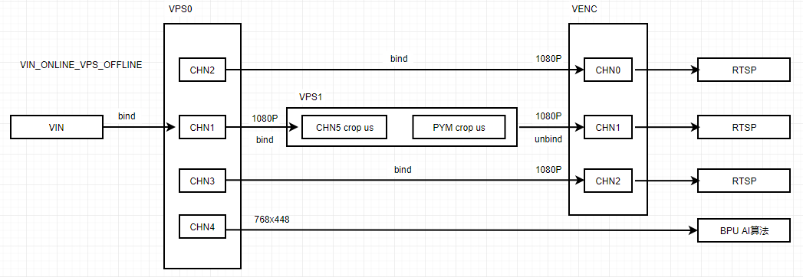
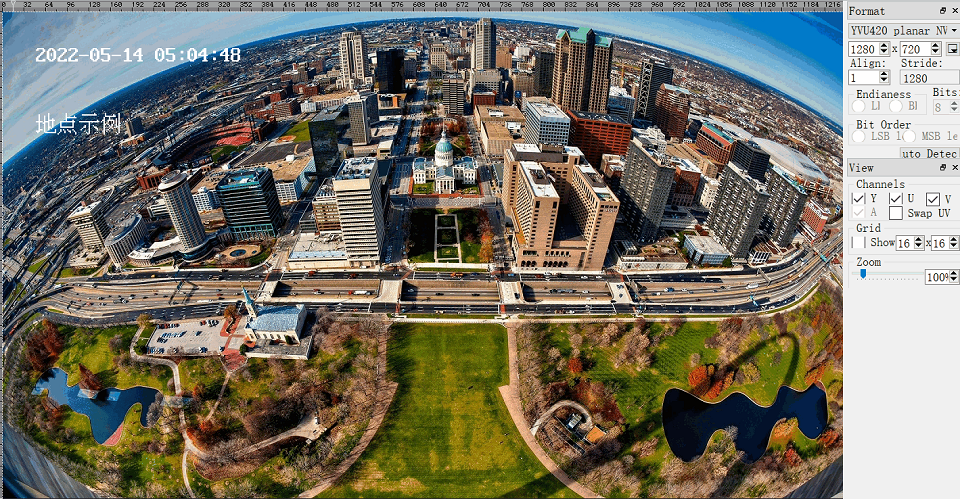
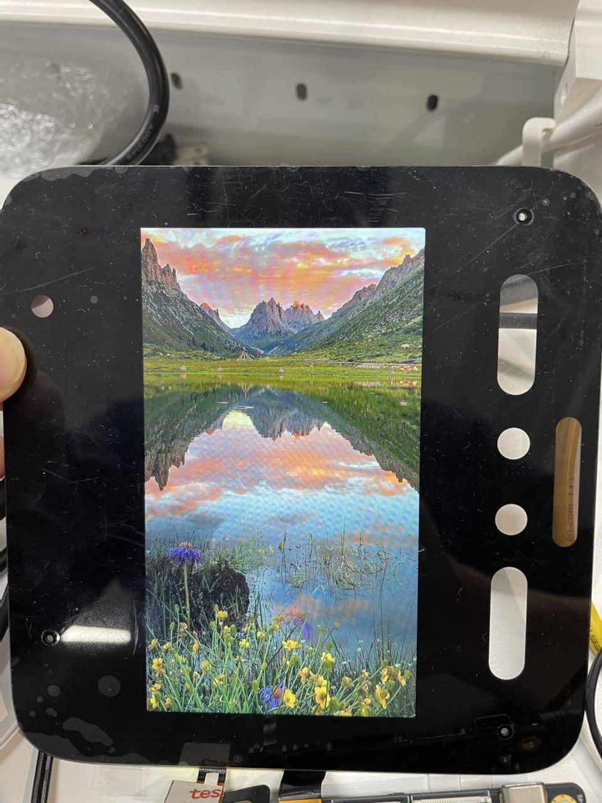
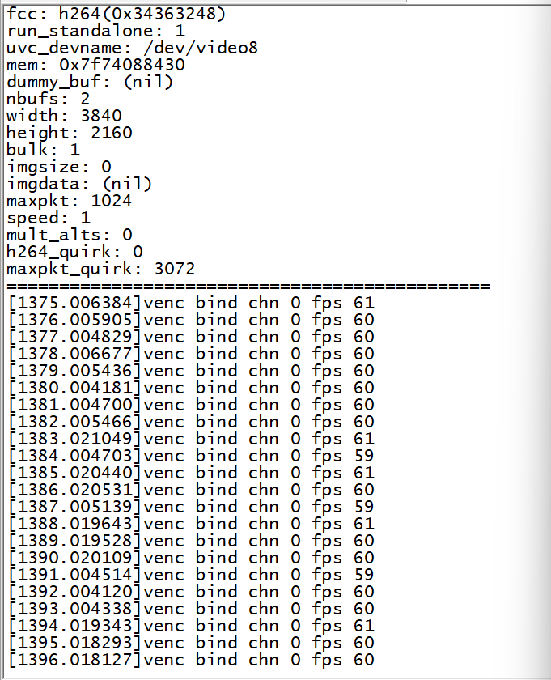
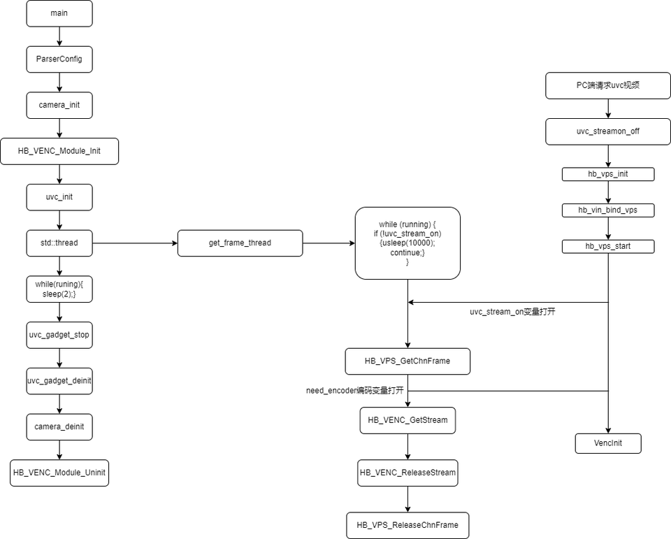
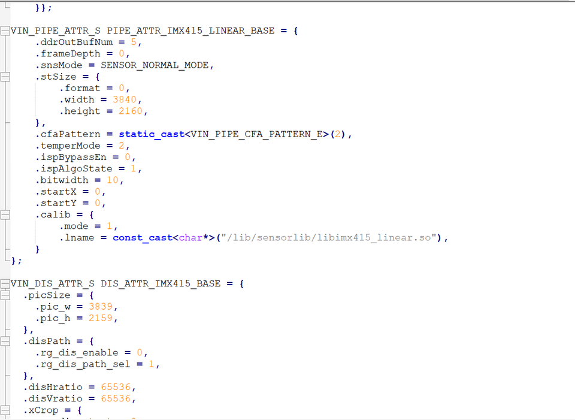

# 7.2 示例程序
本章简述地平线多媒体应用示例，所涉及源码可以通过 sudo apt install hobot-multimedia-samples 获得，安装在 /app/multimedia_samples 目录下。
## get_sif_data 使用说明{#get_sif_data}

### 程序功能

下图所示为X3M的视频数据通路框图，其中的专业名词解释请查看 [多媒体开发概述-术语约定](./overview#terminology)。


`get_sif_data` 完成 `sensor` 、`MIPI CSI` 和 `SIF` 模块的初始化，实现从`SIF`模块获取视频帧数据的功能，支持从`SIF`模块获取`Raw`、`YUV`两种格式的图像。

`get_sif_data` 可以有效帮助用户调试`sensor`和`X3M`的点亮调试，在打通`sensor -> SIF`的数据通路后，再调试其他模块的功能。

### 程序开发

#### 源码结构

源码位于 `/app/multimedia_samples/get_sif_data`

```
.
├── main.c                       # 主程序，完成sensor列表的加载，和命令控制
├── Makefile			 # 编译makefile
├── module.c
├── module.h
├── Readme.md
├── sensor_handle.c              # sensor 初始化、从sif中获取图像的接口
├── sensor_handle.h
├── sensors			 # sensor参数配置，每个新sensor在本目录新增一个文件
│   ├── sensor_f37.c
│   └── sensor_imx415.c
└── sensors.lds
```

#### 编译

当前代码通过一个Makefile文件配置编译

进入源码目录，执行以下命令进行编译生成`get_sif_data`程序


```bash
$ cd sample/get_sif_data
$ make clean # 清理源码，保持干净的代码环境
$ make
... ... # 一大段编译打印
$ ls
get_sif_data  main.c  main.o  Makefile  module.c  module.h  module.o  Readme.md  sensor_handle.c  sensor_handle.h  sensor_handle.o  sensors  sensors.lds
```

#### 添加新sensor

如果有新sensor需要调试，请参考 sensors 目录下的源码文件，对应添加一个新的sensor配置即可。

以F37为例说明关键代码：

```c
/* 
 * 添加sensor、mipi、sif dev、isp的参数配置
 * 各结构体中参数在代码中有已经有比较详细的注释说明
 * 其中isp部分参数在本程序中无需关注
 */
static int set_sensor_param(void)
{
        printf("set_sensor_param\n");
        /*定义 sensor   初始化的属性信息 */
        snsinfo = SENSOR_1LANE_F37_30FPS_10BIT_LINEAR_INFO;
        /*定义 mipi 初始化参数信息 */
        mipi_attr = MIPI_1LANE_SENSOR_F37_30FPS_10BIT_LINEAR_ATTR;
        /*定义 dev 初始化的属性信息 */
        devinfo = DEV_ATTR_F37_LINEAR_BASE;
        /*定义 pipe 属性信息 */
        pipeinfo = PIPE_ATTR_F37_LINEAR_BASE;

        return sensor_sif_dev_init();
        return 0;
}

/* 
 * 主程序遍历sensor模块时调用本函数完成sensor名和sensor参数配置接口的注册
 */
static int sensor_probe(void)
{
        int i = 0;

        /* 在sensor_lists里面找到一个空位置 */
        for (i = 0; i < ARRAY_SIZE(sensor_lists); i++) {
                if (0 == strlen(sensor_lists[i].sensor_tag)) break;
        }

        if (i >= ARRAY_SIZE(sensor_lists)) {
                printf("sensor lists is full\n");
                return -1;
        }

        strncpy(sensor_lists[i].sensor_tag, SENSOR_TAG, 31 > strlen(SENSOR_TAG) ? strlen(SENSOR_TAG) : 31);
        sensor_lists[i].func = set_sensor_param;
        return 0;
}

/* 注册sensor的模块入口，主程序在遍历sensor时会用到 */
SENSOR_MODULE_INSTALL(sensor_probe);
```


### 功能使用

#### 硬件连接

RDK X3 开发板通过`mipi host`接口用于连接`Sensor`模组，请根据当前要调试的`Sensor`模组型号正确连接。

#### 程序部署

按照上面的编译流程生成出`get_sif_data`后，执行该程序，根据提示选择当前连接在开发板上的sensor类别，比如当前连接的是 `F37 sensor`，则选择 1。 

如果初始化成功，会自动获取第一帧图像（pipe0_plane0_1920x1080_frame_001.raw）保存在程序运行的目录下（退出程序后执行 ls -l pipe0_plane0_1920x1080_frame_* 可以查看），并打印用户可以使用的命令，运行过程如下：

```bash
chmod +x get_sif_data
./get_sif_data

Horizon Robotics Sensor Test Tools V1.0

********************** Sensor Lists *************************
        0 -- IMX415
        1 -- F37
*************************************************************

Please select :1 # 选择 sensor
... ... # 一大段初始化日志
normal pipe_id (0)type(9)frame_id(1)buf_index(0)w x h(1920x1080) data_type 9 img_format 0
stride_size(2400) w x h1920 x 1080  size 2592000
pipe(0)dump normal raw frame id(1),plane(1)size(2592000) # 获取第一帧图像
filedump(pipe0_plane0_1920x1080_frame_001.raw, size(2592000) is successed
time cost 85 ms 
dumpToFile raw cost time 85 ms********************** Command Lists *************************
  q     -- quit
  g     -- get one frame
  l     -- get a set frames
  h     -- print help message

Command: 
```

**命令解释：**

- g： 获取一帧图像，支持输入多个`g`来连续获取图像，例如输入 `gggg`


```bash
Command: g
normal pipe_id (0)type(9)frame_id(4078)buf_index(5)w x h(1920x1080) data_type 9 img_format 0
stride_size(2400) w x h1920 x 1080  size 2592000
pipe(0)dump normal raw frame id(4078),plane(1)size(2592000)
filedump(pipe0_plane0_1920x1080_frame_4078.raw, size(2592000) is successed
time cost 67 ms 
dumpToFile raw cost time 67 ms
```

- l： 连续获取12帧图像，相当于输入12个 `g`


```bash
Command: l
normal pipe_id (0)type(9)frame_id(4588)buf_index(3)w x h(1920x1080) data_type 9 img_format 0
stride_size(2400) w x h1920 x 1080  size 2592000
pipe(0)dump normal raw frame id(4588),plane(1)size(2592000)
filedump(pipe0_plane0_1920x1080_frame_4588.raw, size(2592000) is successed
time cost 56 ms 
... ... # 连续的获取帧数据的打印
dumpToFile raw cost time 56 msnormal pipe_id (0)type(9)frame_id(4609)buf_index(7)w x h(1920x1080) data_type 9 img_format 0
stride_size(2400) w x h1920 x 1080  size 2592000
pipe(0)dump normal raw frame id(4609),plane(1)size(2592000)
filedump(pipe0_plane0_1920x1080_frame_4609.raw, size(2592000) is successed
time cost 57 ms 
dumpToFile raw cost time 57 ms
```

- q: 退出程序


```
Command: Command: q
quit
[  256.825912] [S0][V1]sif_video_streamoff
[  256.826439] SIF close node 1
[  256.853045] [S0][V0]sif_video_streamoff SIF last process stream off 
[  256.853922] [S0][V0]sif_video_streamoff
[  256.855476] hobot_dmcfreq_target: dmcfreq->rate:2666000000, target_rate:2666000000
[  256.856460] buf:performance
[  256.856460] , powersave_rate:2666000000, dmcfreq->pre_state:0
[  256.857610] [S0][V0]x3_sif_close SIF last process close 
[  256.858301] SIF close node 0
[  256.858807] [isp_drv]: camera_sys_stream_off: camera_sys_stream_off success line 1549 dev_name port_0
[  256.860006] [isp_drv:cam]: camera_fop_release: line 115 port 0 user_num 0  camera_cdev->start_num 0 
[  256.861229] vps mipi_host1: sensor1_mclk set(1) 0 as 24000000
[  256.861980] vps mipi_host1: sensor1_mclk set(0) 0 as 24000000
[  256.862741] vps mipi_host0: sensor0_mclk set(2) 0 as 24000000
[  256.863491] vps mipi_host0: sensor0_mclk set(1) 0 as 24000000
[  256.864241] vps mipi_host0: sensor0_mclk set(0) 0 as 24000000
```

#### 运行效果说明

执行程序后会获取到如 `pipe0_plane0_1920x1080_frame_4609.raw` 一样命名的`raw`图像，或者如`pipe0_1920x1080_frame_1024.yuv`一样命名的`yuv`图像。

请使用 [hobotplayer](https://sunrise.horizon.cc/downloads/hobotplayer/hobotplayerv.2.07.1.rar) 工具浏览图像，图像的参数配置说明如下：

- 浏览RAW图

按照如下图所示步骤配置选项，其中`file config`里面关注`pic_type`、`raw_type`、 `pix_length` 、`width`和`height`的配置，F37 配置为（PIC_RAW、MIPI_RAW、RAW_BIT_10， 1920，1080），IMX415配置为（PIC_RAW、MIPI_RAW、RAW_BIT_12， 3840，2160）


- 浏览YUV图

按照如下图所示步骤配置选项，其中`file config`里面关注`pic_type`、`yuv_type`、`width`和`height`的配置，F37 配置为（PIC_YUV、YUV_NV12， 1920，1080），IMX415配置为（YUV_NV12， 3840，2160）


## get_isp_data 使用说明{#get_isp_data}

### 程序功能

下图所示为X3M的视频数据通路框图，其中的专业名词解释请查看 [多媒体开发概述-术语约定](./overview#terminology)。


`get_isp_data` 完成 `sensor` 、`MIPI CSI`  `SIF` 和 `ISP` 模块的初始化，实现从`ISP`模块获取视频帧数据的功能，支持从`ISP`模块获取`YUV`格式的图像。

`get_isp_data` 可以有效帮助用户调试`sensor`和`X3M`的ISP效果调试，在打通`sensor -> SIF -> ISP `的数据通路后，再调试其他模块的功能。

### 程序开发

#### 源码结构

源码位于 `/app/multimedia_samples/get_isp_data`

```
.
├── main.c                       # 主程序，完成sensor列表的加载，和命令控制
├── Makefile			 # 编译makefile
├── module.c
├── module.h
├── Readme.md
├── sensor_handle.c              # sensor 初始化、从isp中获取图像的接口
├── sensor_handle.h
├── sensors			 # sensor参数配置，每个新sensor在本目录新增一个文件
│   ├── sensor_f37.c
│   └── sensor_imx415.c
└── sensors.lds
```

#### 编译

当前代码通过一个Makefile文件配置编译，进入源码目录，执行以下命令进行编译生成`get_isp_data`程序：

```bash
$ cd /app/multimedia_samples/get_sif_data
$ make clean # 清理源码，保持干净的代码环境
$ make
... ... # 一大段编译打印
$ ls
get_isp_data  main.c  main.o  Makefile  module.c  module.h  module.o  Readme.md  sensor_handle.c  sensor_handle.h  sensor_handle.o  sensors  sensors.lds
```

#### 添加新sensor

如果有新sensor需要调试，请参考 sensors 目录下的源码文件，对应添加一个新的sensor配置即可。

以F37为例说明关键代码：

```c
/* 
 * 添加sensor、mipi、sif dev、isp的参数配置
 * 各结构体中参数在代码中有已经有比较详细的注释说明
 */
static int set_sensor_param(void)
{
        printf("set_sensor_param\n");
        /*定义 sensor   初始化的属性信息 */
        snsinfo = SENSOR_1LANE_F37_30FPS_10BIT_LINEAR_INFO;
        /*定义 mipi 初始化参数信息 */
        mipi_attr = MIPI_1LANE_SENSOR_F37_30FPS_10BIT_LINEAR_ATTR;
        /*定义 dev 初始化的属性信息 */
        devinfo = DEV_ATTR_F37_LINEAR_BASE;
        /*定义 pipe 属性信息 */
        pipeinfo = PIPE_ATTR_F37_LINEAR_BASE;
    	/*定义 dis 属性信息 */
    	disinfo = DIS_ATTR_F37_BASE;
    	/*定义 ldc 属性信息 */
    	ldcinfo = LDC_ATTR_F37_BASE;
        return sensor_sif_dev_init();
        return 0;
}

/* 
 * 主程序遍历sensor模块时调用本函数完成sensor名和sensor参数配置接口的注册
 */
static int sensor_probe(void)
{
        int i = 0;

        /* 在sensor_lists里面找到一个空位置 */
        for (i = 0; i < ARRAY_SIZE(sensor_lists); i++) {
                if (0 == strlen(sensor_lists[i].sensor_tag)) break;
        }

        if (i >= ARRAY_SIZE(sensor_lists)) {
                printf("sensor lists is full\n");
                return -1;
        }

        strncpy(sensor_lists[i].sensor_tag, SENSOR_TAG, 31 > strlen(SENSOR_TAG) ? strlen(SENSOR_TAG) : 31);
        sensor_lists[i].func = set_sensor_param;
        return 0;
}

/* 注册sensor的模块入口，主程序在遍历sensor时会用到 */
SENSOR_MODULE_INSTALL(sensor_probe);
```


### 功能使用

#### 硬件连接

RDK X3 开发板通过`mipi host`接口用于连接`Sensor`模组，请根据当前要调试的`Sensor`模组型号正确连接。

#### 程序部署

按照上面的编译流程生成出`get_isp_data`后，执行该程序，根据提示选择当前连接在开发板上的sensor类别，比如当前连接的是 `F37 sensor`，则选择 1。  

如果初始化成功，会自动获取第一帧图像（pipe0_1920x1080_frame_001.yuv）保存在程序运行的目录下（退出程序后执行 ls -l pipe0_1920x1080_frame_* 可以查看），并打印用户可以使用的命令，运行过程如下：

```bash
chmod +x get_isp_data
./get_isp_data

Horizon Robotics Sensor Test Tools V1.0

********************** Sensor Lists *************************
        0 -- IMX415
        1 -- F37
*************************************************************

Please select :1 # 选择 sensor
... ... # 一大段初始化日志
normal pipe_id (0)type(11)frame_id(1)buf_index(0)w x h(1920x1080) data_type 11 img_format 0
stride_size(2400) w x h1920 x 1080  size 2073600
pipe(0)dump normal yuv frame id(1),plane(1)size(2073600) # 获取第一帧图像
filedump(pipe0_1920x1080_frame_001.yuv, size(2073600) is successed
time cost 63 ms 
dumpToFile yuv cost time 63 ms********************** Command Lists *************************
  q     -- quit
  g     -- get one frame
  l     -- get a set frames
  h     -- print help message

Command: 
```

**命令解释：**

- g： 获取一帧图像，支持输入多个`g`来连续获取图像，例如输入 `gggg`


```bash
Command: g
normal pipe_id (0)type(11)frame_id(4078)buf_index(5)w x h(1920x1080) data_type 11 img_format 0
stride_size(2400) w x h1920 x 1080  size 2073600
pipe(0)dump normal yuv frame id(4078),plane(1)size(2073600)
filedump(pipe0_1920x1080_frame_4078.yuv, size(2073600) is successed
time cost 63 ms 
dumpToFile yuv cost time 63 ms
```

- l： 连续获取12帧图像，相当于输入12个 `g`


```bash
Command: l
normal pipe_id (0)type(11)frame_id(4588)buf_index(3)w x h(1920x1080) data_type 11 img_format 0
stride_size(2400) w x h1920 x 1080  size 2073600
pipe(0)dump normal yuv frame id(4588),plane(1)size(2073600)
filedump(pipe0_1920x1080_frame_4588.yuv, size(2073600) is successed
time cost 56 ms 
... ... # 连续的获取帧数据的打印
dumpToFile yuv cost time 56 msnormal pipe_id (0)type(11)frame_id(4609)buf_index(7)w x h(1920x1080) data_type 11 img_format 0
stride_size(2400) w x h1920 x 1080  size 2073600
pipe(0)dump normal yuv frame id(4609),plane(1)size(2073600)
filedump(pipe0_1920x1080_frame_4609.yuv, size(2073600) is successed
time cost 57 ms 
dumpToFile yuv cost time 57 ms
```

- q: 退出程序


```
Command: Command: q
quit
[  256.825912] [S0][V1]sif_video_streamoff
[  256.826439] SIF close node 1
[  256.853045] [S0][V0]sif_video_streamoff SIF last process stream off 
[  256.853922] [S0][V0]sif_video_streamoff
[  256.855476] hobot_dmcfreq_target: dmcfreq->rate:2666000000, target_rate:2666000000
[  256.856460] buf:performance
[  256.856460] , powersave_rate:2666000000, dmcfreq->pre_state:0
[  256.857610] [S0][V0]x3_sif_close SIF last process close 
[  256.858301] SIF close node 0
[  256.858807] [isp_drv]: camera_sys_stream_off: camera_sys_stream_off success line 1549 dev_name port_0
[  256.860006] [isp_drv:cam]: camera_fop_release: line 115 port 0 user_num 0  camera_cdev->start_num 0 
[  256.861229] vps mipi_host1: sensor1_mclk set(1) 0 as 24000000
[  256.861980] vps mipi_host1: sensor1_mclk set(0) 0 as 24000000
[  256.862741] vps mipi_host0: sensor0_mclk set(2) 0 as 24000000
[  256.863491] vps mipi_host0: sensor0_mclk set(1) 0 as 24000000
[  256.864241] vps mipi_host0: sensor0_mclk set(0) 0 as 24000000
```

#### 运行效果说明

执行程序后会获取到如 `pipe0_1920x1080_frame_4609.yuv` 一样命名的`yuv`图像

请使用 [hobotplayer](https://sunrise.horizon.cc/downloads/hobotplayer/hobotplayerv.2.07.1.rar) 工具浏览图像，图像的参数配置说明如下：

- 浏览YUV图

按照如下图所示步骤配置选项，其中`file config`里面关注`pic_type`、`yuv_type`、`width`和`height`的配置，F37 配置为（PIC_YUV、YUV_NV12， 1920，1080），IMX415配置为（YUV_NV12， 3840，2160）


## sample_isp 使用说明{#sample_isp}

### 程序功能

`sample_isp`程序完成`isp`图像接口初始化，主要功能是调用每一个`isp`图像进行接口动态设置/获取参数，并返回测试结果

### 程序开发

#### 源码结构

源码位于`/app/multimedia_samples/sample_isp`
```
.
├── main.c			# 主程序
├── Makefile			# 编译makefile
└── Readme.md			# 程序说明
```

#### 编译

当前代码通过一个Makefile文件配置编译

进入源码目录，执行以下命令进行编译生成 `sample_isp`
```
$ cd /app/multimedia_samples/sample_isp
$ make clean # 清理源码，保持干净的代码环境
$ make
... ... # 一大段编译打印
$ ls
main.c  main.o  Makefile  sample_isp
```


### 功能使用

#### 程序部署

按照上面的编译流程生成出`sample_isp`后，运行该程序。

注意此程序运行前需要有当前的sensor程序在运行中，sensor的程序可以直接使用`Sunrise_camera`, `sample_isp`运行过程如下

```bash
chmod +x sample_isp
# ./sample_isp
============================================
APP: ./sample_isp
a: AE
b: AF
c: AWB
d: BL
e: DEMOSAIC
f: SHARPEN
g: GAMMA
h: IRIDIX
i: CNR
j: SINTER
k: TEMPER
l: SCENE_MODES
m: FIRMWARE STATE
n: MODULE CONTROL
o: REGISTER
p: LIBREG_AE
q: LIBREG_AWB
r: LIBREG_AF
s: METERING AE(read only)
t: METERING AWB(read only)
u: METERING AF(read only)
v: METERING AE_5BIN(read only)
w: METERING_DATA_TIME(read only)
x: SWITCH SCENCE
A: CSC
B: MESH SHADING
C: MESH SHADING LUT
D: RADIAL SHADING
E: RADIAL SHADING LUT
F: IRIDIX STRENGTH LEVEL
G: IDX_IRQ_SYNC
H: IDX_AWB_ZONE
I: IDX_AF_ZONE
L: IDX_AF_KERNEL
M: IDX_AEROI_INFO
N: IDX_LUMA_INFO
O: IDX_AEPARAM_INFO
J: IDX_AE5BIN_ZONE
K: IDX_AE_ZONE
P: IDX_AE_EX
y: Help
Q: Exit
============================================
ISP_TEST>
```
#### 命令解释：

- a： 获取/设置AE属性

- b： 示例中暂不支持

- c:  获取/设置AWB属性

- d:  获取/设置BlackLevel属性

- e:  获取/设置Demosaic属性

- f:  获取/设置SHARPEN属性

- g:  获取/设置GAMMA属性

- h:  获取/设置IRIDIX属性

- i:  获取/设置CNR属性

- j:  获取/设置SINTER属性

- k:  获取/设置TEMPER属性

- l:  获取/设置SCENE_MODES属性

- m:  获取/设置FWSTATE属性

- n:  获取/设置ModuleControl属性

- o:  获取/设置Register寄存器

- p:  注册AE回调接口

- q:  注册AWB回调接口

- r:  注册AF回调接口

- s:  获取AE统计信息

- t:  获取AWB统计信息

- u:  获取AF统计信息

- v:  获取AE_5BIN统计信息

- w:  获取最新的统计信息(代码里面默认获取AWB，可以仿照代码通过传参获取AE,AF统计信息)

- x:  切换isp效果库(so库需要跟isp_test文件同一目录)

- A:  获取/设置CSC属性

- B:  获取/设置MESH_SHADING属性

- C:  获取/设置MESH SHADING LUT属性

- D:  获取/设置RADIAL SHADING属性

- E:  获取/设置RADIAL SHADING LUT属性

- F:  获取/设置IRIDIX STRENGTH LEVEL属性

- G:  获取帧同步开始/结束时间

- H:  设置AWB_ZONE属性

- I:  设置AF_ZONE属性

- L:  获取/设置AF_KERNEL_INFO属性

- M:  获取/设置AEROI信息

- N:  获取LUMA信息

- O:  获取/设置AEParam信息

- J:  设置AE5BIN_ZONE属性

- K:  设置AEZONE属性

- P:  获取/设置AE额外属性

- y:  帮助信息

- Q:  退出程序


## sample_vps 使用说明{#sample_vps}

### 程序功能

`sample_vps` 程序使用一个 `vps grp` 的多个不同通道，对 `YUV` 图像进行裁剪，旋转，缩放等操作，展示 `vps` 的基本用法。更多丰富的 `vps` 图像处理使用请参考[视频处理](./video_processing)章节。

### 程序开发

#### 源码结构

源码位于：`/app/multimedia_samples/sample_vps`

```
.
|-- 19201080.yuv      # 回灌使用NV12格式文件 
|-- main.c            # 主程序
`-- Makefile          # 编译makefile
```

#### 编译

当前代码通过一个Makefile文件配置编译

进入源码目录，执行以下命令进行编译生成`sample_vps`

```shell
$ cd /app/multimedia_samples/sample_vps
$ make clean # 清理源码，保持干净的代码环境
$ make
... ... # 一大段编译打印
$ ls
19201080.yuv  main.c  main.o  Makefile  sample_vps
```
### 功能使用

#### 程序部署

按照上面的编译流程生成出 `sample_vps` ，确保当前目录下存在`19201080.yuv`，然后执行程序 `./sample_vps`

#### 运行效果说明
`YUV` 图片通过回灌方式，利用 `vps` 进行裁剪，旋转，缩放等功能，保存对应处理后的 `YUV` 图像。
* `grp_0_chn_1_out_1280_720.yuv` 为原图裁剪到 `1280x720` 分辨率；
* `grp_0_chn_2_out_1088_1920.yuv` 为原图旋转90度的图像；
* `grp_0_chn_3_out_960_540.yuv` 为原图缩小到 `960x540` 分辨率；
* `grp_0_chn_5_out_2880_1620.yuv` 为原图放大到 `2880x1620` 分辨率；

## sample_vps_zoom 使用说明{#sample_vps_zoom}

### 程序功能

`sample_vps_zoom` 程序使用 `vps` 的硬件模块 `ipu` 和 `pym` 对 `YUV` 图像中的部分区域做多倍放大处理，对处理后的 `YUV`图像编码成 `H264` 视频流，可以直接使用 `MPC-BE` 等工具进行预览，类似电子云台中的`zoom` 功能。整个程序的 `Pipeline` 如下图所示：



如 `Pipeline` 所示，程序通过 `vps0` 读取 `YUV` 图像，`vps0 chn1` 和 `vps1` 绑定，通过 `ipu` 和 `pym` 做 `crop` 及放大后，将数据送给 `venc` 的 `chn1` 做 `H264` 编码，形成 `zoom` 放大的效果，同时 `vps0 chn2` 和 `venc chn0` 绑定做 `H264` 编码， `vps0 chn3` 和 `venc chn2` 绑定做 `H264` 编码。

### 程序开发

#### 源码结构

源码位于：`/app/multimedia_samples/sample_vps_zoom`

```
.
|-- 19201080.yuv      # 回灌使用NV12格式文件 
|-- main.c            # 主程序
`-- Makefile          # 编译makefile
```

#### 编译

当前代码通过一个Makefile文件配置编译

进入源码目录，执行以下命令进行编译生成`sample_vps_zoom`程序：

```shell
$ cd /app/multimedia_samples/sample_vps_zoom
$ make clean # 清理源码，保持干净的代码环境
$ make
... ... # 一大段编译打印
$ ls
19201080.yuv  main.c  main.o  Makefile  sample_vps_zoom
```

### 功能使用

#### 程序部署

按照上面的编译流程生成出 `sample_vps_zoom`，确保当前目录下存在 `19201080.yuv` 文件  

执行程序 `./sample_vps_zoom`

#### 运行效果说明

`YUV` 图片通过回灌方式，利用 `ipu`, `pym`, `venc` 模块编码成平滑放大的zoom `H264` 码流。效果如下所示。


## sample_osd 使用说明{#sample_osd}

### 程序功能

`sample_osd` 程序用于给 `vps` 通道输出的 `YUV` 数据叠加时间戳，汉语文字 `osd`。更多丰富的 `osd` 图像处理使用请参考[区域处理](./region_processing)章节。

### 程序开发

#### 源码结构

源码位于：`/app/multimedia_samples/sample_osd`

```
.
|-- 1280720.yuv       # 回灌使用NV12格式文件 
|-- main.c            # 主程序
|-- Makefile          # 编译makefile
```

#### 编译

当前代码通过一个Makefile文件配置编译

进入源码目录，执行以下命令进行编译生成`sample_osd`程序

```shell
$ cd sample/sample_osd
$ make clean # 清理源码，保持干净的代码环境
$ make
... ... # 一大段编译打印
$ ls
1280720.yuv  main.c  main.o  Makefile  sample_osd
```
### 功能使用

#### 程序部署

按照上面的编译流程生成出`sample_osd`后，确保当前目录下面存在`1280720.yuv`，执行`sample_osd`

#v## 运行效果说明

通过 `osd` 叠加后 `vps` 通道输出的的 `YUV` 图像如下图所示：



## sample video codec 使用说明{#sample_video_codec}

### 程序功能

`sample_vdec_basic` 实现最基础解码功能，读取本地`H264`/`H265`/`MJPEG`文件，进行解码保存`NV12`结果

`sample_venc_basic` 实现最基础编码功能，读取`NV12`图像，编码为`H264`（或`H265`或`MJPEG`），并保存为本地文件

`sample_vdec_two_channel` 面向需要多通道同时解码的场景，在`sample_vdec_basic` 基础上增加一路解码通道，实现双通道解码功能。读取本地`H264`/`H265`/`MJPEG`文件，两路同时进行解码分别保存`NV12`文件。

`sample_venc_two_channel` 面向需要多通道同时编码的场景，在`sample_venc_basic` 基础上增加一路编码通道，实现双通道编码功能。读取本地`NV12`文件，两路同时进行解码分别保存`H264`（或`H265`或`MJPEG`）。

### 程序开发

#### 源码结构

源码位于：`/app/multimedia_samples/sample_video_codec`

```
.
├── example_vdec_basic
├── example_vdec_two_channel
├── example_venc_basic
├── example_venc_two_channel
├── Makefile
├── README.md
├── sample_vdec_basic.c
├── sample_vdec_two_channel.c
├── sample_venc_basic.c
└── sample_venc_two_channel.c
```

#### 编译

当前代码通过一个Makefile文件配置编译

进入源码目录，执行以下命令进行编译生成`sample_venc_basic`、`sample_vdec_basic`、`sample_vdec_two_channel`、`sample_venc_two_channel`程序

```shell
$ cd /app/multimedia_samples/sample_video_codec
$ make clean # 清理源码，保持干净的代码环境
$ make
... ... # 一大段编译打印
$ ls
example_vdec_basic        example_venc_basic        Makefile   sample_vdec_basic    sample_vdec_two_channel    sample_venc_basic    sample_venc_two_channel
example_vdec_two_channel  example_venc_two_channel  README.md  sample_vdec_basic.c  sample_vdec_two_channel.c  sample_venc_basic.c  sample_venc_two_channel.c
```

### 程序部署

#### sample_vdec_basic

按照上面的编译流程生成出`sample_vdec_basic`程序之后  

执行 `./sample_vdec_basic -w width -h height -t ecode_type -f file`

其中width为图像宽所包含像素个数

height为为图像高所包含的像素格式

encode_type可以为h264\h265\mjpeg

file为要解码的文件名

#### sample_venc_basic

按照上面的编译流程生成出`sample_venc_basic`程序之后  

执行 `./sample_venc_basic -w width -h height -t ecode_type -f file0 -g file1`

其中width为图像宽所包含像素个数

height为为图像高所包含的像素格式

ecode_type可以为h264\h265\mjpeg

file0为要编码的文件名需要为NV12格式

file1为要编码的文件名需要为NV12格式，其width和height需要和file0保持一样

#### sample_vdec_two_channel

按照上面的编译流程生成出`sample_vdec_two_channel`程序之后  


执行  `./sample_vdec_two_channel -w width -h height -t ecode_type -f file`

其中width为图像宽所包含像素个数

height为为图像高所包含的像素格式

encode_type可以为h264\h265\mjpeg

file为要解码的文件名

#### sample_venc_two_channel

按照上面的编译流程生成出`sample_venc_two_channel`程序之后  

执行   `./sample_venc_two_channel -w width -h height -t ecode_type -f file0 -g file1`

其中width为图像宽所包含像素个数

height为为图像高所包含的像素格式

ecode_type可以为h264\h265\mjpeg

file0为要编码的文件名需要为NV12格式

file1为要编码的文件名需要为NV12格式，其width和height需要和file0保持一样

### 运行效果说明

#### sample_vdec_basic

在当前运行目录下生成decode.nv12，该文件内容随着解码内容更新

#### sample_venc_basic

在当前运行目录下生成sample_venc.h264/sample_venc.h265/sample_venc.jpg。H264/H265文件内容为交替显示是file1和file2
#### sample_vdec_two_channel

在当前运行目录下生成sample_decode_ch0.nv12和sample_decode_ch1.nv12，该文件内容随着解码内容更新。

#### sample_venc_two_channel

在当前运行目录下生成sample_venc_ch0.h264（sample_venc_ch0.h265/sample_venc_ch0.jpg）和sample_venc_ch1.h264（sample_venc_ch1.h265/sample_venc_ch1.jpg）。H264/H265文件内容为交替显示是file1和file2

## sample_vot 使用说明{#sample_vot}

### 程序功能

`sample_vot程序`完成`VOT`模块的初始化，实现从当前目录读取一帧nv12的图片数据送到`VOT`的bt1120输出显示功能

### 程序开发

#### 源码结构

源码位于：`/app/multimedia_samples/sample_vot`

```
.
├── 1280_720yuv8.yuv			# 回灌使用720P的NV12格式文件
├── 1920_1080yuv8.yuv			# 回灌使用1080P的NV12格式文件
├── Makefile					# 编译makefile
├── Readme.md					# 程序说明
└── vot.c						# 主程序
```

#### 编译

当前代码通过一个Makefile文件配置编译

进入源码目录，执行以下命令进行编译生成`sample_vot`

```shell
cd /app/multimedia_samples/sample_vot
$ make clean # 清理源码，保持干净的代码环境
$ make
... ... # 一大段编译打印
$ ls
1280_720yuv8.yuv  1920_1080yuv8.yuv  Makefile  Readme.md  sample_vot  vot.c  vot.o
```


### 功能使用

#### 程序部署

按照上面的编译流程生成出`sample_vot`

执行程序 `./sample_vot 1080P30`。

```bash
chmod +x sample_vot
root@x3sdbx3-samsung2G-3200:/userdata# ./sample_vot 1080P60
[   26.051955] channel id is 0, enable is 0, reg value is 0x4ef00f.
[   26.052744] channel id is 1, enable is 0, reg value is 0x4ef00f.
[   26.053520] channel id is 2, enable is 0, reg value is 0x4ef00f.
[   26.054339] channel id is 3, enable is 0, reg value is 0x4ef00f.
stLayer width:1920[   26.055263] channel id is 0, enable is 1, reg value is 0x14ef00f.
stLayer height:1080
libiar: hb_disp_set_timing done!
stChnAttr priority :2
stChnAttr src width :1920
stChnAttr src height :1080
stChnAttr s32X :0
stChnAttr s32Y :0
stChnAttr u32DstWidth :1920
stChnAttr u32DstHeight :1080
[   26.056165] iar_output_stream.
stCrop width :1920
stCrop height :1080
[   26.059304] channel id is 0, enable is 1, reg value is 0x14ef00f.
framesize:3110400

（注意如果是X3 SDB生态板子，那么带的参数只支持1080P60/1080P30，如果是客户自己使用的sil902x的bt1120转换hdmi芯片，那么参数可以是如下：
	1080P60
	1080P59.94
	1080P50
	1080P30
	1080P29.97
	1080P25
	1080I60
	1080I59.94
	1080I50
	720P60
	720P59.94
	720P50
	720P29.97）


```

#### 运行效果说明

程序通过把`1920_1080yuv8.yuv`读到内存，并通过接口把数据送到`VOT`模块的`bt1120`接口,然后通过`hdmi`转换芯片输出`hdmi`效果到显示设备如下图


## sample_lcd 使用说明{#sample_lcd}

### 程序功能

`sample_lcd程序`完成`VOT`模块的初始化，实现从当前目录读取一帧NV12的图片数据送到`VOT`的`midi-dsi`输出到lcd屏幕显示

### 程序开发

#### 源码结构

源码位于：`/app/multimedia_samples/sample_lcd`

```
.
├── 720x1280.yuv	# 回灌使用NV12格式文件
├── Makefile		# 编译makefile
├── Readme.md		# 程序说明
└── vot.c			# 主程序
```

#### 编译

当前代码通过一个Makefile文件配置编译

进入源码目录，执行以下命令进行编译生成`sample_lcd`程序

```shell
$ cd /app/multimedia_samples/sample_lcd
$ make clean # 清理源码，保持干净的代码环境
$ make
... ... # 一大段编译打印
$ ls
720x1280.yuv  vot.c  vot.o  Makefile  sample_lcd
```
### 功能使用

#### 程序部署

按照上面的编译流程生成出`sample_lcd`，确保当前目录下存在`720x1280.yuv`文件

执行程序 `./sample_lcd`。

```bash
chmod +x sample_lcd
# ./sample_lcd
root@x3sdbx3-samsung2G-3200:/userdata# ./sample_lcd 
libiar: hb_disp_set_timing done!
HB_VOT_SetChnAttr 0: 0
HB_VOT_EnableChn: 0
HB_VOT_EnableChn: 0
framesize:1382400
```

#### 运行效果说明

程序通过把`720x1280.yuv`读到内存，并通过接口把数据送到`VOT`模块的`midi-dsi`接口,然后显示到`lcd`屏幕设备如下图



## sample_usb_cam_4k60 使用说明{#sample_usb_cam_4k60}

### 程序功能

`sample_usb_cam_4k60程序`完成`sensor`、`MIPI CSI` 、`SIF`、 `ISP` 、`VENC`、`USB`模块的初始化，实现从sensor实时采集数据，到编码器编码输出，通过usb模块传输到pc端预览视频的功能

软件框图如下所示：


### 功能使用

#### 程序部署

把 `sample/sample_usb_cam_4k60/out`目录通过winscp等工具拷贝到板子的/userdata目录，进入板子的/userdata/out目录执行sh run_usb_cam_imx415.sh可以把程序运行起来，运行结果如下：

```bash
root@x3sdbx3-samsung2G-3200:/userdata/out# cd /userdata/
root@x3sdbx3-samsung2G-3200:/userdata/out# sh run_usb_cam_imx415.sh 
run_usb_cam_imx415.sh: line 17: can't create /sys/bus/platform/drivers/ddr_monitor/read_qos_ctrl/all: Permission denied
run_usb_cam_imx415.sh: line 18: can't create /sys/bus/platform/drivers/ddr_monitor/write_qos_ctrl/all: Permission denied
>>>>>>>>>>>>> g1 is exist. delete it!
Detecting platform:
 board : Hobot XJ3 SOC SDB
 udc   : b2000000.dwc3
Stopping the USB gadget
usb-gadget is not running
Detecting platform:
 board : Hobot XJ3 SOC SDB
 udc   : b2000000.dwc3
show user config:
USB_VID: 0x1d6b
USB_PID: 0x0102
SERIAL: 0x6856e824
MANUF: hobot
PRODUCT: xj3
USE_UVC: true
USE_HID: false
USE_UAC1: false
USE_UAC2: false
USE_ADB: false
USE_MSD: false
USE_ACM: false
USE_RNDIS: false
USE_ECM: false
Creating the USB gadget
Loading composite module
Creating gadget directory g_comp
OK
init configfs...
Setting Vendor and Product ID's
OK
single function gadget
Setting English strings
OK
Creating Config
Init functions...
funciton_init, but do nothing, please init on demand
OK
Bind functions...
Bind functions according to .usb-config file
bind uvc...
Creating UVC gadget functionality : uvc.0
sh: 0: unknown operand
OK
Pre run userspace daemons(eg. adb)...
0
0
waiting
.
OK
Binding USB Device Controller
OK
Run some userspace daemons(eg. usb_camera)...
usb-gadget start succeed.
Open config file ./config/vin_vps_config_usb_cam.json success
Open config file1 ./config/vin_vps_config_usb_cam.json
Can not find key: tailWeight
Can not find key: manualTimeCount
Can not find key: autoTimeCount
Can not find key: manualAeM1
imx415_init_3840x2160_60_fps_linear_setting OK!
hb_vps_init grp_attr.maxW = 3840, grp_attr.maxH = 2160
chn_attr.width = 3840,chn_attr.height = 2160
set ipu chn Attr ok: GrpId = 0, chn_id = 2, chn_attr.enMirror = 0
start grp ok: grp_id = 0
vps1 us0 factor:0 x:0 y:0 w:968 h:544
vps1 us1 factor:0 x:0 y:0 w:968 h:544
vps1 us2 factor:0 x:0 y:0 w:968 h:544
vps1 us3 factor:0 x:0 y:0 w:968 h:544
vps1 us4 factor:0 x:0 y:0 w:968 h:544
vps1 us5 factor:0 x:0 y:0 w:968 h:544
vps1 us0 factor:0 x:0 y:0 w:968 h:544
vps1 us1 factor:0 x:0 y:0 w:968 h:544
vps1 us2 factor:0 x:0 y:0 w:968 h:544
vps1 us3 factor:0 x:0 y:0 w:968 h:544
vps1 us4 factor:0 x:0 y:0 w:968 h:544
vps1 us5 factor:0 x:0 y:0 w:968 h:544
vps1 us0 factor:0 x:0 y:0 w:648 h:364
vps1 us1 factor:0 x:0 y:0 w:648 h:364
vps1 us2 factor:0 x:0 y:0 w:648 h:364
vps1 us3 factor:0 x:0 y:0 w:648 h:364
vps1 us4 factor:0 x:0 y:0 w:648 h:364
vps1 us5 factor:0 x:0 y:0 w:648 h:364
try to construct empty ring queue##function uvc_gadget_init in
udc_find_video_device g_webcam
function name not matched. g_comp
:g_webcam
udc_find_video_device g_comp
using uvc device: /dev/video8
###uvc_gadget_init###
using uvc device: /dev/video8
width: 1280
height: 720
format: 2
io_method: 0
bulk_mode: 1
nbufs: 2
mult: 0
burst: 9
speed: 1
mult_alts: 0
h264_quirk: 0
maxpkt_quirk: 3072
uvc device is dwc3-gadget on bus gadget
uvc open succeeded, file descriptor = 22
uvc_size=4, maxpkt_size=3072
##function uvc_gadget_init succeed
##function uvc_gadget_start in
##function uvc_gadget_start succeed
##function uvc_loop in
dev->mask (0x0), entity_id(1), setup_ops((nil)), app doesn't care
control request (entity_id 01 req 86 cs 04)
send real error code last prepared(06)
control request (entity_id 00 req 81 cs 02)
dev->mask (0x0), entity_id(1), setup_ops((nil)), app doesn't care
control request (entity_id 01 req 86 cs 09)
send real error code last prepared(06)
control request (entity_id 00 req 81 cs 02)
dev->mask (0x0), entity_id(1), setup_ops((nil)), app doesn't care
control request (entity_id 01 req 86 cs 0b)
send real error code last prepared(06)
control request (entity_id 00 req 81 cs 02)
dev->mask (0x0), entity_id(1), setup_ops((nil)), app doesn't care
control request (entity_id 01 req 86 cs 0f)
send real error code last prepared(06)
control request (entity_id 00 req 81 cs 02)
dev->mask (0x0), entity_id(2), setup_ops((nil)), app doesn't care
control request (entity_id 02 req 86 cs 02)
send real error code last prepared(06)
control request (entity_id 00 req 81 cs 02)
dev->mask (0x0), entity_id(2), setup_ops((nil)), app doesn't care
control request (entity_id 02 req 86 cs 03)
send real error code last prepared(06)
control request (entity_id 00 req 81 cs 02)
dev->mask (0x0), entity_id(2), setup_ops((nil)), app doesn't care
control request (entity_id 02 req 86 cs 06)
send real error code last prepared(06)
control request (entity_id 00 req 81 cs 02)
dev->mask (0x0), entity_id(2), setup_ops((nil)), app doesn't care
control request (entity_id 02 req 86 cs 07)
send real error code last prepared(06)
control request (entity_id 00 req 81 cs 02)
dev->mask (0x0), entity_id(2), setup_ops((nil)), app doesn't care
control request (entity_id 02 req 86 cs 08)
send real error code last prepared(06)
control request (entity_id 00 req 81 cs 02)
dev->mask (0x0), entity_id(2), setup_ops((nil)), app doesn't care
control request (entity_id 02 req 86 cs 09)
send real error code last prepared(06)
control request (entity_id 00 req 81 cs 02)
dev->mask (0x0), entity_id(4), setup_ops((nil)), app doesn't care
control request (entity_id 04 req 85 cs 01)
send real error code last prepared(06)
control request (entity_id 00 req 81 cs 02)
```

#### 运行效果说明

通过Potplayer播放器选择UVC Camera，分辨率选择H264 3840x2160P 60,打开设备就可以播放UVC视频流，打开视频流后x3侧的打印如下图:



potplayer跑起来后的截图如下：


### 程序开发

#### 模块划分

| **模块**      | **目录**           | **描述**                                                     |
| ------------- | ------------------ | ------------------------------------------------------------ |
| 头文件        | inc                | 依赖的sensor头文件，json头文件，utils公共接口头文件，vio依赖公共头文件 |
| vio源代码模块 | src                | sensor源代码文件，json配置文件解析源文件，utils公共接口源文件，系统vio公共接口源文件 |
| 主程序        | sample_usb_cam.cpp | main函数入口                                                 |

##### 顶层源码结构

```
.
├── Makefile							#编译的主程序CMakeLists文件
├── vin_vps_config_usb_cam.json			#imx415 sensor配置文件
├── inc								
│   ├── camera									#sensor依赖头文件
│   ├── json									#json依赖头文件
│   ├── utils									#编译依赖的公共头文件
│   └── vio										#x3m的vio依赖头文件
├── lib
│   ├── jsoncpp									#依赖的json库
├── libguvc.so									#4k60的usb cam依赖库
├── libimx415.so								#4k60的sensor驱动库
├── README.md									#程序说明文档
├── run_usb_cam_imx415.sh						#程序运行脚本
├── sample_usb_cam.cpp							#主程序代码				
├── src
│   ├── camera									#sensor驱动配置代码
│   ├── utils									#编译依赖的公共源代码
│   └── vio										#x3m的vio依赖源文件
└── usb-gadget.sh								#4k60的usb cam驱动加载脚本
```

##### 头文件结构

```
.
├── camera
│   └── camera.h						#sensor依赖头文件，增加新sensor需要修改此文件
├── json								#开源的json库头文件
│   ├── allocator.h
│   ├── assertions.h
│   ├── autolink.h
│   ├── config.h
│   ├── features.h
│   ├── forwards.h
│   ├── json.h
│   ├── reader.h
│   ├── value.h
│   ├── version.h
│   └── writer.h
├── utils		
│   ├── utils.h							#ringbuf定义,dump图片视频等到文件功能的公共接口
│   └── yuv2yuv.h						#使用neon加速的yuv格式转换标准接口
└── vio
    ├── vio_cfg.h						#json配置文件解析头文件
    ├── vio_cfg_type.h					#json配置属性值头文件
    ├── vio_log.h						#打印控制头文件
    ├── vio_sys.h						#vp初始化反初始化，系统vio各模块绑定接口头文件
    ├── vio_venc.h						#X3系统编码模块初始化反初始化，启停，数据输入输出处理接口
    ├── vio_video.h						#视频格式枚举定义等通用接口
    ├── vio_vin.h						#vin结构体定义，初始化反初始化，启停，数据处理接口
    └── vio_vps.h						#vps初始化反初始化，启停，数据处理接口
```

##### 源代码结构

```
.
├── camera				#sensor依赖源代码文件，增加新sensor需要在此增加对对应sensor源代码文件
│   ├── camera_base.c
│   └── camera_imx415.cpp
├── utils
│   ├── utils.cpp		#dump图片视频等到文件功能的公共接口源代码文件
│   └── yuv2yuv.c		#使用neon加速的yuv格式转换标准接口源代码文件
└── vio
    ├── vio_cfg.cpp		#json配置文件解析源代码文件
    ├── vio_sys.cpp		#vp初始化反初始化，系统vio各模块绑定接口源代码文件
    ├── vio_venc.cpp	#X3系统编码模块初始化反初始化，启停，数据输入输出处理接口源代码文件
    ├── vio_video.cpp	#视频格式枚举定义等通用接口源代码文件
    ├── vio_vin.cpp		#vin初始化反初始化，启停，数据处理接口源代码文件
    └── vio_vps.cpp		#vps初始化反初始化，启停，数据处理接口源代码文件
```

程序启动流程图如下：



#### 编译

当前代码通过一个Makefile文件配置编译

依赖的多媒体头文件和库文件分别在BSP SDK的appsdk目录和system/rootfs_yocto/root目录下，编译时需要注意这两个依赖目录位置是否存在

安装交叉编译工具链后，安装交叉编译工具链后，执行 make 命令直接可以编译生成 sample_usb_cam 程序

```
cd sample/sample_usb_cam_4k60
$ make clean # 清理源码，保持干净的代码环境
$ make
... ... # 一大段编译打印
$ ls
Makefile  sample_usb_cam  inc  README.md  vin_vps_config_usb_cam.json  libguvc.so  libimx415.so  sample_usb_cam.cpp  sample_usb_cam.d  src  lib  run_usb_cam_imx415.sh  sample_usb_cam.obj 
usb-gadget.sh
$ make install # 把产出物安装到 out 目录下
```

#### 添加新sensor

如果有新sensor需要调试，请参考 src/camera 目录下的源码文件，对应添加一个新的sensor配置即可。

以IMX415的camera_imx415.cpp为例说明关键代码，需要添加MIPI_SENSOR_INFO_S、MIPI_ATTR_S、VIN_DEV_ATTR_S、VIN_PIPE_ATTR_S、VIN_DIS_ATTR_S、VIN_LDC_ATTR_S的新sensor结构体变量：





同时需要在inc/camera/camera.h把增加的新sensor的变量extern出来如下图imx415示例


