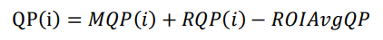
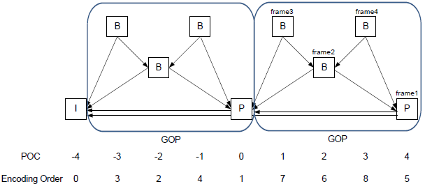
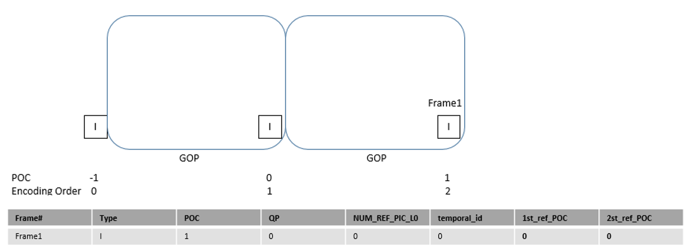
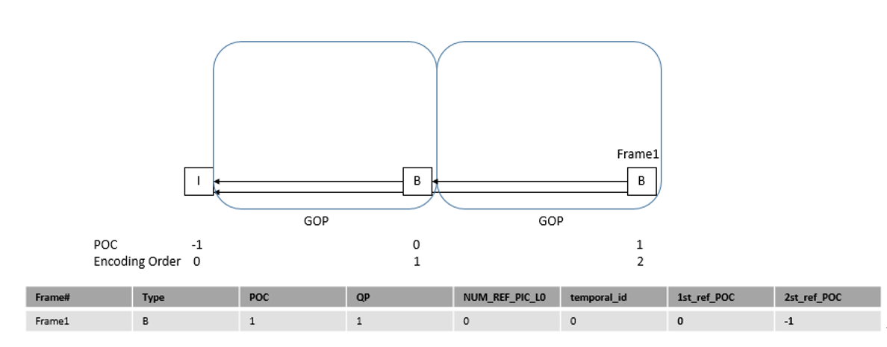
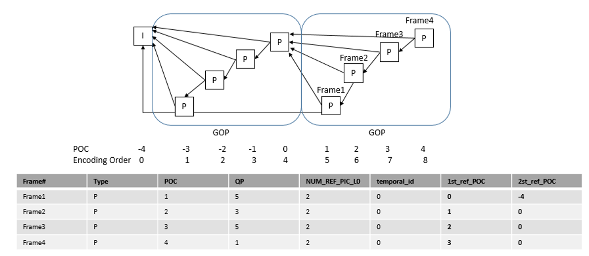
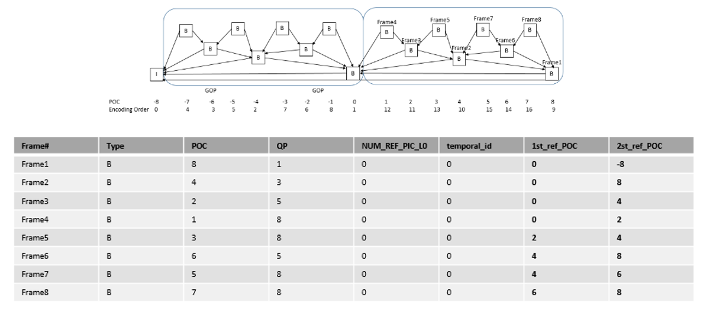
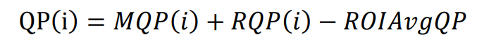
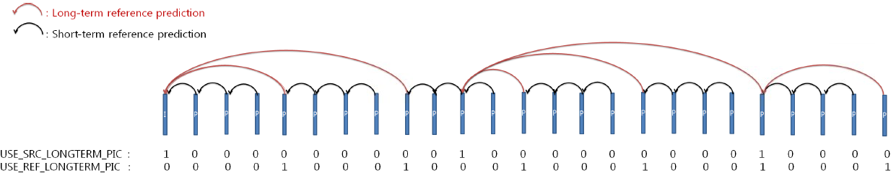
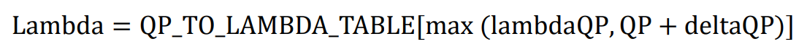

# 7.9 视频编码
## 概述
视频编码模块实现H.264/H.265/JPEG/MJPEG协议硬件编码。该模块支持多通道实时编码，各通道相互独立，常见的使用场景，包括单路录像、多路录像、单路VIO视频流、多路VIO视频流、录像+VIO视频流等。

## 功能描述

### 基础规格

X3支持的编码规格如下：


H264/H265协议编码性能如下：

- H.264编解码支持最大分辨率为 8192 x 8192，最小为256 x 128，解码最小为32 x 32
- H.265编解码支持最大分辨率为 8192 x 8192，最小为256 x 128，解码最小为8 x 8
- H.264/H.265的stride是32字节对齐，width和height都是8字节对齐，如果不是对齐的建议使用VIDEO_CROP_INFO_S去对应裁剪
- H.264/H.265均具备多码流实时编码能力
- 最高能力支持 4K@60fps
- 带QP map的ROI编码（让用户选择画面中感兴趣的区域，启用ROI功能后，重要的或者移动的区域将会进行高质量无损编码，而对那些不移动，不被选择的区域降低其码率和图像质量，进行标准清晰度视频压缩，甚至是不传输这部分区域视频）
- 支持旋转和镜像
- Multi-instance处理，最多32个

JPEG协议编码能力如下：
- 编解码分辨率最大32768 x 32768，最小 16 x 16
- MJPEG、JPEG的stride是32字节对齐，width是16字节对齐，height是8字节对齐
- 对于YUV 4:2:0 格式（例如：NV12），最高能力达到 4K@30fps
- JPEG Baseline and Extended sequential ISO/IEC 10918-1
- 支持一个或三个颜色分量，每个分量可以8位或12位采样
- 支持YUV 4:0:0，4:2:0，4:2:2，4:4:0 和 4:4:4 颜色格式
- 支持编解码ROI
- 支持slice encoding
- 支持旋转和镜像
- Multi-instance，最高支持64个

### 编解码通道
编解码通道即一个特定类型的编解码实例，不同编解码通道的用户参数配置和资源可以相互独立，这样就可以实现多路不同规格的视频编解码，覆盖多种业务场景。
### 码率控制
码率控制主要指的是对编码码率的控制。码率控制针对连续的视频编码码流而言，对于一个变化的场景，如果要达到图像质量稳定，则编码码率会抖动；如果要达到编码码率稳定，则图像质量会波动。X3针对H264、H265和MJPEG协议支持以下码率控制方式：

- H264/H265支持编码通道的CBR、VBR、AVBR、FixQp和QpMap五种码率控制方式
- MJPGE编码通道的FixQp码率控制方式。

CBR能够保证整体的编码码率稳定；

VBR则是保证编码图像的质量稳定；

AVBR会兼顾码率和图像质量，产生码率和图像质量相对稳定的码流；

FixQp是固定每一个I帧、P帧和B帧的QP值；

QPMAP是为一帧图像中的每一个块指定QP值，其中H264块大小为16x16，H265块大小为32x32。

对于CBR和AVBR来说，编码器内部会为每一帧图片找到合适的QP值，从而保证恒定码率。

编码器内部支持三种级别的码率控制，分别为帧级别、CTU/MB级别和subCTU/subMB级别。其中帧级别的控制主要会根据目标码率为每一帧图片产生一个QP值，从而保证码率恒定；CTU/MB级别的控制则根据每一个64x64的CTU或16x16的MB的目标码率为每个block产生一个QP值，能够得到更好的码率控制，但是频繁的QP值调整会造成图像质量不稳定的问题；subCTU/subMB级别的控制则为每一个32x32的subCTU或8x8的subMB产生一个QP值，其中复杂的块会得到较高的QP值，静态的块则会得到较低的QP值，因为相比于复杂的区域人眼对于静态的区域更敏感，复杂和静态区域的检测主要依赖于内部硬件模块，这个级别控制主要是为了提高主观图像质量同时保证码率恒定，该模式控制下SSIM得分较高，但是PSNR得分会降低。

CBR、VBR、AVBR可以使能QPMAP，则每个块区域的实际值由以下公式得到：



其中MQP为ROI map中的值，RQP为编码器内部码率控制得到的值，ROIAvaQP为ROI map中QP的平均值。

### GOP结构

GOP结构表可定义一组周期性的GOP结构，该GOP结构将用于整个编码过程。单个结构表中的元素如下表所示，其中可以指定该图像的参考帧，如果IDR帧后的其他帧指定的参考帧为IDR帧前的数据帧，编码器内部会自动处理这种情况使其不参考其他帧，用户无需关心这种情况。用户在自定义GOP结构时需要指明结构表的数量，最多可定义8个结构表，结构表的顺序需要按照解码顺序排列。

| Element        | Description                                                  |
| :------------- | :----------------------------------------------------------- |
| Type           | Slice type（I，P or B）                                      |
| POC            | Display order of the frame within a GOP，ranging from 1 to GOP size |
| QPoffset       | A quantization parameter of the picture in the custom GOP    |
| NUM_REF_PIC_L0 | Flag to use multi reference picture for P picture<br/>It is valid only if PIC_TYPE is P |
| temporal_id    | Temporal layer of the frame. A frame cannot predict from a frame with a higher temporal id(0~6). |
| 1st_ref_POC    | The POC of the 1st reference picture of L0                   |
| 2nd_ref_POC    | The POC of 1st reference picture of L1 in case that Type is equal to B<br/>The POC of 2nd reference picture of L0 in case that Type is equal to P<br/>Note that reference_L1can have the same POC as reference in B slice. But for compression efficiency it is recommended that reference_L1 have a different POC from reference_L0 |

#### GOP预置结构



下表所示为预置的8种GOP结构

| Index | GOP <br />Structure | Low Delay<br />（encoding<br /> order and<br /> display<br />order<br /> are same） | GOP<br /> Size |      Encoding Order      | Minimum <br />Source <br />Frame <br />Buffer | Minimum<br />Decoded<br />Picture<br />Buffer | Intra Period<br />（I Frame <br />Interval）<br />Requirement |
| :---: | :-----------------: | :----------------------------------------------------------: | :------------: | :----------------------: | :-------------------------------------------: | :-------------------------------------------: | :----------------------------------------------------------: |
|   1   |          I          |                             Yes                              |       1        |        I0-I1-I2…         |                       1                       |                       1                       |                                                              |
|   2   |          P          |                             Yes                              |       1        |        P0-P1-P2…         |                       1                       |                       2                       |                                                              |
|   3   |          B          |                             Yes                              |       1        |        B0-B1-B2…         |                       1                       |                       3                       |                                                              |
|   4   |         BP          |                              No                              |       2        |       B1-P0-B3-P2…       |                       4                       |                       3                       |                        Multiple of 2                         |
|   5   |        BBBP         |                              No                              |       4        |       B2-B1-B3-P0…       |                       7                       |                       4                       |                        Multiple of 4                         |
|   6   |        PPPP         |                             Yes                              |       4        |       P0-P1-P2-P3…       |                       1                       |                       2                       |                                                              |
|   7   |        BBBB         |                             Yes                              |       4        |       B0-B1-B2-B3…       |                       1                       |                       3                       |                                                              |
|   8   |      BBBBBBBB       |                              No                              |       8        | B3-B2-B4-B1-B6-B5-B7-B0… |                      12                       |                       5                       |                        Multiple of 8                         |

其中

- GOP Preset1
  - 只有I帧，没有相互参考帧
  - 低延时
  
  
- GOP Preset2
  - 只有I帧和P帧
  - P帧参考两个前向参考帧
  - 低延时
  
  
- GOP Preset3
  - 只有I帧和B帧
  - B帧参考两个前向参考帧
  - 低延时
  
  
- GOP Preset4
  - 有I帧、P帧和B帧
  - P帧参考两个前向参考帧
  - B帧参考一个前向参考帧和一个后向参考帧
  
  
- GOP Preset5
  - 有I帧、P帧和B帧
  - P帧参考两个前向参考帧
  - B帧参考一个前向参考帧和一个后向参考帧，后向参考帧可为P帧或B帧
  
  
- GOP Preset 6
  - 只有I帧和P帧；
  - P帧参考两个前向参考帧；
  - 低延时；
  
  
- GOP Preset 7
  - 只有I帧和B帧；
  - B帧参考两个前向参考帧；
  - 低延时；
  
  
- GOP Preset 8
  - 只有I帧和B帧；
  - B帧参考一个前向参考帧和一个后向参考帧；
  

#### GOP和I帧周期关系
如下图所示为GOP结构和I帧周期的关系。


### ROI

ROI编码的实现和QPMAP类似，需要用户按照光栅扫描的方向为每一个块设定QP值，如下图所示为H265的ROI map示例。对于H264编码来说，每一个块的大小为16x16，而H265中则为32x32。在ROI map表中，每一个QP值占用一个字节，大小为0~51。

ROI编码可以和CBR和AVBR一起工作，当不使能CBR或AVBR时，每个块区域的实际QP值就为ROI map中指定的值，当使能CBR或AVBR时，则每个块区域的实际值由以下公式得到



其中MQP为ROI map中的值，RQP为编码器内部码率控制得到的值，ROIAvaQP为ROI map中QP的平均值。


### Intra Refresh
Intra Refresh模式通过在非I帧内部周期性的插入帧内编码的MB/CTU来提高容错性。它能够为解码器提供更多的修复点来避免时域错误造成的图像损坏。用户可以指定MB/CTU的连续行数、列数或者步长来强制编码器插入帧内编码单元，用户还可指定帧内编码单元的大小由编码器内部决定哪一块需要帧内编码。

### 长期参考帧
用户可指定长期参考帧的周期和参考长期参考帧的周期，如下图所示。


### Smart background encoding
在视频监控场景中，很多时候背景是固定的。因此希望编码器在检测到背景区域时采用忽略模式或使用更少的码流来编码该区域。实际场景中由于camera图像存在噪点导致背景区域检测不太容易，很多时候需要ISP检测到背景区域时再通知编码器，这种方案会消耗额外的带宽和系统计算资源。

H264和H265编码提供集成在codec内部的智能背景编码模式，该模式充分利用内部硬件模块和on-the-fly处理，不会消耗额外的带宽和系统资源。如下图所示为背景检测的工作模式，智能背景编码模式下内部硬件模块会将每一个块单元和参考帧的块单元对比决定该块是否为背景。

对于背景区域的判断，用户可以设置最大的像素差值（推荐值8）和平均像素差值（推荐值1）。用户还可调整Lambda参数来影响编码中的模式选择，当检测到背景区域时，编码器内部会为每个块增加对应的Lambda值，使能编码器内部偏向于采用忽略模式来编码该块单元。对于Lambda控制，用户可设置lambdaQP（推荐值32）和deltaQP（推荐值3），最终的Lambda值按以下公式计算得到。



其中QP_TO_LAMBDA_TABLE为lambda转换表，该表也会被用于非背景区域的lambda转换。


需要注意的是当ROI编码使能时，Smart background encoding不会工作。该模式实际能节省的带宽与设定的码率和I帧间隔有很大关系，当码率和I帧间隔变大时，节省的码率越多。此外该模式下可以设置图像质量较好的帧作为长期参考帧来提高背景图像的质量和节省码率。
### 帧skip设置
用户可调用接口设置下一次操作输入的图像的编码模式为skip模式，该模式只对非I帧编码有效；skip模式下编码器内部会忽略输入帧，而是利用上一帧的重构帧生成该次输入的的重构帧，输入帧则被编码成P帧。

## API参考
```C
HB_VENC_CreateChn：创建编码通道。
HB_VENC_DestroyChn：销毁编码通道。
HB_VENC_ResetChn：复位编码通道。
HB_VENC_StartRecvFrame：开启编码通道接收输入图像。
HB_VENC_StopRecvFrame：停止编码通道接收输入图像。
HB_VENC_SetChnAttr 设置编码通道的编码属性。
HB_VENC_GetChnAttr：获取编码通道的编码属性。
HB_VENC_GetStream：获取编码码流。
HB_VENC_ReleaseStream：释放码流缓存。
HB_VENC_SendFrame：支持用户发送原始图像进行编码。
HB_VENC_RequestIDR：请求 IDR 帧。
HB_VENC_SetRoiAttr：设置编码通道的感兴趣区域编码配置。
HB_VENC_GetRoiAttr：获取编码通道的感兴趣区域编码配置。
HB_VENC_SetH264SliceSplit：设置 H.264 编码的 slice 分割配置。
HB_VENC_GetH264SliceSplit：获取 H.264 编码的 slice 分割配置。
HB_VENC_SetH264IntraPred：设置 H.264 编码的帧内预测配置。
HB_VENC_GetH264IntraPred：获取 H.264 编码的帧内预测配置。
HB_VENC_SetH264Trans：设置 H.264 编码的变换、量化配置。
HB_VENC_GetH264Trans：获取 H.264 编码的变换、量化配置。
HB_VENC_SetH264Entropy：设置 H.264 编码的熵编码配置。
HB_VENC_GetH264Entropy：获取 H.264 编码的熵编码配置。
HB_VENC_SetH264Dblk：设置 H.264 编码的 deblocking 配置。
HB_VENC_GetH264Dblk：获取 H.264 编码的 deblocking 配置。
HB_VENC_SetH264Vui：设置 H.264 编码的 VUI 配置。
HB_VENC_GetH264Vui：获取 H.264 编码的 VUI 配置。
HB_VENC_SetH265Vui：设置 H.265 协议编码通道的 VUI 参数。
HB_VENC_GetH265Vui：获取 H.265 协议编码通道的 VUI 配置
HB_VENC_SetRcParam：设置通道码率控制高级参数。
HB_VENC_GetRcParam：获取通道码率控制高级参数。
HB_VENC_SetRefParam：设置 H.264/H.265 编码通道高级跳帧参考参数。
HB_VENC_GetRefParam：获取 H.264/H.265 编码通道高级跳帧参考参数。
HB_VENC_SetH265SliceSplit：设置 H.265 编码的 slice 分割配置。
HB_VENC_GetH265SliceSplit：获取 H.265 编码的 slice 分割配置。
HB_VENC_SetH265PredUnit：设置 H.265 编码的 PU 配置。
HB_VENC_GetH265PredUnit：获取 H.265 编码的 PU 配置。
HB_VENC_SetH265Trans：设置 H.265 编码的变换、量化配置。
HB_VENC_GetH265Trans：获取 H.265 编码的变换、量化配置。
HB_VENC_SetH265Dblk：设置 H.265 编码的 deblocking 配置。
HB_VENC_GetH265Dblk：获取 H.265 编码的 deblocking 配置。
HB_VENC_SetH265Sao：设置 H.265 编码的 SAO 配置。
HB_VENC_GetH265Sao：获取 H.265 编码的 SAO 配置。
HB_VENC_GetIntraRefresh：获取 P 帧刷 Islice 的设置参数。
HB_VENC_SetIntraRefresh：设置 P 帧刷 Islice 的参数。
HB_VENC_SetCuPrediction：设置 CU 模式的倾向性。
HB_VENC_GetCuPrediction：获取 CU 模式的倾向性配置。
HB_VENC_GetFd: 获取编码通道对应的设备文件句柄。
HB_VENC_CloseFd：关闭编码通道对应的设备文件句柄。
HB_VENC_QueryStatus：查询编码通道状态。
HB_VENC_InserUserData：插入用户数据。
HB_VENC_SendFrameEx：发送原始图像及该图的QpMap表进行编码
```

### HB_VENC_CreateChn
【函数声明】
```C
int32_t HB_VENC_CreateChn(VENC_CHN VeChn, const VENC_CHN_ATTR_S *pstAttr);
```
【功能描述】
> 创建编码通道。

【参数描述】

| 参数名称 | 描述                                                                                                       | 输入/输出 |
| :------: | :--------------------------------------------------------------------------------------------------------- | :-------: |
|  VeChn   | 编码通道号。<br/>取值范围：[0, VENC_MAX_CHN_NUM)。<br/>H264/H265最大支持32通道，JPEG/MJPEG最大支持64通道。 |   输入    |
| pstAttr  | 编码通道属性指针                                                                                           |   输入    |

【返回值】

| 返回值 |               描述 |
| :----: | :-----------------|
|   0    |               成功 |
|  非0   | 失败，参见错误码。 |

【注意事项】
> 无

【参考代码】
> HB_VENC_GetStream参考代码

### HB_VENC_DestroyChn
【函数声明】
```C
int32_t HB_VENC_DestroyChn(VENC_CHN VeChn);
```
【功能描述】
> 销毁编码通道。

【参数描述】

| 参数名称 | 描述                                             | 输入/输出 |
| :------: | :----------------------------------------------- | :-------: |
|  VeChn   | 编码通道号。<br/>取值范围：[0, VENC_MAX_CHN_NUM) |   输入    |

【返回值】

| 返回值 |               描述 |
| :----: | :-----------------|
|   0    |               成功 |
|  非0   | 失败，参见错误码。 |

【注意事项】
> 无

【参考代码】
> HB_VENC_GetStream参考代码

### HB_VENC_ResetChn
【函数声明】
```C
int32_t HB_VENC_ResetChn(VENC_CHN VeChn);
```
【功能描述】
> 复位编码通道。

【参数描述】

| 参数名称 | 描述                                             | 输入/输出 |
| :------: | :----------------------------------------------- | :-------: |
|  VeChn   | 编码通道号。<br/>取值范围：[0, VENC_MAX_CHN_NUM) |   输入    |

【返回值】

| 返回值 |               描述 |
| :----: | :-----------------|
|   0    |               成功 |
|  非0   | 失败，参见错误码。 |

【注意事项】
> 无

【参考代码】
> HB_VENC_GetStream参考代码

### HB_VENC_StartRecvFrame
【函数声明】
```C
int32_t HB_VENC_StartRecvFrame(VENC_CHN VeChn, const VENC_RECV_PIC_PARAM_S *pstRecvParam);
```
【功能描述】
> 开启编码通道接收输入图像。

【参数描述】

| 参数名称 | 描述                                             | 输入/输出 |
| :------: | :----------------------------------------------- | :-------: |
|  VeChn   | 编码通道号。<br/>取值范围：[0, VENC_MAX_CHN_NUM) |   输入    |
|pstRecvParam|接收图像参数结构体指针，用于指定需要接收的图像帧数。	输入|

【返回值】

| 返回值 |               描述 |
| :----: | :-----------------|
|   0    |               成功 |
|  非0   | 失败，参见错误码。 |

【注意事项】
> 需要在HB_VENC_SetChnAttr设置完通道属性后，才能调用。

【参考代码】
> HB_VENC_GetStream参考代码

### HB_VENC_StopRecvFrame
【函数声明】
```C
int32_t HB_VENC_StopRecvFrame(VENC_CHN VeChn);
```
【功能描述】
> 停止编码通道接收输入图像。

【参数描述】

| 参数名称 | 描述                                             | 输入/输出 |
| :------: | :----------------------------------------------- | :-------: |
|  VeChn   | 编码通道号。<br/>取值范围：[0, VENC_MAX_CHN_NUM) |   输入    |

【返回值】

| 返回值 |               描述 |
| :----: | :-----------------|
|   0    |               成功 |
|  非0   | 失败，参见错误码。 |

【注意事项】
> 无

【参考代码】
> HB_VENC_GetStream参考代码

### HB_VENC_SetChnAttr
【函数声明】
```C
int32_t HB_VENC_SetChnAttr(VENC_CHN VeChn, const VENC_CHN_ATTR_S *pstChnAttr);
```
【功能描述】
> 设置编码通道的编码属性。

【参数描述】

|  参数名称  | 描述                                             | 输入/输出 |
| :--------: | :----------------------------------------------- | :-------: |
|   VeChn    | 编码通道号。<br/>取值范围：[0, VENC_MAX_CHN_NUM) |   输入    |
| pstChnAttr | 编码通道属性指针                                 |   输入    |

【返回值】

| 返回值 |               描述 |
| :----: | :-----------------|
|   0    |               成功 |
|  非0   | 失败，参见错误码。 |

【注意事项】
> 需要先HB_VENC_CreateChn创建通道。

【参考代码】
> HB_VENC_GetStream参考代码

### HB_VENC_GetChnAttr
【函数声明】
```C
int32_t HB_VENC_GetChnAttr(VENC_CHN VeChn, VENC_CHN_ATTR_S *pstChnAttr);
```
【功能描述】
> 获取编码通道的编码属性。

【参数描述】

|  参数名称  | 描述                                             | 输入/输出 |
| :--------: | :----------------------------------------------- | :-------: |
|   VeChn    | 编码通道号。<br/>取值范围：[0, VENC_MAX_CHN_NUM) |   输入    |
| pstChnAttr | 编码通道属性指针                                 |   输入    |

【返回值】

| 返回值 |               描述 |
| :----: | :-----------------|
|   0    |               成功 |
|  非0   | 失败，参见错误码。 |

【注意事项】
> 无

【参考代码】
> HB_VENC_GetStream参考代码

### HB_VENC_GetStream
【函数声明】
```C
int32_t HB_VENC_GetStream(VENC_CHN VeChn, VIDEO_STREAM_S *pstStream, int32_t s32MilliSec);
```
【功能描述】
> 获取编码码流。

【参数描述】

|  参数名称   | 描述                                                                                                 | 输入/输出 |
| :---------: | :--------------------------------------------------------------------------------------------------- | :-------: |
|    VeChn    | 编码通道号。<br/>取值范围：[0, VENC_MAX_CHN_NUM)                                                     |   输入    |
|  pstStream  | 码流结构体指针                                                                                       |   输入    |
| s32MilliSec | 获取码流超时时间。<br/>取值范围：[-1, + ∞ )<br/> -1：阻塞。<br/> 0：非阻塞。<br/> 大于 0：超时时间。 |   输入    |

【返回值】

| 返回值 |               描述 |
| :----: | :-----------------|
|   0    |               成功 |
|  非0   | 失败，参见错误码。 |

【注意事项】
> 无

【参考代码】
```C
    VENC_CHN VeChn = 0;
    int32_t s32Ret = 0;
    int32_t Width = 640;
    int32_t Height = 480;
    FILE *inFile;

    char *inputFileName = "./venc/yuv/input_640x480_yuv420p.yuv";
    inFile = fopen(inputFileName, "rb");
    ASSERT_NE(inFile, nullptr);

    char* mmz_vaddr[10];
    int32_t i = 0;
    for (i=0;i<10;i++) {
        mmz_vaddr[i] = NULL;
    }
    uint64_t mmz_paddr[10];
    memset(mmz_paddr, 0, sizeof(mmz_paddr));

    int32_t mmz_size = Width * Height * 3 / 2;

    VP_CONFIG_S struVpConf;
    memset(&struVpConf, 0x00, sizeof(VP_CONFIG_S));
    struVpConf.u32MaxPoolCnt = 32;
    HB_VP_SetConfig(&struVpConf);

    s32Ret = HB_VP_Init();
    if (s32Ret != 0) {
        printf("vp_init fail s32Ret = %d !\n",s32Ret);
    }

    for (i = 0; i < 10; i++) {
        s32Ret = HB_SYS_Alloc(&mmz_paddr[i], (void **)&mmz_vaddr[i], mmz_size);
        if (s32Ret == 0) {
        printf("mmzAlloc paddr = 0x%x, vaddr = 0x%x i = %d \n", mmz_paddr[i], mmz_vaddr[i],i);
        }
    }

    int32_t s32ReadLen = 0;
    for (i = 0; i < 10; i++) {
        s32ReadLen = fread(mmz_vaddr[i], 1, mmz_size, inFile);
        printf("s32ReadLen = %d !!!!!\n", s32ReadLen);
        if (s32ReadLen == 0) {
        printf("read over !!!\n");
        }
    }
    /* if (inFile) fclose(inFile); */

    VENC_CHN_ATTR_S m_VencChnAttr;
    memset(&m_VencChnAttr, 0, sizeof(VENC_CHN_ATTR_S));
    m_VencChnAttr.stVencAttr.enType = PT_H264;
    m_VencChnAttr.stVencAttr.u32PicWidth = Width;
    m_VencChnAttr.stVencAttr.u32PicHeight = Height;
    m_VencChnAttr.stVencAttr.enMirrorFlip = DIRECTION_NONE;
    m_VencChnAttr.stVencAttr.enRotation = CODEC_ROTATION_0;
    m_VencChnAttr.stVencAttr.stCropCfg.bEnable = HB_FALSE;
    m_VencChnAttr.stVencAttr.stAttrH264.h264_profile = 0;
    m_VencChnAttr.stVencAttr.stAttrH264.h264_level = 0;
    m_VencChnAttr.stGopAttr.u32GopPresetIdx = 2;
    m_VencChnAttr.stGopAttr.s32DecodingRefreshType = 2;
    m_VencChnAttr.stRcAttr.enRcMode = VENC_RC_MODE_H264CBR;
    VENC_RC_ATTR_S *pstRcParam = &(m_VencChnAttr.stRcAttr);
    s32Ret = HB_VENC_GetRcParam(VeChn, pstRcParam);
    pstRcParam->stH264Cbr.u32BitRate = 3000;
    pstRcParam->stH264Cbr.u32FrameRate = 30;
    pstRcParam->stH264Cbr.u32IntraPeriod = 30;
    pstRcParam->stH264Cbr.u32VbvBufferSize = 3000;
    s32Ret = HB_VENC_CreateChn(VeChn, &m_VencChnAttr);

    HB_VENC_SetChnAttr(VeChn, &m_VencChnAttr);  // config

    VENC_RECV_PIC_PARAM_S pstRecvParam;
    pstRecvParam.s32RecvPicNum = 0;  // unchangable
    s32Ret = HB_VENC_StartRecvFrame(VeChn, &pstRecvParam);
    VIDEO_FRAME_S pstFrame;
    VIDEO_STREAM_S pstStream;
    memset(&pstFrame, 0, sizeof(VIDEO_FRAME_S));
    memset(&pstStream, 0, sizeof(VIDEO_STREAM_S));

    pstFrame.stVFrame.width = Width;
    pstFrame.stVFrame.height = Height;
    pstFrame.stVFrame.size = mmz_size;

    int32_t offset = Width * Height;
    for (i=0;i<10;i++) {
        pstFrame.stVFrame.phy_ptr[0] = mmz_paddr[i];
        pstFrame.stVFrame.phy_ptr[1] = mmz_paddr[i] + offset;
        pstFrame.stVFrame.phy_ptr[2] = mmz_paddr[i] + offset * 5 / 4;
        pstFrame.stVFrame.vir_ptr[0] = mmz_vaddr[i];
        pstFrame.stVFrame.vir_ptr[1] = mmz_vaddr[i] + offset;
        pstFrame.stVFrame.vir_ptr[2] = mmz_vaddr[i] + offset * 5 / 4;
        if (i == 9) {
        pstFrame.stVFrame.frame_end = HB_TRUE;
        }

        s32Ret = HB_VENC_SendFrame(VeChn, &pstFrame, 3000);
        usleep(300000);

        s32Ret = HB_VENC_GetStream(VeChn, &pstStream, 3000);
        EXPECT_EQ(s32Ret, (int32_t)0);
    printf("i = %d   pstStream.pstPack.size = %d !!!!!\n", i, pstStream.pstPack.size);
    s32Ret = HB_VENC_ReleaseStream(VeChn, &pstStream);
    }
    s32Ret = HB_VENC_StopRecvFrame(VeChn);
    s32Ret = HB_VENC_DestroyChn(VeChn);
        for (i = 0; i < 10; i++) {
        s32Ret = HB_SYS_Free(mmz_paddr[i], mmz_vaddr[i]);
        if (s32Ret == 0) {
        printf("mmzFree paddr = 0x%x, vaddr = 0x%x i = %d \n", mmz_paddr[i],
                mmz_vaddr[i], i);
        }
    }
    s32Ret = HB_VP_Exit();
    if (s32Ret == 0) printf("vp exit ok!\n");
    printf("GetStream_Test\n");
    if (inFile) fclose(inFile);
```

### HB_VENC_ReleaseStream
【函数声明】
```C
int32_t HB_VENC_ReleaseStream(VENC_CHN VeChn, VIDEO_STREAM_S *pstStream);
```
【功能描述】
> 释放码流缓存。

【参数描述】

| 参数名称  | 描述                                             | 输入/输出 |
| :-------: | :----------------------------------------------- | :-------: |
|   VeChn   | 编码通道号。<br/>取值范围：[0, VENC_MAX_CHN_NUM) |   输入    |
| pstStream | 码流结构体指针                                   |   输入    |

【返回值】

| 返回值 |               描述 |
| :----: | :-----------------|
|   0    |               成功 |
|  非0   | 失败，参见错误码。 |

【注意事项】
> 无

【参考代码】
> HB_VENC_GetStream参考代码

### HB_VENC_SendFrame
【函数声明】
```C
int32_t HB_VENC_SendFrame(VENC_CHN VeChn, VIDEO_FRAME_S *pstFrame ,int32_t s32MilliSec);
```
【功能描述】
> 支持用户发送原始图像进行编码。

【参数描述】

|  参数名称   | 描述                                                                                                 | 输入/输出 |
| :---------: | :--------------------------------------------------------------------------------------------------- | :-------: |
|    VeChn    | 编码通道号。<br/>取值范围：[0, VENC_MAX_CHN_NUM)                                                     |   输入    |
|  pstFrame   | 原始图像信息结构指针。                                                                               |   输入    |
| s32MilliSec | 获取码流超时时间。<br/>取值范围：[-1, + ∞ )<br/> -1：阻塞。<br/> 0：非阻塞。<br/> 大于 0：超时时间。 |   输入    |

【返回值】

| 返回值 |               描述 |
| :----: | :-----------------|
|   0    |               成功 |
|  非0   | 失败，参见错误码。 |

【注意事项】
> 无

【参考代码】
> HB_VENC_GetStream参考代码

### HB_VENC_RequestIDR
【函数声明】
```C
int32_t HB_VENC_RequestIDR(VENC_CHN VeChn);
```
【功能描述】
> 请求 IDR 帧。

【参数描述】

| 参数名称 | 描述                                             | 输入/输出 |
| :------: | :----------------------------------------------- | :-------: |
|  VeChn   | 编码通道号。<br/>取值范围：[0, VENC_MAX_CHN_NUM) |   输入    |

【返回值】

| 返回值 |               描述 |
| :----: | :-----------------|
|   0    |               成功 |
|  非0   | 失败，参见错误码。 |

【注意事项】
> 无

【参考代码】
```C
    VENC_CHN VeChn = 0;
    int32_t s32Ret = 0;
    int32_t Width = 1920;
    int32_t Height = 1080;
    VENC_CHN_ATTR_S m_VencChnAttr;
    memset(&m_VencChnAttr, 0, sizeof(VENC_CHN_ATTR_S));
    m_VencChnAttr.stVencAttr.enType = PT_H264;
    m_VencChnAttr.stVencAttr.u32PicWidth = Width;
    m_VencChnAttr.stVencAttr.u32PicHeight = Height;
    m_VencChnAttr.stVencAttr.enMirrorFlip = DIRECTION_NONE;
    m_VencChnAttr.stVencAttr.enRotation = CODEC_ROTATION_0;
    m_VencChnAttr.stVencAttr.stCropCfg.bEnable = HB_FALSE;
    m_VencChnAttr.stVencAttr.stAttrH264.h264_profile = 0;
    m_VencChnAttr.stVencAttr.stAttrH264.h264_level = 0;
    m_VencChnAttr.stGopAttr.u32GopPresetIdx = 2;
    m_VencChnAttr.stGopAttr.s32DecodingRefreshType = 2;
    m_VencChnAttr.stRcAttr.enRcMode = VENC_RC_MODE_H264CBR;
    VENC_RC_ATTR_S *pstRcParam = &(m_VencChnAttr.stRcAttr);
    s32Ret = HB_VENC_GetRcParam(VeChn, pstRcParam);
    pstRcParam->stH264Cbr.u32BitRate = 3000;
    pstRcParam->stH264Cbr.u32FrameRate = 30;
    pstRcParam->stH264Cbr.u32IntraPeriod = 30;
    pstRcParam->stH264Cbr.u32VbvBufferSize = 3000;
    s32Ret = HB_VENC_CreateChn(VeChn, &m_VencChnAttr);
    HB_VENC_SetChnAttr(VeChn, &m_VencChnAttr);
    s32Ret = HB_VENC_RequestIDR(VeChn);
    s32Ret = HB_VENC_DestroyChn(VeChn);
```

### HB_VENC_SetRoiAttr
【函数声明】
```C
int32_t HB_VENC_SetRoiAttr(VENC_CHN VeChn, const VENC_ROI_ATTR_S *pstRoiAttr);
```
【功能描述】
> 设置编码通道的感兴趣区域编码配置。

【参数描述】

|  参数名称  | 描述                                             | 输入/输出 |
| :--------: | :----------------------------------------------- | :-------: |
|   VeChn    | 编码通道号。<br/>取值范围：[0, VENC_MAX_CHN_NUM) |   输入    |
| pstRoiAttr | ROI区域参数                                      |   输入    |

【返回值】

| 返回值 |               描述 |
| :----: | :-----------------|
|   0    |               成功 |
|  非0   | 失败，参见错误码。 |

【注意事项】
> 无

【参考代码】
> HB_VENC_GetRoiAttr参考代码

### HB_VENC_GetRoiAttr
【函数声明】
```C
int32_t HB_VENC_GetRoiAttr(VENC_CHN VeChn, VENC_ROI_ATTR_S *pstRoiAttr);
```
【功能描述】
> 获取编码通道的感兴趣区域编码配置。

【参数描述】

|  参数名称  | 描述                                             | 输入/输出 |
| :--------: | :----------------------------------------------- | :-------: |
|   VeChn    | 编码通道号。<br/>取值范围：[0, VENC_MAX_CHN_NUM) |   输入    |
| pstRoiAttr | 对应ROI区域的配置                                |   输出    |

【返回值】

| 返回值 |               描述 |
| :----: | :-----------------|
|   0    |               成功 |
|  非0   | 失败，参见错误码。 |

【注意事项】
> 无

【参考代码】
```C
    VENC_CHN VeChn = 0;
    int32_t s32Ret = 0;
    int32_t Width = 1920;
    int32_t Height = 1080;
    VENC_ROI_ATTR_S pstRoiAttrTest1;
    memset(&pstRoiAttrTest1, 0, sizeof(VENC_ROI_ATTR_S));
    uint8_t stroi_map_array1[100] = {0};
    pstRoiAttrTest1.roi_map_array = stroi_map_array1;
    VENC_CHN_ATTR_S m_VencChnAttr;
    memset(&m_VencChnAttr, 0, sizeof(VENC_CHN_ATTR_S));
    m_VencChnAttr.stVencAttr.enType = PT_H264;
    m_VencChnAttr.stVencAttr.u32PicWidth = Width;
    m_VencChnAttr.stVencAttr.u32PicHeight = Height;
    m_VencChnAttr.stVencAttr.enMirrorFlip = DIRECTION_NONE;
    m_VencChnAttr.stVencAttr.enRotation = CODEC_ROTATION_0;
    m_VencChnAttr.stVencAttr.stCropCfg.bEnable = HB_FALSE;
    m_VencChnAttr.stVencAttr.stAttrH264.h264_profile = 0;
    m_VencChnAttr.stVencAttr.stAttrH264.h264_level = 0;
    m_VencChnAttr.stGopAttr.u32GopPresetIdx = 2;
    m_VencChnAttr.stGopAttr.s32DecodingRefreshType = 2;
    m_VencChnAttr.stRcAttr.enRcMode = VENC_RC_MODE_H264CBR;
    VENC_RC_ATTR_S *pstRcParam = &(m_VencChnAttr.stRcAttr);
    s32Ret = HB_VENC_GetRcParam(VeChn, pstRcParam);
    pstRcParam->stH264Cbr.u32BitRate = 3000;
    pstRcParam->stH264Cbr.u32FrameRate = 30;
    pstRcParam->stH264Cbr.u32IntraPeriod = 30;
    pstRcParam->stH264Cbr.u32VbvBufferSize = 3000;
    s32Ret = HB_VENC_CreateChn(VeChn, &m_VencChnAttr);
    VENC_ROI_ATTR_S pstRoiAttrTest2;
    memset(&pstRoiAttrTest1, 0, sizeof(VENC_ROI_ATTR_S));
    uint8_t stroi_map_array[100] = {0};
    pstRoiAttrTest2.roi_enable = HB_TRUE;
    pstRoiAttrTest2.roi_map_array = stroi_map_array;
    pstRoiAttrTest2.roi_map_array_count = 100;

    s32Ret = HB_VENC_SetRoiAttr(VeChn, &pstRoiAttrTest2);
    s32Ret = HB_VENC_GetRoiAttr(VeChn, &pstRoiAttrTest1);
    s32Ret = HB_VENC_DestroyChn(VeChn);
```

### HB_VENC_SetH264SliceSplit
【函数声明】
```C
int32_t HB_VENC_SetH264SliceSplit(VENC_CHN VeChn, const VENC_H264_SLICE_SPLIT_S *pstSliceSplit);
```
【功能描述】
> 设置 H.264 编码的 slice 分割配置。

【参数描述】

|   参数名称    | 描述                                             | 输入/输出 |
| :-----------: | :----------------------------------------------- | :-------: |
|     VeChn     | 编码通道号。<br/>取值范围：[0, VENC_MAX_CHN_NUM) |   输入    |
| pstSliceSplit | H.264 码流 slice 分割参数                        |   输入    |

【返回值】

| 返回值 |               描述 |
| :----: | :-----------------|
|   0    |               成功 |
|  非0   | 失败，参见错误码。 |

【注意事项】
> 无

【参考代码】
> HB_VENC_GetH264SliceSplit参考代码

### HB_VENC_GetH264SliceSplit
【函数声明】
```C
int32_t HB_VENC_GetH264SliceSplit(VENC_CHN VeChn, VENC_H264_SLICE_SPLIT_S *pstSliceSplit);
```
【功能描述】
> 获取 H.264 编码的 slice 分割配置。

【参数描述】

|   参数名称    | 描述                                             | 输入/输出 |
| :-----------: | :----------------------------------------------- | :-------: |
|     VeChn     | 编码通道号。<br/>取值范围：[0, VENC_MAX_CHN_NUM) |   输入    |
| pstSliceSplit | H.264 码流 slice 分割参数                        |   输出    |

【返回值】

| 返回值 |               描述 |
| :----: | :-----------------|
|   0    |               成功 |
|  非0   | 失败，参见错误码。 |

【注意事项】
> 无

【参考代码】
```C
    VENC_CHN VeChn = 0;
    int32_t Width = 1920;
    int32_t Height = 1080;
    int32_t s32Ret = 0;

    VENC_H264_SLICE_SPLIT_S pstSliceSplit1;
    memset(&pstSliceSplit1, 0, sizeof(VENC_H264_SLICE_SPLIT_S));
    VENC_CHN_ATTR_S m_VencChnAttr;
    memset(&m_VencChnAttr, 0, sizeof(VENC_CHN_ATTR_S));
    m_VencChnAttr.stVencAttr.enType = PT_H264;
    m_VencChnAttr.stVencAttr.u32PicWidth = Width;
    m_VencChnAttr.stVencAttr.u32PicHeight = Height;
    m_VencChnAttr.stVencAttr.enMirrorFlip = DIRECTION_NONE;
    m_VencChnAttr.stVencAttr.enRotation = CODEC_ROTATION_0;
    m_VencChnAttr.stVencAttr.stCropCfg.bEnable = HB_FALSE;
    m_VencChnAttr.stVencAttr.stAttrH264.h264_profile = 0;
    m_VencChnAttr.stVencAttr.stAttrH264.h264_level = 0;
    m_VencChnAttr.stGopAttr.u32GopPresetIdx = 2;
    m_VencChnAttr.stGopAttr.s32DecodingRefreshType = 2;
    m_VencChnAttr.stRcAttr.enRcMode = VENC_RC_MODE_H264CBR;
    VENC_RC_ATTR_S *pstRcParam = &(m_VencChnAttr.stRcAttr);
    s32Ret = HB_VENC_GetRcParam(VeChn, pstRcParam);
    pstRcParam->stH264Cbr.u32BitRate = 3000;
    pstRcParam->stH264Cbr.u32FrameRate = 30;
    pstRcParam->stH264Cbr.u32IntraPeriod = 30;
    pstRcParam->stH264Cbr.u32VbvBufferSize = 3000;
    s32Ret = HB_VENC_CreateChn(VeChn, &m_VencChnAttr);
    HB_VENC_SetChnAttr(VeChn, &m_VencChnAttr);  // config

    pstSliceSplit1.h264_slice_mode = HB_TRUE;
    pstSliceSplit1.h264_slice_arg = 10;
    pstSliceSplit1.slice_loop_filter_across_slices_enabled_flag = HB_TRUE;
    s32Ret = HB_VENC_SetH264SliceSplit(VeChn, &pstSliceSplit1);

    VENC_H264_SLICE_SPLIT_S pstSliceSplit2;
    memset(&pstSliceSplit2, 0, sizeof(VENC_H264_SLICE_SPLIT_S));
    s32Ret = HB_VENC_GetH264SliceSplit(VeChn, &pstSliceSplit2);
    s32Ret = HB_VENC_DestroyChn(VeChn);
```

### HB_VENC_SetH264IntraPred
【函数声明】
```C
int32_t HB_VENC_SetH264IntraPred(VENC_CHN VeChn, const VENC_H264_INTRA_PRED_S *pstH264IntraPred);
```
【功能描述】
> 设置H.264 编码的帧内预测配置。

【参数描述】

|     参数名称     | 描述                                             | 输入/输出 |
| :--------------: | :----------------------------------------------- | :-------: |
|      VeChn       | 编码通道号。<br/>取值范围：[0, VENC_MAX_CHN_NUM) |   输入    |
| pstH264IntraPred | H.264 协议编码通道的帧内预测配置                 |   输入    |

【返回值】

| 返回值 |               描述 |
| :----: | :-----------------|
|   0    |               成功 |
|  非0   | 失败，参见错误码。 |

【注意事项】
> 无

【参考代码】
> HB_VENC_GetH264IntraPred参考代码

### HB_VENC_GetH264IntraPred
【函数声明】
```C
int32_t HB_VENC_GetH264IntraPred(VENC_CHN VeChn, VENC_H264_INTRA_PRED_S *pstH264IntraPred);
```
【功能描述】
> 获取 H.264 编码的帧内预测配置。

【参数描述】

|     参数名称     | 描述                                             | 输入/输出 |
| :--------------: | :----------------------------------------------- | :-------: |
|      VeChn       | 编码通道号。<br/>取值范围：[0, VENC_MAX_CHN_NUM) |   输入    |
| pstH264IntraPred | H.264 协议编码通道的帧内预测配置                 |   输出    |

【返回值】

| 返回值 |               描述 |
| :----: | :-----------------|
|   0    |               成功 |
|  非0   | 失败，参见错误码。 |

【注意事项】
> 无

【参考代码】
```C
    int32_t s32Ret = 0;
    VENC_CHN VeChn = 0;
    int32_t Width = 1920;
    int32_t Height = 1080;

    VENC_H264_INTRA_PRED_S pstH264IntraPred1;
    memset(&pstH264IntraPred1, 0, sizeof(VENC_H264_INTRA_PRED_S));

    VENC_CHN_ATTR_S m_VencChnAttr;
    memset(&m_VencChnAttr, 0, sizeof(VENC_CHN_ATTR_S));
    m_VencChnAttr.stVencAttr.enType = PT_H264;
    m_VencChnAttr.stVencAttr.u32PicWidth = Width;
    m_VencChnAttr.stVencAttr.u32PicHeight = Height;
    m_VencChnAttr.stVencAttr.enMirrorFlip = DIRECTION_NONE;
    m_VencChnAttr.stVencAttr.enRotation = CODEC_ROTATION_0;
    m_VencChnAttr.stVencAttr.stCropCfg.bEnable = HB_FALSE;
    m_VencChnAttr.stVencAttr.stAttrH264.h264_profile = 0;
    m_VencChnAttr.stVencAttr.stAttrH264.h264_level = 0;
    m_VencChnAttr.stGopAttr.u32GopPresetIdx = 2;
    m_VencChnAttr.stGopAttr.s32DecodingRefreshType = 2;
    m_VencChnAttr.stRcAttr.enRcMode = VENC_RC_MODE_H264CBR;
    VENC_RC_ATTR_S *pstRcParam = &(m_VencChnAttr.stRcAttr);
    s32Ret = HB_VENC_GetRcParam(VeChn, pstRcParam);
    pstRcParam->stH264Cbr.u32BitRate = 3000;
    pstRcParam->stH264Cbr.u32FrameRate = 30;
    pstRcParam->stH264Cbr.u32IntraPeriod = 30;
    pstRcParam->stH264Cbr.u32VbvBufferSize = 3000;
    s32Ret = HB_VENC_CreateChn(VeChn, &m_VencChnAttr);

    pstH264IntraPred1.constrained_intra_pred_flag = HB_TRUE;
    s32Ret = HB_VENC_SetH264IntraPred(VeChn, &pstH264IntraPred1);

    VENC_H264_INTRA_PRED_S pstH264IntraPred2;
    memset(&pstH264IntraPred2, 0, sizeof(VENC_H264_INTRA_PRED_S));
    s32Ret = HB_VENC_GetH264IntraPred(VeChn, &pstH264IntraPred2);
    s32Ret = HB_VENC_DestroyChn(VeChn);
```

### HB_VENC_SetH264Trans
【函数声明】
```C
int32_t HB_VENC_SetH264Trans(VENC_CHN VeChn, const VENC_H264_TRANS_S *pstH264Trans);
```
【功能描述】
> 设置H.264 编码的变换、量化配置。

【参数描述】

|   参数名称   | 描述                                             | 输入/输出 |
| :----------: | :----------------------------------------------- | :-------: |
|    VeChn     | 编码通道号。<br/>取值范围：[0, VENC_MAX_CHN_NUM) |   输入    |
| pstH264Trans | H.264 协议编码通道的变换、量化属性               |   输入    |

【返回值】

| 返回值 |               描述 |
| :----: | :-----------------|
|   0    |               成功 |
|  非0   | 失败，参见错误码。 |

【注意事项】
> 无

【参考代码】
```C
    int32_t s32Ret = 0;
    VENC_CHN VeChn = 0;
    int32_t Width = 1920;
    int32_t Height = 1080;

    VENC_H264_TRANS_S pstH264Trans1;
    memset(&pstH264Trans1, 0, sizeof(VENC_H264_TRANS_S));
    VENC_CHN_ATTR_S m_VencChnAttr;
    memset(&m_VencChnAttr, 0, sizeof(VENC_CHN_ATTR_S));
    m_VencChnAttr.stVencAttr.enType = PT_H264;
    m_VencChnAttr.stVencAttr.u32PicWidth = Width;
    m_VencChnAttr.stVencAttr.u32PicHeight = Height;
    m_VencChnAttr.stVencAttr.enMirrorFlip = DIRECTION_NONE;
    m_VencChnAttr.stVencAttr.enRotation = CODEC_ROTATION_0;
    m_VencChnAttr.stVencAttr.stCropCfg.bEnable = HB_FALSE;
    m_VencChnAttr.stVencAttr.stAttrH264.h264_profile = 0;
    m_VencChnAttr.stVencAttr.stAttrH264.h264_level = 0;
    m_VencChnAttr.stGopAttr.u32GopPresetIdx = 2;
    m_VencChnAttr.stGopAttr.s32DecodingRefreshType = 2;
    m_VencChnAttr.stRcAttr.enRcMode = VENC_RC_MODE_H264CBR;
    VENC_RC_ATTR_S *pstRcParam = &(m_VencChnAttr.stRcAttr);
    s32Ret = HB_VENC_GetRcParam(VeChn, pstRcParam);
    pstRcParam->stH264Cbr.u32BitRate = 3000;
    pstRcParam->stH264Cbr.u32FrameRate = 30;
    pstRcParam->stH264Cbr.u32IntraPeriod = 30;
    pstRcParam->stH264Cbr.u32VbvBufferSize = 3000;

    s32Ret = HB_VENC_CreateChn(VeChn, &m_VencChnAttr);
    HB_VENC_SetChnAttr(VeChn, &m_VencChnAttr);
    pstH264Trans1.chroma_cb_qp_offset = 5;
    pstH264Trans1.chroma_cr_qp_offset = 5;
    pstH264Trans1.transform_8x8_enable = HB_TRUE;
    pstH264Trans1.user_scaling_list_enable = 1;
    s32Ret = HB_VENC_SetH264Trans(VeChn, &pstH264Trans1);
    VENC_H264_TRANS_S pstH264Trans2;
    memset(&pstH264Trans2, 0, sizeof(VENC_H264_TRANS_S));
    s32Ret = HB_VENC_GetH264Trans(VeChn, &pstH264Trans2);
    s32Ret = HB_VENC_DestroyChn(VeChn);
```

### HB_VENC_GetH264Trans
【函数声明】
```C
int32_t HB_VENC_GetH264Trans(VENC_CHN VeChn, VENC_H264_TRANS_S *pstH264Trans);
```
【功能描述】
> 获取 H.264 编码的变换、量化配置。

【参数描述】

|   参数名称   | 描述                                             | 输入/输出 |
| :----------: | :----------------------------------------------- | :-------: |
|    VeChn     | 编码通道号。<br/>取值范围：[0, VENC_MAX_CHN_NUM) |   输入    |
| pstH264Trans | H.264 协议编码通道的变换、量化属性               |   输出    |

【返回值】

| 返回值 |               描述 |
| :----: | :-----------------|
|   0    |               成功 |
|  非0   | 失败，参见错误码。 |

【注意事项】
> 无

【参考代码】
> HB_VENC_SetH264Trans参考代码

### HB_VENC_SetH264Entropy
【函数声明】
```C
int32_t HB_VENC_SetH264Entropy(VENC_CHN VeChn, const VENC_H264_ENTROPY_S *pstH264EntropyEnc);
```
【功能描述】
> 设置 H.264 编码的熵编码配置。

【参数描述】

|     参数名称      | 描述                                             | 输入/输出 |
| :---------------: | :----------------------------------------------- | :-------: |
|       VeChn       | 编码通道号。<br/>取值范围：[0, VENC_MAX_CHN_NUM) |   输入    |
| pstH264EntropyEnc | H.264 协议编码通道的熵编码模式                   |   输入    |

【返回值】

| 返回值 |               描述 |
| :----: | :-----------------|
|   0    |               成功 |
|  非0   | 失败，参见错误码。 |

【注意事项】
> 无

【参考代码】
```C
    int32_t s32Ret = 0;
    VENC_CHN VeChn = 0;
    int32_t Width = 1920;
    int32_t Height = 1080;

    VENC_H264_ENTROPY_S pstH264EntropyEnc1;
    memset(&pstH264EntropyEnc1, 0, sizeof(VENC_H264_ENTROPY_S));
    VENC_CHN_ATTR_S m_VencChnAttr;
    memset(&m_VencChnAttr, 0, sizeof(VENC_CHN_ATTR_S));
    m_VencChnAttr.stVencAttr.enType = PT_H264;
    m_VencChnAttr.stVencAttr.u32PicWidth = Width;
    m_VencChnAttr.stVencAttr.u32PicHeight = Height;
    m_VencChnAttr.stVencAttr.enMirrorFlip = DIRECTION_NONE;
    m_VencChnAttr.stVencAttr.enRotation = CODEC_ROTATION_0;
    m_VencChnAttr.stVencAttr.stCropCfg.bEnable = HB_FALSE;
    m_VencChnAttr.stVencAttr.stAttrH264.h264_profile = 0;
    m_VencChnAttr.stVencAttr.stAttrH264.h264_level = 0;
    m_VencChnAttr.stGopAttr.u32GopPresetIdx = 2;
    m_VencChnAttr.stGopAttr.s32DecodingRefreshType = 2;
    m_VencChnAttr.stRcAttr.enRcMode = VENC_RC_MODE_H264CBR;
    VENC_RC_ATTR_S *pstRcParam = &(m_VencChnAttr.stRcAttr);
    s32Ret = HB_VENC_GetRcParam(VeChn, pstRcParam);
    pstRcParam->stH264Cbr.u32BitRate = 3000;
    pstRcParam->stH264Cbr.u32FrameRate = 30;
    pstRcParam->stH264Cbr.u32IntraPeriod = 30;
    pstRcParam->stH264Cbr.u32VbvBufferSize = 3000;
    s32Ret = HB_VENC_CreateChn(VeChn, &m_VencChnAttr);
    HB_VENC_SetChnAttr(VeChn, &m_VencChnAttr);
    pstH264EntropyEnc1.u32EntropyEncMode = 0;

    s32Ret = HB_VENC_SetH264Entropy(VeChn, &pstH264EntropyEnc1);
    VENC_H264_ENTROPY_S pstH264EntropyEnc2;
    memset(&pstH264EntropyEnc2, 0, sizeof(VENC_H264_ENTROPY_S));
    s32Ret = HB_VENC_GetH264Entropy(VeChn, &pstH264EntropyEnc2);
    s32Ret = HB_VENC_DestroyChn(VeChn);
```

### HB_VENC_GetH264Entropy
【函数声明】
```C
int32_t HB_VENC_GetH264Entropy(VENC_CHN VeChn, VENC_H264_ENTROPY_S *pstH264EntropyEnc);
```
【功能描述】
> 获取 H.264 编码的熵编码配置。

【参数描述】

|     参数名称      | 描述                                             | 输入/输出 |
| :---------------: | :----------------------------------------------- | :-------: |
|       VeChn       | 编码通道号。<br/>取值范围：[0, VENC_MAX_CHN_NUM) |   输入    |
| pstH264EntropyEnc | H.264 协议编码通道的熵编码模式                   |   输出    |

【返回值】

| 返回值 |               描述 |
| :----: | :-----------------|
|   0    |               成功 |
|  非0   | 失败，参见错误码。 |

【注意事项】
> 无

【参考代码】
> HB_VENC_SetH264Entropy参考代码

### HB_VENC_SetH264Dblk
【函数声明】
```C
int32_t HB_VENC_SetH264Dblk(VENC_CHN VeChn, const VENC_H264_DBLK_S *pstH264Dblk);
```
【功能描述】
> 设置获H.264 编码的 deblocking 配置。

【参数描述】

|  参数名称   | 描述                                             | 输入/输出 |
| :---------: | :----------------------------------------------- | :-------: |
|    VeChn    | 编码通道号。<br/>取值范围：[0, VENC_MAX_CHN_NUM) |   输入    |
| pstH264Dblk | H.264 协议编码通道的 Deblocking 参数             |   输入    |

【返回值】

| 返回值 |               描述 |
| :----: | :-----------------|
|   0    |               成功 |
|  非0   | 失败，参见错误码。 |

【注意事项】
> 无

【参考代码】
```C
    int32_t s32Ret = 0;
    VENC_CHN VeChn = 0;
    int32_t Width = 1920;
    int32_t Height = 1080;

    VENC_H264_DBLK_S pstH264Dblk1;
    memset(&pstH264Dblk1, 0, sizeof(VENC_H264_DBLK_S));
    VENC_CHN_ATTR_S m_VencChnAttr;
    memset(&m_VencChnAttr, 0, sizeof(VENC_CHN_ATTR_S));
    m_VencChnAttr.stVencAttr.enType = PT_H264;
    m_VencChnAttr.stVencAttr.u32PicWidth = Width;
    m_VencChnAttr.stVencAttr.u32PicHeight = Height;
    m_VencChnAttr.stVencAttr.enMirrorFlip = DIRECTION_NONE;
    m_VencChnAttr.stVencAttr.enRotation = CODEC_ROTATION_0;
    m_VencChnAttr.stVencAttr.stCropCfg.bEnable = HB_FALSE;
    m_VencChnAttr.stVencAttr.stAttrH264.h264_profile = 0;
    m_VencChnAttr.stVencAttr.stAttrH264.h264_level = 0;
    m_VencChnAttr.stGopAttr.u32GopPresetIdx = 2;
    m_VencChnAttr.stGopAttr.s32DecodingRefreshType = 2;
    m_VencChnAttr.stRcAttr.enRcMode = VENC_RC_MODE_H264CBR;
    VENC_RC_ATTR_S *pstRcParam = &(m_VencChnAttr.stRcAttr);
    s32Ret = HB_VENC_GetRcParam(VeChn, pstRcParam);
    pstRcParam->stH264Cbr.u32BitRate = 3000;
    pstRcParam->stH264Cbr.u32FrameRate = 30;
    pstRcParam->stH264Cbr.u32IntraPeriod = 30;
    pstRcParam->stH264Cbr.u32VbvBufferSize = 3000;
    s32Ret = HB_VENC_CreateChn(VeChn, &m_VencChnAttr);
    HB_VENC_SetChnAttr(VeChn, &m_VencChnAttr);
    pstH264Dblk1.disable_deblocking_filter_idc = 2;
    pstH264Dblk1.slice_alpha_c0_offset_div2 = 3;
    pstH264Dblk1.slice_beta_offset_div2 = 4;
    s32Ret = HB_VENC_SetH264Dblk(VeChn, &pstH264Dblk1);

    VENC_H264_DBLK_S pstH264Dblk2;
    memset(&pstH264Dblk2, 0, sizeof(VENC_H264_DBLK_S));
    s32Ret = HB_VENC_GetH264Dblk(VeChn, &pstH264Dblk2);
    s32Ret = HB_VENC_DestroyChn(VeChn);
```

### HB_VENC_GetH264Dblk
【函数声明】
```C
int32_t HB_VENC_GetH264Dblk(VENC_CHN VeChn, VENC_H264_DBLK_S *pstH264Dblk);
```
【功能描述】
> 获取 H.264 编码的 deblocking 配置。

【参数描述】

|  参数名称   | 描述                                             | 输入/输出 |
| :---------: | :----------------------------------------------- | :-------: |
|    VeChn    | 编码通道号。<br/>取值范围：[0, VENC_MAX_CHN_NUM) |   输入    |
| pstH264Dblk | H.264 协议编码通道的 Deblocking 参数             |   输出    |

【返回值】

| 返回值 |               描述 |
| :----: | :-----------------|
|   0    |               成功 |
|  非0   | 失败，参见错误码。 |

【注意事项】
> 无

【参考代码】
> HB_VENC_GetH264Dblk参考代码

### HB_VENC_SetH264Vui
【函数声明】
```C
int32_t HB_VENC_SetH264Vui(VENC_CHN VeChn, const VENC_H264_VUI_S *pstH264Vui);
```
【功能描述】
> 设置 H.264 编码的 VUI 配置。

【参数描述】

|  参数名称  | 描述                                             | 输入/输出 |
| :--------: | :----------------------------------------------- | :-------: |
|   VeChn    | 编码通道号。<br/>取值范围：[0, VENC_MAX_CHN_NUM) |   输入    |
| pstH264Vui | H.264 协议编码通道的 Vui 参数                    |   输入    |

【返回值】

| 返回值 |               描述 |
| :----: | :-----------------|
|   0    |               成功 |
|  非0   | 失败，参见错误码。 |

【注意事项】
> Vui参数为静态参数，只能在HB_VENC_SetChnAttr之前调用。

【参考代码】
```C
    int32_t s32Ret = 0;
    VENC_CHN VeChn = 0;
    int32_t Width = 1920;
    int32_t Height = 1080;

    VENC_H264_VUI_S pstH264Vui1;
    memset(&pstH264Vui1, 0, sizeof(VENC_H264_VUI_S));
    VENC_CHN_ATTR_S m_VencChnAttr;
    memset(&m_VencChnAttr, 0, sizeof(VENC_CHN_ATTR_S));
    m_VencChnAttr.stVencAttr.enType = PT_H264;
    m_VencChnAttr.stVencAttr.u32PicWidth = Width;
    m_VencChnAttr.stVencAttr.u32PicHeight = Height;
    m_VencChnAttr.stVencAttr.enMirrorFlip = DIRECTION_NONE;
    m_VencChnAttr.stVencAttr.enRotation = CODEC_ROTATION_0;
    m_VencChnAttr.stVencAttr.stCropCfg.bEnable = HB_FALSE;
    m_VencChnAttr.stVencAttr.stAttrH264.h264_profile = 0;
    m_VencChnAttr.stVencAttr.stAttrH264.h264_level = 0;
    m_VencChnAttr.stGopAttr.u32GopPresetIdx = 2;
    m_VencChnAttr.stGopAttr.s32DecodingRefreshType = 2;
    m_VencChnAttr.stRcAttr.enRcMode = VENC_RC_MODE_H264CBR;
    VENC_RC_ATTR_S *pstRcParam = &(m_VencChnAttr.stRcAttr);
    s32Ret = HB_VENC_GetRcParam(VeChn, pstRcParam);
    pstRcParam->stH264Cbr.u32BitRate = 3000;
    pstRcParam->stH264Cbr.u32FrameRate = 30;
    pstRcParam->stH264Cbr.u32IntraPeriod = 30;
    pstRcParam->stH264Cbr.u32VbvBufferSize = 3000;
    s32Ret = HB_VENC_CreateChn(VeChn, &m_VencChnAttr);

    pstH264Vui1.stVuiTimeInfo.fixed_frame_rate_flag =0;
    pstH264Vui1.stVuiTimeInfo.num_units_in_tick = 2000;
    pstH264Vui1.stVuiTimeInfo.time_scale = 50000;
    s32Ret = HB_VENC_SetH264Vui(VeChn, &pstH264Vui1);

    VENC_H264_VUI_S pstH264Vui2;
    memset(&pstH264Vui2, 0, sizeof(VENC_H264_VUI_S));
    s32Ret = HB_VENC_GetH264Vui(VeChn, &pstH264Vui2);
    HB_VENC_SetChnAttr(VeChn, &m_VencChnAttr);
    s32Ret = HB_VENC_DestroyChn(VeChn);
```

### HB_VENC_GetH264Vui
【函数声明】
```C
int32_t HB_VENC_GetH264Vui(VENC_CHN VeChn, VENC_H264_VUI_S *pstH264Vui);
```
【功能描述】
> 获取 H.264 编码的 VUI 配置。

【参数描述】

|  参数名称  | 描述                                             | 输入/输出 |
| :--------: | :----------------------------------------------- | :-------: |
|   VeChn    | 编码通道号。<br/>取值范围：[0, VENC_MAX_CHN_NUM) |   输入    |
| pstH264Vui | H.264 协议编码通道的 Vui 参数                    |   输出    |

【返回值】

| 返回值 |               描述 |
| :----: | :-----------------|
|   0    |               成功 |
|  非0   | 失败，参见错误码。 |

【注意事项】
> 无

【参考代码】
> HB_VENC_SetH264Vui参考代码

### HB_VENC_SetH265Vui
【函数声明】
```C
int32_t HB_VENC_SetH265Vui(VENC_CHN VeChn, const VENC_H265_VUI_S *pstH265Vui);
```
【功能描述】
> 设置 H.265 协议编码通道的 VUI 配置

【参数描述】

|  参数名称  | 描述                                             | 输入/输出 |
| :--------: | :----------------------------------------------- | :-------: |
|   VeChn    | 编码通道号。<br/>取值范围：[0, VENC_MAX_CHN_NUM) |   输入    |
| pstH265Vui | H.265 协议编码通道的 Vui 参数                    |   输入    |

【返回值】

| 返回值 |               描述 |
| :----: | :-----------------|
|   0    |               成功 |
|  非0   | 失败，参见错误码。 |

【注意事项】
> 无

【参考代码】
```C
    int32_t s32Ret = 0;
    VENC_CHN VeChn = 0;
    int32_t Width = 1920;
    int32_t Height = 1080;

    VENC_H265_VUI_S pstH265Vui1;
    memset(&pstH265Vui1, 0, sizeof(VENC_H265_VUI_S));
    VENC_CHN_ATTR_S m_VencChnAttr;
    memset(&m_VencChnAttr, 0, sizeof(VENC_CHN_ATTR_S));
    m_VencChnAttr.stVencAttr.enType = PT_H265;
    m_VencChnAttr.stVencAttr.u32PicWidth = Width;
    m_VencChnAttr.stVencAttr.u32PicHeight = Height;
    m_VencChnAttr.stVencAttr.enMirrorFlip = DIRECTION_NONE;
    m_VencChnAttr.stVencAttr.enRotation = CODEC_ROTATION_0;
    m_VencChnAttr.stVencAttr.stCropCfg.bEnable = HB_FALSE;
    m_VencChnAttr.stGopAttr.u32GopPresetIdx = 2;
    m_VencChnAttr.stGopAttr.s32DecodingRefreshType = 2;
    m_VencChnAttr.stRcAttr.enRcMode = VENC_RC_MODE_H265CBR;
    VENC_RC_ATTR_S *pstRcParam = &(m_VencChnAttr.stRcAttr);
    s32Ret = HB_VENC_GetRcParam(VeChn, pstRcParam);
    pstRcParam->stH265Cbr.u32BitRate = 3000;
    pstRcParam->stH265Cbr.u32FrameRate = 30;
    pstRcParam->stH265Cbr.u32IntraPeriod = 30;
    pstRcParam->stH265Cbr.u32VbvBufferSize = 3000;
    s32Ret = HB_VENC_CreateChn(VeChn, &m_VencChnAttr);
    pstH265Vui1.stVuiTimeInfo.num_ticks_poc_diff_one_minus1 = 1;
    pstH265Vui1.stVuiTimeInfo.num_units_in_tick = 2000;
    pstH265Vui1.stVuiTimeInfo.time_scale = 50000;
    s32Ret = HB_VENC_SetH265Vui(VeChn, &pstH265Vui1);

    VENC_H265_VUI_S pstH265Vui2;
    memset(&pstH265Vui2, 0, sizeof(VENC_H265_VUI_S));
    s32Ret = HB_VENC_GetH265Vui(VeChn, &pstH265Vui2);
    HB_VENC_SetChnAttr(VeChn, &m_VencChnAttr);
    s32Ret = HB_VENC_DestroyChn(VeChn);
```

### HB_VENC_GetH265Vui
【函数声明】
```C
int32_t HB_VENC_GetH265Vui(VENC_CHN VeChn, VENC_H265_VUI_S *pstH265Vui);
```
【功能描述】
> 获取 H.265 协议编码通道的 VUI 配置

【参数描述】

|  参数名称  | 描述                                             | 输入/输出 |
| :--------: | :----------------------------------------------- | :-------: |
|   VeChn    | 编码通道号。<br/>取值范围：[0, VENC_MAX_CHN_NUM) |   输入    |
| pstH265Vui | H.265 协议编码通道的 Vui 参数                    |   输出    |

【返回值】

| 返回值 |               描述 |
| :----: | :-----------------|
|   0    |               成功 |
|  非0   | 失败，参见错误码。 |

【注意事项】
> 无

【参考代码】
> HB_VENC_SetH265Vui参考代码

### HB_VENC_SetRcParam
【函数声明】
```C
int32_t HB_VENC_SetRcParam(VENC_CHN VeChn, const VENC_RC_ATTR_S *pstRcParam);
```
【功能描述】
> 设置通道码率控制高级参数。

【参数描述】

|  参数名称  | 描述                                             | 输入/输出 |
| :--------: | :----------------------------------------------- | :-------: |
|   VeChn    | 编码通道号。<br/>取值范围：[0, VENC_MAX_CHN_NUM) |   输入    |
| pstRcParam | 编码通道码率控制器的高级参数                     |   输入    |

【返回值】

| 返回值 |               描述 |
| :----: | :-----------------|
|   0    |               成功 |
|  非0   | 失败，参见错误码。 |

【注意事项】
> 无

【参考代码】

### HB_VENC_GetRcParam
【函数声明】
```C
int32_t HB_VENC_GetRcParam(VENC_CHN VeChn, VENC_RC_ATTR_S *pstRcParam);
```
【功能描述】
> 获取通道码率控制高级参数。

【参数描述】

|  参数名称  | 描述                                             | 输入/输出 |
| :--------: | :----------------------------------------------- | :-------: |
|   VeChn    | 编码通道号。<br/>取值范围：[0, VENC_MAX_CHN_NUM) |   输入    |
| pstRcParam | 编码通道码率控制器的高级参数                     |   输入    |

【返回值】

| 返回值 |               描述 |
| :----: | :-----------------|
|   0    |               成功 |
|  非0   | 失败，参见错误码。 |

【注意事项】
> 无

【参考代码】

### HB_VENC_SetRefParam
【函数声明】
```C
int32_t HB_VENC_SetRefParam(VENC_CHN VeChn, const VENC_REF_PARAM_S *pstRefParam);
```
【功能描述】
> 设置 H.264/H.265 编码通道高级跳帧参考参数。

【参数描述】

|  参数名称   | 描述                                             | 输入/输出 |
| :---------: | :----------------------------------------------- | :-------: |
|    VeChn    | 编码通道号。<br/>取值范围：[0, VENC_MAX_CHN_NUM) |   输入    |
| pstRefParam | H.264/H.265 编码通道高级跳帧参考参数             |   输入    |

【返回值】

| 返回值 |               描述 |
| :----: | :-----------------|
|   0    |               成功 |
|  非0   | 失败，参见错误码。 |

【注意事项】
> 无

【参考代码】
```C
    int32_t s32Ret = 0;
    VENC_CHN VeChn = 0;
    int32_t Width = 1920;
    int32_t Height = 1080;

    VENC_REF_PARAM_S pstRefParam_test1;
    memset(&pstRefParam_test1, 0x00, sizeof(VENC_REF_PARAM_S));
    VENC_CHN_ATTR_S m_VencChnAttr;
    memset(&m_VencChnAttr, 0, sizeof(VENC_CHN_ATTR_S));
    m_VencChnAttr.stVencAttr.enType = PT_H264;
    m_VencChnAttr.stVencAttr.u32PicWidth = Width;
    m_VencChnAttr.stVencAttr.u32PicHeight = Height;
    m_VencChnAttr.stVencAttr.enMirrorFlip = DIRECTION_NONE;
    m_VencChnAttr.stVencAttr.enRotation = CODEC_ROTATION_0;
    m_VencChnAttr.stVencAttr.stCropCfg.bEnable = HB_FALSE;
    m_VencChnAttr.stVencAttr.stAttrH264.h264_profile = 0;
    m_VencChnAttr.stVencAttr.stAttrH264.h264_level = 0;
    m_VencChnAttr.stGopAttr.u32GopPresetIdx = 2;
    m_VencChnAttr.stGopAttr.s32DecodingRefreshType = 2;
    m_VencChnAttr.stRcAttr.enRcMode = VENC_RC_MODE_H264CBR;
    VENC_RC_ATTR_S *pstRcParam = &(m_VencChnAttr.stRcAttr);
    s32Ret = HB_VENC_GetRcParam(VeChn, pstRcParam);
    pstRcParam->stH264Cbr.u32BitRate = 3000;
    pstRcParam->stH264Cbr.u32FrameRate = 30;
    pstRcParam->stH264Cbr.u32IntraPeriod = 30;
    pstRcParam->stH264Cbr.u32VbvBufferSize = 3000;
    s32Ret = HB_VENC_CreateChn(VeChn, &m_VencChnAttr);

    pstRefParam_test1.use_longterm = HB_TRUE;
    pstRefParam_test1.longterm_pic_period = 30;
    pstRefParam_test1.longterm_pic_using_period = 20;
    s32Ret = HB_VENC_SetRefParam(VeChn, &pstRefParam_test1);

    VENC_REF_PARAM_S pstRefParam_test2;
    memset(&pstRefParam_test2, 0x00, sizeof(VENC_REF_PARAM_S));

    s32Ret = HB_VENC_GetRefParam(VeChn, &pstRefParam_test2);
    HB_VENC_SetChnAttr(VeChn, &m_VencChnAttr);
    s32Ret = HB_VENC_DestroyChn(VeChn);
```

### HB_VENC_GetRefParam
【函数声明】
```C
int32_t HB_VENC_GetRefParam(VENC_CHN VeChn, VENC_REF_PARAM_S *pstRefParam);
```
【功能描述】
> 获取 H.264/H.265 编码通道高级跳帧参考参数。

【参数描述】

|  参数名称   | 描述                                             | 输入/输出 |
| :---------: | :----------------------------------------------- | :-------: |
|    VeChn    | 编码通道号。<br/>取值范围：[0, VENC_MAX_CHN_NUM) |   输入    |
| pstRefParam | H.264/H.265 编码通道高级跳帧参考参数             |   输出    |

【返回值】

| 返回值 |               描述 |
| :----: | :-----------------|
|   0    |               成功 |
|  非0   | 失败，参见错误码。 |

【注意事项】
> 无

【参考代码】
> HB_VENC_SetRefParam参考代码

### HB_VENC_EnableIDR
【函数声明】
```C
int32_t HB_VENC_EnableIDR(VENC_CHN VeChn, HB_BOOL bEnableIDR);
```
【功能描述】
> 使能 IDR 帧。

【参数描述】

【返回值】

| 返回值 |               描述 |
| :----: | :-----------------|
|   0    |               成功 |
|  非0   | 失败，参见错误码。 |

【注意事项】
> 无

【参考代码】
> 无

### HB_VENC_SetH265SliceSplit
【函数声明】
```C
int32_t HB_VENC_SetH265SliceSplit(VENC_CHN VeChn, const VENC_H265_SLICE_SPLIT_S *pstSliceSplit);
```
【功能描述】
> 设置 H.265 编码的 slice 分割配置。

【参数描述】

|   参数名称    | 描述                                             | 输入/输出 |
| :-----------: | :----------------------------------------------- | :-------: |
|     VeChn     | 编码通道号。<br/>取值范围：[0, VENC_MAX_CHN_NUM) |   输入    |
| pstSliceSplit | H.265 码流 slice 分割参数                        |   输入    |

【返回值】

| 返回值 |               描述 |
| :----: | :-----------------|
|   0    |               成功 |
|  非0   | 失败，参见错误码。 |

【注意事项】
> 无

【参考代码】
```C
    int32_t s32Ret = 0;
    VENC_CHN VeChn = 0;
    int32_t Width = 1920;
    int32_t Height = 1080;

    VENC_H265_SLICE_SPLIT_S pstSliceSplit1;
    memset(&pstSliceSplit1, 0, sizeof(VENC_H265_SLICE_SPLIT_S));
    VENC_CHN_ATTR_S m_VencChnAttr;
    memset(&m_VencChnAttr, 0, sizeof(VENC_CHN_ATTR_S));
    m_VencChnAttr.stVencAttr.enType = PT_H265;
    m_VencChnAttr.stVencAttr.u32PicWidth = Width;
    m_VencChnAttr.stVencAttr.u32PicHeight = Height;
    m_VencChnAttr.stVencAttr.enMirrorFlip = DIRECTION_NONE;
    m_VencChnAttr.stVencAttr.enRotation = CODEC_ROTATION_0;
    m_VencChnAttr.stVencAttr.stCropCfg.bEnable = HB_FALSE;
    m_VencChnAttr.stGopAttr.u32GopPresetIdx = 2;
    m_VencChnAttr.stGopAttr.s32DecodingRefreshType = 2;
    m_VencChnAttr.stRcAttr.enRcMode = VENC_RC_MODE_H265CBR;
    VENC_RC_ATTR_S *pstRcParam = &(m_VencChnAttr.stRcAttr);
    s32Ret = HB_VENC_GetRcParam(VeChn, pstRcParam);
    pstRcParam->stH265Cbr.u32BitRate = 3000;
    pstRcParam->stH265Cbr.u32FrameRate = 30;
    pstRcParam->stH265Cbr.u32IntraPeriod = 30;
    pstRcParam->stH265Cbr.u32VbvBufferSize = 3000;
    s32Ret = HB_VENC_CreateChn(VeChn, &m_VencChnAttr);

    HB_VENC_SetChnAttr(VeChn, &m_VencChnAttr);
    pstSliceSplit1.h265_dependent_slice_arg = 1;
    pstSliceSplit1.h265_dependent_slice_mode = 1;
    pstSliceSplit1.h265_independent_slice_arg = 1;
    pstSliceSplit1.h265_independent_slice_mode = 1;
    s32Ret = HB_VENC_SetH265SliceSplit(VeChn, &pstSliceSplit1);

    VENC_H265_SLICE_SPLIT_S pstSliceSplit2;
    memset(&pstSliceSplit2, 0, sizeof(VENC_H265_SLICE_SPLIT_S));
    s32Ret = HB_VENC_GetH265SliceSplit(VeChn, &pstSliceSplit2);
    s32Ret = HB_VENC_DestroyChn(VeChn);
```

### HB_VENC_GetH265SliceSplit
【函数声明】
```C
int32_t HB_VENC_GetH265SliceSplit(VENC_CHN VeChn, VENC_H265_SLICE_SPLIT_S *pstSliceSplit);
```
【功能描述】
> 获取 H.265 编码的 slice 分割配置。

【参数描述】

|   参数名称    | 描述                                             | 输入/输出 |
| :-----------: | :----------------------------------------------- | :-------: |
|     VeChn     | 编码通道号。<br/>取值范围：[0, VENC_MAX_CHN_NUM) |   输入    |
| pstSliceSplit | H.265 码流 slice 分割参数                        |   输出    |

【返回值】

| 返回值 |               描述 |
| :----: | :-----------------|
|   0    |               成功 |
|  非0   | 失败，参见错误码。 |

【注意事项】
> 无

【参考代码】
> HB_VENC_SetH265SliceSplit参考代码

### HB_VENC_SetH265PredUnit
【函数声明】
```C
int32_t HB_VENC_SetH265PredUnit(VENC_CHN VeChn, const VENC_H265_PU_S *pstPredUnit);
```
【功能描述】
> 设置H.265 编码的 PU 配置

【参数描述】

|  参数名称   | 描述                                             | 输入/输出 |
| :---------: | :----------------------------------------------- | :-------: |
|    VeChn    | 编码通道号。<br/>取值范围：[0, VENC_MAX_CHN_NUM) |   输入    |
| pstPredUnit | H.265 协议编码通道的 PU 配置                     |   输入    |

【返回值】

| 返回值 |               描述 |
| :----: | :-----------------|
|   0    |               成功 |
|  非0   | 失败，参见错误码。 |

【注意事项】
> 无

【参考代码】
```C
    int32_t s32Ret = 0;
    VENC_CHN VeChn = 0;
    int32_t Width = 1920;
    int32_t Height = 1080;

    VENC_H265_PU_S pstPredUnit1;
    memset(&pstPredUnit1, 0, sizeof(VENC_H265_PU_S));

    VENC_CHN_ATTR_S m_VencChnAttr;
    memset(&m_VencChnAttr, 0, sizeof(VENC_CHN_ATTR_S));
    m_VencChnAttr.stVencAttr.enType = PT_H265;
    m_VencChnAttr.stVencAttr.u32PicWidth = Width;
    m_VencChnAttr.stVencAttr.u32PicHeight = Height;
    m_VencChnAttr.stVencAttr.enMirrorFlip = DIRECTION_NONE;
    m_VencChnAttr.stVencAttr.enRotation = CODEC_ROTATION_0;
    m_VencChnAttr.stVencAttr.stCropCfg.bEnable = HB_FALSE;
    m_VencChnAttr.stGopAttr.u32GopPresetIdx = 2;
    m_VencChnAttr.stGopAttr.s32DecodingRefreshType = 2;
    m_VencChnAttr.stRcAttr.enRcMode = VENC_RC_MODE_H265CBR;
    VENC_RC_ATTR_S *pstRcParam = &(m_VencChnAttr.stRcAttr);
    s32Ret = HB_VENC_GetRcParam(VeChn, pstRcParam);
    pstRcParam->stH265Cbr.u32BitRate = 3000;
    pstRcParam->stH265Cbr.u32FrameRate = 30;
    pstRcParam->stH265Cbr.u32IntraPeriod = 30;
    pstRcParam->stH265Cbr.u32VbvBufferSize = 3000;
    s32Ret = HB_VENC_CreateChn(VeChn, &m_VencChnAttr);

    pstPredUnit1.constrained_intra_pred_flag = 1;
    pstPredUnit1.intra_nxn_enable = 0;
    pstPredUnit1.max_num_merge = 1;
    pstPredUnit1.strong_intra_smoothing_enabled_flag = 1;

    s32Ret = HB_VENC_SetH265PredUnit(VeChn, &pstPredUnit1);

    VENC_H265_PU_S pstPredUnit2;
    memset(&pstPredUnit2, 0, sizeof(VENC_H265_PU_S));
    s32Ret = HB_VENC_GetH265PredUnit(VeChn, &pstPredUnit2);
    HB_VENC_SetChnAttr(VeChn, &m_VencChnAttr);
    s32Ret = HB_VENC_DestroyChn(VeChn);
```

### HB_VENC_GetH265PredUnit
【函数声明】
```C
int32_t HB_VENC_GetH265PredUnit(VENC_CHN VeChn, VENC_H265_PU_S *pstPredUnit);
```
【功能描述】
> 获取 H.265 编码的 PU 配置

【参数描述】

|  参数名称   | 描述                                             | 输入/输出 |
| :---------: | :----------------------------------------------- | :-------: |
|    VeChn    | 编码通道号。<br/>取值范围：[0, VENC_MAX_CHN_NUM) |   输入    |
| pstPredUnit | H.265 协议编码通道的 PU 配置                     |   输出    |

【返回值】

| 返回值 |               描述 |
| :----: | :-----------------|
|   0    |               成功 |
|  非0   | 失败，参见错误码。 |

【注意事项】
> 无

【参考代码】
> HB_VENC_SetH265PredUnit参考代码

### HB_VENC_SetH265Trans
【函数声明】
```C
int32_t HB_VENC_SetH265Trans(VENC_CHN VeChn, const VENC_H265_TRANS_S *pstH265Trans);
```
【功能描述】
> 设置H.265编码的变换、量化配置。

【参数描述】

|   参数名称   | 描述                                             | 输入/输出 |
| :----------: | :----------------------------------------------- | :-------: |
|    VeChn     | 编码通道号。<br/>取值范围：[0, VENC_MAX_CHN_NUM) |   输入    |
| pstH265Trans | H.265 协议编码通道的变换量化配置                 |   输入    |

【返回值】

| 返回值 |               描述 |
| :----: | :-----------------|
|   0    |               成功 |
|  非0   | 失败，参见错误码。 |

【注意事项】
> 无

【参考代码】
```C
    int32_t s32Ret = 0;
    VENC_CHN VeChn = 0;
    int32_t Width = 1920;
    int32_t Height = 1080;

    VENC_H265_TRANS_S pstH265Trans1;
    memset(&pstH265Trans1, 0, sizeof(VENC_H265_TRANS_S));
    VENC_CHN_ATTR_S m_VencChnAttr;
    memset(&m_VencChnAttr, 0, sizeof(VENC_CHN_ATTR_S));
    m_VencChnAttr.stVencAttr.enType = PT_H265;
    m_VencChnAttr.stVencAttr.u32PicWidth = Width;
    m_VencChnAttr.stVencAttr.u32PicHeight = Height;
    m_VencChnAttr.stVencAttr.enMirrorFlip = DIRECTION_NONE;
    m_VencChnAttr.stVencAttr.enRotation = CODEC_ROTATION_0;
    m_VencChnAttr.stVencAttr.stCropCfg.bEnable = HB_FALSE;
    m_VencChnAttr.stGopAttr.u32GopPresetIdx = 2;
    m_VencChnAttr.stGopAttr.s32DecodingRefreshType = 2;
    m_VencChnAttr.stRcAttr.enRcMode = VENC_RC_MODE_H265CBR;
    VENC_RC_ATTR_S *pstRcParam = &(m_VencChnAttr.stRcAttr);
    s32Ret = HB_VENC_GetRcParam(VeChn, pstRcParam);
    pstRcParam->stH265Cbr.u32BitRate = 3000;
    pstRcParam->stH265Cbr.u32FrameRate = 30;
    pstRcParam->stH265Cbr.u32IntraPeriod = 30;
    pstRcParam->stH265Cbr.u32VbvBufferSize = 3000;
    s32Ret = HB_VENC_CreateChn(VeChn, &m_VencChnAttr);
    pstH265Trans1.chroma_cb_qp_offset = 6;
    pstH265Trans1.chroma_cr_qp_offset = 6;
    pstH265Trans1.user_scaling_list_enable = HB_TRUE;

    s32Ret = HB_VENC_SetH265Trans(VeChn, &pstH265Trans1);
    VENC_H265_TRANS_S pstH265Trans2;
    memset(&pstH265Trans2, 0, sizeof(VENC_H265_TRANS_S));
    s32Ret = HB_VENC_GetH265Trans(VeChn, &pstH265Trans2);
    s32Ret = HB_VENC_DestroyChn(VeChn);
```

### HB_VENC_GetH265Trans
【函数声明】
```C
int32_t HB_VENC_GetH265Trans(VENC_CHN VeChn, VENC_H265_TRANS_S *pstH265Trans);
```
【功能描述】
> 获取 H.265 编码的变换、量化配置。

【参数描述】

|   参数名称   | 描述                                             | 输入/输出 |
| :----------: | :----------------------------------------------- | :-------: |
|    VeChn     | 编码通道号。<br/>取值范围：[0, VENC_MAX_CHN_NUM) |   输入    |
| pstH265Trans | H.265 协议编码通道的变换量化配置                 |   输出    |

【返回值】

| 返回值 |               描述 |
| :----: | :-----------------|
|   0    |               成功 |
|  非0   | 失败，参见错误码。 |

【注意事项】
> 无

【参考代码】
> HB_VENC_SetH265Trans参考代码

### HB_VENC_SetH265Dblk
【函数声明】
```C
int32_t HB_VENC_SetH265Dblk(VENC_CHN VeChn, const VENC_H265_DBLK_S *pstH265Dblk);
```
【功能描述】
> 设置 H.265 编码的 deblocking 配置。

【参数描述】

|  参数名称   | 描述                                             | 输入/输出 |
| :---------: | :----------------------------------------------- | :-------: |
|    VeChn    | 编码通道号。<br/>取值范围：[0, VENC_MAX_CHN_NUM) |   输入    |
| pstH265Dblk | H.265 协议编码通道的 Deblocking 配置             |   输入    |

【返回值】

| 返回值 |               描述 |
| :----: | :-----------------|
|   0    |               成功 |
|  非0   | 失败，参见错误码。 |

【注意事项】
> 无

【参考代码】
```C
    int32_t s32Ret = 0;
    VENC_CHN VeChn = 0;
    int32_t Width = 1920;
    int32_t Height = 1080;

    VENC_H265_DBLK_S pstH265Dblk1;
    memset(&pstH265Dblk1, 0, sizeof(VENC_H265_DBLK_S));
    VENC_CHN_ATTR_S m_VencChnAttr;
    memset(&m_VencChnAttr, 0, sizeof(VENC_CHN_ATTR_S));
    m_VencChnAttr.stVencAttr.enType = PT_H265;
    m_VencChnAttr.stVencAttr.u32PicWidth = Width;
    m_VencChnAttr.stVencAttr.u32PicHeight = Height;
    m_VencChnAttr.stVencAttr.enMirrorFlip = DIRECTION_NONE;
    m_VencChnAttr.stVencAttr.enRotation = CODEC_ROTATION_0;
    m_VencChnAttr.stVencAttr.stCropCfg.bEnable = HB_FALSE;
    m_VencChnAttr.stGopAttr.u32GopPresetIdx = 2;
    m_VencChnAttr.stGopAttr.s32DecodingRefreshType = 2;
    m_VencChnAttr.stRcAttr.enRcMode = VENC_RC_MODE_H265CBR;
    VENC_RC_ATTR_S *pstRcParam = &(m_VencChnAttr.stRcAttr);
    s32Ret = HB_VENC_GetRcParam(VeChn, pstRcParam);
    pstRcParam->stH265Cbr.u32BitRate = 3000;
    pstRcParam->stH265Cbr.u32FrameRate = 30;
    pstRcParam->stH265Cbr.u32IntraPeriod = 30;
    pstRcParam->stH265Cbr.u32VbvBufferSize = 3000;

    s32Ret = HB_VENC_CreateChn(VeChn, &m_VencChnAttr);

    HB_VENC_SetChnAttr(VeChn, &m_VencChnAttr);
    pstH265Dblk1.slice_beta_offset_div2 = 3;
    pstH265Dblk1.slice_tc_offset_div2 = 3;
    pstH265Dblk1.slice_deblocking_filter_disabled_flag = 1;
    s32Ret = HB_VENC_SetH265Dblk(VeChn, &pstH265Dblk1);
    VENC_H265_DBLK_S pstH265Dblk2;
    memset(&pstH265Dblk2, 0, sizeof(VENC_H265_DBLK_S));
    s32Ret = HB_VENC_GetH265Dblk(VeChn, &pstH265Dblk2);
    s32Ret = HB_VENC_DestroyChn(VeChn);
```

### HB_VENC_GetH265Dblk
【函数声明】
```C
int32_t HB_VENC_GetH265Dblk(VENC_CHN VeChn, VENC_H265_DBLK_S *pstH265Dblk);
```
【功能描述】
> 获取 H.265 编码的 deblocking 配置。

【参数描述】

|  参数名称   | 描述                                             | 输入/输出 |
| :---------: | :----------------------------------------------- | :-------: |
|    VeChn    | 编码通道号。<br/>取值范围：[0, VENC_MAX_CHN_NUM) |   输入    |
| pstH265Dblk | H.265 协议编码通道的 Deblocking 配置             |   输出    |

【返回值】

| 返回值 |               描述 |
| :----: | :-----------------|
|   0    |               成功 |
|  非0   | 失败，参见错误码。 |

【注意事项】
> 无

【参考代码】
> HB_VENC_SetH265Dblk参考代码

### HB_VENC_SetH265Sao
【函数声明】
```C
int32_t HB_VENC_SetH265Sao(VENC_CHN VeChn, const VENC_H265_SAO_S *pstH265Sao);
```
【功能描述】
> 设置 H.265 编码的 SAO 配置。

【参数描述】

|  参数名称  | 描述                                             | 输入/输出 |
| :--------: | :----------------------------------------------- | :-------: |
|   VeChn    | 编码通道号。<br/>取值范围：[0, VENC_MAX_CHN_NUM) |   输入    |
| pstH265Sao | H.265 协议编码通道的 Sao 配置                    |   输入    |

【返回值】

| 返回值 |               描述 |
| :----: | :-----------------|
|   0    |               成功 |
|  非0   | 失败，参见错误码。 |

【注意事项】
> 无

【参考代码】
```C
    int32_t s32Ret = 0;
    VENC_CHN VeChn = 0;
    int32_t Width = 1920;
    int32_t Height = 1080;

    VENC_H265_SAO_S pstH265Sao1;
    memset(&pstH265Sao1, 0, sizeof(VENC_H265_SAO_S));

    VENC_CHN_ATTR_S m_VencChnAttr;
    memset(&m_VencChnAttr, 0, sizeof(VENC_CHN_ATTR_S));
    m_VencChnAttr.stVencAttr.enType = PT_H265;
    m_VencChnAttr.stVencAttr.u32PicWidth = Width;
    m_VencChnAttr.stVencAttr.u32PicHeight = Height;
    m_VencChnAttr.stVencAttr.enMirrorFlip = DIRECTION_NONE;
    m_VencChnAttr.stVencAttr.enRotation = CODEC_ROTATION_0;
    m_VencChnAttr.stVencAttr.stCropCfg.bEnable = HB_FALSE;
    m_VencChnAttr.stGopAttr.u32GopPresetIdx = 2;
    m_VencChnAttr.stGopAttr.s32DecodingRefreshType = 2;
    m_VencChnAttr.stRcAttr.enRcMode = VENC_RC_MODE_H265CBR;
    VENC_RC_ATTR_S *pstRcParam = &(m_VencChnAttr.stRcAttr);
    s32Ret = HB_VENC_GetRcParam(VeChn, pstRcParam);
    pstRcParam->stH265Cbr.u32BitRate = 3000;
    pstRcParam->stH265Cbr.u32FrameRate = 30;
    pstRcParam->stH265Cbr.u32IntraPeriod = 30;
    pstRcParam->stH265Cbr.u32VbvBufferSize = 3000;

    s32Ret = HB_VENC_CreateChn(VeChn, &m_VencChnAttr);
    pstH265Sao1.sample_adaptive_offset_enabled_flag = 1;
    s32Ret = HB_VENC_SetH265Sao(VeChn, &pstH265Sao1);

    VENC_H265_SAO_S pstH265Sao2;
    memset(&pstH265Sao2, 0, sizeof(VENC_H265_SAO_S));
    s32Ret = HB_VENC_GetH265Sao(VeChn, &pstH265Sao2);
    HB_VENC_SetChnAttr(VeChn, &m_VencChnAttr);
    s32Ret = HB_VENC_DestroyChn(VeChn);
```

### HB_VENC_GetH265Sao
【函数声明】
```C
int32_t HB_VENC_GetH265Sao(VENC_CHN VeChn, VENC_H265_SAO_S *pstH265Sao);
```
【功能描述】
> 获取 H.265 编码的 SAO 配置。

【参数描述】

|  参数名称  | 描述                                             | 输入/输出 |
| :--------: | :----------------------------------------------- | :-------: |
|   VeChn    | 编码通道号。<br/>取值范围：[0, VENC_MAX_CHN_NUM) |   输入    |
| pstH265Sao | H.265 协议编码通道的 Sao 配置                    |   输出    |

【返回值】

| 返回值 |               描述 |
| :----: | :-----------------|
|   0    |               成功 |
|  非0   | 失败，参见错误码。 |

【注意事项】
> 无

【参考代码】
> HB_VENC_SetH265Sao参考代码

### HB_VENC_SetIntraRefresh
【函数声明】
```C
int32_t HB_VENC_SetIntraRefresh(VENC_CHN VeChn, const HB_VENC_INTRA_REFRESH_S *pstIntraRefresh);
```
【功能描述】
> 设置 P 帧刷 Islice 的设置参数。

【参数描述】

|    参数名称     | 描述                                             | 输入/输出 |
| :-------------: | :----------------------------------------------- | :-------: |
|      VeChn      | 编码通道号。<br/>取值范围：[0, VENC_MAX_CHN_NUM) |   输入    |
| pstIntraRefresh | 刷 Islice 参数                                   |   输入    |

【返回值】

| 返回值 |               描述 |
| :----: | :-----------------|
|   0    |               成功 |
|  非0   | 失败，参见错误码。 |

【注意事项】
> 无

【参考代码】
```C
    int32_t s32Ret = 0;
    VENC_CHN VeChn = 0;
    int32_t Width = 1920;
    int32_t Height = 1080;

    VENC_INTRA_REFRESH_S pstIntraRefresh1;
    memset(&pstIntraRefresh1, 0, sizeof(VENC_INTRA_REFRESH_S));

    VENC_CHN_ATTR_S m_VencChnAttr;
    memset(&m_VencChnAttr, 0, sizeof(VENC_CHN_ATTR_S));
    m_VencChnAttr.stVencAttr.enType = PT_H264;
    m_VencChnAttr.stVencAttr.u32PicWidth = Width;
    m_VencChnAttr.stVencAttr.u32PicHeight = Height;
    m_VencChnAttr.stVencAttr.enMirrorFlip = DIRECTION_NONE;
    m_VencChnAttr.stVencAttr.enRotation = CODEC_ROTATION_0;
    m_VencChnAttr.stVencAttr.stCropCfg.bEnable = HB_FALSE;
    m_VencChnAttr.stVencAttr.stAttrH264.h264_profile = 0;
    m_VencChnAttr.stVencAttr.stAttrH264.h264_level = 0;
    m_VencChnAttr.stGopAttr.u32GopPresetIdx = 2;
    m_VencChnAttr.stGopAttr.s32DecodingRefreshType = 2;
    m_VencChnAttr.stRcAttr.enRcMode = VENC_RC_MODE_H264CBR;
    VENC_RC_ATTR_S *pstRcParam = &(m_VencChnAttr.stRcAttr);
    s32Ret = HB_VENC_GetRcParam(VeChn, pstRcParam);
    pstRcParam->stH264Cbr.u32BitRate = 3000;
    pstRcParam->stH264Cbr.u32FrameRate = 30;
    pstRcParam->stH264Cbr.u32IntraPeriod = 30;
    pstRcParam->stH264Cbr.u32VbvBufferSize = 3000;
    s32Ret = HB_VENC_CreateChn(VeChn, &m_VencChnAttr);
    pstIntraRefresh1.bRefreshEnable = HB_TRUE;
    pstIntraRefresh1.enIntraRefreshMode = INTRA_REFRESH_COLUMN;
    pstIntraRefresh1.u32RefreshNum = 2;
    s32Ret = HB_VENC_SetIntraRefresh(VeChn, &pstIntraRefresh1);
    VENC_INTRA_REFRESH_S pstIntraRefresh2;
    memset(&pstIntraRefresh2, 0, sizeof(VENC_INTRA_REFRESH_S));
    s32Ret = HB_VENC_GetIntraRefresh(VeChn, &pstIntraRefresh2);
    HB_VENC_SetChnAttr(VeChn, &m_VencChnAttr);
    s32Ret = HB_VENC_DestroyChn(VeChn);
```
### HB_VENC_GetIntraRefresh
【函数声明】
```C
int32_t HB_VENC_GetIntraRefresh(VENC_CHN VeChn, VENC_INTRA_REFRESH_S *pstIntraRefresh);
```
【功能描述】
> 获取 P 帧刷 Islice 的参数。

【参数描述】

|    参数名称     | 描述                                             | 输入/输出 |
| :-------------: | :----------------------------------------------- | :-------: |
|      VeChn      | 编码通道号。<br/>取值范围：[0, VENC_MAX_CHN_NUM) |   输入    |
| pstIntraRefresh | 刷 Islice 参数                                   |   输出    |

【返回值】

| 返回值 |               描述 |
| :----: | :-----------------|
|   0    |               成功 |
|  非0   | 失败，参见错误码。 |

【注意事项】
> 无

【参考代码】
> HB_VENC_SetIntraRefresh参考代码

### HB_VENC_SetCuPrediction
【函数声明】
```C
int32_t HB_VENC_SetCuPrediction(VENC_CHN VeChn, const VENC_CU_PREDICTION_S * pstCuPrediction);
```
【功能描述】
> 设置 CU 模式的倾向性。

【参数描述】

|    参数名称     | 描述                                             | 输入/输出 |
| :-------------: | :----------------------------------------------- | :-------: |
|      VeChn      | 编码通道号。<br/>取值范围：[0, VENC_MAX_CHN_NUM) |   输入    |
| pstCuPrediction | CU 模式选择的倾向性参数                          |   输入    |

【返回值】

| 返回值 |               描述 |
| :----: | :-----------------|
|   0    |               成功 |
|  非0   | 失败，参见错误码。 |

【注意事项】
> 无

【参考代码】
```C
    int32_t s32Ret = 0;
    VENC_CHN VeChn = 0;
    int32_t Width = 1920;
    int32_t Height = 1080;

    VENC_CU_PREDICTION_S pstCuPrediction1;
    memset(&pstCuPrediction1, 0, sizeof(VENC_CU_PREDICTION_S));
    VENC_CHN_ATTR_S m_VencChnAttr;
    memset(&m_VencChnAttr, 0, sizeof(VENC_CHN_ATTR_S));
    m_VencChnAttr.stVencAttr.enType = PT_H265;
    m_VencChnAttr.stVencAttr.u32PicWidth = Width;
    m_VencChnAttr.stVencAttr.u32PicHeight = Height;
    m_VencChnAttr.stVencAttr.enMirrorFlip = DIRECTION_NONE;
    m_VencChnAttr.stVencAttr.enRotation = CODEC_ROTATION_0;
    m_VencChnAttr.stVencAttr.stCropCfg.bEnable = HB_FALSE;
    m_VencChnAttr.stGopAttr.u32GopPresetIdx = 2;
    m_VencChnAttr.stGopAttr.s32DecodingRefreshType = 2;
    m_VencChnAttr.stRcAttr.enRcMode = VENC_RC_MODE_H265CBR;
    VENC_RC_ATTR_S *pstRcParam = &(m_VencChnAttr.stRcAttr);
    s32Ret = HB_VENC_GetRcParam(VeChn, pstRcParam);
    pstRcParam->stH265Cbr.u32BitRate = 3000;
    pstRcParam->stH265Cbr.u32FrameRate = 30;
    pstRcParam->stH265Cbr.u32IntraPeriod = 30;
    pstRcParam->stH265Cbr.u32VbvBufferSize = 3000;
    s32Ret = HB_VENC_CreateChn(VeChn, &m_VencChnAttr);

    HB_VENC_SetChnAttr(VeChn, &m_VencChnAttr);
    pstCuPrediction1.mode_decision_enable = HB_TRUE;
    pstCuPrediction1.pu04_delta_rate = 2;
    pstCuPrediction1.cu32_merge_delta_rate = 3;
    s32Ret = HB_VENC_SetCuPrediction(VeChn, &pstCuPrediction1);

    VENC_CU_PREDICTION_S pstCuPrediction2;
    memset(&pstCuPrediction2, 0, sizeof(VENC_CU_PREDICTION_S));
    s32Ret = HB_VENC_GetCuPrediction(VeChn, &pstCuPrediction2);
    s32Ret = HB_VENC_DestroyChn(VeChn);
```

### HB_VENC_GetCuPrediction
【函数声明】
```C
int32_t HB_VENC_GetCuPrediction(VENC_CHN VeChn, VENC_CU_PREDICTION_S * pstCuPrediction);
```
【功能描述】
> 获取 CU 模式的倾向性配置。

【参数描述】

|    参数名称     | 描述                                             | 输入/输出 |
| :-------------: | :----------------------------------------------- | :-------: |
|      VeChn      | 编码通道号。<br/>取值范围：[0, VENC_MAX_CHN_NUM) |   输入    |
| pstCuPrediction | CU 模式选择的倾向性参数                          |   输出    |

【返回值】

| 返回值 |               描述 |
| :----: | :-----------------|
|   0    |               成功 |
|  非0   | 失败，参见错误码。 |

【注意事项】
> 无

【参考代码】
> HB_VENC_SetCuPrediction参考代码

### HB_VENC_SetJpegParam
【函数声明】
```C
int32_t HB_VENC_SetJpegParam(VENC_CHN VeChn, const VENC_JPEG_PARAM_S * pstJpegParam);
```
【功能描述】
> 设置JPEG协议编码通道的高级参数。

【参数描述】

|   参数名称   | 描述                                             | 输入/输出 |
| :----------: | :----------------------------------------------- | :-------: |
|    VeChn     | 编码通道号。<br/>取值范围：[0, VENC_MAX_CHN_NUM) |   输入    |
| pstJpegParam | 编码通道属性指针                                 |   输入    |

【返回值】

| 返回值 |               描述 |
| :----: | :-----------------|
|   0    |               成功 |
|  非0   | 失败，参见错误码。 |

【注意事项】
> 无

【参考代码】
> HB_VENC_SetJpegParam参考代码

### HB_VENC_GetJpegParam
【函数声明】
```C
int32_t HB_VENC_GetJpegParam(VENC_CHN VeChn, VENC_JPEG_PARAM_S * pstJpegParam);
```
【功能描述】
> 获取JPEG协议编码通道的高级参数设置。

【参数描述】

|   参数名称   | 描述                                             | 输入/输出 |
| :----------: | :----------------------------------------------- | :-------: |
|    VeChn     | 编码通道号。<br/>取值范围：[0, VENC_MAX_CHN_NUM) |   输入    |
| pstJpegParam | 编码通道属性指针                                 |   输入    |

【返回值】

| 返回值 |               描述 |
| :----: | :-----------------|
|   0    |               成功 |
|  非0   | 失败，参见错误码。 |

【注意事项】
> 无

【参考代码】
> HB_VENC_SetJpegParam参考代码

### HB_VENC_SetMjpegParam
【函数声明】
```C
int32_t HB_VENC_SetJpegParam(VENC_CHN VeChn, const VENC_MJPEG_PARAM_S * pstMjpegParam);
```
【功能描述】
> 设置MJPEG协议编码通道的高级参数。

【参数描述】

|   参数名称    | 描述                                             | 输入/输出 |
| :-----------: | :----------------------------------------------- | :-------: |
|     VeChn     | 编码通道号。<br/>取值范围：[0, VENC_MAX_CHN_NUM) |   输入    |
| pstMjpegParam | 编码通道属性指针                                 |   输入    |

【返回值】

| 返回值 |               描述 |
| :----: | :-----------------|
|   0    |               成功 |
|  非0   | 失败，参见错误码。 |

【注意事项】
> 无

【参考代码】
```C
    int32_t s32Ret = 0;
    VENC_CHN VeChn0 = 0;
    VENC_CHN VeChn1 = 1;

    int32_t Width = 1920;
    int32_t Height = 1080;
    VENC_JPEG_PARAM_S pstJpegParam;
    VENC_MJPEG_PARAM_S pstMjpegParam;
    memset(&pstJpegParam, 0, sizeof(VENC_JPEG_PARAM_S));
    memset(&pstMjpegParam, 0, sizeof(VENC_MJPEG_PARAM_S));

    VENC_CHN_ATTR_S m0_VencChnAttr;
    memset(&m0_VencChnAttr, 0, sizeof(VENC_CHN_ATTR_S));
    m0_VencChnAttr.stVencAttr.enType = PT_JPEG;
    m0_VencChnAttr.stVencAttr.u32PicWidth = Width;
    m0_VencChnAttr.stVencAttr.u32PicHeight = Height;
    m0_VencChnAttr.stVencAttr.enMirrorFlip = DIRECTION_NONE;
    m0_VencChnAttr.stVencAttr.enRotation = CODEC_ROTATION_0;
    m0_VencChnAttr.stVencAttr.stCropCfg.bEnable = HB_FALSE;
    m0_VencChnAttr.stVencAttr.enPixelFormat = pixFmt;
    m0_VencChnAttr.stVencAttr.u32BitStreamBufferCount = 1;
    m0_VencChnAttr.stVencAttr.u32FrameBufferCount = 2;
    m0_VencChnAttr.stVencAttr.bExternalFreamBuffer = HB_TRUE;
    m0_VencChnAttr.stVencAttr.stAttrJpeg.dcf_enable = HB_FALSE;
    m0_VencChnAttr.stVencAttr.stAttrJpeg.quality_factor = 0;
    m0_VencChnAttr.stVencAttr.stAttrJpeg.restart_interval = 0;
    m0_VencChnAttr.stVencAttr.u32BitStreamBufSize = 4096*1096;
    VENC_CHN_ATTR_S m1_VencChnAttr;
    memset(&m1_VencChnAttr, 0, sizeof(VENC_CHN_ATTR_S));
    m1_VencChnAttr.stVencAttr.enType = PT_MJPEG;
    m1_VencChnAttr.stVencAttr.u32PicWidth = Width;
    m1_VencChnAttr.stVencAttr.u32PicHeight = Height;
    m1_VencChnAttr.stVencAttr.enMirrorFlip = DIRECTION_NONE;
    m1_VencChnAttr.stVencAttr.enRotation = CODEC_ROTATION_0;
    m1_VencChnAttr.stVencAttr.stCropCfg.bEnable = HB_FALSE;
    m1_VencChnAttr.stVencAttr.enPixelFormat = pixFmt;
    m1_VencChnAttr.stVencAttr.u32BitStreamBufferCount = 1;
    m1_VencChnAttr.stVencAttr.u32FrameBufferCount = 2;
    m1_VencChnAttr.stVencAttr.bExternalFreamBuffer = HB_TRUE;
    m1_VencChnAttr.stVencAttr.stAttrJpeg.dcf_enable = HB_FALSE;
    m1_VencChnAttr.stVencAttr.stAttrJpeg.quality_factor = 0;
    m1_VencChnAttr.stVencAttr.stAttrJpeg.restart_interval = 0;
    m1_VencChnAttr.stVencAttr.u32BitStreamBufSize = 4096*1096;

    s32Ret = HB_VENC_CreateChn(VeChn0, &m0_VencChnAttr);
    s32Ret = HB_VENC_CreateChn(VeChn1, &m1_VencChnAttr);
    HB_VENC_SetJpegParam(VeChn0, &pstJpegParam);
    HB_VENC_GetJpegParam(VeChn0, &pstJpegParam);
    HB_VENC_SetMjpegParam(VeChn1, &pstMjpegParam);
    HB_VENC_GetMjpegParam(VeChn1, &pstMjpegParam);
    s32Ret = HB_VENC_DestroyChn(VeChn0);
    s32Ret = HB_VENC_DestroyChn(VeChn1);
```

### HB_VENC_GetMjpegParam
【函数声明】
```C
int32_t HB_VENC_GetMjpegParam(VENC_CHN VeChn, VENC_MJPEG_PARAM_S * pstMjpegParam);
```
【功能描述】
> 获取MJPEG协议编码通道的高级参数设置。

【参数描述】

|   参数名称    | 描述                                             | 输入/输出 |
| :-----------: | :----------------------------------------------- | :-------: |
|     VeChn     | 编码通道号。<br/>取值范围：[0, VENC_MAX_CHN_NUM) |   输入    |
| pstMjpegParam | 编码通道属性指针                                 |   输入    |

【返回值】

| 返回值 |               描述 |
| :----: | :-----------------|
|   0    |               成功 |
|  非0   | 失败，参见错误码。 |

【注意事项】
> 无

【参考代码】
> HB_VENC_SetMjpegParam参考代码

### HB_VENC_GetFd
【函数声明】
```C
int32_t HB_VENC_GetFd(VENC_CHN VeChn, int32_t *fd)
```
【功能描述】
> 获取编码通道对应的设备文件句柄。

【参数描述】

| 参数名称 | 描述                                             | 输入/输出 |
| :------: | :----------------------------------------------- | :-------: |
|  VeChn   | 编码通道号。<br/>取值范围：[0, VENC_MAX_CHN_NUM) |   输入    |
|    fd    | 返回编码通道文件句柄                             |   输入    |

【返回值】

| 返回值 |               描述 |
| :----: | :-----------------|
|   0    |               成功 |
|  非0   | 失败，参见错误码。 |

【注意事项】
> 无

【参考代码】
```C
    int32_t s32Ret = 0;
    VENC_CHN VeChn = 0;
    int32_t Width = 1920;
    int32_t Height = 1080;
    int32_t Test_fd1 = 0;
    int32_t Test_fd2 = 0;

    VENC_CU_PREDICTION_S pstCuPrediction1;
    memset(&pstCuPrediction1, 0, sizeof(VENC_CU_PREDICTION_S));
    VENC_CHN_ATTR_S m_VencChnAttr;
    memset(&m_VencChnAttr, 0, sizeof(VENC_CHN_ATTR_S));
    m_VencChnAttr.stVencAttr.enType = PT_H264;
    m_VencChnAttr.stVencAttr.u32PicWidth = Width;
    m_VencChnAttr.stVencAttr.u32PicHeight = Height;
    m_VencChnAttr.stVencAttr.enMirrorFlip = DIRECTION_NONE;
    m_VencChnAttr.stVencAttr.enRotation = CODEC_ROTATION_0;
    m_VencChnAttr.stVencAttr.stCropCfg.bEnable = HB_FALSE;
    m_VencChnAttr.stVencAttr.stAttrH264.h264_profile = 0;
    m_VencChnAttr.stVencAttr.stAttrH264.h264_level = 0;
    m_VencChnAttr.stGopAttr.u32GopPresetIdx = 2;
    m_VencChnAttr.stGopAttr.s32DecodingRefreshType = 2;
    m_VencChnAttr.stRcAttr.enRcMode = VENC_RC_MODE_H264CBR;
    VENC_RC_ATTR_S *pstRcParam = &(m_VencChnAttr.stRcAttr);
    s32Ret = HB_VENC_GetRcParam(VeChn, pstRcParam);
    pstRcParam->stH264Cbr.u32BitRate = 3000;
    pstRcParam->stH264Cbr.u32FrameRate = 30;
    pstRcParam->stH264Cbr.u32IntraPeriod = 30;
    pstRcParam->stH264Cbr.u32VbvBufferSize = 3000;

    s32Ret = HB_VENC_CreateChn(VeChn, &m_VencChnAttr);
    HB_VENC_SetChnAttr(VeChn, &m_VencChnAttr);
    s32Ret = HB_VENC_GetFd(VeChn, &Test_fd1);
    s32Ret = HB_VENC_GetFd(VeChn, &Test_fd2);
    s32Ret = HB_VENC_CloseFd(VeChn, Test_fd1);
    s32Ret = HB_VENC_CloseFd(VeChn, Test_fd2);
    s32Ret = HB_VENC_DestroyChn(VeChn);
```

### HB_VENC_CloseFd
【函数声明】
```C
int32_t HB_VENC_GetFd(VENC_CHN VeChn, int32_t fd)
```
【功能描述】
> 关闭编码通道对应的设备文件句柄。

【参数描述】

| 参数名称 | 描述                                             | 输入/输出 |
| :------: | :----------------------------------------------- | :-------: |
|  VeChn   | 编码通道号。<br/>取值范围：[0, VENC_MAX_CHN_NUM) |   输入    |
|    fd    | 输入编码通道文件句柄                             |   输入    |

【返回值】

| 返回值 |               描述 |
| :----: | :-----------------|
|   0    |               成功 |
|  非0   | 失败，参见错误码。 |

【注意事项】
> 无

【参考代码】
> HB_VENC_GetFd参考代码

### HB_VENC_QueryStatus
【函数声明】
```C
int32_t HB_VENC_QueryStatus(VENC_CHN VeChn, , VENC_CHN_STATUS_S *pstStatus)
```
【功能描述】
> 获取编码通道状态。

【参数描述】

| 参数名称  | 描述                                             | 输入/输出 |
| :-------: | :----------------------------------------------- | :-------: |
|   VeChn   | 编码通道号。<br/>取值范围：[0, VENC_MAX_CHN_NUM) |   输入    |
| pstStatus | 编码通道的状态指针                               |   输入    |

【返回值】

| 返回值 |               描述 |
| :----: | :-----------------|
|   0    |               成功 |
|  非0   | 失败，参见错误码。 |

【注意事项】
> 无

【参考代码】

### HB_VENC_InserUserData
【函数声明】
```C
int32_t HB_VENC_InserUserData(VENC_CHN VeChn, uint8_t *pu8Data,
                            uint32_t u32Len)
```
【功能描述】
> 编码通道插入用户数据。

【参数描述】

| 参数名称 | 描述                                             | 输入/输出 |
| :------: | :----------------------------------------------- | :-------: |
|  VeChn   | 编码通道号。<br/>取值范围：[0, VENC_MAX_CHN_NUM) |   输入    |
| pu8Data  | 用户数据指针                                     |   输入    |
|  u32Len  | 用户数据长度                                     |   输入    |

【返回值】

| 返回值 |               描述 |
| :----: | :-----------------|
|   0    |               成功 |
|  非0   | 失败，参见错误码。 |

【注意事项】
> 无

【参考代码】

### HB_VENC_SetChnParam
【函数声明】
```C
int32_t HB_VENC_SetChnParam(VENC_CHN VeChn, const VENC_CHN_PARAM_S *pstChnParam)
```
【功能描述】
> 设置编码通道帧率控制参数。

【参数描述】

|  参数名称   | 描述                                             | 输入/输出 |
| :---------: | :----------------------------------------------- | :-------: |
|    VeChn    | 编码通道号。<br/>取值范围：[0, VENC_MAX_CHN_NUM) |   输入    |
| pstChnParam | 帧率控制参数                                     |   输入    |

【返回值】

| 返回值 |               描述 |
| :----: | :-----------------|
|   0    |               成功 |
|  非0   | 失败，参见错误码。 |

【注意事项】
> 无

【参考代码】
> 无

### HB_VENC_GetChnParam
【函数声明】
```C
int32_t HB_VENC_GetChnParam(VENC_CHN VeChn, VENC_CHN_PARAM_S *pstChnParam)
```
【功能描述】
> 获取编码通道帧率控制参数。

【参数描述】

|  参数名称   | 描述                                             | 输入/输出 |
| :---------: | :----------------------------------------------- | :-------: |
|    VeChn    | 编码通道号。<br/>取值范围：[0, VENC_MAX_CHN_NUM) |   输入    |
| pstChnParam | 帧率控制参数                                     |   输出    |

【返回值】

| 返回值 |               描述 |
| :----: | :-----------------|
|   0    |               成功 |
|  非0   | 失败，参见错误码。 |

【注意事项】
> 无

【参考代码】
> 无

### HB_VENC_SetModParam
【函数声明】
```C
int32_t HB_VENC_SetModParam(VENC_CHN VeChn, const VENC_PARAM_MOD_S *pstModParam)
```
【功能描述】
> 设置编码通道VPS、SPS、PPS、IDR是否一帧输出。

【参数描述】

|  参数名称   | 描述                                             | 输入/输出 |
| :---------: | :----------------------------------------------- | :-------: |
|    VeChn    | 编码通道号。<br/>取值范围：[0, VENC_MAX_CHN_NUM) |   输入    |
| pstModParam | ModParam指针                                     |   输入    |

【返回值】

| 返回值 |               描述 |
| :----: | :-----------------|
|   0    |               成功 |
|  非0   | 失败，参见错误码。 |

【注意事项】
> 无

【参考代码】

### HB_VENC_GetModParam
【函数声明】
```C
int32_t HB_VENC_GetModParam(VENC_CHN VeChn, VENC_PARAM_MOD_S *pstModParam)
```
【功能描述】
> 获取编码通道VPS、SPS、PPS、IDR是否一帧输出。

【参数描述】

|  参数名称   | 描述                                             | 输入/输出 |
| :---------: | :----------------------------------------------- | :-------: |
|    VeChn    | 编码通道号。<br/>取值范围：[0, VENC_MAX_CHN_NUM) |   输入    |
| pstModParam | ModParam指针                                     |   输出    |

【返回值】

| 返回值 |               描述 |
| :----: | :-----------------|
|   0    |               成功 |
|  非0   | 失败，参见错误码。 |

【注意事项】
> 无

【参考代码】

### HB_VENC_SendFrameEx
【函数声明】
```C
int32_t HB_VENC_SendFrameEx(VENC_CHN VeChn, const USER_FRAME_INFO_S *pstFrame, int32_t s32MilliSec)
```
【功能描述】
> 用户发送原始图像及该图的QpMap表进行编码。

【参数描述】

|  参数名称   | 描述                                             | 输入/输出 |
| :---------: | :----------------------------------------------- | :-------: |
|    VeChn    | 编码通道号。<br/>取值范围：[0, VENC_MAX_CHN_NUM) |   输入    |
|  pstFrame   | 原始图像信息结构指针。                           |   输入    |
| s32MilliSec | 超时时间                                         |   输入    |

【返回值】

| 返回值 |               描述 |
| :----: | :-----------------|
|   0    |               成功 |
|  非0   | 失败，参见错误码。 |

【注意事项】
> 无

【参考代码】

### HB_VENC_SetAverageQp
【函数声明】
```C
int32_t HB_VENC_SetAverageQp(VENC_CHN VeChn, int averageQp)
```
【功能描述】
> 设置相对Qpmap averageQp。

【参数描述】

| 参数名称  | 描述                                             | 输入/输出 |
| :-------: | :----------------------------------------------- | :-------: |
|   VeChn   | 编码通道号。<br/>取值范围：[0, VENC_MAX_CHN_NUM) |   输入    |
| averageQp | 相对QPMAP averageqp                              |   输入    |

【返回值】

| 返回值 |               描述 |
| :----: | :-----------------|
|   0    |               成功 |
|  非0   | 失败，参见错误码。 |

【注意事项】
> 无

【参考代码】

### HB_VENC_GetAverageQp
【函数声明】
```C
int32_t HB_VENC_GetAverageQp(VENC_CHN VeChn, int *averageQp)
```
【功能描述】
> 获取相对Qpmap averageQp。

【参数描述】

| 参数名称  | 描述                                             | 输入/输出 |
| :-------: | :----------------------------------------------- | :-------: |
|   VeChn   | 编码通道号。<br/>取值范围：[0, VENC_MAX_CHN_NUM) |   输入    |
| averageQp | 相对QPMAP averageqp                              |   输出    |

【返回值】

| 返回值 |               描述 |
| :----: | :-----------------|
|   0    |               成功 |
|  非0   | 失败，参见错误码。 |

【注意事项】
> 无

【参考代码】

### HB_VENC_Set3DNRParam
【函数声明】
```C
int32_t HB_VENC_Set3DNRParam(VENC_CHN VeChn, VENC_3DNR_PARAMS *param)
```
【功能描述】
> 设置H265 3DNR 参数。

【参数描述】

| 参数名称 | 描述                                             | 输入/输出 |
| :------: | :----------------------------------------------- | :-------: |
|  VeChn   | 编码通道号。<br/>取值范围：[0, VENC_MAX_CHN_NUM) |   输入    |
|  param   | 3DNR 参数指针                                    |   输入    |

【返回值】

| 返回值 |               描述 |
| :----: | :-----------------|
|   0    |               成功 |
|  非0   | 失败，参见错误码。 |

【注意事项】
> 无

【参考代码】

### HB_VENC_Get3DNRParam
【函数声明】
```C
int32_t HB_VENC_Get3DNRParam(VENC_CHN VeChn, VENC_3DNR_PARAMS *param)
```
【功能描述】
> 获取H265 3DNR 参数。

【参数描述】

| 参数名称 | 描述                                             | 输入/输出 |
| :------: | :----------------------------------------------- | :-------: |
|  VeChn   | 编码通道号。<br/>取值范围：[0, VENC_MAX_CHN_NUM) |   输入    |
|  param   | 3DNR 参数指针                                    |   输入    |

【返回值】

| 返回值 |               描述 |
| :----: | :-----------------|
|   0    |               成功 |
|  非0   | 失败，参见错误码。 |

【注意事项】
> 无

【参考代码】

## 数据结构
结构中不可动态调整变量，需要在HB_VENC_SetChnAttr前设置，可动态设置变量可以随时设置。
### HB_PIXEL_FORMAT_E
【描述】
> 定义编码器输入图像类型枚举。

【结构定义】
```C
typedef enum HB_PIXEL_FORMAT_E {
    HB_PIXEL_FORMAT_NONE = -1,
    HB_PIXEL_FORMAT_YUV420P,
    HB_PIXEL_FORMAT_NV12,
    HB_PIXEL_FORMAT_NV21,
    HB_PIXEL_FORMAT_YUV422P,
    HB_PIXEL_FORMAT_NV16,
    HB_PIXEL_FORMAT_NV61,
    HB_PIXEL_FORMAT_YUYV422,
    HB_PIXEL_FORMAT_YVYU422,
    HB_PIXEL_FORMAT_UYVY422,
    HB_PIXEL_FORMAT_VYUY422,
    HB_PIXEL_FORMAT_YUV444,
    HB_PIXEL_FORMAT_YUV444P,
    HB_PIXEL_FORMAT_NV24,
    HB_PIXEL_FORMAT_NV42,
    HB_PIXEL_FORMAT_YUV440P,
    HB_PIXEL_FORMAT_YUV400,
    HB_PIXEL_FORMAT_TOTAL,
} PIXEL_FORMAT_E;
```

### PAYLOAD_TYPE_E
【描述】
> 定义编码器类型枚举。

【结构定义】
```C
typedef enum {
    PT_PCMU = 0,
    PT_1016 = 1,
    PT_G721 = 2,
    PT_GSM = 3,
    PT_G723 = 4,
    PT_DVI4_8K = 5,
    PT_DVI4_16K = 6,
    PT_LPC = 7,
    PT_PCMA = 8,
    PT_G722 = 9,
    PT_S16BE_STEREO = 10,
    PT_S16BE_MONO = 11,
    PT_QCELP = 12,
    PT_CN = 13,
    PT_MPEGAUDIO = 14,
    PT_G728 = 15,
    PT_DVI4_3 = 16,
    PT_DVI4_4 = 17,
    PT_G729 = 18,
    PT_G711A = 19,
    PT_G711U = 20,
    PT_G726 = 21,
    PT_G729A = 22,
    PT_LPCM = 23,
    PT_CelB = 25,
    PT_JPEG = 26,
    PT_CUSM = 27,
    PT_NV = 28,
    PT_PICW = 29,
    PT_CPV = 30,
    PT_H261 = 31,
    PT_MPEGVIDEO = 32,
    PT_MPEG2TS = 33,
    PT_H263 = 34,
    PT_SPEG = 35,
    PT_MPEG2VIDEO = 36,
    PT_AAC = 37,
    PT_WMA9STD = 38,
    PT_HEAAC = 39,
    PT_PCM_VOICE = 40,
    PT_PCM_AUDIO = 41,
    PT_AACLC = 42,
    PT_MP3 = 43,
    PT_ADPCMA = 49,
    PT_AEC = 50,
    PT_X_LD = 95,
    PT_H264 = 96,
    PT_D_GSM_HR = 200,
    PT_D_GSM_EFR = 201,
    PT_D_L8 = 202,
    PT_D_RED = 203,
    PT_D_VDVI = 204,
    PT_D_BT656 = 220,
    PT_D_H263_1998 = 221,
    PT_D_MP1S = 222,
    PT_D_MP2P = 223,
    PT_D_BMPEG = 224,
    PT_MP4VIDEO = 230,
    PT_MP4AUDIO = 237,
    PT_VC1 = 238,
    PT_JVC_ASF = 255,
    PT_D_AVI = 256,
    PT_DIVX3 = 257,
    PT_AVS = 258,
    PT_REAL8 = 259,
    PT_REAL9 = 260,
    PT_VP6 = 261,
    PT_VP6F = 262,
    PT_VP6A = 263,
    PT_SORENSON = 264,
    PT_H265 = 265,
    PT_MAX = 266,
    PT_AMR = 1001,
    PT_MJPEG = 1002,
    PT_AMRWB = 1003,
    PT_BUTT
} PAYLOAD_TYPE_E;
```
【成员说明】

### HB_ROTATION_E
【描述】
> 定义旋转角度枚举。

【结构定义】
```C
typedef enum HB_CODEC_ROTATION_S {
    CODEC_ROTATION_0 = 0,
    CODEC_ROTATION_90 = 1,
    CODEC_ROTATION_180 = 2,
    CODEC_ROTATION_270 = 3,
    ROTATION_BUTT
} CODEC_ROTATION_E;
```
【成员说明】

|        成员        |        含义         |
| :----------------: | :-----------------: |
|  CODEC_ROTATION_0  | 不旋转，旋转 0 度。 |
| CODEC_ROTATION_90  |     旋转90度。      |
| CODEC_ROTATION_180 |     旋转180度。     |
| CODEC_ROTATION_270 |     旋转270度。     |

### MIRROR_FLIP_E
【描述】
> 定义镜像方式枚举。

【结构定义】
```C
typedef enum HB_MIRROR_FLIP_E {
    DIRECTION_NONE = 0,
    VERTICAL = 1,
    HORIZONTAL = 2,
    HOR_VER = 3,
    DIRECTION_BUTT,
} MIRROR_FLIP_E;
```
【成员说明】

|      成员      |              含义              |
| :------------: | :----------------------------: |
| DIRECTION_NONE |         不进行镜像操作         |
|   HORIZONTAL   |      沿着水平方向镜像操作      |
|    VERTICAL    |      沿着垂直方向镜像操作      |
|    HOR_VER     | 沿着水平和垂直方向同时镜像操作 |

### HB_VENC_H264_PROFILE_E
【描述】
> 定义H264 profile枚举。

【结构定义】
```C
typedef enum HB_VENC_H264_PROFILE_E {
	HB_H264_PROFILE_UNSPECIFIED,
	HB_H264_PROFILE_BP,
	HB_H264_PROFILE_MP,
	HB_H264_PROFILE_EXTENDED,
	HB_H264_PROFILE_HP,
	HB_H264_PROFILE_HIGH10,
	HB_H264_PROFILE_HIGH422,
	HB_H264_PROFILE_HIGHT444
} VENC_H264_PROFILE_E;
```

### HB_VENC_H264_LEVEL
【描述】
> 定义H264级别枚举。

【结构定义】
```C
typedef enum HB_VENC_H264_LEVEL {
	HB_H264_LEVEL_UNSPECIFIED,
	HB_H264_LEVEL1 = 10,
	HB_H264_LEVEL1b = 9,
	HB_H264_LEVEL1_1 = 11,
	HB_H264_LEVEL1_2 = 12,
	HB_H264_LEVEL1_3 = 13,
	HB_H264_LEVEL2 = 20,
	HB_H264_LEVEL2_1 = 21,
	HB_H264_LEVEL2_2 = 22,
	HB_H264_LEVEL3 = 30,
	HB_H264_LEVEL3_1 = 31,
	HB_H264_LEVEL3_2 = 32,
	HB_H264_LEVEL4 = 40,
	HB_H264_LEVEL4_1 = 41,
	HB_H264_LEVEL4_2 = 42,
	HB_H264_LEVEL5 = 50,
	HB_H264_LEVEL5_1 = 51,
	HB_H264_LEVEL5_2 = 52,
} HB_H264_LEVEL_E;
```

### HB_VENC_H265_LEVEL
【描述】
> 定义H265 级别枚举。

【结构定义】
```C
typedef enum HB_VENC_H265_LEVEL {
	HB_H265_LEVEL_UNSPECIFIED,
	HB_H265_LEVEL1 = 30,
	HB_H265_LEVEL2 = 60,
	HB_H265_LEVEL2_1 = 63,
	HB_H265_LEVEL3 = 90,
	HB_H265_LEVEL3_1 = 93,
	HB_H265_LEVEL4 = 120,
	HB_H265_LEVEL4_1 = 123,
	HB_H265_LEVEL5 = 150,
	HB_H265_LEVEL5_1 = 153,
} HB_H265_LEVEL_E;
```

### CODEC_RECT_S
【描述】
> 定义矩形区域信息结构体。

【结构定义】
```C
typedef struct HB_CODEC_RECT_S {
    int32_t s32X;
    int32_t s32Y;
    uint32_t u32Width;
    uint32_t u32Height;
} CODEC_RECT_S;
```
【成员说明】

|   成员    |  含义  |
| :-------: | :----: |
|   s32X    | 横坐标 |
|   s32Y    | 纵坐标 |
| u32Width  |  宽度  |
| u32Height |  高度  |

### VENC_ATTR_H264_S
【描述】
> 定义 H.264 编码属性结构体。

【结构定义】
```C
typedef struct HB_VENC_ATTR_H264_S {
    VENC_H264_PROFILE_E h264_profile;
    HB_H264_LEVEL_E h264_level;
} VENC_ATTR_H264_S;
```
【成员说明】

|     成员     |             含义             |
| :----------: | :--------------------------: |
| h264_profile | H264 profile，不可动态配置。 |
|  h264_level  |  H264 level，不可动态配置。  |

### VENC_ATTR_H265_S
【描述】
> 定义 H.265 编码属性结构体。

【结构定义】
```C
typedef struct HB_VENC_ATTR_H265_S {
    HB_BOOL main_still_picture_profile_enable;
    int32_t s32h265_tier;
    HB_BOOL transform_skip_enabled_flag;
    uint32_t lossless_mode;
    uint32_t tmvp_Enable;
    uint32_t wpp_Enable;
	HB_H265_LEVEL_E h265_level;
} VENC_ATTR_H265_S;
```
【成员说明】

|               成员                |                         含义                          |
| :-------------------------------: | :---------------------------------------------------: |
| main_still_picture_profile_enable |  使能H265 main still picture profile，不可动态配置。  |
|           s32h265_tier            |           设置H265 tier信息，不可动态配置。           |
|    transform_skip_enabled_flag    | 是否使能 transform skip for intra CU，不可动态配置。  |
|           lossless_mode           |           开启无损编码模式，不可动态配置。            |
|            tmvp_Enable            | 使能temporal motion vector prediction，不可动态配置。 |
|            wpp_Enable             |                使能wpp，不可动态配置。                |
|            h265_level             |               H265 级别，不可动态配置。               |

### VENC_ATTR_MJPEG_S
【描述】
> 定义 MJPEG 编码属性结构体。

【结构定义】
```C
typedef struct HB_VENC_ATTR_MJPEG_S {
    uint32_t restart_interval;
    HB_BOOL huff_table_valid;
	uint8_t huff_luma_dc_bits[16];
	uint8_t huff_luma_dc_val[16];
	uint8_t huff_luma_ac_bits[16];
	uint8_t huff_luma_ac_val[256];
	uint8_t huff_chroma_dc_bits[16];
	uint8_t huff_chroma_ac_bits[16];
	uint8_t huff_chroma_dc_val[16];
	uint8_t huff_chroma_ac_val[256];
	HB_BOOL extended_sequential;
} VENC_ATTR_MJPEG_S;
```

【成员说明】

|        成员         |                           含义                            |
| :-----------------: | :-------------------------------------------------------: |
|  restart_interval   | 指定在一个独立的扫描序列中包含的MCU的个数，不可动态配置。 |
|  huff_table_valid   |             是否使能huffman表，不可动态配置。             |
|  huff_luma_dc_bits  |        uffman 亮度DC bit length 表，不可动态配置。        |
|  huff_luma_dc_val   |        Huffman 亮度DC huffvalue表，不可动态配置。         |
|  huff_luma_ac_bits  |       Huffman 亮度AC bit length 表，不可动态配置。        |
|  huff_luma_ac_val   |        Huffman 亮度AC huffvalue表，不可动态配置。         |
| huff_chroma_dc_bits |       Huffman 色度DC bit length 表，不可动态配置。        |
| huff_chroma_ac_bits |        Huffman 色度AC bit length表，不可动态配置。        |
| huff_chroma_dc_val  |        Huffman 亮度DC huffvalue表，不可动态配置。         |
| huff_chroma_ac_val  |        Huffman 亮度AC huffvalue表，不可动态配置。         |
| extended_sequential |                12 bit 模式，不可动态配置。                |

### VENC_ATTR_JPEG_S
【描述】
> 定义 JPEG 编码属性结构体。

【结构定义】
```C
typedef struct HB_VENC_ATTR_JPEG_S {
    HB_BOOL dcf_enable;
    uint32_t restart_interval;
    uint32_t quality_factor;
    HB_BOOL huff_table_valid;
	uint8_t huff_luma_dc_bits[16];
	uint8_t huff_luma_dc_val[16];
	uint8_t huff_luma_ac_bits[16];
	uint8_t huff_luma_ac_val[256];
	uint8_t huff_chroma_dc_bits[16];
	uint8_t huff_chroma_ac_bits[16];
	uint8_t huff_chroma_dc_val[16];
	uint8_t huff_chroma_ac_val[256];
	HB_BOOL extended_sequential;
} VENC_ATTR_JPEG_S;
```
【成员说明】

|        成员         |                              含义                              |
| :-----------------: | :------------------------------------------------------------: |
|     dcf_enable      |                  是否使能dcf，不可动态配置。                   |
|  restart_interval   |   指定在一个独立的扫描序列中包含的MCU的个数，不可动态配置。    |
|   quality_factor    | 质量系数，该值越大，压缩率越低，编码质量损失越小，可动态配置。 |
|  huff_table_valid   |               是否使能huffman表，不可动态配置。                |
|  huff_luma_dc_bits  |          uffman 亮度DC bit length 表，不可动态配置。           |
|  huff_luma_dc_val   |           Huffman 亮度DC huffvalue表，不可动态配置。           |
|  huff_luma_ac_bits  |          Huffman 亮度AC bit length 表，不可动态配置。          |
|  huff_luma_ac_val   |           Huffman 亮度AC huffvalue表，不可动态配置。           |
| huff_chroma_dc_bits |          Huffman 色度DC bit length 表，不可动态配置。          |
| huff_chroma_ac_bits |          Huffman 色度AC bit length表，不可动态配置。           |
| huff_chroma_dc_val  |           Huffman 亮度DC huffvalue表，不可动态配置。           |
| huff_chroma_ac_val  |           Huffman 亮度AC huffvalue表，不可动态配置。           |
| extended_sequential |                  12 bit 模式，不可动态配置。                   |

### VENC_ATTR_S
【描述】
> 定义编码器属性结构体

【结构定义】
```C
typedef struct HB_VENC_ATTR_S {
    PAYLOAD_TYPE_E enType;
    uint32_t u32PicWidth;
    uint32_t u32PicHeight;
    PIXEL_FORMAT_E enPixelFormat;
    uint32_t u32FrameBufferCount;
    uint32_t u32BitStreamBufferCount;
    HB_BOOL bExternalFreamBuffer;
    uint32_t u32BitStreamBufSize;
    CODEC_ROTATION_E enRotation;
    MIRROR_FLIP_E enMirrorFlip;
    VIDEO_CROP_INFO_S stCropCfg;
    HB_BOOL bEnableUserPts;
    uint32_t vlc_buf_size;
    int32_t s32BufJoint;
    int32_t s32BufJointSize;
    union {
        VENC_ATTR_H264_S stAttrH264;
        VENC_ATTR_H265_S stAttrH265;
        VENC_ATTR_MJPEG_S stAttrMjpeg;
        VENC_ATTR_JPEG_S stAttrJpeg;
    };
} VENC_ATTR_S;
```
【成员说明】

|                       成员                        |                              含义                              |
| :-----------------------------------------------: | :------------------------------------------------------------: |
|                      enType                       |                  编码协议类型，不可动态配置。                  |
|                    u32PicWidth                    |                  编码图像宽度，不可动态配置。                  |
|                   u32PicHeight                    |                  编码图像高度，不可动态配置。                  |
|                   enPixelFormat                   |                    像素格式，不可动态配置。                    |
|                u32FrameBufferCount                |          输入的Framebuffer缓存的个数，不可动态配置。           |
|             u32BitStreamBufferCount;              |           输出的bitstream缓存区个数，不可动态配置。            |
|                      HB_BOOL                      | bExternalFreamBuffer;	使用用户分配的输入buffer，不可动态配置。 |
|                u32BitStreamBufSize                |            输出的bitstream缓存大小，不可动态配置。             |
|                    enRotation                     |                    旋转属性，不可动态配置。                    |
|                   enMirrorFlip                    |                    镜像属性，不可动态配置。                    |
|                     stCropCfg                     |                    裁剪配置，不可动态配置。                    |
|                  bEnableUserPts                   |                是否使用用户pts，不可动态配置。                 |
|                   vlc_buf_size                    |          设置编码task vlc buffer大小，不可动态配置。           |
|                    s32BufJoint                    |            是否使用连续内存缓存多帧，不可动态配置。            |
|                  s32BufJointSize                  |                  使用连续内存大小，范围4M-50M                  |
| stAttrH264/stAttrMjpeg/<br/>stAttrJpeg/stAttrH265 |              某种协议的编码器属性，不可动态配置。              |

### VENC_RC_MODE_E
【描述】
> RC 模式枚举。

【结构定义】
```C
typedef enum HB_VENC_RC_MODE_E {
    VENC_RC_MODE_NONE = -1,
    VENC_RC_MODE_H264CBR = 1,
    VENC_RC_MODE_H264VBR,
    VENC_RC_MODE_H264AVBR,
    VENC_RC_MODE_H264FIXQP,
    VENC_RC_MODE_H264QPMAP,
    VENC_RC_MODE_H265CBR,
    VENC_RC_MODE_H265VBR,
    VENC_RC_MODE_H265AVBR,
    VENC_RC_MODE_H265FIXQP,
    VENC_RC_MODE_H265QPMAP,
    VENC_RC_MODE_MJPEGFIXQP,
    VENC_RC_MODE_BUTT,
} VENC_RC_MODE_E;
```
【成员说明】

|          成员           |        含义        |
| :---------------------: | :----------------: |
|  VENC_RC_MODE_H264CBR   |   H264 CBR方式。   |
|  VENC_RC_MODE_H264VBR   |   H264 VBR方式。   |
|  VENC_RC_MODE_H264AVBR  |  H264 AVBR方式。   |
| VENC_RC_MODE_H264FIXQP  |  H264 Fixqp方式。  |
| VENC_RC_MODE_H264QPMAP  | H.264 QPMAP 方式。 |
| VENC_RC_MODE_MJPEGFIXQP | MJPEG Fixqp 方式。 |
|  VENC_RC_MODE_H265CBR   |   H265 CBR方式。   |
|  VENC_RC_MODE_H265VBR   |   H265 VBR方式。   |
|  VENC_RC_MODE_H265AVBR  |   H265 VBR方式。   |
| VENC_RC_MODE_H265FIXQP  |  H265 Fixqp方式。  |
| VENC_RC_MODE_H265QPMAP  |  H265 QPMAP方式。  |

### VENC_H264_CBR_S
【描述】
> 定义 H.264 编码通道 CBR 属性结构。

【结构定义】
```C
typedef struct HB_VENC_H264_CBR_S {
    uint32_t u32IntraPeriod;
    uint32_t u32IntraQp;
    uint32_t u32BitRate;
    uint32_t u32FrameRate;
    uint32_t u32InitialRcQp;
    uint32_t u32VbvBufferSize;
    HB_BOOL bMbLevelRcEnable;
    uint32_t u32MaxIQp;
    uint32_t u32MinIQp;
    uint32_t u32MaxPQp;
    uint32_t u32MinPQp;
    uint32_t u32MaxBQp;
    uint32_t u32MinBQp;
    HB_BOOL bHvsQpEnable;
    int32_t s32HvsQpScale;
    uint32_t u32MaxDeltaQp;
    HB_BOOL bQpMapEnable;
} VENC_H264_CBR_S;
```

【成员说明】

|       成员       |含义|
| :--------------: | :---------------------: |
|  u32IntraPeriod  |I帧间隔，可动态配置。|
|    u32IntraQp    |I帧的QP值，可动态配置，值越小反应的图像质量越好。|
|    u32BitRate    |目标平均比特率，单位是kbps，可动态配置。|
|   u32FrameRate   |目标帧率，单位是fps，可动态配置。|
|  u32InitialRcQp  |指定码率控制时的初始QP值，当该值不在[0,51]范围内,编码器内部会决定初始值，不可动态配置。|
| u32VbvBufferSize | 实际的VBV buffer的空间大小为bit_rate * vbv_buffer_size / 1000（kb），该buffer的大小会影响编码图像质量和码率控制精度。当该buffer比较小时，码率控制精确度高，但图像编码质量较差；当该buffer比较大时，图像编码质量高，但是码率波动大。可动态配置。 |
| bMbLevelRcEnable |H264的码率控制可以工作在宏块级别的控制，该模式可以达到更高精度的码率控制，但是会损失编码图像质量，该模式不可以和ROI编码一起工作，当使能ROI编码时，该功能自动失效。不可动态配置。|
|    u32MaxIQp     |I帧的最大QP值，可动态配置。|
|    u32MinIQp     |I帧的最小QP值，可动态配置。|
|    u32MaxPQp     |P帧的最大QP值，可动态配置。|
|    u32MinPQp     |P帧的最小QP值，可动态配置。|
|    u32MaxBQp     |B帧的最大QP值，可动态配置。|
|    u32MinBQp     |B帧的最小QP值，可动态配置。|
|   bHvsQpEnable   |H264的码率控制可以工作在子宏块级别的控制，该模式会调整子宏块的QP值，进而提高主观图像质量。可动态配置。|
|  s32HvsQpScale   |当hvs_qp_enable使能后有效，该值表示QP缩放因子。可动态配置。|
|  u32MaxDeltaQp   |当hvs_qp_enable使能后有效，指定HVS qp值的最大偏差范围。可动态配置。|
|   bQpMapEnable   |是否使能Qp map，可动态配置。|

注意：rc模块会计算码率，小于设置的码率，会调小qp值，如果qp小于qpmin，就调整不了，导致图像达不到预期；大于设置的码率，会调大qp值，如果qp大于qpmax，调整不了，码率会一直大于设置的码率，达不到设置的码率。

### VENC_H264_VBR_S

【描述】
> 定义 H.264 编码通道 VBR 属性结构。

【结构定义】
```C
typedef struct HB_VENC_H264_VBR_S {
    uint32_t u32IntraPeriod;
    uint32_t u32IntraQp;
    uint32_t u32FrameRate;
    HB_BOOL bQpMapEnable;
} VENC_H264_VBR_S;
```
【成员说明】

|      成员      |             含义             |
| :------------: | :--------------------------: |
| u32IntraPeriod |    I帧间隔，可动态配置。     |
|   u32IntraQp   |   I帧的QP值，可动态配置。    |
|  u32FrameRate  |      帧率，可动态配置。      |
|  bQpMapEnable  | 是否使能Qp map，可动态配置。 |

### VENC_H264_AVBR_S
【描述】
> 定义 H.264 编码通道 AVBR 属性结构。

【结构定义】
```C
typedef struct HB_VENC_H264_AVBR_S {
    uint32_t u32IntraPeriod;
    uint32_t u32IntraQp;
    uint32_t u32BitRate;
    uint32_t u32FrameRate;
    uint32_t u32InitialRcQp;
    uint32_t u32VbvBufferSize;
    HB_BOOL bMbLevelRcEnable;
    uint32_t u32MaxIQp;
    uint32_t u32MinIQp;
    uint32_t u32MaxPQp;
    uint32_t u32MinPQp;
    uint32_t u32MaxBQp;
    uint32_t u32MinBQp;
    HB_BOOL bHvsQpEnable;
    int32_t s32HvsQpScale;
    uint32_t u32MaxDeltaQp;
    HB_BOOL bQpMapEnable;
} VENC_H264_AVBR_S;
```
【成员说明】

|       成员       |含义|
| :--------------: | :--------------: |
|  u32IntraPeriod  |I帧间隔，可动态配置。|
|    u32IntraQp    |I帧的QP值，可动态配置。|
|    u32BitRate    |目标平均比特率，单位是kbps，可动态配置。|
|   u32FrameRate   |目标帧率，单位是fps，可动态配置。|
|  u32InitialRcQp  |指定码率控制时的初始QP值，当该值不在[0,51]范围内,编码器内部会决定初始值，不可动态配置。|
| u32VbvBufferSize | 实际的VBV buffer的空间大小为bit_rate * vbv_buffer_size / 1000（kb），该buffer的大小会影响编码图像质量和码率控制精度。当该buffer比较小时，码率控制精确度高，但图像编码质量较差；当该buffer比较大时，图像编码质量高，但是码率波动大，可动态配置。 |
| bMbLevelRcEnable |H264的码率控制可以工作在宏块级别的控制，该模式可以达到更高精度的码率控制，但是会损失编码图像质量，该模式不可以和ROI编码一起工作，当使能ROI编码时，该功能自动失效。不可动态配置。|
|    u32MaxIQp     |I帧的最大QP值，可动态配置。|
|    u32MinIQp     |I帧的最小QP值，可动态配置。|
|    u32MaxPQp     |P帧的最大QP值，可动态配置。|
|    u32MinPQp     |P帧的最小QP值，可动态配置。|
|    u32MaxBQp     |B帧的最大QP值，可动态配置。|
|    u32MinBQp     |B帧的最小QP值，可动态配置。|
|   bHvsQpEnable   |H264的码率控制可以工作在子宏块级别的控制，该模式会调整子宏块的QP值，进而提高主观图像质量，可动态配置。|
|  s32HvsQpScale   |当hvs_qp_enable使能后有效，该值表示QP缩放因子，可动态配置。|
|  u32MaxDeltaQp   |当hvs_qp_enable使能后有效，指定HVS qp值的最大偏差范围，可动态配置。|
|   bQpMapEnable   |是否使能Qp map，可动态配置。|

### VENC_H264_FIXQP_S
【描述】
> 定义 H.264 编码通道 FIXQP 属性结构。

【结构定义】
```C
typedef struct HB_VENC_H264_FIXQP_S {
    uint32_t u32IntraPeriod;
    uint32_t u32FrameRate;
    uint32_t u32IQp;
    uint32_t u32PQp;
    uint32_t u32BQp;
} VENC_H264_FIXQP_S;
```

【成员说明】

|      成员      |               含义                |
| :------------: | :-------------------------------: |
| u32IntraPeriod |       I帧间隔，可动态配置。       |
|  u32FrameRate  | 目标帧率，单位是fps，可动态配置。 |
|     u32IQp     |    强制I帧的QP值，可动态配置。    |
|     u32PQp     |    强制P帧的QP值，可动态配置。    |
|     u32BQp     |    强制B帧的QP值，可动态配置。    |

### VENC_H264_QPMAP_S
【描述】
> 定义 H.264 编码通道 QPMAP 属性结构。

【结构定义】
```C
typedef struct HB_VENC_H264_QPMAP_S {
    uint32_t u32IntraPeriod;
    uint32_t u32FrameRate;
    unsigned char*  u32QpMapArray;
    uint32_t u32QpMapArrayCount;
} VENC_H264_QPMAP_S;
```
【成员说明】

|        成员        |                                                             含义                                                              |
| :----------------: | :---------------------------------------------------------------------------------------------------------------------------: |
|   u32IntraPeriod   |                                                     I帧间隔，可动态配置。                                                     |
|    u32FrameRate    |                                               目标帧率，单位是fps，可动态配置。                                               |
|   u32QpMapArray    | 指定QP map表，H264的宏块大小为16x16，需要为每一个宏块指定一个QP值，每个QP值占一个字节，并且按照光栅扫描方向排序，可动态配置。 |
| u32QpMapArrayCount |                                               指定QP map表的大小，可动态配置。                                                |

### VENC_H265_CBR_S
【描述】
> 定义 H.265 编码通道 CBR 属性结构。

【结构定义】
```C
typedef struct HB_VENC_H265_CBR_S {
    uint32_t u32IntraPeriod;
    uint32_t u32IntraQp;
    uint32_t u32BitRate;
    uint32_t u32FrameRate;
    uint32_t u32InitialRcQp;
    uint32_t u32VbvBufferSize;
    HB_BOOL bCtuLevelRcEnable;
    uint32_t u32MaxIQp;
    uint32_t u32MinIQp;
    uint32_t u32MaxPQp;
    uint32_t u32MinPQp;
    uint32_t u32MaxBQp;
    uint32_t u32MinBQp;
    HB_BOOL bHvsQpEnable;
    int32_t s32HvsQpScale;
    uint32_t u32MaxDeltaQp;
    HB_BOOL bQpMapEnable;
} VENC_H265_CBR_S;
```
【成员说明】

|       成员       |含义|
| :--------------: | :--------------: |
|  u32IntraPeriod  |I帧间隔，可动态配置。|
|    u32IntraQp    |I帧的QP值，可动态配置。|
|    u32BitRate    |目标平均比特率，单位是kbps，可动态配置。|
|   u32FrameRate   |目标帧率，单位是fps，可动态配置。|
|  u32InitialRcQp  |指定码率控制时的初始QP值，当该值不在[0,51]范围内,编码器内部会决定初始值，不可动态配置。|
| u32VbvBufferSize | 实际的VBV buffer的空间大小为bit_rate * vbv_buffer_size / 1000（kb），该buffer的大小会影响编码图像质量和码率控制精度。当该buffer比较小时，码率控制精确度高，但图像编码质量较差；当该buffer比较大时，图像编码质量高，但是码率波动大，可动态配置。 |
|bMbLevelRcEnable|H264的码率控制可以工作在宏块级别的控制，该模式可以达到更高精度的码率控制，但是会损失编码图像质量，该模式不可以和ROI编码一起工作，当使能ROI编码时，该功能自动失效，可动态配置。|
|u32MaxIQp|I帧的最大QP值，可动态配置。|
|u32MinIQp|I帧的最小QP值，可动态配置。|
|u32MaxPQp|P帧的最大QP值，可动态配置。|
|u32MinPQp|P帧的最小QP值，可动态配置。|
|u32MaxBQp|B帧的最大QP值，可动态配置。|
|u32MinBQp|B帧的最小QP值，可动态配置。|
|bHvsQpEnable|H264的码率控制可以工作在子宏块级别的控制，该模式会调整子宏块的QP值，进而提高主观图像质量，可动态配置。|
|s32HvsQpScale|当hvs_qp_enable使能后有效，该值表示QP缩放因子，可动态配置。|
|u32MaxDeltaQp|当hvs_qp_enable使能后有效，指定HVS qp值的最大偏差范围，可动态配置。|
|bQpMapEnable|是否使能Qp map，可动态配置。|

### VENC_H265_VBR_S
【描述】
> 定义 H.265 编码通道 VBR 属性结构。

【结构定义】
```C
typedef struct HB_VENC_H265_VBR_S {
    uint32_t u32IntraPeriod;
    uint32_t u32IntraQp;
    uint32_t u32FrameRate;
    HB_BOOL bQpMapEnable;
} VENC_H265_VBR_S;
```
【成员说明】

|      成员      |             含义             |
| :------------: | :--------------------------: |
| u32IntraPeriod |    I帧间隔，可动态配置。     |
|   u32IntraQp   |   I帧的QP值，可动态配置。    |
|  u32FrameRate  |      帧率，可动态配置。      |
|  bQpMapEnable  | 是否使能Qp map，可动态配置。 |

### VENC_H265_AVBR_S
【描述】
> 定义 H.265 编码通道 AVBR 属性结构。

【结构定义】
```C
typedef struct HB_VENC_H265_AVBR_S {
    uint32_t u32IntraPeriod;
    uint32_t u32IntraQp;
    uint32_t u32BitRate;
    uint32_t u32FrameRate;
    uint32_t u32InitialRcQp;
    uint32_t u32VbvBufferSize;
    HB_BOOL bCtuLevelRcEnable;
    uint32_t u32MaxIQp;
    uint32_t u32MinIQp;
    uint32_t u32MaxPQp;
    uint32_t u32MinPQp;
    uint32_t u32MaxBQp;
    uint32_t u32MinBQp;
    HB_BOOL bHvsQpEnable;
    int32_t s32HvsQpScale;
    uint32_t u32MaxDeltaQp;
    HB_BOOL bQpMapEnable;
} VENC_H265_AVBR_S;
```
【成员说明】

|       成员       |含义|
| :--------------: | :---------------------------------------------------------------------------------------------------------------------------------------------------------------------------------------------------------------------------------------------: |
|  u32IntraPeriod  |I帧间隔，可动态配置。|
|    u32IntraQp    |I帧的QP值，可动态配置。|
|    u32BitRate    |目标平均比特率，单位是kbps，可动态配置。|
|   u32FrameRate   |目标帧率，单位是fps，可动态配置。|
|  u32InitialRcQp  |指定码率控制时的初始QP值，当该值不在[0,51]范围内,编码器内部会决定初始值，可动态配置。|
| u32VbvBufferSize | 实际的VBV buffer的空间大小为bit_rate * vbv_buffer_size / 1000（kb），该buffer的大小会影响编码图像质量和码率控制精度。当该buffer比较小时，码率控制精确度高，但图像编码质量较差；当该buffer比较大时，图像编码质量高，但是码率波动大，可动态配置。 |
|bMbLevelRcEnable	|H264的码率控制可以工作在宏块级别的控制，该模式可以达到更高精度的码率控制，但是会损失编码图像质量，该模式不可以和ROI编码一起工作，当使能ROI编码时，该功能自动失效，可动态配置。|
|u32MaxIQp|I帧的最大QP值，可动态配置。|
|u32MinIQp|I帧的最小QP值，可动态配置。|
|u32MaxPQp|P帧的最大QP值，可动态配置。|
|u32MinPQp|P帧的最小QP值，可动态配置。|
|u32MaxBQp|B帧的最大QP值，可动态配置。|
|u32MinBQp|B帧的最小QP值，可动态配置。|
|bHvsQpEnable|H264的码率控制可以工作在子宏块级别的控制，该模式会调整子宏块的QP值，进而提高主观图像质量，可动态配置。|
|s32HvsQpScale|当hvs_qp_enable使能后有效，该值表示QP缩放因子，可动态配置。|
|u32MaxDeltaQp|当hvs_qp_enable使能后有效，指定HVS qp值的最大偏差范围，可动态配置。|
|bQpMapEnable|是否使能Qp map，可动态配置。|

### VENC_H265_FIXQP_S
【描述】
> 定义 H.265 编码通道 Fixqp 属性结构。

【结构定义】
```C
typedef struct HB_VENC_H265_FIXQP_S {
    uint32_t u32IntraPeriod;
    uint32_t u32FrameRate;
    uint32_t u32IQp;
    uint32_t u32PQp;
    uint32_t u32BQp;
} VENC_H265_FIXQP_S;
```
【成员说明】

|      成员      |               含义                |
| :------------: | :-------------------------------: |
| u32IntraPeriod |       I帧间隔，可动态配置。       |
|  u32FrameRate  | 目标帧率，单位是fps，可动态配置。 |
|     u32IQp     |    强制I帧的QP值，可动态配置。    |
|     u32PQp     |    强制P帧的QP值，可动态配置。    |
|     u32BQp     |    强制B帧的QP值，可动态配置。    |

### VENC_H265_QPMAP_S
【描述】
> 定义 H.265 编码通道 QPMAP 属性结构。

【结构定义】
```C
typedef struct HB_VENC_H265_QPMAP_S {
    uint32_t u32IntraPeriod;
    uint32_t u32FrameRate;
    unsigned char * u32QpMapArray;
    uint32_t u32QpMapArrayCount;
} VENC_H265_QPMAP_S;
```
【成员说明】

|        成员        |                                                             含义                                                              |
| :----------------: | :---------------------------------------------------------------------------------------------------------------------------: |
|   u32IntraPeriod   |                                                     I帧间隔，可动态配置。                                                     |
|    u32FrameRate    |                                               目标帧率，单位是fps，可动态配置。                                               |
|   u32QpMapArray    | 指定QP map表，H264的宏块大小为16x16，需要为每一个宏块指定一个QP值，每个QP值占一个字节，并且按照光栅扫描方向排序，可动态配置。 |
| u32QpMapArrayCount |                                               指定QP map表的大小，可动态配置。                                                |

### VENC_MJPEG_FIXQP_S
【描述】
> 定义 MJPEG 编码通道 Fixqp 属性结构。

【结构定义】
```C
typedef struct HB_VENC_MJPEG_FIXQP_S {
    uint32_t u32FrameRate;
    uint32_t u32QualityFactort;
} VENC_MJPEG_FIXQP_S;
```
【成员说明】

|       成员        |                                                             含义                                                             |
| :---------------: | :--------------------------------------------------------------------------------------------------------------------------: |
|   u32FrameRate    |                                              目标帧率，单位是fps，可动态配置。                                               |
| u32QualityFactort | 量化因子，当该值为100时，编码的图像质量损失最小但是压缩率很低；当该值为1时，编码的图像质量损失较大，但压缩率高，可动态配置。 |

### VENC_RC_ATTR_S
【描述】
> 定义编码通道码率控制器属性。

【结构定义】
```C
typedef struct HB_VENC_RC_ATTR_S {
    VENC_RC_MODE_E enRcMode;
    union {
        VENC_H264_CBR_S stH264Cbr;
        VENC_H264_VBR_S stH264Vbr;
        VENC_H264_AVBR_S stH264AVbr;
        VENC_H264_FIXQP_S stH264FixQp;
        VENC_H264_QPMAP_S stH264QpMap;
        VENC_MJPEG_FIXQP_S stMjpegFixQp;
        VENC_H265_CBR_S stH265Cbr;
        VENC_H265_VBR_S stH265Vbr;
        VENC_H265_AVBR_S stH265AVbr;
        VENC_H265_FIXQP_S stH265FixQp;
        VENC_H265_QPMAP_S stH265QpMap;
    };
} VENC_RC_ATTR_S;
```
【成员说明】

|     成员     |                含义                 |
| :----------: | :---------------------------------: |
|   enRcMode   |       RC 模式，不可动态配置。       |
|  stH264Cbr   |  H.264 协议编码通道 Cbr 模式属性。  |
|  stH264Vbr   |  H.264 协议编码通道 Vbr 模式属性。  |
|  stH264AVbr  | H.264 协议编码通道 AVbr 模式属性。  |
| stH264FixQp  | H.264 协议编码通道 Fixqp 模式属性。 |
| stH264QpMap  | H.264 协议编码通道 QpMap 模式属性。 |
| stMjpegFixQp | Mjpeg 协议编码通道 Fixqp 模式属性。 |
|  stH265Cbr   |  .265 协议编码通道 Cbr 模式属性。   |
|  stH265Vbr   |  H.265 协议编码通道 Vbr 模式属性。  |
|  stH265AVbr  | H.265 协议编码通道 AVbr 模式属性。  |
| stH265FixQp  | H.265 协议编码通道 Fixqp 模式属性。 |
| stH265QpMap  | H.265 协议编码通道 QpMap 模式属性。 |

### VENC_GOP_PICTURE_CUSTOM_S
【描述】
> 定义自定义的GOP结构表的数据结构。

【结构定义】
```C
typedef struct HB_VENC_GOP_PICTURE_CUSTOM_S {
    uint32_t u32PictureType;
    int32_t s32PocOffset;
    uint32_t u32PictureQp;
    int32_t s32NumRefPictureL0;
    int32_t s32RefPocL0;
    int32_t s32RefPocL1;
    uint32_t u32TemporalId;
} VENC_GOP_PICTURE_CUSTOM_S;
```
【成员说明】

|        成员        |                                                   含义                                                   |
| :----------------: | :------------------------------------------------------------------------------------------------------: |
|   u32PictureType   |                                       图像的帧类型，不可动态配置。                                       |
|    s32PocOffset    |                                       图像的POC值，不可动态配置。                                        |
|    u32PictureQp    |                                        图像的QP值，不可动态配置。                                        |
| s32NumRefPictureL0 |                  当前图像参考的L0的帧数量，只有当pic_type=1时，该值有效，不可动态配置。                  |
|    s32RefPocL0     |                                当前图像的L0参考帧的POC值，不可动态配置。                                 |
|    s32RefPocL1     | 当pic_type=2，表示当前图像的L1参考帧的POC值；当pic_type=1，表示当前图像的L0参考帧的POC值，不可动态配置。 |
|   u32TemporalId    |                                    图像的temporal id，不可动态配置。                                     |

### VENC_GOP_CUSTOM_S
【描述】
> 定义自定义的GOP结构的参数集。

【结构定义】
```C
typedef struct HB_VENC_GOP_CUSTOM_S {
    uint32_t u32CustomGopSize;
    VENC_GOP_PICTURE_CUSTOM_S stCustomGopPicture[CUSTOM_MAX_GOP_NUM];
} VENC_GOP_CUSTOM_S;
```
【成员说明】

|        成员        |                   含义                    |
| :----------------: | :---------------------------------------: |
|  u32CustomGopSize  | 自定义的GOP的大小【0，8】，不可动态配置。 |
| stCustomGopPicture |   自定义的GOP结构表数组，不可动态配置。   |

### VENC_GOP_ATTR_S
【描述】
> 定义GOP参数，用户可选择预置的GOP结构和自定义GOP结构。
【结构定义】
```C
typedef struct HB_VENC_GOP_ATTR_S {
    int32_t s32DecodingRefreshType;
    uint32_t u32GopPresetIdx;
    VENC_GOP_CUSTOM_S stCustomGopParam;
} VENC_GOP_ATTR_S;
```
【成员说明】

|          成员          |                                 含义                                  |
| :--------------------: | :-------------------------------------------------------------------: |
| s32DecodingRefreshType |      设置IDR帧的具体类型，该项只对H265 codec有效，不可动态配置。      |
|    u32GopPresetIdx     | 选择预置的GOP结构，当该值为0时，表示需要自定义GOP结构，不可动态配置。 |
|    stCustomGopParam    |    自定义的GOP结构，只有当u32GopPresetIdx=0才有效，不可动态配置。     |

### VENC_CHN_ATTR_S
【描述】
> 定义编码通道属性结构体。

【结构定义】
```C
typedef struct HB_VENC_CHN_ATTR_S {
    VENC_ATTR_S stVencAttr;
    VENC_RC_ATTR_S stRcAttr;
    VENC_GOP_ATTR_S stGopAttr;
} VENC_CHN_ATTR_S;
```
【成员说明】

|    成员    |          含义           |
| :--------: | :---------------------: |
| stVencAttr |      编码器属性。       |
|  stRcAttr  |    码率控制器属性。     |
| stGopAttr  | Gop Mode 类型的结构体。 |

### VENC_JPEG_PARAM_S
【描述】
> 定义JPEG协议编码通道高级参数结构体。

【结构定义】
```C
typedef struct HB_VENC_JPEG_PARAM_S {
    uint32_t u32Qfactor;
    uint8_t  u8LumaQuantTable[64];
    uint8_t u8ChromaQuantTable[64];
    uint16_t u16LumaQuantEsTable[64];
    uint16_t u16ChromaQuantEsTable[64];
    uint32_t u32RestartInterval;
    VIDEO_CROP_INFO_S stCropCfg;
} VENC_JPEG_PARAM_S;
```
【成员说明】

|         成员          |                               含义                               |
| :-------------------: | :--------------------------------------------------------------: |
|      u32Qfactor       |   具体含义请参考RFC2435协议, 系统默认为90。取值范围: [1, 99]。   |
|   u8LumaQuantTable    |              8bit Y量化表<br/>取值范围: [0, 255]。               |
|  u8ChromaQuantTable   |             8bit CbCr量化表<br/>取值范围: [0, 255]。             |
|  u16LumaQuantEsTable  |              12bit Y量化表<br/>取值范围: [0, 255]。              |
| u16ChromaQuantEsTable |            12bit CbCr量化表<br/>取值范围: [0, 255]。             |
|  u32RestartInterval   | u32RestartInterval: [0, (picwidth+15)>>4 x(picheight+15)>>4 x 2] |
|       stCropCfg       |                           crop配置参数                           |

### VENC_MJPEG_PARAM_S
【描述】
> 定义MJPEG协议编码通道高级参数结构体。

【结构定义】
```C
typedef struct HB_VENC_MJPEG_PARAM_S {
    uint8_t  u8LumaQuantTable [64];
    uint8_t  u8ChromaQuantTable [64];
    uint16_t  u16LumaQuantEsTable [64];
    uint16_t u16ChromaQuantEsTable[64];
    uint32_t u32RestartInterval;
} VENC_MJPEG_PARAM_S;
```
【成员说明】

|         成员          |                               含义                               |
| :-------------------: | :--------------------------------------------------------------: |
|   u8LumaQuantTable    |              8bit Y量化表<br/>取值范围: [0, 255]。               |
|  u8ChromaQuantTable   |             8bit CbCr量化表<br/>取值范围: [0, 255]。             |
|  u16LumaQuantEsTable  |              12bit Y量化表<br/>取值范围: [0, 255]。              |
| u16ChromaQuantEsTable |            12bit CbCr量化表<br/>取值范围: [0, 255]。             |
|  u32RestartInterval   | u32RestartInterval: [0, (picwidth+15)>>4 x(picheight+15)>>4 x 2] |

### VENC_INTRA_REFRESH_MODE_E
【描述】
> P 帧刷 Islice 模式定义。

【结构定义】
```C
typedef enum HB_VENC_INTRA_REFRESH_MODE_E
{
    INTRA_REFRESH_ROW = 0,
    INTRA_REFRESH_COLUMN,
    INTRA_REFRESH_STEP_SIZE,
    INTRA_REFRESH_ADAPTIVE,
    INTRA_REFRESH_BUTT
} VENC_INTRA_REFRESH_MODE_E;
```
【成员说明】

|          成员           |           含义           |
| :---------------------: | :----------------------: |
|    INTRA_REFRESH_ROW    |         按行刷新         |
|  INTRA_REFRESH_COLUMN   |         按列刷新         |
| INTRA_REFRESH_STEP_SIZE |        MB/CTU步长        |
| INTRA_REFRESH_ADAPTIVE  | 一帧编码多少个帧内MB/CTU |

### VENC_INTRA_REFRESH_S
【描述】
> P 帧刷 Islice 控制参数。

【结构定义】
```C
typedef struct HB_VENC_INTRA_REFRESH_S
{
    HB_BOOL bRefreshEnable;
    VENC_INTRA_REFRESH_MODE_E enIntraRefreshMode;
    uint32_t u32RefreshNum;
} VENC_INTRA_REFRESH_S;
```
【成员说明】

|        成员        |                            含义                            |
| :----------------: | :--------------------------------------------------------: |
|   bRefreshEnable   | 是否使能刷 Islice 功能。默认为 0<br/>0：不使能<br/>1：使能 |
| enIntraRefreshMode |          I 宏块刷新模式，分为按行刷新和按列刷新。          |
|   u32RefreshNum    |                每次 I 宏块刷新行数或者列数                 |

### VENC_H264_ENTROPY_S
【描述】
> 定义H264熵编码参数。

【结构定义】
```C
typedef struct HB_VENC_H264_ENTROPY_S
{
    uint32_t u32EntropyEncMode;
}VENC_H264_ENTROPY_S;
```
【成员说明】

|       成员        |           含义           |
| :---------------: | :----------------------: |
| u32EntropyEncMode | 熵编码模式，可动态配置。 |

### VENC_H264_DBLK_S
【描述】
> 定义H264去块滤波参数。

【结构定义】
```C
typedef struct HB_VENC_H264_DBLK_S
{
    uint32_t disable_deblocking_filter_idc;
    int32_t slice_alpha_c0_offset_div2;
    int32_t slice_beta_offset_div2;
} VENC_H264_DBLK_S;
```
【成员说明】

|             成员              |                                含义                                 |
| :---------------------------: | :-----------------------------------------------------------------: |
| disable_deblocking_filter_idc | 取值范围：[0, 2], 默认值 0，具体含义请参见 H.264 协议，可动态配置。 |
|  slice_alpha_c0_offset_div2   | 取值范围：[-6, 6], 默认值 0，具体含义请参见 H.264协议，可动态配置。 |
|    slice_beta_offset_div2     | 取值范围：[-6, 6], 默认值 0，具体含义请参见 H.264协议，可动态配置。 |

### VENC_H265_DBLK_S
【描述】
> 定义H265去块滤波参数。

【结构定义】
```C
typedef struct HB_VENC_H265_DBLK_S
{
    uint32_t slice_deblocking_filter_disabled_flag;
    int32_t slice_beta_offset_div2;
    int32_t slice_tc_offset_div2;
    uint32_t slice_loop_filter_across_slices_enabled_flag;
} VENC_H265_DBLK_S;
```
【成员说明】

|                     成员                     |                        含义                         |
| :------------------------------------------: | :-------------------------------------------------: |
|    slice_deblocking_filter_disabled_flag     |    默认为 0。<br/>取值范围：0 或 1。可动态配置。    |
|             slice_tc_offset_div2             | 默认为 0。<br/>取值范围：[-6，6]。<br/>可动态配置。 |
|            slice_beta_offset_div2            | 默认为 0。<br/>取值范围：[-6，6]。<br/>可动态配置。 |
| slice_loop_filter_across_slices_enabled_flag |           使能slice边界滤波，可动态配置。           |  |

### VENC_VUI_H264_TIME_INFO_S
【描述】
> 定义H264 Timing参数。

【结构定义】
```C
typedef struct HB_VENC_H264_VUI_TIME_INFO_S
{
    uint32_t fixed_frame_rate_flag;
    uint32_t num_units_in_tick;
    uint32_t time_scale;
}VENC_VUI_H264_TIME_INFO_S;
```
【成员说明】

|         成员          |                            含义                             |
| :-------------------: | :---------------------------------------------------------: |
| fixed_frame_rate_flag | 具体含义请参见 H.264 协议，系统默认为 0。取值范围：0 或 1。 | 不可动态设置参数。 |
|   num_units_in_tick   |              参考H264规范，不可动态设置参数。               |
|      time_scale       |              参考H264规范，不可动态设置参数。               |

### VENC_H264_VUI_S
【描述】
> 定义 H.264 协议编码通道 Vui 结构体。

【结构定义】
```C
typedef struct HB_VENC_H264_VUI_S
{
    VENC_VUI_H264_TIME_INFO_S stVuiTimeInfo;
}VENC_H264_VUI_S;
```
【成员说明】

|     成员      | 含义  |
| :-----------: | :---: |
| stVuiTimeInfo | H264  | Timing参数 |

### VENC_VUI_H265_TIME_INFO_S
【描述】
> 定义H265 Timing参数。

【结构定义】
```C
typedef struct HB_VENC_VUI_H265_TIME_INFO_S
{
    uint32_t num_units_in_tick;
    uint32_t time_scale;
    uint32_t num_ticks_poc_diff_one_minus1;
}VENC_VUI_H265_TIME_INFO_S;
```
【成员说明】

|             成员              |               含义               |
| :---------------------------: | :------------------------------: |
|       num_units_in_tick       | 参考H265规范，不可动态设置参数。 |
|          time_scale           | 参考H265规范，不可动态设置参数。 |
| num_ticks_poc_diff_one_minus1 | 参考H265规范，不可动态设置参数。 |

### VENC_H265_VUI_S
【描述】
> 定义 H.264 协议编码通道 Vui 结构体。

【结构定义】
```C
typedef struct HB_VENC_H265_VUI_S
{
    VENC_VUI_H265_TIME_INFO_S stVuiTimeInfo;
}VENC_H265_VUI_S
```
【成员说明】

|     成员      |      含义       |
| :-----------: | :-------------: |
| stVuiTimeInfo | H265 Timing参数 |

### VENC_H265_SAO_S
【描述】
> 定义 H.265 协议编码通道 Sao 的结构体

【结构定义】
```C
typedef struct HB_VENC_H265_SAO_S
{
    uint32_t sample_adaptive_offset_enabled_flag ;
} VENC_H265_SAO_S;
```
【成员说明】

|                成员                 |  含义   |
| :---------------------------------: | :-----: |
| sample_adaptive_offset_enabled_flag | SAO参数 |

### VENC_H264_SLICE_SPLIT_S
【描述】
> 定义 H.264 协议编码通道 SLICE 分割结构体。

【结构定义】
```C
typedef struct HB_VENC_H264_SLICE_SPLIT_S
{
    int32_t h264_slice_mode;
    int32_t h264_slice_arg;
} VENC_H264_SLICE_SPLIT_S;
```
【成员说明】

|      成员       |                             含义                             |
| :-------------: | :----------------------------------------------------------: |
| h264_slice_mode |                  Slice 分割模式，可动态配置                  |
| h264_slice_arg  | slice参数，可动态配置，代表一个slice 宏块个数，从左上开始，16x16的像素，定义一个宏块，图像被划分成一个个宏块，进行编码，宏块最大值(h+15)/16 *（w+15）/16，同理h265得时候宏块得最大值是(h+63)/64*（w+63）/64 |

### VENC_H265_SLICE_SPLIT_S
【描述】
> 定义 H.265 协议编码通道 SLICE 分割结构体。

【结构定义】
```C
typedef struct HB_VENC_H265_SLICE_SPLIT_S
{
    int32_t h265_independent_slice_mode;
    int32_t h265_independent_slice_arg;
    int32_t h265_dependent_slice_mode;
    int32_t h265_dependent_slice_arg;
} VENC_H265_SLICE_SPLIT_S
```
【成员说明】

|            成员             |                                             含义                                              |
| :-------------------------: | :-------------------------------------------------------------------------------------------: |
| h265_independent_slice_mode |                     独立slice编码模<br/>0：不使能   1：使能, 可动态配置。                     |
| h265_independent_slice_arg  |                     独立slice的大小，单位是编码CTU，取值范围[0, 2^16-1]，                     | 可动态配置 |
|  h265_dependent_slice_mode  | 非独立slice编码模式<br/>0: 不使能  1：slice单位是编码CTU<br/>2: slice单位是byte, 可动态配置。 |
|  h265_dependent_slice_arg   |                       独立slice大小，范围是[0, 2^16-1]，, 可动态配置。                        |

### VENC_H264_INTRA_PRED_S
【描述】
> 定义 H.264 协议编码通道帧内预测结构体。

【结构定义】
```C
typedef struct HB_VENC_H264_INTRA_PRED_S
{
    uint32_t constrained_intra_pred_flag;
}VENC_H264_INTRA_PRED_S
```
【成员说明】

|            成员             |                     含义                      |
| :-------------------------: | :-------------------------------------------: |
| constrained_intra_pred_flag | 默认为 0。<br/>取值范围：0 或 1。可动态配置。 |

### VENC_H265_PU_S
【描述】
> 定义 H.265 协议编码通道 PU 参数结构体。

【结构定义】
```C
typedef struct HB_VENC_H265_PU_S
{
    uint32_t intra_nxn_enable;
    uint32_t max_num_merge;
    uint32_t constrained_intra_pred_flag;
    uint32_t strong_intra_smoothing_enabled_flag;
}VENC_H265_PU_S
```
【成员说明】

|                                            成员                                             |                      含义                      |
| :-----------------------------------------------------------------------------------------: | :--------------------------------------------: |
|                                      intra_nxn_enable                                       | 是否使能intra NxN PUs in intra Cus，可动态配置 |
|                                        max_num_merge                                        | 指定num of merge candidates in RDO，可动态配置 |
|                                 constrained_intra_pred_flag                                 | 默认为 0<br/>取值范围：0 或 1。<br/>可动态配置 |
| strong_intra_smoothing_enabled_flag<br/>默认为 0。<br/>取值范围：0 或 1。<br/>可动态配置	。 |

### VENC_H264_TRANS_S
【描述】
> 定义H264 Transform参数。

【结构定义】
```C
typedef struct HB_VENC_H264_TRANS_S {
    uint32_t transform_8x8_enable;
    int32_t chroma_cb_qp_offset;
    int32_t chroma_cr_qp_offset;
    uint32_t user_scaling_list_enable;
    uint8_t scaling_list_4x4[HB_VENC_SL_MATRIX_NUM ][16];
    uint8_t scaling_list_8x8[2][64];
} VENC_H264_TRANS_S;
```
【成员说明】

|           成员           |                          含义                           |
| :----------------------: | :-----------------------------------------------------: |
|   transform_8x8_enable   |             使能8x8 transform，可动态配置。             |
|   chroma_cb_qp_offset    |            指定cb分量的QP偏差，可动态配置。             |
|   chroma_cr_qp_offset    |            指定cr分量的QP偏差，可动态配置。             |
| user_scaling_list_enable |       使能用户指定的scaling list，不可动态配置。        |
|     scaling_list_4x4     | 指定4x4块的相关系数，每个元素有16个系数，不可动态配置。 |
|     scaling_list_8x8     | 指定8x8块的相关系数，每个元素有64个系数，不可动态配置。 |

### VENC_H265_TRANS_S
【描述】
> 定义H265 Transform参数。

【结构定义】
```C
typedef struct HB_VENC_H265_TRANSFORM_PARAMS {
    int32_t chroma_cb_qp_offset;
    int32_t chroma_cr_qp_offset;
    uint32_t user_scaling_list_enable;
    uint8_t scaling_list_4x4[HB_VENC_SL_MATRIX_NUM ][16];
    uint8_t scaling_list_8x8[HB_VENC_SL_MATRIX_NUM ][64];
    uint8_t scaling_list_16x16[HB_VENC_SL_MATRIX_NUM][64];
    uint8_t scaling_list_32x32[2][64];
    uint8_t scaling_list_dc_16x16[HB_VENC_SL_MATRIX_NUM ];
    uint8_t scaling_list_dc_32x32[2];
} VENC_H265_TRANS_S;
```
【成员说明】

|           成员           |                           含义                            |
| :----------------------: | :-------------------------------------------------------: |
|   chroma_cb_qp_offset    |             指定cb分量的QP偏差，可动态配置。              |
|   chroma_cr_qp_offset    |             指定cr分量的QP偏差，可动态配置。              |
| user_scaling_list_enable |        使能用户指定的scaling list，不可动态配置。         |
|     scaling_list_4x4     |  指定4x4块的相关系数，每个元素有16个系数，不可动态配置。  |
|     scaling_list_8x8     |  指定8x8块的相关系数，每个元素有64个系数，不可动态配置。  |
|    scaling_list_16x16    | 指定16x16块的相关系数，每个元素有64个系数，不可动态配置。 |
|    scaling_list_32x32    | 指定32x32块的相关系数，每个元素有64个系数，不可动态配置。 |
|  scaling_list_dc_16x16   |             指定16x16的DC系数，不可动态配置。             |
|  scaling_list_dc_32x32   |             指定32x32的DC系数，不可动态配置。             |

### VENC_CU_PREDICTION_S
【描述】
> 定义H264/H265内部编码模式决策参数。

【结构定义】
```C
typedef struct HB_VENC_CU_PREDICTION_S
{
int32_t mode_decision_enable;
    uint32_t pu04_delta_rate;
    uint32_t pu08_delta_rate;
    uint32_t pu16_delta_rate;
    uint32_t pu32_delta_rate;
    uint32_t pu04_intra_planar_delta_rate;
    uint32_t pu04_intra_dc_delta_rate;
    uint32_t pu04_intra_angle_delta_rate;
    uint32_t pu08_intra_planar_delta_rate;
    uint32_t pu08_intra_dc_delta_rate;
    uint32_t pu08_intra_angle_delta_rate;
    uint32_t pu16_intra_planar_delta_rate;
    uint32_t pu16_intra_dc_delta_rate;
    uint32_t pu16_intra_angle_delta_rate;
    uint32_t pu32_intra_planar_delta_rate;
    uint32_t pu32_intra_dc_delta_rate;
    uint32_t pu32_intra_angle_delta_rate;
    uint32_t cu08_intra_delta_rate;
    uint32_t cu08_inter_delta_rate;
    uint32_t cu08_merge_delta_rate;
    uint32_t cu16_intra_delta_rate;
    uint32_t cu16_inter_delta_rate;
    uint32_t cu16_merge_delta_rate;
    uint32_t cu32_intra_delta_rate;
    uint32_t cu32_inter_delta_rate;
    uint32_t cu32_merge_delta_rate;
} VENC_CU_PREDICTION_S;
```
【成员说明】

|             成员              |                           含义                            |
| :---------------------------: | :-------------------------------------------------------: |
|     mode_decision_enable;     |                使能模式选择，可动态配置。                 |
|       pu04_delta_rate;        |               4x4块cost delta，可动态配置。               |
|       pu08_delta_rate;        |               8x8块cost delta，可动态配置。               |
|       pu16_delta_rate;        |              16x16块cost delta，可动态配置。              |
|       pu32_delta_rate;        |              32x32块cost delta，可动态配置。              |
| pu04_intra_planar_delta_rate; |  帧内预测模式下4x4 intra planar rate delta，可动态配置。  |
|   pu04_intra_dc_delta_rate;   |    帧内预测模式下4x4 intra dc rate delta，可动态配置。    |
| pu04_intra_angle_delta_rate;  |  帧内预测模式下4x4 intra angle rate delta，可动态配置。   |
| pu08_intra_planar_delta_rate; |  帧内预测模式下8x8 intra planar rate delta，可动态配置。  |
|   pu08_intra_dc_delta_rate;   |    帧内预测模式下8x8 intra dc rate delta，可动态配置。    |
| pu08_intra_angle_delta_rate;  |  帧内预测模式下8x8 intra angle rate delta，可动态配置。   |
| pu16_intra_planar_delta_rate; | 帧内预测模式下16x16 intra planar rate delta，可动态配置。 |
|   pu16_intra_dc_delta_rate;   |   帧内预测模式下16x16 intra dc rate delta，可动态配置。   |
| pu16_intra_angle_delta_rate;  | 帧内预测模式下16x16 intra angle rate delta，可动态配置。  |
| pu32_intra_planar_delta_rate; | 帧内预测模式下32x32 intra planar rate delta，可动态配置。 |
|   pu32_intra_dc_delta_rate;   |   帧内预测模式下32x32 intra dc rate delta，可动态配置。   |
| pu32_intra_angle_delta_rate;  | 帧内预测模式下32x32 intra angle rate delta，可动态配置。  |
|    cu08_intra_delta_rate;     |         帧间CU8x8 intra rate delta，可动态配置。          |
|    cu08_inter_delta_rate;     |         帧间CU8x8 inter rate delta，可动态配置。          |
|    cu08_merge_delta_rate;     |         帧间CU8x8 merge rate delta，可动态配置。          |
|    cu16_intra_delta_rate;     |        帧间CU16x16 intra rate delta，可动态配置。         |
|    cu16_inter_delta_rate;     |        帧间CU16x16 inter rate delta，可动态配置。         |
|    cu16_merge_delta_rate;     |        帧间CU16x16 merge rate delta，可动态配置。         |
|    cu32_intra_delta_rate;     |        帧间CU32x32 intra rate delta，可动态配置。         |
|    cu32_inter_delta_rate;     |        帧间CU32x32 inter rate delta，可动态配置。         |
|    cu32_merge_delta_rate;     |        帧间CU32x32 merge rate delta，可动态配置。         |

### VIDEO_CROP_INFO_S
【描述】
> 定义通道截取（Crop）参数。

【结构定义】
```C
typedef struct HB_VIDEO_CROP_INFO_S
{
    HB_BOOL bEnable;
    CODEC_RECT_S stRect;
}VIDEO_CROP_INFO_S;
```
【成员说明】

|  成员   |                             含义                             |
| :-----: | :----------------------------------------------------------: |
| bEnable |       是否进行裁剪。<br/>取值范围：[HB_FALSE, HB_TRUE]       |
| stRect  | 裁剪的区域，其中s32X，s32Y是8字节对齐，H.264/H.265对应的u32Width，u32Height是2字节对齐，mjpeg、jpeg对应的u32Width，u32Height是1字节对齐 |

### VIDEO_FRAME_PACK_S
【描述】
> 定义图像帧结构。

【结构定义】
```C
typedef struct HB_VIDEO_FRAME_PACK_S {
    hb_char* vir_ptr[3];
    uint64_t phy_ptr[3];
    uint32_t size;
    uint32_t width;
    uint32_t height;
    PIXEL_FORMAT_E pix_format;
    int32_t stride;
    int32_t vstride;
    int32_t fd[3];
    uint64_t pts;
    HB_BOOL frame_end;
    int32_t flags;
    int32_t src_idx;
} VIDEO_FRAME_PACK_S;
```
【成员说明】

|    成员    |        含义        |
| :--------: | :----------------: |
| vir_ptr[3] | 图像帧虚拟地址指针 |
| phy_ptr[3] |   图像帧物理地址   |
|    size    |     图像帧大小     |
|   width    |      图像宽度      |
|   height   |      图像高度      |
| pix_format |    图像像素格式    |
|   stride   |    图像横向跨度    |
|  vstride   |    图像垂直跨度    |
|   fd[3]    |  图像ion内存句柄   |
|    pts     |      图像pts       |
| frame_end  |  图像是否最后一帧  |
|   flags    |      图像标志      |
|  src_idx   |   内部buffer序号   |

### VIDEO_FRAME_S
【描述】
> 定义视频原始图像帧结构。

【结构定义】
```C
typedef struct HB_VIDEO_FRAME_S {
    VIDEO_FRAME_PACK_S stVFrame;
    union {
        VIDEO_FRAME_INFO_S stFrameInfo;
        VIDEO_FRAME_INFO_JPEG_S stJpegInfo;
    };
} VIDEO_FRAME_S;
```
【成员说明】

|    成员     |    含义    |
| :---------: | :--------: |
|  stVFrame   |   视频帧   |
| stFrameInfo | 视频帧信息 |
| stJpegInfo  | Jpeg帧信息 |

### VIDEO_FRAME_INFO_S
【描述】
> 定义视频图像帧信息结构体。

【结构定义】
```C
typedef struct HB_VIDEO_FRAME_INFO_S {
    int32_t decode_result;
    int32_t frame_display_index;
    int32_t frame_decoded_index;
    uint64_t stream_start_addr;
    int32_t stream_size;
    int32_t nalu_type;
    int32_t err_mb_in_frame_decoded;
    int32_t total_mb_in_frame_decoded;
    int32_t err_mb_in_frame_display;
    int32_t total_mb_in_frame_display;
    CODEC_RECT_S display_rect;
    int32_t display_width;
    int32_t display_height;
    CODEC_RECT_S decoded_rect;
    int32_t aspect_rate_info;
    int32_t frame_rate_numerator;
    int32_t frame_rate_denominator;
    int32_t display_poc;
    int32_t decoded_poc;
    int32_t error_reason;
    int32_t warn_info;
    int32_t sequence_no;
    int32_t temporal_id;
    int32_t output_flag;
    int32_t ctu_size;
} VIDEO_FRAME_INFO_S;
```
【成员说明】

|           成员            |            含义            |
| :-----------------------: | :------------------------: |
|       decode_result       |          解码结果          |
|    frame_display_index    |         帧显示序号         |
|    frame_decoded_index    |         帧解码序号         |
|    stream_start_addr;     |        码流起始地址        |
|       stream_size;        |          码流大小          |
|         nalu_type         |         码流帧类型         |
|  err_mb_in_frame_decoded  |     解码帧错误MB块数量     |
| total_mb_in_frame_decoded |      解码帧总MB块数量      |
|  err_mb_in_frame_display  |     显示帧错误MB块数量     |
| total_mb_in_frame_display |      显示帧总MB块数量      |
|       display_rect        |          显示区域          |
|       display_width       |          显示宽度          |
|      display_height       |          显示高度          |
|       decoded_rect        |          解码区域          |
|     aspect_rate_info      |         纵横比信息         |
|   frame_rate_numerator    |    帧速率分数的分子部分    |
|  frame_rate_denominator   |    帧速率分数的分母部分    |
|        display_poc        |        图像显示序号        |
|        decoded_poc        |        图像解码序号        |
|       error_reason        |        解码错误信息        |
|         warn_info         |        解码告警信息        |
|        sequence_no        |     图像序号，每帧加1      |
|        temporal_id        | custom gop中的tempeoral id |
|        output_flag        |        是否输出标志        |
|         ctu_size          |          ctu size          |

### VIDEO_FRAME_INFO_JPEG_S
【描述】
> 定义视频图像帧信息结构体。

【结构定义】
```C
typedef struct HB_VIDEO_FRAME_INFO_JPEG_S {
    int32_t decode_result;
    int32_t frame_display_index;
    uint64_t stream_start_addr;
    int32_t stream_size;
    int32_t err_rst_idx;
    int32_t err_pos_x;
    int32_t err_pos_y;
    int32_t display_width;
    int32_t display_height;
} VIDEO_FRAME_INFO_JPEG_S;
```
【成员说明】

|         成员         |                           含义                           |
| :------------------: | :------------------------------------------------------: |
|    decode_result;    |                         解码结果                         |
| frame_display_index; |                        帧显示序号                        |
|  stream_start_addr;  |                       码流起始地址                       |
|     stream_size;     |                         码流大小                         |
|     err_rst_idx;     | JPEG error restart index decode_result 返回成功后可用。  |
|      err_pos_x;      | JPEG error MCU position X decode_result 返回成功后可用。 |
|      err_pos_y;      | JPEG error MCU position Y decode_result 返回成功后可用。 |
|    display_width;    |                         显示宽度                         |
|   display_height;    |                         显示高度                         |

### VIDEO_STREAM_PACK_S
【描述】
> 定义视频流的stream buffer信息。

【结构定义】
```C
typedef struct HB_VIDEO_PACK_S {
    hb_char* vir_ptr;
    uint64_t phy_ptr;
    uint32_t size;
    uint64_t pts;
    uint32_t fd;
    uint32_t src_idx;
    HB_BOOL stream_end;
} VIDEO_STREAM_PACK_S;
```
【成员说明】

|    成员    |         含义         |
| :--------: | :------------------: |
|  vir_ptr   | 帧buffer虚拟地址指针 |
|  phy_ptr   |   帧buffer物理地址   |
|    size    |   帧buffer总的大小   |
|    pts     |       帧时间戳       |
|     fd     |    buffer文件句柄    |
|  src_idx   |        索引号        |
| stream_end |  最后一段数据数据流  |

### VIDEO_STREAM_INFO_S
【描述】
> 定义H264/H265输出码流的额外信息。

【结构定义】
```C
typedef struct HB_VIDEO_STREAM_INFO_S {
    HB_BOOLframe_index;
    uint64_t frame_start_addr;
    int32_t frame_size;
    int32_t nalu_type;
    uint32_t slice_idx;
    uint32_t slice_num;
    uint32_t dependent_slice_num;
    uint32_t independent_slice_num;
    uint32_t pic_skipped;
    uint32_t intra_block_num;
    uint32_t skip_block_num;
    uint32_t avg_mb_qp;
    uint32_t enc_pic_byte;
    int32_t enc_gop_pic_idx;
    int32_t enc_pic_poc;
    uint32_t enc_src_idx;
    uint32_t enc_pic_cnt;
    int32_t enc_error_reason;
    int32_t enc_warn_info;
    uint32_t frame_cycle;
    uint32_t temporal_id;
    uint32_t longterm_ref_type;
} VIDEO_STREAM_INFO_S;
```
【成员说明】

|         成员          |                                             含义                                              |
| :-------------------: | :-------------------------------------------------------------------------------------------: |
|   frame_start_addr    |                                         码流起始地址                                          |
|      frame_size       |                                           码流大小                                            |
|      frame_index      |                                         重构帧的序号                                          |
|       nalu_type       |                                           nalu类型                                            |
|       slice_idx       |                                          slice 序号                                           |
|       slice_num       |                                      slice数量，H264有效                                      |
|  dependent_slice_num  |                                   非独立slice数量，H265有效                                   |
| independent_slice_num |                                    独立slice数量，H265有效                                    |
|      pic_skipped      |                                      标记该帧是否被忽略                                       |
|    intra_block_num    |                                          帧内块数量                                           |
|    skip_block_num     |                                          忽略块数量                                           |
|       avg_mb_qp       |                                          平均宏块QP                                           |
|     enc_pic_byte      |                                  编码图像的大小，单位是byte                                   |
|    enc_gop_pic_idx    |                                       编码图像的gop索引                                       |
|      enc_pic_poc      |                                        编码图像的POC值                                        |
|      enc_src_idx      |                                     编码图像的buffer索引                                      |
|      enc_pic_cnt      |                                        编码图像的数量                                         |
|   enc_error_reason    |                                         编码错误信息                                          |
|     enc_warn_info     |                                         编码警告信息                                          |
|      frame_cycle      |                                        编码一帧的周期                                         |
|      temporal_id      |                                       输出码流时域层号                                        |
|   longterm_ref_type   | 输出码流帧类型，bit1 bit0有效<br/>bit1 为1 表示为长期参考帧<br/>bit0位1表示为参考长期参考帧。 |

### VIDEO_STREAM_INFO_JPEG_S
【描述】
> 定义MJPEG/JPEG输出码流的额外信息。

【结构定义】
```C
typedef struct VIDEO_STREAM_INFO_JPEG_S  {
    uint64_t frame_start_addr;
        int32_t frame_size;
        uint32_t slice_idx;
        uint32_t slice_num;
    uint32_t frame_cycle;
}VIDEO_STREAM_INFO_JPEG_S;
```
【成员说明】

|       成员       |      含义      |
| :--------------: | :------------: |
| frame_start_addr |  码流起始地址  |
|    frame_size    |    码流大小    |
|    slice_idx     |   slice 索引   |
|    slice_num     |   slice 个数   |
|   frame_cycle    | 编码一帧的周期 |

### VIDEO_STREAM_S
【描述】
> 定义帧码流类型结构体。

【结构定义】
```C
typedef struct HB_VIDEO_STREAM_S
{
    VIDEO_STREAM_PACK_S pstPack;
    union
    {
        VIDEO_STREAM_INFO_S stStreamInfo;
        VIDEO_STREAM_INFO_JPEG_S stJpegInfo;
    };
}VIDEO_STREAM_S;
```
【成员说明】

|     成员     |      含义      |
| :----------: | :------------: |
|   pstPack    | 帧码流包结构。 |
| stStreamInfo | 码流特征信息。 |
|  stJpegInfo  | 码流特征信息。 |

### VENC_RECV_PIC_PARAM_S
【描述】
> 定义编码通道连续接收并编码的帧数结构体。

【结构定义】
```C
typedef struct HB_VENC_RECV_PIC_PARAM_S
{
    int32_t s32RecvPicNum;
}VENC_RECV_PIC_PARAM_S;
```
【成员说明】

|     成员      |                       含义                       |
| :-----------: | :----------------------------------------------: |
| s32RecvPicNum | 编码通道连续接收并编码的帧数。范围：[-1,0)∪(0 ∞] |

### VENC_REF_PARAM_S
【描述】
> 定义编码器参考参数结构体。

【结构定义】
```
typedef struct HB_VENC_REF_PARAM_S
{
    uint32_t use_longterm;
    uint32_t longterm_pic_period;
    uint32_t longterm_pic_using_period;
} VENC_REF_PARAM_S;
```
【成员说明】

|           成员            |                含义                |
| :-----------------------: | :--------------------------------: |
|       use_longterm        |  启用长帧参考模式，不可动态配置。  |
|    longterm_pic_period    |   长帧参考图片周期，可动态配置。   |
| longterm_pic_using_period | 长帧参考图片使用周期，可动态配置。 |

### VENC_USER_RC_ATTR_S
【描述】
> 定义用户图像帧信息。

【结构定义】
```C
typedef struct HB_VENC_USER_RC_ATTR_S {
    HB_BOOL qp_map_valid;
    unsigned char *qp_map_array;
    uint32_t qp_map_array_count;
} VENC_USER_RC_ATTR_S;
```
【成员说明】

|        成员        |       含义       |
| :----------------: | :--------------: |
|    qp_map_valid    | 是否使能qp map。 |
|  qp_map_array	qp   |   map表指针。    |
| qp_map_array_count | qp map 表长度。  |

### USER_FRAME_INFO_S
【描述】
> 定义用户图像帧信息。

【结构定义】
```C
typedef struct HB_USER_FRAME_INFO_S {
    VIDEO_FRAME_S stUserFrame;
    VENC_USER_RC_ATTR_S stUserRcInfo;
} USER_FRAME_INFO_S;
```
【成员说明】

|     成员     |     含义     |
| :----------: | :----------: |
| stUserFrame  |    图像帧    |
| stUserRcInfo | 用户RC信息。 |

### VENC_PARAM_MOD_S
【描述】
> 定义编码通道帧率控制参数。

【结构定义】
```C
typedef struct HB_VENC_PARAM_MOD_S {
    uint32_t u32OneStreamBuffer;
} VENC_PARAM_MOD_S;
```
【成员说明】

|        成员        |                       含义                        |
| :----------------: | :-----------------------------------------------: |
| u32OneStreamBuffer | VPS、SPS、PPS、IDR是否一帧输出<br/>默认一帧输出。 |

### VENC_FRAME_RATE_S
【描述】
> 定义编码通道帧率控制参数。

【结构定义】
```C
typedef struct HB_VENC_FRAME_RATE_S {
    int32_t s32InputFrameRate;
    int32_t s32OutputFrameRate;
} VENC_FRAME_RATE_S;
```
【成员说明】

|        成员        |                 含义                  |
| :----------------: | :-----------------------------------: |
| s32InputFrameRate  |               输入帧率                |
| s32OutputFrameRate | 输出帧率，范围[1- s32InputFrameRate） |

### VENC_CHN_PARAM_S
【描述】
> 定义编码通道参数。

【结构定义】
```C
typedef struct HB_VENC_CHN_PARAM_S {
    VENC_FRAME_RATE_S stFrameRate;
} VENC_CHN_PARAM_S;
```
【成员说明】

|    成员     |           含义           |
| :---------: | :----------------------: |
| stFrameRate | 帧率控制参数，可动态设置 |

### VENC_ROI_ATTR_S
【描述】
> 定义编码感兴趣区域信息。

【结构定义】
```C
typedef struct HB_VENC_ROI_ATTR_S
{
    uint32_t roi_enable;
    uint8_t* roi_map_array;
    uint32_t roi_map_array_count;
} VENC_ROI_ATTR_S;
```
【成员说明】

|        成员         |               含义                |
| :-----------------: | :-------------------------------: |
|     roi_enable      |    使能roi区域，不可动态配置。    |
|    roi_map_array    |    roi区域Qp数组，可动态配置。    |
| roi_map_array_count | roi区域Qp数组个数，不可动态配置。 |

### VENC_CHN_STATUS_S
【描述】
> 定义编码通道状态结构体。

【结构定义】
typedef struct HB_VENC_CHN_STATUS_S {
	uint32_t cur_input_buf_cnt;
	uint64_t cur_input_buf_size;
	uint64_t cur_output_buf_cnt;
	uint64_t cur_output_buf_size;
	uint32_t left_recv_frame;
	uint32_t left_enc_frame;
	uint32_t total_input_buf_cnt;
	uint32_t total_output_buf_cnt;
	int32_t pipeline;
	int32_t channel_port_id;
} VENC_CHN_STATUS_S;
【成员说明】

|         成员         |           含义           |
| :------------------: | :----------------------: |
|  cur_input_buf_cnt   | 当前输入未编码图像帧个数 |
|  cur_input_buf_size  |  当前输入帧buffer size   |
|  cur_output_buf_cnt  | 当前已完成编码图像帧个数 |
| cur_output_buf_size  |  当前已编码buffer size   |
|   left_recv_frame    |   剩余需要接收图像帧数   |
|    left_enc_frame    |   剩余需要编码图像帧数   |
| total_input_buf_cnt  |    总计输入图像帧个数    |
| total_output_buf_cnt |    总计编码图像帧个数    |
|       pipeline       |         pipeline         |
|   channel_port_id    |        channel id        |

### VENC_3DNR_PARAMS
【描述】
> 定义编码通道状态结构体。

【结构定义】
```C
typedef struct HB_VENC_3DNR_PARAMS {
	uint32_t nr_y_enable;
	uint32_t nr_cb_enable;
	uint32_t nr_cr_enable;
	uint32_t nr_est_enable;
	uint32_t nr_intra_weightY;
	uint32_t nr_intra_weightCb;
	uint32_t nr_intra_weightCr;
	uint32_t nr_inter_weightY;
	uint32_t nr_inter_weightCb;
	uint32_t nr_inter_weightCr;
	uint32_t nr_noise_sigmaY;
	uint32_t nr_noise_sigmaCb;
	uint32_t nr_noise_sigmaCr;
} VENC_3DNR_PARAMS;
```
【成员说明】

| 成员  | 含义  |
| :---: | :---: |
```C
|nr_y_enable|Y分量是否使能去噪|
|nr_cb_enable|Cb分量是否使能去噪|
|nr_cr_enable|Cr分量是否使能去噪|
|nr_est_enable|是否使能噪声估计|
|nr_intra_weightY|帧内图像Y分量加权系数|
|nr_intra_weightCb|帧内图像Cb分量加权系数|
|nr_intra_weightCr|帧内图像Cr分量加权系数|
|nr_inter_weightY|帧间图像Y分量加权系数|
|nr_inter_weightCb|帧间图像Cb分量加权系数|
|nr_inter_weightCr|帧间图像Cr分量加权系数|
|nr_noise_sigmaY|Y分量噪声标准偏差|
|nr_noise_sigmaCb|Cb分量噪声标准偏差|
|nr_noise_sigmaCr|Cr分量噪声标准偏差|
```

## 错误码
VENC错误码如下表：

|   错误码   |                             宏定义 |               描述 |
| :--------: | ---------------------------------: | -----------------: |
| -268958720 |                HB_ERR_VENC_UNKNOWN |           未知错误 |
| -268958721 |              HB_ERR_VENC_NOT_FOUND |     VENC通道未找到 |
| -268958722 |              HB_ERR_VENC_OPEN_FAIL |   打开VENC通道失败 |
| -268958723 |       HB_ERR_VENC_RESPONSE_TIMEOUT | 操作VENC通道无响应 |
| -268958724 |              HB_ERR_VENC_INIT_FAIL | 初始化VENC模块失败 |
| -268958725 | HB_ERR_VENC_OPERATION_NOT_ALLOWDED |         操作不允许 |
| -268958726 |                  HB_ERR_VENC_NOMEM |       VENC内存不够 |
| -268958727 |        HB_ERR_VENC_NO_FREE_CHANNEL |   没有空的VENC通道 |
| -268958728 |          HB_ERR_VENC_ILLEGAL_PARAM |           参数错误 |
| -268958729 |          HB_ERR_VENC_INVALID_CHNID |       错误的通道号 |
| -268958730 |            HB_ERR_VENC_INVALID_BUF |     错误的buffer块 |
| -268958731 |            HB_ERR_VENC_INVALID_CMD |         错误的命令 |
| -268958732 |           HB_ERR_VENC_WAIT_TIMEOUT |           等待超时 |
| -268958733 |    HB_ERR_VENC_FILE_OPERATION_FAIL |           操作失败 |
| -268958734 |        HB_ERR_VENC_PARAMS_SET_FAIL |       设置参数失败 |
| -268958735 |        HB_ERR_VENC_PARAMS_GET_FAIL |       获取参数失败 |
| -268958736 |                  HB_ERR_VENC_EXIST |    VENC 通道已存在 |
| -268958737 |                HB_ERR_VENC_UNEXIST |    VENC 通道不存在 |
| -268958738 |               HB_ERR_VENC_NULL_PTR |             空指针 |
| -268958739 |              HB_ERR_VENC_UNSUPPORT |             不支持 |

## 参考代码
VENC部分示例代码可以参考，[sample_video_codec](./multimedia_samples#sample_video_codec)。