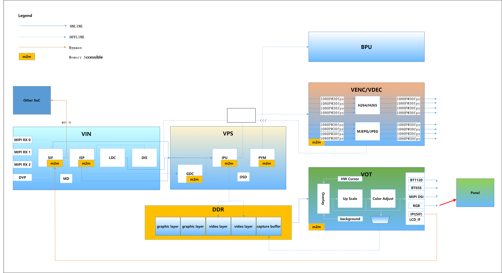

# 7.1 系统概述

## 概述

地平线提供的多媒体接口包含系统控制、视频输入、视频处理（ISP图像处理器、裁剪、缩放、旋转、矫正）、H.264/H.265/JPEG/MJPEG编码和解码、视频输出显示等功能，接口做了抽象化的封装，是底层级别的接口集合，这些底层接口通过更好地控制底层硬件模块来支持更加灵活的应用程序开发。

## 多媒体系统架构

地平线多媒体处理的主要内部处理流程如下图所示，主要分为视频输入（ VIN ）、视频处理（ VPS ）、视频编码（ VENC ）、视频解码（ VDEC ）、视频输出 (VOT) 、区域处理（ REGION ）、AI算法推理（BPU）等模块。

## 术语约定{#terminology}

| 缩写   | 全称                                | 解释                                                         |
| ------ | ----------------------------------- | ------------------------------------------------------------ |
| VIN    | Video IN                            | 包含视频处理接入、图像信号处理器、畸变矫正和防抖处理，接收来自sensor的数据并处理，也可以直接接收内存中的图像数据 |
| VPS    | Video Process System                | 包含图像旋转、图像裁剪、缩放功能，可对同一种输入源输出不同分辨率的图像。输入源可以是VIN模块，也可以是内存中的图像数据 |
| VENC   | Video Encode                        | VENC编码模块支持H.264/H.265/JPEG/MJPEG编码，VPS模块处理后的数据可通过编码模块按不同协议编码做码流输出 |
| VDEC   | Video Decode                        | VDEC解码模块支持H.264/H.265/JPEG/MJPEG解码，可对已编码的码流进行解码，交给VPS模块做进一步处理，输出到VOT模块进行显示 |
| VPU    | Video Processing Unit               | 视频处理单元，完成视频的编解码功能                           |
| JPU    | JPEG Processing Unit                | JPEG 图片处理单元，完成JPEG、MJPEG的编解码功能               |
| VOT    | Video Output                        | 视频输出模块接收VPS、VDEC的图像数据，可输出到显示设备        |
| VIO    | Video IN/OUT                        | 视频输入、输出，包括VIN和VOT模块                             |
| MIPI   | Mobile Industry Processor Interface | 移动产业处理器接口                                           |
| CSI    | Camera Serial Interface             | 相机串行接口。CSI接口与DSI接口同属一门，都是MIPI（移动产业处理器接口联盟）制定的一种接口规范 |
| DVP    | Digital Video Port                  | 数字视频端口                                                 |
| SIF    | Sensor Interface                    | sensor接口，用来接收mipi、dvp或者内存的图像数据              |
| ISP    | Image Signal Processor              | 图像信号处理器，完成图像的效果调校                           |
| LDC    | Lens Distortion Correction          | 镜头畸变校正                                                 |
| DIS    | Digital Image Stabilizer            | 数字图像稳定                                                 |
| DWE    | Dewarp Engine                       | 畸变矫正引擎，主要是将LDC和DIS集成在一起，包括LDC的畸变矫正和DIS的统计结果 |
| IPU    | Image Process Unit                  | 图像信号处理单元，支持图像的旋转、图像裁剪、缩放功能         |
| GDC    | Geometrical Distortion Correction   | 几何畸变矫正                                                 |
| PYM    | Pyramid                             | 图像金字塔                                                   |
| OSD    | On Screen Display                   | 视频图像叠层显示                                             |
| BPU    | Brain Process Unit                  | 地平线机器人自主研发的可编程AI加速引擎                       |
| HAL    | Hardware Abstraction Layer          | 硬件抽象层                                                   |
| FW     | Firmware                            | 固件                                                         |
| Sensor | Sensor                              | 如不做特别说明，特指CMOS图像传感器                           |
