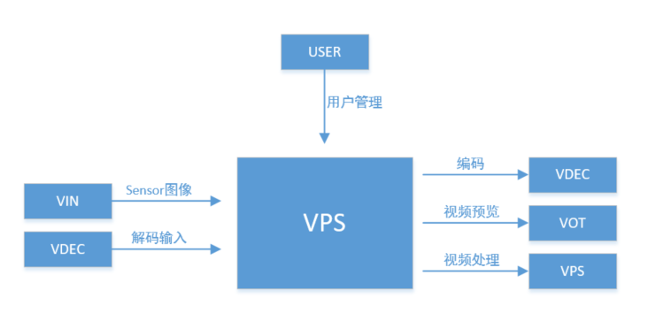
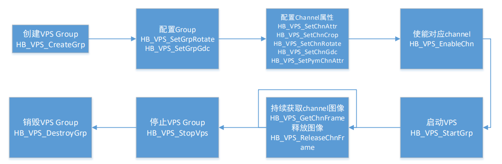
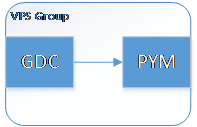
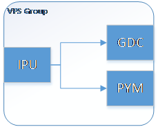
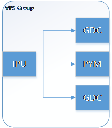

# 7.6 视频处理

## 概述
`VPS（Video Process System）`是视频处理系统，支持对图像进行缩小、放大、裁剪、旋转、GDC矫正、帧率控制以及金字塔图像输出。


## 功能描述
### 基本概念
- Group

  `VPS`对用户提供组的概念，各个`Group`分时复用`IPU`, `GDC`, `PYM`硬件，可以将多个`VPS Group`进行级联使用。

- Channel

  `VPS`的通道，一路通道代表`VPS`的一路输出。输出的通道主要分为普通图像通道和金字塔图像通道，普通通道输出缩放裁剪或旋转后的单层数据，金字塔通道输出多层金字塔缩放数据。
### 功能描述


`VPS`可以通过调用 [系统控制](./system_control) 提供的绑定接口与其他模块绑定，输入可以与`VIN`、`VDEC`模块绑定，`VPS`输出可以与`VOT`、`VENC`模块绑定，前者为`VPS`的输入源，后者为`VPS`的接收者，也可以与另一个`VPS`绑定实现更多的通道；支持处理用户回灌的图像数据。用户可以通过`VPS`接口对`Group`进行管理，每个`Group`仅可以与一个输入源绑定，每个`Channel`可以与不同的模块绑定。 `VPS`与`VIN`绑定场景下，需要调用`HB_SYS_SetVINVPSMode` 来配置`VIN`与`VPS`之间在线或离线的不同模式。


`VPS`硬件由一个`IPU`，一个`PYM`，两个`GDC`组成。共有7路输出`Channel`（chn0~chn6），chn0~chn4可以实现`downscale`，chn5可以实现`upscale`，chn0~chn5均可实现裁剪（ROI）、旋转、矫正、帧率控制，chn6为金字塔online Channel。虚框为硬件复用，其中`OSD`灰色块为CPU叠加，其余三个米色块为硬件叠加。
- Upscale功能：

  尺寸限制请参考下表

  支持水平方向最大1.5倍放大，宽度需为4的倍数，最小32x32，最大4096

  支持垂直方向最大1.5倍放大, 高度需为偶数，最小32x32，最大4096

  只有channel5支持Upscale功能

- Downscale功能：

  尺寸限制参考下表

  水平方向最大缩小为原尺寸的1/8（大于1/8）, 最小32x32，最大4096

  垂直方向最大缩小为原尺寸的1/8（大于1/8）, 最小32x32，最大4096

  Channel0~channel4支持Downscale功能

- IPU各通道的尺寸限制如下：

|Scaler| FIFO(bytes)| Resolution(pixel)|
|:-:|:-:|:-:|
|Scaler 5 (IPU US)| 4096 |8M|
|Scaler 2 (IPU DS2)| 4096 |8M|
|Scaler 1 (IPU DS1)| 2048 |2M|
|Scaler 3 (IPU DS3)| 2048 |2M|
|Scaler 4 (IPU DS4)| 1280 |1M|
|Scaler 0 (IPU DS0)| 1280 |1M|

- Crop功能：

  `VPS`可以对输入的图形进行裁剪，选择裁剪后的ROI区域去做放大或者缩小

- PYM金字塔处理功能：

  最大输入图像宽度4096，最大输入图像高度4096

  最小输入图像宽度64，最小输入图像高度64

  最大输出图像宽度4096，最大输出图像高度4096

  最小输出图像宽度48，最小输出图像高度32

  缩小图像层数24（0~23）层，其中0、4、8、12、16、20层为基础Base层，基础层每一层的size为上一层的1/2；其余层为ROI层，ROI层基于Base层作缩小（1、2、3层基于Base0层，5、6、7层基于Base4层，以此类推）各层可以单独使能，缩放区域、缩放系数可以配置放大图像层数为6（24~29）层，放大比例固定，分别为1.28、1.6、2、2.56、3.2、4倍。

  `PYM`通道也可以为0~5，此时为非online通道。
  
  每一个group下最多使用一个`PYM`。

### 注意事项
- `PYM`硬件要求最少使能BASE0层与BASE4层；

- `PYM`在online输入（chn6）时，PYM ds所有层（0~23）累计输出数据量不得大于输入数据量的2.5倍，us层（24~29）累计宽之和不得超过输入宽，否则会有未知风险；

- `IPU`绑定了`PYM`后，不能再绑定`VOT`/`VPS`/`VENC`等模块；

- `Rotate`旋转功能：

  `VPS`支持旋转90度、180度、270度，支持`Group旋转`与`Chnnel旋转`（二选一），`Group旋转`时`VPS`所有输出通道均旋转，`Chnnel旋转`可以将chn0~chn5中任意两路旋转，`PYM`处理过的通道不可以旋转。

- `Gdc`矫正功能：

  `VPS`支持输入矫正文件作图形畸变矫正，支持`Group矫正`与`Chnnel矫正`（二选一），`Group矫正`时`VPS`所有输出通道均作矫正，`Chnnel矫正`可以在chn0~chn5中任意两路作矫正。

- 帧率控制功能：

  `VPS`的channel0~5支持帧率控制，可以输出小于等于输入帧率的任意帧率。

## API参考
### HB_VPS_CreateGrp
【函数声明】
```c
int HB_VPS_CreateGrp(int VpsGrp, const VPS_GRP_ATTR_S *grpAttr);
```
【功能描述】
> 创建一个VPS Group

【参数描述】

| 参数名称 | 描述          | 输入/输出 |
| :------: | :------------ | :-------: |
|  VpsGrp  | Group号       |   输入    |
| grpAttr  | Group属性指针 |   输入    |

【返回值】

| 返回值 | 描述 |
| :----: | ---: |
|   0    | 成功 |
|  非0   | 失败 |

【注意事项】
> VPS最多可以创建8个Group；Group属性主要包含输入的宽、高和GDC的buf深度。

【参考代码】
> VPS参考代码

### HB_VPS_DestroyGrp
【函数声明】
```c
int HB_VPS_DestroyGrp(int VpsGrp);
```
【功能描述】
> 销毁一个VPS Group

【参数描述】

| 参数名称 | 描述    | 输入/输出 |
| :------: | :------ | :-------: |
|  VpsGrp  | Group号 |   输入    |

【返回值】

| 返回值 | 描述 |
| :----: | ---: |
|   0    | 成功 |
|  非0   | 失败 |

【注意事项】
> Group必须已经创建

【参考代码】
> 无

### HB_VPS_StartGrp
【函数声明】
```c
int HB_VPS_StartGrp(int VpsGrp);
```
【功能描述】
> 启动VPS Group处理

【参数描述】

| 参数名称 | 描述    | 输入/输出 |
| :------: | :------ | :-------: |
|  VpsGrp  | Group号 |   输入    |

【返回值】

| 返回值 | 描述 |
| :----: | ---: |
|   0    | 成功 |
|  非0   | 失败 |

【注意事项】
> Group必须已经创建

【参考代码】
> VPS参考代码

### HB_VPS_StopGrp
【函数声明】
```c
int HB_VPS_StopGrp(int VpsGrp);
```
【功能描述】
> 停止VPS Group处理

【参数描述】

| 参数名称 |    描述 | 输入/输出 |
| :------: | ------: | --------: |
|  VpsGrp  | Group号 |

【返回值】

| 返回值 | 描述 |
| :----: | ---: |
|   0    | 成功 |
|  非0   | 失败 |

【注意事项】
> Group必须已经创建并且已经启动

【参考代码】
> VPS参考代码

### HB_VPS_GetGrpAttr
【函数声明】
```c
int HB_VPS_GetGrpAttr(int VpsGrp, VPS_GRP_ATTR_S *grpAttr);
```
【功能描述】
> 获取VPS Group属性

【参数描述】

| 参数名称 | 描述           | 输入/输出 |
| :------: | :------------- | :-------: |
|  VpsGrp  | Group号        |   输入    |
| grpAttr  | 属性结构体指针 |   输出    |

【返回值】

| 返回值 | 描述 |
| :----: | ---: |
|   0    | 成功 |
|  非0   | 失败 |

【注意事项】
> 无

【参考代码】
> 无

### HB_VPS_SetGrpAttr
【函数声明】
```c
int HB_VPS_SetGrpAttr(int VpsGrp, const VPS_GRP_ATTR_S *grpAttr);
```
【功能描述】
> 设置VPS Group属性

【参数描述】

| 参数名称 | 描述           | 输入/输出 |
| :------: | :------------- | :-------: |
|  VpsGrp  | Group号        |   输入    |
| grpAttr  | 属性结构体指针 |   输入    |

【返回值】

| 返回值 | 描述 |
| :----: | ---: |
|   0    | 成功 |
|  非0   | 失败 |

【注意事项】
> 无

【参考代码】
> VPS参考代码

### HB_VPS_SetGrpRotate
【函数声明】
```c
int HB_VPS_SetGrpRotate(int VpsGrp, ROTATION_E enRotation);
```
【功能描述】
> 设置VPS Group旋转功能，使VPS的所有输出都旋转

【参数描述】

|  参数名称  | 描述     | 输入/输出 |
| :--------: | :------- | :-------: |
|   VpsGrp   | Group号  |   输入    |
| enRotation | 旋转参数 |   输入    |

【返回值】

| 返回值 | 描述 |
| :----: | ---: |
|   0    | 成功 |
|  非0   | 失败 |

【注意事项】
> 该接口需要在HB_VPS_SetChnAttr之前调用，GroupRotate使能之后禁止使能ChnRotate；isp绑定ipu必须得是offline模式

【参考代码】
> VPS参考代码

### HB_VPS_GetGrpRotate
【函数声明】
```c
int HB_VPS_Get GrpRotate(int VpsGrp, ROTATION_E *enRotation);
```
【功能描述】
> 获取VPS Group旋转功能属性

【参数描述】

|  参数名称  | 描述             | 输入/输出 |
| :--------: | :--------------- | :-------: |
|   VpsGrp   | Group号          |   输入    |
| enRotation | 旋转功能参数指针 |   输出    |

【返回值】

| 返回值 | 描述 |
| :----: | ---: |
|   0    | 成功 |
|  非0   | 失败 |

【注意事项】
> 无

【参考代码】
> 无

### HB_VPS_SetGrpRotateRepeat
【函数声明】
```c
int HB_VPS_SetGrpRotateRepeat(int VpsGrp, ROTATION_E enRotation);
```
【功能描述】
> 动态组旋转：该接口会保存当前group及后面绑定的多个VPS group所有通道配置，根据传的enRotation，自动重新计算旋转后所有通道的尺寸、roi区域，重新初始化group，重新绑定VIN；

【参数描述】

|  参数名称  | 描述     | 输入/输出 |
| :--------: | :------- | :-------: |
|   VpsGrp   | Group号  |   输入    |
| enRotation | 旋转参数 |   输入    |

【返回值】

| 返回值 | 描述 |
| :----: | ---: |
|   0    | 成功 |
|  非0   | 失败 |

【注意事项】
> 该接口暂时不支持配置过PYM的场景

【参考代码】
> 无

### HB_VPS_SetGrpGdc
【函数声明】
```c
int HB_VPS_SetGrpGdc(int VpsGrp, char* buf_addr, uint32_t buf_len, ROTATION_E enRotation)
```
【功能描述】
> 设置VPS Group GDC矫正功能，使VPS的所有输出都有矫正效果

【参数描述】

|  参数名称  | 描述         | 输入/输出 |
| :--------: | :----------- | :-------: |
|   VpsGrp   | Group号      |   输入    |
|  buf_addr  | 矫正文件地址 |   输入    |
|  buf_len   | 矫正文件长度 |   输入    |
| enRotation | 旋转参数     |   输入    |

【返回值】

| 返回值 | 描述 |
| :----: | ---: |
|   0    | 成功 |
|  非0   | 失败 |

【注意事项】
> 该接口需要在HB_VPS_SetChnAttr之前调用；根据不同的镜头，不同的畸变，不同的尺寸，需要传入不同矫正bin文件。

【参考代码】
> VPS参考代码

### HB_VPS_SendFrame
【函数声明】
```c
int HB_VPS_SendFrame(int VpsGrp, void* videoFrame, int ms);
```
【功能描述】
> 向VPS发送数据

【参数描述】

|  参数名称  | 描述                                                                                                      | 输入/输出 |
| :--------: | :-------------------------------------------------------------------------------------------------------- | :-------: |
|   VpsGrp   | Group号                                                                                                   |   输入    |
| videoFrame | 图像数据指针；VPS回灌数据结构为hb_vio_buffer_t结构；                                                      |   输入    |
|     ms     | 超时参数 ms设为-1 时，为阻塞接口；0 时为 非阻塞接口；大于 0 时为超时等待时间，超时时间的 单位为毫秒（ms） |   输入    |

【返回值】

| 返回值 | 描述 |
| :----: | ---: |
|   0    | 成功 |
|  非0   | 失败 |

【注意事项】
> 无

【参考代码】
> VPS参考代码

### HB_VPS_SetChnAttr
【函数声明】
```c
int HB_VPS_SetChnAttr(int VpsGrp, int VpsChn, const VPS_CHN_ATTR_S *chnAttr);
```
【功能描述】
> 设置VPS通道属性（设置IPU某个通道的输出尺寸）

【参数描述】

| 参数名称 | 描述         | 输入/输出 |
| :------: | :----------- | :-------: |
|  VpsGrp  | Group号      |   输入    |
|  VpsChn  | 通道号       |   输入    |
| chnAttr  | 通道属性指针 |   输入    |

【返回值】

| 返回值 | 描述 |
| :----: | ---: |
|   0    | 成功 |
|  非0   | 失败 |

【注意事项】
> 该接口支持动态配置IPU的输出尺寸，动态配置需要在StartGrp之后调用该接口，动态配置的新尺寸不可以比第一次初始化配置的尺寸大。如果需要启动以后从小尺寸改到大尺寸，那么需要在StartVps之前调用两次该接口，第一次传最大size，第二次传最小size。

【参考代码】
> VPS参考代码

### HB_VPS_GetChnAttr
【函数声明】
```c
int HB_VPS_GetChnAttr(int VpsGrp, int VpsChn, VPS_CHN_ATTR_S *chnAttr);
```
【功能描述】
> 获取VPS通道属性

【参数描述】

| 参数名称 | 描述         | 输入/输出 |
| :------: | :----------- | :-------: |
|  VpsGrp  | Group号      |   输入    |
|  VpsChn  | 通道号       |   输入    |
| chnAttr  | 通道属性指针 |   输出    |

【返回值】

| 返回值 | 描述 |
| :----: | ---: |
|   0    | 成功 |
|  非0   | 失败 |

【注意事项】
> 无

【参考代码】
> 无

### HB_VPS_EnableChn
【函数声明】
```c
int HB_VPS_EnableChn(int VpsGrp, int VpsChn);
```
【功能描述】
> 启用VPS通道

【参数描述】

| 参数名称 | 描述    | 输入/输出 |
| :------: | :------ | :-------: |
|  VpsGrp  | Group号 |   输入    |
|  VpsChn  | 通道号  |   输入    |

【返回值】

| 返回值 | 描述 |
| :----: | ---: |
|   0    | 成功 |
|  非0   | 失败 |

【注意事项】
> 如果未使能通道，GetChnFrame接口获取不到图像

【参考代码】
> VPS参考代码

### HB_VPS_DisableChn
【函数声明】
```c
int HB_VPS_DisableChn(int VpsGrp, int VpsChn);
```
【功能描述】
> 禁用VPS通道

【参数描述】

| 参数名称 | 描述    | 输入/输出 |
| :------: | :------ | :-------: |
|  VpsGrp  | Group号 |   输入    |
|  VpsChn  | 通道号  |   输入    |

【返回值】

| 返回值 | 描述 |
| :----: | ---: |
|   0    | 成功 |
|  非0   | 失败 |

【注意事项】
> 无

【参考代码】
> VPS参考代码

### HB_VPS_SetChnRotate
【函数声明】
```c
int HB_VPS_SetChnRotate(int VpsGrp, int VpsChn, ROTATION_E enRotation);
```
【功能描述】
> 设置VPS通道图像固定角度旋转

【参数描述】

|  参数名称  | 描述     | 输入/输出 |
| :--------: | :------- | :-------: |
|   VpsGrp   | Group号  |   输入    |
|   VpsChn   | 通道号   |   输入    |
| enRotation | 旋转属性 |   输入    |

【返回值】

| 返回值 | 描述 |
| :----: | ---: |
|   0    | 成功 |
|  非0   | 失败 |

【注意事项】
> SetChnRotate属性需要在SetChnAttr之后调用，最多同时支持两个CHN做旋转；启动以后也支持调用，可以动态控制通道旋转。

【参考代码】
> VPS参考代码

### HB_VPS_GetChnRotate
【函数声明】
```c
int HB_VPS_GetChnRotate(int VpsGrp, int VpsChn, ROTATION_E *enRotation);
```
【功能描述】
> 获取VPS通道图像旋转属性

【参数描述】

|  参数名称  | 描述     | 输入/输出 |
| :--------: | :------- | :-------: |
|   VpsGrp   | Group号  |   输入    |
|   VpsChn   | 通道号   |   输入    |
| enRotation | 旋转属性 |   输出    |

【返回值】

| 返回值 | 描述 |
| :----: | ---: |
|   0    | 成功 |
|  非0   | 失败 |

【注意事项】
> 无

【参考代码】
> 无

### HB_VPS_SetChnGdc
【函数声明】
```c
int HB_VPS_SetChnGdc(int VpsGrp, int VpsChn, char* buf_addr, uint32_t buf_len, ROTATION_E enRotation)
```
【功能描述】
> 设置VPS chn GDC矫正功能

【参数描述】

|  参数名称  | 描述         | 输入/输出 |
| :--------: | :----------- | :-------: |
|   VpsGrp   | Group号      |   输入    |
|   VpsChn   | Channel号    |   输入    |
|  buf_addr  | 矫正文件地址 |   输入    |
|  buf_len   | 矫正文件长度 |   输入    |
| enRotation | 旋转参数     |   输入    |

【返回值】

| 返回值 | 描述 |
| :----: | ---: |
|   0    | 成功 |
|  非0   | 失败 |

【注意事项】
> 该接口需要在HB_VPS_SetChnAttr之后调用，最多同时支持两个CHN做矫正；根据不同的镜头，不同的畸变，不同的尺寸，需要传入不同矫正bin文件。

【参考代码】
> VPS参考代码

### HB_VPS_UpdateGdcSize
【函数声明】
```c
int HB_VPS_UpdateGdcSize(int VpsGrp, int VpsChn, uint16_t out_width, uint16_t out_height)
```
【功能描述】
> 设置VPS GDC矫正输出尺寸（GDC输入输出尺寸默认是一致的，可以用该接口改变GDC输出的尺寸）

【参数描述】

|  参数名称  | 描述      | 输入/输出 |
| :--------: | :-------- | :-------: |
|   VpsGrp   | Group号   |   输入    |
|   VpsChn   | Channel号 |   输入    |
| out_width  | 输出宽度  |   输入    |
| out_height | 输出高度  |   输入    |

【返回值】

| 返回值 | 描述 |
| :----: | ---: |
|   0    | 成功 |
|  非0   | 失败 |

【注意事项】
> 该接口需要在HB_VPS_SetChnGdc和HB_VPS_SetGrpGdc之后调用，传入的输出尺寸需要与矫正bin文件对应；出入的尺寸不能比当前GDC输入的尺寸大

【参考代码】
> Group作gdc矫正时输出尺寸和输入尺寸不一致的场景：
```c
    ret = HB_VPS_SetGrpGdc(grp_id, bin_buf, buf_len, degree);
    ret = HB_VPS_UpdateGdcSize(grp_id, 0, 1280, 720);
```
> channel作gdc矫正时输出尺寸和输入尺寸不一致的场景：
```c
    ret = HB_VPS_SetChnGdc(grp_id, chn_id, bin_buf, buf_len, degree);
    ret = HB_VPS_UpdateGdcSize(grp_id, 0, 1280, 720);
```

### HB_VPS_SetChnCrop
【函数声明】
```c
int HB_VPS_SetChnCrop(int VpsGrp, int VpsChn, const VPS_CROP_INFO_S *cropInfo)
```
【功能描述】
> 设置VPS Chn裁剪功能

【参数描述】

| 参数名称 | 描述     | 输入/输出 |
| :------: | :------- | :-------: |
|  VpsGrp  | Group号  |   输入    |
|  VpsChn  | 通道号   |   输入    |
| cropInfo | 裁剪属性 |   输入    |

【返回值】

| 返回值 | 描述 |
| :----: | ---: |
|   0    | 成功 |
|  非0   | 失败 |

【注意事项】
> 需要在SetChnAttr之后调用；传入的ROI区域需要在IPU输入的size范围内；

【参考代码】
> VPS参考代码

### HB_VPS_GetChnCrop
【函数声明】
```c
int HB_VPS_GetChnCrop(int VpsGrp, int VpsChn, VPS_CROP_INFO_S *cropInfo)
```
【功能描述】
> 获取VPS Chn固定角度旋转

【参数描述】

| 参数名称 | 描述     | 输入/输出 |
| :------: | :------- | :-------: |
|  VpsGrp  | Group号  |   输入    |
|  VpsChn  | 通道号   |   输入    |
| cropInfo | 裁剪属性 |   输出    |

【返回值】

| 返回值 | 描述 |
| :----: | ---: |
|   0    | 成功 |
|  非0   | 失败 |

【注意事项】
> 无

【参考代码】
> 无

### HB_VPS_SetChnFrameRate
【函数声明】
```c
int HB_VPS_SetChnFrameRate(int VpsGrp, int VpsChn, FRAME_RATE_CTRL_S *frameRate)
```
【功能描述】
> 设置VPS通道帧率

【参数描述】

|         参数名称         | 描述    | 输入/输出 |
| :----------------------: | :------ | :-------: |
|          VpsGrp          | Group号 |   输入    |
|          VpsChn          | 通道号  |   输入    |
| frameRate	帧率属性结构体 | 输入    |

【返回值】

| 返回值 | 描述 |
| :----: | ---: |
|   0    | 成功 |
|  非0   | 失败 |

【注意事项】
> 无

【参考代码】
> 无

### HB_VPS_TriggerSnapFrame
【函数声明】
```c
int HB_VPS_TriggerSnapFrame(int VpsGrp, int VpsChn, uint32_t frameCnt)
```
【功能描述】
> 抓拍帧；从当前帧开始标记frameCnt帧

【参数描述】

| 参数名称 | 描述         | 输入/输出 |
| :------: | :----------- | :-------: |
|  VpsGrp  | Group号      |   输入    |
|  VpsChn  | 通道号       |   输入    |
| frameCnt | 抓拍帧的个数 |   输入    |

【返回值】

| 返回值 | 描述 |
| :----: | ---: |
|   0    | 成功 |
|  非0   | 失败 |

【注意事项】
> 启动以后才可以调用

【参考代码】
> 无

### HB_VPS_GetChnFrame
【函数声明】
```c
int HB_VPS_GetChnFrame(int VpsGrp, int VpsChn, void *videoFrame, int ms);
```
【功能描述】
> 从通道获取一帧处理完的图像

【参数描述】

|  参数名称  | 描述                                                                                                                    | 输入/输出 |
| :--------: | :---------------------------------------------------------------------------------------------------------------------- | :-------: |
|   VpsGrp   | Group号                                                                                                                 |   输入    |
|   VpsChn   | 通道号                                                                                                                  |   输入    |
| videoFrame | 图像信息                                                                                                                |   输出    |
|     ms     | 超时参数 <br/>ms设为-1 时，为阻塞接口；<br/>0 时为 非阻塞接口；<br/>大于 0 时为超时等待时间，超时时间的单位为毫秒（ms） |   输入    |

【返回值】

| 返回值 | 描述 |
| :----: | ---: |
|   0    | 成功 |
|  非0   | 失败 |

【注意事项】
> 获取到的图像结构分为正常BUF结构（hb_vio_buffer_t）和金字塔BUF结构（pym_buffer_t）

【参考代码】
> VPS参考代码

### HB_VPS_GetChnFrame_Cond
【函数声明】
```c
int HB_VPS_GetChnFrame_Cond(int VpsGrp, int VpsChn, void *videoFrame, int ms, int time);
```
【功能描述】
> 有条件的从通道获取一帧处理完的图像

【参数描述】

|  参数名称  | 描述                                                                                                                    | 输入/输出 |
| :--------: | :---------------------------------------------------------------------------------------------------------------------- | :-------: |
|   VpsGrp   | Group号                                                                                                                 |   输入    |
|   VpsChn   | 通道号                                                                                                                  |   输入    |
| videoFrame | 图像信息                                                                                                                |   输出    |
|     ms     | 超时参数 <br/>ms设为-1 时，为阻塞接口；<br/>0 时为 非阻塞接口；<br/>大于 0 时为超时等待时间，超时时间的单位为毫秒（ms） |   输入    |
|    time    | 时间条件：为0表示从当前开始丢弃旧帧，等待获取新的一帧，其余值未作支持                                                   |   输入    |

【返回值】

| 返回值 | 描述 |
| :----: | ---: |
|   0    | 成功 |
|  非0   | 失败 |

【注意事项】
> 获取到的图像结构分为正常BUF结构（hb_vio_buffer_t）和金字塔BUF结构（pym_buffer_t）

【参考代码】
> VPS参考代码

### HB_VPS_ReleaseChnFrame
【函数声明】
```c
int HB_VPS_ReleaseChnFrame(int VpsGrp, int VpsChn, void *videoFrame);
```
【功能描述】
> 释放一帧通道图像

【参数描述】

|  参数名称  | 描述     | 输入/输出 |
| :--------: | :------- | :-------: |
|   VpsGrp   | Group号  |   输入    |
|   VpsChn   | 通道号   |   输入    |
| videoFrame | 图像信息 |   输入    |

【返回值】

| 返回值 | 描述 |
| :----: | ---: |
|   0    | 成功 |
|  非0   | 失败 |

【注意事项】
> 无

【参考代码】
> VPS参考代码

### HB_VPS_SetPymChnAttr
【函数声明】
```c
int HB_VPS_SetPymChnAttr(int VpsGrp, int VpsChn, const VPS_PYM_CHN_ATTR_S *pymChnAttr);
```
【功能描述】
> 设置金字塔通道属性

【参数描述】

|  参数名称  | 描述               | 输入/输出 |
| :--------: | :----------------- | :-------: |
|   VpsGrp   | Group号            |   输入    |
|   VpsChn   | 通道号             |   输入    |
| pymChnAttr | 金字塔通道属性指针 |   输入    |

【返回值】

| 返回值 | 描述 |
| :----: | ---: |
|   0    | 成功 |
|  非0   | 失败 |

【注意事项】
1) 该接口支持动态配置PYM roi层的输出尺寸，需要在StartGrp之后调用该接口，动态配置的新roi size不可以比第一次初始化配置的size大。如果需要启动以后从小尺寸改到大尺寸，那么需要在StartVps之前调用两次该接口，第一次传最大size，第二次传最小size。
2) 该接口同时支持动态配置PYM的输入尺寸，仅在PYM回灌时有效，支持StartGrp以后src尺寸从大改小。

【参考代码】
> VPS参考代码

### HB_VPS_GetPymChnAttr
【函数声明】
```c
int HB_VPS_GetPymChnAttr(int VpsGrp, int VpsChn, VPS_PYM_CHN_ATTR_S *pymChnAttr);
```
【功能描述】
> 获取金字塔通道属性

【参数描述】

|  参数名称  |               描述 | 输入/输出 |
| :--------: | -----------------: | ---------: |
|   VpsGrp   |            Group号 |       输入 |
|   VpsChn   |             通道号 |       输入 |
| pymChnAttr | 金字塔通道属性指针 |       输出 |

【返回值】

| 返回值 | 描述 |
| :----: | ---: |
|   0    | 成功 |

【注意事项】
> 无

【参考代码】
> 无

### HB_VPS_ChangePymUs
【函数声明】
```c
int HB_VPS_ChangePymUs(int VpsGrp, uint8_t us_num, uint8_t enable)
```
【功能描述】
> 使能或关闭pym的us某一层

【参数描述】

| 参数名称 |       描述 | 输入/输出 |
| :------: | ---------: | ---------: |
|  VpsGrp  |    Group号 |       输入 |
|  us_num  | 金字塔us层 |       输入 |
|  enable  |     是使能 |       输入 |

【返回值】

| 返回值 | 描述 |
| :----: | ---: |
|   0    | 成功 |

【注意事项】
> 无

【参考代码】
> 无

### HB_VPS_GetChnFd
【函数声明】
```c
int HB_VPS_GetChnFd(int VpsGrp, int VpsChn);
```
【功能描述】
> 获取VPS通道对应的设备文件描述符，获得的fd可以作select监听，select返回后可以直接通过getChnFrame接口获得图像。

【参数描述】

| 参数名称 | 描述    | 输入/输出 |
| :------: | :------ | :-------: |
|  VpsGrp  | Group号 |   输入    |
|  VpsChn  | 通道号  |   输入    |

【返回值】

| 返回值 | 描述 |
| :----: | ---: |
| 正数值 | 成功 |
|  负值  | 失败 |

【注意事项】
> 无

【参考代码】
> 无

### HB_VPS_CloseChnFd
【函数声明】
```c
int HB_VPS_CloseChnFd(void);
```
【功能描述】
> 关闭VPS内所有的通道fd。

【参数描述】
> 无

【返回值】

| 返回值 | 描述 |
| :----: | ---: |
|   0    | 成功 |
|  非0   | 失败 |

【注意事项】
> 无

【参考代码】
> 无

### VPS参考代码
```c
    grp_attr.maxW = 1280;
    grp_attr.maxH = 720;
    ret = HB_VPS_CreateGrp(grp_id, &grp_attr);

    grp_attr.maxW = 1920;
    grp_attr.maxH = 1080;
    ret = HB_VPS_SetGrpAttr(grp_id, &grp_attr);

    ret = HB_VPS_SetGrpRotate(grp_id, ROTATION_90);
    ret = HB_VPS_SetGrpGdc(grp_id, bin_buf, bin_len, ROTATION_90);
    chn_attr.enScale = 1;
    chn_attr.width = 1280;
    chn_attr.height = 720;
    chn_attr.frameDepth = 8;
    ret = HB_VPS_SetChnAttr(grp_id, chn_id, &chn_attr);

    chn_crop_info.en = 1;
    chn_crop_info.cropRect.x = 0;
    chn_crop_info.cropRect.y = 0;
    chn_crop_info.cropRect.width = 1280;
    chn_crop_info.cropRect.height = 720;
    ret = HB_VPS_SetChnCrop(grp_id, chn_id, &chn_crop_info);

    ret = HB_VPS_EnableChn(grp_id, chn_id);

    ret = HB_VPS_SetChnRotate(grp_id, chn_id, ROTATION_90);

    ret = HB_VPS_SetChnGdc(grp_id, chn_id, bin_buf, bin_len, ROTATION_90);

    pym_chn_attr.timeout = 2000;
    pym_chn_attr.ds_layer_en = 24;
    pym_chn_attr.us_layer_en = 0;
    pym_chn_attr.frame_id = 0;
    pym_chn_attr.frameDepth = 8;
    ret = HB_VPS_SetPymChnAttr(grp_id, pym_chn, &pym_chn_attr);

    ret = HB_VPS_StartGrp(grp_id);

    ret = HB_VPS_SendFrame(grp_id, feedback_buf, 1000);
    ret = HB_VPS_GetChnFrame(grp_id, chn_id, &out_buf, 2000);
    ret = HB_VPS_ReleaseChnFrame(grp_id, chn_id, &out_buf);
    ret = HB_VPS_DisableChn(grp_id, chn_id);
    ret = HB_VPS_StopGrp(grp_id);
    ret = HB_VPS_DestroyGrp(grp_id);
```

### VPS接口调用流程
VPS初始化接口主要分为Group的初始化和Channel的初始化，Group的接口可视为全局配置，Group属性对整个VPS输出均生效，Channel的接口是用作对多个输出通道分别配置，配置的属性仅对当前channel有效；初始化时需要先配置Group属性，然后再分别配置每个channel属性。



### VPS场景使用说明
VPS内部主要由一个IPU、一个PYM、两个GDC共四个模块组成，根据接口的调用顺序将不同的模块动态绑定在一起，可以单独一个模块运行，也可以多个模块组合运行，不同的链接关系对应的接口调用流程如下：


如果仅用IPU一个模块，在创建Group之后只调用HB_VPS_SetChnAttr，如果需要IPU输出多个通道，那么需要多次调用该接口。


如果仅使用GDC一个模块，在创建Group之后调用HB_VPS_SetGrpGdc/Rotate接口。


如果仅使用PYM一个模块，在创建Group之后调用HB_VPS_SetPymChnAttr接口。


IPU作为第一个模块，PYM作为第二个模块，需要创建Group之后先调用HB_VPS_SetChnAttr，然后调用HB_VPS_SetPymChnAttr。


GDC放在IPU之前，先调用HB_VPS_SetGrpGdc/Rotate，再调用HB_VPS_SetChnAttr。



GDC放在PYM之前，先调用HB_VPS_SetGrpGdc/Rotate，再调用HB_VPS_SetPymChnAttr。


IPU放在GDC之前，先调用HB_VPS_SetChnAttr，再调用HB_VPS_SetChnGdc/Rotate。


先IPU然后GDC再PYM的话，需要先调用HB_VPS_SetChnAttr，再调用HB_VPS_SetChnGdc/Rotate，最后调用HB_VPS_SetPymChnAttr。



如果需要IPU输出的多个通道分别接GDC和PYM，那么需要先调用HB_VPS_SetChnAttr(chnA)、HB_VPS_SetChnAttr(chnB)，然后HB_VPS_SetChnGdc/Rotate(chnA)，然后HB_VPS_SetPymChnAttr(chnB)。


HB_VPS_SetChnAttr(chnA)、HB_VPS_SetChnAttr(chnB)，然后HB_VPS_SetChnGdc/Rotate(chnA)，然后HB_VPS_SetChnGdc/Rotate(chnB)，最后HB_VPS_SetPymChnAttr(chnB)。



HB_VPS_SetChnAttr(chnA)、HB_VPS_SetChnAttr(chnB)、HB_VPS_SetChnAttr(chnC)，然后HB_VPS_SetChnGdc/Rotate(chnA) ， HB_VPS_SetPymChnAttr(chnB)，HB_VPS_SetChnGdc/Rotate(chnC)。


如果需要VPS中四个模块串一起跑，需要HB_VPS_SetGrpGdc、HB_VPS_SetChnAttr(chnA)，HB_VPS_SetChnRotate(chnA)、HB_VPS_SetPymChnAttr(chnA)。

## 数据结构
### HB_VPS_GRP_ATTR_S
【结构定义】
```c
typedef struct HB_VPS_GRP_ATTR_S {
	uint32_t		maxW;
	uint32_t		maxH;
    uint8_t 	frameDepth;
	int				pixelFormat;
} VPS_GRP_ATTR_S;
```
【功能描述】
> VPS组的属性结构体

【成员说明】

|    成员     |                             含义                             |
| :---------: | :----------------------------------------------------------: |
|    maxW     |                     VPS输入图像最大宽度                      |
|    maxH     |                     VPS输入图像最大高度                      |
| frameDepth  | Gdc申请的buf个数，如果是vps绑定了vot，需要注意frameDepth不能大于6，iar输入的buffer个数实际是8，gdc的话是framedepth+2，iar里面会判断gdc送过来index（下标从0开始算）不能大于等于8 |
| pixelFormat |       像素格式（VPS只支持nv12一种格式，当前参数预留）        |

### HB_RECT_S
【结构定义】
```c
typedef struct HB_RECT_S {
    uint16_t    x;
    uint16_t    y;
    uint16_t    width;
    uint16_t    height;
} RECT_S;
```
【功能描述】
> 定义矩形区域

【成员说明】

|  成员  |   含义    |
| :----: | :-------: |
|   x    | 起始x坐标 |
|   y    | 起始y坐标 |
| width  |  图像宽   |
| height |  图像高   |

### HB_VPS_CROP_INFO_S
【结构定义】
```c
typedef HB_VPS_CROP_INFO_S {
    bool        en;
    RECT_S      cropRect;
} VPS_CROP_INFO_S;
```
【功能描述】
> 裁剪信息结构体

【成员说明】

|   成员   |     含义     |
| :------: | :----------: |
|    en    | 裁剪是否使能 |
| cropRect |  裁剪的区域  |

### HB_FRAME_RATE_CTRL_S
【结构定义】
```c
typedef HB_FRAME_RATE_CTRL_S {
    uint32		srcFrameRate;
    uin32		dstFrameRate;
} FRAME_RATE_CTRL_S;
```
【功能描述】
> 帧率控制信息结构体，dstFrameRate不得大于srcFrameRate

【成员说明】

|     成员     |     含义     |
| :----------: | :----------: |
| srcFrameRate | 输入视频帧率 |
| dstFrameRate | 目标视频帧率 |

### HB_VPS_CHN_ATTR_S
【结构定义】
```c
typedef struct HB_VPS_CHN_ATTR_S {
    uint32_t		width;
	uint32_t		height;
	int			pixelFormat;
	uint8_t		enMirror;
	uint8_t		enFlip;
	uint8_t		enScale;
	uint32_t		frameDepth;
	FRAME_RATE_CTRL_S	frameRate;
} VPS_CHN_ATTR_S;
```
【功能描述】
> 通道输出属性结构体

【成员说明】

|    成员     |                             含义                             |
| :---------: | :----------------------------------------------------------: |
|    width    |                          图像输出宽                          |
|   height    |                          图像输出高                          |
| pixelFormat |           像素格式（VPS目前输出只有nv12一种格式）            |
|  enMirror   | 镜像使能,VPS不支持此功能，可以使用isp接口的HB_VIN_CtrlPipeMirror去水平镜像 |
|   enFlip    |     翻转使能，VPS不支持此功能，需要使用sensor的上下翻转      |
|   enScale   |                           缩放使能                           |
| frameDepth  |                         图像队列长度                         |
|  frameRate  | 帧率控制（此帧率不生效，可以使用HB_VPS_SetChnFrameRate接口实现帧率控制） |

### HB_ROTATION_E
【结构定义】
```c
typedef enum HB_ROTATION_E {
    ROTATION_0      = 0,
    ROTATION_90     = 1,
    ROTATION_180    = 2,
    ROTATION_270    = 3,
    ROTATION_MAX
} ROTATION_E;
```
【功能描述】
> 旋转枚举

【成员说明】

|     成员     |     含义     |
| :----------: | :----------: |
|  ROTATION_0  |    不旋转    |
| ROTATION_90  |   旋转90度   |
| ROTATION_180 |  旋转180度   |
| ROTATION_270 |  旋转270度   |
| ROTATION_MAX | 枚举的最大值 |

### DYNAMIC_SRC_INFO_S
【结构定义】
```c
typedef struct HB_VPS_DYNAMIC_SRC_INFO_S {
	uint8_t 	src_change_en;
	uint16_t 	new_width;
	uint16_t 	new_height;
} DYNAMIC_SRC_INFO_S;
```

【功能描述】
> 金字塔动态改变输入size配置结构体

【成员说明】

|     成员      |       含义       |
| :-----------: | :--------------: |
| src_change_en | 使能输入size改变 |
|   new_width   |        宽        |
|  new_height   |        高        |

### HB_PYM_SCALE_INFO_S
【结构定义】
```c
typedef struct HB_PYM_SCALE_INFO_S {
	uint8_t		factor;
	uint16_t		roi_x;
	uint16_t		roi_y;
	uint16_t		roi_width;
	uint16_t		roi_height;
} PYM_SCALE_INFO_S;

```
【功能描述】
> 金字塔裁剪缩放属性结构体

【成员说明】

|    成员    |                             含义                             |
| :--------: | :----------------------------------------------------------: |
|   factor   | 缩放参数（1~63），对于缩小得层，缩放公式是factor/(factor+64),对于放大得层对应是64/factor，因为放大层是固定的倍数，也即对应放大层24的factor固定是50，25层的factor固定是40，26层factor固定是32，27层factor固定是25，28层factor固定是20，29层factor固定是16 |
|   roi_x    |                          起始x坐标                           |
|   roi_y    |                          起始y坐标                           |
| roi_width  |                            图像宽                            |
| roi_height |                            图像高                            |

### HB_VPS_PYM_CHN_ATTR_S
【结构定义】
```c
typedef struct HB_VPS_PYM_CHN_ATTR_S {
	uint32_t		frame_id;
	uint32_t		ds_uv_bypass;
	uint16_t		ds_layer_en;
	uint8_t		us_layer_en;
	uint8_t		us_uv_bypass;
	int			timeout;
	uint32_t		frameDepth;
    DYNAMIC_SRC_INFO_S	dynamic_src_info;
#define			MAX_PYM_DS_NUM			24
#define			MAX_PYM_US_NUM			6
	PYM_SCALE_INFO_S ds_info[MAX_PYM_DS_NUM];
	PYM_SCALE_INFO_S us_info[MAX_PYM_US_NUM];
} VPS_PYM_CHN_ATTR_S;
```
【功能描述】
> 辅助通道属性结构体

【成员说明】

|     成员     |         含义         |
| :----------: | :------------------: |
|   frame_id   |       帧ID使能       |
| ds_uv_bypass |   DS层uv分量bypass   |
| ds_layer_en  | DS层使能层数（4~23） |
| us_layer_en  | US层使能层数（0~6）  |
| us_uv_bypass |   US层uv分量bypass   |
|   timeout    |       超时时间       |
|  frameDepth  |     图像队列长度     |
|   ds_info    |      DS缩放信息      |
|   us_info    |      US缩放信息      |

### HB_DIS_MV_INFO_S
【结构定义】
```c
typedef struct HB_DIS_MV_INFO_S {
    int    gmvX;
    int    gmvY;
    int    xUpdate;
    int    yUpdate;
} DIS_MV_INFO_S;
```
【功能描述】
> 偏移信息结构体

【成员说明】

|  成员   |     含义     |
| :-----: | :----------: |
|  gmvX   | 横坐标偏移值 |
|  gmvY   | 纵坐标偏移值 |
| xUpdate |   X更新值    |
| yUpdate |   Y更新值    |

## 错误码

|    错误码    |                       宏定义 |                   描述 |
| :----------: |: --------------------------- | :--------------------- |
| -268,696,577 |   HB_ERR_VPS_INVALID_GROUPID |               非法组号 |
| -268,696,578 |            HB_ERR_VPS_BUFMGR |             帧队列错误 |
| -268,696,579 |        HB_ERR_VPS_GROUP_FAIL |                 组失败 |
| -268,696,580 |     HB_ERR_VPS_GROUP_UNEXIST |               组不存在 |
| -268,696,581 |       HB_ERR_VPS_CHN_UNEXIST |             通道不存在 |
| -268,696,582 |            HB_ERR_VPS_ROTATE |               旋转失败 |
| -268,696,583 |         HB_ERR_VPS_NULL_PARA |           参数NULL指针 |
| -268,696,584 |           HB_ERR_VPS_BAD_ARG |               非法参数 |
| -268,696,585 |       HB_ERR_VPS_UN_PREPARED |               未准备好 |
| -268,696,586 |         HB_ERR_VPS_SENDFRAME |           回灌图像失败 |
| -268,696,587 |       HB_ERR_VPS_CHN_DISABLE |             通道未使能 |
| -268,696,588 |           HB_ERR_VPS_TIMEOUT |                   超时 |
| -268,696,589 |            HB_ERR_VPS_CHN_FD | 获取通道文件描述符失败 |
| -268,696,590 |   HB_ERR_VPS_SET_AFTER_START |     不允许启动以后配置 |
| -268,696,591 |  HB_ERR_VPS_SET_BEFORE_START |       不允许启动前配置 |
| -268,696,592 | HB_ERR_VPS_SET_AT_WRONG_TIME |       在不允许时刻配置 |
| -268,696,593 |   HB_ERR_VPS_UN_SUPPORT_SIZE |           不支持的尺寸 |
| -268,696,594 |     HB_ERR_VPS_FRAME_UNEXIST |         不存在的帧图像 |
| -268,696,595 |    HB_ERR_VPS_DEV_FRAME_DROP |               硬件丢帧 |
| -268,696,596 |        HB_ERR_VPS_NOT_ENOUGH |             缓冲帧不够 |
| -268,696,597 |   HB_ERR_VPS_UN_SUPPORT_RATE |           不支持的帧率 |
| -268,696,598 |        HB_ERR_VPS_FRAME_RATE |               帧率错误 |

## 参考代码
VPS部分示例代码可以参考，[sample_vps](./multimedia_samples#sample_vps)和[sample_vps_zoom](./multimedia_samples#sample_vps_zoom)。
