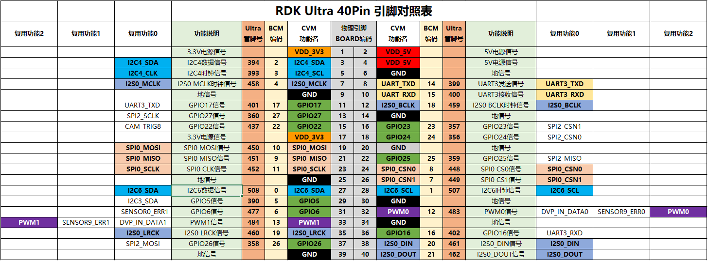

# 管脚配置与定义

开发板上的40PIN功能管脚，接口定义请查看[40PIN管脚定义](#40pin_define)章节。

## 管脚复用关系配置

40PIN的管脚会按照 [40PIN管脚定义](#40pin_define) 所示，默认使能UART、SPI、I2C、I2S等专用功能，如需将特定管脚配置成GPIO功能，需要通过`srpi-config`图形化配置工具进行配置。

注意，`srpi-config`程序需要在**全屏命令行窗口**中运行，方法如下：

```
sudo srpi-config
```


`okay`配置对应管脚为专用功能，`disabled`配置对应管脚为GPIO模式，配置 **重启** 后生效。

- 键盘上、下键选择功能项， 回车键开关功能
- 键盘左、右键选择  Select 和 Exit ，回车键确认

## 40PIN管脚定义{#40pin_define}

开发板提供40PIN标准接口，方便用户进行外围扩展，其中数字IO采用3.3V电平设计。40PIN接口定义如下：  


开发板40PIN接口位置提供了丝印网表，方便用户对照操作，PIN1、PIN40位置如下：  


:::info
RDK X3 Module 外扩40PIN管脚及其定义如下：
:::


:::info
RDK Ultra 外扩40PIN管脚及其定义如下：
:::
