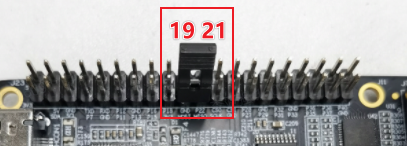

# 使用SPI

RDK X3在40Pin上物理管脚 `19, 21, 23, 24`引出了旭日X3M芯片的 `SPI2` 总线，支持一个片选，IO电压3.3V。

RDK Ultra在40Pin上物理管脚 `19, 21, 23, 24, 26`引出了的 `SPI0` 总线，支持两个片选，IO电压3.3V。

请参阅 `/app/40pin_samples/test_spi.py`了解如何使用SPI的详细信息。

## 回环测试
把MISO和MOSI在硬件上进行连接，然后运行spi测试程序，进行写和读操作，预期结果是读出的数据要完全等于写入的数据

### 硬件连接
把MISO和MOSI通过跳线帽直接硬件上连接在一起



### 测试过程

- 运行 `python3 /app/40pin_samples/test_spi.py`
- 从打印的spi控制器中选择总线号和片选号作为输入选项，例如选择测试 `spidev0.0`，则`bus num` 和 `cs num`都是`0`，按回车键确认：

```
List of enabled spi controllers:
/dev/spidev0.0  /dev/spidev0.1
Please input SPI bus num:0
Please input SPI cs num:0
```

- 程序正确运行起来后会持续打印 `0x55 0xAA`，如果打印的是 `0x00 0x00`，那么就说明spi的回环测试失败。

```
Starting demo now! Press CTRL+C to exit
0x55 0xAA
0x55 0xAA
```

## 测试代码

```python
#!/usr/bin/env python3

from __future__ import print_function
import sys
import os
import time

# 导入spidev模块
import spidev

def BytesToHex(Bytes):
    return ''.join(["0x%02X " % x for x in Bytes]).strip()

def spidevTest():
    # 设置spi的bus号（0, 1, 2）和片选(0, 1)
    spi_bus = input("Please input SPI bus num:")
    spi_device = input("Please input SPI cs num:")
    # 创建spidev类的对象以访问基于spidev的Python函数。
    spi=spidev.SpiDev()
    # 打开spi总线句柄
    spi.open(int(spi_bus), int(spi_device))

    # 设置 spi 频率为 12MHz
    spi.max_speed_hz = 12000000

    print("Starting demo now! Press CTRL+C to exit")

    # 发送 [0x55, 0xAA], 接收 到的应该也是 [0x55, 0xAA]
    try:
        while True:
            resp = spi.xfer2([0x55, 0xAA])
            print(BytesToHex(resp))
            time.sleep(1)

    except KeyboardInterrupt:
        spi.close()

if __name__ == '__main__':
    print("List of enabled spi controllers:")
    os.system('ls /dev/spidev*')

    spidevTest()
```

