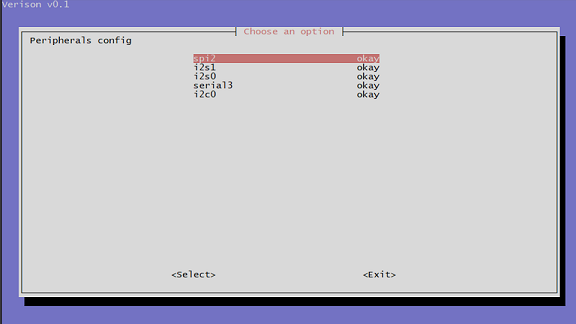

# 5.1 40PIN功能使用

开发板上的40PIN功能管脚，接口定义请查看[40PIN管脚定义](#40pin_define)章节。

## 管脚复用关系配置

40PIN的管脚会按照 [40PIN管脚定义](#40pin_define) 所示，默认使能UART、SPI、I2C、I2S等专用功能，如需将特定管脚配置成GPIO功能，需要通过`srpi-config`图形化配置工具进行配置。

注意，`srpi-config`程序需要在**全屏命令行窗口**中运行，方法如下：

```
sudo srpi-config
```



`okay`配置对应管脚为专用功能，`disabled`配置对应管脚为GPIO模式，配置 **重启** 后生效。

- 键盘上、下键选择功能项， 回车键开关功能
- 键盘左、右键选择  Select 和 Exit ，回车键确认

## 40PIN管脚定义{#40pin_define}

开发板提供40PIN标准接口，方便用户进行外围扩展，其中数字IO采用3.3V电平设计。40PIN接口定义如下：  


开发板40PIN接口位置提供了丝印网表，方便用户对照操作，PIN1、PIN40位置如下：  


RDK X3 Module 外扩40PIN管脚及其定义如下：


## 使用GPIO功能

开发板预置了GPIO Python库`Hobot.GPIO`，用户可以通过如下命令导入GPIO库。

```shell
sunrise@ubuntu:~$ sudo python3
Python 3.8.10 (default, Mar 15 2022, 12:22:08) 
Type "help", "copyright", "credits" or "license" for more information.
>>> import Hobot.GPIO as GPIO
Get board ID: 0x504
>>> GPIO.VERSION
'0.0.2'
>>> GPIO.model
'X3PI'
```

### 设置引脚编码方式

开发板的引脚编码有4种模式：

- BOARD：物理引脚序号，与开发板的丝印序号一一对应。
- BCM：根据博通SoC制定的GPIO命名规则。
- CVM： 使用字符串代替数字，对应于CVM / CVB连接器的信号名称。
- SOC： 对应的编号是旭日X3M芯片的GPIO管脚序号，与芯片数据手册一一对应。

本文推荐用户使用`BOARD`编码模式，设置编码的方式如下：

```python
GPIO.setmode(GPIO.BOARD)
# or
GPIO.setmode(GPIO.BCM)
# or
GPIO.setmode(GPIO.CVM)
# or 
GPIO.setmode(GPIO.SOC)
```

查询编码方式：

```python
mode = GPIO.getmode()
```

程序会输出 `BOARD, BCM, CVM, SOC or None` 其中的一种结果。

### 警告信息

以下几种情况下运行代码，会有警告日志输出，但并不会影响正常功能：

 - 用户尝试使用的GPIO，已在其他应用程序中使用；
 - 在设置模式和通道之前，尝试调用 `GPIO.cleanup` 清理管脚；

如要屏蔽警告信息，可通过如下命令实现：

```python
GPIO.setwarnings(False)
```

### 管脚配置

GPIO管脚在使用之前，需要进行相应的配置，具体如下：

设置为输入的方式如下：
```python
GPIO.setup(channel, GPIO.IN)
```

设置为输出的方式如下：

```python
GPIO.setup(channel, GPIO.OUT)
```

也可以为输出通道指定一个初始值，例如：

```python
GPIO.setup(channel, GPIO.OUT, initial=GPIO.HIGH)
```

另外，工具支持同时设置多个输出通道，例如：

```python
# set gpio(18,12,13) to output
channels = [18, 12, 13]
GPIO.setup(channels, GPIO.OUT)
```

### 输入操作

要读取通道的值，请使用：

```python
GPIO.input(channel)
```

命令返回值为 0 或者 1。 0 代表 GPIO.LOW， 1 代表 GPIO.HIGH。

### 输出操作

要设置通道的输出值，请使用：

```python
GPIO.output(channel, state)
```

其中 state 可以是 GPIO.LOW 或 GPIO.HIGH。

### 清理管脚占用

在程序推出前，推荐进行通道清理动作，请使用：

```python
GPIO.cleanup()
```

如果只想清理特定通道，请使用：

```python
# 清除单个通道
GPIO.cleanup(channel)
# 清除一组通道
GPIO.cleanup( (channel1, channel2) )
GPIO.cleanup( [channel1, channel2] )
```

### 查看管脚状态

此功能允许您检查对应 GPIO 通道的功能：

```python
GPIO.gpio_function(channel)
```

该函数返回 IN 或 OUT。

### 边沿检测与中断

边沿是电信号`从低到高`（上升沿）或`从高到低`（下降沿）的变化，这种改变可以看作是一种事件的发生，这种事件可以用来触发CPU中断信号。

GPIO库提供了三种方法来检测输入事件：

#### wait_for_edge() 函数

此函数阻塞调用线程，直到检测到对应的边缘变化。函数调用如下：

```python
GPIO.wait_for_edge(channel, GPIO.RISING)
```

其中，第二个参数指定要检测的边沿，取值范围为`GPIO.RISING、GPIO.FALLING 或 GPIO.BOTH`。如果要指定等待时间，可以选择设置超时：

```python
# 超时以毫秒为单位
GPIO.wait_for_edge(channel, GPIO.RISING, timeout=500)
```

在超时时间内外部信号发生变化，函数返回检测的通道号；如果发生超时，函数返回None。

#### event_detected() 函数

此函数可用于定期检查自上次调用以来是否发生了事件。该函数可以按如下方式设置和调用：

```python
# 在通道GPIO上设置上升沿检测
GPIO.add_event_detect(channel, GPIO.RISING)
if GPIO.event_detected(channel):
    print("Rising edge event detected")
```

您可以检测 GPIO.RISING、GPIO.FALLING 或 GPIO.BOTH 的事件。

#### 检测到边沿事件时运行回调函数

此功能可用于注册回调函数，回调函数运行在独立的处理线程中，使用说明如下：

```python
# define callback function
def callback_fn(channel):
    print("Callback called from channel %s" % channel)

# enable rising detection
GPIO.add_event_detect(channel, GPIO.RISING, callback=callback_fn)
```

如有需要，也可以添加多个回调，方法如下：

```python
def callback_one(channel):
    print("First Callback")

def callback_two(channel):
    print("Second Callback")

GPIO.add_event_detect(channel, GPIO.RISING)
GPIO.add_event_callback(channel, callback_one)
GPIO.add_event_callback(channel, callback_two)
```

由于所有回调函数运行在同一线程上，因此不同的回调是按顺序运行的，而不是同时运行。

为了通过将多个事件合并为一个事件来防止多次调用回调函数，可以选择设置去抖动时间：

```python
# bouncetime unit is ms
GPIO.add_event_detect(channel, GPIO.RISING, callback=callback_fn, bouncetime=200)
```

#### 关闭中断

如果不再需要边沿检测，可以将其删除，如下所示：

```python
GPIO.remove_event_detect(channel)
```

### 测试例程

在 `/app/40pin_samples/`目录下提供主要的测试例程：

| 测试例程名             | 说明                                          |
| ---------------------- | --------------------------------------------- |
| simple_out.py          | 单个管脚`输出`测试                            |
| simple_input.py        | 单个管脚`输入`测试                            |
| button_led.py          | 一个管脚作为按键输入，一个管脚作为输出控制LED |
| test_all_pins_input.py | 所有管脚的`输入测试`代码                      |
| test_all_pins.py       | 所有管脚的`输出测试`代码                      |
| button_event.py        | 捕获管脚的上升沿、下降沿事件                  |
| button_interrupt.py    | 中断方式处理管脚的上升沿、下降沿事件          |

- GPIO 设置为`输出模式`，1秒钟切换输出电平，可以用于控制LED灯的循环亮灭， 测试代码 `simple_out.py`：

```python
#!/usr/bin/env python3

import Hobot.GPIO as GPIO
import time

# 定义使用的GPIO通道为38
output_pin = 38 # BOARD 编码 38

def main():
    # 设置管脚编码模式为硬件编码 BOARD
    GPIO.setmode(GPIO.BOARD)
    # 设置为输出模式，并且初始化为高电平
    GPIO.setup(output_pin, GPIO.OUT, initial=GPIO.HIGH)
    # 记录当前管脚状态
    curr_value = GPIO.HIGH
    print("Starting demo now! Press CTRL+C to exit")
    try:
        # 间隔1秒时间，循环控制LED灯亮灭
        while True:
            time.sleep(1)
            GPIO.output(output_pin, curr_value)
            curr_value ^= GPIO.HIGH
    finally:
        GPIO.cleanup()

if __name__=='__main__':
    main()
```

- GPIO 设置为`输入模式`，通过忙轮询方式读取管脚电平值，测试代码 `simple_input.py`：

```python
#!/usr/bin/env python3

import Hobot.GPIO as GPIO
import time

# 定义使用的GPIO通道为38
input_pin = 38 # BOARD 编码 38 

def main():
    prev_value = None

    # 设置管脚编码模式为硬件编码 BOARD
    GPIO.setmode(GPIO.BOARD)
    # 设置为输入模式
    GPIO.setup(input_pin, GPIO.IN)

    print("Starting demo now! Press CTRL+C to exit")
    try:
        # 间隔1秒时间，循环控制LED灯亮灭
        while True:
            # 读取管脚电平
            value = GPIO.input(input_pin)
            if value != prev_value:
                if value == GPIO.HIGH:
                    value_str = "HIGH"
                else:
                    value_str = "LOW"
                print("Value read from pin {} : {}".format(input_pin, value_str))
                prev_value = value
            time.sleep(1)
    finally:
        GPIO.cleanup()

if __name__=='__main__':
    main()

```

- GPIO 设置为输入模式，捕获管脚的上升沿、下降沿事件，测试代码 `button_event.py`, 实现检测38号管脚的下降沿，然后控制36号管脚的输出：

```python
#!/usr/bin/env python3

import Hobot.GPIO as GPIO
import time

# 定义使用的GPIO通道：
# 36号作为输出，可以点亮一个LED
# 38号作为输入，可以接一个按钮
led_pin = 36 # BOARD 编码 36
but_pin = 38 # BOARD 编码 38

# 禁用警告信息
GPIO.setwarnings(False)

def main():
    # 设置管脚编码模式为硬件编码 BOARD
    GPIO.setmode(GPIO.BOARD)
    GPIO.setup(led_pin, GPIO.OUT)  # LED pin set as output
    GPIO.setup(but_pin, GPIO.IN)  # button pin set as input

    # Initial state for LEDs:
    GPIO.output(led_pin, GPIO.LOW)

    print("Starting demo now! Press CTRL+C to exit")
    try:
        while True:
            print("Waiting for button event")
            GPIO.wait_for_edge(but_pin, GPIO.FALLING)

            # event received when button pressed
            print("Button Pressed!")
            GPIO.output(led_pin, GPIO.HIGH)
            time.sleep(1)
            GPIO.output(led_pin, GPIO.LOW)
    finally:
        GPIO.cleanup()  # cleanup all GPIOs

if __name__ == '__main__':
    main()
```

- GPIO 设置为输入模式，启动gpio中断功能，响应管脚的上升沿、下降沿事件，测试代码 `button_interrupt.py`, 实现检测38号管脚的下降沿，然后控制36号管脚快速切换高低电平5秒钟：

```python
#!/usr/bin/env python3

import Hobot.GPIO as GPIO
import time

# Pin Definitions:
led_pin_1 = 12
led_pin_2 = 13
but_pin = 18

# 定义使用的GPIO通道：
# 35号作为输出，可以点亮一个LED
# 36号作为输出，可以点亮一个LED
# 38号作为输入，可以接一个按钮
led_pin = 35 # BOARD 编码 36
led_pin2 = 36 # BOARD 编码 36
but_pin = 38 # BOARD 编码 38

# 禁用警告信息
GPIO.setwarnings(False)

# 按下按钮时 LED 2 快速闪烁 5 次
def blink(channel):
    print("Blink LED 2")
    for i in range(5):
        GPIO.output(led_pin_2, GPIO.HIGH)
        time.sleep(0.5)
        GPIO.output(led_pin_2, GPIO.LOW)
        time.sleep(0.5)

def main():
    # Pin Setup:
    GPIO.setmode(GPIO.BOARD)  # BOARD pin-numbering scheme
    GPIO.setup([led_pin_1, led_pin_2], GPIO.OUT)  # LED pins set as output
    GPIO.setup(but_pin, GPIO.IN)  # button pin set as input

    # Initial state for LEDs:
    GPIO.output(led_pin_1, GPIO.LOW)
    GPIO.output(led_pin_2, GPIO.LOW)

    # 把blink函数注册为按钮下降沿事件的中断处理函数
    GPIO.add_event_detect(but_pin, GPIO.FALLING, callback=blink, bouncetime=10)
    # 开始测试， Led1 缓慢闪烁
    print("Starting demo now! Press CTRL+C to exit")
    try:
        while True:
            # blink LED 1 slowly
            GPIO.output(led_pin_1, GPIO.HIGH)
            time.sleep(2)
            GPIO.output(led_pin_1, GPIO.LOW)
            time.sleep(2)
    finally:
        GPIO.cleanup()  # cleanup all GPIOs

if __name__ == '__main__':
    main()
```

## 使用PWM

Hobot.GPIO 库仅在带有附加硬件 PWM 控制器的引脚上支持 PWM。与 RPi.GPIO 库不同，Hobot.GPIO 库不实现软件模拟 PWM。RDK X3支持 2 个 PWM 通道。

请参阅 `/app/40pin_samples/simple_pwm.py`了解如何使用 PWM 通道的详细信息。

**测试说明：** 打开 `output_pin` 指定的PWM通道，初始占空比 25%， 先每0.25秒增加5%占空比，达到100%之后再每0.25秒减少5%占空比，在正常输出波形时，可以通过示波器或者逻辑分析仪测量输出信号，观察波形。

```python
#!/usr/bin/env python3

import Hobot.GPIO as GPIO
import time

# 支持PWM的管脚: 32 and 33
output_pin = 33

def main():
    # Pin Setup:
    # Board pin-numbering scheme
    GPIO.setmode(GPIO.BOARD)
    # 支持的频率范围： 48KHz ~ 192MHz
    p = GPIO.PWM(output_pin, 48000)
    # 初始占空比 25%， 先每0.25秒增加5%占空比，达到100%之后再每0.25秒减少5%占空比
    val = 25
    incr = 5
    p.start(val)

    print("PWM running. Press CTRL+C to exit.")
    try:
        while True:
            time.sleep(0.25)
            if val >= 100:
                incr = -incr
            if val <= 0:
                incr = -incr
            val += incr
            p.ChangeDutyCycle(val)
    finally:
        p.stop()
        GPIO.cleanup()

if __name__ == '__main__':
    main()

```

## 使用串口{#40pin_uart_usage}

RDK X3在40PIN上默认使能 UART3，物理管脚号 8 和 10，IO电压 3.3V。

请参阅 `/app/40pin_samples/test_serial.py`了解如何使用串口的详细信息。

**回环测试：** 把TXD和RXD在硬件上进行连接，然后运行测试程序，进行写和读操作，预期结果是读出的数据要完全等于写入的数据

**硬件连接：** 把TXD和RXD通过跳线帽直接硬件上连接在一起


**回环测试过程：**

- 运行 `python3 /app/40pin_samples/test_serial.py`
- 从打印的串口设备（其中/dev/ttyS0是系统调试口，不建议对它进行测试，除非你完全明白它的作用）中选择总线号和片选号作为输入选项，例如选则测试 `/dev/ttyS3`，按回车键确认，并输入波特率参数：

```
List of enabled UART:
/dev/ttyS0  /dev/ttyS1  /dev/ttyS3  /dev/ttyUSB0

请输出需要测试的串口设备名:/dev/ttyS3
请输入波特率(9600,19200,38400,57600,115200,921600):921600
Serial<id=0x7f819dcac0, open=True>(port='/dev/ttyS3', baudrate=921600, bytesize=8, parity='N', stopbits=1, timeout=1, xonxoff=False, rtscts=False, dsrdtr=False)
```

- 程序正确运行起来后会持续打印 `Send: AA55` 和 `Recv:  AA55`：

```
Starting demo now! Press CTRL+C to exit
Send:  AA55
Recv:  AA55
```

**实现代码如下：**

```python
#!/usr/bin/env python3

import sys
import os
import time

# 导入python串口库
import serial
import serial.tools.list_ports

def serialTest():
    print("List of enabled UART:")
    os.system('ls /dev/tty[a-zA-Z]*')
    uart_dev= input("请输出需要测试的串口设备名:")

    baudrate = input("请输入波特率(9600,19200,38400,57600,115200,921600):")
    try:
        ser = serial.Serial(uart_dev, int(baudrate), timeout=1) # 1s timeout
    except Exception as e:
        print("open serial failed!\n")

    print(ser)

    print("Starting demo now! Press CTRL+C to exit")

    while True:
        test_data = "AA55"
        write_num = ser.write(test_data.encode('UTF-8'))
        print("Send: ", test_data)

        received_data = ser.read(write_num).decode('UTF-8')
        print("Recv: ", received_data)

        time.sleep(1)

    ser.close()
    return 0


if __name__ == '__main__':
    if serialTest() != 0:
        print("Serial test failed!")
    else:
        print("Serial test success!")

```

## 使用I2C

RDK X3在40Pin上默认使能 I2C0，物理管脚号 3 和 5，IO电压3.3V。

请参阅 `/app/40pin_samples/test_i2c.py`了解如何使用I2C的详细信息。

**测试方法说明：** 

- 运行测试程序 `python3 /app/40pin_samples/test_i2c.py`

- 首先列出当前系统使能的i2c总线
- 通过输入总线号扫描得到当前总线上连接了哪些外设
- 输入外设地址（16进制数），测试程序会从该外设上读取一个字节的数据

**运行效果如下：**

```bash
Starting demo now! Press CTRL+C to exit
List of enabled I2C controllers:
/dev/i2c-0  /dev/i2c-1
Please input I2C BUS num:1
     0  1  2  3  4  5  6  7  8  9  a  b  c  d  e  f
00:          -- -- -- -- -- -- -- -- -- -- -- -- -- 
10: -- -- -- -- -- -- -- -- -- -- -- -- -- -- -- -- 
20: -- -- -- -- -- -- -- -- -- -- -- -- -- -- -- -- 
30: -- -- -- -- -- -- -- -- -- -- -- UU -- -- -- -- 
40: 40 -- -- -- -- -- -- -- -- -- -- -- -- -- -- -- 
50: -- -- -- -- -- -- -- -- -- -- -- -- -- -- -- -- 
60: -- -- -- -- -- -- -- -- -- -- -- -- -- -- -- -- 
70: -- -- -- -- -- -- -- --                         
Please input I2C device num(Hex):40
Read data from device 40 on I2C bus 1
read value= b'`'
```

**实现代码如下：**

```python
#!/usr/bin/env python3

import sys
import os
import time

# 导入i2cdev
from i2cdev import I2C

def i2cdevTest():
    # device, bus = 0x51, 0
    bus = input("Please input I2C BUS num:")
    os.system('i2cdetect -y -r ' + bus)
    device = input("Please input I2C device num(Hex):")
    print("Read data from device %s on I2C bus %s" % (device, bus))
    i2c = I2C(eval("0x" + device), int(bus))
    value = i2c.read(1)
    i2c.write(value)
    print("read value=", value)
    i2c.close()

if __name__ == '__main__':
    print("Starting demo now! Press CTRL+C to exit")
    print("List of enabled I2C controllers:")
    os.system('ls /dev/i2c*')
    while True:
        i2cdevTest()

```

## 使用SPI

RDK X3在40Pin上物理管脚 `19, 21, 23, 24`引出了旭日X3M芯片的 `SPI2` 总线，支持一个片选，IO电压3.3V。

请参阅 `/app/40pin_samples/test_spi.py`了解如何使用SPI的详细信息。

**回环测试：** 把MISO和MOSI在硬件上进行连接，然后运行spi测试程序，进行写和读操作，预期结果是读出的数据要完全等于写入的数据

**硬件连接：** 把MISO和MOSI通过跳线帽直接硬件上连接在一起


**回环测试过程：**

- 运行 `python3 /app/40pin_samples/test_spi.py`
- 从打印的spi控制器中选择总线号和片选号作为输入选项，例如选择测试 `spidev0.0`，则`bus num` 和 `cs num`都是`0`，按回车键确认：

```
List of enabled spi controllers:
/dev/spidev0.0  /dev/spidev0.1
Please input SPI bus num:0
Please input SPI cs num:0
```

- 程序正确运行起来后会持续打印 `0x55 0xAA`，如果打印的是 `0x00 0x00`，那么就说明spi的回环测试失败。

```
Starting demo now! Press CTRL+C to exit
0x55 0xAA
0x55 0xAA
```

**实现代码如下：**

```python
#!/usr/bin/env python3

from __future__ import print_function
import sys
import os
import time

# 导入spidev模块
import spidev

def BytesToHex(Bytes):
    return ''.join(["0x%02X " % x for x in Bytes]).strip()

def spidevTest():
    # 设置spi的bus号（0, 1, 2）和片选(0, 1)
    spi_bus = input("Please input SPI bus num:")
    spi_device = input("Please input SPI cs num:")
    # 创建spidev类的对象以访问基于spidev的Python函数。
    spi=spidev.SpiDev()
    # 打开spi总线句柄
    spi.open(int(spi_bus), int(spi_device))

    # 设置 spi 频率为 12MHz
    spi.max_speed_hz = 12000000

    print("Starting demo now! Press CTRL+C to exit")

    # 发送 [0x55, 0xAA], 接收 到的应该也是 [0x55, 0xAA]
    try:
        while True:
            resp = spi.xfer2([0x55, 0xAA])
            print(BytesToHex(resp))
            time.sleep(1)

    except KeyboardInterrupt:
        spi.close()

if __name__ == '__main__':
    print("List of enabled spi controllers:")
    os.system('ls /dev/spidev*')

    spidevTest()
```

