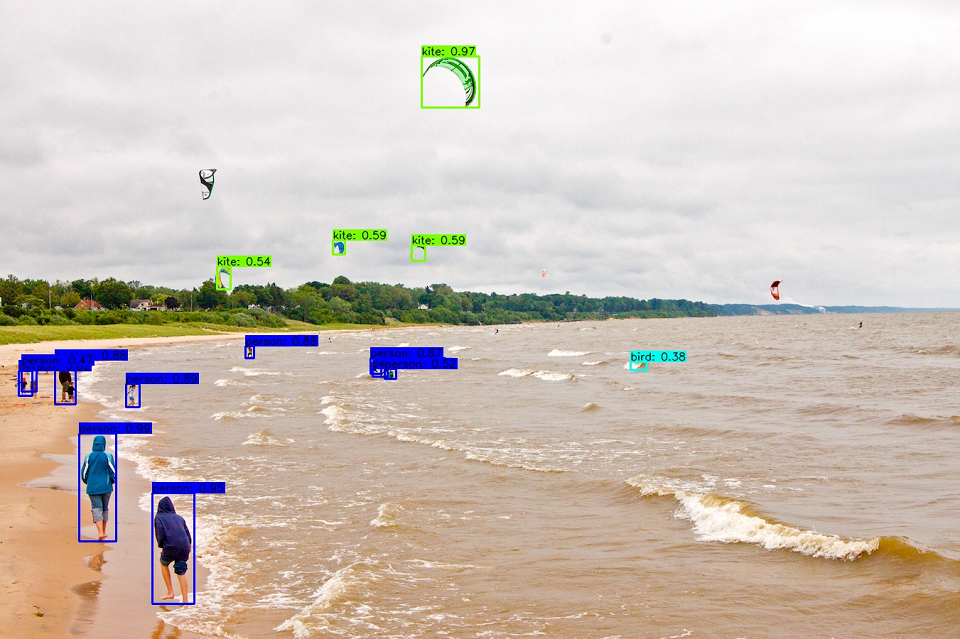
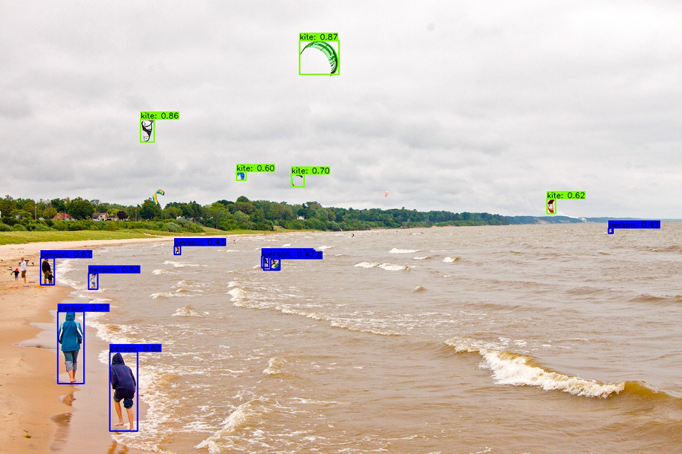
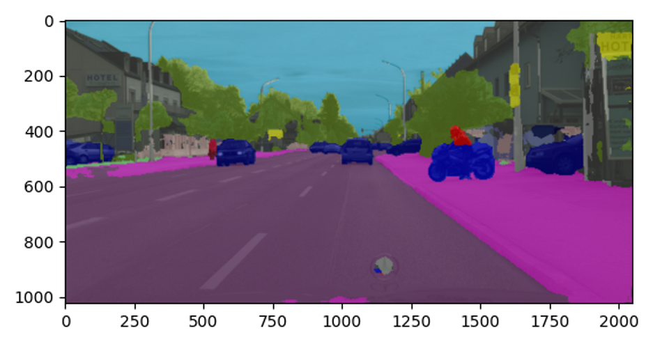
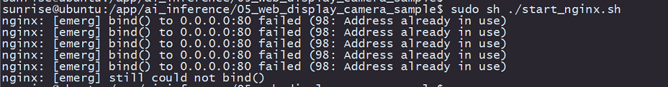

# 4.2 模型推理示例

本章节将通过静态图片推理、USB camera视频流推理和MIPI camera视频流推理等示例程序，介绍地平线python语言的`hobot_dnn`模型推理库的模型加载、数据预处理、模型推理等操作。示例代码及数据存放在`/app/pydev_demo/`目录下，用户可以参照代码来阅读文档，以更好的理解示例含义。

## 模块导入

`hobot_dnn`模型推理库，已预装到开发板Ubuntu系统，用户可以通过导入模块，查看版本信息。

```shell
sunrise@ubuntu:~$ sudo python3
Python 3.8.10 (default, Mar 15 2022, 12:22:08) 
Type "help", "copyright", "credits" or "license" for more information.
>>> from hobot_dnn import pyeasy_dnn as dnn
>>> dir(dnn)
['Model', 'TensorProperties', '__doc__', '__file__', '__loader__', '__name__', '__package__', '__spec__', 'load', 'pyDNNTensor']
```

`hobot_dnn`推理库主要使用的类和接口如下：

- **Model** ： AI 算法模型类，执行加载算法模型、推理计算， 更多信息请查阅 [Model](./pydev_dnn_api#model) 。
- **pyDNNTensor**：AI 算法输入、输出数据 tensor 类， 更多信息请查阅 [pyDNNTensor](./pydev_dnn_api) 。
- **TensorProperties** ：模型输入 tensor 的属性类， 更多信息请查阅 [TensorProperties](./pydev_dnn_api) 。
- **load**：加载算法模型，更多信息请查阅 [API接口](./pydev_dnn_api) 。

## 静态图片推理

### 图像分类算法—Mobilenet v1

本示例主要实现以下功能：
  1. 加载 `mobilenet v1` 图像分类模型
  2. 读取 `zebra_cls.jpg` 静态图片作为模型的输入
  3. 解析模型输出，得到图片的分类结果

#### 运行方法

本示例的完整代码和测试数据安装在 `/app/pydev_demo/01_basic_sample/` 目录下，调用以下命令运行

```shell
cd /app/pydev_demo/01_basic_sample/
sudo python3 ./test_mobilenetv1.py
```

运行成功后，会输出图像的分类结果，如下所示：

```shell
========== Classification result ==========
cls id: 340 Confidence: 0.991851
```

#### 示例代码解析

- 导入算法推理库hobot_dnn、numpy和opencv模块

    ```python
    from hobot_dnn import pyeasy_dnn as dnn
    import numpy as np
    import cv2
    ```

- 模型加载
    调用 [load](./pydev_dnn_api) 接口加载模型文件，并返回`hobot_dnn.pyeasy_dnn.Model`类的list。

    ```python
    models = dnn.load('../models/mobilenetv1_224x224_nv12.bin')
    ```

    本示例中`mobilenetv1` 模型的输入是`1x3x224x224`数据，格式为`NCHW`。输出是1000个list数据，表示1000个类别的置信度。示例中定义了`print_properties`函数用来输出模型的输入、输出参数：

    ```python
    # print properties of input tensor
    print_properties(models[0].inputs[0].properties)
    # print properties of output tensor
    print_properties(models[0].outputs[0].properties)
    ```

- 数据前处理

    示例打开含有斑马的图像文件`zebra_cls.jpg`，并把图片缩放到符合模型输入的尺寸(244 x 224)：

    ```python
    # open image
    img_file = cv2.imread('./zebra_cls.jpg')
    # get the input tensor size
    h, w = models[0].inputs[0].properties.shape[2], models[0].inputs[0].properties.shape[3]
    print("input tensor size: %d x %d" % (h, w))
    des_dim = (w, h)
    # resize image to inpust size
    resized_data = cv2.resize(img_file, des_dim, interpolation=cv2.INTER_AREA)
    ```

    

    然后通过`bgr2nv12_opencv`函数把bgr格式的图像转换成符合模型输入的`NV12`格式：

    ```python
    nv12_data = bgr2nv12_opencv(resized_data)
    ```

- 模型推理

    调用 [Model](./pydev_dnn_api#model) 类的 `forward` 接口进行算法推理，然后得到一个含有1000个值的list，表示1000个类别的预测概率值。

    ```python
    outputs = models[0].forward(nv12_data)
    ```

- 算法后处理

    算法模型的输出结果需要通过后处理，得到我们需要的类别、检测框等信息。本示例中模型输出对应1000个类别，需要根据置信度进行过滤，并得到正确结果。

    ```python
    print("=" * 10, "Classification result", "=" * 10)
    np.argmax(outputs[0].buffer)
    # output target id and confidence
    print("cls id: %d Confidence: %f" % (np.argmax(outputs[0].buffer), outputs[0].buffer[0][np.argmax(outputs[0].buffer)]))
    ```

    正确运行的结果为：

    ```shell
    ========== Classification result ==========
    cls id: 340 Confidence: 0.991851
    ```

### 目标检测算法—YOLOv3

本示例主要实现以下功能：

  1. 加载 `yolov3_416x416_nv12` 目标检测模型
  2. 读取 `kite.jpg` 静态图片作为模型的输入
  3. 分析算法结果，渲染检测结果

#### 运行方法

本示例的完整代码和测试数据安装在 `/app/pydev_demo/06_yolov3_sample/` 目录下，调用以下命令运行

```
cd /app/pydev_demo/06_yolov3_sample/
sudo python3 ./test_yolov3.py
```

运行成功后，会输出目标检测结果，并且输出渲染结果到`result.jpg`文件中，如下图：


### 目标检测算法—YOLOv5{#detection_yolov5}

本示例主要实现以下功能：

1. 加载 `yolov5s_672x672_nv12` 目标检测模型
2. 读取 `kite.jpg` 静态图片作为模型的输入
3. 分析算法结果，渲染检测结果

#### 运行方法

本示例的完整代码和测试数据安装在 `/app/pydev_demo/07_yolov5_sample/` 目录下，调用以下命令运行

```
cd /app/pydev_demo/07_yolov5_sample/
sudo python3 ./test_yolov5.py
```

运行成功后，会输出目标检测结果，并且输出渲染结果到`result.jpg`文件中，如下图：


### 图像分割算法—unet

本示例主要实现以下功能：

1. 加载 `mobilenet_unet_1024x2048_nv12` 图像分割模型（cityscapes预训练的分割模型）
2. 读取 `segmentation.png` 静态图片作为模型的输入
3. 分析算法结果，渲染分割结果


#### 运行方法

本示例的完整代码和测试数据安装在 `/app/pydev_demo/04_segment_sample/` 目录下，调用以下命令运行

```
cd /app/pydev_demo/04_segment_sample/
sudo python3 ./test_mobilenet_unet.py
```

运行成功后，会输出图像的分割结果，并且输出分割效果图到``segment_result.png``文件中，如下图：


## 基于USB摄像头推理{#usb}

### 目标检测算法—fcos

本示例主要实现以下功能：

1. 加载 `fcos` 目标检测算法模型（基于COCO数据集训练的80个类别的目标检测）
2. 从USB摄像头读取视频流，并进行推理
3. 解析模型输出并将结果渲染到原始视频流
4. 通过`HDMI`接口输出渲染后的视频流

#### 运行方法

请查阅 [USB摄像头AI推理](../first_application/usb_camera) 了解如何快速运行本示例。

#### 示例代码解析
- 导入算法推理模块hobot_dnn、视频输出模块hobot_vio、numpy、opencv、colorsys等模块

    ```
    from hobot_dnn import pyeasy_dnn as dnn
    from hobot_vio import libsrcampy as srcampy
    import numpy as np
    import cv2
    import colorsys
    ```

- 加载模型文件

    调用[load](./pydev_dnn_api)方法加载模型文件，并返回一个 `hobot_dnn.pyeasy_dnn.Model` 类的 list。

    ```shell
    models = dnn.load('../models/fcos_512x512_nv12.bin')
    ```

    `fcos`模型的输入是`1x3x512x512`数据，格式为`NCHW`。输出为15组数据，用来表示检测到的物体检测框。示例中定义了`print_properties`函数用来输出模型的输入、输出参数：

    ```python
    # print properties of input tensor
    print_properties(models[0].inputs[0].properties)
    # print properties of output tensor
    print(len(models[0].outputs))
    for output in models[0].outputs:
        print_properties(output.properties)
    ```

- 数据预处理

    使用opencv打开USB摄像头设备节点`/dev/video8`，获取实时图像，并把图像缩放到符合模型输入tensor的尺寸

    ```python
    # open usb camera: /dev/video8
    cap = cv2.VideoCapture(8)
    if(not cap.isOpened()):
        exit(-1)
    print("Open usb camera successfully")
    # set the output of usb camera to MJPEG, solution 640 x 480
    codec = cv2.VideoWriter_fourcc( 'M', 'J', 'P', 'G' )
    cap.set(cv2.CAP_PROP_FOURCC, codec)
    cap.set(cv2.CAP_PROP_FPS, 30) 
    cap.set(cv2.CAP_PROP_FRAME_WIDTH, 640)
    cap.set(cv2.CAP_PROP_FRAME_HEIGHT, 480)
    ```

    然后把bgr格式的图像转换成符合模型输入的 NV12 格式
    ```python
    nv12_data = bgr2nv12_opencv(resized_data)
    ```

- 模型推理

    调用 [Model](./pydev_dnn_api#model) 类的 `forward` 接口进行推理，模型输出15组数据，用来表示检测到的物体检测框。

    ```python
    outputs = models[0].forward(nv12_data)
    ```

- 算法后处理

    示例中的后处理函数`postprcess`，会处理模型输出的物体类别、检测框、置信度等信息。
    ```python
    prediction_bbox = postprocess(outputs, input_shape, origin_img_shape=(1080,1920))
    ```

- 检测结果可视化

    示例对算法结果和原始视频流进行了渲染，并通过`HDMI`接口输出，用户可在显示器上实时预览效果。显示部分用到了hobot_vio模块的Display功能，该模块详细信息请查看 [Display章节](./pydev_vio_api#display)。

    ```python
    # create display object
    disp = srcampy.Display()
    # set solution to 1920 x 1080
    disp.display(0, 1920, 1080)
    
    # if the solution of image is not 1920 x 1080, do resize
    if frame.shape[0]!=1080 and frame.shape[1]!=1920:
        frame = cv2.resize(frame, (1920,1080), interpolation=cv2.INTER_AREA)
    
    # render the detection results to image
    box_bgr = draw_bboxs(frame, prediction_bbox)
    
    # convert BGR to NV12
    box_nv12 = bgr2nv12_opencv(box_bgr)
    # do display
    disp.set_img(box_nv12.tobytes())
    ```

## 基于MIPI摄像头推理{#mipi}

### 目标检测算法—fcos

本示例主要实现以下功能：

1. 加载`fcos` 图像目标检测算法模型（基于COCO数据集训练的80个类别的目标检测）
2. 从MIPI摄像头读取视频图像，并进行推理
3. 解析模型输出并将结果渲染到原始视频流
4. 通过`HDMI`接口输出渲染后的视频流。

#### 运行方法

请查阅 [MIPI摄像头AI推理](../first_application/mipi_camera) 了解如何快速运行本示例。

#### 示例代码解析

- 导入python模块
  导入hobot_dnn、hobot_vio、numpy、opencv模块、colorsys等模块

    ```python
    import numpy as np
    import cv2
    import colorsys
  
    from hobot_dnn import pyeasy_dnn as dnn
    from hobot_vio import libsrcampy as srcampy
    ```

- 加载模型文件

    调用[load](./pydev_dnn_api)方法加载模型文件，并返回一个 `hobot_dnn.pyeasy_dnn.Model` 类的 list。

    ```shell
    models = dnn.load('../models/fcos_512x512_nv12.bin')
    ```

    `fcos`模型的输入是`1x3x512x512`数据，格式为`NCHW`。输出为15组数据，用来表示检测到的物体检测框。示例中定义了`print_properties`函数用来输出模型的输入、输出参数：

    ```python
    # print properties of input tensor
    print_properties(models[0].inputs[0].properties)
    # print properties of output tensor
    print(len(models[0].outputs))
    for output in models[0].outputs:
        print_properties(output.properties)
    ```

- 数据预处理

    调用`srcampy.Camera`类`get_cam`接口，获取MIPI camera的实时图像，并把图像缩放到符合模型输入tensor的尺寸

    ```python
    # create Camera object
    cam = srcampy.Camera()
    h, w = get_hw(models[0].inputs[0].properties)
    # open MIPI Camera, set 30fps，solution 1920 x 1080, 512 x 512
    cam.open_cam(0, 1, 30, [1920, w], [1080, h])
    ```

    ```python
    # get the image, solution 512x512
    img = cam.get_img(2, 512, 512)
    # transform data to np format
    img = np.frombuffer(img, dtype=np.uint8)
    ```

- 数据流绑定

    为减少图像数据的拷贝, 示例将图像数据的输入、输出模块进行了绑定, 可以在底层将`camera`的图像数据直接送到`display`显示模块

    ```python
    disp = srcampy.Display()
    # For the meaning of parameters, please refer to the relevant documents of HDMI display
    disp.display(0, 1920, 1080)

    # bind camera directly to display
    srcampy.bind(cam, disp)
    ```

    关于camera详细使用方法，可以查看[Camera章节](./pydev_vio_api#camera)了解更多信息。

- 模型推理

    调用 [Model](./pydev_dnn_api#model) 类的 `forward` 接口进行推理，模型输出15组数据，用来表示检测到的物体检测框。

    ```python
    outputs = models[0].forward(nv12_data)
    ```

- 算法后处理

    示例中的后处理函数`postprcess`，会处理模型输出的物体类别、检测框、置信度等信息。
    ```python
    # do postprocess
    prediction_bbox = postprocess(outputs, input_shape, origin_img_shape=(1080,1920))
    ```

- 检测结果可视化

    示例对算法结果和原始视频流进行了渲染，并通过`HDMI`接口输出，用户可在显示器上实时预览效果。显示部分用到了hobot_vio模块的Display功能，该模块详细信息请查看 [Display章节](./pydev_vio_api#display)。

    ```python
    for index, bbox in enumerate(prediction_bbox):
    ...
        if index == 0:
            disp.set_graph_rect(coor[0], coor[1], coor[2], coor[3], 2, 1,
                                box_color_ARGB)
            disp.set_graph_word(coor[0], coor[1] - 2, bbox_string, 2, 1,
                                box_color_ARGB)
        else:
            disp.set_graph_rect(coor[0], coor[1], coor[2], coor[3], 2, 0,
                                box_color_ARGB)
            disp.set_graph_word(coor[0], coor[1] - 2, bbox_string, 2, 0,
                                box_color_ARGB)
    
    ```

### 目标检测算法 Web端可视化

本示例我们要实现：

1. 加载 `fcos` 图像目标检测算法模型（基于COCO数据集训练的80个类别的目标检测）
2. 从MIPI摄像头、读取视频图像，并进行推理
3. 解析模型输出结果
4. 推送算法结果、视频流到web端

本示例中数据预处理、模型推理以及后处理部分代码与上一章节一致，下面只解析差异部分。

#### 代码解析

- 启动`web_service`服务

    在使用web服务之前，请确保开发板与电脑处于同一网段，并可以相互ping通。然后执行如下命令启动web服务

    ```bash
    cd /app/pydev_demo/05_web_display_camera_sample/
    sudo sh ./start_nginx.sh
    sudo python3 ./mipi_camera_web.py 
    ```

    注意，如果在运行`start_nginx.sh`时报以下错误，说明设备上已经有运行httpd的服务，tcp的80端口已经被占用
    

    此时需要找到并结束掉占用`80`端口的进程，可以执行命令`lsof -i:80`，得到占用端口的进程PID，并用`kill -9 PID`结束掉进程即可。

- protobuf序列化

    web端接收的是使用protobuf序列化之后的数据，开发板作为服务端需要将模型输出按照一定的数据格式进行序列号，本示例中通过`serialize`函数完成序列化操作

    ```python
    def serialize(FrameMessage, prediction_bbox):
        if (prediction_bbox.shape[0] > 0):
            for i in range(prediction_bbox.shape[0]):
                # get class name
                Target = x3_pb2.Target()
                id = int(prediction_bbox[i][5])
                Target.type_ = classes[id]
                Box = x3_pb2.Box()
                Box.type_ = classes[id]
                Box.score_ = prediction_bbox[i][4]

                Box.top_left_.x_ = prediction_bbox[i][0]
                Box.top_left_.y_ = prediction_bbox[i][1]
                Box.bottom_right_.x_ = prediction_bbox[i][2]
                Box.bottom_right_.y_ = prediction_bbox[i][3]

                Target.boxes_.append(Box)
                FrameMessage.smart_msg_.targets_.append(Target)
        prot_buf = FrameMessage.SerializeToString()
        return prot_buf
    ```

- protobuf数据包发送

    开发板web服务端通过`websockets`插件完成对数据的发送，需要获取本机IP地址：

    ```python
        # call ifconfig cmd, to get device ip
        ifconfig_cmd = subprocess.check_output("ifconfig | grep broadcast | awk '{print $2}'", shell=True)
        board_ip = str(ifconfig_cmd, 'UTF-8')[:-1]
    ```

    然后启动`websockets`，并通过数据发送函数`web_service`发送数据。

    ```python
    start_server = websockets.serve(web_service, board_ip, 8080)
    ```

    ```python
    async def web_service(websocket, path):
        while True:
            # create protobuf message object
            FrameMessage = x3_pb2.FrameMessage()
            # set frame solution and format
            FrameMessage.img_.height_ = 1080
            FrameMessage.img_.width_ = 1920
            FrameMessage.img_.type_ = "JPEG"
    
            # get camera image for inference
            img = cam.get_img(2, 512, 512)
            img = np.frombuffer(img, dtype=np.uint8)
            outputs = models[0].forward(img)
            # do postprocess
            prediction_bbox = postprocess(outputs, input_shape, origin_img_shape=(1080, 1920))
            print(prediction_bbox)

            # get camera image for render
            origin_image = cam.get_img(2, 1920, 1080)
            # encode image to mjpeg
            enc.encode_file(origin_image)
            FrameMessage.img_.buf_ = enc.get_img()
            FrameMessage.smart_msg_.timestamp_ = int(time.time())
            # serialize data
            prot_buf = serialize(FrameMessage, prediction_bbox)
            # send data
            await websocket.send(prot_buf)
        cam.close_cam()
    ```

- web端查看展示效果

    在`chrome`浏览器输入开发板IP地址，即可实时预览渲染后的视频画面  
    

