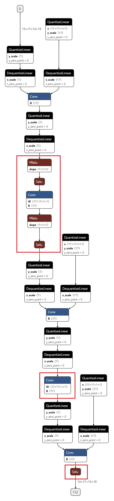

# 使用指南

本节为您带来包括 **浮点模型准备** 、 **算子融合** 、 **设置不同的BPU架构** 、 
**异构模型QAT** 、 **基于FX的量化** 、 **搭建量化友好的浮点模型** 、 **QAT经验总结** 、 
**模型精度DEBUG工具** 、 **量化精度DEBUG思路** 等内容的使用教学。

## 浮点模型准备

浮点模型由对数据进行操作的层或是模块组成。 `torch.nn` 模块中提供了构建浮点模型所需的所有网络块。PyTorch 中的所有网络模块都继承自 `torch.nn.Module` 。一个网络模型本身是一个由其他各个小的网络模块构成的网络模块。通过这种内嵌的结构用户可以较容易地构建和管理复杂的网络架构。用户可以直接使用 PyTorch 提供的网络模块来构建浮点模型。由于量化是以模块为基础的，因此有必要在量化之前对模型定义进行一些修改，具体有以下几个方面：

### 算子替换

为了浮点模型能够向量化模型进行转换，将需要对输出进行量化的函数形式（functional）的操作转化为模块（Module）。
例如使用 `torch.nn.ReLU` 来替换 `torch.nn.functional.relu` 。具体需要替换的算子可以参阅当前文档 [API REFERENCE](#ai_reference) 中 ``支持的算子`` 部分。

### 插入量化和反量化节点

为了后续的量化训练和定点预测，需要在整个模型的输入节点前插入量化节点，输出节点后插入反量化节点，具体到实现上，量化模型整体以 QuantStub 开始，以 DeQuantStub 结束。但是如果最后一层的输出为 `class_idx` 等非量化数据（在 QAT 模型中使用 `Tensor` 类型表示而没有使用 `QTensor` 的），则不需要 DeQuantStub。下方表格列出了作为模型输出层时不需要 DeQuantStub 的算子。

| 作为模型输出层时不需要 DeQuantStub 的算子   |
| ------------------------------------------- |
| torch.Tensor.argmax / torch.argmax          |
| horizon_plugin_pytorch.functional.argmax    |
| horizon_plugin_pytorch.functional.filter    |
| torch.max (返回值是 index 的部分无需反量化) |

### 设置量化参数

通过对模型的 qconfig 属性赋值来指定模型的哪些部分需要被量化。例如，使用 `model.conv1.qconfig = None` 设置 `model.conv `层不被量化。再比如使用 `model1.linear1.qconfig = custom_qconfig` 设置 model.linear1 会使用 `custom_qconfig` 而不使用全局的 qconfig 。

### 自定义浮点模型的例子

```python
import torch
import torch.nn.quantized as nnq
import horizon_plugin_pytorch as horizon
from torch.quantization import QConfig, DeQuantStub
from torch import nn
from horizon_plugin_pytorch.quantization import (
    fuse_known_modules
    QuantStub
)


class ExampleNet(nn.Module):
    def __init__(self):
        super(ExampleNet, self).__init__()
        self.quant = QuantStub()
        self.conv = nn.Conv2d(in_channels=1, out_channels=1, kernel_size=3)
        self.bn = nn.BatchNorm2d(num_features=1)
        # add 操作必须使用 FloatFunctional
        self.add = nn.quantized.FloatFunctional()
        self.act = nn.ReLU()
        self.out_conv = nn.Conv2d(in_channels=1, out_channels=1, kernel_size=3)
        self.dequant = DeQuantStub()

    def forward(self, x):
        # 量化模型整体一般以 QuantStub 开始，以 DeQuantStub 结束
        x = self.quant(x)
        x = self.conv(x)
        x = self.bn(x)
        # 如果要将 add fuse 到 conv 中，add 的第一个输入必须来自于要 fuse 到的 conv
        # 注意此处 add 的调用方式，使用 FloatFunctional 时必须使用它的具体方法，而不能直接使用 forward
        x = self.add.add(x, y)
        x = self.act(x)
        x = self.out_conv(x)
        x = self.dequant(x)
        return x

    def fuse_model(self):
        from horizon_plugin_pytorch import quantization

        quantization.fuse_modules(
            self,
            ["conv", "bn", "add", "act"],
            inplace=True,
        )

    def set_qconfig(self):
        # 这里可以不调用子模块的 set_qconfig 方法，没有 qconfig 的子模块会自动使用父模块的 qconfig
        self.qconfig = horizon.quantization.get_default_qat_qconfig()
        # 若网络最后输出层为 conv，可以单独设置为 out_qconfig 得到更高精度的输出
        self.out_conv.qconfig = (
            horizon.quantization.get_default_qat_out_qconfig()
        )
```

## 算子融合

### 为什么要做算子融合

为什么要做算子融合，简单来说，算子融合既可以加快计算速度，又可以提高量化精度。

### 加快计算速度

例如，把 `Conv` ， `ReLU` 进行融合成 `ConvReLU2d` ，如下左图， `ReLU` 读取 `Conv` 的计算结果，然后进行计算，而右图 `ConvReLU2d` 直接把 `Conv` 的结果现场计算，节省了读取数据的过程，因此可以加快计算速度。

这是一个简单的例子，现实中会比这个复杂很多。


### 提高量化精度

如下图所示，如果各个算子独立计算，那么，每个算子的输出都是8bit的数据，而如果是使用算子融合，那么， `Conv0` 的输出是32bit数据。


### 可以融合的算子

```python
from torch import nn
import torch.nn.quantized as nnq

# 目前支持以下算子的融合
(nn.Conv2d, nn.BatchNorm2d, nn.ReLU)
(nn.Conv2d, nn.ReLU)
(nn.Conv2d, nn.BatchNorm2d, nnq.FloatFunctional)
(nn.Conv2d, nn.BatchNorm2d, nnq.FloatFunctional, nn.ReLU)
(nn.Conv2d, nnq.FloatFunctional)
(nn.Conv2d, nnq.FloatFunctional, nn.ReLU)
(nn.ConvTranspose2d, nn.ReLU)
(nn.ConvTranspose2d, nnq.FloatFunctional)
(nn.ConvTranspose2d, nnq.FloatFunctional, nn.ReLU)
(nn.ConvTranspose2d, nn.BatchNorm2d)
(nn.ConvTranspose2d, nn.BatchNorm2d, nn.ReLU)
(nn.ConvTranspose2d, nn.BatchNorm2d, nnq.FloatFunctional)
(nn.ConvTranspose2d, nn.BatchNorm2d, nnq.FloatFunctional, nn.ReLU)
(nn.Conv2d, nn.BatchNorm2d, nn.ReLU6)
(nn.Conv2d, nn.ReLU6)
(nn.Conv2d, nn.BatchNorm2d, nnq.FloatFunctional, nn.ReLU6)
(nn.Conv2d, nnq.FloatFunctional, nn.ReLU6)
(nn.ConvTranspose2d, nn.ReLU6)
(nn.ConvTranspose2d, nnq.FloatFunctional, nn.ReLU6)
(nn.ConvTranspose2d, nn.BatchNorm2d, nn.ReLU6)
(nn.ConvTranspose2d, nn.BatchNorm2d, nnq.FloatFunctional, nn.ReLU6)
```

### 吸收 BN 的目的

吸收 `BN` 的目的是为了减少部署模型的计算量。因为 `BN` 是线性变换过程，因此，当 `BN` 和 `Conv` 一起出现的时候，可以把 `BN` 的变换参数吸收到 `Conv` 的参数中去，从而，在部署的模型中消除 `BN` 的计算。

通过吸收 `BN` ，把 `Conv2d + BN2d` 变换成了 `Conv2d` 。


### 吸收BN的方法

目前工具支持 `Conv -> BN` 的模式吸收 `BN` 。

吸收方法如下：


### 算子融合示例

示例 1：取算子下标进行融合。

```python
import torch
import horizon_plugin_pytorch as horizon
from torch.quantization import DeQuantStub
from horizon_plugin_pytorch.quantization import QuantStub

class ModelForFusion(torch.nn.Sequential):
    def __init__(
        self,
        in_channels,
        out_channels,
        kernel_size,
        dequant_out=False,
    ):
        super(ModelForFusion, self).__init__(
            QuantStub(),
            nn.Conv2d(
                in_channels,
                out_channels,
                kernel_size,
            ),
            nn.BatchNorm2d(num_features=out_channels),
            DeQuantStub() if dequant_out else nn.Identity(),
        )

float_net = ModelForFusion(
    1,
    2,
    1,
)
# 由于需要融合的网络是继承自 torch.nn.Sequential 的网络，取 conv 和 bn 在
# 网络中的下标放入列表中来确定要融合的算子
horizon.quantization.fuse_modules(
    float_net, ["1", "2"], inplace=True
)
```

示例 2：用算子名放在列表中进行融合。

```python
from torch import nn


class ModelForFusion(nn.Module):
    def __init__(self):
        super().__init__()
        self.conv = nn.Conv2d(2, 2, 1, bias=None)
        self.bn = nn.BatchNorm2d(2)
        self.relu = nn.ReLU(inplace=True)
        self.quant = QuantStub()
        self.dequant = DeQuantStub()

    def forward(self, x):
        x_i = self.quant(x)
        x = self.conv(x_i)
        x = self.bn(x)
        x = self.relu(x)
        x = self.dequant(x)
        return x

model = ModelForFusion().train()

# 由于网络是继承自 Module 的网络，网络中的每个算子都有一个变量名，
# 取网络中 conv 和 bn 的变量名放入列表中进行融合
horizon.quantization.fuse_modules(
    model,
    ["conv", "bn", "relu"],
    inplace=True,
)
```

## 设置不同的 BPU 架构

在定义网络之前设置 `march` 变量，例如：

```python
from horizon_plugin_pytorch.march import March, set_march
set_march(March.BERNOULLI2)
qat_net = ...
```
可供设置的 `march` 有 `March.BAYES`（J5处理器使用） 和 `March.BERNOULLI2` （X3处理器使用）.

## 异构模型 QAT

### 异构模型与非异构模型的区别

异构模型是部署时一部分运行在 BPU 上，一部分运行在 CPU 上的模型，而非异构模型部署时则完全运行在BPU上。通常情况下，以下两类模型在部署时会成为异构模型：

1. 包含 BPU 不支持算子的模型。

2. 由于量化精度误差过大，用户指定某些算子运行在 CPU 上的模型。

horizon_pytorch_plugin 对异构模型与非异构模型支持的区别如下：

|  | 异构 | 非异构 |
|---|---|---|
| 算子 | 与 horizon_nn 对接，以 horizon_nn 支持算子为准，模型可以包括 CPU 算子。 | 直接与编译器对接，以 horizon_pytorch_plugin 支持算子为准，模型不能包括 CPU 算子。 |
| 接口 | prepare_calibration_fx: 指定hybrid模式, 根据需要设置hybrid_dict。<br/>prepare_qat_fx：指定hybrid模式, 根据需要设置hybrid_dict。<br/>convert_fx: 不需要指定hybrid模式，会根据prepare_qat_fx生成的模型自动选择模式。<br/>export_to_onnx: 非异构模式仅用于可视化，异构模式导出onnx后接hb mapper<br/>compile/perf/check_model: 无。 | 参考非异构模式用法文档。 |
| 流程 | <br/>通过 prepare 接口将浮点模型转为 QAT 模型，训练之后导出为 onnx 模型，由 hb_mapper 工具转为 bin 模型。不同于非异构的情况，异构 convert 得到的定点模型仅供评测使用。 | <br/>通过 prepare 接口将浮点模型转为 QAT 模型，训练之后使用 convert 方法得到定点模型，定点模型 trace 得到 pt 模型，pt 模型编译得到 hbm 模型。

### 主要接口参数说明

异构接口的用法基本与非异构的用法保持一致，仅添加了 `hybrid` 等少量参数。详细的接口参数说明见 `API` 文档，这里重点描述关键的几个参数。

#### horizon_plugin_pytorch.quantization.prepare_qat_fx

开启 `hybrid` 参数，如果没有指定 BPU 算子退回 CPU 的需求，可以不设置 `hybrid_dict` 。

```python
def prepare_qat_fx(
    model: Union[torch.nn.Module, GraphModule],
    qconfig_dict: Dict[str, Any] = None,
    prepare_custom_config_dict: Dict[str, Any] = None,
    optimize_graph: bool = False,
    hybrid: bool = False,
    hybrid_dict: Dict[str, List] = None,
) -> ObservedGraphModule:
    """Prepare QAT 模型
        `model`: torch.nn.Module 或 GraphModule(使用 fuse_fx 后的模型)
        `qconfig_dict`: 定义 Qconfig。如果除了 qconfig_dict 以外，还使用了 eager mode 在 module 内定义 qconfig 的方式，则 module 内定义的 qconfig 优先生效。qconfig_dict 的配置格式如下：
            qconfig_dict = {
                # 可选，全局配置
                "": qconfig,
                # 可选，按 module 类型配置
                "module_type": [(torch.nn.Conv2d, qconfig), ...],
                # 可选，按 module 名配置
                "module_name": [("foo.bar", qconfig),...],
                # 优先级：global < module_type < module_name < module.qconfig
                # 非 module 类型的算子的 qconfig 默认与其父 module 的 qconfig 保持一致，如果需要单独设置，请将这部分单独封装成 module。
            }
        `prepare_custom_config_dict`: 自定义配置字典
            prepare_custom_config_dict = {
                # 暂时只支持 preserved_attributes。一般而言会自动保留所有属性，这个选项只是以防万一，几乎不会用到。
                "preserved_attributes": ["preserved_attr"],
            }
        `optimize_graph`: 保持 cat 输入输出 scale 一致，目前只有在 Bernoulli 架构下有效。
        `hybrid`: 是否使用异构模式。在以下情况下必须打开异构模式：
            1. 模型包含 BPU 不支持的算子或用户希望指定部分 BPU 算子退回 CPU。
            2. 用户希望 QAT 模型与 horizon_nn 对接进行定点化。
        `hybrid_dict`: 定义用户主动指定的 CPU 算子。
            hybrid_dict = {
                # 可选，按 module 类型配置
                "module_type": [torch.nn.Conv2d, ...],
                # 可选，按 module 名配置
                "module_name": ["foo.bar", ...],
                # 优先级：module_type < module_name
                # 与 qconfig_dict 类似，如果想要非 module 类型的算子运行在 CPU 上，需要将这部分单独封装成 module。
            }
    """
```

#### horizon_plugin_pytorch.quantization.prepare_calibraiton_fx

用法与 `prepare_qat_fx` 完全一致，需要注意 `qconfig` 使用 `calibration qconfig` 。

```python
def prepare_calibration_fx(
    model,
    qconfig_dict: Dict[str, Any] = None,
    prepare_custom_config_dict: Dict[str, Any] = None,
    optimize_graph: bool = False,
    hybrid: bool = False,
    hybrid_dict: Dict[str, List] = None,
)-> ObservedGraphModule:
```

#### horizon_plugin_pytorch.quantization.convert_fx

异构模式下的 `convert` 接口与非异构模式使用方式相同，但异构模型 `convert` 得到的定点模型仅用于评测精度，不用于得到最终部署的模型。

```python
def convert_fx(
    graph_module: GraphModule,
    convert_custom_config_dict: Dict[str, Any] = None,
    _remove_qconfig: bool = True,
) -> QuantizedGraphModule:
    """转换 QAT 模型，仅用于评测定点模型。
        `graph_module`: 经过 prepare->(calibration)->train 之后的模型
        `convert_custom_config_dict`: 自定义配置字典
            convert_custom_config_dict = {
                # 暂时只支持 preserved_attributes。一般而言会自动保留所有属性，这个选项只是以防万一，几乎不会用到。
                "preserved_attributes": ["preserved_attr"],
            }
        `_remove_qconfig`: convert 之后是否删除 qconfig，一般不会用到
    """
```

#### horizon_plugin_pytorch.utils.onnx_helper.export_to_onnx

非异构模式下，此接口仅用于可视化。异构模式下，此接口还可用于导出 `onnx` 对接 `hb_mapper` 。

```python
def export_to_onnx(
    model,
    args,
    f,
    export_params=True,
    verbose=False,
    training=TrainingMode.EVAL,
    input_names=None,
    output_names=None,
    operator_export_type=OperatorExportTypes.ONNX_FALLTHROUGH,
    opset_version=11,
    do_constant_folding=True,
    example_outputs=None,
    strip_doc_string=True,
    dynamic_axes=None,
    keep_initializers_as_inputs=None,
    custom_opsets=None,
    enable_onnx_checker=False,
):
    """此接口与 torch.onnx.export 基本一致，隐藏了无需修改的参数，需要的注意参数有：
        `model`: 需要 export 的模型
        `args`: 模型输入，用于 trace 模型
        `f`: 保存的 onnx 文件名或文件描述符
        `operator_export_type`: 算子导出类型
            1. 对于非异构模型，onnx 仅用于可视化，不需要保证实际可用，使用默认值 OperatorExportTypes.ONNX_FALLTHROUGH
            2. 对于异构模型，onnx 需要保证实际可用，使用 None 确保导出的为标准 onnx 算子。
        `opset_version`: 只能为 11，plugin 在 opset 11 中注册了特定的映射规则。
        注意：如果使用公版 torch.onnx.export，需要确保上述参数设置正确，
        并且 import horizon_plugin_pytorch.utils._register_onnx_ops
        以向 opset 11 中注册特定的映射规则。
    """
```

### 使用流程

1. 改造浮点模型。

   - 插入 `QuantStub` 与 `DeQuantStub` ，保持与非异构的用法一致。
     
     - 如果第一个op是 `cpu op` ，那么不需要插入 `QuantStub` 。
     
     - 如果最后一个op是 `cpu op` ，那么可以不用插入 `DeQuantStub` 。
   
   - 对于非 `module` 的运算，如果需要单独设置 `qconfig` 或指定其运行在 CPU 上，需要将其封装成 `module` ，参考示例中的 `_SeluModule` 。

2. 设置 `march` 。

3. 设置 `qconfig` 。保留非异构模式下在 `module` 内设置 `qconfig` 的配置方式，除此以外，还可以通过 `prepare_qat_fx` 接口的 `qconfig_dict` 参数传入 `qconfig`，具体用法见接口参数说明。
   
   - 对于 `BPU op` ，必须保证有 `qconfig` ，如果其输入op不为 `QuantStub` ，那么还需要保证该输入 op 有 `activation qconfig` 。
   
   - 对于 `CPU op` ，`qconfig` 不会对其产生任何影响，但如果后面接 `BPU op` ，则必须有 `qconfig` 。
   
   - 推荐设置方式：先设置全局 `qconfig` 为 `horizon_plugin_pytorch.quantization.get_default_qat_qconfig()` ，在此基础上根据需求修改，一般而言，只需要对 int16 和高精度输出的 op 单独设置 `qconfig` 。

4. 设置 `hybrid_dict` 。可选，具体用法见接口参数说明，如果没有主动指定的 CPU 算子，可以不设置 `hybrid_dict` 。

5. 调用 `prepare_calibration_fx` 。可选，如果任务简单，直接 QAT 精度就可以达标，也可以跳到第 7 步。一般来说 `calibration` 对QAT精度有益无害，打印 `calibration` 模型，可以看到需要统计量化参数的地方插入了 `CalibFakeQuantize` 。示例中的 `conv4` 结构如下：

    ```python
    (conv4): Conv2d(
        3, 3, kernel_size=(1, 1), stride=(1, 1)
        (weight_fake_quant): CalibFakeQuantize(
        (activation_post_process): NoopObserver()
        )
        (activation_post_process): CalibFakeQuantize(
        (activation_post_process): CalibObserver(CalibObserver() calib_bin_edges=tensor([]) calib_hist=tensor([]))
        )
    )
    ```
6. `calibration` 。`calibration` 过程需要模型在 `eval` 状态跑若干遍 `forward` 。

7. 调用 `prepare_qat_fx` 。打印 QAT 模型，可以看到需要伪量化的地方插入了 `FakeQuantize` ，示例中的 `conv4` 结构如下：

    ```python
    (conv4): Conv2d(
        3, 3, kernel_size=(1, 1), stride=(1, 1)
        (weight_fake_quant): FakeQuantize(
        fake_quant_enabled=tensor([1], dtype=torch.uint8), observer_enabled=tensor([1], dtype=torch.uint8),            quant_min=-128, quant_max=127, dtype=qint8, qscheme=torch.per_channel_symmetric, ch_axis=0,         scale=tensor([0.0025, 0.0037, 0.0029]), zero_point=tensor([0, 0, 0])
        (activation_post_process): MovingAveragePerChannelMinMaxObserver(min_val=tensor([-0.2484, -0.4718, -0.3689]), max_val=tensor([ 0.3239, -0.0056,  0.3312]))
        )
        (activation_post_process): None
    )
    ```
    为了验证模型的正确性， `prepare_qat_fx` 之后可以跳过 8，9 步，先按照第 10 步导出 onnx 查看模型结构，验证无问题后再执行第8步。

8. `training` 。

9. 调用 `convert_fx` 。可选，没有评测定点模型精度的需求时可以跳过。

10. 调用 `export_to_onnx` 。也可以使用 `torch.onnx.export` 但需要遵守 `export_to_onnx` 接口说明中的注意事项。

11. 使用 `hb_mapper` 转换 onnx 模型。转换后需检查算子是否运行在预期的设备上，在部分情况下， `hb_mapper` 仍然需要设置 `run_on_cpu` 参数。比如：虽然 `conv` 在 QAT 阶段没有量化，但由于其输入（上一个算子输出）经过了伪量化， `hb_mapper` 仍然会默认将其量化。

<div style={{textAlign: 'center'}}>


</div>

### 示例

```python
import numpy as np
import torch
from horizon_plugin_pytorch.march import March, set_march
from horizon_plugin_pytorch.nn import qat
from horizon_plugin_pytorch.quantization import (
    get_default_calib_qconfig,
    get_default_qat_qconfig,
    get_default_qat_out_qconfig,
    prepare_calibration_fx,
    prepare_qat_fx,
    convert_fx,
)
from torch import nn
from torch.quantization import DeQuantStub, QuantStub
from horizon_plugin_pytorch.utils.onnx_helper import export_to_onnx

class _ConvBlock(nn.Module):
    def __init__(self, channels=3):
        super().__init__()
        self.conv = nn.Conv2d(channels, channels, 1)
        self.prelu = torch.nn.PReLU()

    def forward(self, input):
        x = self.conv(input)
        x = self.prelu(x)
        return torch.nn.functional.selu(x)

# 封装 functional selu 为 module，便于单独设置
class _SeluModule(nn.Module):
    def forward(self, input):
        return torch.nn.functional.selu(input)

class HybridModel(nn.Module):
    def __init__(self, channels=3):
        super().__init__()
        # 插入 QuantStub
        self.quant = QuantStub()
        self.conv0 = nn.Conv2d(channels, channels, 1)
        self.prelu = torch.nn.PReLU()
        self.conv1 = _ConvBlock(channels)
        self.conv2 = nn.Conv2d(channels, channels, 1)
        self.conv3 = nn.Conv2d(channels, channels, 1)
        self.conv4 = nn.Conv2d(channels, channels, 1)
        self.selu = _SeluModule()
        # 插入 DequantStub
        self.dequant = DeQuantStub()
        self.identity = torch.nn.Identity()

    def forward(self, input):
        x = self.quant(input)
        x = self.conv0(x)
        x = self.identity(x)
        x = self.prelu(x)
        x = torch.nn.functional.selu(x)
        x = self.conv1(x)
        x = self.conv2(x)
        x = self.conv3(x)
        x = self.identity(x)
        x = self.conv4(x)
        x = self.selu(x)
        return self.dequant(x)

# 设置 march
set_march(March.BERNOULLI2)
data_shape = [1, 3, 224, 224]
data = torch.rand(size=data_shape)
model = HybridModel()
# float 模型的推理不要放在 prepare_qat_fx 之后，prepare_qat_fx 会对 float 模型做 inplace 修改
float_res = model(data)

calibration_model = prepare_calibration_fx(
    model,
    {
        # calibration fake quant 只做统计，qat 阶段未使用的 calibration fake quant
        # 会被自动去除，可以不用对高精度输出 op 做特殊设置
        "": get_default_calib_qconfig(),
    },
    hybrid=True,
    hybrid_dict={
        "module_name": ["conv1.conv", "conv3"],
        "module_type": [_SeluModule],
    },
)
# calibration 阶段需确保原有模型不会发生变化
calibration_model.eval()

for i in range(5):
    calibration_model(torch.rand(size=data_shape))

qat_model = prepare_qat_fx(
    calibration_model,
    {
        "": get_default_qat_qconfig(),
        # selu 为 cpu 算子，conv4 实际上是 bpu 模型的输出，设置为高精度输出
        "module_name": [("conv4", get_default_qat_out_qconfig())]
    },
    hybrid=True,
    hybrid_dict={
        "module_name": ["conv1.conv", "conv3"],
        "module_type": [_SeluModule],
    },
)

# qat 模型的推理不要放在 convert_fx 之后，convert_fx 会对 qat 模型做 inplace 修改
qat_res = qat_model(data)

# qat training start
# ......
# qat training end

# 导出 qat.onnx
export_to_onnx(
    qat_model,
    data,
    "qat.onnx",
    enable_onnx_checker=True,
    operator_export_type=None,
)

# 评测定点模型
quantize_model = convert_fx(qat_model)
quantize_res = quantize_model(data)
```

打印 calibration 模型的结果。

```python
HybridModel(
  (quant): QuantStub(
    (activation_post_process): CalibFakeQuantize(
      (activation_post_process): CalibObserver(CalibObserver() calib_bin_edges=tensor([]) calib_hist=tensor([]))
    )
  )
  (conv0): Conv2d(
    3, 3, kernel_size=(1, 1), stride=(1, 1)
    (weight_fake_quant): CalibFakeQuantize(
      (activation_post_process): NoopObserver()
    )
    (activation_post_process): CalibFakeQuantize(
      (activation_post_process): CalibObserver(CalibObserver() calib_bin_edges=tensor([]) calib_hist=tensor([]))
    )
  )
  (prelu): PReLU(num_parameters=1)
  (conv1): _ConvBlock(
    (conv): Conv2d(3, 3, kernel_size=(1, 1), stride=(1, 1))
    (prelu): PReLU(num_parameters=1)
  )
  (conv2): Conv2d(
    3, 3, kernel_size=(1, 1), stride=(1, 1)
    (weight_fake_quant): CalibFakeQuantize(
      (activation_post_process): NoopObserver()
    )
    (activation_post_process): CalibFakeQuantize(
      (activation_post_process): CalibObserver(CalibObserver() calib_bin_edges=tensor([]) calib_hist=tensor([]))
    )
  )
  (conv3): Conv2d(3, 3, kernel_size=(1, 1), stride=(1, 1))
  (conv4): Conv2d(
    3, 3, kernel_size=(1, 1), stride=(1, 1)
    (weight_fake_quant): CalibFakeQuantize(
      (activation_post_process): NoopObserver()
    )
    (activation_post_process): CalibFakeQuantize(
      (activation_post_process): CalibObserver(CalibObserver() calib_bin_edges=tensor([]) calib_hist=tensor([]))
    )
  )
  (selu): _SeluModule()
  (dequant): DeQuantStub()
  (identity): Identity()
  (prelu_input_dequant): DeQuantStub()
  (selu_1_activation_post_process): CalibFakeQuantize(
    (activation_post_process): CalibObserver(CalibObserver() calib_bin_edges=tensor([]) calib_hist=tensor([]))
  )
  (conv3_activation_post_process): CalibFakeQuantize(
    (activation_post_process): CalibObserver(CalibObserver() calib_bin_edges=tensor([]) calib_hist=tensor([]))
  )
  (conv3_input_dequant): DeQuantStub()
  (selu_2_input_dequant): DeQuantStub()
)

def forward(self, input):
    input_1 = input
    quant = self.quant(input_1);  input_1 = None
    conv0 = self.conv0(quant);  quant = None
    identity = self.identity(conv0);  conv0 = None
    prelu_input_dequant_0 = self.prelu_input_dequant(identity);  identity = None
    prelu = self.prelu(prelu_input_dequant_0);  prelu_input_dequant_0 = None
    selu = torch.nn.functional.selu(prelu, inplace = False);  prelu = None
    conv1_conv = self.conv1.conv(selu);  selu = None
    conv1_prelu = self.conv1.prelu(conv1_conv);  conv1_conv = None
    selu_1 = torch.nn.functional.selu(conv1_prelu, inplace = False);  conv1_prelu = None
    selu_1_activation_post_process = self.selu_1_activation_post_process(selu_1);  selu_1 = None
    conv2 = self.conv2(selu_1_activation_post_process);  selu_1_activation_post_process = None
    conv3_input_dequant_0 = self.conv3_input_dequant(conv2);  conv2 = None
    conv3 = self.conv3(conv3_input_dequant_0);  conv3_input_dequant_0 = None
    conv3_activation_post_process = self.conv3_activation_post_process(conv3);  conv3 = None
    identity_1 = self.identity(conv3_activation_post_process);  conv3_activation_post_process = None
    conv4 = self.conv4(identity_1);  identity_1 = None
    selu_2_input_dequant_0 = self.selu_2_input_dequant(conv4);  conv4 = None
    selu_2 = torch.nn.functional.selu(selu_2_input_dequant_0, inplace = False);  selu_2_input_dequant_0 = None
    dequant = self.dequant(selu_2);  selu_2 = None
    return dequant
```

打印 QAT 模型的结果。

```python
HybridModel(
  (quant): QuantStub(
    (activation_post_process): FakeQuantize(
      fake_quant_enabled=tensor([1], dtype=torch.uint8), observer_enabled=tensor([1], dtype=torch.uint8),            quant_min=-128, quant_max=127, dtype=qint8, qscheme=torch.per_tensor_symmetric, ch_axis=-1,         scale=tensor([0.0078]), zero_point=tensor([0])
      (activation_post_process): MovingAverageMinMaxObserver(min_val=tensor([-0.9995]), max_val=tensor([0.9995]))
    )
  )
  (conv0): Conv2d(
    3, 3, kernel_size=(1, 1), stride=(1, 1)
    (weight_fake_quant): FakeQuantize(
      fake_quant_enabled=tensor([1], dtype=torch.uint8), observer_enabled=tensor([1], dtype=torch.uint8),            quant_min=-128, quant_max=127, dtype=qint8, qscheme=torch.per_channel_symmetric, ch_axis=0,         scale=tensor([0.0038, 0.0041, 0.0016]), zero_point=tensor([0, 0, 0])
      (activation_post_process): MovingAveragePerChannelMinMaxObserver(min_val=tensor([-0.4881, -0.4944,  0.0787]), max_val=tensor([-0.1213,  0.5284,  0.1981]))
    )
    (activation_post_process): FakeQuantize(
      fake_quant_enabled=tensor([1], dtype=torch.uint8), observer_enabled=tensor([1], dtype=torch.uint8),            quant_min=-128, quant_max=127, dtype=qint8, qscheme=torch.per_tensor_symmetric, ch_axis=-1,         scale=tensor([0.0064]), zero_point=tensor([0])
      (activation_post_process): MovingAverageMinMaxObserver(min_val=tensor([-0.8159]), max_val=tensor([0.8159]))
    )
  )
  (prelu): PReLU(num_parameters=1)
  (conv1): _ConvBlock(
    (conv): Conv2d(3, 3, kernel_size=(1, 1), stride=(1, 1))
    (prelu): PReLU(num_parameters=1)
  )
  (conv2): Conv2d(
    3, 3, kernel_size=(1, 1), stride=(1, 1)
    (weight_fake_quant): FakeQuantize(
      fake_quant_enabled=tensor([1], dtype=torch.uint8), observer_enabled=tensor([1], dtype=torch.uint8),            quant_min=-128, quant_max=127, dtype=qint8, qscheme=torch.per_channel_symmetric, ch_axis=0,         scale=tensor([0.0040, 0.0044, 0.0040]), zero_point=tensor([0, 0, 0])
      (activation_post_process): MovingAveragePerChannelMinMaxObserver(min_val=tensor([-0.5044, -0.4553, -0.5157]), max_val=tensor([0.1172, 0.5595, 0.4104]))
    )
    (activation_post_process): FakeQuantize(
      fake_quant_enabled=tensor([1], dtype=torch.uint8), observer_enabled=tensor([1], dtype=torch.uint8),            quant_min=-128, quant_max=127, dtype=qint8, qscheme=torch.per_tensor_symmetric, ch_axis=-1,         scale=tensor([0.0059]), zero_point=tensor([0])
      (activation_post_process): MovingAverageMinMaxObserver(min_val=tensor([-0.7511]), max_val=tensor([0.7511]))
    )
  )
  (conv3): Conv2d(3, 3, kernel_size=(1, 1), stride=(1, 1))
  (conv4): Conv2d(
    3, 3, kernel_size=(1, 1), stride=(1, 1)
    (weight_fake_quant): FakeQuantize(
      fake_quant_enabled=tensor([1], dtype=torch.uint8), observer_enabled=tensor([1], dtype=torch.uint8),            quant_min=-128, quant_max=127, dtype=qint8, qscheme=torch.per_channel_symmetric, ch_axis=0,         scale=tensor([0.0025, 0.0037, 0.0029]), zero_point=tensor([0, 0, 0])
      (activation_post_process): MovingAveragePerChannelMinMaxObserver(min_val=tensor([-0.2484, -0.4718, -0.3689]), max_val=tensor([ 0.3239, -0.0056,  0.3312]))
    )
    (activation_post_process): None
  )
  (selu): _SeluModule()
  (dequant): DeQuantStub()
  (identity): Identity()
  (prelu_input_dequant): DeQuantStub()
  (selu_1_activation_post_process): _WrappedCalibFakeQuantize(
    (activation_post_process): FakeQuantize(
      fake_quant_enabled=tensor([1], dtype=torch.uint8), observer_enabled=tensor([1], dtype=torch.uint8),            quant_min=-128, quant_max=127, dtype=qint8, qscheme=torch.per_tensor_symmetric, ch_axis=-1,         scale=tensor([0.0042]), zero_point=tensor([0])
      (activation_post_process): MovingAverageMinMaxObserver(min_val=tensor([-0.5301]), max_val=tensor([0.5301]))
    )
  )
  (conv3_activation_post_process): _WrappedCalibFakeQuantize(
    (activation_post_process): FakeQuantize(
      fake_quant_enabled=tensor([1], dtype=torch.uint8), observer_enabled=tensor([1], dtype=torch.uint8),            quant_min=-128, quant_max=127, dtype=qint8, qscheme=torch.per_tensor_symmetric, ch_axis=-1,         scale=tensor([0.0072]), zero_point=tensor([0])
      (activation_post_process): MovingAverageMinMaxObserver(min_val=tensor([-0.9156]), max_val=tensor([0.9156]))
    )
  )
  (conv3_input_dequant): DeQuantStub()
  (selu_2_input_dequant): DeQuantStub()
)

def forward(self, input):
    input_1 = input
    quant = self.quant(input_1);  input_1 = None
    conv0 = self.conv0(quant);  quant = None
    identity = self.identity(conv0);  conv0 = None
    prelu_input_dequant_0 = self.prelu_input_dequant(identity);  identity = None
    prelu = self.prelu(prelu_input_dequant_0);  prelu_input_dequant_0 = None
    selu = torch.nn.functional.selu(prelu, inplace = False);  prelu = None
    conv1_conv = self.conv1.conv(selu);  selu = None
    conv1_prelu = self.conv1.prelu(conv1_conv);  conv1_conv = None
    selu_1 = torch.nn.functional.selu(conv1_prelu, inplace = False);  conv1_prelu = None
    selu_1_activation_post_process = self.selu_1_activation_post_process(selu_1);  selu_1 = None
    conv2 = self.conv2(selu_1_activation_post_process);  selu_1_activation_post_process = None
    conv3_input_dequant_0 = self.conv3_input_dequant(conv2);  conv2 = None
    conv3 = self.conv3(conv3_input_dequant_0);  conv3_input_dequant_0 = None
    conv3_activation_post_process = self.conv3_activation_post_process(conv3);  conv3 = None
    identity_1 = self.identity(conv3_activation_post_process);  conv3_activation_post_process = None
    conv4 = self.conv4(identity_1);  identity_1 = None
    selu_2_input_dequant_0 = self.selu_2_input_dequant(conv4);  conv4 = None
    selu_2 = torch.nn.functional.selu(selu_2_input_dequant_0, inplace = False);  selu_2_input_dequant_0 = None
    dequant = self.dequant(selu_2);  selu_2 = None
    return dequant
```

导出的 onnx 如图所示，红色圈出部分为 CPU 算子。



## 搭建量化友好的浮点模型{#build_quantization_friend_float_model}

### 背景

并不是所有的模型，都很适合量化。在实际的生产环境中，我们经常会遇到一些模型，量化之后精度不好，其根本原因是因为浮点阶段的模型并不适合量化。
这里说明一些常见的不适合量化的浮点情况。在实际执行的时候，可以通过 `debug` 工具去发现模型当中不适合量化的部分。

### 不适合量化的现象

在出现 QAT 精度问题之后，我们可以使用 [模型精度 DEBUG 工具](#quant_profiler) 中提供的 `debug` 工具，对模型的各个部分做适当分析。通过分析的结果，发现模型当中不适合量化的部分。

#### 大量使用不适合量化的OP

受限于量化的方法和编译器的限制，目前量化的 OP 实现，会有一些限制或者误差。这种算子的误差一般有两种体现，第一种是 QAT 的时候精度会有影响（情况很少），第二种是 QAT 转 Quantized 的时候精度会有影响。这里使用如下表格简单列出一些常见的情况，详细的 OP 影响可以参考 `debug` 工具的输出。

| 代表 OP                                             | 不适合量化的原因                                                | 影响范围       |
| -------------------------------------------------- | --------------------------------------------------------------- | -------------- |
| Softmax，LayerNorm                                 | QAT 有多个量化节点，Quantized 是多个查表 OP 拼接                    | QAT，Quantized |
| LUT 相关（Cos，Exp，Pow，Sin，Sqrt，Sigmoid，Tanh） | 查表实现，转 Quantized 有误差                                     | Quantized      |
| 大 kernel size 的 Conv，AvgPool                       | 大 kernel size 导致统计量不准确，建议使用常规 kernel，比如 2x2，3x3 | QAT            |
| 操作范围较大的 Concat                               | 和大 kenerl size 的 conv 类似，统计量不准                           | QAT            |
| 不正确使用 QuantStub                                | 参考下一小节中输入情况的检查                                    | QAT            |

这里需要说明的是，并不是用了这些op，精度一定会有问题，还需要结合模型，具体的算法，使用的频率来看。如果大量使用，则需要考虑这些op对量化的影响。

#### 输入不对称，分辨率要求高

模型输入一般有两种，第一种是常见原始数据（图像，雷达等），另一种模型的辅助输入（比如 `transformer` 的位置编码）。这些输入都需要通过量化设置输入到量化模型中。

目前输入量化的方式比较固定，使用 Plugin 或者社区的`QuantStub`，做`scale=1/128.0`或者任意值的对称量化。因此这种情况，对输入的浮点数据就有一定的要求。
以图像输入为例，原始图像（不管是 RGB，YUV），输入的范围都是`[0, 255]`。

- 原始输入`[0, 255]`，不适合做对称量化。

- 完成关于 0 对称的转换，输入范围`[-128, 128]`，适合做对称量化，但不适合做固定`scale=1/128.0`的量化。

- 做完归一化，输入范围`[-1, 1]`，适合固定`scale=1/128.0`的对称量化。

这种输入的分布分析，在雷达场景中非常常见。建议在雷达处理之前，先对输入数据做适当的分析。

#### 解决方法

- 在 int8 的条件下调整 `QuantStub` 的 `scale` 值。

- 使用 int16 `qconfig` 的 `QuantStub` 。

- 对输入的情况，做关于 0 对称的归一化。

#### 模型中间输出很大

检查模型中间输出一般是对浮点模型的数据分布（min，max等）进行分析，是否有比较明显的异常值（如数值很大，有几千几万）。这种情况，会导致 QAT 训练与浮点训练过程差异很大，导致 QAT 精度上不来。

#### 解决方法

- 建议检查模型结构，在浮点训练阶段，数值较大的 op 后面加上`BN`，`ReLU`等`normalization`的操作。

- 对于模型中范围比较大的输出层使用`int16`量化。

#### 模型的weight范围很大

模型的 `weight` 范围大和模型中间输出的情况是类似的。这种情况，同样会导致 QAT 训练与浮点模型训练过程差异过大，导致 QAT 精度上不来。

#### 解决方法

- 对于模型中范围较大的 weight 使用`int16`量化。

- 适当调整`weight decay`（对浮点精度可能会有影响）。

### 一些说明

#### 不适合量化，不代表不能量化

QAT 训练还是会有一定的模型训练能力，因此不适合量化，并不代表不能量化。某些情况下，即使出现上面的不适合量化的现象，仍然可以量化的很好。
因此，搭建量化友好的浮点模型，是为了在量化精度出现明显问题的时候，辅助分析浮点模型存在的问题。

#### int16 量化

目前支持的`int16`，是有条件的支持`input_channel * kernel_size * kernel_size <= 256`，同时单个 op 速度会慢一倍。所以大部分情况，`int16`只能是辅助定位精度问题，不适合上板部署使用。

## QAT 经验总结{#qat_experience}

### 超参

除下述表格中的超参之外，其它参数建议在 QAT 阶段和浮点阶段保持一致。
| 超参 | 推荐配置 | 高级配置（如果推荐配置无效请尝试）| 备注 |
|---|---|---|---|
| LR | 从 0.001 开始，搭配 StepLR 做 2 次 scale=0.1 的 lr decay | 1. 调整 lr 在 0.0001->0.001 之间，配合 1-2 的 lr decay；<br/> 2. LR 更新策略也可以尝试把 StepLR 替换为 CosLR；<br/> 3. QAT 使用 AMP，适当调小 lr，过大导致 nan。| |
| Epoch | 浮点 epoch 的 10% | 根据 loss 和 metric 的收敛情况，考虑是否需要适当延长 epoch。 | |
| Weight decay | 与浮点一致 | 建议在 4e-5 附近做适当调整。weight decay 过小导致 weight 方差过大，过大导致输出较大的任务输出层 weight 方差过大。| |
| optimizer | 与浮点一致 | 有问题时，推荐尝试 SGD | |
| transforms（数据增强）| 与浮点一致 | QAT 阶段可以适当减弱，比如分类的颜色转换可以去掉，RandomResizeCrop 的比例范围可以适当缩小 | 数据增强减弱对浮点模型可能也会有收益 |


### 量化参数

QAT 阶段可调参数如下：

| 量化相关参数 | 推荐配置 | 高级配置（如果推荐配置无效请尝试） |
|---|---|---|
| 网络输出层 | 统一使用高精度输出 | |
| averaging_constant(qconfig_params) | 1. 不用 calibration 时，使用默认即可；<br/> 2. 使用 calibration 时，weight averaging_constant=1.0, activation averaging_constant=0.0| 1. calibration 的精度和浮点差距较大时：activation averaging_constant 不要设置成 0.0；<br/> 2. weight averaging_constant 一般不需要设置成 0.0，实际情况可以在 (0，1.0] 之间调整|
| ReLU | 与浮点一致 | 某些 feature map 数值巨大的情况，可以尝试使用带有上界的 ReLU，比如 ReLU6，ReLU8 等。|

## 模型精度 DEBUG 工具{#quant_profiler}

当 QAT/定点模型出现精度问题时，用户可以使用下列介绍的各种工具来分析模型，定位精度掉点问题。

### 相似度对比
如果 QAT 模型相比浮点模型、或者定点模型相比浮点模型掉点较多的话，可以使用相似度对比工具比较模型中每一层输出的相似度，快速定位到是具体哪一层或者哪一个 op 导致掉点严重。


```python
# from horizon_plugin_pytorch.utils.quant_profiler import featuremap_similarity

def featuremap_similarity(
    model1: torch.nn.Module,
    model2: torch.nn.Module,
    inputs: Any,
    similarity_func: Union[str, Callable] = "Cosine",
    threshold: Optional[Real] = None,
    devices: Union[torch.device, tuple, None] = None,
    out_dir: Optional[str] = None,
)
"""
    相似度对比函数，计算并对比两个输入模型中每一层输出特征的相似度。输入模型可以是浮点模型、算子融合后的模型、校准模型、QAT模型或者定点模型。

    参数：
        model1：可以是浮点模型、算子融合后的模型、校准模型、QAT模型或者定点模型
        model2：可以是浮点模型、算子融合后的模型、校准模型、QAT模型或者定点模型
        inputs：模型输入
        similarity_func：计算相似度的方法。默认为余弦相似度 Cosine。支持 Cosine/
            MSE/L1/KL/SQNR/自定义的相似度计算函数。如果是自定义相似度函数，最好返回一个
            常量或者仅有一个数值的 tensor，否则显示的结果可能不符合预期。
        threshold：阈值。默认为 None，会根据不同的相似度计算函数设置成不同的默认阈值。
            如果用户传进一个数值，按照相似度比较方法的不同，超过或者小于该阈值的值和对应
            op 的相似度信息会在屏幕打印。
        devices：指定计算相似度时模型在哪个 device 上进行 forward。若为 None，则默认在模
            型输入时的 device 上进行 forward；若仅有一个参数如 torch.device("cpu")，则
            会把两个模型均移动到指定的 device 上 forward；若指定了两个值如
            (torch.device("cpu"), torch.device("cuda"))，则会把两个模型分别移动到
            对应的 device 上 forward。一般用于比较同一个模型同一个阶段的 CPU/GPU 的中间结果。
        out_dir: 指定输出的结果文件和图片的路径。默认为 None，保存到当前路径。
    
    输出：
        输出为一个列表，列表中每一项都是一个子列表，每个子列表代表每一层的相似度信息，
        格式为 [索引，模块名，模块类型，相似度，输出值的 scale，最大误差，
        单算子误差（N scale），相同输入时输出的单算子误差（N scale）]
"""
```
使用时需注意以下几点：

- 默认会输出的内容包括：

    - 对应层的相似度。

    - 结果的 `scale` （如果有的话）。

    - 结果的最大误差（ `atol` ）。

    - 单算子误差（单算子误差=结果的最大误差 `atol` /结果的 `scale` ）。

    - 相同输入情况下结果的单算子误差。

    其中，单算子误差是指每一层的结果相差多少个 `scale` ，包含了累积误差的影响，因为这一层的输入在前面几层结果偏差的影响下可能已经不一样了；而相同输入下的单算子误差，指的是将这一层输入手动设置成完全一样的，再计算两个模型这一层输出的误差。理论上相同输入下的单算子误差应该都在几个 `scale` 之内，如果相差很大，则说明该 op 转换可能存在问题导致结果相差很多。

- 支持任意两阶段的模型以任意输入顺序，在任意两个 `device` 上比较相似度。推荐按照 `float/qat/quantized` 的顺序输入，比如（float，qat）（qat，quantized）这样。如果是（qat，float）的顺序，对相似度和单算子误差没有影响，但是输出的相同输入下的单算子误差可能会有偏差，因为无法生成和 float 模型完全对应的输入给 QAT 模型。此外，因为 QAT 训练之后，模型参数会改变，所以直接比较 float 和训练之后的 QAT 模型的相似度参考意义不大，建议比较 float 和经过 calibration 之后且未训练的 QAT 模型的相似度。

- 函数会将结果保存到 txt 文件中，同时绘制相似度的变化曲线，保存成图片。会生成如下文件：

  - `similarity.txt` ：按照模型 `forward` 的顺序打印每一层的相似度和单算子误差等结果。

  - `ordered_op_error_similarity.txt` ：按照**相同输入下单算子误差**从高到低进行排序的结果，方便用户快速定位是哪个 op 的 convert 误差较大。

  - `similarity.html` ：一个可交互的图片，显示随着模型 forward，每一层相似度的变化曲线。可以放大缩小，光标移动到对应的点可以显示具体的相似度数值。

- 若模型为多输入，应将多个输入组合成 `tuple` ，传递给 `inputs` 参数。

- 若**某一层的输出全为0，使用余弦相似度计算时相似度结果也是0**。此时可以检查一下该层输出是否为全0，或者根据打印的 `atol` 等指标确认一下输出是否相同。若**某一层的输出完全相同，使用信噪比计算相似度时结果为inf**。

- 若`device=None`，函数不会做模型和输入的搬运，**用户需要保证模型和模型输入均在同一个device上**。

- 输出会以 `layer 名--相似度结果` 的格式逐层打印每一层输出的相似度。输出的粒度为 op 级别。

  - 若模块名有后缀'(I)'，表示该 op 在某一个模型中为 `Identity` 。

  - 若模块名有后缀'(I vs I)'，表示该 op 在待比较的两个模型中均为 `Identity` 。

  - 若模块名有后缀'(i)' （i >= 1），表示该层为共享 op，且被共享了 i 次，目前是第 i+1 次调用。共享 op 第 1 次被调用时和其他 op 一样，不带后缀。

- 若输入两个不同的浮点模型，则相似度输出为空。

#### 使用示例

```python
import torch
from torch import nn
from torch.quantization import DeQuantStub, QuantStub
import horizon_plugin_pytorch as horizon
from horizon_plugin_pytorch import nn as horizon_nn
from horizon_plugin_pytorch.march import March, set_march
from horizon_plugin_pytorch.nn.quantized import FloatFunctional
from horizon_plugin_pytorch.utils.quant_profiler import featuremap_similarity

class Net(nn.Module):
    def __init__(self, quant=False, share_op=True):
        super(Net, self).__init__()

        self.quant_stubx = QuantStub()
        self.quant_stuby = QuantStub()
        self.mul_op = FloatFunctional()
        self.cat_op = FloatFunctional()
        self.quantized_ops = nn.Sequential(
            nn.ReLU(),
            nn.Sigmoid(),
            nn.Softmax(),
            nn.SiLU(),
            horizon_nn.Interpolate(
                scale_factor=2, recompute_scale_factor=True
            ),
            horizon_nn.Interpolate(
                scale_factor=2.3, recompute_scale_factor=True
            ),
            nn.AvgPool2d(kernel_size=4),
            nn.Upsample(scale_factor=1.3, mode="bilinear"),
            nn.UpsamplingBilinear2d(scale_factor=0.7),
        )
        self.dequant_stub = DeQuantStub()
        self.float_ops = nn.Sequential(
            nn.Tanh(),
            nn.LeakyReLU(),
            nn.PReLU(),
            nn.UpsamplingNearest2d(scale_factor=0.7),
        )
        self.quant = quant
        self.share_op = share_op

    def forward(self, x, y):
        x = self.quant_stubx(x)
        y = self.quant_stuby(y)
        z = self.mul_op.mul(x, y)
        x = self.cat_op.cat((x, y), dim=1)
        if self.share_op:
            x = self.cat_op.cat((x, y), dim=1)
        x = self.quantized_ops(x)
        x = self.dequant_stub(x)
        if not self.quant:
            x = self.float_ops(x)
        return x

set_march(March.BERNOULLI2)
device = torch.device("cuda")
float_net = Net(quant=True, share_op=True).to(device)
float_net.qconfig = horizon.quantization.get_default_qat_qconfig()
qat_net = horizon.quantization.prepare_qat(float_net, inplace=False)
qat_net = qat_net.to(device)
data = torch.arange(1 * 3 * 4 * 4) / 100 + 1
data = data.reshape((1, 3, 4, 4))
data = data.to(torch.float32).to(device)
featuremap_similarity(float_net, qat_net, (data, data))
```

运行后会在当前目录或者`out_dir`参数指定的目录下生成如下文件：

- similarity.txt

```text
---------------------------------------------------------------
Note:
* Suffix '(I)' means this layer is Identity in one model
* Suffix '(I vs I)' means this layer is Identity in both models
* Suffix '(i)'(i >= 1) means this op is shared i times
---------------------------------------------------------------
+---------+----------------------------+----------------------------------------------------------------------------------+--------------+-----------+----------------+------------------+------------------------+
| Index   | Module Name                | Module Type                                                                      | Similarity   | qscale    | Acc Error      | Acc Error        | Op Error with Same     |
|         |                            |                                                                                  |              |           | (float atol)   | (N out_qscale)   | Input (N out_qscale)   |
|---------+----------------------------+----------------------------------------------------------------------------------+--------------+-----------+----------------+------------------+------------------------|
| 0       | quant_stubx                | <class 'horizon_plugin_pytorch.nn.qat.stubs.QuantStub'>                          | 1.0000000    | 0.0115294 | 0.0000000      | 0                | 0                      |
| 1       | quant_stuby                | <class 'horizon_plugin_pytorch.nn.qat.stubs.QuantStub'>                          | 1.0000000    | 0.0115294 | 0.0000000      | 0                | 0                      |
| 2       | mul_op                     | <class 'horizon_plugin_pytorch.nn.quantized.functional_modules.FloatFunctional'> | 0.9999989    | 0.0168156 | 0.0168156      | 1                | 1                      |
| 3       | cat_op                     | <class 'horizon_plugin_pytorch.nn.quantized.functional_modules.FloatFunctional'> | 0.9999971    | 0.0167490 | 0.0334979      | 2                | 0                      |
| 4       | cat_op(1)                  | <class 'horizon_plugin_pytorch.nn.quantized.functional_modules.FloatFunctional'> | 0.9999980    | 0.0167490 | 0.0334979      | 2                | 0                      |
| 5       | quantized_ops.0            | <class 'horizon_plugin_pytorch.nn.qat.relu.ReLU'>                                | 0.9999980    | 0.0167490 | 0.0334979      | 2                | 0                      |
| 6       | quantized_ops.1            | <class 'horizon_plugin_pytorch.nn.qat.segment_lut.SegmentLUT'>                   | 1.0000000    | 0.0070079 | 0.0000000      | 0                | 0                      |
| 7       | quantized_ops.2.sub        | <class 'horizon_plugin_pytorch.nn.quantized.functional_modules.FloatFunctional'> | 0.9999999    | 0.0000041 | 0.0000041      | 1                | 1                      |
| 8       | quantized_ops.2.exp        | <class 'horizon_plugin_pytorch.nn.qat.segment_lut.SegmentLUT'>                   | 1.0000000    | 0.0000305 | 0.0000305      | 1                | 1                      |
| 9       | quantized_ops.2.sum        | <class 'horizon_plugin_pytorch.nn.quantized.functional_modules.FloatFunctional'> | 1.0000000    | 0.0002541 | 0.0005081      | 2                | 2                      |
| 10      | quantized_ops.2.reciprocal | <class 'horizon_plugin_pytorch.nn.qat.segment_lut.SegmentLUT'>                   | 1.0000001    | 0.0000037 | 0.0000186      | 5                | 5                      |
| 11      | quantized_ops.2.mul        | <class 'horizon_plugin_pytorch.nn.quantized.functional_modules.FloatFunctional'> | 1.0000000    | 0.0009545 | 0.0000000      | 0                | 0                      |
| 12      | quantized_ops.3            | <class 'horizon_plugin_pytorch.nn.qat.segment_lut.SegmentLUT'>                   | 1.0000000    | 0.0005042 | 0.0000000      | 0                | 0                      |
| 13      | quantized_ops.4            | <class 'horizon_plugin_pytorch.nn.qat.interpolate.Interpolate'>                  | 1.0000000    | 0.0005042 | 0.0005042      | 1                | 1                      |
| 14      | quantized_ops.5            | <class 'horizon_plugin_pytorch.nn.qat.interpolate.Interpolate'>                  | 0.9999999    | 0.0005042 | 0.0005042      | 1                | 0                      |
| 15      | quantized_ops.6            | <class 'horizon_plugin_pytorch.nn.qat.avg_pool2d.AvgPool2d'>                     | 0.9999995    | 0.0005022 | 0.0005022      | 1                | 1                      |
| 16      | quantized_ops.7            | <class 'horizon_plugin_pytorch.nn.qat.upsampling.Upsample'>                      | 0.9999998    | 0.0005022 | 0.0005022      | 1                | 0                      |
| 17      | quantized_ops.8            | <class 'horizon_plugin_pytorch.nn.qat.upsampling.UpsamplingBilinear2d'>          | 1.0000000    | 0.0005022 | 0.0000000      | 0                | 0                      |
| 18      | dequant_stub               | <class 'horizon_plugin_pytorch.nn.qat.stubs.DeQuantStub'>                        | 1.0000000    |           | 0.0000000      | 0                | 0                      |
+---------+----------------------------+----------------------------------------------------------------------------------+--------------+-----------+----------------+------------------+------------------------+
```

- ordered_op_error_similarity.txt

```text
---------------------------------------------------------------
Note:
* Suffix '(I)' means this layer is Identity in one model
* Suffix '(I vs I)' means this layer is Identity in both models
* Suffix '(i)'(i >= 1) means this op is shared i times
---------------------------------------------------------------
+---------+----------------------------+----------------------------------------------------------------------------------+--------------+-----------+----------------+------------------+------------------------+
| Index   | Module Name                | Module Type                                                                      | Similarity   | qscale    | Acc Error      | Acc Error        | Op Error with Same     |
|         |                            |                                                                                  |              |           | (float atol)   | (N out_qscale)   | Input (N out_qscale)   |
|---------+----------------------------+----------------------------------------------------------------------------------+--------------+-----------+----------------+------------------+------------------------|
| 10      | quantized_ops.2.reciprocal | <class 'horizon_plugin_pytorch.nn.qat.segment_lut.SegmentLUT'>                   | 1.0000001    | 0.0000037 | 0.0000186      | 5                | 5                      |
| 9       | quantized_ops.2.sum        | <class 'horizon_plugin_pytorch.nn.quantized.functional_modules.FloatFunctional'> | 1.0000000    | 0.0002541 | 0.0005081      | 2                | 2                      |
| 2       | mul_op                     | <class 'horizon_plugin_pytorch.nn.quantized.functional_modules.FloatFunctional'> | 0.9999989    | 0.0168156 | 0.0168156      | 1                | 1                      |
| 7       | quantized_ops.2.sub        | <class 'horizon_plugin_pytorch.nn.quantized.functional_modules.FloatFunctional'> | 0.9999999    | 0.0000041 | 0.0000041      | 1                | 1                      |
| 8       | quantized_ops.2.exp        | <class 'horizon_plugin_pytorch.nn.qat.segment_lut.SegmentLUT'>                   | 1.0000000    | 0.0000305 | 0.0000305      | 1                | 1                      |
| 13      | quantized_ops.4            | <class 'horizon_plugin_pytorch.nn.qat.interpolate.Interpolate'>                  | 1.0000000    | 0.0005042 | 0.0005042      | 1                | 1                      |
| 15      | quantized_ops.6            | <class 'horizon_plugin_pytorch.nn.qat.avg_pool2d.AvgPool2d'>                     | 0.9999995    | 0.0005022 | 0.0005022      | 1                | 1                      |
| 0       | quant_stubx                | <class 'horizon_plugin_pytorch.nn.qat.stubs.QuantStub'>                          | 1.0000000    | 0.0115294 | 0.0000000      | 0                | 0                      |
| 1       | quant_stuby                | <class 'horizon_plugin_pytorch.nn.qat.stubs.QuantStub'>                          | 1.0000000    | 0.0115294 | 0.0000000      | 0                | 0                      |
| 3       | cat_op                     | <class 'horizon_plugin_pytorch.nn.quantized.functional_modules.FloatFunctional'> | 0.9999971    | 0.0167490 | 0.0334979      | 2                | 0                      |
| 4       | cat_op(1)                  | <class 'horizon_plugin_pytorch.nn.quantized.functional_modules.FloatFunctional'> | 0.9999980    | 0.0167490 | 0.0334979      | 2                | 0                      |
| 5       | quantized_ops.0            | <class 'horizon_plugin_pytorch.nn.qat.relu.ReLU'>                                | 0.9999980    | 0.0167490 | 0.0334979      | 2                | 0                      |
| 6       | quantized_ops.1            | <class 'horizon_plugin_pytorch.nn.qat.segment_lut.SegmentLUT'>                   | 1.0000000    | 0.0070079 | 0.0000000      | 0                | 0                      |
| 11      | quantized_ops.2.mul        | <class 'horizon_plugin_pytorch.nn.quantized.functional_modules.FloatFunctional'> | 1.0000000    | 0.0009545 | 0.0000000      | 0                | 0                      |
| 12      | quantized_ops.3            | <class 'horizon_plugin_pytorch.nn.qat.segment_lut.SegmentLUT'>                   | 1.0000000    | 0.0005042 | 0.0000000      | 0                | 0                      |
| 14      | quantized_ops.5            | <class 'horizon_plugin_pytorch.nn.qat.interpolate.Interpolate'>                  | 0.9999999    | 0.0005042 | 0.0005042      | 1                | 0                      |
| 16      | quantized_ops.7            | <class 'horizon_plugin_pytorch.nn.qat.upsampling.Upsample'>                      | 0.9999998    | 0.0005022 | 0.0005022      | 1                | 0                      |
| 17      | quantized_ops.8            | <class 'horizon_plugin_pytorch.nn.qat.upsampling.UpsamplingBilinear2d'>          | 1.0000000    | 0.0005022 | 0.0000000      | 0                | 0                      |
| 18      | dequant_stub               | <class 'horizon_plugin_pytorch.nn.qat.stubs.DeQuantStub'>                        | 1.0000000    |           | 0.0000000      | 0                | 0                      |
+---------+----------------------------+----------------------------------------------------------------------------------+--------------+-----------+----------------+------------------+------------------------+
```

- similarity.html


### 可视化

目前 plugin 支持任意阶段的模型可视化。这里的可视化指的是可视化模型结构，默认导出 onnx，可以使用 `netron` 查看。

#### 模型可视化

```python
# from horizon_plugin_pytorch.utils.onnx_helper import export_to_onnx, export_quantized_onnx

export_to_onnx(
    model,
    args,
    f,
    export_params=True,
    verbose=False,
    training=TrainingMode.EVAL,
    input_names=None,
    output_names=None,
    operator_export_type=OperatorExportTypes.ONNX_FALLTHROUGH,
    do_constant_folding=True,
    example_outputs=None,
    dynamic_axes=None,
    enable_onnx_checker=False,
)

export_quantized_onnx(
    model,
    args,
    f,
    export_params=True,
    verbose=False,
    training=TrainingMode.EVAL,
    input_names=None,
    output_names=None,
    operator_export_type=OperatorExportTypes.ONNX_FALLTHROUGH,
    opset_version=None,
    do_constant_folding=True,
    example_outputs=None,
    dynamic_axes=None,
    keep_initializers_as_inputs=None,
    custom_opsets=None,
)
```

参数的含义和`torch.onnx.export`保持一致，唯一的区别是参数`operator_export_type=OperatorExportTypes.ONNX_FALLTHROUGH` 。

使用时需注意：

- 浮点模型和 QAT 模型导出 onnx 请使用`export_to_onnx` 。

- 定点模型导出 onnx 请使用`export_quantized_onnx` 。

- 可视化的粒度为

  - plugin 中自定义的 op，包括浮点 op 和定点 op，op 内部的实现不会被可视化。

  - 浮点模型中使用的社区 op 的可视化粒度由社区决定。

使用示例：

```python
import torch
from torch import nn
from torch.quantization import DeQuantStub, QuantStub
import horizon_plugin_pytorch as horizon
from horizon_plugin_pytorch import nn as horizon_nn
from horizon_plugin_pytorch.march import March, set_march
from horizon_plugin_pytorch.nn.quantized import FloatFunctional
from horizon_plugin_pytorch.utils.onnx_helper import (
    export_to_onnx,
    export_quantized_onnx,
)

class Net(nn.Module):
    def __init__(self, quant=False, share_op=True):
        super(Net, self).__init__()

        self.quant_stubx = QuantStub()
        self.quant_stuby = QuantStub()
        self.mul_op = FloatFunctional()
        self.cat_op = FloatFunctional()
        self.quantized_ops = nn.Sequential(
            nn.ReLU(),
            nn.Sigmoid(),
            nn.Softmax(),
            nn.SiLU(),
            horizon_nn.Interpolate(
                scale_factor=2, recompute_scale_factor=True
            ),
            horizon_nn.Interpolate(
                scale_factor=2.3, recompute_scale_factor=True
            ),
            nn.AvgPool2d(kernel_size=4),
            nn.Upsample(scale_factor=1.3, mode="bilinear"),
            nn.UpsamplingBilinear2d(scale_factor=0.7),
        )
        self.dequant_stub = DeQuantStub()
        self.float_ops = nn.Sequential(
            nn.Tanh(),
            nn.LeakyReLU(),
            nn.PReLU(),
            nn.UpsamplingNearest2d(scale_factor=0.7),
        )
        self.quant = quant
        self.share_op = share_op

    def forward(self, x, y):
        x = self.quant_stubx(x)
        y = self.quant_stuby(y)
        z = self.mul_op.mul(x, y)
        x = self.cat_op.cat((x, y), dim=1)
        if self.share_op:
            x = self.cat_op.cat((x, y), dim=1)
        x = self.quantized_ops(x)
        x = self.dequant_stub(x)
        if not self.quant:
            x = self.float_ops(x)
        return x

set_march(March.BERNOULLI2)
device = torch.device("cuda")
float_net = Net(quant=True, share_op=True).to(device)
float_net.qconfig = horizon.quantization.get_default_qat_qconfig()
qat_net = horizon.quantization.prepare_qat(float_net, inplace=False)
qat_net = qat_net.to(device)
quantized_net = horizon.quantization.convert(qat_net, inplace=False)
data = torch.arange(1 * 3 * 4 * 4) / 100 + 1
data = data.reshape((1, 3, 4, 4))
data = data.to(torch.float32).to(device)

export_to_onnx(float_net, (data, data), "float_test.onnx")
export_to_onnx(qat_net, (data, data), "qat_test.onnx")
export_quantized_onnx(quantized_net, (data, data), "quantized_test.onnx")
```

#### PT 文件可视化

支持 `torchscript` 模型的可视化，需要安装**patch过后的netron**，即可直接使用 `netron` 打开pt文件。安装方法：

```shell
# 手动安装netron
pip install netron>=6.0.2
# 使用plugin中提供的脚本给netron打patch
python -m horizon_plugin_pytorch.utils.patch_netron
```

### 统计量

直接计算每一层输入输出的统计量，并输出结果。默认打印 `min/max/mean/var/scale` 。统计量可以帮助用户判断数据分布是否适合量化，并评估需要选用何种量化精度。

```python
# from horizon_plugin_pytorch.utils.quant_profiler import get_raw_features, profile_featuremap

get_raw_features(
    model: torch.nn.Module,
    example_inputs: Any,
    prefixes: Tuple = (),
    types: Tuple = (),
    device: torch.device = None,
    preserve_int: bool = False,
    use_class_name: bool = False,
    skip_identity: bool = False,
)
"""
    参数：
        model：需要输出统计量的模型
        example_inputs：model 的输入
        prefixes：指定要输出统计量的 op 在模型中对应的 layer name（以 prefixes 开头的 layer）
        types：指定要输出统计量的 op 的类型
        device：指定模型在 CPU/GPU 上 forward
        preserve_int：是否以定点数值的形式输出。默认输出为浮点值。该参数仅对 qat 和定
            点模型生效，且只会在该层输出有 scale 的情况下生效（比如，dequant 层输出的结
            果是浮点，该参数就不起效果）
        use_class_name：是否打印每一层 op 的 name，默认打印的是 op 的类型
        skip_identity：是否跳过 Identity op 的统计。默认所有类型的 op 都会输出统计量

    输出：
        list(dict)：返回的是一个列表，列表里的每个元素都是 dict，表示每一层的输入输出值和一些参数值，格式如下
        - "module_name": (str) 该 module 在原模型中的名字
        - "attr": (str) module 的属性。可以是 input/output/weight/bias 等等。input/output 表示这一层的输入/输出，其他的则表示 module 中的参数
        - "data": (Tensor) 该层对应属性的数值。若数据为 QTensor，这里记录的是反量化之后的数值
        - "scale": (Tensor | None) 若 data 为 QTensor，表示对应的 scale，可能是 per-tensor 量化的 scale，也可能是 per-channel 量化的 scale；否则为 None
        - "ch_axis": (int) 若 data 为 per-channel 量化的数据，表示量化的维度。否则为 -1
        - “ff_method”: (str) 若当前module为FloatFunctional/QFunctional，记录实际调用的method（add/sub/mul/...）。否则为None
"""

profile_featuremap(
    featuremap: List[Dict],
    with_tensorboard: bool = False,
    tensorboard_dir: Optional[str] = None,
    print_per_channel_scale: bool = False,
    show_per_channel: bool = False,
    out_dir: Optional[str] = None,
    file_name: Optional[str] = None,
)
"""
    输入：
        featuremap：get_raw_features 的输出
        with_tensorboard：是否使用 tensorboard 显示数据分布。默认 False
        tensorboard_dir：tensorboard log 文件路径。默认 None。仅在 with_tensorboard=True 时有效
        print_per_channel_scale：是否打印 per channel 量化的 scale。默认 False。
        show_per_channel：在 tensorboard 中是否以 per channel 的方式显示 feature 中每个 channel 的数据直方图。默认为 False。
        out_dir：指定输出的结果文件和图片的路径。若未指定，则默认保存到当前路径。
        file_name：保存的文件和图片的名字。若未指定，默认为“statistic.txt”和一个可交互的“statistic.html”。
"""
```

使用时需注意：

- 默认两个接口配合使用`profile_featuremap(get_raw_features(model, example_inputs), with_tensorboard=True)`。

- 默认会将统计量结果保存到`statistic.txt`，并将结果绘图，保存到`statistic.html`文件，可用浏览器打开查看。

- 若用户需要统计其他信息，可以自定义 featuremap 统计处理函数，处理 `get_raw_features` 函数的返回数据。

- 函数`get_raw_features`使用插入 `hooks` 的方法记录模型每一层的输入输出。但是社区的 `hooks` 暂时不支持 `kwargs` （参考[这里](https://github.com/pytorch/pytorch/blob/master/torch/nn/modules/module.py#L1193)），这会导致两个问题。

  - `cat((x,y), 1)`：这种写法，参数`dim=1`会被过滤掉，只记录 x 和 y 两个 tensor，这也符合预期。

  - `cat(x=(x,y), dim=1)`：这种写法下，两个关键字参数在 hook 运行时不会起作用。目前没有方法处理这样的情况，需要用户自己保证模型 forward 时 **tensor 类型的数据不是以关键字参数的形式传递的** 。

#### 使用示例

```python
import torch
from torch import nn
from torch.quantization import DeQuantStub, QuantStub
import horizon_plugin_pytorch as horizon
from horizon_plugin_pytorch import nn as horizon_nn
from horizon_plugin_pytorch.march import March, set_march
from horizon_plugin_pytorch.nn.quantized import FloatFunctional
from horizon_plugin_pytorch.utils.quant_profiler import (
    get_raw_features,
    profile_featuremap,
)

class Net(nn.Module):
    def __init__(self, quant=False, share_op=True):
        super(Net, self).__init__()

        self.quant_stubx = QuantStub()
        self.quant_stuby = QuantStub()
        self.mul_op = FloatFunctional()
        self.cat_op = FloatFunctional()
        self.quantized_ops = nn.Sequential(
            nn.ReLU(),
            nn.Sigmoid(),
            nn.Softmax(),
            nn.SiLU(),
            horizon_nn.Interpolate(
                scale_factor=2, recompute_scale_factor=True
            ),
            horizon_nn.Interpolate(
                scale_factor=2.3, recompute_scale_factor=True
            ),
            nn.AvgPool2d(kernel_size=4),
            nn.Upsample(scale_factor=1.3, mode="bilinear"),
            nn.UpsamplingBilinear2d(scale_factor=0.7),
        )
        self.dequant_stub = DeQuantStub()
        self.float_ops = nn.Sequential(
            nn.Tanh(),
            nn.LeakyReLU(),
            nn.PReLU(),
            nn.UpsamplingNearest2d(scale_factor=0.7),
        )
        self.quant = quant
        self.share_op = share_op

    def forward(self, x, y):
        x = self.quant_stubx(x)
        y = self.quant_stuby(y)
        z = self.mul_op.mul(x, y)
        x = self.cat_op.cat((x, y), dim=1)
        if self.share_op:
            x = self.cat_op.cat((x, y), dim=1)
        x = self.quantized_ops(x)
        x = self.dequant_stub(x)
        if not self.quant:
            x = self.float_ops(x)
        return x

set_march(March.BERNOULLI2)
device = torch.device("cuda")
float_net = Net(quant=True, share_op=True).to(device)
float_net.qconfig = horizon.quantization.get_default_qat_qconfig()
qat_net = horizon.quantization.prepare_qat(float_net, inplace=False)
qat_net = qat_net.to(device)
data = torch.arange(1 * 3 * 4 * 4) / 100 + 1
data = data.reshape((1, 3, 4, 4))
data = data.to(torch.float32).to(device)
profile_featuremap(get_raw_features(qat_net, (data, data)), True)
```

运行后会在当前目录或者`out_dir`参数指定的目录下生成如下文件：

- statistic.txt

```text
+----------------+----------------------------+----------------------------------------------------------------------------------+---------------------+------------+------------+------------+-----------+-----------+
| Module Index   | Module Name                | Module Type                                                                      | Input/Output/Attr   | Min        | Max        | Mean       | Var       | Scale     |
|----------------+----------------------------+----------------------------------------------------------------------------------+---------------------+------------+------------+------------+-----------+-----------|
| 0              | quant_stubx                | <class 'horizon_plugin_pytorch.nn.qat.stubs.QuantStub'>                          | input               | -2.9995410 | 2.9934216  | -0.0161597 | 3.0371325 |           |
| 0              | quant_stubx                | <class 'horizon_plugin_pytorch.nn.qat.stubs.QuantStub'>                          | output              | -3.0000000 | 3.0000000  | -0.0133929 | 3.2358592 | 1.0000000 |
| 1              | quant_stuby                | <class 'horizon_plugin_pytorch.nn.qat.stubs.QuantStub'>                          | input               | 0.5000594  | 0.9993884  | 0.7544266  | 0.0207558 |           |
| 1              | quant_stuby                | <class 'horizon_plugin_pytorch.nn.qat.stubs.QuantStub'>                          | output              | 1.0000000  | 1.0000000  | 1.0000000  | 0.0000000 | 1.0000000 |
| 2              | mul_op[mul]                | <class 'horizon_plugin_pytorch.nn.quantized.functional_modules.FloatFunctional'> | input-0             | -3.0000000 | 3.0000000  | -0.0133929 | 3.2358592 | 1.0000000 |
| 2              | mul_op[mul]                | <class 'horizon_plugin_pytorch.nn.quantized.functional_modules.FloatFunctional'> | input-1             | 1.0000000  | 1.0000000  | 1.0000000  | 0.0000000 | 1.0000000 |
| 2              | mul_op[mul]                | <class 'horizon_plugin_pytorch.nn.quantized.functional_modules.FloatFunctional'> | output              | -3.0000000 | 3.0000000  | -0.0133929 | 3.2358592 | 1.0000000 |
| 3              | cat_op[cat]                | <class 'horizon_plugin_pytorch.nn.quantized.functional_modules.FloatFunctional'> | input-0-0           | -3.0000000 | 3.0000000  | -0.0133929 | 3.2358592 | 1.0000000 |
| 3              | cat_op[cat]                | <class 'horizon_plugin_pytorch.nn.quantized.functional_modules.FloatFunctional'> | input-0-1           | -3.0000000 | 3.0000000  | -0.0133929 | 3.2358592 | 1.0000000 |
| 3              | cat_op[cat]                | <class 'horizon_plugin_pytorch.nn.quantized.functional_modules.FloatFunctional'> | output              | -3.0000000 | 3.0000000  | -0.0133929 | 3.2346549 | 1.0000000 |
| 4              | cat_op(1)[cat]             | <class 'horizon_plugin_pytorch.nn.quantized.functional_modules.FloatFunctional'> | input-0             | -3.0000000 | 3.0000000  | -0.0133929 | 3.2346549 | 1.0000000 |
| 4              | cat_op(1)[cat]             | <class 'horizon_plugin_pytorch.nn.quantized.functional_modules.FloatFunctional'> | input-1             | 1.0000000  | 1.0000000  | 1.0000000  | 0.0000000 | 1.0000000 |
| 4              | cat_op(1)[cat]             | <class 'horizon_plugin_pytorch.nn.quantized.functional_modules.FloatFunctional'> | output              | -3.0000000 | 3.0000000  | 0.3244048  | 2.3844402 | 1.0000000 |
| 5              | quantized_ops.0            | <class 'horizon_plugin_pytorch.nn.qat.relu.ReLU'>                                | input               | -3.0000000 | 3.0000000  | 0.3244048  | 2.3844402 | 1.0000000 |
| 5              | quantized_ops.0            | <class 'horizon_plugin_pytorch.nn.qat.relu.ReLU'>                                | output              | 0.0000000  | 3.0000000  | 0.8363096  | 0.7005617 | 1.0000000 |
| 6              | quantized_ops.1            | <class 'horizon_plugin_pytorch.nn.qat.segment_lut.SegmentLUT'>                   | input               | 0.0000000  | 3.0000000  | 0.8363096  | 0.7005617 | 1.0000000 |
| 6              | quantized_ops.1            | <class 'horizon_plugin_pytorch.nn.qat.segment_lut.SegmentLUT'>                   | output              | 1.0000000  | 1.0000000  | 1.0000000  | 0.0000000 | 1.0000000 |
| 7              | quantized_ops.2.sub[sub]   | <class 'horizon_plugin_pytorch.nn.quantized.functional_modules.FloatFunctional'> | input-0             | 1.0000000  | 1.0000000  | 1.0000000  | 0.0000000 | 1.0000000 |
| 7              | quantized_ops.2.sub[sub]   | <class 'horizon_plugin_pytorch.nn.quantized.functional_modules.FloatFunctional'> | input-1             | 1.0000000  | 1.0000000  | 1.0000000  | 0.0000000 | 1.0000000 |
| 7              | quantized_ops.2.sub[sub]   | <class 'horizon_plugin_pytorch.nn.quantized.functional_modules.FloatFunctional'> | output              | 0.0000000  | 0.0000000  | 0.0000000  | 0.0000000 | 1.0000000 |
| 8              | quantized_ops.2.exp        | <class 'horizon_plugin_pytorch.nn.qat.segment_lut.SegmentLUT'>                   | input               | 0.0000000  | 0.0000000  | 0.0000000  | 0.0000000 | 1.0000000 |
| 8              | quantized_ops.2.exp        | <class 'horizon_plugin_pytorch.nn.qat.segment_lut.SegmentLUT'>                   | output              | 1.0000000  | 1.0000000  | 1.0000000  | 0.0000000 | 1.0000000 |
| 9              | quantized_ops.2.sum[sum]   | <class 'horizon_plugin_pytorch.nn.quantized.functional_modules.FloatFunctional'> | input               | 1.0000000  | 1.0000000  | 1.0000000  | 0.0000000 | 1.0000000 |
| 9              | quantized_ops.2.sum[sum]   | <class 'horizon_plugin_pytorch.nn.quantized.functional_modules.FloatFunctional'> | output              | 18.0000000 | 18.0000000 | 18.0000000 | 0.0000000 | 1.0000000 |
| 10             | quantized_ops.2.reciprocal | <class 'horizon_plugin_pytorch.nn.qat.segment_lut.SegmentLUT'>                   | input               | 18.0000000 | 18.0000000 | 18.0000000 | 0.0000000 | 1.0000000 |
| 10             | quantized_ops.2.reciprocal | <class 'horizon_plugin_pytorch.nn.qat.segment_lut.SegmentLUT'>                   | output              | 0.0000000  | 0.0000000  | 0.0000000  | 0.0000000 | 1.0000000 |
| 11             | quantized_ops.2.mul[mul]   | <class 'horizon_plugin_pytorch.nn.quantized.functional_modules.FloatFunctional'> | input-0             | 1.0000000  | 1.0000000  | 1.0000000  | 0.0000000 | 1.0000000 |
| 11             | quantized_ops.2.mul[mul]   | <class 'horizon_plugin_pytorch.nn.quantized.functional_modules.FloatFunctional'> | input-1             | 0.0000000  | 0.0000000  | 0.0000000  | 0.0000000 | 1.0000000 |
| 11             | quantized_ops.2.mul[mul]   | <class 'horizon_plugin_pytorch.nn.quantized.functional_modules.FloatFunctional'> | output              | 0.0000000  | 0.0000000  | 0.0000000  | 0.0000000 | 1.0000000 |
| 12             | quantized_ops.3            | <class 'horizon_plugin_pytorch.nn.qat.segment_lut.SegmentLUT'>                   | input               | 0.0000000  | 0.0000000  | 0.0000000  | 0.0000000 | 1.0000000 |
| 12             | quantized_ops.3            | <class 'horizon_plugin_pytorch.nn.qat.segment_lut.SegmentLUT'>                   | output              | 0.0000000  | 0.0000000  | 0.0000000  | 0.0000000 | 1.0000000 |
| 13             | quantized_ops.4            | <class 'horizon_plugin_pytorch.nn.qat.interpolate.Interpolate'>                  | input               | 0.0000000  | 0.0000000  | 0.0000000  | 0.0000000 | 1.0000000 |
| 13             | quantized_ops.4            | <class 'horizon_plugin_pytorch.nn.qat.interpolate.Interpolate'>                  | output              | 0.0000000  | 0.0000000  | 0.0000000  | 0.0000000 | 1.0000000 |
| 14             | quantized_ops.5            | <class 'horizon_plugin_pytorch.nn.qat.interpolate.Interpolate'>                  | input               | 0.0000000  | 0.0000000  | 0.0000000  | 0.0000000 | 1.0000000 |
| 14             | quantized_ops.5            | <class 'horizon_plugin_pytorch.nn.qat.interpolate.Interpolate'>                  | output              | 0.0000000  | 0.0000000  | 0.0000000  | 0.0000000 | 1.0000000 |
| 15             | quantized_ops.6            | <class 'horizon_plugin_pytorch.nn.qat.avg_pool2d.AvgPool2d'>                     | input               | 0.0000000  | 0.0000000  | 0.0000000  | 0.0000000 | 1.0000000 |
| 15             | quantized_ops.6            | <class 'horizon_plugin_pytorch.nn.qat.avg_pool2d.AvgPool2d'>                     | output              | 0.0000000  | 0.0000000  | 0.0000000  | 0.0000000 | 1.0000000 |
| 16             | quantized_ops.7            | <class 'horizon_plugin_pytorch.nn.qat.upsampling.Upsample'>                      | input               | 0.0000000  | 0.0000000  | 0.0000000  | 0.0000000 | 1.0000000 |
| 16             | quantized_ops.7            | <class 'horizon_plugin_pytorch.nn.qat.upsampling.Upsample'>                      | output              | 0.0000000  | 0.0000000  | 0.0000000  | 0.0000000 | 1.0000000 |
| 17             | quantized_ops.8            | <class 'horizon_plugin_pytorch.nn.qat.upsampling.UpsamplingBilinear2d'>          | input               | 0.0000000  | 0.0000000  | 0.0000000  | 0.0000000 | 1.0000000 |
| 17             | quantized_ops.8            | <class 'horizon_plugin_pytorch.nn.qat.upsampling.UpsamplingBilinear2d'>          | output              | 0.0000000  | 0.0000000  | 0.0000000  | 0.0000000 | 1.0000000 |
| 18             | dequant_stub               | <class 'horizon_plugin_pytorch.nn.qat.stubs.DeQuantStub'>                        | input               | 0.0000000  | 0.0000000  | 0.0000000  | 0.0000000 | 1.0000000 |
| 18             | dequant_stub               | <class 'horizon_plugin_pytorch.nn.qat.stubs.DeQuantStub'>                        | output              | 0.0000000  | 0.0000000  | 0.0000000  | 0.0000000 |           |
+----------------+----------------------------+----------------------------------------------------------------------------------+---------------------+------------+------------+------------+-----------+-----------+
```

- statistic.html


若设置`with_tensorboard=True`，则会在指定目录下生成 `tensorboard` 的 log 文件，可以使用 `tensorboard` 打开查看。

### 分步量化

当遇到 QAT 模型训练困难导致指标上不去的情况时，用户可能需要使用分步量化寻找精度的瓶颈，此时需要通过`qconfig=None`的方式将模型的某一部分设置为浮点。

```python
# from horizon_plugin_pytorch.quantization import prepare_qat

def prepare_qat(
    model: torch.nn.Module,
    mapping: Optional[Dict[torch.nn.Module, torch.nn.Module]] = None,
    inplace: bool = False,
    optimize_graph: bool = False,
    hybrid: bool = False,
):
"""在 prepare_qat 接口中通过 hybrid 参数来开启分布量化
    参数：
        hybrid: 生成一个中间 op 是浮点计算的混合模型。其中有一些限制是：
        1. 混合模型不能通过 check_model 也不能编译
        2. 某些量化 op 不能直接接受浮点输入，用户需要手动插入 QuantStub
"""
```

```{attention}
- 量化算子→浮点算子：量化算子输出类型为 `QTensor` ， `QTensor` 默认不允许直接作为浮点算子的输入，因此会导致 forward 时出现 `NotImplementedError` 报错，为解决这一问题，用户可以使用上述接口放开这个限制。

- 浮点算子→量化算子：QAT 时的量化算子实现一般为 **浮点算子+FakeQuant** 的形式，因此大部分情况下量化算子可以直接使用 `Tensor` 作为输入。由于和定点对齐的需求，少数算子在 QAT 时需要 input 的 scale 信息，因此必须输入 `QTensor` ，对于这种情况我们添加了检查，用户若遇到相关报错，需要手动在浮点算子和量化算子之间插入`QuantStub` 。
```

#### 使用示例

```python
import numpy as np
import pytest
import torch
from horizon_plugin_pytorch.march import March, set_march
from horizon_plugin_pytorch.nn import qat
from horizon_plugin_pytorch.quantization import (
    get_default_qat_qconfig,
    prepare_qat,
)
from torch import nn
from torch.quantization import DeQuantStub, QuantStub


class HyperQuantModel(nn.Module):
    def __init__(self, channels=3) -> None:
        super().__init__()

        self.quant = QuantStub()
        self.conv0 = nn.Conv2d(channels, channels, 1)
        self.conv1 = nn.Conv2d(channels, channels, 1)
        self.conv2 = nn.Conv2d(channels, channels, 1)
        self.dequant = DeQuantStub()

    def forward(self, input):
        x = self.quant(input)
        x = self.conv0(x)
        x = self.conv1(x)
        x = self.conv2(x)
        return self.dequant(x)

    def set_qconfig(self):
        self.qconfig = get_default_qat_qconfig()
        self.conv1.qconfig = None


shape = np.random.randint(10, 20, size=4).tolist()
data = torch.rand(size=shape)

model = HyperQuantModel(shape[1])
model.set_qconfig()

set_march(March.BERNOULLI2)

qat_model = prepare_qat(model, hybrid=True)
assert isinstance(qat_model.conv0, qat.Conv2d)
# qat 模型中 conv1 仍然是浮点 conv
assert isinstance(qat_model.conv1, nn.Conv2d)
assert isinstance(qat_model.conv2, qat.Conv2d)

qat_model(data)
```

### 共享 op 检查

此接口统计并打印模型在一次 forward 过程中每个 module 被调用的次数，以此检查模型中是否存在共享 op。若一个 module 实例在模型中以不同的名字出现了多次，函数会使用第一个名字，且将所有的调用记在这个名字上（用户可以看到相关警告）。

```python
# from horizon_plugin_pytorch.utils.quant_profiler import get_module_called_count

def get_module_called_count(
    model: torch.nn.Module,
    example_inputs,
    check_leaf_module: callable = None,
    print_tabulate: bool = True,
) -> Dict[str, int]:
"""计算模型中叶子节点的调用次数

    参数：
        model：模型
        example_inputs：模型输入
        check_leaf_module：检查 module 是否是一个叶子节点。默认为 None，使用预定义的 is_leaf_module，将所有 plugin 中定义的 op 以及未支持的浮点 op 当作为叶子节点。
        print_tabulate：是否打印结果。默认为 True。

    输出：
        Dict[str, int]：模型中每一层的 name 以及对应的调用次数。
"""
```

#### 使用示例

```python
import numpy as np
import torch
from torch import nn
from torch.quantization import DeQuantStub, QuantStub
import horizon_plugin_pytorch as horizon
from horizon_plugin_pytorch import nn as horizon_nn
from horizon_plugin_pytorch.march import March, set_march
from horizon_plugin_pytorch.nn.quantized import FloatFunctional
from horizon_plugin_pytorch.utils.quant_profiler import get_module_called_count

class Net(nn.Module):
    def __init__(self, quant=False, share_op=True):
        super(Net, self).__init__()

        self.quant_stubx = QuantStub()
        self.quant_stuby = QuantStub()
        self.mul_op = FloatFunctional()
        self.cat_op = FloatFunctional()
        self.quantized_ops = nn.Sequential(
            nn.ReLU(),
            nn.Sigmoid(),
            nn.Softmax(),
            nn.SiLU(),
            horizon_nn.Interpolate(
                scale_factor=2, recompute_scale_factor=True
            ),
            horizon_nn.Interpolate(
                scale_factor=2.3, recompute_scale_factor=True
            ),
            nn.AvgPool2d(kernel_size=4),
            nn.Upsample(scale_factor=1.3, mode="bilinear"),
            nn.UpsamplingBilinear2d(scale_factor=0.7),
        )
        self.dequant_stub = DeQuantStub()
        self.float_ops = nn.Sequential(
            nn.Tanh(),
            nn.LeakyReLU(),
            nn.PReLU(),
            nn.UpsamplingNearest2d(scale_factor=0.7),
        )
        self.quant = quant
        self.share_op = share_op

    def forward(self, x, y):
        x = self.quant_stubx(x)
        y = self.quant_stuby(y)
        z = self.mul_op.mul(x, y)
        x = self.cat_op.cat((x, y), dim=1)
        if self.share_op:
            x = self.cat_op.cat((x, y), dim=1)
        x = self.quantized_ops(x)
        x = self.dequant_stub(x)
        if not self.quant:
            x = self.float_ops(x)
        return x

shape = np.random.randint(10, 20, size=4).tolist()
data0 = torch.rand(size=shape)
data1 = torch.rand(size=shape)
float_net = Net()
get_module_called_count(float_net, (data0, data1))
```

输出为：

```text
name               called times
---------------  --------------
quant_stubx                   1
quant_stuby                   1
unused                        0
mul_op                        1
cat_op                        2
quantized_ops.0               1
quantized_ops.1               1
quantized_ops.2               1
quantized_ops.3               1
quantized_ops.4               1
quantized_ops.5               1
quantized_ops.6               1
quantized_ops.7               1
quantized_ops.8               1
dequant_stub                  1
float_ops.0                   1
float_ops.1                   1
float_ops.2                   1
float_ops.3                   1
```

### Fuse检查

模型 `Fuse` 的正确性包含两方面：

1. 可以 fuse 的算子是否都 fuse 了。
2. 已经 fuse 的算子是否正确。

该接口只能对第一种情况进行检查，对于第二种情况，请使用相似度对比的工具对 fuse 前后模型的 feature 相似度进行对比，若发现从某一个算子之后所有 feature 的相似度都有问题，则这个算子的 fuse 可能是错误的（fuse 过程会将几个 op 合并为一个，其他位置用 Identity 代替，因此在这些 Identity 的位置出现 feature 相似度低的情况可能是正常的）。

**该接口仅接受浮点模型输入。**

```python
# from horizon_plugin_pytorch.utils.quant_profiler import check_unfused_operations

def check_unfused_operations(
    model: torch.nn.Module,
    example_inputs,
    print_tabulate=True,
):
"""检查模型中是否有可融合但是未融合的 op。
    该接口只能检查是否有未融合的 op。不能检查融合的正确性，若要检查 op 融合是否正确，请使用`featuremap_similarity`接口比较 fuse 前后两个模型的相似度。

    参数：
        model：输入模型
        example_inputs：模型输入参数
        print_tabulate：是否打印结果。默认为 True。

    输出：
        List[List[str]]：可融合的 op pattern 列表
"""
```

#### 使用示例

```python
import horizon_plugin_pytorch as horizon
import numpy as np
import torch
from horizon_plugin_pytorch import nn as horizon_nn
from horizon_plugin_pytorch.march import March, set_march
from horizon_plugin_pytorch.nn.quantized import FloatFunctional
from horizon_plugin_pytorch.utils.quant_profiler import check_unfused_operations
from torch import nn
from torch.quantization import DeQuantStub, QuantStub

class Conv2dModule(nn.Module):
    def __init__(
        self,
        in_channels,
        out_channels,
        kernel_size=1,
        stride=1,
        padding=0,
        dilation=1,
        groups=1,
        bias=True,
        padding_mode="zeros",
    ):
        super().__init__()
        self.conv2d = nn.Conv2d(
            in_channels,
            out_channels,
            kernel_size,
            stride,
            padding,
            dilation,
            groups,
            bias,
            padding_mode,
        )

        self.add = FloatFunctional()
        self.bn_mod = nn.BatchNorm2d(out_channels)
        self.relu_mod = nn.ReLU()

    def forward(self, x, y):
        x = self.conv2d(x)
        x = self.bn_mod(x)
        x = self.add.add(x, y)
        x = self.relu_mod(x)

        return x

    def fuse_model(self):
        from horizon_plugin_pytorch.quantization import fuse_modules

        fuse_list = ["conv2d", "bn_mod", "add", "relu_mod"]

        fuse_modules(
            self,
            fuse_list,
            inplace=True,
        )


class TestFuseNet(nn.Module):
    def __init__(self, channels) -> None:
        super().__init__()
        self.convmod1 = Conv2dModule(channels, channels)
        self.convmod2 = Conv2dModule(channels, channels)
        self.convmod3 = Conv2dModule(channels, channels)
        self.shared_conv = nn.Conv2d(channels, channels, 1)
        self.bn1 = nn.BatchNorm2d(channels)
        self.bn2 = nn.BatchNorm2d(channels)
        self.sub = FloatFunctional()
        self.relu = nn.ReLU()

    def forward(self, x, y):
        x = self.convmod1(x, y)
        x = self.convmod2(y, x)
        x = self.convmod3(x, y)
        x = self.shared_conv(x)
        x = self.bn1(x)
        y = self.shared_conv(y)
        y = self.bn2(y)
        x = self.sub.sub(x, y)
        x = self.relu(x)

        return x

    def fuse_model(self):
        self.convmod1.fuse_model()
        self.convmod3.fuse_model()

shape = np.random.randint(10, 20, size=4).tolist()
data0 = torch.rand(size=shape)
data1 = torch.rand(size=shape)
float_net = TestFuseNet(shape[1])
float_net.fuse_model()
check_unfused_operations(float_net, (data0, data1))
```

输出结果为：

```text
name                 type
-------------------  ------------------------------------------------
shared_conv(shared)  <class 'torch.nn.modules.conv.Conv2d'>
bn1                  <class 'torch.nn.modules.batchnorm.BatchNorm2d'>

name                 type
-------------------  ------------------------------------------------
shared_conv(shared)  <class 'torch.nn.modules.conv.Conv2d'>
bn2                  <class 'torch.nn.modules.batchnorm.BatchNorm2d'>

name               type
-----------------  --------------------------------------------------------------------------------
convmod2.conv2d    <class 'torch.nn.modules.conv.Conv2d'>
convmod2.bn_mod    <class 'torch.nn.modules.batchnorm.BatchNorm2d'>
convmod2.add       <class 'horizon_plugin_pytorch.nn.quantized.functional_modules.FloatFunctional'>
convmod2.relu_mod  <class 'torch.nn.modules.activation.ReLU'>
```

### 单算子转换精度调试

在出现 QAT 转定点精度降低的情况时，用户可能需要通过将定点模型中的部分重点 op 替换为 QAT 的方式来验证具体是哪个算子造成了转换掉点。

```python
# from horizon_plugin_pytorch.utils.quant_profiler import set_preserve_qat_mode

def set_preserve_qat_mode(model: nn.Module, prefixes=(), types=(), value=True):
"""
通过设置 mod.preserve_qat_mode=True，使得转换后的定点模型中 mod 仍然为 qat 状态。
支持在 float 模型或者 qat 模型时调用此函数。

需要注意以下两点：
1）对于 fuse 的模块，仅在 conv 设置了 preserve_qat_mode = True 时，fuse 后的模块才
会有 preserve_qat_mode = True。因此，可以通过设置 conv.preserve_qat_mode = True 的
方式来设置 fused.preserve_qat_mode = True。示例如下：
    class Model(torch.nn.Module):
        def __init__(self):
            super(Model, self).__init__()
            self.conv = torch.nn.Conv2d()
            self.bn = torch.nn.BatchNorm2d()
            self.add = FloatFunctional()
            self.relu = torch.nn.Relu()
    
    float_model = Model()

    # 设置浮点 conv，正确
    set_preserve_qat_mode(float_model, types=(torch.nn.Conv2d,))

    # 设置浮点 bn，错误
    set_preserve_qat_mode(float_model, types=(torch.nn.BatchNorm2d,))

    float_model.fuse_modules()
    float_model.qconfig = get_default_qat_qconfig()
    qat_model = prepare_qat(float_model)

    # 在 fuse 并转为 qat 模型之后，设置浮点 conv，正确。这种方式下，模型中所有的 conv
    # 和 fuse 后的模块（convbn, convbnadd, ...）都会设置 preserve_qat_mode = True
    set_preserve_qat_mode(qat_model, types=(torch.nn.Conv2d,))

    # 使用 prefixes 参数来指定某个 fuse 的模块。convbnaddrelu 会被 fuse 到 add 的位置
    set_preserve_qat_mode(qat_model, prefixes=("add",))

2）如果浮点模型使用了 torch 函数（如 torch.add, torch.pow），并使用 fx 进行转换，这些
函数会被自动替换成 horizon 的算子。若要为这些函数设置 preserve_qat_mode = True，需要
对 qat 模型中对应的 horizon 算子设置 preserve_qat_mode = True。示例如下：
    class Model(torch.nn.Module):
        def __init__(self):
            super(Model, self).__init__()
            self.add = torch.add

    float_model = Model()
    # 通过 fx 转为 qat 模型
    qat_model = prepare_qat_fx(float_model)
    
    # 通过 types 设置，正确。qat 模型中所有的 FloatFunctional 均会被设置
    # preserve_qat_mode = True
    set_preserve_qat_mode(qat_model, types=(FloatFunctional,))

    # 使用 prefixes 参数来指定某个函数（如 add ）。"add_generated_add_0" 为自动生成
    的 add 模块的名字
    set_preserve_qat_mode(qat_model, prefixes=("add_generated_add_0",))

参数：
    model：需要输出统计量的模型
    prefixes：指定要输出统计量的 op 在模型中对应的 layer name（以 prefixes 开头的 layer）
    types：指定要输出统计量的 op 的类型。如果输入为浮点模型，types 必须为浮点 op 类型；
        若输入为 QAT 模型，types 可以是浮点或者 qat op 类型
    value：设置 preserve_qat_mode=value。默认为 True
"""
```

#### 使用示例

```python
import horizon_plugin_pytorch as horizon
import numpy as np
import torch
from horizon_plugin_pytorch import nn as horizon_nn
from horizon_plugin_pytorch.march import March, set_march
from horizon_plugin_pytorch.nn.quantized import FloatFunctional
from horizon_plugin_pytorch.utils.quant_profiler import set_preserve_qat_mode
from torch import nn
from torch.quantization import DeQuantStub, QuantStub

class Conv2dModule(nn.Module):
    def __init__(
        self,
        in_channels,
        out_channels,
        kernel_size=1,
        stride=1,
        padding=0,
        dilation=1,
        groups=1,
        bias=True,
        padding_mode="zeros",
    ):
        super().__init__()
        self.conv2d = nn.Conv2d(
            in_channels,
            out_channels,
            kernel_size,
            stride,
            padding,
            dilation,
            groups,
            bias,
            padding_mode,
        )

        self.add = FloatFunctional()
        self.bn_mod = nn.BatchNorm2d(out_channels)
        self.relu_mod = nn.ReLU()

    def forward(self, x, y):
        x = self.conv2d(x)
        x = self.bn_mod(x)
        x = self.add.add(x, y)
        x = self.relu_mod(x)

        return x

    def fuse_model(self):
        from horizon_plugin_pytorch.quantization import fuse_modules

        fuse_list = ["conv2d", "bn_mod", "add", "relu_mod"]

        fuse_modules(
            self,
            fuse_list,
            inplace=True,
        )


class TestFuseNet(nn.Module):
    def __init__(self, channels) -> None:
        super().__init__()
        self.convmod1 = Conv2dModule(channels, channels)
        self.convmod2 = Conv2dModule(channels, channels)
        self.convmod3 = Conv2dModule(channels, channels)
        self.shared_conv = nn.Conv2d(channels, channels, 1)
        self.bn1 = nn.BatchNorm2d(channels)
        self.bn2 = nn.BatchNorm2d(channels)
        self.sub = FloatFunctional()
        self.relu = nn.ReLU()

    def forward(self, x, y):
        x = self.convmod1(x, y)
        x = self.convmod2(y, x)
        x = self.convmod3(x, y)
        x = self.shared_conv(x)
        x = self.bn1(x)
        y = self.shared_conv(y)
        y = self.bn2(y)
        x = self.sub.sub(x, y)
        x = self.relu(x)

        return x

    def fuse_model(self):
        self.convmod1.fuse_model()
        self.convmod3.fuse_model()

model = TestFuseNet(3)
model.fuse_model()
model.qconfig = horizon.quantization.get_default_qat_qconfig()

# 可以调用接口设置，也可以手动指定 preserve_qat_mode=True
set_preserve_qat_mode(float_net, ("convmod1"), ())
model.convmod1.preserve_qat_mode = True

set_march(March.BERNOULLI2)
horizon.quantization.prepare_qat(model, inplace=True)

quant_model = horizon.quantization.convert(model.eval(), inplace=False)
# 定点模型中 convmod1.add 仍然为 qat.ConvAddReLU2d
assert isinstance(quant_model.convmod1.add, qat.ConvAddReLU2d)
```

### 量化配置检查

检查 QAT 模型中每一层 op 的量化配置。 **输入必须为 QAT 模型** 。输出结果会保存到 `qconfig_info.txt` 文件。

```python
# from horizon_plugin_pytorch.utils.quant_profiler import check_qconfig

def check_qconfig(
    model: torch.nn.Module,
    example_inputs: Any,
    prefixes: Tuple = (),
    types: Tuple = (),
    custom_check_func: Optional[Callable] = None,
    out_dir: Optional[str] = None,
):
    """检查 QAT 模型量化配置。

    该函数会
    1）检查模型中每一层的输出 activation 和 weight 的量化配置。配置信息会保存在`qconfig_info.txt`中。
    2）检查模型中每一层的输入输出类型

    默认情况下，函数在检查到下列情况时会打印提示信息。
    1）输出层 activation 没有量化
    2）固定 scale
    3）非 int8 量化的 weight（目前仅支持 int8 量化的 weight）
    4）模型输入输出类型不一样
    如果要检查更多的信息，用户可以通过`custom_check_func`传入自定义的检查函数

    参数：
        model：输入模型，必须为 qat 模型
        example_inputs：模型输入
        prefixes：指定要检查量化配置的 op 在模型中对应的 layer name（以 prefixes 开头的 layer）
        types：指定要检查量化配置的 op 的类型
        custom_check_func：用户自定义函数，用于检查其他信息。这个函数在 module 的 hook 中调用，因此需要定义为如下格式：
            func(module, input, output) -> None
        out_dir：保存结果文件`qconfig_info.txt`的路径。若为 None，则默认保存在当前路径。
    """
```

#### 使用示例

```python
import horizon_plugin_pytorch as horizon
import numpy as np
import torch
from horizon_plugin_pytorch import nn as horizon_nn
from horizon_plugin_pytorch.march import March, set_march
from horizon_plugin_pytorch.nn.quantized import FloatFunctional
from horizon_plugin_pytorch.quantization import (
    convert,
    get_default_qat_qconfig,
    prepare_qat,
    fuse_modules,
)
from horizon_plugin_pytorch.quantization.observer import FixedScaleObserver
from horizon_plugin_pytorch.utils.quant_profiler import check_qconfig
from torch import nn
from torch.quantization import DeQuantStub, QuantStub


class Conv2dModule(nn.Module):
    def __init__(
        self,
        in_channels,
        out_channels,
        kernel_size=1,
        stride=1,
        padding=0,
        dilation=1,
        groups=1,
        bias=True,
        padding_mode="zeros",
    ):
        super().__init__()
        self.conv2d = nn.Conv2d(
            in_channels,
            out_channels,
            kernel_size,
            stride,
            padding,
            dilation,
            groups,
            bias,
            padding_mode,
        )

        self.add = FloatFunctional()
        self.bn_mod = nn.BatchNorm2d(out_channels)
        self.relu_mod = nn.ReLU()

    def forward(self, x, y):
        x = self.conv2d(x)
        x = self.bn_mod(x)
        x = self.add.add(x, y)
        x = self.relu_mod(x)

        return x

    def fuse_model(self):
        from horizon_plugin_pytorch.quantization import fuse_modules

        fuse_list = ["conv2d", "bn_mod", "add", "relu_mod"]

        fuse_modules(
            self,
            fuse_list,
            inplace=True,
        )


class TestFuseNet(nn.Module):
    def __init__(self, channels) -> None:
        super().__init__()
        self.convmod1 = Conv2dModule(channels, channels)
        self.convmod2 = Conv2dModule(channels, channels)
        self.convmod3 = Conv2dModule(channels, channels)
        self.shared_conv = nn.Conv2d(channels, channels, 1)
        self.bn1 = nn.BatchNorm2d(channels)
        self.bn2 = nn.BatchNorm2d(channels)
        self.sub = FloatFunctional()
        self.relu = nn.ReLU()

    def forward(self, x, y):
        x = self.convmod1(x, y)
        x = self.convmod2(y, x)
        x = self.convmod3(x, y)
        x = self.shared_conv(x)
        x = self.bn1(x)
        y = self.shared_conv(y)
        y = self.bn2(y)
        x = self.sub.sub(x, y)
        x = self.relu(x)

        return x

    def fuse_model(self):
        self.convmod1.fuse_model()
        self.convmod3.fuse_model()

float_net = TestFuseNet(3)
float_net.fuse_model()
set_march(March.BERNOULLI2)

# 手动构造不支持的或特殊的 cases
float_net.qconfig = get_default_qat_qconfig(weight_dtype="qint16")
float_net.sub.qconfig = get_default_qat_qconfig(
    activation_qkwargs={
        "observer": FixedScaleObserver,
        "scale": 1 / 2 ** 15,
        "dtype": "qint16",
    }
)

qat_net = prepare_qat(float_net)

shape = np.random.randint(10, 20, size=4).tolist()
shape[1] = 3
data0 = torch.rand(size=shape)
data1 = torch.rand(size=shape)
check_qconfig(qat_net, (data0, data1))
```

输出结果：

- qconfig_info.txt

```text
Each layer out qconfig:
+-----------------+----------------------------------------------------------------------------------+--------------------+-------------+---------------+-----------+
| Module Name     | Module Type                                                                      | Input dtype        | out dtype   | per-channel   |   ch_axis |
|-----------------+----------------------------------------------------------------------------------+--------------------+-------------+---------------+-----------|
| quantx          | <class 'horizon_plugin_pytorch.nn.qat.stubs.QuantStub'>                          | [torch.float32]    | qint8       | False         |        -1 |
| quanty          | <class 'horizon_plugin_pytorch.nn.qat.stubs.QuantStub'>                          | [torch.float32]    | qint8       | False         |        -1 |
| convmod1.add    | <class 'horizon_plugin_pytorch.nn.qat.conv2d.ConvAddReLU2d'>                     | ['qint8', 'qint8'] | qint8       | False         |        -1 |
| convmod2.conv2d | <class 'horizon_plugin_pytorch.nn.qat.conv2d.Conv2d'>                            | ['qint8']          | qint8       | False         |        -1 |
| convmod2.bn_mod | <class 'horizon_plugin_pytorch.nn.qat.batchnorm.BatchNorm2d'>                    | ['qint8']          | qint8       | False         |        -1 |
| convmod2.add    | <class 'horizon_plugin_pytorch.nn.quantized.functional_modules.FloatFunctional'> | ['qint8', 'qint8'] | qint8       | False         |        -1 |
| convmod3.add    | <class 'horizon_plugin_pytorch.nn.qat.conv2d.ConvAddReLU2d'>                     | ['qint8', 'qint8'] | qint8       | False         |        -1 |
| shared_conv     | <class 'horizon_plugin_pytorch.nn.qat.conv2d.Conv2d'>                            | ['qint8']          | qint8       | False         |        -1 |
| bn1             | <class 'horizon_plugin_pytorch.nn.qat.batchnorm.BatchNorm2d'>                    | ['qint8']          | qint8       | False         |        -1 |
| shared_conv(1)  | <class 'horizon_plugin_pytorch.nn.qat.conv2d.Conv2d'>                            | ['qint8']          | qint8       | False         |        -1 |
| bn2             | <class 'horizon_plugin_pytorch.nn.qat.batchnorm.BatchNorm2d'>                    | ['qint8']          | qint8       | False         |        -1 |
| sub             | <class 'horizon_plugin_pytorch.nn.quantized.functional_modules.FloatFunctional'> | ['qint8', 'qint8'] | qint16      | False         |        -1 |
+-----------------+----------------------------------------------------------------------------------+--------------------+-------------+---------------+-----------+

Weight qconfig:
+-----------------+--------------------------------------------------------------+----------------+---------------+-----------+
| Module Name     | Module Type                                                  | weight dtype   | per-channel   |   ch_axis |
|-----------------+--------------------------------------------------------------+----------------+---------------+-----------|
| convmod1.add    | <class 'horizon_plugin_pytorch.nn.qat.conv2d.ConvAddReLU2d'> | qint16         | True          |         0 |
| convmod2.conv2d | <class 'horizon_plugin_pytorch.nn.qat.conv2d.Conv2d'>        | qint16         | True          |         0 |
| convmod3.add    | <class 'horizon_plugin_pytorch.nn.qat.conv2d.ConvAddReLU2d'> | qint16         | True          |         0 |
| shared_conv     | <class 'horizon_plugin_pytorch.nn.qat.conv2d.Conv2d'>        | qint16         | True          |         0 |
| shared_conv(1)  | <class 'horizon_plugin_pytorch.nn.qat.conv2d.Conv2d'>        | qint16         | True          |         0 |
+-----------------+--------------------------------------------------------------+----------------+---------------+-----------+

Please check if these OPs qconfigs are expected..
+-----------------+----------------------------------------------------------------------------------+------------------------------------------------------------------+
| Module Name     | Module Type                                                                      | Msg                                                              |
|-----------------+----------------------------------------------------------------------------------+------------------------------------------------------------------|
| convmod1.add    | <class 'horizon_plugin_pytorch.nn.qat.conv2d.ConvAddReLU2d'>                     | qint16 weight!!!                                                 |
| convmod2.conv2d | <class 'horizon_plugin_pytorch.nn.qat.conv2d.Conv2d'>                            | qint16 weight!!!                                                 |
| convmod3.add    | <class 'horizon_plugin_pytorch.nn.qat.conv2d.ConvAddReLU2d'>                     | qint16 weight!!!                                                 |
| shared_conv     | <class 'horizon_plugin_pytorch.nn.qat.conv2d.Conv2d'>                            | qint16 weight!!!                                                 |
| shared_conv(1)  | <class 'horizon_plugin_pytorch.nn.qat.conv2d.Conv2d'>                            | qint16 weight!!!                                                 |
| sub             | <class 'horizon_plugin_pytorch.nn.quantized.functional_modules.FloatFunctional'> | Fixed scale 3.0517578125e-05                                     |
| sub             | <class 'horizon_plugin_pytorch.nn.quantized.functional_modules.FloatFunctional'> | input dtype ['qint8', 'qint8'] is not same with out dtype qint16 |
+-----------------+----------------------------------------------------------------------------------+------------------------------------------------------------------+
```

- 屏幕输出

```text
Please check if these OPs qconfigs are expected..
+-----------------+----------------------------------------------------------------------------------+------------------------------------------------------------------+
| Module Name     | Module Type                                                                      | Msg                                                              |
|-----------------+----------------------------------------------------------------------------------+------------------------------------------------------------------|
| convmod1.add    | <class 'horizon_plugin_pytorch.nn.qat.conv2d.ConvAddReLU2d'>                     | qint16 weight!!!                                                 |
| convmod2.conv2d | <class 'horizon_plugin_pytorch.nn.qat.conv2d.Conv2d'>                            | qint16 weight!!!                                                 |
| convmod3.add    | <class 'horizon_plugin_pytorch.nn.qat.conv2d.ConvAddReLU2d'>                     | qint16 weight!!!                                                 |
| shared_conv     | <class 'horizon_plugin_pytorch.nn.qat.conv2d.Conv2d'>                            | qint16 weight!!!                                                 |
| shared_conv(1)  | <class 'horizon_plugin_pytorch.nn.qat.conv2d.Conv2d'>                            | qint16 weight!!!                                                 |
| sub             | <class 'horizon_plugin_pytorch.nn.quantized.functional_modules.FloatFunctional'> | Fixed scale 3.0517578125e-05                                     |
| sub             | <class 'horizon_plugin_pytorch.nn.quantized.functional_modules.FloatFunctional'> | input dtype ['qint8', 'qint8'] is not same with out dtype qint16 |
+-----------------+----------------------------------------------------------------------------------+------------------------------------------------------------------+
```

### 模型 weight 比较

该接口默认会计算模型中每一层 `weight` 的相似度（如果有的话），默认会输出到屏幕同时保存到文件。用户也可以通过设置`with_tensorboard=True`，绘制 `weight` 的直方图，方便更直观地比较。

```python
# from horizon_plugin_pytorch.utils.quant_profiler import compare_weights

def compare_weights(
    float_model: torch.nn.Module,
    qat_quantized_model: torch.nn.Module,
    similarity_func="Cosine",
    with_tensorboard: bool = False,
    tensorboard_dir: Optional[str] = None,
    out_dir: Optional[str] = None,
) -> Dict[str, Dict[str, torch.Tensor]]:
    """比较 float/qat/quantized 模型的 weights。

    该函数使用 torch.quantization._numeric_suite.compare_weights 比较模型中每一层的
    weight。weight 相似度和 atol 将会打印到屏幕同时保存到“weight_comparison.txt”。
    用户还可以设置 with_tensorboard=True，将 weight 直方图通过 tensorboard 打印。

    参数：
        float_model: 浮点模型
        qat_quantized_model: qat/定点模型
        similarity_func: 相似度计算函数。支持 Cosine/MSE/L1/KL/SQNR 和任意用户自定
            义的相似度计算函数。如果是自定义的函数，须返回标量或者仅含一个数的 tensor，
            否则结果显示可能不符合预期。默认为 Cosine。
        with_tensorboard: 是否使用 tensorboard，默认为 False。
        tensorboard_dir: tensorboard 日志文件路径。默认为 None。
        out_dir: 保存 txt 结果的路径。默认为 None, 保存到当前路径。

    输出：
        一个记录两个模型 weight 的 dict，格式如下：
            * KEY (str): module 名 (如 layer1.0.conv.weight)
            * VALUE (dict): 两个模型中对应层的 weight:
                "float": 浮点模型中的 weight
                "quantized": qat/定点模型中的weight
    """
```

#### 使用示例

```python
import horizon_plugin_pytorch as horizon
import numpy as np
import torch
from horizon_plugin_pytorch import nn as horizon_nn
from horizon_plugin_pytorch.march import March, set_march
from horizon_plugin_pytorch.nn.quantized import FloatFunctional
from horizon_plugin_pytorch.quantization import (
    convert,
    get_default_qat_qconfig,
    prepare_qat,
    fuse_modules,
)
from horizon_plugin_pytorch.utils.quant_profiler import compare_weights
from torch import nn
from torch.quantization import DeQuantStub, QuantStub


# 这里略去Resnet18的定义
float_net = Resnet18().to(device)
float_net.fuse_model()

set_march(March.BERNOULLI2)
float_net.qconfig = get_default_qat_qconfig()
qat_net = prepare_qat(float_net)
qat_net(data)

quantized_net = convert(qat_net)
quantized_net(data)

compare_weights(float_net, qat_net)
```

会同时在屏幕输出并在 `weight_comparsion.txt` 中保存结果。

```text
+-------------------------------------+--------------+-----------+
| Weight Name                         | Similarity   | Atol      |
|-------------------------------------+--------------+-----------|
| conv1.conv.weight                   | 1.0000000    | 0.0000000 |
| layer1.0.conv_cell1.conv.weight     | 1.0000000    | 0.0000000 |
| layer1.0.shortcut.conv.weight       | 1.0000000    | 0.0000000 |
| layer1.0.conv_cell2.skip_add.weight | 1.0000000    | 0.0000000 |
| layer1.1.conv_cell1.conv.weight     | 1.0000000    | 0.0000000 |
| layer1.1.conv_cell2.conv.weight     | 1.0000000    | 0.0000000 |
| layer2.0.conv_cell1.conv.weight     | 1.0000000    | 0.0000000 |
| layer2.0.shortcut.conv.weight       | 1.0000000    | 0.0000000 |
| layer2.0.conv_cell2.skip_add.weight | 1.0000000    | 0.0000000 |
| layer2.1.conv_cell1.conv.weight     | 1.0000000    | 0.0000001 |
| layer2.1.conv_cell2.conv.weight     | 1.0000000    | 0.0000001 |
| layer3.0.conv_cell1.conv.weight     | 1.0000000    | 0.0000001 |
| layer3.0.shortcut.conv.weight       | 1.0000000    | 0.0000001 |
| layer3.0.conv_cell2.skip_add.weight | 1.0000000    | 0.0000002 |
| layer3.1.conv_cell1.conv.weight     | 1.0000000    | 0.0000005 |
| layer3.1.conv_cell2.conv.weight     | 1.0000001    | 0.0000008 |
| conv2.conv.weight                   | 1.0000001    | 0.0000010 |
| pool.conv.weight                    | 0.9999999    | 0.0000024 |
| fc.weight                           | 1.0000000    | 0.0000172 |
+-------------------------------------+--------------+-----------+
```

### 异构模型部署时 device 检查工具

plugin 支持通过 `fx` 的方式来构建部署异构模型。该接口检查最后部署时，模型中的每个算子运行在 BPU 还是 CPU 上。

```python
# from horizon_plugin_pytorch.utils.quant_profiler import check_deploy_device

def check_deploy_device(
    model: torch.fx.GraphModule,
    print_tabulate: bool = True,
    out_dir: Optional[str] = None,
) -> Dict[str, Tuple[str, str]]:
    """检查异构模型部署时每个算子是运行在CPU还是BPU上.

    参数:
        model: QAT模型或定点模型。必须是通过`prepare_qat_fx`接口转换得到。
        print_tabulate：是否打印结果。默认为 True。
        out_dir: 保存 deploy_device.txt 的路径。默认为 None, 保存到当前路径。

    输出:
        一个记录每个op运行device的dict，格式如下：
            * KEY (str): module 名 (如 layer1.0.conv.weight)
            * VALUE (Tuple): (部署device(BPU/CPU), module类型)
    """
```

#### 使用示例

```python
import numpy as np
import torch
from horizon_plugin_pytorch.march import March, set_march
from horizon_plugin_pytorch.nn import qat
from horizon_plugin_pytorch.nn.quantized import FloatFunctional
from horizon_plugin_pytorch.quantization import (
    get_default_qat_qconfig,
    get_default_qat_out_qconfig,
    get_default_calib_qconfig,
    prepare_calibration_fx,
    prepare_qat_fx,
    convert_fx,
)
from horizon_plugin_pytorch.utils.quant_profiler import check_deploy_device
from torch import nn
from torch.quantization import DeQuantStub, QuantStub


class _ConvBlock(nn.Module):
    def __init__(self, channels=3):
        super().__init__()
        self.conv = nn.Conv2d(channels, channels, 1)
        self.prelu = torch.nn.PReLU()

    def forward(self, input):
        x = self.conv(input)
        x = self.prelu(x)
        return torch.nn.functional.selu(x)


class _SeluModule(nn.Module):
    def forward(self, input):
        return torch.nn.functional.selu(input)


class HybridModel(nn.Module):
    def __init__(self, channels=3):
        super().__init__()

        self.quant = QuantStub()
        self.conv0 = nn.Conv2d(channels, channels, 1)
        self.prelu = torch.nn.PReLU()
        self.conv1 = _ConvBlock(channels)
        self.conv2 = nn.Conv2d(channels, channels, 1)
        self.conv3 = nn.Conv2d(channels, channels, 1)
        self.conv4 = nn.Conv2d(channels, channels, 1)
        self.selu = _SeluModule()
        self.dequant = DeQuantStub()
        self.identity = torch.nn.Identity()
        self.add = FloatFunctional()

    def forward(self, input):
        x = self.quant(input)
        x = self.conv0(x)
        x = self.identity(x)
        x = self.prelu(x)
        x = torch.nn.functional.selu(x)
        x = self.conv1(x)
        x = self.conv2(x)
        x = self.conv3(x)
        x = self.identity(x)
        y = self.conv4(x)
        x = self.add.add(x, y)
        x = self.selu(x)
        return self.dequant(x)

set_march(March.BERNOULLI2)
shape = np.random.randint(10, 20, size=4).tolist()
infer_shape = [1] + shape[1:]
infer_data = torch.rand(size=infer_shape)

model = HybridModel(shape[1])
float_res = model(infer_data)

# 必须使用fx接口
calibration_model = prepare_calibration_fx(
    model,
    {
        "": get_default_calib_qconfig(),
    },
    hybrid=True,
    hybrid_dict={
        "module_name": ["conv1.conv", "conv3"],
        "module_type": [_SeluModule],
    },
)
calibration_model.eval()
for i in range(5):
    calibration_model(torch.rand(size=shape))

qat_model = prepare_qat_fx(
    calibration_model,
    {
        "": get_default_qat_qconfig(),
        "module_name": [("conv4", get_default_qat_out_qconfig())],
    },
    hybrid=True,
    hybrid_dict={
        "module_name": ["conv1.conv", "conv3"],
        "module_type": [_SeluModule],
    },
)
qat_res = qat_model(infer_data)
check_deploy_device(qat_model)

quantize_model = convert_fx(qat_model)
check_deploy_device(quantize_model)
```

会同时在屏幕输入并在`deploy_device.txt`中保存如下结果。

```text
name                            deploy device    type
------------------------------  ---------------  --------
quant                           CPU              module
conv0                           BPU              module
prelu_input_dequant             CPU              module
prelu                           CPU              module
selu                            CPU              function
conv1.conv                      CPU              module
conv1.prelu                     CPU              module
selu_1                          CPU              function
selu_1_activation_post_process  CPU              module
conv2                           BPU              module
conv3_input_dequant             CPU              module
conv3                           CPU              module
conv3_activation_post_process   CPU              module
add_1                           BPU              method
selu_2_input_dequant            CPU              module
selu_2                          CPU              function
dequant                         CPU              module
```

### 集成接口

为方便使用和查看，plugin 中也提供了一个集成接口`model_profiler`，该接口会调用其他 debug 工具并将结果集中显示到一个 html 页面中。

```python
# from horizon_plugin_pytorch.utils.quant_profiler import model_profiler

def model_profiler(
    model1: torch.nn.Module,
    model2: torch.nn.Module,
    example_inputs: Any,
    mode: str,
    out_dir: Optional[str] = None,
    kwargs_dict: Optional[dict] = None,
):
    """运行各种检查分析工具并将结果统一展示到一个html页面

    该函数会比较：
    1）两个模型中各个op的相似度，统计量，weight的相似度，同时检查模型中的共享op
    2）检查浮点模型中是否有未fuse的pattern，检查QAT模型的量化配置
    结果会统一展示在`profiler.html`中。

    注意:
        1）该接口仅支持同一个模型的相邻两个阶段，并按转换顺序输入的比较。如`浮点 vs QAT`
        或者`QAT vs 定点`。不支持浮点模型直接和定点模型比较，`QAT模型 vs 浮点模型`这样
        的输入顺序也是不支持的。
        2）模型结构的onnx可视化结果，以及各层featuremap的统计直方图并没有在html页面中
        显示。用户可以手动调用`export_to_onnx/export_quantized_onnx`和
        `profile_featuremap(with_tensorboard=True)`。此外，该接口也支持通过
        `kwargs_dict`参数来传递调用各个debug工具时的自定义参数。

    参数:
        model1: 浮点/校准/QAT模型
        model2: 校准/QAT/定点模型
        example_inputs: 模型输入
        mode：表示进行比较的是哪两个模型，仅支持以下三种模式
            - `FvsQ`：float模型和qat/calibration模型对比
            - `QvsQ`：qat模型和quantized模型对比
            - `CvsQ`：calibration模型和qat模型对比
        out_dir：指定输出的结果文件`profiler.html`和所有debug工具调用结果的路径。默认
        为`None`，会在`ckpt_dir`指定的目录下或当前目录下生成`profiler`目录，并将所有
        结果存储在该目录下。
        kwargs_dict：调用其他debug工具时的参数，以`dict`的形式给出。**具体的参数可以
        参考上面每个工具的具体介绍**。支持7个key值
            1）`featuremap_similarity`：相似度
            2）`get_raw_features`：计算每一层op输入输出feature的相关特征
            3）`profile_featuremap`：统计量函数，输出模型中每一层结果的最大最小值，均
            值和方差等
            4）`get_module_called_count`：检查模型是否有共享op
            5）`check_unfused_operations`：检查模型是否有未fuse的pattern
            6）`compare_weights`：比较两个模型中weight的相似度
            7）`check_qconfig`：检查QAT模型中的Qconfig配置
            注意:
                1) `model`和`example_inputs`两个参数已在`model_profiler`接口中定
                义，kwargs_dict中必须没有这两个参数的定义
                2) kwargs_dict 中的`out_dir`参数会被`model_profiler`接口中的
                `out_dir`参数替换
    """
```

#### 使用示例

```python
import numpy as np
import pytest
import torch
from torch import nn
from torch.quantization import DeQuantStub, QuantStub

import horizon_plugin_pytorch as horizon
from horizon_plugin_pytorch import nn as horizon_nn
from horizon_plugin_pytorch.march import March, set_march
from horizon_plugin_pytorch.nn.quantized import FloatFunctional
from horizon_plugin_pytorch.qat_mode import QATMode, set_qat_mode
from horizon_plugin_pytorch.quantization import (
    convert,
    get_default_qat_qconfig,
    prepare_qat,
    fuse_modules,
)
from horizon_plugin_pytorch.utils.quant_profiler import model_profiler


class Conv2dModule(nn.Module):
    def __init__(
        self,
        in_channels,
        out_channels,
        kernel_size=1,
        stride=1,
        padding=0,
        dilation=1,
        groups=1,
        bias=True,
        padding_mode="zeros",
    ):
        super().__init__()
        self.conv2d = nn.Conv2d(
            in_channels,
            out_channels,
            kernel_size,
            stride,
            padding,
            dilation,
            groups,
            bias,
            padding_mode,
        )

        self.add = FloatFunctional()
        self.bn_mod = nn.BatchNorm2d(out_channels)
        self.relu_mod = nn.ReLU()

    def forward(self, x, y):
        x = self.conv2d(x)
        x = self.bn_mod(x)
        x = self.add.add(x, y)
        x = self.relu_mod(x)

        return x

    def fuse_model(self):
        from horizon_plugin_pytorch.quantization import fuse_modules

        fuse_list = ["conv2d", "bn_mod", "add", "relu_mod"]

        fuse_modules(
            self,
            fuse_list,
            inplace=True,
        )


class TestFuseNet(nn.Module):
    def __init__(self, channels) -> None:
        super().__init__()
        self.convmod1 = Conv2dModule(channels, channels)
        self.convmod2 = Conv2dModule(channels, channels)
        self.convmod3 = Conv2dModule(channels, channels)
        self.shared_conv = nn.Conv2d(channels, channels, 1)
        self.bn1 = nn.BatchNorm2d(channels)
        self.bn2 = nn.BatchNorm2d(channels)
        self.sub = FloatFunctional()
        self.relu = nn.ReLU()

    def forward(self, x, y):
        x = self.convmod1(x, y)
        x = self.convmod2(y, x)
        x = self.convmod3(x, y)
        x = self.shared_conv(x)
        x = self.bn1(x)
        y = self.shared_conv(y)
        y = self.bn2(y)
        x = self.sub.sub(x, y)
        x = self.relu(x)

        return x

    def fuse_model(self):
        self.convmod1.fuse_model()
        self.convmod3.fuse_model()


set_march(March.BERNOULLI2)
device = torch.device("cpu")
data = torch.arange(1 * 3 * 4 * 4) / 100 + 1
data = data.reshape((1, 3, 4, 4))
data = data.to(torch.float32).to(device)

float_net = TestFuseNet(3).to(device)
float_net(data, data)
float_net.qconfig = horizon.quantization.get_default_calib_qconfig()
calib_net = horizon.quantization.prepare_calibration(float_net).to(
    device
)
calib_net(data, data)

calib_net.qconfig = horizon.quantization.get_default_qat_qconfig()
qat_net = prepare_qat(calib_net, inplace=False)
qat_net = qat_net.to(device)
qat_net(data, data)
quantized_net = convert(qat_net)

model_profiler(float_net, qat_net, (data, data), mode="FvsQ")
```

若没有指定`out_dir`参数，则会在当前目录下生成`horizon_quant_debug`文件夹，`profiler.html`和各个 debug 工具的运行结果均会保存到该文件夹下。

### 模型显存占用分析工具

Plugin 提供了模型显存占用的分析工具，便于用户定位显存瓶颈，合理使用 checkpoint 和 saved tensor 等技术节省显存

```python
# from horizon_plugin_pytorch.utils.quant_profiler import show_cuda_memory_consumption

def show_cuda_memory_consumption(
    model: torch.nn.Module,
    example_inputs: Any,
    device: torch.device,
    check_leaf_module=None,
    out_dir: Optional[str] = None,
    file_name: Optional[str] = None,
    custom_backward=None,
):
    """
    评估模型在 forward 和 backward 过程中的显存占用情况

    结果将保存为 html 文件

    已知问题：模型中使用了 checkpoint 时，部分 backward 条目的名称将显示为 forward，
    因为 checkpoint 使得 forward hook 在 backward 过程中被调用

    参数:
        model: 需要评估的模型
        example_inputs (Any[Tensor]): 模型输入
        device: 评估时使用的 device
        check_leaf_module: 检查 module 是否是一个叶子节点。默认为 None，使用
            预定义的 is_leaf_module，将所有 plugin 中定义的 op 以及未支持的
            浮点 op 当作为叶子节点
        out_dir: 保存 html 结果的路径。默认为 None, 保存到当前路径
        file_name: 保存的 html 文件名。若未指定，默认为 mem_info
        custom_backward: 使用模型输出执行 backward 操作，必须设置 retain_graph=False。
            默认为 None，此时模型输出必须是单个 Tensor
    """
```

#### 使用示例

```python
# 这里略去MobilenetV1的定义
float_net = MobilenetV1()
show_cuda_memory_consumption(float_net, data, torch.device("cuda"))
```

将会在 PWD 下生成如下结果。

- mem_info.html


## 量化精度 DEBUG 思路

### 基本的 BaseLine

一般在认定 QAT 或者 Quantized 有精度问题的时候有统一的标准，当低于这个标准的时候，则可以认为量化的精度有问题。如果这个标准不能满足特殊任务的需求则需要单独处理。

#### 量化精度标准

总体指标： `量化指标 >= 浮点指标 * 0.99` 。

- 单任务： `总体指标 >= 浮点*0.99` 即为满足条件。部分子指标（如单个物体的检测指标）可能会有波动。

- 多任务： `每个任务的指标 >= 浮点*0.99` 即为满足条件。某些情况下，受到多任务训练的影响会有波动，部分任务的指标很高（大于 100%），部分任务的指标稍低（低于 99%）。

如果在实际执行过程中，发现QAT精度比量化精度标准低很少，比如 `0.x%` 的指标差距。这种情况可以优先考虑通过调参来解决，调参的经验参考： [QAT 经验总结](#qat_experience) 。如果差距很大，则可以继续下面的思路来解决每一部分精度很低的情况。

### 常规的流程图


### NAN的情况

如果在QAT阶段，出现指标完全不变的情况，或者出现明显的 `NAN` 报错。这种情况，一般可以认为是网络中出现 `NAN` 的情况，这种 `NAN` 的情况其实和浮点阶段类似。可以通过下面的方法来做好检查并避免 QAT 阶段的 `NAN` 现象。

1. 检查浮点模型的精度是不是正常的。浮点阶段的模型如果有问题或者精度很低，QAT 训练会有收敛的问题。

2. 检查模型中是否有影响收敛的地方，比如常见的 bug，检查方法和浮点中训练发散的情况一致。这个定位可能比较麻烦，比较常规的做法是量化部分模型，并分析这部分量化的影响。

3. 如果没有发现任何问题的情况下，可以适当调小 QAT 阶段的 `lr` 。有时候加 `warmup` 也能解决，但是需要考虑 `warmup` 对最终指标的影响。


### calibration精度过低

当 QAT 出现精度问题的时候，用户可以参考[Calibration](#calibration)文档配置使用 Calibration。Calibration 可以给 QAT 提供更好的初始化 `scale` 值，但是 Calibration 不一定能解决所有的精度问题。如果 Calibration 的精度有明显的问题，可以考虑一下几种情况：

1. [模型精度 DEBUG 工具](#quant_profiler) 中提供的特征相似度对比工具，找到量化损失比较大的层。对于量化损失比较大的层，可以适当转换到 int16 来处理。

2. 利用 [模型精度 DEBUG 工具](#quant_profiler) 中提供的分步量化的工具，找到量化损失比较大的模块，对模块中的情况进行细粒度分析。

对 Calibration 精度的分析，一方面可以通过部分 int16 的情况来解决，另一方面也可以参考 [搭建量化友好的浮点模型](#build_quantization_friend_float_model) 得到和浮点模型相关的量化友好性分析。

### QAT精度过低

QAT 是一个动态训练的过程，因此出现精度问题的影响因素很多。整个 QAT 训练从第一个 epoch 之后的提升能力大概在 1-3 个点（目前的经验），因此一般第一个 epoch 的指标较低的话就要考虑 QAT 是有明显精度问题的情况了。

在默认加上 Calibration 之后，如果精度还有问题的话，可以使用下面的几种工具来分析：

1. 根据 [QAT 经验总结](#qat_experience) 提供的经验，对 QAT 的过程进行适当的调整，包括量化方法、超参、训练策略等。

2. 通过 [搭建量化友好的浮点模型](#build_quantization_friend_float_model) 分析浮点模型中不适合量化的情况。根据分析的结果对浮点模型做适当的调整。

3. 通过 [模型精度 DEBUG 工具](#quant_profiler) 提供的 debug 工具，来分析浮点模型和 QAT 模型中存在明显 GAP 的地方，通过调整部分 int16 或者浮点来解决。

### quantized 精度过低

目前 `QAT->Quantized` 的流程是固定的，同时在大部分的场景中已经验证转 Quantized 并不会出现明显的精度问题。
因此如果出现 Quantized 精度较低的情况，需要配合开发组一起来看。不过在出现 Quantized 精度低的情况下，也可以通过 [模型精度 DEBUG 工具](#quant_profiler) 中提供的相似度对比工具，来具体分析，是哪些分支，哪些层导致最终 Quantized 精度低的。
