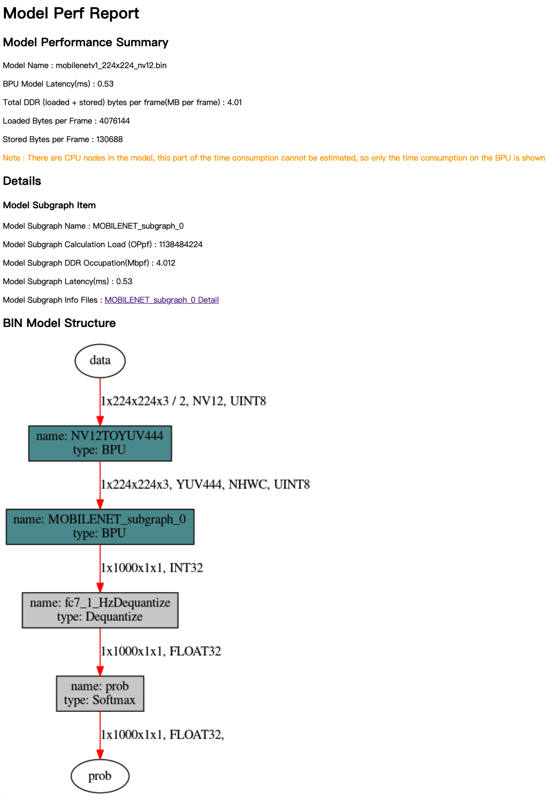
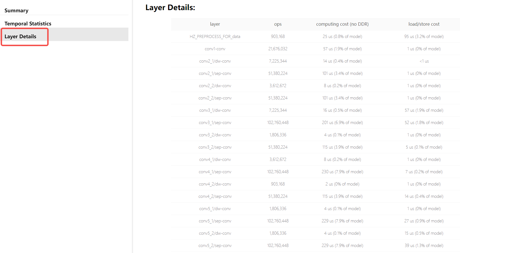
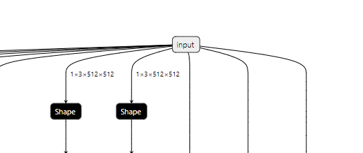
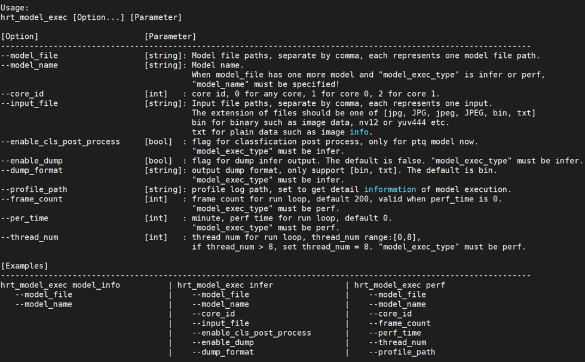
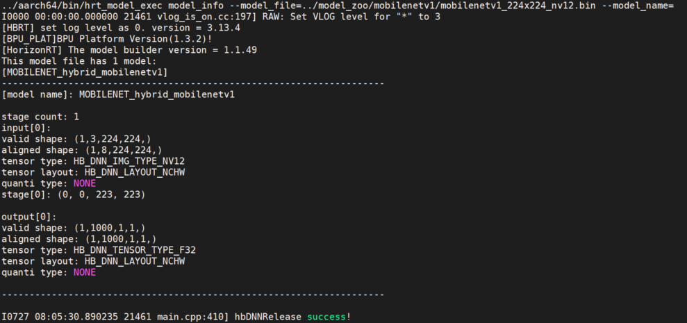
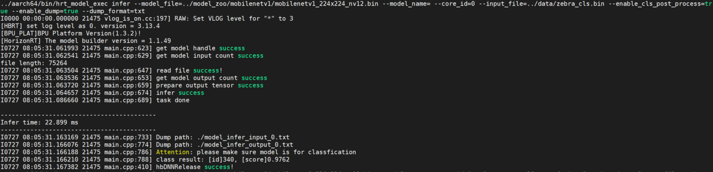
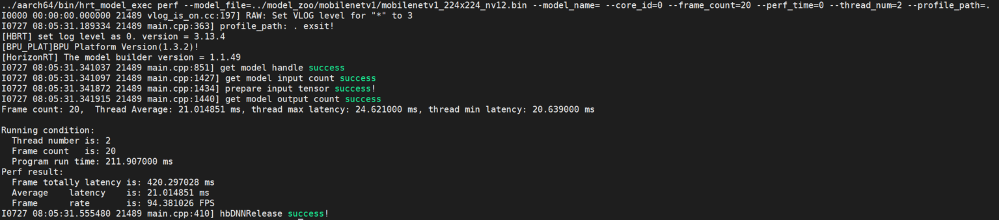
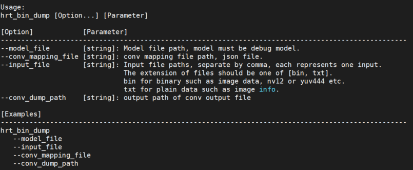
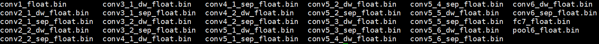

# 9.3 进阶指南

## 概述

本指南适用于已了解地平线入门指南内容的用户，主要介绍地平线算法工具链中训练后量化PTQ方法的原理及步骤详解、模型算子支持说明、以及模型上板运行的嵌入式应用开发说明等；
若您是第一次使用地平线算法工具链的用户，建议您跳转至 [入门指南](./horizon_beginner)章节进行学习。

## 环境安装

本章节主要介绍地平线算法工具链完整开发环境部署方法。

### 交付物使用说明{#deliverables_instructions}


在进行算法工具链使用环境部署前，请下载地平线提供的[嵌入式应用开发Sample交付包](https://pan.horizon.ai/index.php/s/iZwyzXoJLs8Btme)到Linux开发机环境中。

#### 示例包源码目录结构说明

解压算法工具链SDK源码包：

```bash
  tar -xvf Ai_Toolchain_Package-release-vX.X.X-OE-vX.X.X.tar.xz
```

解压后的目录结构如下：

-   **ai_benchmark**: 目录下提供了常见的分类、检测和分割模型的评测示例，包括性能评测和精度评测两部分。

-   **horizon_runtime_sample**: 目录下提供了定点模型的上板示例。

-   **package**: 目录下包含了发布物运行的一些基础库和组件

    1. ``board`` 文件夹下为板端可执行程序。

    2. ``host`` 文件夹下为x86开发环境下的环境依赖、工具依赖以及模型推理相关的libdnn库和头文件。 


### 开发机部署{#machine_deploy}

对于开发机的环境部署，地平线支持使用Docker部署方式。

#### 开发机准备


为了顺利地使用算法工具链，地平线建议您选择的开发机应满足以下要求：

  | 硬件/操作系统 | 要求                                 |
  |---------------|------|
  | CPU           | CPU I3以上或者同级别E3/E5的处理器    |
  | 内存          | 16G或以上级别                        |
  | GPU(可选)     | CUDA11、驱动版本Linux:>= 450.80.02*<br/>适配显卡包括但不限于：<br/>1)GeForce RTX 3090<br/>2)GeForce RTX 2080 Ti<br/>3)NVIDIA TITAN V<br/>4)Tesla V100S-PCIE-32GB              
  | 系统          | CentOS 7、Ubuntu 18.04及以上         |

更多关于CUDA与显卡的兼容性问题请参考[NVIDIA官网信息](https://docs.nvidia.com/deploy/cuda-compatibility/) 。

#### 使用Docker环境

为了帮助您快速使用算法工具链，地平线提供了包含完整开发环境的Docker镜像，大大简化了环境的部署过程。

在阅读此部分内容前，我们希望您的开发机中已经预装好了Docker的基础环境。
地平线要求的Docker基础环境信息如下：

- Docker（>=1.12 建议安装18.03.0-ce）, 安装手册 https://docs.docker.com/install/。
- NVIDIA Docker（2.0.3），安装手册[NVIDIA/nvidia-docker](https://github.com/nvidia/nvidia-docker/wiki)。

完成Docker环境安装后，需要将无root权限的用户添加到Docker用户组中。参考如下命令：

```bash
  sudo groupadd docker
  sudo gpasswd -a ${USER} docker
  sudo systemctl restart docker  # CentOS7/Ubuntu
  # re-login
```

请从[地平线 docker hub](https://hub.docker.com/r/openexplorer/ai_toolchain_centos_7_xj3/tags) ，获取模型转换编译需要使用的 **最新版本的Docker镜像**。
Docker镜像文件命名形式为 ``openexplorer/ai_toolchain_centos_7_xj3:{version}``。

:::tip 小技巧

  执行命令时将 ``{version}`` 替换为您获取到的 **最新版本的Docker镜像** ，例如：[地平线 docker hub](https://hub.docker.com/r/openexplorer/ai_toolchain_centos_7_xj3/tags)  中目前的最新版本为 ``openexplorer/ai_toolchain_centos_7_xj3:v2.4.2``。

  本地Docker镜像包版本，可以联系地平线技术支持团队获取。

  开发机并不是必须含有GPU卡，一般使用CPU开发机加载Docker镜像即可做模型转换！
:::

每个镜像文件在第一次使用前，需要拉取镜像。

- 镜像拉取命令为：

  ```bash
    docker pull openexplorer/ai_toolchain_centos_7_xj3:v2.4.2
  ```
然后执行以下命令运行Docker容器。

- CPU开发机Docker容器执行以下命令：

  ```bash
    // 运行 docker 镜像的命令
  
    export version=v2.4.2
  
    export ai_toolchain_package_path=/home/users/xxx/ai_toolchain_package
  
    export dataset_path=/home/users/xxx/data/
  
    docker run -it --rm \
      -v "$ai_toolchain_package_path":/open_explorer \
      -v "$dataset_path":/data \
      openexplorer/ai_toolchain_centos_7_xj3:"${version}"
  ```
- GPU开发机 Docker容器执行以下命令：

  ```bash
    // 运行 docker 镜像的命令

    export version=v2.4.2

    export ai_toolchain_package_path=/home/users/xxx/ai_toolchain_package

    export dataset_path=/home/users/xxx/data/

    docker run -it --runtime=nvidia -e NVIDIA_DRIVER_CAPABILITIES=compute,utility \
      -e NVIDIA_VISIBLE_DEVICES=all --rm --shm-size="15g" \
      -v "$ai_toolchain_package_path":/open_explorer \
      -v "$dataset_path":/data \
      openexplorer/ai_toolchain_centos_7_xj3:"${version}"
  ```
:::info 备注

  在执行上述命令时：

  - ``dataset_path`` 为数据集文件目录，如果该目录不存在会导致加载问题，需要创建好后再运行命令。
  
  - 公共数据集可以参考以下链接下载：    

      VOC：http://host.robots.ox.ac.uk/pascal/VOC/  （使用VOC2012版本）

      COCO：https://cocodataset.org/#download

      ImageNet：https://www.image-net.org/download.php
      
      Cityscapes：https://github.com/mcordts/cityscapesScripts
:::
至此，您已经成功通过Docker镜像进入完整的算法工具链开发环境。
您可以键入 ``hb_mapper --help`` 命令验证是否可以正常得到帮助信息：

```bash
  [root@d67382e74eea open_explorer]# hb_mapper --help
  Usage: hb_mapper [OPTIONS] COMMAND [ARGS]...

    hb_mapper is an offline model transform tool provided by horizon.

  Options:
    --version  Show the version and exit.
    --help     Show this message and exit.

  Commands:
    checker    check whether the model meet the requirements.
    infer      inference and dump output feature as float vector.
    makertbin  transform caffe model to quantization model, generate runtime...
```
若hb_mapper工具已正常输出日志， 说明环境已安装部署完成，请到 **开发板部署** 章节，进行开发板的环境安装。


### 开发板部署


开发板部署需要您按照刷机说明，将开发版镜像更新到最新版本，升级方法请参考[安装系统](../getting_start/install_os#flash_system) 章节内容， 升级完成后，再将相关补充文件拷贝到开发板中即可。


#### 补充文件准备

算法工具链的部分补充工具未包含在系统镜像中，这些工具已经放置在 ``Ai_Toolchain_Package-release-vX.X.X-OE-vX.X.X/package/`` 安装包中，
进入到 ``Ai_Toolchain_Package-release-vX.X.X-OE-vX.X.X/package/board`` 执行install脚本。
执行命令如下：

```bash
  bash install.sh ${board_ip}
```
:::info 备注

  其中，``${board_ip}`` 是您为开发板设置的IP地址，请确保在开发机上可以访问该IP。
  成功安装后，重新启动开发板，在开发板上执行 ``hrt_model_exec`` 可以验证安装是否成功。
:::

### 版本管理工具使用说明

本章节主要介绍ddk_vcs版本管理工具的使用说明，便于开发者了解当前开发机环境中算法工具链依赖包的版本情况。

:::tip 小技巧
  版本管理工具主要用于在使用Docker环境进行模型PTQ转换出现错误时做DEBUG使用，若模型转换功能正常，可跳过此章节阅读。
:::

版本管理工具包括以下功能：

- ddk_vcs list;
- ddk_vcs install; 
- ddk_vcs uninstall; 
- ddk_vcs patch; 
- ddk_vcs show; 


#### ddk_vcs list

ddk_vcs list 用于列出已安装的软件包。

不加参数执行此命令时，结果会展示当前已安装的各个模块的信息。使用示例如下：

```bash

  [horizon@gpu-dev067 ai_toolchain]$ ddk_vcs list
  Host package version: v2.0.3
  The following packages versions
  Platform        Package         Version MD5
  --------------- --------------- ------- -------------
  aarch_64        appsdk          032419  093e13b44e
  aarch_64        dnn             1.8.1g  aff0f6f4de
  x86_64_gcc5.4.0 dnn_x86         1.8.1g  e8e6bf9ed5
  x86             horizon-nn      0.13.3  origin:0.13.3
  x86             horizon-nn-gpu  0.13.3  origin:N/A
  x86             horizon-tc-ui   1.6.4   origin:1.6.4
  x86             hbdk            3.28.3  origin:3.28.3
```
:::info 备注
  最后几行的origin信息会在每次使用工具链SDK包内的install脚本进行安装后更新为当前环境下的版本，
  后续在使用ddk_vcs进行安装时则不会改变，只会改变Version的值。
:::

使用 ``-p`` 参数以后会显示当前可以安装的模块版本情况，可以通过 ``ddk_vcs install`` 进行安装，使用示例如下：

```bash

  [horizon@gpu-dev004]$ ddk_vcs list -p
  Host package version: 1.5.1
  The following packages versions
  Platform        Local Package                 Version MD5
  --------------- ----------- ------- ----------
  aarch_64        appsdk_1.9.0.tar.gz           1.9.0   bf01140c9d
  aarch_64        bpu_predict_1.10.2.tar.gz     1.10.2  5b6e5dd6c5
  aarch_64        dnn_1.1.2a.tar.gz             1.1.2a  fdb5729f4f
  x86_64_gcc5.4.0 bpu_predict_1.10.2.tar.gz     1.10.2  4dbdd980a7
  x86_64_gcc5.4.0 dnn_x86_1.1.2a.tar.gz         1.1.2a  5bf5fcd4fe
```

#### ddk_vcs install

ddk_vcs install 用于对安装包进行安装。
用户可以直接通过 ``ddk_vcs install`` 将对应的模块tar包进行安装。安装时需要指定对应的platform。使用示例如下：

```bash

  [horizon@gpu-dev004]$ ddk_vcs install bpu_predict_1.10.2.tar.gz -p aarch_64
  bpu_predict installed successfully, version: 1.10.2, platform: aarch_64
  [horizon@gpu-dev067 ai_toolchain]$ ddk_vcs install hbdk-3.28.3-py3-none-linux_x86_64.whl  horizon_nn-0.13.3-py3-none-any.whl
  hbdk-3.28.3-py3-none-linux_x86_64.whl installed successfully
  horizon_nn-0.13.3-py3-none-any.whl installed successfully
```
在使用 ``ddk_vcs list -p`` 后用户可以得到自己当前host package中各个模块包的版本信息，
然后使用 ``ddk_vcs install`` 可以很方便地切换各个版本，使用示例如下：

```bash

  [horizon@gpu-dev004]$ ddk_vcs install bpu_predict==1.7.2  --platform aarch_64
  bpu_predict installed successfully, version: 1.7.2, platform: aarch_64
```
如果本地没有对应版本可以指定安装包位置进行安装。

#### ddk_vcs uninstall

ddk_vcs uninstall 用于卸载指定模块。使用示例如下：

```bash

  [horizon@gpu-dev004]$ ddk_vcs uninstall bpu_predict --platform aarch_64
  Start to uninstall modules, platform: aarch_64
  bpu_predict uninstalled successfully, version: 1.10.2, platform: aarch_64
```
#### ddk_vcs patch


使用 ``ddk_vcs patch ddk_patch.tar.gz`` 可以安装预先制作好的patch包。使用示例如下：

```bash

  [horizon@gpu-dev004]$ ddk_vcs patch ddk_patch.tar.gz
  bpu_predict installed successfully, version: 1.7.2_patch0, platform: aarch64
```
#### ddk_vcs show


ddk_vcs show 用于显示有关已安装软件包的信息。使用 ``ddk_vcs show [模块名]`` ，可以展示对应模块的信息。使用示例如下：

```bash

  [horizon@gpu-dev004]$ ddk_vcs show bpu_predict
  Host package version 1.5.1
  The following packages versions
  Platform        Package     Version       MD5
  --------------- ----------- ------------- ----------
  aarch_64        bpu_predict 1.10.2        5b6e5dd6c5
  x86_64_gcc5.4.0 bpu_predict 1.10.2_patch1 d4f8e37921
```
如果2个架构内有同名依赖，可以使用 ``-p/--platform`` 指定架构名进行过滤。使用示例如下：

```bash

  [horizon@gpu-dev004]$ ddk_vcs show bpu_predict -p aarch_64
  Host package version 1.5.1
  The following packages versions
  Platform Package     Version MD5
  -------- ----------- ------- ----------
  aarch_64 bpu_predict 1.10.2  5b6e5dd6c5
```


## PTQ原理及步骤详解

### 简介{#PTQ_introduction}

模型转换是指将原始浮点模型转换为地平线混合异构模型的过程。原始浮点模型（文中部分地方也称为浮点模型）是指您通过TensorFlow/PyTorch等DL框架训练得到的可用模型，这个模型的计算精度为float32；混合异构模型是一种适合在地平线处理器上运行的模型格式。
本章节将反复使用到这两种模型名词，为避免理解歧义，请先理解这个概念再阅读下文。

配合地平线算法工具链的模型完整开发过程，需要经过 **浮点模型准备**、 **模型验证**、 **模型转换**、 **性能评估** 和 **精度评估** 共五个重要阶段，如下图:


**浮点模型准备** 本阶段用来确保原始浮点模型的格式为地平线模型转换工具支持的格式，原始浮点模型来自于您通过TensorFlow/PyTorch等DL框架训练得到可用模型。具体的浮点模型要求与建议，请阅读[浮点模型准备](#model_preparation)章节内容。

**模型验证** 本阶段用来校验原始浮点模型是否满足地平线算法工具链的要求。地平线提供 ``hb_mapper checker`` 检查工具来完成浮点模型的检查。具体使用方法，请阅读[验证模型](#model_check) 章节内容。

**模型转换** 本阶段用来完成浮点模型到地平线混合异构模型的转换，经过这个阶段，您将得到一个可以在地平线处理器上运行的模型。地平线提供 ``hb_mapper makertbin`` 转换工具来完成模型优化、量化和编译等关键步骤。具体使用方法，请阅读[模型转换](#model_conversion)章节内容。

**性能评估** 本阶段主要用于测评地平线混合异构模型的推理性能情况，地平线提供了模型性能评估的工具，您可以使用这些工具验证模型性能是否达到应用要求。具体使用说明，请阅读 [模型性能分析与调优](#performance_evaluation)章节内容。

**精度评估** 本阶段主要用于测评地平线混合异构模型的推理精度情况，地平线提供了模型精度评估的工具。具体使用说明，请阅读[模型精度分析与调优](#accuracy_evaluation)章节内容。


### 模型准备{#model_preparation}


基于公开DL框架训练得到的浮点模型是地平线模型转换工具的输入，目前转换工具支持的DL框架如下：


  | **框架**         | Caffe | PyTorch | TensorFlow | MXNet | PaddlePaddle |
  |-------|------------|--------------|--------------|--------------|--------------|
  | **地平线工具链** | 支持  |   支持（转ONNX）|支持（转ONNX）|支持（转ONNX）|支持（转ONNX）|


以上框架中， Caffe框架导出的caffemodel是直接支持的，PyTorch、TensorFlow和MXNet等DL框架通过转换到ONNX格式间接支持。

对于不同框架到ONNX的转换，目前都有对应的标准化方案，参考如下：

-    Pytorch2Onnx：PytTorch官方API支持直接将模型导出为ONNX模型，参考链接：
         https://pytorch.org/tutorials/advanced/super_resolution_with_onnxruntime.html。

-    Tensorflow2Onnx：基于ONNX社区的onnx/tensorflow-onnx 进行转换，参考链接：
         https://github.com/onnx/tensorflow-onnx。

-    MXNet2Onnx：MXNet官方API支持直接将模型导出为ONNX模型，参考链接：
         https://github.com/dotnet/machinelearning/blob/master/test/Microsoft.ML.Tests/OnnxConversionTest.cs。

-    更多框架的ONNX转换支持，参考链接：
         https://github.com/onnx/tutorials#converting-to-onnx-format。


:::tip 小技巧

  关于Pytorch、PaddlePaddle、TensorFlow2框架的模型，我们也提供了如何导出ONNX及模型可视化的教程，请参考：

  - [Pytorch导出ONNX及模型可视化教程](https://developer.horizon.ai/forumDetail/146177165367615499) ；

  - [PaddlePaddle导出ONNX及模型可视化教程](https://developer.horizon.ai/forumDetail/146177165367615500) ；

  - [TensorFlow2导出ONNX及模型可视化教程](https://developer.horizon.ai/forumDetail/146177165367615501) ；
:::

:::caution 注意

  - 浮点模型中所使用的算子需要符合地平线算法工具链的算子约束条件，具体请阅读[模型算子支持列表](#supported_op_list_and_restrictions) 章节进行查询。

  - 目前转换工具仅支持输出个数小于或等于32的模型进行转换。
  
  - 支持 ``caffe 1.0`` 版本的caffe浮点模型和 ``ir_version≤7`` , ``opset=10`` 、 ``opset=11`` 版本的onnx浮点模型量化成地平线支持的定点模型, onnx模型的ir_version与onnx版本的对应关系请参考[onnx官方文档](https://github.com/onnx/onnx/blob/main/docs/Versioning.md) ；

  - 模型输入维度只支持 ``固定4维`` 输入NCHW或NHWC（N维度只能为1），例如：1x3x224x224或1x224x224x3， 不支持动态维度及非4维输入；

  - 浮点模型中不要包含有 ``后处理算子``，例如：nms算子。

:::

### 模型验证{#model_check}


模型正式转换前，请先使用 ``hb_mapper checker`` 工具进行模型验证，确保其符合地平线X3处理器的支持约束。

:::tip 小技巧

  建议参考使用地平线模型转换 ``horizon_model_convert_sample`` 示例包中的caffe、onnx等示例模型的脚本方法: ``01_check.sh``。
:::
#### 使用 ``hb_mapper checker`` 工具验证模型
```
hb_mapper checker 工具的使用方式如下：
```
```
  hb_mapper checker --model-type ${model_type} \
                    --march ${march} \
                    --proto ${proto} \
                    --model ${caffe_model/onnx_model} \
                    --input-shape ${input_node} ${input_shape} \
                    --output ${output}
```

hb_mapper checker 参数解释：

--model-type<br/>
  用于指定检查输入的模型类型，目前只支持设置 ``caffe`` 或者 ``onnx``。

--march<br/>model_conversion
  此参数仅在 ``model-type`` 指定 ``caffe`` 时有效，取值为Caffe模型的prototxt文件名称。

--model<br/>
  在 ``model-type`` 被指定为 ``caffe`` 时，取值为Caffe模型的caffemodel文件名称。
  在 ``model-type``  被指定为 ``onnx`` 时，取值为ONNX模型文件名称。

--input-shape<br/>
  可选参数，明确指定模型的输入shape。
  取值为 ``{input_name} {NxHxWxC/NxCxHxW}`` ，``input_name`` 与shape之间以空格分隔。
  例如模型输入名称为 ``data1``，输入shape为 ``[1,224,224,3]``，
  则配置应该为 ``--input_shape data1 1x224x224x3``。
  如果此处配置shape与模型内shape信息不一致，以此处配置为准。
:::info 备注
  注意一个 ``--input-shape`` 只接受一个name和shape组合，如果您的模型有多个输入节点，
  在命令中多次配置 ``--input-shape`` 参数即可。
:::

--output<br/>
  该参数已经废弃, log信息默认存储于 ``hb_mapper_checker.log`` 中。


#### 检查异常处理

如果模型检查步骤异常终止或者出现报错信息，则说明模型验证不通过，请根据终端打印或在当前路径下生成的 ``hb_mapper_checker.log`` 日志文件确认报错信息和修改建议。

例如：以下配置中含不可识别算子类型 ``Accuracy``：

```
  layer {
    name: "data"
    type: "Input"
    top: "data"
    input_param { shape: { dim: 1 dim: 3 dim: 224 dim: 224 } }
  }
  layer {
    name: "Convolution1"
    type: "Convolution"
    bottom: "data"
    top: "Convolution1"
    convolution_param {
      num_output: 128
      bias_term: false
      pad: 0
      kernel_size: 1
      group: 1
      stride: 1
      weight_filler {
        type: "msra"
      }
    }
  }
  layer {
    name: "accuracy"
    type: "Accuracy"
    bottom: "Convolution3"
    top: "accuracy"
    include {
      phase: TEST
    }
  }
```
使用 ``hb_mapper checker`` 检查这个模型，您会在hb_mapper_checker.log中得到如下信息：

```bash
  ValueError: Not support layer name=accuracy type=Accuracy
```

:::caution 注意

  - 如果模型检查步骤异常终止或者出现报错信息，则说明模型验证不通过，请根据终端打印或在当前路径下生成的 ``hb_mapper_checker.log`` 日志文件确认报错信息和修改建议，错误信息可以在 [模型量化错误及解决方法](../common_questions/toolchain#model_convert_errors_and_solutions) 章节来查找错误的解决方法，若以上步骤仍不能排除问题，请联系地平线技术支持团队或在[地平线官方技术社区](https://developer.horizon.ai/)提出您的问题，我们将在24小时内给您提供支持。
:::


#### 检查结果解读{#check_result}

如果不存在ERROR，则顺利通过校验。 ``hb_mapper checker`` 工具将直接输出如下信息：

```
  ==============================================
  Node         ON   Subgraph  Type
  ----------
  conv1        BPU  id(0)     HzSQuantizedConv
  conv2_1/dw   BPU  id(0)     HzSQuantizedConv
  conv2_1/sep  BPU  id(0)     HzSQuantizedConv
  conv2_2/dw   BPU  id(0)     HzSQuantizedConv
  conv2_2/sep  BPU  id(0)     HzSQuantizedConv
  conv3_1/dw   BPU  id(0)     HzSQuantizedConv
  conv3_1/sep  BPU  id(0)     HzSQuantizedConv
  ...
```

结果中每行都代表一个模型节点的check情况，每行含Node、ON、Subgraph和Type四列，分别为节点名称、执行节点计算的硬件、节点所属子图和节点映射到的地平线算子名称。
如果模型在网络结构中出现了CPU计算的算子，hb_mapper checker工具将把这个算子前后连续在BPU计算的部分拆分为两个Subgraph（子图）。

#### 检查结果的调优指导

在最理想的情况下，模型网络结构中的算子都应该在BPU上运行，也就是只有一个子图。
如果出现了CPU算子导致拆分多个子图， ``hb_mapper checker`` 工具会给出导致CPU算子出现的具体原因。
例如：以下Caffe模型的出现了Reshape + Pow + Reshape 的结构, 从算子约束列表中我们可以看到, Reshape 算子目前为在CPU上运行的算子, 而Pow的shape也是非4维的。


因此模型最终检查结果也会出现分段情况, 如下:

```
  2022-05-25 15:16:14,667 INFO The converted model node information:
  ====================================================================================
  Node                                    ON   Subgraph  Type
  -------------
  conv68                                  BPU  id(0)     HzSQuantizedConv
  sigmoid16                               BPU  id(0)     HzLut
  axpy_prod16                             BPU  id(0)     HzSQuantizedMul
  UNIT_CONV_FOR_eltwise_layer16_add_1     BPU  id(0)     HzSQuantizedConv
  prelu49                                 BPU  id(0)     HzPRelu
  fc1                                     BPU  id(0)     HzSQuantizedConv
  fc1_reshape_0                           CPU  --        Reshape
  fc_output/square                        CPU  --        Pow
  fc_output/sum_pre_reshape               CPU  --        Reshape
  fc_output/sum                           BPU  id(1)     HzSQuantizedConv
  fc_output/sum_reshape_0                 CPU  --        Reshape
  fc_output/sqrt                          CPU  --        Pow
  fc_output/expand_pre_reshape            CPU  --        Reshape
  fc_output/expand                        BPU  id(2)     HzSQuantizedConv
  fc1_reshape_1                           CPU  --        Reshape
  fc_output/expand_reshape_0              CPU  --        Reshape
  fc_output/op                            CPU  --        Mul

```
根据 hb_mapper checker 给出的提示，一般来说算子运行在BPU上会有更好的性能表现，这里可以将pow、reshape 这类CPU算子从模型中移除，将对应算子的功能放入后处理中计算，从而减少子图数量。

当然，多个子图也不会影响整个转换流程，但会较大程度地影响模型性能，建议尽量调整模型算子到BPU上执行，可参考X3算子支持列表中的BPU算子支持列表来做同功能的算子替换或者将模型中的CPU算子移到模型推理的前、后处理中去做CPU计算。


### 模型转换{#model_conversion}

模型转换阶段会完成浮点模型到地平线混合异构模型的转换，经过这个阶段，您将得到一个可以在地平线处理器上运行的模型。
在进行转换之前，请确保已经顺利通过了上文的验证模型过程。

模型转换使用 ``hb_mapper makertbin`` 工具完成，转换期间会完成模型优化和校准量化等重要过程，校准需要依照模型预处理要求准备校准数据。
为了方便您全面了解模型转换，本节将依次介绍校准数据准备、转换工具使用、转换内部过程解读、转换结果解读和转换产出物解读等内容。


#### 准备校准数据

在进行模型转换时，校准阶段会需要 **100份左右** 标定样本输入，每一份样本都是一个独立的数据文件。
为了确保转换后模型的精度效果，我们希望这些校准样本来自于您训练模型使用的 **训练集或验证集** ，不要使用非常少见的异常样本，例如 **纯色图片、不含任何检测或分类目标的图片等**。

您需要把取自训练集/验证集的样本做与模型推理（inference）前一样的前处理，
处理完后的校准样本会与原始模型具备一样的数据类型( ``input_type_train`` )、尺寸( ``input_shape`` )和
layout( ``input_layout_train`` )，对于featuremap输入的模型，您可以通过 ``numpy.tofile`` 命令将数据保存为float32格式的二进制文件，
工具链校准时会基于 ``numpy.fromfile`` 命令进行读取。
例如，使用ImageNet训练的用于分类的原始浮点模型，它只有一个输入节点，输入信息描述如下：

- 输入类型：``BGR``
- 输入layout：``NCHW``
- 输入尺寸：``1x3x224x224``

使用验证集做模型推理（inference）时的数据预处理如下：

1. 图像长宽等比scale,短边缩放到256。
2. ``center_crop`` 方法获取224x224大小图像。
3. 按通道减mean。
4. 数据乘以scale系数。

针对上述举例模型的样本处理代码如下：

为避免过长代码篇幅，各种简单transformer实现代码未贴出，具体使用请参考[transformer使用方法](../common_questions/toolchain#transposetransformer) 章节内容。

:::tip 小技巧

  建议参考使用地平线模型转换 ``horizon_model_convert_sample`` 示例包中的caffe、onnx等示例模型的预处理步骤方法: ``02_preprocess.sh`` 和 ``preprocess.py`` 。
:::
```
  # 本示例使用skimage，如果是opencv会有所区别
  # 需要您特别注意的是，transformers中并没有体现减mean和乘scale的处理
  # mean和scale操作已经融合到了模型中，请参考下文norm_type/mean_value/scale_value配置
  def data_transformer():
    transformers = [
    # 长宽等比scale，短边缩放至256
    ShortSideResizeTransformer(short_size=256),
    # CenterCrop获取224x224图像
    CenterCropTransformer(crop_size=224),
    # skimage读取结果为NHWC排布，转换为模型需要的NCHW
    HWC2CHWTransformer(),
    # skimage读取结果通道顺序为RGB，转换为模型需要的BGR
    RGB2BGRTransformer(),
    # skimage读取数值范围为[0.0,1.0]，调整为模型需要的数值范围
    ScaleTransformer(scale_value=255)
    ]

    return transformers

  # src_image 标定集中的原图片
  # dst_file 存放最终标定样本数据的文件名称
  def convert_image(src_image, dst_file, transformers)：
    image = skimage.img_as_float(skimage.io.imread(src_file))
    for trans in transformers:
    image = trans(image)
    # 模型指定的input_type_train BGR数值类型是UINT8
    image = image.astype(np.uint8)
    # 二进制存储标定样本到数据文件
    image.tofile(dst_file)

  if __name__ == '__main__':
    # 此处表示原始标定图片集合，伪代码
    src_images = ['ILSVRC2012_val_00000001.JPEG'，...]
    # 此处表示最终标定文件名称（后缀名不限制），伪代码
    # calibration_data_bgr_f32是您在配置文件中指定的cal_data_dir
    dst_files = ['./calibration_data_bgr_f32/ILSVRC2012_val_00000001.bgr'，...]

    transformers = data_transformer()
    for src_image, dst_file in zip(src_images, dst_files):
    convert_image(src_image, dst_file, transformers)
```


#### 使用 hb_mapper makertbin 工具转换模型{#makertbin}

:::tip 小技巧

  建议参考使用地平线模型转换 ``horizon_model_convert_sample`` 示例包中的caffe、onnx等示例模型的脚本方法: ``03_build.sh``。
:::
```
hb_mapper makertbin命令使用方式如下：
```
  ```bash

    hb_mapper makertbin --config ${config_file}  \
                        --model-type  ${model_type}
  ```
hb_mapper makertbin参数解释：

--model-type<br/>
  用于指定转换输入的模型类型，目前支持设置 ``caffe`` 或者 ``onnx``。

--config<br/>
  模型编译的配置文件，内容采用yaml格式，文件名使用.yaml后缀。完整的配置文件模板参考如下章节内容。


:::caution 注意

  - ``yaml配置文件``，可直接使用[caffe模型量化yaml文件模板](../common_questions/toolchain#caffe_yaml_template) 和[onnx模型量化yaml文件模板](../common_questions/toolchain#onnx_yaml_template)模板文件进行填写。

  - 若 hb_mapper makertbin 步骤异常终止或者出现报错信息，则说明模型转换失败，请根据终端打印或在当前路径下生成的 ``hb_mapper_makertbin.log`` 日志文件确认报错信息和修改建议，错误信息可以在 [模型量化错误及解决方法](../common_questions/toolchain#model_convert_errors_and_solutions)章节来查找错误的解决方法，若以上步骤仍不能排除问题，请联系地平线技术支持团队或在[地平线官方技术社区](https://developer.horizon.ai/)提出您的问题，我们将在24小时内给您提供支持。
:::

#### 模型转换yaml配置参数说明{#yaml_config}

:::info 备注

  此处配置文件仅作展示，在实际模型配置文件中 ``caffe_model`` 与 ``onnx_model`` 两个参数只存在其中之一。
  即，要么是Caffe模型，要么是ONNX模型。
:::
```
  # 模型参数组
  model_parameters:
    # 原始Caffe浮点模型描述文件
    prototxt: '***.prototxt'

    # 原始Caffe浮点模型数据模型文件
    caffe_model: '****.caffemodel'

    # 原始Onnx浮点模型文件
    onnx_model: '****.onnx'

    # 转换的目标处理器架构，保持默认，X3 bpu使用的是bernoulli2架构
    march: 'bernoulli2'

    # 模型转换输出的用于上板执行的模型文件的名称前缀
    output_model_file_prefix: 'mobilenetv1'

    # 模型转换输出的结果的存放目录
    working_dir: './model_output_dir'

    # 指定转换后混合异构模型是否保留输出各层的中间结果的能力,保持默认即可
    layer_out_dump: False

  # 输入信息参数组
  input_parameters:
    # 原始浮点模型的输入节点名称
    input_name: "data"

    # 原始浮点模型的输入数据格式（数量/顺序与input_name一致）
    input_type_train: 'bgr'

    # 原始浮点模型的输入数据排布（数量/顺序与input_name一致）
    input_layout_train: 'NCHW'

    # 原始浮点模型的输入数据尺寸
    input_shape: '1x3x224x224'

    # 网络实际执行时，输入给网络的batch_size, 默认值为1
    input_batch: 1

    # 在模型中添加的输入数据预处理方法
    norm_type: 'data_mean_and_scale'

    # 预处理方法的图像减去的均值, 如果是通道均值，value之间必须用空格分隔
    mean_value: '103.94 116.78 123.68'

    # 预处理方法的图像缩放比例，如果是通道缩放比例，value之间必须用空格分隔
    scale_value: '0.017'

    # 转换后混合异构模型需要适配的输入数据格式（数量/顺序与input_name一致）
    input_type_rt: 'yuv444'

    # 输入数据格式的特殊制式
    input_space_and_range: 'regular'

    # 转换后混合异构模型需要适配的输入数据排布（数量/顺序与input_name一致），若input_type_rt配置为nv12，则此处参数不需要配置
    input_layout_rt: 'NHWC'

  # 校准参数组
  calibration_parameters:
    # 模型校准使用的标定样本的存放目录
    cal_data_dir: './calibration_data'

    # 指定校准数据二进制文件的数据存储类型。
    cal_data_type: 'float32'

    # 开启图片校准样本自动处理（skimage read; resize到输入节点尺寸）
    #preprocess_on: False  
    
    # 校准使用的算法类型, 优先使用的 default 校准算法
    calibration_type: 'default'

    # max 校准方式的参数
    # max_percentile: 1.0

    # 强制指定OP在CPU上运行，一般不需要配置，在模型精度调优阶段可以开启此功能，用于尝试精度优化
    #run_on_cpu:  {OP_name}

    # 强制指定OP在BPU上运行， 一般不需要配置，在模型性能调优阶段可以开启此功能，用于尝试性能优化
    # run_on_bpu:  {OP_name}

  # 编译参数组
  compiler_parameters:
    # 编译策略选择
    compile_mode: 'latency'

    # 是否打开编译的debug信息，保持默认的 False 
    debug: False

    # 模型运行核心数
    core_num: 1

    # 模型编译的优化等级选择，保持默认的 O3
    optimize_level: 'O3'

  # 此参数组，无需配置，只在有自定义CPU算子时开启使用
  #custom_op: 
    # 自定义op的校准方式, 推荐使用注册方式 register
    #custom_op_method: register

    # 自定义OP的实现文件, 多个文件可用";"分隔, 该文件可由模板生成, 详情见自定义OP相关文档
    #op_register_files: sample_custom.py

    # 自定义OP实现文件所在的文件夹, 请使用相对路径
    #custom_op_dir: ./custom_op
```

配置文件主要包含模型参数组、输入信息参数组、校准参数组和编译参数组。
在您的配置文件中，四个参数组位置都需要存在，具体参数分为可选和必选，可选参数可以不配置。

具体参数的设置形式为： ``param_name:  'param_value'`` ；
若参数存在多个值时，每个值之间使用 ``';'`` 符号进行分隔： ``param_name:  'param_value1; param_value2; param_value3'`` ；具体配置方法可参考：``run_on_cpu: 'conv_0; conv_1; conv12'`` 。

:::tip 小技巧
  当模型为多输入模型时, 建议用户将可选参数（ ``input_name``, ``input_shape`` 等）显式的写出, 以免造成参数对应顺序上的错误。
:::

:::caution 注意

  - 请注意，如果设置 ``input_type_rt`` 为 ``nv12`` ，则模型的输入尺寸中不能出现奇数。
  - 请注意，目前X3上暂不支持 ``input_type_rt`` 为 ``yuv444`` 且 ``input_layout_rt`` 为 ``NCHW`` 组合的场景。
:::

以下是具体参数信息，参数会比较多，我们依照上述的参数组次序介绍。


- ###### 模型参数组

| 参数名称 | 参数配置说明   | 取值范围说明 |    可选/必选     |
|------------|----------|----------|--------|
|``prototxt``| **参数作用**：指定Caffe浮点模型的prototxt文件名称。<br/>**参数说明**：在 ``hb_mapper makertbin``的``model-type`` 为 ``caffe`` 时必须配置。| **取值范围**：无。<br/> **默认配置**：无。|可选 |
|``caffe_model``| **参数作用**：指定Caffe浮点模型的caffemodel文件名称。<br/>**参数说明**：在 ``hb_mapper makertbin`` 的``model-type`` 为 ``caffe`` 时必须配置。| **取值范围**：无。<br/> **默认配置**：无。|可选 |
|``onnx_model``| **参数作用**：指定ONNX浮点模型的onnx文件名称。<br/>**参数说明**：在 ``hb_mapper makertbin`` 的``model-type`` 为 ``onnx`` 时必须配置。| **取值范围**：无。<br/> **默认配置**：无。|可选 |
|``march``| **参数作用**：指定产出混合异构模型需要支持的平台架构。<br/>**参数说明**：X3处理器对应的微框架。根据您使用的平台选择。| **取值范围**：``bernoulli2``。<br/> **默认配置**：``bernoulli2``。|必选 |
|``output_model_file_prefix``| **参数作用**：指定转换产出混合异构模型的名称前缀。<br/>**参数说明**：输出的定点模型文件的名称前缀。| **取值范围**：无。<br/> **默认配置**：无。|必选 |
|``working_dir``| **参数作用**：指定模型转换输出的结果的存放目录。<br/>**参数说明**：若该目录不存在, 则工具会自动创建目录。| **取值范围**：无。<br/> **默认配置**：``model_output``。|可选 |
|``layer_out_dump``| **参数作用**：指定混合异构模型是否保留输出中间层值的能力。<br/>**参数说明**：输出中间层的值是调试需要用到的手段，常规状态下请不要开启。| **取值范围**：``True`` 、 ``False``。<br/> **默认配置**：``False``。|可选 |
|``output_nodes``| **参数作用**：指定模型的输出节点。<br/>**参数说明**：一般情况下，转换工具会自动识别模型的输出节点。此参数用于支持您指定一些中间层次作为输出。设置值为模型中的具体节点名称，多个值的配置方法请参考前文对 ``param_value`` 配置描述。需要您注意的是，一旦设置此参数后，工具将不再自动识别输出节点，您通过此参数指定的节点就是全部的输出。| **取值范围**：无。<br/> **默认配置**：无。|可选 |
|``remove_node_type``| **参数作用**：设置删除节点的类型。<br/>**参数说明**：该参数为隐藏参数，不设置或设置为空不影响模型转换过程。此参数用于支持您设置待删除节点的类型信息。被删除的节点必须在模型的开头或者末尾, 与模型的输入或输出连接。注意：待删除节点会按顺序依次删除，并动态更新模型结构；同时在节点删除前还会判断该节点是否位于模型的输入输出处。因此节点的删除顺序很重要。| **取值范围**：”Quantize”, “Transpose”, “Dequantize”, “Cast”, “Reshape”。不同类型用”;”分割。<br/> **默认配置**：无。|可选 |
|``remove_node_name``| **参数作用**：设置删除节点的名称。<br/>**参数说明**：该参数为隐藏参数， 不设置或设置为空不影响模型转换过程。 此参数用于支持您设置待删除节点的名称。被删除的节点必须在模型的开头或者末尾, 与模型的输入或输出连接。注意：待删除节点会按顺序依次删除，并动态更新模型结构；同时在节点删除前还会判断该节点是否位于模型的输入输出处。因此节点的删除顺序很重要。| **取值范围**：无。不同类型用";"分割。<br/> **默认配置**：无。|可选 |


- ###### 输入信息参数组

| 参数名称 | 参数配置说明   | 取值范围说明 |    可选/必选     |
|------------|----------|----------|--------|
|``input_name``| **参数作用**：指定原始浮点模型的输入节点名称。<br/>**参数说明**：浮点模型只有一个输入节点情况时不需要配置。多于一个输入节点时必须配置以保证后续类型及校准数据输入顺序的准确性。多个值的配置方法请参考前文对param_value配置描述。| **取值范围**：无。<br/> **默认配置**：无。|可选 |
|``input_type_train``| **参数作用**：指定原始浮点模型的输入数据类型。<br/>**参数说明**：每一个输入节点都需要配置一个确定的输入数据类型。存在多个输入节点时，设置的节点顺序需要与``input_name``里的顺序严格保持一致。多个值的配置方法请参考前文对``param_value``配置描述。数据类型的选择请参考： 转换内部过程解读 部分的介绍。| **取值范围**：``rgb``、``bgr``、``yuv444``、``gray``、``featuremap``。<br/> **默认配置**：无。|必选 |
|``input_layout_train``| **参数作用**：指定原始浮点模型的输入数据排布。<br/>**参数说明**：每一个输入节点都需要配置一个确定的输入数据排布， 这个排布必须与原始浮点模型所采用的数据排布相同。存在多个输入节点时， 设置的节点顺序需要与 ``input_name`` 里的顺序严格保持一致。多个值的配置方法请参考前文对``param_value``配置描述。什么是数据排布请参考： 转换内部过程解读 部分的介绍。| **取值范围**：NHWC 、 NCHW。<br/> **默认配置**：无。|必选 |
|``input_type_rt``| **参数作用**：转换后混合异构模型需要适配的输入数据格式。<br/>**参数说明**：这里是指明您需要使用的数据格式， 不要求与原始模型的数据格式一致， 但是需要注意在平台喂给模型的数据是使用这个格式。每一个输入节点都需要配置一个确定的输入数据类型，存在多个输入节点时， 设置的节点顺序需要与``input_name``里的顺序严格保持一致。多个值的配置方法请参考前文对``param_value``配置描述。数据类型的选择请参考： 转换内部过程解读 部分的介绍。| **取值范围**：``rgb``、``bgr``、``yuv444``、``nv12``、``gray``、``featuremap``。<br/> **默认配置**：无。|必选 |
|``input_layout_rt``| **参数作用**：转换后混合异构模型需要适配的输入数据排布。<br/>**参数说明**：每一个输入节点都需要配置一个确定的输入数据排布， 这个输入是您希望给混合异构模型指定的排布。不合适的输入数据的排布设置将会影响性能， X3平台建议用户使用 NHWC 格式输入。若input_type_rt配置为nv12，则此处参数不需要配置。存在多个输入节点时，设置的节点顺序需要与``input_name``里的顺序严格保持一致。多个值的配置方法请参考前文对``param_value``配置描述。什么是数据排布请参考： 转换内部过程解读 部分的介绍。| **取值范围**：``NCHW``、 ``NHWC``。<br/> **默认配置**：无。|可选 |
|``input_space_and_range``| **参数作用**：指定输入数据格式的特殊制式。<br/>**参数说明**：这个参数是为了适配不同ISP输出的yuv420格式， 在相应 input_type_rt 为 nv12 时，该配置才有效。regular 就是常见的yuv420格式，数值范围为 [0,255]；bt601_video 是另一种视频制式yuv420，数值范围为 [16,235]。更多信息可以通过网络资料了解bt601， 在没有明确需要的情况下，您不要配置此参数。| **取值范围**：``regular`` , ``bt601_video``。<br/> **默认配置**：``regular``。|可选 |
|``input_shape``| **参数作用**：指定原始浮点模型的输入数据尺寸。<br/>**参数说明**：shape的几个维度以 x 连接，例如 1x3x224x224。原始浮点模型只有一个输入节点情况时可以不配置， 工具会自动读取模型文件中的尺寸信息。配置多个输入节点时，设置的节点顺序需要与``input_name``里的顺序严格保持一致。多个值的配置方法请参考前文对``param_value``配置描述。| **取值范围**：无。<br/> **默认配置**：无。|可选 |
|``input_batch``| **参数作用**：指定转换后混合异构模型需要适配的输入batch数量。<br/>**参数说明**：这里input_batch为转换后混合异构bin模型输入batch数量， 但不影响转换后onnx的模型的输入batch数量。此参数不配置时默认为1。此参数仅适用于单输入模型，且``input_shape``第一维必须为1。| **取值范围**：``1-128``。<br/> **默认配置**：``1``。|可选 |
|``norm_type``| **参数作用**：在模型中添加的输入数据预处理方法。<br/>**参数说明**：``no_preprocess`` 表示不添加任何数据预处理；``data_mean`` 表示提供减均值预处理；``data_scale`` 表示提供乘scale系数预处理；``data_mean_and_scale`` 表示提供先减均值再乘scale系数前处理。输入节点时多于一个时，设置的节点顺序需要与``input_name``里的顺序严格保持一致。多个值的配置方法请参考前文对``param_value``配置描述。配置该参数的影响请参考： 转换内部过程解读 部分的介绍。|**取值范围**：``data_mean_and_scale`` 、 ``data_mean`` 、``data_scale`` 、 ``no_preprocess``。<br/> **默认配置**：无。|必选 |
|``mean_value``| **参数作用**：指定预处理方法的图像减去的均值。<br/>**参数说明**：当 ``norm_type`` 存在 ``data_mean_and_scale`` 或 data_mean 时需要配置该参数。对于每一个输入节点而言，存在两种配置方式。第一种是仅配置一个数值，表示所有通道都减去这个均值；第二种是提供与通道数量一致的数值（这些数值以空格分隔开）， 表示每个通道都会减去不同的均值。配置的输入节点数量必须与 norm_type 配置的节点数量一致， 如果存在某个节点不需要 mean 处理，则为该节点配置 ``'None'``。多个值的配置方法请参考前文对``param_value``配置描述。| **取值范围**：无。<br/> **默认配置**：无。|可选 |
|``scale_value``| **参数作用**：指定预处理方法的数值scale系数。<br/>**参数说明**：当 ``norm_type`` 存在 ``data_mean_and_scale`` 或 ``data_scale`` 时需要配置该参数。对于每一个输入节点而言，存在两种配置方式。第一种是仅配置一个数值，表示所有通道都乘以这个系数；第二种是提供与通道数量一致的数值（这些数值以空格分隔开）， 表示每个通道都会乘以不同的系数。配置的输入节点数量必须与 ``norm_type`` 配置的节点数量一致， 如果存在某个节点不需要 ``scale`` 处理，则为该节点配置 ``'None'``。多个值的配置方法请参考前文对 ``param_value`` 配置描述。| **取值范围**：无。<br/> **默认配置**：无。|可选 |


- ###### 校准参数组

| 参数名称 | 参数配置说明   | 取值范围说明 |    可选/必选     |
|------------|----------|----------|--------|
|``cal_data_dir``| **参数作用**：指定模型校准使用的标定样本的存放目录。<br/>**参数说明**：目录内校准数据需要符合输入配置的要求。具体请参考 准备校准数据 部分的介绍。配置多个输入节点时， 设置的节点顺序需要与 ``input_name`` 里的顺序严格保持一致。多个值的配置方法请参考前文对 ``param_value`` 配置描述。当calibration_type为 ``load``, ``skip`` 时，cal_data_dir不用填。注意： 为了方便您的使用，如果未发现cal_data_type的配置，我们将根据文件夹 后缀对数据类型进行配置。如果文件夹后缀以 ``_f32`` 结尾，则认为数据 类型是float32，否则认为数据类型是uint8。当然，我们强烈建议您通过cal_data_type参数对数据类型进行约束。| **取值范围**：无。<br/> **默认配置**：无。|可选 |
|``preprocess_on``| **参数作用**：开启图片校准样本自动处理。<br/>**参数说明**：该选项仅适用于4维图像输入的模型， 非4维模型不要打开该选项。在启动该功能时，cal_data_dir 目录下存放的都是jpg/bmp/png 等图片数据，工具会使用skimage读取图片， 并resize到输入节点需要的尺寸。为了保证校准的效果，建议您保持该参数关闭。使用的影响请参考 准备校准数据 部分的介绍。| **取值范围**：``True`` 、 ``False``。<br/> **默认配置**： ``False``。|可选 |
|``calibration_type``| **参数作用**：校准使用的算法类型。<br/>**参数说明**：每 ``kl`` 和 ``max`` 都是公开的校准量化算法， 其基本原理可以通过网络资料查阅。使用 ``load`` 方式校准时, qat模型必须是通过horizon_nn提供的 export_onnx来导出的模型。``default`` 是一个自动搜索的策略， 会尝试从系列校准量化参数中获得一个相对效果较好的组合。建议您先尝试 ``default``， 如果最终的精度结果不满足预期， 再根据 精度调优 部分建议配置不同的校准参数。若您只想尝试对模型性能进行验证，但对精度没有要求， 则可以尝试 “skip” 方式进行校准。该方式会使用随机数进行校准， 不需要您准备校准数据，比较适合初次尝试对模型结构进行验证。注意： 使用skip方式时，因使用随机数校准, 得到的模型不可用于精度验证。| **取值范围**：``default``、``kl``、``max``、``load`` 和 ``skip`` 。<br/> **默认配置**：无。|必选 |
|``max_percentile``| **参数作用**：该参数为 ``max`` 校准方法的参数，用以调整 ``max`` 校准的截取点。<br/>**参数说明**：此参数仅在 ``calibration_type`` 为 ``max`` 时有效。常用配置选项有：0.99999/0.99995/0.99990/0.99950/0.99900。建议您先尝试 ``calibration_type`` 配置 ``default``， 如果最终的精度结果不满足预期， 再根据 精度调优 部分建议调整该参数。| **取值范围**：``0.0``~``1.0`` 。<br/> **默认配置**：``1.0`` 。|可选 |
|``per_channel``| **参数作用**：控制是否针对featuremap的每个channel进行校准。<br/>**参数说明**：``calibration_type`` 设置非default时有效。建议您先尝试 ``default``， 如果最终的精度结果不满足预期， 再根据 精度调优 部分建议调整该参数。| **取值范围**：``True`` 、 ``False``。<br/> **默认配置**：``False``。|可选 |
|``run_on_cpu``| **参数作用**：强制指定算子在CPU上运行。<br/>**参数说明**：CPU上虽然性能不及BPU，但是提供的是float精度计算。如果您确定某些算子需要在CPU上计算， 可以通过该参数指定。 设置值为模型中的具体节点名称，多个值的配置方法请参考前文对 ``param_value`` 配置描述。| **取值范围**：无。<br/> **默认配置**：无。|可选 |
|``run_on_bpu``| **参数作用**：强制指定OP在BPU上运行。<br/>**参数说明**：为了保证最终量化模型的精度，少部分情况下， 转换工具会将一些具备BPU计算条件的算子放在CPU上运行。如果您对性能有较高的要求，愿意以更多一些量化损失为代价， 则可以通过该参数明确指定算子运行在BPU上。设置值为模型中的具体节点名称， 多个值的配置方法请参考前文对 ``param_value`` 配置描述。| **取值范围**：无。<br/> **默认配置**：无。|可选 |
|``cal_data_type``| **参数作用**：指定校准数据二进制文件的数据存储类型。<br/>**参数说明**：指定模型校准时使用的二进制文件的数据存储类型。没有指定值的情况下将会使用文件夹名字后缀来做判断。| **取值范围**：``float32``、``uint8``。<br/> **默认配置**：无。|可选 |
|``optimization``| **参数作用**：使模型以 int8 格式输出。<br/>**参数说明**：指定值为set_model_output_int8时，设置模型为 int8 格式低精度输出。|**取值范围**：[‘set_model_output_int8’]<br/> **默认配置**：无。|可选 |


- ###### 编译参数组 {#compiler_parameters}

| 参数名称 | 参数配置说明   | 取值范围说明 |    可选/必选     |
|------------|----------|----------|--------|
|``compile_mode``| **参数作用**：编译策略选择。<br/>**参数说明**：``latency`` 以优化推理时间为目标；bandwidth 以优化ddr的访问带宽为目标。如果模型没有严重超过预期的带宽占用，建议您使用 ``latency`` 策略。| **取值范围**：``latency``、 ``bandwidth``。<br/> **默认配置**：``latency``。|必选 |
|``debug``| **参数作用**：是否打开编译的debug信息。<br/>**参数说明**：开启该参数情况下， 编译后模型将附带一些调试信息， 用于支持后续的调优分析过程。默认情况下，建议您保持该参数关闭。| **取值范围**：``True`` 、 ``False``。<br/> **默认配置**： ``False``。|可选 |
|``core_num``| **参数作用**：模型运行核心数。<br/>**参数说明**：地平线平台支持利用多个AI加速器核心同时完成一个推理任务， 多核心适用于输入尺寸较大的情况， 理想状态下的双核速度可以达到单核的1.5倍左右。如果您的模型输入尺寸较大，对于模型速度有极致追求， 可以配置 ``core_num=2``。| **取值范围**：``1``、 ``2`` 。<br/> **默认配置**：``1``。|可选 |=
|``optimize_level``| **参数作用**：模型编译的优化等级选择。<br/>**参数说明**：优化等级可选范围为 ``O0`` ~ ``O3``。``O0`` 不做任何优化, 编译速度最快，优化程度最低。``O1`` - ``O3`` 随着优化等级提高， 预期编译后的模型的执行速度会更快， 但是所需编译时间也会变长。正常用于生成和验证性能的模型， 必须使用 ``O3`` 级别优化才能保证得到最优性能。某些流程验证或精度调试过程中， 可以尝试使用更低级别优化加快过程速度。| **取值范围**：``O0`` 、 ``O1`` 、 ``O2`` 、 ``O3``。<br/> **默认配置**：无。|必选 |
|``input_source``| **参数作用**：设置上板bin模型的输入数据来源。<br/>**参数说明**：这个参数是适配工程环境的选项， 建议您已经全部完成模型验证后再配置。``ddr`` 表示数据来自内存，``pyramid`` 和 ``resizer`` 表示来自处理器上的固定硬件。注意：如果设置为resizer，模型的 h*w 要小于18432。具体在工程环境中如何适配 ``pyramid`` 和 ``resizer`` 数据源， 此参数配置有点特殊，例如模型输入名称为 data, 数据源为内存(ddr), 则此处应该配置值为 ``{"data": "ddr"}``。| **取值范围**：``ddr``, ``pyramid``, ``resizer``<br/> **默认配置**：``{"input_name": "ddr"}``。|可选 |
|``max_time_per_fc``| **参数作用**：指定模型的每个function-call的最大可连续执行时间(单位ms)。<br/>**参数说明**：编译后的数据指令模型在BPU上进行推理计算时， 它将表现为1个或者多个function-call的调用， 其中function-call是BPU的执行粒度,该参数用来限制每个function-call最大的执行时间, 设置达到后即使这一段function-call还未执行完也会被高优先级模型抢占。当一个模型设置了 ``max_time_per_fc`` 编译参数后，即为低优先级模型， 它才可以被抢占。详情参见 模型优先级控制 部分的介绍。此参数仅用于实现模型抢占功能，如无需实现该功能则可以忽略。| **取值范围**：``0或1000-4294967295``。<br/> **默认配置**：``0``。|可选 |
|``jobs``| **参数作用**：设置编译bin模型时的进程数。<br/>**参数说明**：在编译bin模型时，用于设置进程数。 一定程度上可提高编译速度。| **取值范围**：``机器支持的最大核心数范围内。``<br/> **默认配置**：无。|可选 |


- ###### 自定义算子参数组

| 参数名称 | 参数配置说明   | 取值范围说明 |    可选/必选     |
|------------|----------|----------|--------|
|``custom_op_method``| **参数作用**：自定义算子策略选择。<br/>**参数说明**：目前仅支持register策略，具体使用请参考| **取值范围**：``register``。<br/> **默认配置**：无。|可选 |
|``op_register_files``| **参数作用**：自定义算子的Python实现文件名称。<br/>**参数说明**：多个文件可用 ``;`` 分隔，算子如何实现请参考| **取值范围**：无。<br/> **默认配置**： 无。|可选 |
|``core_num``| **参数作用**：自定义算子的Python实现文件存放路径。<br/>**参数说明**：设置路径时，请使用相对路径。| **取值范围**：无 。<br/> **默认配置**：无。|可选 |


##### 预处理HzPreprocess算子说明{#pre_process}
预处理HzPreprocess算子是地平线模型转换工具在模型转换过程中根据yaml配置文件生成的一个插在模型输入节点后的预处理算子节点，用来给模型的输入数据做归一化操作，本节主要介绍 ``norm_type`` 、 ``mean_value`` 、 ``scale_value`` 参数变量和模型预处理 HzPreprocess 算子节点生成的说明。

**norm_type参数说明**

- 参数作用：此参数为在模型中添加的输入数据预处理方法。

- 参数取值范围及说明：

  - ``no_preprocess`` 表示不添加任何数据预处理。
  - ``data_mean`` 表示提供减均值预处理。
  - ``data_scale`` 表示提供乘scale系数预处理。
  - ``data_mean_and_scale`` 表示提供先减均值再乘scale系数前处理。

:::caution 注意
  当输入节点大于一个时，设置的节点顺序需要与 ``input_name`` 中的顺序严格保持一致。
:::

**mean_value参数说明**

- 参数作用：此参数表示指定预处理方法的图像减去的均值。

- 使用说明：当 ``norm_type`` 取值为 ``data_mean_and_scale`` 或 ``data_mean`` 时需要配置该参数。

- 参数说明：

  - 当只有一个输入节点时，仅需要配置一个数值，表示所有通道都减去这个均值。
  - 当有多个节点时，提供与通道数量一致的数值（这些数值以空格分隔开），表示每个通道都会减去不同的均值。

:::caution 注意

  1. 配置的输入节点数量必须与 ``norm_type`` 配置的节点数量一致。
  2. 如果存在某个节点不需要 ``mean`` 处理，则为该节点配置 ``'None'``。
:::

**scale_value参数说明**

- 参数作用：此参数表示指定预处理方法的数值scale系数。

- 使用说明：当 ``norm_type`` 取值为 ``data_mean_and_scale`` 或 ``data_scale`` 时需要配置该参数。

- 参数说明：

  - 当只有一个输入节点时，仅需要配置一个数值，表示所有通道都乘以这个系数。
  - 当有多个节点时，提供与通道数量一致的数值（这些数值以空格分隔开），表示每个通道都会乘以不同的系数。

:::caution 注意

  1. 配置的输入节点数量必须与 ``norm_type`` 配置的节点数量一致。
  2. 如果存在某个节点不需要 ``scale`` 处理，则为该节点配置 ``'None'``。
:::

**计算公式及示例说明**

- 模型训练时的数据标准化处理计算公式

yaml文件中的mean和scale参数与训练时的mean、std需要进行换算。

预处理节点中数据标准化操作的计算方式（即HzPreprocess节点中的计算公式）为`norm\_data = ( data − mean ) * scale`。

以yolov3为例，其训练时的预处理代码为：

```python
def base_transform(image, size, mean, std):
    x = cv2.resize(image, (size, size).astype(np.float32))
    x /= 255
    x -= mean
    x /= std
    return x

class BaseTransform:
    def __init__(self, size, mean=(0.406, 0.456, 0.485), std=(0.225, 0.224, 0.229)):
        self.size = size
        self.mean = np.array(mean, dtype=np.float32)
        self.std = np.array(std, dtype=np.float32)
```

则计算公式为：`norm\_data= (\frac{data}{255}  −𝑚𝑒𝑎𝑛) * \frac{1}{𝑠𝑡𝑑}`，

改写为HzPreprocess节点的计算方式：`norm\_data= (\frac{data}{255}  −𝑚𝑒𝑎𝑛) * \frac{1}{𝑠𝑡𝑑} =(data−255𝑚𝑒𝑎𝑛) * \frac{1}{255𝑠𝑡𝑑}` ，

则：`mean\_yaml = 255 mean、𝑠𝑐𝑎𝑙𝑒\_𝑦𝑎𝑚𝑙=  \frac{1}{255 𝑠𝑡𝑑}` 。

- 模型推理时的计算公式

通过对yaml配置文件中的配置参数，决定是否加入HzPreprocess节点。
当配置mean/scale时，做模型转换时，会在输入端新增一个HzPreprocess节点，HzPreprocess节点可以理解为对输入数据做了一个conv操作。

HzPreprocess内的计算公式为：`((input（取值范围[-128,127]）+ 128) - mean) * scale`，其中 ``weight=scale``， ``bias=(128-mean) * scale`` 。

:::caution 注意

  1. 在yaml中添加mean/scale后，就不需要在前处理内添加MeanTransformer和ScaleTransformer。
  2. 在yaml中添加mean/scale，会将参数放入到HzPreprocess节点内，HzPreprocess节点为 BPU 节点。
:::

#### 转换内部过程解读{#conversion_interpretation}

模型转换阶段完成浮点模型到地平线混合异构模型的转换。为了使得这个异构模型能快速高效地在嵌入式端运行，模型转换重点在解决 **输入数据处理** 和 **模型优化编译** 两个问题，本节会依次围绕这两个重点问题展开。

**输入数据处理** 地平线X3处理器会为某些特定类型的模型输入通路提供硬件级的支撑方案。
例如：视频通路方面的视频处理子系统，为图像采集提供图像裁剪、缩放和其他图像质量优化功能，这些子系统的输出是YUV420 NV12格式图像，
而算法模型往往是基于bgr/rgb等一般常用图像格式训练得到的。

地平线针对此种情况提供的解决方案是：

- 1. 每个转换的模型都提供两种描述，一种用于描述原始浮点模型的输入数据（ ``input_type_train`` 和 ``input_layout_train`` ），另一种则用于描述我们需要对接的处理器的输入数据（ ``input_type_rt`` 和 ``input_layout_rt`` ）。

- 2. 图像数据的mean/scale也是比较常见的操作，但YUV420 NV12等处理器支持的数据格式不适合这样的操作，因此，我们也将这些常见图像前处理固化到了模型中。

经过以上两种方式处理后，模型转换阶段产出的 ``***.bin`` 异构模型的输入部分将变成如下图状态。


上图中的数据排布就只有NCHW和NHWC两种数据排布格式，N代表数量、C代表channel、H代表高度、W代表宽度，
两种不同的排布体现的是不同的内存访问特性。在TensorFlow模型NHWC较常用，Caffe中就都使用NCHW，
地平线处理器不会限制使用的数据排布，但是有两条要求：第一是 ``input_layout_train`` 必须与原始模型的数据排布一致；第二是在处理器上准备好与 ``input_layout_rt`` 一致排布的数据，正确的数据排布是顺利解析数据的基础。

模型转换工具会根据 ``input_type_rt`` 和 ``input_type_train`` 指定的数据格式自动添加数据转换节点，根据地平线的实际使用经验，
并不是任意类型组合都是需要的，为了避免您误用，我们只开放了一些固定的类型组合，如下表：

  | ``input_type_train`` \\ ``input_type_rt`` | nv12 | yuv444 | rgb | bgr | gray | featuremap |
  |-------|------|--------|-----|-----|------|------------|
  | yuv444                                    | Y    | Y      | N   | N   | N    | N          |
  | rgb                                       | Y    | Y      | Y   | Y   | N    | N          |
  | bgr                                       | Y    | Y      | Y   | Y   | N    | N          |
  | gray                                      | N    | N      | N   | N   | Y    | N          |
  | featuremap                                | N    | N      | N   | N   | N    | Y          |
:::info 备注

  表格中第一行是 ``input_type_rt`` 中支持的类型，第一列是 ``input_type_train`` 支持的类型，
  其中的 **Y/N** 表示是否支持相应的 ``input_type_rt`` 到 ``input_type_train`` 的转换。
  在模型转换得到的最终产出bin模型中， ``input_type_rt`` 到 ``input_type_train`` 是一个内部的过程，
  您只需要关注 ``input_type_rt`` 的数据格式即可。
  **正确理解每种** ``input_type_rt`` **的要求，对于嵌入式应用准备推理数据很重要，以下是对**
  ``input_type_rt`` **每种格式的说明：**

  - rgb、bgr和gray都是比较常见的图像数据，注意每个数值都采用UINT8表示。
  - yuv444是一种常见的图像格式，注意每个数值都采用UINT8表示。
  - nv12是常见的yuv420图像数据，每个数值都采用UINT8表示。
  - nv12有个比较特别的情况是 ``input_space_and_range`` 设置 ``bt601_video``
    （参考前文对 ``input_space_and_range`` 参数的介绍），较于常规nv12情况，它的数值范围由[0,255]变成了[16,235]，
    每个数值仍然采用UINT8表示。
  - featuremap输入模型的数据格式type只要求您的数据是四维的，每个数值采用float32表示。例如：雷达和语音等模型处理就常用这个格式。
:::

:::tip 小技巧

  校准数据只需处理到input_type_train即可，同时也要注意 **不要做重复的norm操作**。

  以上 ``input_type_rt`` 与 ``input_type_train`` 是固化在算法工具链的处理流程中，如果您非常确定不需要转换，
  可将两个 ``input_type`` 设置成相同的配置，这样 ``input_type`` 会做直通处理，不会影响模型的实际执行性能。

  同样的，数据前处理也是固化在流程中，如果您不需要做任何前处理，通过 ``norm_type`` 配置关闭这个功能即可，不会影响模型的实际执行性能。
:::

**模型优化编译** 完成了模型解析、模型优化、模型校准与量化、模型编译几个重要阶段，其内部工作过程如下图所示。


:::info 备注

  1. ``input_type_rt*`` 表示input_type_rt的中间格式。
  
  2. X3处理器架构只支持推理 ``NHWC`` 的数据，请用可视化工具Netron查看 ``quantized_model.onnx`` 输入节点的数据排布，决定是否要在预处理中增加 ``layout转换``。
:::

**模型解析阶段** 对于Caffe浮点模型会完成到ONNX浮点模型的转换。
在原始浮点模型上会根据转换配置yaml文件中的配置参数决定是否加入数据预处理节点，此阶段产出一个original_float_model.onnx。
这个ONNX模型计算精度仍然是float32，但在输入部分加入了一个数据预处理节点。

理想状态下，这个预处理节点应该完成 ``input_type_rt`` 到 ``input_type_train`` 的完整转换，
实际情况是整个type转换过程会配合地平线处理器硬件完成，ONNX模型里面并没有包含硬件转换的部分。
因此ONNX的真实输入类型会使用一种中间类型，这种中间类型就是硬件对 ``input_type_rt`` 的处理结果类型，
数据layout(NCHW/NHWC)会保持原始浮点模型的输入layout一致。
每种 ``input_type_rt`` 都有特定的对应中间类型，如下表：

  | **nv12**   | **yuv444** | **rgb** | **bgr** | **gray** | featuremap |
  |------------|------------|---------|---------|----------|------------|
  | yuv444_128 | yuv444_128 | RGB_128 | BGR_128 | GRAY_128 | featuremap |

:::info 备注

  表格中第一行加粗部分是 ``input_type_rt`` 指定的数据类型，第二行是特定 ``input_type_rt`` 对应的中间类型，
  这个中间类型就是original_float_model.onnx的输入类型。每个类型解释如下：

  - yuv444_128 是yuv444数据减去128结果，每个数值采用int8表示。
  - RGB_128 是RGB数据减去128的结果，每个数值采用int8表示。
  - BGR_128 是BGR数据减去128的结果，每个数值采用int8表示。
  - GRAY_128 是gray数据减去128的结果，每个数值采用int8表示。
  - featuremap 是一个四维张量数据，每个数值采用float32表示。
:::

**模型优化阶段** 实现模型的一些适用于地平线平台的算子优化策略，例如BN融合到Conv等。
此阶段的产出是一个optimized_float_model.onnx，这个ONNX模型的计算精度仍然是float32，经过优化后不会影响模型的计算结果。
模型的输入数据要求还是与前面的original_float_model一致。

**模型校准阶段** 会使用您提供的校准数据来计算必要的量化阈值参数，这些参数会直接输入到量化阶段，不会产生新的模型状态。

**模型量化阶段** 使用校准得到的参数完成模型量化，此阶段的产出是一个quantized_model.onnx。
这个模型的计算精度已经是int8，使用这个模型可以评估到模型量化带来的精度损失情况。
这个模型要求输入的基本数据格式仍然与 ``original_float_model`` 一样，不过layout和数值表示已经发生了变化，
整体较于 ``original_float_model`` 输入的变化情况描述如下：

- 数据layout均使用NHWC。
- 当 ``input_type_rt`` 的取值为非 ``featuremap`` 时，则输入的数据类型均使用INT8，
  反之， 当 ``input_type_rt`` 取值为 ``featuremap`` 时，则输入的数据类型则为float32。

**模型编译阶段** 会使用地平线模型编译器，将量化模型转换为地平线平台支持的计算指令和数据，
这个阶段的产出一个 ``***.bin`` 模型，这个bin模型就是可在地平线嵌入式平台运行的模型，也就是模型转换的最终产出结果。


#### 转换结果解读
本节将依次介绍模型转换成功状态的解读、转换不成功的分析方法。
确认模型转换成功，需要您从 ``makertbin`` 状态信息、相似度信息和 `working_dir` 产出三个方面确认。
``makertbin`` 状态信息方面，转换成功将在控制台输出信息尾部给出明确的提示信息如下：

```bash
  2021-04-21 11:13:08,337 INFO Convert to runtime bin file successfully!
  2021-04-21 11:13:08,337 INFO End Model Convert
```
相似度信息也存在于 ``makertbin`` 的控制台输出内容中，在 ``makertbin`` 状态信息之前，其内容形式如下：

```bash
  ======================================================================
  Node    ON   Subgraph  Type     Cosine Similarity  Threshold
  ```bash
  ...    ...     ...     ...       0.999936           127.000000
  ...    ...     ...     ...       0.999868           2.557209
  ...    ...     ...     ...       0.999268           2.133924
  ...    ...     ...     ...       0.996023           3.251645
  ...    ...     ...     ...       0.996656           4.495638
```
上面列举的输出内容中，Node、ON、Subgraph、Type与 ``hb_mapper checker`` 工具的解读是一致的，
请参考前文 [检查结果解读](#check_result)；
Threshold是每个层次的校准阈值，用于异常状态下向地平线技术支持反馈信息，正常状况下不需要关注；
Cosine Similarity一列反映的是Node列中对应算子的原始浮点模型与量化模型输出结果的余弦相似度。

:::tip 小技巧

  一般情况下， **模型的输出节点 Cosine Similarity >= 0.99 可认为此模型量化正常**，输出节点的相似度低于0.8就有了较明显的精度损失， 当然Cosine Similarity只是指明量化后数据稳定性的一种参考方式，对于模型精度的影响不存在明显的直接关联关系，
  完全准确的精度情况还需要您阅读[模型精度分析与调优](#accuracy_evaluation)的内容。
:::

转换产出存放在转换配置参数 ``working_dir`` 指定的路径中，成功完成模型转换后，
您可以在该目录下得到以下文件(\*\*\*部分是您通过转换配置参数 ``output_model_file_prefix`` 指定的内容)：

- \*\*\*_original_float_model.onnx
- \*\*\*_optimized_float_model.onnx
- \*\*\*_quantized_model.onnx
- \*\*\*.bin

[转换产出物解读](#conversion_output)介绍了每个产出物的用途。

:::caution 注意
  在上板运行前，我们建议您完成[模型性能分析与调优](#performance_evaluation)介绍的模型性能&精度评测过程，避免将模型转换问题延伸到后续嵌入式端。
:::

如果以上验证模型转换成功的三个方面中，有任一个出现缺失都说明模型转换出现了错误。
一般情况下，``makertbin`` 工具会在出现错误时将错误信息输出至控制台，
例如：我们在Caffe模型转换时不配置yaml文件中的 ``prototxt`` 和 ``caffe_model`` 参数，模型转换工具给出如下提示。

```bash
2021-04-21 14:45:34,085 ERROR Key 'model_parameters' error:
Missing keys: 'caffe_model', 'prototxt'
2021-04-21 14:45:34,085 ERROR yaml file parse failed. Please double check your input
2021-04-21 14:45:34,085 ERROR exception in command: makertbin
```
如果控制台输出日志信息不能帮助您发现问题，请参考[模型量化错误及解决方法](../common_questions/toolchain#model_convert_errors_and_solutions)章节内容进行查找，若以上步骤仍不能排除问题，请联系地平线技术支持团队或在[地平线官方技术社区](https://developer.horizon.ai/)提出您的问题，我们将在24小时内给您提供支持。


#### 转换产出物解读{#conversion_output}

上文提到模型成功转换的产出物包括以下四个部分，本节将介绍每个产出物的用途：

- \*\*\*_original_float_model.onnx
- \*\*\*_optimized_float_model.onnx
- \*\*\*_quantized_model.onnx
- \*\*\*.bin

\*\*\*_original_float_model.onnx的产出过程可以参考[转换内部过程解读](#conversion_interpretation)的介绍，
这个模型计算精度与转换输入的原始浮点模型是一模一样的，有个重要的变化就是为了适配地平线平台添加了一些数据预处理计算（增加了一个预处理算子节点 ``HzPreprocess``, 可以使用netron工具打开onnx模型查看,此算子的详情可查看[预处理HzPreprocess算子说明](#pre_process) 内容）。
一般情况下，您不需要使用这个模型，若在转换结果出现异常时，通过上文介绍的定位方法仍不能解决您的问题，请将这个模型提供给地平线的技术支持团队或在[地平线官方技术社区](https://developer.horizon.ai/)提出您的问题，将有助于帮助您快速解决问题。

\*\*\*_optimized_float_model.onnx的产出过程可以参考[转换内部过程解读](#conversion_interpretation) 的介绍，
这个模型经过一些算子级别的优化操作，常见的就是算子融合。
通过与original_float模型的可视化对比，您可以明显看到一些算子结构级别的变化，不过这些都不影响模型的计算精度。
一般情况下，您不需要使用这个模型，若在转换结果出现异常时，通过上文介绍的定位方法仍不能解决您的问题，请将这个模型提供给地平线的技术支持团队或在[地平线官方技术社区](https://developer.horizon.ai/)提出您的问题，将有助于帮助您快速解决问题。

\*\*\*_quantized_model.onnx的产出过程可以参考[转换内部过程解读](#conversion_interpretation) 的介绍，
这个模型已经完成了校准和量化过程，量化后的模型精度损失情况，可以阅读下文模型精度分析与调优内容来评估此模型。
这个模型是精度验证过程中必须要使用的模型，具体使用方式请参考[模型精度分析与调优](#accuracy_evaluation)的介绍。

\*\*\*.bin就是可以用于在地平线处理器上加载运行的模型，
配合 上板运行(runtime)应用开发说明 章节介绍的内容，
您就可以将模型快速在地平线处理器上部署运行。不过为了确保模型的性能与精度效果是符合您的预期的，
我们建议完成[模型转换](#model_conversion)和[模型精度分析与调优](#accuracy_evaluation)
介绍的性能和精度分析过程后再进入到应用开发和部署。

:::caution 注意

  通常在模型转换阶段完成后就可以得到在地平线处理器上运行的模型，但是为了确保您得到的模型性能和精度都是符合应用要求的，地平线建议每次转换后都完成后续的性能评估与精度评估步骤。

  模型转换过程会生成onnx模型, 该模型均为中间产物, 只是便于用户验证模型精度情况, 因此不保证其在版本间的兼容性。 若使用示例中的评测脚本对onnx模型进行单张图片评测或在测试集上评测时, 请用当前版本工具重新生成的onnx模型进行操作。
:::

### 模型性能分析{#performance_evaluation}

本节介绍如何使用地平线提供的工具来评估模型性能，使用这些工具可以得到与实际上板执行基本一致的性能效果，如果发现评估结果不符合预期，建议您尽量根据地平线提供的优化建议解决性能问题，不要将模型的性能问题延伸到应用开发阶段。

#### 开发机评测性能{#hb_perf}

使用 ``hb_perf`` 工具评测模型性能，使用方式如下：

```bash
  hb_perf  ***.bin
```
:::info 备注
  如果分析的是 ``pack`` 后的模型，需要加上一个 ``-p`` 参数，命令为 ``hb_perf -p ***.bin``。
  关于模型 ``pack``，请查看其他模型工具(可选)部分的介绍。
:::

命令中的 \*\*\*.bin是模型转换步骤生成的定点模型，命令执行完成后，在当前目录下生成 `hb_perf_result` 文件夹，里边包含具体的模型分析结果。
以下是示例模型MobileNetv1的评测结果：

```bash
  hb_perf_result/
  └── mobilenetv1_224x224_nv12
      ├── MOBILENET_subgraph_0.html
      ├── MOBILENET_subgraph_0.json
      ├── mobilenetv1_224x224_nv12
      ├── mobilenetv1_224x224_nv12.html
      ├── mobilenetv1_224x224_nv12.png
      └── temp.hbm
```
通过浏览器打开 ``mobilenetv1_224x224_nv12.html`` 主页面，其内容如下图：



分析结果主要由Model Performance Summary、Details和BIN Model Structure三个部分组成。
Model Performance Summary是bin模型的整体性能评估结果，其中各项指标为:

- Model Name——模型名称。
- Model Latency(ms)——模型整体单帧计算耗时(单位为ms)。
- Model DDR Occupation(Mb per frame)——模型运行的整体内存占用情况(单位为Mb/frame)。
- Loaded Bytes per Frame——模型运行每帧读取数据量。
- Stored Bytes per Frame——模型运行每帧存储数据量。

BIN Model Structure部分提供的是bin模型的子图级可视化结果，图中深青色节点表示运行在BPU上的节点，灰色节点表示在CPU上计算的节点。

在查看Details和BIN Model Structure时，您需要了解子图（subgraph）的概念。
如果模型网络结构中出现CPU计算的算子，模型转换工具会将CPU算子前后连续在BPU计算的部分拆分为两个独立的子图（subgraph）。
具体可以参考 [验证模型](#model_check) 部分的介绍。

Details是每个模型BPU子图的具体信息，在 ``mobilenetv1_224x224_nv12.html`` 主页面中，子图的各项指标为：

- Model Subgraph Name——子图名称。
- Model Subgraph Calculation Load (OPpf)——子图的单帧计算量。
- Model Subgraph DDR Occupation(Mbpf)——子图的单帧读写数据量（单位为MB）。
- Model Subgraph Latency(ms)——子图的单帧计算耗时（单位为ms）。

每个子图结果都提供了详细的参考信息说明。

:::caution 注意

  参考信息说明页面会根据您是否启用调试配置，从而有所区别，
  下图中的Layer Details仅当在yaml配置文件中设置 ``debug`` 参数为 ``True`` 时才可以拿到，
  这个 ``debug`` 参数配置方法请参考[使用 hb_mapper makertbin 工具转换模型](#makertbin)部分的介绍。
:::
Layer Details提供具体算子级别的分析，在模型调试分析阶段可以作为参考，例如：如果是某些BPU算子导致模型性能低，通过分析结果帮助您定位到具体的算子。



:::caution 注意
  ``hb_perf`` 工具分析的结果可以帮助您了解bin模型的子图结构，以及模型中的BPU计算部分的静态分析指标；需要特别注意分析结果中不含CPU部分的计算评估，如果需要CPU计算的性能情况，请在开发板上实测模型性能。
:::

#### 开发板实测性能


开发板上快速评测模型性能，请使用 ``hrt_model_exec perf`` 工具， 可直接在开发板上评测模型的推理性能、获取模型信息等。

使用 ``hrt_model_exec perf`` 工具前，请准备：

1. 确保您已经参考系统更新章节完成了开发板系统的更新。

2. 需要将Ubuntu/CentOS开发机上得到的bin模型拷贝到开发板上（建议放在/userdata目录），
   开发板上是一个Linux系统，可以通过 ``scp`` 等Linux系统常用方式完成这个拷贝过程。

``hrt_model_exec perf`` 工具命令如下（**注意是在开发板上执行**）：

```bash
./hrt_model_exec perf --model_file mobilenetv1_224x224_nv12.bin \
                      --model_name="" \
                      --core_id=0 \
                      --frame_count=200 \
                      --perf_time=0 \
                      --thread_num=1 \
                      --profile_path="."
```
hrt_model_exec perf参数解析：

  model_file：<br/>
    需要分析性能的bin模型名称。

  model_name:<br/>
    需要分析性能的bin模型名字。若 ``model_file`` 只含一个模型，则可以省略。

  core_id:<br/>
    默认值 ``0``，运行模型使用的核心id，``0`` 代表任意核心，``1`` 代表核心0，``2`` 代表核心1。若要分析双核极限帧率，请将此处设为 ``0``。

  frame_count：<br/>
    默认值 ``200``，设置推理帧数，工具会执行指定次数后再分析平均耗时。 当 ``perf_time`` 为 ``0`` 时生效。

  perf_time:<br/>
    默认值 ``0``，单位分钟。设置推理时间，工具会执行指定时间后再分析平均耗时。

  thread_num：<br/>
    默认值 ``1``，设置运行的线程数，取值范围 ``[1,8]``。若要分析极限帧率，请将线程数改大。

  profile_path：<br/>
    默认关闭，统计工具日志产生路径。该参数引入的分析结果会存放在指定目录下的profiler.log文件中。

命令执行完成后，您将在控制台得到如下结果：

```bash
Running condition:
  Thread number is: 1
  Frame count   is: 200
  core number   is: 1
  Program run time: 726.604000  ms
Perf result:
  Frame totally latency is: 714.537781  ms
  Average    latency    is: 3.572689  ms
  Frame      rate       is: 275.253095  FPS
```
:::tip 小技巧
  评估结果中 ``Average latency`` 和 ``Frame rate``，分别表示平均单帧推理延时和模型极限帧率。
  如果想获得模型在板子上运行的极限帧率，请尝试调节 ``thread_num`` 的数值，并调节出最优线程数值，不同的数值会输出不同的性能结果。
:::

控制台得到的信息只有整体情况，通过设置 ``profile_path`` 参数产生的node_profiler.log文件记录了更加丰富的模型性能信息：

```bash
{
  "model_latency": {
    "MOBILENET_subgraph_0": {
      "avg_time": 2.889,
      "max_time": 2.889,
      "min_time": 2.889
    },
    "MOBILENET_subgraph_0_output_layout_convert": {
      "avg_time": 0.017265,
      "max_time": 0.038,
      "min_time": 0.015
    },
    "fc7_1_HzDequantize": {
      "avg_time": 0.07467,
      "max_time": 0.146,
      "min_time": 0.069
    },
    "prob": {
      "avg_time": 0.08839,
      "max_time": 0.172,
      "min_time": 0.052
    }
  },
  "task_latency": {
    "TaskRunningTime": {
      "avg_time": 3.43695,
      "max_time": 5.883,
      "min_time": 3.354
    },
    "TaskScheduleTime": {
      "avg_time": 0.07456,
      "max_time": 0.215,
      "min_time": 0.054
    },
    "TaskSubmitTime": {
      "avg_time": 0.00861,
      "max_time": 0.106,
      "min_time": 0.006
    }
  }
}
```
上述日志内容对应到[使用hb_perf工具估计性能](#hb_perf)中的BIN Model Structure部分介绍的bin可视化图中，
图中每个节点都有对应的节点在profiler.log文件中，可以通过 ``name`` 对应起来，另外，profiler.log文件中也记录出每个节点的执行时间，对优化模型算子提供参考。

``profiler`` 分析是模型性能调优中经常使用的操作，前文 [检查结果解读](#check_result) 部分提到检查阶段不用过于关注CPU算子，此阶段可以看到CPU算子的具体耗时情况，可以根据对应算子的耗时情况来进行模型性能调优。


#### 模型性能优化

通过以上性能分析结果，您可能发现模型性能结果不及预期，本章节内容介绍地平线对提升模型性能的建议与措施，包括检查yaml配置参数、处理CPU算子、高性能模型设计建议、使用地平线平台友好结构&模型几个方面。

:::caution 注意

  本章节中部分修改建议可能会影响原始浮点模型的参数空间，因此需要您重训模型，为了避免在性能调优过程中反复调整并训练模型，建议您在得到满意模型性能前，使用随机参数导出模型来验证性能。
:::

##### 检查影响模型性能的yaml参数

在模型转换的yaml配置文件中，部分参数会实际影响模型的最终性能，请先检查是否已正确按照模型预期配置，
各参数的具体含义和作用，请参考[编译参数组](#compiler_parameters)章节内容。

- ``layer_out_dump``：指定模型转换过程中是否输出模型的中间结果，一般仅用于调试功能。
  如果将其配置为 ``True``，则会为每个卷积算子增加一个反量化输出节点，它会显著的降低模型上板后的性能。
  所以在性能评测时，务必要将该参数配置为 ``False``。
- ``compile_mode``：该参数用于选择模型编译时的优化方向为带宽还是时延，关注性能时请配置为 ``latency``。
- ``optimize_level``：该参数用于选择编译器的优化等级，实际使用中应配置为 ``O3`` 获取最佳性能。
- ``core_num``：配置为 ``2`` 时可同时调用两个核运行，降低单帧推理延迟，但是也会影响整体的吞吐率。
- ``debug``：配置为 ``True`` 将打开编译器的debug模式，能够输出性能仿真的相关信息，如帧率、DDR 带宽占用等。
  一般用于性能评估阶段，在产品化交付时候，可关闭该参数减小模型大小，提高模型执行效率。
- ``max_time_per_fc``：该参数用于控制编译后的模型数据指令的function-call的执行时长，从而实现模型优先级抢占功能。
  设置此参数更改被抢占模型的function-call执行时长会影响该模型的上板性能。

##### 处理CPU算子

根据 ``hrt_model_exec perf`` 工具的评估，若可以确认模型的性能瓶颈是CPU算子导致的，此种情况下，建议您查看[模型算子支持列表](#supported_op_list_and_restrictions)的内容，确认当前运行在CPU上的算子是否具备BPU支持的能力。

如果该算子在模型算子支持列表中具备BPU支持能力，应该是该算子参数超过了BPU支持的参数约束范围，建议您将相应原始浮点模型计算参数调整到约束范围内。
为了方便您快速知晓超出约束的具体参数，建议您再使用 [验证模型](#model_check) 部分介绍的方法做一遍检查，工具将会直接给出超出BPU支持范围的参数提示。

:::info 备注
  修改原始浮点模型参数对模型计算精度的影响需要您自己把控，例如：Convolution的 ``input_channel`` 或 ``output_channel`` 超出范围就是一种较典型的情况，减少channel后，使该算子被BPU支持，但只做这一处修改也可能对模型精度产生影响。
:::

如果算子并不具备BPU支持能力，建议您在地平线支持的BPU算子中找一个替代算子，并将其替换到原始浮点模型中。
对于计算密集型的算子，地平线一般都具备BPU支持能力，少数只能在CPU上运行算子也都经过了极致优化。
所以，这种情况一般是您使用了一种不被BPU支持的激活函数造成的，而且这个激活函数反复被使用，从而导致bin模型中出现很多子图分割情况。

##### 高性能模型设计建议

根据性能评估结果，CPU上耗时占比可能很小，那模型的性能瓶颈就是BPU推理时间过长。
出现这种情况时，表明模型已经使用了所有的BPU的计算器件，因此下一步的可以提升计算资源的利用率来进行性能优化。
因为每种处理器都有自己的硬件特性，算法模型的计算参数是否很好地符合了相应的硬件特性，这些直接决定了模型的计算资源利用率，符合度越高则利用率越高，反之则越低。

本节内容重点介绍地平线处理器的硬件特性：地平线提供的是旨在加速CNN（卷积神经网络）的处理器，主要的计算资源都集中在处理各种卷积计算；建议您的模型是以卷积计算为主的模型，因为卷积之外的算子都会导致计算资源的利用率降低，不同OP的造成的性能影响程度不一样。

- **其他建议**

  地平线处理器上的 ``depthwise convolution`` 的计算效率接近100%，所以对于 ``MobileNet类`` 的模型，BPU具有效率优势。

  建议您在模型设计时，尽量让模型BPU段的输入输出维度降低，以减少量化、反量化节点的耗时和硬件的带宽压力。
  以典型的分割模型为例，建议将Argmax算子直接合入模型本身，但需注意，只有满足以下条件，Argmax才支持BPU加速：

    1. Caffe中的Softmax层默认axis=1，而ArgMax层则默认axis=0，算子替换时要保持axis的一致
    2. Argmax的Channel需小于等于64，否则只能在CPU上计算

- **BPU面向高效率模型优化**

  地平线X3处理器对于 ``Depthwise Convolution`` 和 ``Group Convolution`` 都有专门的优化，若网络模型结构中含有这类算子，那可以使得用户获得最高的计算效率、参数效率。

  作为这两类算子的模型参考示例，算法工具链 ``model_zoo`` 发布物中提供：

  - ``efficientnet[-lite]`` 系列，追求极致的计算效率、参数效率。地平线X3处理器能够高效支持，以 ``EfficientNet Lite0`` 为例，X3处理器帧率为某端侧30TOPS GPU帧率6倍。
  - ``vargnet`` 系列，地平线自主设计模型，充分利用 ``Group Convolution`` 的高效率，同时针对地平线X3处理器做了优化，因此对于训练超参数相对鲁棒，能够以较低的调参代价切换到不同的任务。

  更多的模型结构和业务模型都在持续探索中，我们将提供更加丰富的模型给您作为直接的参考，这些产出将不定期更新至 https://github.com/HorizonRobotics-Platform/ModelZoo/tree/master。
  如果以上依然不能满足您的需要，欢迎在[地平线官方技术社区](https://developer.horizon.ai)发帖与我们取得联系，我们将根据您的具体问题提供更具针对性的指导建议。


### 模型精度分析{#accuracy_evaluation}

基于几十或上百张校准数据实现浮点模型到定点模型转换的PTQ后量化方式，不可避免地会存在一定的精度损失。
地平线的PTQ转换工具经过大量实际使用经验验证，在筛选出最优的量化参数组合时，大部分情况下，都可以将模型的精度损失保持在 ``1%`` 以内。

本节先介绍如何正确地进行模型精度分析，如果通过评估发现不及预期，则可以参考 **精度调优** 小节的内容进行模型精度调优。

#### 精度分析

前文提到模型成功转换的产出物包括以下四个部分：

- \*\*\*_original_float_model.onnx
- \*\*\*_optimized_float_model.onnx
- \*\*\*_quantized_model.onnx
- \*\*\*.bin

虽然最后的bin模型才是部署到地平线处理器上的模型，但考虑到方便在Ubuntu/CentOS开发机上快速得到模型精度，我们同时支持使用 \*\*\*_quantized_model.onnx 来完成模型的精度测试； \*\*\*_quantized_model.onnxquantized模型和X3处理器运行的bin模型具有一致的精度效果。

建议您使用地平线开发库加载ONNX模型来完成推理，基本流程如下所示：

:::caution 注意
  1. 示例代码不仅适用于quantized模型，对original和optimized模型同样适用，可以根据不同模型的输入类型和layout要求准备数据进行模型推理。

  2. 建议参考使用地平线模型转换 ``horizon_model_convert_sample`` 示例包中的caffe、onnx等示例模型的精度验证方法: ``04_inference.sh`` 和 ``postprocess.py`` 。
:::
```
# 加载地平线依赖库
from horizon_tc_ui import HB_ONNXRuntime

# 准备模型运行的feed_dict
def prepare_input_dict(input_names):
  feed_dict = dict()
  for input_name in input_names:
      # your_custom_data_prepare代表您的自定义数据
      # 根据输入节点的类型和layout要求准备数据即可
      feed_dict[input_name] = your_custom_data_prepare(input_name)
  return feed_dict

if __name__ == '__main__':
  # 创建推理Session
  sess = HB_ONNXRuntime(model_file='***_quantized_model.onnx')

  # 获取输入节点名称
  input_names = [input.name for input in sess.get_inputs()]
  # 或
  input_names = sess.input_names

  # 获取输出节点名称
  output_names = [output.name for output in sess.get_outputs()]
  # 或
  output_names = sess.output_names

  # 准备模型输入数据
  feed_dict = prepare_input_dict(input_names)
  # 开始模型推理，推理的返回值是一个list，依次与output_names指定名称一一对应
  # 输入图像的类型范围为（RGB/BGR/NV12/YUV444/GRAY）
  outputs = sess.run(output_names, feed_dict, input_offset=128)
  # 输入数据的类型范围为（FEATURE）
  outputs = sess.run_feature(output_names, feed_dict, input_offset=0)

  """
  Modification  history:
    工具链版本： 1.3 ~ 1.6
        outputs = sess.run(output_names, feed_dict, input_type_rt=None, float_offset=0)
        outputs = sess.run_feature(output_names, feed_dict, {input_name: "featuremap"}, float_offset=0)
    工具链版本： 1.7
        outputs = sess.run(output_names, feed_dict, input_type_rt=None, float_offset=None, input_offset=128)
        outputs = sess.run_feature(output_names, feed_dict, {input_name: "featuremap"}, float_offset=0)
    工具链版本： 1.8 ~ 1.9
        outputs = sess.run(output_names, feed_dict, input_offset=128)
        outputs = sess.run_feature(output_names, feed_dict, input_offset=128)

    note: 工具链版本： 1.5 后架构上的调整，如果更新 工具链版本 需要重新编译模型
  """
```
上述代码中， ``input_offset`` 参数默认值为128. 对于有前处理节点的模型, 这里都需要做-128的操作. 如果模型输入前并未添加前处理节点, 则需要将 ``input_offset`` 设置为0.

:::info 备注
  对于多输入模型：

  - 如果输入 input_type 均属于 （ RGB/BGR/NV12/YUV444/GRAY ），可以采用 sess.run 方法做推理.
  
  - 如果输入 input_type 均属于 （ FEATURE ），可以采用 sess.run_feature 方法做推理.
  
  - 如果输入 input_type 为混合类型，暂不支持这种场景.
:::
此外, ``your_custom_data_prepare`` 函数所代表的输入数据准备过程是最容易出现误操作的部分。
相对于您设计&训练原始浮点模型的精度验证过程，建议您在数据预处理后将推理输入数据进行调整：主要是数据格式（RGB、NV12等）、数据精度（int8、float32等）和数据排布（NCHW或NHWC）。
调整方法是您在模型转换时yaml配置文件中设置的 ``input_type_train``、 ``input_layout_train``、 ``input_type_rt`` 和 ``input_layout_rt`` 四个参数共同决定，其详细规则请参考[转换内部过程解读](#conversion_interpretation) 章节介绍。

例如：使用ImageNet训练的用于分类的原始浮点模型，它只有一个输入节点。这个节点接受BGR顺序的三通道图片，输入数据排布为NCHW。
那么，在原始浮点模型设计&训练阶段，验证集推理模型前做的数据预处理如下：

1. 图像长宽等比scale,短边缩放到256。
2. ``center_crop`` 方法获取224x224大小图像。
3. 按通道减mean。
4. 数据乘以scale系数。

使用地平线转换这个原始浮点模型时，
``input_type_train`` 设置 ``bgr``、 ``input_layout_train`` 设置 ``NCHW``、 ``input_type_rt`` 设置 ``bgr``、
``input_layout_rt`` 设置 ``NHWC``。
根据[转换内部过程解读](#conversion_interpretation) 部分介绍的规则， \*\*\*_quantized_model.onnx接受的输入应该为bgr_128、NHWC排布。
对应到前文的示例代码， ``your_custom_data_prepare`` 部分提供的数据处理过程如下：

```
# 本示例使用skimage，如果是opencv会有所区别
# 需要您特别注意的是，transformers中并没有体现减mean和乘scale的处理
# mean和scale操作已经融合到了模型中，参考前文norm_type/mean_value/scale_value配置
def your_custom_data_prepare_sample(image_file):
  #skimage读取图片，已经是NHWC排布
  image = skimage.img_as_float(skimage.io.imread(image_file))
  # 长宽等比scale，短边缩放至256
  image = ShortSideResize(image, short_size=256)
  # CenterCrop获取224x224图像
  image = CenterCrop(image, crop_size=224)
  # skimage读取结果通道顺序为RGB，转换为bgr_128需要的BGR顺序
  image = RGB2BGR(image)
  # skimage读取数值范围为[0.0,1.0]，调整为bgr需要的数值范围
  image = image * 255
  # bgr_128是bgr减去128
  image = image - 128
  #bgr_128使用int8
  image = image.astype(np.int8)
  
  return image
```


#### 精度调优

基于前文的精度分析工作，如果确定模型的量化精度不符合预期，则主要可分为以下两种情况进行解决：

- 精度有较明显损失（损失大于4%）。
  这种问题往往是由于yaml配置不当，校验数据集不均衡等导致的，建议根据地平线接下来提供的建议逐一排查。

- 精度损失较小（1.5%~3%）。
  排除1导致的精度问题后，如果仍然出现精度有小幅度损失，往往是由于模型自身的敏感性导致，建议使用地平线提供的精度调优工具进行调优。

整体精度问题解决流程示意如下图：


##### 精度有明显损失（4%以上）


若模型精度损失大于4%，通常是因为yaml配置不当，校验数据集不均衡等导致的，建议依次从pipeline、模型转换配置、一致性检查几个方面进行排查。

**pipeline检查**

pipeline是指您完成数据预处理、模型转换、模型推理、后处理、精度评测的全过程，这些步骤请根据上文对应章节来进行检查。
在以往的实际问题跟进经验中，我们发现大部分情况是在原始浮点模型训练阶段中有变动，却没有及时更新到模型转换步骤，从而精度验证时导致异常。

**模型转换配置检查**

- ``input_type_rt`` 和 ``input_type_train`` 该参数用来区分转后混合异构模型与原始浮点模型需要的数据格式，需要认真检查是否符合预期，尤其是BGR和RGB通道顺序是否正确。

- ``norm_type``、 ``mean_value``、 ``scale_value`` 等参数是否配置正确。通过转换配置可以直接在模型中插入mean和scale操作节点，需要确认是否对校验/测试图片进行了重复的mean和scale操作 **重复预处理是错误的易发区**。

**数据处理一致性检查**

该部分检查主要针对参考算法工具链开发包示例准备校准数据以及评测代码的用户，主要有以下常见错误：

- 未正确指定 ``read_mode``：02_preprocess.sh中可通过--read_mode参数指定读图方式，支持 ``opencv`` 及 ``skimage``。
  此外preprocess.py中亦是通过imread_mode参数设定读图方式，也需要做出修改。使用 skimage的图片读取，得到的是 ``RGB`` 通道顺序，取值范围为 ``0~1``，数值类型为 ``float``； 而使用 opencv，得到的是 ``BGR`` 通道顺序，取值范围为 ``0~255``，数据类型为 ``uint8``。

- 校准数据集的存储格式设置不正确：目前地平线采用的是 ``numpy.tofile`` 来保存校准数据，这种方式不会保存shape和类型信息；如果input_type_train为 ``非featuremap`` 格式，则会通过校准数据存放路径是否包含 “f32” 来判断数据dtype，若包含f32关键字，则按float32解析数据；反之则按uint8解析数据。
  此外，为方便用户设置校准数据的解析方式，在X3算法工具链v2.2.3a版本之后，在yaml中新增了参数 ``cal_data_type`` 来设置二进制文件的数据存储类型。

- transformer实现方式不一致：地平线提供了一系列常见预处理函数，存放在 ``/horizon_model_convert_sample/01_common/python/data/transformer.py`` 文件中，部分预处理操作的实现方式可能会有所区别，例如ResizeTransformer，采用的是opencv默认插值方式（linear），
  若为其他插值方式可直接修改transformer.py源码，确保与训练时预处理代码保持一致, 具体使用请参考[transformer使用方法](../common_questions/toolchain#transposetransformer)章节内容。

- 建议您在地平线算法工具链使用过程中，依然使用原始浮点模型训练验证阶段依赖的数据处理库。
  对于鲁棒性较差的模型，不同库实现的功能resize、crop等典型功能都可能引起扰动，进而影响模型精度。

- 校验图片集是否合理设置。校准图片集数量应该在 ``一百张`` 左右，同时最好可以覆盖到数据分布的各种场合，例如在多任务或多分类时，校验图片集可以覆盖到各个预测分支或者各个类别。
  同时避免偏离数据分布的异常图片（过曝光等）。

- 使用 ``***_original_float_model.onnx`` 再验证一遍精度，正常情况下，这个模型的精度应该是与原始浮点模型精度保持 ``小数点后三到五位对齐`` 。
  如果验证发现不满足这种对齐程度，则表明您的数据处理需要再仔细检查。

##### 较小精度损失提升


为降低模型精度调优的难度，建议您优先尝试将 ``calibration_type`` 配置为 ``default``。default为自动搜索功能，以第一张校准数据输出节点余弦相似度为依据，从max、max-Percentile 0.99995和KL等校准方法中选取最优的方案，
最终选取的校准方法可关注转换日志中类似 ``“Select kl method.”`` 的提示。若自动搜索的精度结果仍然与预期有差距，可尝试以下建议进行调优：

**调整校准方式**

- 手动指定 calibration_type，可以选择 ``kl/max``；

- 将 calibration_type 配置为 max，并配置 max_percentile 为不同的分位数（取值范围是0-1之间），我们推荐您优先尝试 0.99999、0.99995、0.9999、0.9995、0.999，通过这五个配置观察模型精度的变化趋势，最终找到一个最佳的分位数；
  
- 尝试启用 ``per_channel``，可与之前任意校准方式配合使用。

**调准校准数据集**

- 可以尝试适当 ``增加或减少`` 数据数量（通常来说检测场景相较于分类场景需要的校准数据要少；此外可以观察模型输出的漏检情况，适当增加对应场景的校准数据）；

- 不要使用纯黑纯白等异常数据，尽量减少使用无目标的背景图作为校准数据；尽可能全面的覆盖典型任务场景，使得校准数据集的分布与训练集近似。

**将部分尾部算子回退到 CPU 高精度计算**

- 一般我们仅会尝试将模型输出层的 ``1～2`` 个算子回退至 ``CPU``，太多的算子会较大程度影响模型最终性能，判断依据可通过观察模型的 ``余弦相似度``；

- 指定算子运行在 CPU 上请通过yaml文件中的 ``run_on_cpu`` 参数，通过指定节点名称将对应算子运行在cpu上（参考示例：run_on_cpu: conv_0）。

- 若run_on_cpu之后模型编译报错，请联系地平线技术支持团队。


根据以往的使用调优经验，以上策略已经可以应对各种实际问题。

如果经过以上尝试仍然未能解决您的问题，请根据[精度调优checklist](../common_questions/toolchain#checklist)文档步骤填写模型配置的具体信息来进行检查，确保每一步排查都已完成；
若已根据checklist步骤完成排查，但精度仍不满足需求，可将填写完整的 **精度调优checklist** 信息反馈给地平线技术支持团队或在[地平线官方技术社区](https://developer.horizon.ai/)提出您的问题，我们将在24小时内给您提供支持。


### 其它工具使用说明

本章节主要介绍模型转换工具以外的其他debug工具的使用方法，这些工具可以协助开发者进行模型修改、模型分析、数据预处理等操作，工具列表如下：

- hb_perf

- hb_pack

- hb_model_info

- hb_model_modifier

- hb_model_verifier

- hb_eval_preprocess


#### ``hb_perf`` 工具

``hb_perf`` 是用于分析地平线量化混合模型性能的分析工具。

- 使用方法

```
hb_perf [OPTIONS] BIN_FILE
```
- 命令行参数

hb_perf的命令行参数:

  --version<br/>
    显示版本并退出。

  -m<br/>
    后接模型名称。当指定BIN_FILE为pack模型时, 仅输出指定模型的模型编译信息。
    
  --help<br/>
    显示帮助信息。

- 输出内容说明

模型的信息会输出在当前目录的 `hb_perf_result` 文件夹中。
其中会有以该模型为名的文件夹，该模型信息将会展示在以其模型名称命名的 `html` 文件中。目录结构如下示例所示:

```shell
  hb_perf_result/
  └── mobilenetv1
      ├── mobilenetv1
      ├── mobilenetv1.html
      ├── mobilenetv1.png
      ├── MOBILENET_subgraph_0.html
      ├── MOBILENET_subgraph_0.json
      └── temp.hbm
```

若该模型在编译时未设置为debug模式(``compiler_parameters.debug:True``) 则 ``hb_perf`` 工具会产生如下提示，
该提示仅表明子图信息中不包括逐层信息, 对模型整体信息的生成没有影响。
```
2021-01-12 10:41:40,000 WARNING bpu model don't have per-layer perf info.
2021-01-12 10:41:40,000 WARNING if you need per-layer perf info please enable[compiler_parameters.debug:True] when use makertbin.
```

#### ``hb_pack`` 工具

``hb_pack`` 是用于将多个混合模型(\*.bin)文件打包为一个模型文件的工具。

- 使用方法

```
hb_pack [OPTIONS] BIN_FILE1 BIN_FILE2 BIN_FILE3 -o comb.bin
```

- 命令行参数

hb_pack的命令行参数

  --version<br/>
    显示版本并退出。

  -o, --output_name<br/>
    pack模型的输出名称        

  --help<br/>
    显示帮助信息。

- 输出内容说明

打包的模型会输出在当前目录文件夹中，该模型会被命名为 ``output_name`` 指定名称。
该打包模型中所有子模型的编译信息及性能信息均可通过 ``hb_model_info`` 及 ``hb_perf`` 获取得到。

:::caution 注意
  注意，``hb_pack`` 不支持对已经打包的模型再次进行打包，否则工作台将会产生以下提示：
:::
```bash
ERROR exception in command: pack
ERROR model: xxx.bin is a packed model, it can not be packed again!
```

#### ``hb_model_info`` 工具

``hb_model_info`` 是用于解析混合模型(\*.bin)编译时的依赖及参数信息的工具。

- 使用方法

```bash
  hb_model_info ${model_file}
```
- 命令行参数

hb_model_info的命令行参数

  --version<br/>
    显示版本并退出。

  -m<br/>
    后接模型名称。当指定BIN_FILE为pack模型时, 仅输出指定模型的模型编译信息。

  --help<br/>
    显示帮助信息。

- 输出内容说明

输出部分将会是模型编译时的一些输入信息，如下所示：

:::info 备注
以下代码块中的版本号信息将随发布包版本变化，此处仅为示例。
:::
```bash
Start hb_model_info....
hb_model_info version 1.3.35
******** efficient_det_512x512_nv12 info *********
############# model deps info #############
hb_mapper version   : 1.3.35
hbdk version        : 3.23.3
hbdk runtime version: 3.13.7
horizon_nn version  : 0.10.10
############# model_parameters info #############
onnx_model          : /release/01_common/model_zoo/mapper/detection/efficient_det/efficientdet_nhwc.onnx
BPU march           : bernoulli2
layer_out_dump      : False
working dir         : /release/04_detection/05_efficient_det/mapper/model_output
output_model_file_prefix: efficient_det_512x512_nv12
############# input_parameters info #############
------
---------input info : data ---------
input_name          : data
input_type_rt       : nv12
input_space&range   : regular
input_layout_rt     : None
input_type_train    : rgb
input_layout_train  : NCHW
norm_type           : data_mean_and_scale
input_shape         : 1x3x512x512
mean_value          : 123.68,116.779,103.939,
scale_value         : 0.017,
cal_data_dir        : /release/04_detection/05_efficient_det/mapper/calibration_data_rgb_f32
---------input info : data end -------
------
############# calibration_parameters info #############
preprocess_on       : False
calibration_type    : max
############# compiler_parameters info #############
hbdk_pass_through_params: --fast --O3
input-source        : {'data': 'pyramid', '_default_value': 'ddr'}
--------- input/output types -
model input types   : [<InputDataType.NV12: 7>]
model output types  : [<InputDataType.F32: 5>, <InputDataType.F32: 5>, <InputDataType.F32: 5>, <InputDataTye.F32: 5>, <InputDataType.F32: 5>, <InputDataType.F32: 5>, <InputDataType.F32: 5>, <InputDataType.F32: 5>, <InputDataType.F32: 5>, <InpuDataType.F32: 5>]
```
:::info 备注

  当模型中存在被删除节点时，模型信息输出末尾会打印被删除节点的名称，同时会生成 ``deleted_nodes_info.txt`` 文件，文件中每一行记录了对应被删除节点的初始信息。打印被删除节点的名称如下所示：
:::

```bash
--------- deleted nodes -
deleted nodes: spconvretinanethead0_conv91_fwd_chw_HzDequantize
deleted nodes: spconvretinanethead0_conv95_fwd_chw_HzDequantize
deleted nodes: spconvretinanethead0_conv99_fwd_chw_HzDequantize
deleted nodes: spconvretinanethead0_conv103_fwd_chw_HzDequantize
deleted nodes: spconvretinanethead0_conv107_fwd_chw_HzDequantize
deleted nodes: spconvretinanethead0_conv93_fwd_chw_HzDequantize
deleted nodes: spconvretinanethead0_conv97_fwd_chw_HzDequantize
deleted nodes: spconvretinanethead0_conv101_fwd_chw_HzDequantize
deleted nodes: spconvretinanethead0_conv105_fwd_chw_HzDequantize
deleted nodes: spconvretinanethead0_conv109_fwd_chw_HzDequantize
```

#### ``hb_model_modifier`` 工具

``hb_model_modifier`` 工具用于对 ``*.bin`` 模型中输入端的Transpose、Quantize节点和输出端的Transpose、Dequanti、Cast、Reshape、Softmax节点进行删除操作，
并将删除节点的信息存放在BIN模型中，可以通过 ``hb_model_info`` 进行查看。

:::info 备注
  1. hb_model_modifier工具只能删除紧挨着模型输入或输出的节点。如果待删除节点后面接的是其他节点，则不能进行删除操作。
  2. 模型节点名称需要注意不要包括 ";" "," 等特殊符号，否则可能会影响工具的使用。
  3. 工具不支持对打包的模型进行处理，否则将提示： ``ERROR pack model is not supported``。
  4. 待删除节点会按顺序依次删除, 并且会动态更新模型结构; 同时在节点删除前还会判断该节点是否位于模型的输入输出处, 因此节点的删除顺序很重要。
:::
由于删除特定节点后会对模型的输入情况有影响, 因此工具只对模型输入后只有一条通路的情况适用, 若如下图中所示, 同一输入对应了多个节点的情况尚不支持。



- 使用方式

1. 查看可删除的节点：

```bash
  hb_model_modifier model.bin
```

2. 删除单个指定节点（以node1为例）：

```bash
  hb_model_modifier model.bin -r node1
```

3. 删除多个指定节点（以node1、node2、node3为例）：

```bash
  hb_model_modifier model.bin -r node1 -r node2 -r node3
```
4. 删除某类节点（以Dequantize为例）：

```bash
  hb_model_modifier model.bin --all Dequantize
```
5. 删除多种类型节点（以Reshape、Cast、Dequantize为例）：

```bash
  hb_model_modifier model.bin -a Reshape -a Cast -a Dequantize
```
6. 组合使用：

```bash
  hb_model_modifier model.bin -a Reshape -a Cast -a Dequantize -r node1 -r node2 -r node3
```
- 命令行参数

hb_model_modifier的命令行参数

  --model_file<br/>
    runtime 模型文件名称。

  -r<br/>
    后接指定删除节点的名称。若有多个节点需要删除, 需要指定多次。

  -o<br/>
    后接修改后的模型输出名称(仅在有 ``-r`` 参数时生效)。

  -a --all<br/>
    后接节点类型. 支持一键删除所有对应类型的功能. 若有多个类型节点需要删除, 需要指定多次。

- 输出内容说明

若工具后不接任何参数，则工具会打印出可供候选的可删除节点（即模型中的位于输入输出位置的所有Transpose、Quantize、Dequantize、Cast、Reshape、Softmax节点）。

其中Quantize节点用于将模型 float 类型的输入数据量化至 int8 类型，其计算公式如下：

```bash
  qx = clamp(round(x / scale) + zero\_point, -128, 127)
```
``round(x)`` 实现浮点数的四舍五入， ``clamp(x)`` 函数实现将数据钳位在-128~127之间的整数数值。 ``zero_point`` 为非对称量化零点偏移值，对称量化时 ``zero_point = 0`` 。

C++的参考实现如下：
```cpp
  int64_t quantized_value =
      static_cast/<int64_t/>(std::round(value / static_cast/<double/(scale)));
  quantized_value = std::min(std::max(quantized_value, min_int_value), max_int_value);
```
Dequantize节点则用于将模型 ``int8`` 或 ``int32`` 类型的输出数据反量化回 ``float`` 或 ``double`` 类型，其计算公式如下：

```bash
  deqx = (x - zero\_point) * scale
```
C++的参考实现如下：

```cpp
  static_cast/<float/>(value) * scale
```
:::info 备注

  目前工具支持删除：

  1. 输入部位的节点为Quantize或Transpose节点；
  2. 输出部位的节点为Transpose、Dequanti、Cast、Reshape、Softmax节点。
:::

工具打印信息如下：

```bash
hb_model_modifier resnet50_64x56x56_featuremap.bin
2022-04-21 18:22:30,207 INFO Nodes that can be deleted: ['data_res2a_branch1_HzQuantize_TransposeInput0', 'fc1000_reshape_0']
```
在指定 ``-r`` 选项后，工具会打印模型中该节点的类型，储存在bin文件中的节点信息以及告知指定节点已被删除：

```bash
hb_model_modifier resnet50_64x56x56_featuremap.bin -r data_res2a_branch1_HzQuantize_TransposeInput0
Node 'data_res2a_branch1_HzQuantize_TransposeInput0' found, its OP type is 'Transpose'
Node 'data_res2a_branch1_HzQuantize_TransposeInput0' is removed
modified model saved as resnet50_64x56x56_featuremap_modified.bin
```
之后可以通过 ``hb_model_info`` 工具查看被删除节点信息，输出信息末尾会打印被删除节点的名称，同时会生成 ``deleted_nodes_info.txt`` 文件，文件中每一行记录了对应被删除节点的初始信息。打印被删除节点的名称如下所示：

```bash
hb_model_info resnet50_64x56x56_featuremap_modified.bin
Start hb_model_info....
hb_model_info version 1.7.0
********* resnet50_64x56x56_featuremap info *********
...
--------- deleted nodes -
deleted nodes: data_res2a_branch1_HzQuantize_TransposeInput0
```

#### ``hb_model_verifier`` 工具

``hb_model_verifier`` 工具是用于对指定的定点模型和runtime模型进行结果验证的工具。
该工具会使用指定图片，进行定点模型推理，runtime模型板端和x86端模拟器上的推理， runtime模型在板端的推理(如果给定ip可以ping通且板端已经安装 ``hrt_tools``, 若无则可以使用工具链SDK包中 ``package/board`` 下的 ``install.sh`` 脚本进行安装) runtime模型在x86端的推理(确保host端已经安装 ``hrt_tools``,
若无则可以使用工具链SDK包中 ``package/host`` 下的 ``install.sh`` 脚本进行安装)， 并对其三方的结果进行两两比较，给出是否通过的结论。 若未指定图片，则工具会用默认图片进行推理(featuremap模型会随机生成tensor数据)。

:::caution 注意
  ``package`` 资料包获取方式，请参考[交付物说明](#deliverables_instructions)。
:::
- 使用方式

```bash
  hb_model_verifier -q ${quanti_model} \
                    -b ${bin_model} \
                    -a ${board_ip} \
                    -i ${input_img} \
                    -d ${digits}
```
- 命令行参数

hb_model_verifier的命令行参数

  -quanti_model, -q<br/>
    定点模型名称。

  --bin_model, -b<br/>
    bin模型名称。

  --arm-board-ip, -a<br/>
    上板测试使用的arm board ip地址。

  --input-img, -i<br/>
    推理测试时使用的图片。 若不指定则会使用默认图片或随机tensor。 对于二进制形式的图片文件需要后缀名为 ``.bin`` 形式。

  --compare_digits, -d<br/>
    比较推理结果数值精度，若不指定则会默认比较小数点后五位。


- 输出内容说明

结果对比最终会在终端展示, 工具会对比ONNX模型运行结果, 模拟器运行及上板结果的两两对比情况, 若无问题应显示如下:

```bash
  Quanti onnx and Arm result Strict check PASSED
```
在定点模型和runtime模型精度不一致时会输出不一致结果的具体信息。

``mismatch line num`` 为两种模型精度不一致结果的个数，包括三种不一致情况： 

``mismatch.line_miss num`` 为输出结果数量不一致个数； 
``mismatch.line_diff num`` 为输出结果差距过大个数； 
``mismatch.line_nan num`` 为输出为nan的个数。 

``total line num`` 为输出数据总个数。 

``mismatch rate`` 为不一致数据个数占输出数据总个数的比例。

```bash
  INFO mismatch line num: 39
  INFO ****************************
  INFO mismatch.line_miss num: 0
  INFO mismatch.line_diff num: 39
  INFO mismatch.line_nan num: 0
  INFO ****************************
  INFO total line num: 327680
  INFO mismatch rate: 0.0001190185546875
```
:::caution 注意

  1. ``hb_model_verifier`` 目前只支持单输入模型。
  2. 若模型有多个输出，则只会比较第一个输出的结果情况。
  3. 暂时不支持对已打包的*.bin模型进行验证，否则工作台将产生以下提示：
:::

```bash
  ERROR pack model is not supported
```

#### ``hb_eval_preprocess`` 工具{#hb_eval_preprocess}

用于对模型精度进行评估时，在x86环境下对图片数据进行预处理。
所谓预处理是指图片数据在送入模型之前的特定处理操作。
比如：图片resize、crop和padding等。

- 使用方法
```
  hb_eval_preprocess [OPTIONS]
```
- 命令行参数

hb_eval_preprocess的命令行参数

  --version<br/>
    显示版本并退出。

  -m, --model_name<br/>
    设置模型名称，支持的模型范围可通过 ``hb_eval_preprocess --help`` 查看。

  -i, --image_dir<br/>
    输入图片路径。

  -o, --output_dir<br/>
    输出路径。

  -v, --val_txt<br/>
    设置评测所需图片的文件名称，预处理生成的图片将于此文件中的图片名称对应。

  -h, --help<br/>
    显示帮助信息。

- 输出内容说明

``hb_eval_preprocess`` 命令将会在 ``--output_dir`` 指定的路径下生成图片二进制文件。

:::tip 小技巧
  更多关于 ``hb_eval_preprocess`` 工具在上板模型精度评估中的应用示例请参见嵌入式应用开发《公版模型评测说明》中的
  [数据预处理](#data_preprocess) 一节内容。
:::
## 模型算子支持列表{#supported_op_list_and_restrictions}


### 使用限制说明

本章节主要介绍X3处理器支持的 `Caffe` 和 `ONNX` 算子情况，其他未列出的算子因X3 bpu硬件限制，暂不支持。

**术语概念：**

-    BPU加速   ：地平线处理器可以进行加速的算子（一定约束条件下），如果不满足约束条件，则会在CPU进行计算

-    CPU计算   ：当前已经在地平线ARM CPU上进行优化的算子。

-    CPU计算※   ：暂时未集成的CPU算子。


**其他注意事项：**

-   所有BPU上运行的算子均遵守一般限制：input_batch ≤ 128。 

-   支持 ``Caffe 1.0`` 基础算子以及常用扩展算子，支持onnx ``opset10`` 和 ``opset11`` 算子，对于无法满足BPU加速约束条件的算子将会退化到ARM CPU进行计算。

-   ``Cast`` , ``Constant`` , ``Dropout`` , ``Reshape`` , ``Squeeze`` , ``Unsqueeze`` , ``Shape`` 这些算子(OP)无法直接运行在BPU上，但在一些情况下（常量折叠）算法工具链会将其优化掉进而实现支持的效果。

-   标记为PyTorch的算子(OP)为官方的opset11不包含的算子，地平线算法工具链提供了导出脚本可以将其从PyTorch导出到地平线自定义的onnx OP中。

-   基于tensorlfow-onnx（https://github.com/onnx/tensorflow-onnx）转换工具，支持将 ``tensorlfow1.*`` 版本的算子稳定的转换到opset6-opset11版本的ONNX模型格式，但是 ``Tensroflow2.*`` 当前支持还属于实验版本。


### 支持的Caffe算子列表

| **caffe算子名称**       | **CPU计算/BPU加速** | **X3 BPU支持约束** | **CPU支持约束** |
| - | --------------- | --------------- | ----------- |
| Convolution   | BPU加速 | Kernel宽高取值范围：HxW=[1,7]x[1,7]  <br/> 输入输出Channel取值范围(one group) <= 2048（对于非dilated、group、depthwise conv等普通卷积，可以放宽至<=4096）。  <br/> stride无限制。  <br/> Dilation取值范围：只支持设置为2的幂次方，且必须能够被stride整除。 <br/>h_dilated和w_dilated可以不同但要求h_diated<=w_dilated。  <br/> 单个Kernel总体大小限制: HxWxC <= 32768 。 <br/>不支持配置axis，默认为1 | 仅支持4维Conv计算。 <br/>auto_pad 属性不支持。 <br/>type约束支持：float,int32,int8。 <br/>pads属性约束：[Hstart, Wstart, Hend, Wend]（pads长度等于4）并且Hstart==Hend，Wstart==Wend。                                |
| Deconvolution | BPU加速 | Kernel 宽高取值范围：HxW=[2,14]x[2,14]。  <br/>输入输出Channel数值取值范围：C <= 2048。  <br/>Padding宽高取值范围： <br/>HxW=[0,(Kernel_H-1)/2]x[0,(Kernel_W-1)/2] 。 <br/>Stride取值范围：Stride ∈ {2, 4} 。 <br/>stride_h ≦ stride_w 。 <br/>Dilation ∈ {(1, 1)}。  <br/>不支持配置axis属性。 | 不支持output_shape和output_padding参数；  <br/>auto_pad参数只支持NOTSET模式；  <br/>不支持axis |
| MaxUnpool                                                    | CPU计算 | --- | from_type支持：   <br/>- X：type约束：仅支持float类型。  <br/>- I：Tensor（int64）。  <br/>to_type支持：type约束：仅支持float类型。                                       |
| Pooling      | BPU加速 | 共有四种Pooling算子即MaxPooling，AveragePooling，GlobalMaxPooling，GlobalAveragePooling。 <br/>对四种Pooling的约束分别为：   <br/>MaxPooling： <br/> Kernel宽高的取值范围为：[1,64]x[1,64] 。 <br/>Stride取值范围为：[1,185]。 <br/> Padding值需要大于等于零。 <br/>AveragePooling： <br/> Kernel HxW=[1, 7]x[1, 7], Stride ∈{1, 185}。  <br/>GlobalAveragePooling：  <br/>假设输入shape为NCHW， 则输入宽高需满足 HxW <= 8192 。 <br/>GlobalMaxPooling：  <br/>假设输入shape为NCHW，则输入宽高取值范围为HxW=[1,1024]x[1,1024]。 | 无  |
| SPP          | CPU计算 | 不支持                                                       | 支持pyramid_height，2^n 次pooling, n<7; <br/>pooling kernel 小于等于 255；  <br/>支持pool，配置可选值为{0，1} |
| InnerProduct | BPU加速 | InnerProduct将被转化为Conv实现。  <br/>假设InnerProduct的输入feature map的shape为NCHW ： <br/>1. 如果HW均小于等于7，则Gemm的限制等同于Conv。  <br/>2. 如果H和W均为1，那么C的限制为 <= 16384；否则 C的大小限制为 <= 2048。  <br/>3. 如果Gemm后是一个BPU支持的节点，Gemm会进行低精度int8输出，此时的输入宽高限制为: H x W/8 x C/4 <= 1024。  <br/>4. 如果Gemm后是一个非BPU支持的节点，Gemm会进行高精度int32输出，此时的输入宽高限制为: H x W/8 x C/4 < 2048 。 <br/> 不支持配置axis属性 | 无                                                           |
| LRN  | CPU计算 | 不支持 | local_size 支持、 <br/>alpha支持、 <br/>beta 支持、 <br/>norm_region 支持，配置可选值{ACROSS_CHANNELS, WITHIN_CHANNEL }、 <br/>k 支持 |
| MVN  | CPU计算 | 不支持 | normalize_variance支持，配置可选值为{0, 1}、 <br/>across_channels支持，配置可选值为{0, 1}、 <br/>仅支持Float32类型的计算。 |
| BatchNorm                                                    | BPU加速 | 无限制 | 无                                         |
| ELU                                                          | CPU计算 | 不支持 | 无                                         |
| BNLL                                                         | CPU计算 | 不支持 | 无                                         |
| PReLU                                                        | BPU加速 | 无限制 | 无                                         |
| ReLU/LeakyRelu                                               | BPU加速 | 无限制 | 无                                         |
| Sigmoid                                                      | BPU加速 | 对于一个输入维度为1CHW的tensor，仅支持min(8W4C对齐后的shape，32C对齐后的shape) <=8192的情况。 <br/>8W4C：实际运行时tensor的W维度padding至8的整数倍，C维度padding至4的整数倍。 <br/>32C：实际运行时tensor的C维度padding至32的整数倍。 <br/>在两个对齐方式中取对齐后shape最小值，判断是否<=8192。 | 无                                         |
| TanH                                                         | BPU加速 | 无限制 | 无                                         |
| Eltwise                                                      | BPU加速 | operation目前支持Add和Mul，暂不支持减。  <br/>Add：  <br/>输入channel大小 M<= 2048  <br/>支持以下几种情况： <br/> 1. Add的两个输入shape为NCHW和NCHW；  <br/>2. Add的两个输入shape为NCHW和NC11（Add的两个输入都需要是其它op的输出） <br/> Mul： <br/> Mul的两个输入都需要是四维并且C的大小需要 <= 2048。 <br/> 同时仅支持如下shape的相乘：  <br/>1. (1xCxHxW vs 1xCxHxW)。  <br/>2. (1xCxHxW vs 1xCx1x1)。  <br/>3. (1xCxHxW vs 1x1x1x1)。 | 无                                                           |
| Bias                                                         | BPU加速 | 参考Eltwise等于Add的情况                                     | 无                                                           |
| Scale                                                        | BPU加速 | 参考Eltwise等于Sub的情况                                     | 无                                                           |
| AbsVal                                                       | CPU计算 | 不支持                                                       | 无                                                           |
| Exp                                                          | BPU加速 | 无限制                                                       | 无                                                           |
| Log                                                          | CPU计算 | 不支持                                                       | 无                                                           |
| Power                                                        | BPU加速 | 无限制                                                       | 无                                                           |
| Threshold                                                    | CPU计算 | 不支持                                                       | 无                                                           |
| Reduction                                                    | CPU计算 | 不支持                                                       | operation 支持 SUM、ASUM、 SUMSQ、MEAN ； <br/>axis 支持；  <br/> 仅支持Float32类型的计算。 |
| Softmax                                                      | CPU计算 | 不支持                                                       | 无                                                           |
| ArgMax                                                       | BPU加速 | 仅支持 axis=1，c<=64 。 <br/>不支持配置top_k != 1                    | 无                                                           |
| Concat                                                       | BPU加速 | 输入输出Channel：C<=2048                                        | 无                                                           |
| Split                                                        | BPU加速 | 无限制                                                       | 无                                                           |
| Slice                                                        | BPU加速 | 无限制                                                       | 无                                                           |
| Reshape                                                      | CPU计算 | 不支持（一些场景下可以融合）                                 | shape 支持[1,4]个 shape_dim 配置 ； <br/> axis 支持[-4,3]范围内可配，不支 持 N 维度，默认值 0，遵循 caffe 规则 ； <br/> num_axes 支持[-1,3]范围内可配，默认 值-1 表示对 axis 起始的所有 轴进行变换 |
| Flatten                                                      | CPU计算 | 不支持（一些场景下可以融合）                                 | axis 取值范围[-4,3]，默认值 为 1，-4 与 0 含义相同。  <br/>只支持End_axis == -1。 |
| Crop                                                         | CPU计算 | 不支持                                                       | 无                                                           |
| Dropout                                                      | BPU加速 | 无限制                                                       | 无                                                           |
| LSTM                                                         | BPU加速 | 仅支持batch=1                                                | --                                                           |
| Normalize                                                    | CPU计算 | 不支持                                                       | type约束：仅支持float类型。                                 |
| PassThrough                                                  | BPU加速 | 支持mode=DCR 和 mode=CRD。 <br/>仅支持H和W方向的重新排列，并且仅支持blocksize=2的重排列。 <br/>举例：NxCxHxW -> Nx(4C)x(H/2)x(W/2)。  | type约束：仅支持float类型。  |
| CReLU                                                         | CPU计算 | 不支持                                               | type约束：仅支持float类型。                                 |
| RReLU                                                         | CPU计算 | 不支持                                               | 无                                                          |
| Permute                                                         | CPU计算 | 不支持     | - 支持nhwc2nchw，perm：[0, 3, 1, 2]。  <br/> - 支持nchw2nhwc，perm：[0, 2, 3, 1]。 <br/> - 支持指定perm维度转换，数据类型仅支持float，int8，int32。 |
| MatMul                                                         | BPU加速 | 对于两个输入分别为featuremap和weight的场景（即featuremap与常量相乘） <br/> 其中第一个输入是featuremap，第二个输入是weight，以下几种场景均可优化到BPU上运行： <br/>- K vs KxN、K vs 1xKxN、K vs 1x1xKxN  <br/>- MxK vs K、MxK vs KxN、MxK vs 1x1xKxN  <br/>- 1xMxK vs K、1xMxK vs 1xKxN  <br/>- 1x1xMxK vs K、1x1xMxK vs 1xKxN、1x1xMxK vs 1x1xKxN  <br/>- BxMxK vs KxN （B>=1）  <br/>- 1xBxMxK vs KxN （B>=1） <br/>- AxBxMxK vs KxN (A>1，B>1)  <br/>- 其中第一个输入是weight，第二个输入是featuremap，以下场景可优化到BPU上运行： <br/>- 1xBxMxK vs 1x1xKxN (B>1)  <br/>对于两个输入均为featuremap的场景（即两个featuremap相乘），以下场景可优化到BPU上运行： <br/>- 1xBxMxK vs 1x1xKxN （B>=1）  | type约束：仅支持float类型。                                                       |
| Upsample                                                     | BPU加速 | 输入featuremap需为四维NCHW，并且只支持在H和W维度上进行resize；  <br/> 放大系数factor支持2的幂数倍如2，4，8，16，32等； <br/> 支持H维度和W维度的放大系数不同但需要满足H_factor <= W_factor | 无                                                           |
| ROIPooling                                                   | CPU计算 | 不支持                                                       | 无                                                           |
| PSROIPooling                                                 | CPU计算 | 不支持                                                       | 无                                                           |


### 支持的ONNX算子列表

| **ONNX算子名称** | **CPU计算/BPU加速** | **X3 BPU支持约束** | **CPU支持约束** |
| ------------ | --------------- | --------------- | ----------- |
| Abs                       | CPU计算         | --          | type约束：仅支持float类型。   |  
| Acos                      | CPU计算         | --          | type约束：仅支持float类型。 |    
| Acosh                     | CPU计算         | --     | type约束：仅支持float类型。      |    
| Add                       | BPU加速         | 输入channel大小 M<= 2048 支持以下几种情况： <br/> 1. Add的两个输入shape为NCHW和NCHW；  <br/>2. Add的两个输入shape为NCHW和NC11（Add的两个输入都需要是其它op的输出）； <br/>3.作为resnet中的short-cut子结构的Add，会被融合到上一个conv中加速计算。 | - 支持相同输入shape计算。 <br/>- 支持输入1是标量或者输入2是标量的计算。 <br/>- 支持broadcast计算，最大维度是5。 |          
| And                       | CPU计算         | --  | - 支持相同输入shape计算。 <br/>- 支持输入1是标量或者输入2是标量的计算。 <br/>- 支持broadcast计算，最大维度是5。 |                      
| ArgMax                    | BPU加速         | 1. 输入维度为四维输入NCHW。  <br/>2. 仅支持沿C维度进行argmax，即axis=1。 <br/> 3. C <= 64 | type约束：仅支持float类型。      |                       
| ArgMin                    | CPU计算         | --                                                           | type约束：仅支持float类型。    |                         
| Asin                      | CPU计算         | --                                                           | type约束：仅支持float类型。     |                         
| Asinh                     | CPU计算         | --                                                           | type约束：仅支持float类型。    |                        
| Atan                      | CPU计算         | --                                                           | type约束：仅支持float类型。     |                       
| Atanh                     | CPU计算         | --                                                           | type约束：仅支持float类型。     |                        
| AveragePool               | BPU加速         | Kernel HxW=[1, 7]x[1, 7], Stride ∈{1, 185}                   | auto_pad 属性不支持。 <br/>仅支持四维Tensor计算。     |                      
| BatchNormalization        | BPU加速         | 优化阶段会被融合到上一个conv中支持                               | type约束：仅支持float类型。  <br/>支持第1个维度是channel的数据排布方式计算。   |         
| BitShift                  | CPU计算※        | --                                                           | --                                                           |     
| Cast                      | CPU计算         | --                                                           | from_type支持bool,float,int64,int32,int8,uint8。 <br/>to_type支持bool,float,int64,int32,int8,uint32,uint8。|    
| Ceil                      | CPU计算         | --                                                           | type约束：仅支持float类型。     | 
| Clip                      | BPU加速         | 无限制。                                                      | type约束：仅支持float类型。 <br/>仅有2个输入时，默认为min参数。 | 
| Compress                  | CPU计算※        | --                                                           | --                                                           |  
| Concat                    | BPU加速         | 输入输出Channel：C<=2048。                                    | --                                                          |  
| ConcatFromSequence        | CPU计算※        | --                                                           | --                                                           |   
| Constant                  | BPU加速         | 会通过常量折叠将其优化为数值存储                                | 目前不支持sparse_tensor属性。 <br/> type约束：仅支持float类型。                    |    
| ConstantOfShape           | BPU加速         | 会通过常量折叠将其优化为数值存储                                 | type约束支持：float,int32,int8。   |    
| Conv                      | BPU加速         | Kernel宽高取值范围：HxW=[1,7]x[1,7]。 <br/> 输入输出Channel取值范围(one group) <= 2048（对于非dilated、group、depthwise conv等普通卷积，可以放宽至<=4096）。 <br/> stride无限制，，但对于Conv后接Add(resnet shortcut-connecting) Stride取值范围为：{1, 2}。 <br/> Dilation取值范围：只支持设置为2的幂次方，且必须能够被stride整除。 <br/>h_dilated和w_dilated可以不同但要求h_diated<=w_dilated。 <br/> 单个Kernel总体大小限制: HxWxC <= 32768 | 仅支持4维Conv计算。 <br/>auto_pad 属性不支持。 <br/>type约束支持：float,int32,int8。 <br/>pads属性约束：[Hstart, Wstart, Hend, Wend]（pads长度等于4）并且Hstart==Hend，Wstart==Wend。|   
| ConvInteger               | CPU计算※        | --                                                           | --                                                           | 
| ConvTranspose             | BPU加速         | Kernel 宽高取值范围：HxW=[2,14]x[2,14]。 <br/> 输入输出Channel数值取值范围：C <= 2048。 <br/> Padding宽高取值范围：HxW=[0,(Kernel_H-1)/2]x[0,(Kernel_W-1)/2]。 <br/> Stride取值范围：Stride ∈ {2, 4}。 <br/> stride_h ≦ stride_w。 <br/> Dilation ∈ {(1, 1)} | auto_pad属性不支持。  <br/>type约束支持：float,int32,int8。 |  
| Cos                       | BPU加速         | 对于一个输入维度为1CHW的tensor，仅支持CxHxW <= 8192的情况        | type约束：仅支持float类型。            |   
| Cosh                      | CPU计算         | --                                                           | type约束：仅支持float类型。      |    
| CumSum                    | CPU计算         | --                                                           | from_type： <br/>x：type约束仅支持float类型。 <br/>axis：type约束仅支持int32类型。 <br/>to_type：type约束仅支持float类型。 |   
| DepthToSpace              | BPU加速         | 支持mode=DCR 和 mode=CRD。 <br/> 仅支持H和W方向的重新排列，并且仅支持blocksize=2的重排列。  <br/>举例：NxCxHxW -> Nx(C/4)x(2H)x(2W) | from_type支持： <br/>- type约束仅支持float类型。 <br/>- 仅支持4维度Tensor计算。 <br/>to_type支持： <br/>- type约束仅支持float类型。 <br/>- 仅支持4维度Tensor计算。  | 
| DequantizeLinear          | CPU计算        | --                                                           | --                                                           |   
| Det                       | CPU计算※        | --                                                           | --                                                           |   
| Div                       | BPU加速         | 1. 只支持两个输入均为featuremap（不支持输入来自于常量）；  <br/>2. 对input shape的约束请参考Mul算子    | - 支持相同输入shape计算。 <br/>- 支持输入1是标量或者输入2是标量的计算。 <br/>- 支持broadcast计算，最大维度是5。 |  
| Dropout                   | BPU加速         | 该算子推理阶段不参加计算， 会被移除优化                                   | --                                                           |   
| Einsum                    | CPU计算※        | --                                                           | --                                                           |  
| Elu                       | CPU计算         | --                                                           | type约束：仅支持float类型。   |  
| Equal                     | CPU计算         | --                                                           | - 支持相同输入shape计算。 <br/>- 支持输入1是标量或者输入2是标量的计算。 <br/>- 支持broadcast计算，最大维度是5。   |    
| Erf                       | CPU计算        | --                                                           | type约束：支持float、double数据类型。                               |     
| Exp                       | BPU加速         | --                                                           | type约束：仅支持float类型。        | 
| Expand                    | CPU计算         | --                                                           | --                                                           | 
| EyeLike                   | CPU计算        | --                                                           | --                                                           |  
| Flatten                   | CPU计算         | --                                                           | --               | 
| Floor                     | CPU计算         | --                                                           | type约束：仅支持float类型。   | 
| GRU                       | CPU计算         | --                                                           | - direction属性仅支持forward类型。 <br/>- type约束：仅支持float类型。 <br/>- 仅支持输入个数是3、4、6。 <br/>- 输出个数是2。  | 
| Gather                    | CPU计算         | --                                                           | from_type支持： <br/>- input：type约束支持： <br/>float,int64,int32,int8,uint64,uint32,uint8。 <br/>- indices：type约束支持int32, int64。  <br/>to_type支持：type约束支持： <br/>float,int64,int32,int8,uint64,uint32,uint8。 |
| GatherElements            | CPU计算        | --                                                           | --                                                      |   
| GatherND                  | CPU计算         | --                          | from_type支持： <br/>- input：type约束支持float,int32,int8。 <br/>- indices：tensor(int64)。 <br/>to_type支持：type约束支持float,int32,int8。|    
| Gemm                      | BPU加速         | Gemm将被转化为Conv实现。 <br/> 假设Gemm的输入feature map的shape为NCHW： <br/> 1. 如果HW均小于等于7，则Gemm的限制等同于Conv。 <br/> 2. 如果H和W均为1，那么C的限制为 <= 16384；否则 C的大小限制为 <= 2048。 <br/> 3. 如果Gemm后是一个BPU支持的节点，Gemm会进行低精度int8输出，此时的输入宽高限制为: H x W/8 x C/4 <= 1024。 <br/> 4. 如果Gemm后是一个非BPU支持的节点，Gemm会进行高精度int32输出，此时的输入宽高限制为: H x W/8 x C/4 < 2048。 | type约束：仅支持float类型。    |  
| GlobalAveragePool         | BPU加速         | 假设输入shape为NCHW， 则输入宽高需满足 HxW <= 8192           | 无                                                           | 
| GlobalLpPool              | CPU计算        | --                                                           | - type约束：支持float和double类型。 <br/> - 仅支持四维Tensor计算。 |  
| GlobalMaxPool             | BPU加速         | 假设输入shape为NCHW， 则输入宽高取值范围为HxW=[1,1024]x[1,1024] | - type约束仅支持float类型。 <br/>- 仅支持四维Tensor。 |   
| Greater                   | CPU计算         | --                                                           | - 支持相同输入shape计算。 <br/>- 支持输入1是标量或者输入2是标量的计算。 <br/>- 支持broadcast计算，最大维度是5。 | 
| HardSigmoid               | CPU计算         | --                                                           | type约束仅支持float类型。  |   
| Hardmax                   | CPU计算※        | --                                                           | --                                                           |  
| Identity                  | CPU计算         | --                                                           | --                                                         |    
| If                        | CPU计算※        | --                                                           | --                                                           |  
| InstanceNormalization     | CPU计算         | --                                                           |- type约束仅支持float类型。 <br/>- 支持第1个维度是channel的数据排布方式计算。   |  
| IsInf                     | CPU计算※        | --                                                           | --                                                           |   
| IsNaN                     | CPU计算※        | --                                                           | --                                                           |   
| LRN                       | CPU计算         | --                                                           | - type约束仅支持float类型。 <br/>- 仅支持四维Tensor。  | 
| LSTM                      | BPU加速         | 仅支持batch_size=1                                           | - 不支持属性设置。 <br/>- type约束仅支持float类型。 <br/>- 仅支持输入个数是3、4、8。 <br/>- 输出个数是2。 |   
| LeakyRelu                 | BPU加速         | 无                                                           | 无                                                           | 
| Less                      | CPU计算        | --                                                           | - 支持相同输入shape计算。 <br/>- 支持输入1是标量或者输入2是标量的计算。 <br/>- 支持broadcast计算，最大维度是5。| 
| LessOrEqual               | CPU计算         |                                                              |- 支持相同输入shape计算。 <br/>- 支持输入1是标量或者输入2是标量的计算。 <br/>- 支持broadcast计算，最大维度是5。  |  
| Log                       | CPU计算         | --                                                           | type约束：仅支持float类型。    | 
| LogSoftmax                | CPU计算         | --                                                           | type约束：仅支持float类型。    | 
| Loop                      | CPU计算※        | --                                                           | --                                                           |  
| LpNormalization           | CPU计算        | --                                                           | - p范数仅支持1或者2。 <br/>- type约束支持double类型和float类型。|  
| LpPool                    | CPU计算        | --                                                           | - auto_pad属性不支持。 <br/>- type约束支持double类型和float类型。 <br/>- 仅支持4维计算。 |  
| MatMulInteger             | CPU计算※        | --                                                           | --                                                           |    
| MatMul                    | BPU加速         | 对于两个输入分别为featuremap和weight的场景（即featuremap与常量相乘） <br/> 其中第一个输入是featuremap，第二个输入是weight，以下几种场景均可优化到BPU上运行： <br/>- K vs KxN、K vs 1xKxN、K vs 1x1xKxN  <br/>- MxK vs K、MxK vs KxN、MxK vs 1x1xKxN  <br/>- 1xMxK vs K、1xMxK vs 1xKxN  <br/>- 1x1xMxK vs K、1x1xMxK vs 1xKxN、1x1xMxK vs 1x1xKxN  <br/>- BxMxK vs KxN （B>=1）  <br/>- 1xBxMxK vs KxN （B>=1） <br/>- AxBxMxK vs KxN (A>1，B>1)  <br/>- 其中第一个输入是weight，第二个输入是featuremap，以下场景可优化到BPU上运行： <br/>- 1xBxMxK vs 1x1xKxN (B>1)  <br/>对于两个输入均为featuremap的场景（即两个featuremap相乘），以下场景可优化到BPU上运行： <br/>- 1xBxMxK vs 1x1xKxN （B>=1） | type约束：仅支持float类型。  |  
| Max                       | CPU计算         | --                                                           | - 支持1-∞个输入。 <br/>- 支持相同输入shape计算。 <br/>- 支持输入1是标量或者输入2是标量的计算。 <br/>- 支持broadcast计算，最大维度是5。 |  
| MaxPool                   | BPU加速         | Kernel宽高的取值范围为：[1, 64]x[1, 64]。 <br/> Stride取值范围为：[1,185]。 <br/>Padding值需要大于等于零。 <br/>MaxPool不支持dilation。 | 1. dilation只支持1x1。 <br/>2. 只支持数据行优先存储。 <br/>3. auto_pad属性不支持。 <br/>4. storage_order属性不支持。 <br/>5. 仅支持四维Tensor计算。 |   
| MaxRoiPool                | CPU计算         | --                                                           | 无                                                           |   
| Mean                      | CPU计算※        | --                                                           | --                                                           | 
| Min                       | CPU计算        | --                                                           | - 支持1-∞个输入。 <br/>- 支持相同输入shape计算。 <br/>- 支持输入1是标量或者输入2是标量的计算。 <br/>- 支持broadcast计算，最大维度是5。 |  
| Mod                       | CPU计算※        | --                                                           | --                                                           | 
| Mul                       | BPU加速         | Mul的两个输入都需要是四维并且C的大小需要 <= 2048。  <br/>同时仅支持如下shape的相乘：  <br/>1. (1xCxHxW vs 1xCxHxW)。  <br/>2. (1xCxHxW vs 1xCx1x1)。 <br/> 3. (1xCxHxW vs 1x1x1x1) 。 <br/>注意：输入的取值不能为0。 | - 支持相同输入shape计算。 <br/>- 支持输入1是标量或者输入2是标量的计算。 <br/>- 支持broadcast计算，最大维度是5。 |    
| Multinomial               | CPU计算※        | --                                                           | --                                                           |   
| Neg                       | CPU计算        | --                                                           | --                                                        |  
| NonZero                   | CPU计算         | --                                                           | - type约束支持：float,int32,int8。 <br/>- 支持1维计算。 <br/>- 支持4维计算。 |   
| Not                       | CPU计算※        | --                                                           | --                                                           |  
| OneHot                    | CPU计算        | --                                                           | --                                                        |   
| Or                        | CPU计算         | --                                                           | - 支持相同输入shape计算。 <br/>- 支持输入1是标量或者输入2是标量的计算。  <br/>- 支持broadcast计算，最大维度是5。  |   
| PRelu                     | BPU加速         | --                                                        | - type约束支持：仅支持float类型。 <br/>- from_type：X和slope。 <br/>- to_type：Y。 <br/>- X的shape为data_shape，slope的为slope_shape ，shape约束如下：   <br/>- data_shape == slope_shape。    <br/>- slope_shape.ProdSize() == 1。    <br/>- X和slope仅支持NCHW排布的4维度计算，并且N、C维度值相等。      <br/>- HxW 与1x1（ slope_shape ）。      <br/>- HxW与Hx1（ slope_shape ）。      <br/>- HxW与1xW（ slope_shape ）。  <br/>- X是4维度 && slope是3维度 && data_shape[1] == slope_shape [0] && slope_shape [1] == 1 && slope_shape [2] == 1。  |                         |
| Pad                       | BPU加速         | 支持mode = Constant。 <br/>仅支持H，W维度的pad。   | Pad-10： <br/>- type约束仅支持float类型。 <br/>- 仅支持NCHW排布的4维Tensor。 <br/>- 属性pads的约束如下：   <br/>- len(pads) == 8 && pads[i] >=0 && pads[0] == 0 && pads[1] == 0 && pads[4] == 0 && pads[5] == 0。  <br/>Pad-11： <br/>- from_type支持：   <br/>- data：type约束仅支持float类型。   <br/>- pads : tensor(int64)。   <br/>- constant_value (optional)：type约束仅支持float类型。 <br/>- to_type支持：type约束仅支持float类型。 <br/>- 仅支持4维Tensor。 <br/>- 仅支持2/3维度填充。 |   
| Pow                       | BPU加速         | 只支持第二个输入（exponent）为单个值。                 | - type约束支持：double, float，int64, int32。 <br/>- 支持相同输入shape的计算。 <br/>- 支持输入1是标量或者输入2是标量的计算。 <br/>- 支持broadcast计算，最大维度是5。 <br/>- 仅支持X和Y相同type。 |  
| QLinearConv               | CPU计算※        | --                                                           | --                                                           |   
| QLinearMatMul             | CPU计算※        | --                                                           | --                                                           |
| QuantizeLinear            | CPU计算          | --                                                           | --                                                           |
| RNN                       | CPU计算         | --                                                           | - type约束：仅支持float类型。 <br/>- 属性约束：direction属性仅支持forward。 <br/>- 输入约束：仅支持X、W、R输入，不支持可选输入B、sequence_lens、initial_h设置。  <br/>- 输出约束：仅支持Y_h的输出，shape [num_directions, batch_size, hidden_size]。 |
| RandomNormal              | CPU计算※        | --                                                           | --                                                           |
| RandomNormalLike          | CPU计算※        | --                                                           | --                                                           |
| RandomUniform             | CPU计算         | --                                                           | --                                                           |
| RandomUniformLike         | CPU计算         | --                                                           | --                                                           |
| Range                     | CPU计算         | --                                                           |type约束支持：float,int64,int32,int16。            |
| Reciprocal                | BPU加速         | --                                                           | --                                                           |
| ReduceL1                  | CPU计算         | --                                                           | --                              |
| ReduceL2                  | CPU计算         | --                                                           | --       |
| ReduceLogSum              | CPU计算         | --                                                           | 仅支持float、double数据类型                           |
| ReduceLogSumExp           | CPU计算         | --                                                           | type约束支持float、double数据类型。               |
| ReduceMax                 | CPU计算         | --                                                           | axes支持0, 1或者等于输入数据的维数                           |
| ReduceMean                | BPU加速         | input featuremap需为四维，并且axes=[2, 3]                    | axes支持0, 1或者等于输入数据的维数                           |
| ReduceMin                 | CPU计算         | --                                                           | --                                                           |
| ReduceProd                | CPU计算         | --                                                           | --                                                           |
| ReduceSum                 | CPU计算         | --                                                           | axes支持0, 1或者等于输入数据的维数                           |
| ReduceSumSquare           | CPU计算         | --                                                           | axes支持0, 1或者等于输入数据的维数                           |
| Relu                      | BPU加速         | 会被融合到前一个conv中                                         | type约束：仅支持float类型。      |  
| Reshape                   | CPU计算         | --                                                           | --                                                         |
| Resize                    | BPU加速         | 1. 输入featuremap需为四维NCHW，并且只支持在H和W维度上进行resize，onnx opset=11时支持roi输入（pytorch转换的模型需手动修改算子添加roi输入，roi只支持常量输入），roi输入只支持H和W维度，roi输入只在tf_crop_and_resize模式下起作用。 <br/>2. 属性mode支持nearest和linear两种模式。 <br/>3. 支持放大和缩小。 <br/>4. 对于mode=nearest，放大系数factor支持2的幂数倍如2，4，8，16，32等；支持H维度和W维度的放大系数不同但需要满足H_factor <= W_factor。 <br/>5. 对于onnx opset=11，属性coordinate_transformation_mode支持half_pixel，pytorch_half_pixel, asymmetric，align_corners和tf_crop_and_resize，当coordinate_transformation_mode=tf_crop_and_resize时，需要保证roi输入转换得到的边界坐标为整数。 | resize-10  <br/>- 输入等于2时，使用opset10。 <br/>- 输入数据是4维Tensor。  <br/>resize-11   <br/>- 输入大于2时，使用opset11。 <br/>- 输入数据是4维Tensor。 <br/>- coordinate_transformation_mode在nearest, linear模式下支持half_pixel, asymmetric, align_corners和pytorch_half_pixel四种，在cubic模式下只支持half_pixel。 <br/>- extrapolation_value属性不支持。 |
| ReverseSequence           | CPU计算         | --                                                           | --                                                           |
| RoiAlign                  | CPU计算         | --                                                           | --                                                           |
| Round                     | CPU计算※        | --                                                           | --                                                           |
| Scan                      | CPU计算※        | --                                                           | --                                                           |
| Scatter (deprecated)      | CPU计算※        | --                                                           | --                                                           |
| ScatterElements           | CPU计算         | --                                                           | from_type支持： <br/>- data：type约束支持：float,int32,int8。 <br/>- indices：type约束仅支持int32类型。 <br/>- updates：type约束支持：float,int32,int8。 <br/>to_type支持：type约束支持：float,int32,int8。  |
| ScatterND                 | CPU计算         | --                                                           | from_type支持： <br/>- data：type约束支持：float,int32,int8。 <br/>- updates : type约束支持：float,int32,int8。 <br/>to_type支持：type约束支持：float,int32,int8。   |
| Selu                      | CPU计算         | --                                                           | type约束：仅支持float类型。    |
| SequenceAt                | CPU计算※        | --                                                           | --                                                           |
| SequenceConstruct         | CPU计算※        | --                                                           | --                                                           |
| SequenceEmpty             | CPU计算※        | --                                                           | --                                                           |
| SequenceErase             | CPU计算※        | --                                                           | --                                                           |
| SequenceInsert            | CPU计算※        | --                                                           | --                                                           |
| SequenceLength            | CPU计算※        | --                                                           | --                                                           |
| Shape                     | BPU加速         | 会通过常量折叠将其优化为数值存储                               | from_type支持：type约束支持float,int32,int8类型。  |
| Shrink                    | CPU计算※        | --                                                           | --                                                           |
| Sigmoid                   | BPU加速         | 对于一个输入维度为1CHW的tensor，仅支持min(8W4C对齐后的shape，32C对齐后的shape) <=8192的情况。 <br/>8W4C：实际运行时tensor的W维度padding至8的整数倍，C维度padding至4的整数倍。 <br/>32C：实际运行时tensor的C维度padding至32的整数倍。 <br/>在两个对齐方式中取对齐后shape最小值，判断是否<=8192。    | type约束：仅支持float类型。   |
| Sign                      | CPU计算         | --                                                           | 无                                                           |
| Sin                       | BPU加速         | 对于一个输入维度为1CHW的tensor，仅支持CxHxW <= 8192的情况       | type约束：仅支持float类型。     |
| Sinh                      | CPU计算         | --                                                           | type约束：仅支持float类型。     |
| Size                      | BPU加速         | 会通过常量折叠将其优化为数值存储                            | --                                                           |
| Slice                     | BPU加速         | 无限制                                                       | 无                                                           |
| Softmax                   | BPU加速         | 默认运行在CPU上，当该op输入为四维且axis=1，并且作为模型输出节点时，可以通过run_on_bpu指定该节点将其运行在BPU上。 | type约束：仅支持float类型。  |
| Softplus                  | BPU加速         | 对于一个输入维度为1CHW的tensor，仅支持CxHxW <= 8192的情况    | type约束：仅支持float类型。  |
| Softsign                  | CPU计算         | --                                                           | type约束：仅支持float类型。       |
| SpaceToDepth              | BPU加速         | 支持mode=DCR 和 mode=CRD。 <br/> 仅支持H和W方向的重新排列，并且仅支持blocksize=2的重排列。  <br/>举例：NxCxHxW -> Nx(4C)x(H/2)x(W/2) | type约束：仅支持float类型。    |
| Split                     | BPU加速         | 1. 只支持输入大小为NCHW；  <br/>2. 原始输入的长度必须是每个被切分的tensor长度的倍数；  <br/>3. 只支持沿着C，H，W维度的切分，也就是axis支持等于1，2，3；  <br/>4. split数应可以整除 | type约束：仅支持float类型。    |
| SplitToSequence           | CPU计算※        | --                                                           | --                                                           |
| Sqrt                      | BPU加速         | 对于一个输入维度为1CHW的tensor，仅支持CxHxW <= 8192的情况            |type约束：仅支持float类型。   |
| Squeeze                   | CPU计算         | 如果该op出现在模型中的常量计算子结构中，会被常量折叠优化删除掉，不参与推理      | --                                                          |            |
| StringNormalizer          | CPU计算※        | --                                                           | --                                                           |
| Sub                       | CPU计算         | --                                                           | - 支持相同输入shape计算。 <br/>- 支持输入1是标量或者输入2是标量的计算。 <br/>- 支持broadcast计算，最大维度是5。  |
| Sum                       | BPU加速         | 限制条件等同于Add                                            | type约束：仅支持float类型。   |   
| Tan                       | CPU计算         | --                                                           | type约束：仅支持float类型。   |
| Tanh                      | BPU加速         | 对于一个输入维度为1CHW的tensor，仅支持CxHxW <= 8192的情况       | type约束：仅支持float类型。   |
| TfIdfVectorizer           | CPU计算※        | --                                                           | --                                                           |
| ThresholdedRelu           | CPU计算         | --                                                           | type约束：仅支持float类型。  |
| Tile                      | CPU计算         | --                                                           | type约束：仅支持float,int64,int32,uint64,uint32类型。   |
| TopK                      | CPU计算         | --                                                           | - type约束：仅支持float类型。  <br/>- 仅支持opset-10。  |
| Transpose                 | CPU计算         | --                                                            | - 支持nhwc2nchw，perm：[0, 3, 1, 2]。 <br/>- 支持nchw2nhwc，perm：[0, 2, 3, 1]。 <br/>- 支持指定perm维度转换，数据类型仅支持float，int8，int32。   |
| Unique                    | CPU计算※        | --                                                           | --                                                           |
| Unsqueeze                 | CPU计算         | 如果该op出现在模型中的常量计算子结构中，会被常量折叠优化删除掉，不参与推理        | --                                                          |
| Upsample (resize替代)     | BPU加速          | --                                                           | Upsample-(resize-10)  <br/>- 输入等于2时，使用opset10。 <br/>- 输入数据是4维Tensor。  <br/>Upsample-(resize-11)   <br/>- 输入大于2时，使用opset11。 <br/>- 输入数据是4维Tensor。 <br/>- coordinate_transformation_mode在nearest, linear模式下支持half_pixel, asymmetric, align_corners和pytorch_half_pixel四种，在cubic模式下只支持half_pixel。 <br/>- extrapolation_value属性不支持。  |
| Where                     | CPU计算         | --                                                           | type约束支持float和int64类型。 <br/> condition的shape为cond_shape，X的shape为x_shape，Y的shape为y_shape ，output的shape为o_shape，shape约束如下： <br/>- 仅支持cond_shape == o_shape情况下：   <br/>- x_shape == o_shape的broadcast。   <br/>- y_shape == o_shape的broadcast。 <br/>- 仅支持cond_shape.NDim() == 4 && o_shape.NDim() == 4 && N维度值相同 && C维度值相同：   <br/>- 1x1（cond_shape）与HxW （o_shape）。   <br/>- Hx1（cond_shape）与HxW（o_shape）。   <br/>- 1xW（cond_shape）与HxW（o_shape）。 |
| Xor                       | CPU计算※        | --                                                           | --                                                           |
| Function                  | CPU计算※        | --                                                           | --                                                           |
| Celu                      | CPU计算※        | --                                                           | --                                                           |
| DynamicQuantizeLinear     | CPU计算※        | --                                                           | --                                                           |
| GreaterOrEqual            | CPU计算        | --    | - 支持相同输入shape计算。 <br/>- 支持输入1是标量或者输入2是标量的计算。 <br/>- 支持broadcast计算，最大维度是5。 |
| MeanVarianceNormalization | CPU计算※        | --                                                           | --                                                           |
| GridSample（PyTorch）     | CPU计算※         | --                                                           |                                                              |

## 模型上板运行(runtime)应用开发说明

### 模型推理DNN API使用示例说明

#### 概述

本章节介绍模型上板运行 horizon_runtime_sample 示例包的具体用法，开发者可以体验并基于这些示例进行应用开发，降低开发门槛。

示例包提供三个方面的示例：

- 模型推理 dnn API使用示例。
- 自定义算子（custom OP）等特殊功能示例。
- 非NV12输入模型的杂项示例。

详细内容请阅读下文。

:::tip 小技巧

  horizon_runtime_sample 示例包获取请参考[《交付物说明》](#deliverables_instructions)。 
:::

##### 示例代码包结构介绍

```bash
  +---horizon_runtime_sample
  ├── code                        # 示例源码
  │   ├── 00_quick_start          # 快速入门示例,用mobilenetv1读取单张图片进行推理的示例代码
  │   │   ├── CMakeLists.txt
  │   │   ├── CMakeLists_x86.txt
  │   │   └── src
  │   ├── 01_api_tutorial         # dnn API使用示例代码
  │   │   ├── CMakeLists.txt
  │   │   ├── mem
  │   │   ├── model
  │   │   ├── resize
  │   │   ├── roi_infer
  │   │   └── tensor
  │   ├── 02_advanced_samples     # 特殊功能示例
  │   │   ├── CMakeLists.txt
  │   │   ├── custom_identity
  │   │   └── multi_model_batch
  │   ├── 03_misc                 # 杂项示例
  │   │   ├── CMakeLists.txt
  │   │   ├── lenet_gray
  │   │   └── resnet_feature
  │   ├── build_xj3.sh            # aarch64编译脚本
  │   ├── build_x86.sh            # x86编译脚本
  │   ├── CMakeLists.txt
  │   ├── CMakeLists_x86.txt
  │   └── deps/deps_gcc9.3        # 编译依赖库，gcc6.5环境为deps，gcc9.3为deps_gcc9.3
  │       ├── aarch64             # aarch64依赖库
  │       └── x86                 # x86模拟器依赖库
  ├── xj3
  │   ├── data                    # 预置数据文件
  │   │   ├── cls_images
  │   │   ├── det_images
  │   │   ├── misc_data
  │   ├── model
  │   │   ├── README.md
  │   │   └── runtime -> ../../../model_zoo/runtime   # 软链接指向工具链SDK包中的模型，板端运行环境需要自行制定模型路径
  │   └── script                  # aarch64 示例运行脚本
  │   │    ├── 00_quick_start
  │   │    ├── 01_api_tutorial
  │   │    ├── 02_advanced_samples
  │   │    ├── 03_misc
  │   │    ├── aarch64             # 编译产生aarch64可执行程序及依赖库
  │   │    └── README.md
  │   └── script_x86               # x86 示例运行脚本
  │   │    ├── 00_quick_start
  │   │    ├── x86                 # 编译产生x86可执行程序及依赖库
  │   │    └── README.md
  └── README.md
```
- **00_quick_start**：快速入门示例，基于 ``dnn`` API，用mobilenetv1进行单张图片模型推理和结果解析。
- **01_api_tutorial**： ``dnn`` API使用教学代码， 包括 **mem**， **model**， **resize**， **roi_infer** 和 **tensor** 五部分。
- **02_advanced_samples**：特殊功能示例，包括自定义算子（ **CustomIdentity** ）功能。
- **03_misc**：非NV12输入模型的杂项示例。
- **xj3/**：示例运行脚本，预置了数据和相关模型。
- **build_xj3.sh**：程序一键编译脚本。
- **deps/deps_gcc9.3**：示例代码所需要的三方依赖, 用户在开发自己代码程序的时候可以根据实际情况替换或者裁剪。


:::caution 注意

  私有模型上板运行，请参考 ``00_quick_start/src/run_mobileNetV1_224x224.cc`` 示例代码流程进行代码重写，编译成功后可以在开发板上测试验证！
:::

#### 环境构建

##### 开发板准备

1. 拿到开发板后，请将开发版镜像更新到最新版本，升级方法请参考[系统更新](../getting_start/install_os#flash_system) 章节内容。

2. 确保本地开发机和开发板可以远程连接。 

##### 编译

编译需要当前环境安装好交叉编译工具： ``aarch64-linux-gnu-g++`` ， ``aarch64-linux-gnu-gcc``。 请使用地平线提供的开发机Docker镜像，直接进行编译使用。开发机Docker环境的获取及使用方法，请阅读[环境安装](#machine_deploy) 章节内容；
请使用horizon_runtime_sample/code目录下的 ``build_xj3.sh`` 脚本，即可一键编译开发板环境下的可执行程序，可执行程序和对应依赖会自动复制到 ``xj3/script`` 目录下的 ``aarch64`` 目录下。

:::info 备注
  工程通过获取环境变量 ``LINARO_GCC_ROOT`` 来指定交叉编译工具的路径，用户使用之前可以检查本地的环境变量是否为目标交叉编译工具。
  如果需要指定交叉编译工具路径，可以设置环境变量 ``LINARO_GCC_ROOT`` , 或者直接修改脚本 ``build_ptq_xj3.sh`` ，指定变量 ``CC`` 和 ``CXX``。
:::

```shell
  export CC=${GCC_ROOT}/bin/aarch64-linux-gnu-gcc
  export CXX=${GCC_ROOT}/bin/aarch64-linux-gnu-g++
```

#### 示例使用

##### basic_samples 示例

模型推理​示例脚本主要在 xj3/script 和 xj3/script_x86 目录下，编译程序后目录结构如下:

```shell
    ├─script
      ├── 00_quick_start
      │   ├── README.md
      │   └── run_mobilenetV1.sh
      ├── 01_api_tutorial
      │   ├── model.sh
      │   ├── README.md
      │   ├── resize_bgr.sh
      │   ├── resize_y.sh
      │   ├── roi_infer.sh
      │   ├── sys_mem.sh
      │   └── tensor.sh
      ├── 02_advanced_samples
      │   ├── custom_arm_op_custom_identity.sh
      │   ├── README.md
      │   └── run_multi_model_batch.sh
      ├── 03_misc
      │   ├── README.md
      │   ├── run_lenet.sh
      │   └── run_resnet50_feature.sh
      ├── aarch64                        # 编译产生可执行程序及依赖库
      │   ├── bin
      │   │   ├── model_example
      │   │   ├── resize_bgr_example
      │   │   ├── resize_y_example
      │   │   ├── roi_infer
      │   │   ├── run_custom_op
      │   │   ├── run_lenet_gray
      │   │   ├── run_mobileNetV1_224x224
      │   │   ├── run_multi_model_batch
      │   │   ├── run_resnet_feature
      │   │   ├── sys_mem_example
      │   │   └── tensor_example
      │   └── lib
      │       ├── libdnn.so
      │       ├── libhbrt_bernoulli_aarch64.so
      │       └── libopencv_world.so.3.4
      └── README.md

    ├─script_x86
      ├── 00_quick_start
      │   ├── README.md
      │   └── run_mobilenetV1.sh
      ├── x86                             # 编译产生x86可执行程序及依赖库
      │   ├── bin
      │   │   ├── run_mobileNetV1_224x224
      │   └── lib
      │       ├── libdnn.so
      │       ├── libhbdk_sim_x86.so
      │       └── libopencv_world.so.3.4
      └── README.md
```

:::info 备注
- model文件夹下包含模型的路径，其中 ``runtime`` 文件夹为软链接，链接路径为 ``../../../data/runtime`` ，可直接找到交付包中的模型路径
- 板端运行环境需要将模型放至 ``model`` 文件夹下
:::
###### quick_start

00_quick_start 目录下的是模型推理的快速开始示例：

```shell
  00_quick_start/
  ├── README.md
  └── run_mobilenetV1.sh
```
- ``run_mobilenetV1.sh`` ：该脚本实现使用mobilenetv1模型读取单张图片进行推理的示例功能。


###### api_tutorial

01_api_tutorial 目录下的示例，用于引导开发者如何使用嵌入式API。其目录包含以下脚本：

``` shell
  ├── model.sh
  ├── resize_bgr.sh
  ├── resize_y.sh
  ├── roi_infer.sh
  ├── sys_mem.sh
  └── tensor.sh
```

-  ``model.sh`` ：该脚本主要实现读取模型信息的功能。
   使用的时候，直接进入 01_api_tutorial 目录，然后直接执行 ``sh model.sh`` 即可，如下所示：

```shell
    #!/bin/sh
    /userdata/ruxin.song/xj3/script/01_api_tutorial# sh model.sh
    ../aarch64/bin/model_example --model_file_list=../../model/runtime/mobilenetv1/mobilenetv1_nv12_hybrid_horizonrt.bin
    I0000 00:00:00.000000 24638 vlog_is_on.cc:197] RAW: Set VLOG level for "*" to 3
    [HBRT] set log level as 0. version = 3.12.1
    [BPU_PLAT]BPU Platform Version(1.2.2)!
    [HorizonRT] The model builder version = 1.3.3
    I0108 04:19:27.245879 24638 model_example.cc:104] model count:1, model[0]: mobilenetv1_nv12
    I0108 04:19:27.246064 24638 model_example.cc:112] hbDNNGetModelHandle [mobilenetv1_nv12] success!
    I0108 04:19:27.246139 24638 model_example.cc:189] [mobilenetv1_nv12] Model Info:  input num: 1, input[0] validShape: ( 1, 3, 224, 224 ), alignedShape: ( 1, 4, 224, 224 ), tensorLayout: 2, tensorType: 1, output num: 1, output[0] validShape: ( 1, 1000, 1, 1 ), alignedShape: ( 1, 1000, 1, 1 ), tensorLayout: 2, tensorType: 13
```
-  ``resize_bgr.sh`` ：该脚本主要引导如何使用 ``hbDNNResize`` 这个API，
   示例实现的代码功能是将一张1352x900大小的图片，截取图片中坐标为[5，19，340，343]的部分，然后resize到402x416并保存下来。
   使用的时候，直接进入 01_api_tutorial 目录，然后直接执行 ``sh resize_bgr.sh`` 即可，如下所示：

```shell
    #!/bin/sh

    /userdata/ruxin.song/xj3/script/01_api_tutorial# sh resize_bgr.sh
    ../aarch64/bin/resize_bgr_example --image_file=../../data/det_images/kite.jpg --resize_height=416 --resize_width=402 --resized_image=./resize_bgr.jpg --crop_x1=5 --crop_x2=340 --crop_y1=19 --crop_y2=343
    I0000 00:00:00.000000 24975 vlog_is_on.cc:197] RAW: Set VLOG level for "*" to 3
    I0108 06:58:03.327212 24975 resize_bgr_example.cc:116] Original shape: 1352x900 ,dest shape:402x416 ,aligned shape:402x416
    [HBRT] set log level as 0. version = 3.12.1
    [BPU_PLAT]BPU Platform Version(1.2.2)!
    I0108 06:58:03.328739 24975 resize_bgr_example.cc:139] resize success!
    I0108 06:58:03.335835 24975 resize_bgr_example.cc:143] wait task done finished!
```
  执行成功后，当前目录会成功保存名称为resize_bgr.jpg的图片。

-  ``resize_y.sh`` ：该脚本主要引导如何使用 ``hbDNNResize`` 这个API，示例代码实现的功能是将一张图片resize到416x402。
   使用的时候，直接进入 01_api_tutorial 目录，然后直接执行 ``sh resize_y.sh`` 即可，如下所示：

```shell
    #!/bin/sh

    /userdata/ruxin.song/xj3/script/01_api_tutorial# sh resize_y.sh
    ../aarch64/bin/resize_y_example --image_file=../../data/det_images/kite.jpg --resize_height=416 --resize_width=402 --resized_image=./resize_y.jpg
    I0000 00:00:00.000000 24992 vlog_is_on.cc:197] RAW: Set VLOG level for "*" to 3
    I0108 06:59:36.887241 24992 resize_y_example.cc:101] Original shape: 1352x900 ,dest shape:402x416 ,aligned shape:402x416
    [HBRT] set log level as 0. version = 3.12.1
    [BPU_PLAT]BPU Platform Version(1.2.2)!
    I0108 06:59:36.888770 24992 resize_y_example.cc:119] resize success
    I0108 06:59:36.891711 24992 resize_y_example.cc:123] wait resize success
    I0108 06:59:36.891798 24992 resize_y_example.cc:129] spent time: 0.003463
```
  ​执行成功后，当前目录会成功保存名称为resize_y.jpg的图片。

- ``roi_infer.sh`` ： 该脚本主要引导如何使用 ``hbDNNRoiInfer`` 这个API，示例代码实现的功能是将一张图片resize到模型输入大小，转为nv12数据，并给定roi框进行模型推理（infer）。
  使用的时候，直接进入 01_api_tutorial 目录，然后直接执行 ``sh roi_infer.sh`` 即可。

- ``sys_mem.sh`` ：该脚本主要引导如何使用 ``hbSysAllocMem``、 ``hbSysFlushMem`` 和 ``hbSysFreeMem`` 这几个API。使用的时候，直接进入 01_api_tutorial 目录，执行 ``sh sys_mem.sh`` 即可。

- ``tensor.sh`` ：该脚本主要引导如何准备模型输入和输出的tensor。
  使用的时候，直接进入 01_api_tutorial 目录，执行 ``sh tensor.sh`` 即可，如下所示：

```shell
    /userdata/ruxin.song/xj3/script/01_api_tutorial# sh tensor.sh
    Tensor data type:0, Tensor layout: 2, shape:1x1x721x1836, aligned shape:1x1x721x1840
    Tensor data type:1, Tensor layout: 2, shape:1x3x773x329, aligned shape:1x3x773x336
    Tensor data type:2, Tensor layout: 2, shape:1x3x108x1297, aligned shape:1x3x108x1312
    Tensor data type:5, Tensor layout: 2, shape:1x3x858x477, aligned shape:1x3x858x477
    Tensor data type:5, Tensor layout: 0, shape:1x920x102x3, aligned shape:1x920x102x3
    Tensor data type:4, Tensor layout: 2, shape:1x3x723x1486, aligned shape:1x3x723x1486
    Tensor data type:4, Tensor layout: 0, shape:1x372x366x3, aligned shape:1x372x366x3
    Tensor data type:3, Tensor layout: 2, shape:1x3x886x291, aligned shape:1x3x886x291
    Tensor data type:3, Tensor layout: 0, shape:1x613x507x3, aligned shape:1x613x507x3
```

###### advanced_samples

02_advanced_samples 目录下的示例，用于介绍自定义算子特殊功能的使用。其目录包含以下脚本：

```shell
  ├── custom_arm_op_custom_identity.sh
  └── run_multi_model_batch.sh
```

- ``custom_arm_op_custom_identity.sh`` ：该脚本主要实现自定义算子模型推理功能，
  使用的时候，进入 02_advanced_samples 目录, 然后直接执行 ``sh custom_arm_op_custom_identity.sh`` 即可，如下所示：

```shell
    /userdata/ruxin.song/xj3/script/02_advanced_samples# sh custom_arm_op_custom_identity.sh
    ../aarch64/bin/run_custom_op --model_file=../../model/runtime/googlenet_cop/googlenet_cop_224x224_nv12.bin --image_file=../../data/cls_images/zebra_cls.jpg --image_height=224 --image_width=224 --top_k=5
    I0000 00:00:00.000000 25036 vlog_is_on.cc:197] RAW: Set VLOG level for "*" to 3
    I0108 07:04:16.743277 25036 main.cpp:138] hbDNNRegisterLayerCreator success
    [HBRT] set log level as 0. version = 3.12.1
    [BPU_PLAT]BPU Platform Version(1.2.2)!
    [HorizonRT] The model builder version = 1.3.4
    I0108 07:04:16.902737 25036 main.cpp:153] hbDNNGetModelNameList success
    I0108 07:04:16.902809 25036 main.cpp:160] hbDNNGetModelHandle success
    I0108 07:04:16.920487 25036 main.cpp:169] read image to nv12 success
    I0108 07:04:16.920793 25036 main.cpp:179] prepare nv12 tensor success
    I0108 07:04:16.920900 25036 main.cpp:189] prepare tensor success
    I0108 07:04:16.922179 25036 main.cpp:200] hbDNNInfer success
    I0108 07:04:16.996123 25036 main.cpp:205] task done
    I0108 07:04:16.996308 25036 main.cpp:210] task post process success
    I0108 07:04:16.996355 25036 main.cpp:217] TOP 0 result id: 340
    I0108 07:04:16.996380 25036 main.cpp:217] TOP 1 result id: 351
    I0108 07:04:16.996403 25036 main.cpp:217] TOP 2 result id: 83
    I0108 07:04:16.996426 25036 main.cpp:217] TOP 3 result id: 352
    I0108 07:04:16.996448 25036 main.cpp:217] TOP 4 result id: 353
```
- ``run_multi_model_batch.sh`` ：该脚本主要实现多个小模型批量推理功能，
  使用的时候，进入 02_advanced_samples 目录, 然后直接执行 ``sh run_multi_model_batch.sh`` 即可，如下所示：

```shell
    root@x3sdbx3-hynix2G-3200:/userdata/chaoliang/xj3/script/02_advanced_samples# sh run_multi_model_batch.sh
    ../aarch64/bin/run_multi_model_batch --model_file=../../model/runtime/googlenet/googlenet_224x224_nv12.bin,../../model/runtime/mobilenetv2/mobilenetv2_224x224_nv12.bin --input_file=../../data/cls_images/zebra_cls.jpg,../../data/cls_images/zebra_cls.jpg
    I0000 00:00:00.000000 17060 vlog_is_on.cc:197] RAW: Set VLOG level for "*" to 3
    [HBRT] set log level as 0. version = 3.13.4
    [BPU_PLAT]BPU Platform Version(1.1.1)!
    [HorizonRT] The model builder version = 1.3.18
    [HorizonRT] The model builder version = 1.3.18
    I0317 12:37:18.249785 17060 main.cpp:119] hbDNNInitializeFromFiles success
    I0317 12:37:18.250029 17060 main.cpp:127] hbDNNGetModelNameList success
    I0317 12:37:18.250071 17060 main.cpp:141] hbDNNGetModelHandle success
    I0317 12:37:18.283633 17060 main.cpp:155] read image to nv12 success
    I0317 12:37:18.284270 17060 main.cpp:172] prepare input tensor success
    I0317 12:37:18.284456 17060 main.cpp:184] prepare output tensor success
    I0317 12:37:18.285344 17060 main.cpp:218] infer success
    I0317 12:37:18.296559 17060 main.cpp:223] task done
    I0317 12:37:18.296701 17060 main.cpp:228] googlenet class result id: 340
    I0317 12:37:18.296805 17060 main.cpp:232] mobilenetv2 class result id: 340
    I0317 12:37:18.296887 17060 main.cpp:236] release task success
```
###### misc

03_misc 目录下的示例，用于介绍非nv12输入模型的使用。其目录包含以下脚本：

```shell
  ├── run_lenet.sh
  └── run_resnet50_feature.sh
```
- ``run_lenet.sh`` ：该脚本主要实现Y数据输入的lenet模型推理功能，
  使用的时候，进入 03_misc 目录, 然后直接执行 ``sh run_lenet.sh`` 即可，如下所示：

```shell
    /userdata/ruxin.song/xj3/script/03_misc# sh run_lenet.sh
    ../aarch64/bin/run_lenet_gray --model_file=../../model/runtime/lenet_gray/lenet_gray_hybrid_horizonrt.bin --data_file=../../data/misc_data/7.bin --image_height=28 --image_width=28 --top_k=5
    I0000 00:00:00.000000 25139 vlog_is_on.cc:197] RAW: Set VLOG level for "*" to 3
    [HBRT] set log level as 0. version = 3.12.1
    [BPU_PLAT]BPU Platform Version(1.2.2)!
    [HorizonRT] The model builder version = 1.3.3
    I0108 07:23:35.507514 25139 run_lenet_gray.cc:145] hbDNNInitializeFromFiles success
    I0108 07:23:35.507737 25139 run_lenet_gray.cc:153] hbDNNGetModelNameList success
    I0108 07:23:35.507771 25139 run_lenet_gray.cc:160] hbDNNGetModelHandle success
    I0108 07:23:35.508070 25139 run_lenet_gray.cc:176] prepare y tensor success
    I0108 07:23:35.508178 25139 run_lenet_gray.cc:189] prepare tensor success
    I0108 07:23:35.509909 25139 run_lenet_gray.cc:200] infer success
    I0108 07:23:35.510721 25139 run_lenet_gray.cc:205] task done
    I0108 07:23:35.510790 25139 run_lenet_gray.cc:210] task post process finished
    I0108 07:23:35.510832 25139 run_lenet_gray.cc:217] TOP 0 result id: 7
    I0108 07:23:35.510857 25139 run_lenet_gray.cc:217] TOP 1 result id: 9
    I0108 07:23:35.510879 25139 run_lenet_gray.cc:217] TOP 2 result id: 3
    I0108 07:23:35.510903 25139 run_lenet_gray.cc:217] TOP 3 result id: 4
    I0108 07:23:35.510927 25139 run_lenet_gray.cc:217] TOP 4 result id: 2
```
- ``run_resnet50_feature.sh`` ：该脚本主要实现feature数据输入的resnet50模型推理功能，
  使用的时候，进入 03_misc 目录, 然后直接执行 ``sh run_resnet50_feature.sh`` 即可，如下所示：

```shell
    /userdata/ruxin.song/xj3/script/03_misc# sh run_resnet50_feature.sh
    ../aarch64/bin/run_resnet_feature --model_file=../../model/runtime/resnet50_feature/resnet50_feature_hybrid_horizonrt.bin --data_file=../../data/misc_data/np_0 --top_k=5
    I0000 00:00:00.000000 25155 vlog_is_on.cc:197] RAW: Set VLOG level for "*" to 3
    [HBRT] set log level as 0. version = 3.12.1
    [BPU_PLAT]BPU Platform Version(1.2.2)!
    [HorizonRT] The model builder version = 1.3.3
    I0108 07:25:41.300466 25155 run_resnet_feature.cc:136] hbDNNInitializeFromFiles success
    I0108 07:25:41.300708 25155 run_resnet_feature.cc:144] hbDNNGetModelNameList success
    I0108 07:25:41.300741 25155 run_resnet_feature.cc:151] hbDNNGetModelHandle success
    I0108 07:25:41.302760 25155 run_resnet_feature.cc:166] prepare feature tensor success
    I0108 07:25:41.302919 25155 run_resnet_feature.cc:176] prepare tensor success
    I0108 07:25:41.304678 25155 run_resnet_feature.cc:187] infer success
    I0108 07:25:41.373052 25155 run_resnet_feature.cc:192] task done
    I0108 07:25:41.373328 25155 run_resnet_feature.cc:197] task post process finished
    I0108 07:25:41.373374 25155 run_resnet_feature.cc:204] TOP 0 result id: 74
    I0108 07:25:41.373399 25155 run_resnet_feature.cc:204] TOP 1 result id: 815
    I0108 07:25:41.373422 25155 run_resnet_feature.cc:204] TOP 2 result id: 73
    I0108 07:25:41.373445 25155 run_resnet_feature.cc:204] TOP 3 result id: 78
    I0108 07:25:41.373468 25155 run_resnet_feature.cc:204] TOP 4 result id: 72
```
#### 辅助工具和常用操作

##### 日志

本章节主要包括 ``示例日志`` 和 ``模型推理 DNN API日志`` 两部分。
其中示例日志是指交付包示例代码中的应用日志；模型推理 dnn API日志是指嵌入式dnn库中的日志。用户根据不同的需求可以获取不同的日志信息。

###### 示例日志

示例日志主要采用glog中的vlog，basic_samples参考示例中，日志内容会全部输出。

###### 模型推理 DNN API日志

关于模型推理 DNN API日志的配置，请阅读[《模型推理DNN API使用说明》](../clang_software_development/cdev_dnn_api#configuration_information) 文档中的 ``配置信息`` 一节内容。

### 模型上板分析工具说明

#### 概述

本章节介绍地平线算法工具链中模型上板推理的快速验证工具，方便开发者可以快速获取到 ``***.bin`` 模型的信息、模型推理的性能、模型debug等内容。

#### hrt_model_exec 工具使用说明

``hrt_model_exec`` 工具，可以快速在开发板上评测模型的推理性能、获取模型信息等。

目前工具提供了三类功能，如下表所示：

  | **编号** | **子命令**     | **说明** |
  |----------|------|-----|
  | 1        | ``model_info`` | 获取模型信息，如：模型的输入输出信息等。 |
  | 2        | ``infer``      | 执行模型推理，获取模型推理结果。         |
  | 3        | ``perf``       | 执行模型性能分析，获取性能分析结果。     |


:::tip 小技巧

  工具也可以通过 ``-v`` 或者 ``--version`` 命令，查看工具的 ``dnn`` 预测库版本号。

  例如： hrt_model_exec -v 或 hrt_model_exec --version
:::

##### 输入参数描述

在开发板上运行 ``hrt_model_exec`` 、 ``hrt_model_exec -h`` 或 ``hrt_model_exec --help`` 获取工具的使用参数详情。
如下图中所示：



  | **编号** | **参数**                         | **类型** | **说明**                                             |
  |-----------|-------------|------|------------|
  | 1        | ``model_file``                   | string   | 模型文件路径，多个路径可通过逗号分隔。               |
  | 2        | ``model_name``                   | string   | 指定模型中某个模型的名称。                           |
  | 3        | ``core_id``                      | int      | 指定运行核。                                         |
  | 4        | ``input_file``                   | string   | 模型输入信息，多个可通过逗号分隔。                   |
  | 5        | ``roi_infer``                    | bool     | 使能resizer模型推理。                                |
  | 6        | ``roi``                          | string   | 指定推理resizer模型时所需的roi区域。                 |
  | 7        | ``frame_count``                  | int      | 执行模型运行帧数。                                   |
  | 8        | ``dump_intermediate``            | string   | dump模型每一层输入和输出。                           |
  | 9        | ``enable_dump``                  | bool     | 使能dump模型输入和输出。                             |
  | 10       | ``dump_precision``               | int      | 控制txt格式输出float型数据的小数点位数。             |
  | 11       | ``hybrid_dequantize_process``    | bool     | 控制txt格式输出float类型数据。                       |
  | 12       | ``dump_format``                  | string   | dump模型输入和输出的格式。                           |
  | 13       | ``dump_txt_axis``                | int      | 控制txt格式输入输出的换行规则。                      |
  | 14       | ``enable_cls_post_process``      | bool     | 使能分类后处理。                                     |
  | 15       | ``perf_time``                    | int      | 执行模型运行时间。                                   |
  | 16       | ``thread_num``                   | int      | 指定程序运行线程数。                                 |
  | 17       | ``profile_path``                 | string   | 模型性能/调度性能统计数据的保存路径。                |


##### 使用说明

本节介绍 ``hrt_model_exec`` 工具的三个子功能的具体使用方法

###### ``model_info``

- 概述

该参数用于获取模型信息，模型支持范围：QAT模型，PTQ模型。
该参数与 ``model_file`` 一起使用，用于获取模型的详细信息；
模型的信息包括：模型输入输出信息 ``hbDNNTensorProperties`` 和模型的分段信息 ``stage`` ；模型的分段信息是：一张图片可以分多个阶段进行推理，stage信息为[x1, y1, x2, y2]，分别为图片推理的左上角和右下角坐标，目前地平线J5的bayes架构支持这类分段模型的推理，x3上模型均为1个stage。

:::tip 小技巧

  不指定 ``model_name`` ，则会输出模型中所有模型信息，指定 ``model_name`` ，则只输出对应模型的信息。
:::
- 示例说明

1. 单模型
```
  hrt_model_exec model_info --model_file=xxx.bin
```
2. 多模型（输出所有模型信息）
```
  hrt_model_exec model_info --model_file=xxx.bin,xxx.bin  
```
3. 多模型--pack模型（输出指定模型信息）
```
  hrt_model_exec model_info --model_file=xxx.bin --model_name=xx
```



###### ``输入参数补充说明``

- 重复输入

若重复指定参数输入，则会发生参数覆盖的情况，例如：获取模型信息时重复指定了两个模型文件，则会取后面指定的参数输入 ``yyy.bin``：
```
  hrt_model_exec model_info --model_file=xxx.bin --model_file=yyy.bin
```
若重复指定输入时，未加命令行参--model_file，则会取命令行参数后面的值，未加参数的不识别，
例如：下例会忽略 ``yyy.bin``，参数值为 ``xxx.bin``：
```
  hrt_model_exec model_info --model_file=xxx.bin yyy.bin
```

###### ``infer``

- 概述

该参数用于输入自定义图片后，模型推理一帧，并给出模型推理结果。
该参数需要与 ``input_file`` 一起使用，指定输入图片路径，工具会根据模型信息resize图片。

:::tip 小技巧

  程序单线程运行单帧数据，输出模型运行的时间。
:::
- 示例说明

1. 单模型
```
  hrt_model_exec infer --model_file=xxx.bin --input_file=xxx.jpg
```
2. 多模型
```
  hrt_model_exec infer --model_file=xxx.bin,xxx.bin --model_name=xx --input_file=xxx.jpg
```


- 可选参数

  | 参数       | 说明     |
  |---------------|----------|
  | ``core_id``                     | 指定模型推理的核id，0：任意核，1：core0，2：core1；默认为 ``0``。                                                                      |
  | ``roi_infer``                   | 使能resizer模型推理；若模型输入包含resizer源，设置为 ``true``，默认为 ``false``。                                                      |
  | ``roi``                         | ``roi_infer`` 为 ``true`` 时生效，设置推理resizer模型时所需的 ``roi`` 区域以分号间隔。                                                 |
  | ``frame_count``                 | 设置 ``infer`` 运行帧数，单帧重复推理，可与 ``enable_dump`` 并用，验证输出一致性，默认为 ``1``。                                       |
  | ``dump_intermediate``           | dump模型每一层输入数据和输出数据，默认值 ``0``，不dump数据。 ``1``：输出文件类型为 ``bin``；``2``：输出类型为 ``bin`` 和 ``txt``，其中BPU节点输出为aligned数据； ``3``：输出类型为 ``bin`` 和 ``txt``，其中BPU节点输出为valid数据。|
  | ``enable_dump``                 | dump模型输出数据，默认为 ``false``。                                                                                                   |
  | ``dump_precision``              | 控制txt格式输出float型数据的小数点位数，默认为 ``9``。                                                                                 |
  | ``hybrid_dequantize_process``   | 控制txt格式输出float类型数据，若输出为定点数据将其进行反量化处理，目前只支持四维模型。                                                 |
  | ``dump_format``                 | dump模型输出文件的类型，可选参数为 ``bin`` 或 ``txt``，默认为 ``bin``。                                                                |
  | ``dump_txt_axis``               | dump模型txt格式输出的换行规则；若输出维度为n，则参数范围为[0, n], 默认为 ``4``。                                                       |
  | ``enable_cls_post_process``     | 使能分类后处理，目前只支持ptq分类模型，默认 ``false``。                                                                                |


###### ``多输入模型说明``

工具 ``infer`` 推理功能支持多输入模型的推理，支持图片输入、二进制文件输入以及文本文件输入，输入数据用逗号隔开。
模型的输入信息可以通过 ``model_info`` 进行查看。

- 示例说明
```
  hrt_model_exec infer --model_file=xxx.bin --input_file=xxx.jpg,input.txt
```

###### ``输入参数补充说明``
- ``input_file``

图片类型的输入，其文件名后缀必须为 ``bin`` / ``JPG`` / ``JPEG`` / ``jpg`` / ``jpeg`` 中的一种，feature输入后缀名必须为 ``bin`` / ``txt`` 中的一种。
每个输入之间需要用英文字符的逗号隔开 ``,``，例如： ``xxx.jpg,input.txt``。

- ``enable_cls_post_process``

使能分类后处理。子命令为 ``infer`` 时配合使用，目前只支持在PTQ分类模型的后处理时使用，变量为 ``true`` 时打印分类结果。
参见下图：




- ``roi_infer``

若模型包含resizer输入源， ``infer`` 和 ``perf`` 功能都需要设置 ``roi_infer`` 为true，并且配置与输入源一一对应的 ``input_file`` 和 ``roi`` 参数。
如：模型有三个输入，输入源顺序分别为[``ddr``, ``resizer``, ``resizer``]，则推理两组输入数据的命令行如下：

```
  // infer
  hrt_model_exec infer --model_file=xxx.bin --input_file="xx0.bin,xx1.jpg,xx2.jpg,xx3.bin,xx4.jpg,xx5.jpg"  --roi="2,4,123,125;6,8,111,113;27,46,143,195;16,28,131,183" 
  // perf
  hrt_model_exec perf --model_file=xxx.bin --input_file="xx0.bin,xx1.jpg,xx2.jpg,xx3.bin,xx4.jpg,xx5.jpg"   --roi="2,4,123,125;6,8,111,113;27,46,143,195;16,28,131,183"
```
每个 ``roi`` 输入之间需要用英文字符的分号隔开。

- ``dump_intermediate``

dump模型每一层节点的输入数据和输出数据。 ``dump_intermediate=0`` 时，默认dump功能关闭； 
``dump_intermediate=1`` 时，模型中每一层节点输入数据和输出数据以 ``bin`` 方式保存，其中 ``BPU`` 节点输出为 ``aligned`` 数据；
``dump_intermediate=2`` 时，模型中每一层节点输入数据和输出数据以 ``bin`` 和 ``txt`` 两种方式保存，其中 ``BPU`` 节点输出为 ``aligned`` 数据； 
``dump_intermediate=3`` 时，模型中每一层节点输入数据和输出数据以 ``bin`` 和 ``txt`` 两种方式保存，其中 ``BPU`` 节点输出为 ``valid`` 数据。
如： 模型有两个输入，输入源顺序分别为[``pyramid``， ``ddr``]，将模型每一层节点的输入和输出保存为 ``bin`` 文件，其中 ``BPU`` 节点输出按 ``aligned`` 类型保存，则推理命令行如下：

```
  hrt_model_exec infer --model_file=xxx.bin --input_file="xx0.jpg,xx1.bin"  --dump_intermediate=1
```
``dump_intermediate`` 参数支持 ``infer`` 和 ``perf`` 两种模式。

- ``hybrid_dequantize_process``

控制txt格式输出float类型数据。 ``hybrid_dequantize_process`` 参数在 ``enable_dump=true`` 时生效。 
当 ``enable_dump=true`` 时，若设置 ``hybrid_dequantize_process=true`` ，反量化整型输出数据，将所有输出按float类型保存为 ``txt`` 文件，其中模型输出为 ``valid`` 数据，支持配置 ``dump_txt_axis`` 和 ``dump_precision``；
若设置 ``hybrid_dequantize_process=false`` ，直接保存模型输出的 ``aligned`` 数据，不做任何处理。
如： 模型有3个输出，输出Tensor数据类型顺序分别为[float，int32，int16]， 输出txt格式float类型的 ``valid`` 数据， 则推理命令行如下：
```
  // 输出float类型数据
  hrt_model_exec infer --model_file=xxx.bin --input_file="xx.bin"  --enable_dump=true --hybrid_dequantize_process=true
```
``hybrid_dequantize_process`` 参数目前只支持四维模型。

###### ``perf``
- 概述

该参数用于测试模型的推理性能。
使用此工具命令，用户无需输入数据，程序会根据模型信息自动构造模型的输入tensor，tensor数据为随机数。
程序默认单线程运行200帧数据，当指定perf_time参数时，frame_count参数失效，程序会执行指定时间后退出。
程序运行完成后，会输出模型运行的程序线程数、帧数、模型推理总时间，模型推理平均latency，帧率信息等。

:::tip 小技巧

  程序每200帧打印一次性能信息：latnecy的最大、最小、平均值，不足200帧程序运行结束打印一次。
:::

- 示例说明

1. 单模型
```
  hrt_model_exec perf --model_file=xxx.bin
```
2. 多模型
```
  hrt_model_exec perf --model_file=xxx.bin,xxx.bin --model_name=xx
```


- 可选参数

  | 参数                | 说明                                         |
  |---------------|-----------|
  | ``core_id``                     | 指定模型推理的核id，0：任意核，1：core0，2：core1；默认为 ``0``。                                                                       |
  | ``input_file``                  | 模型输入信息，多个可通过逗号分隔。                                                                                                      |
  | ``roi_infer``                   | 使能resizer模型推理；若模型输入包含resizer源，设置为 ``true``，默认为 ``false``。                                                       |
  | ``roi``                         | ``roi_infer`` 为 ``true`` 时生效，设置推理resizer模型时所需的 ``roi`` 区域以分号间隔。                                                  | 
  | ``frame_count``                 | 设置 ``perf`` 运行帧数，当perf_time为0时生效，默认为 ``200``。                                                                          |
  | ``dump_intermediate``           | dump模型每一层输入数据和输出数据，默认值 ``0``，不dump数据。 ``1``：输出文件类型为 ``bin``；                                            |
  |                                 | ``2``：输出类型为 ``bin`` 和 ``txt``，其中BPU节点输出为aligned数据； ``3``：输出类型为 ``bin`` 和 ``txt``，其中BPU节点输出为valid数据。 |
  | ``perf_time``                   | 设置 ``perf`` 运行时间，单位：分钟，默认为 ``0``。                                                                                      |
  | ``thread_num``                  | 设置程序运行线程数，范围[1, 8], 默认为 ``1``, 设置大于8时按照8个线程处理。                                                              |
  | ``profile_path``                | 统计工具日志产生路径，运行产生profiler.log，分析op耗时和调度耗时。                                                                      |


###### ``多线程Latency数据说明``

多线程的目的是为了充分利用BPU资源，多线程共同处理 ``frame_count`` 帧数据或执行perf_time时间，直至数据处理完成/执行时间结束程序结束。
在多线程 ``perf`` 过程中可以执行以下命令，实时获取BPU资源占用率情况。

```bash
  hrut_somstatus -n 10000 –d 1
```
输出内容如下：

```bash
  =====================1=====================
  temperature-->
          CPU      : 37.5 (C)
  cpu frequency-->
                min       cur     max
          cpu0: 240000    1200000 1200000
          cpu1: 240000    1200000 1200000
          cpu2: 240000    1200000 1200000
          cpu3: 240000    1200000 1200000
  bpu status information---->
              min        cur             max             ratio
          bpu0: 400000000 1000000000      1000000000      0
          bpu1: 400000000 1000000000      1000000000      0
```
:::info 备注

  在 ``perf`` 模式下，单线程的latency时间表示模型的实测上板性能，
  而多线程的latency数据表示的是每个线程的模型单帧处理时间，其相对于单线程的时间要长，但是多线程的总体处理时间减少，其帧率是提升的。
:::

###### ``输入参数补充说明``

- ``profile_path``

profile日志文件产生目录。
该参数通过设置环境变量 ``export HB_DNN_PROFILER_LOG_PATH=${path}`` 查看模型运行过程中OP以及任务调度耗时。
一般设置 ``--profile_path="."`` 即可，代表在当前目录下生成日志文件，日志文件为profiler.log。

- ``thread_num``

线程数(并行度)，数值表示最多有多少个任务在并行处理。
测试延时时，数值需要设置为1，没有资源抢占发生，延时测试更准确。
测试吞吐时，建议设置>2 (BPU核心个数)，调整线程数使BPU利用率尽量高，吞吐测试更准确。

```
  // 双核FPS
  hrt_model_exec perf --model_file xxx.bin --thread_num 8 --core_id 0
  // Latency
  hrt_model_exec perf --model_file xxx.bin --thread_num 1 --core_id 1
```

#### hrt_bin_dump 工具使用说明

``hrt_bin_dump`` 是 PTQ debug模型的layer dump工具，工具的输出文件为二进制文件。

##### 输入参数描述

  | 编号 |          参数         |  类型  |         描述         |      说明    |
  |------|-----|--------|----|--------|
  | 1    | ``model_file``        | string | 模型文件路径。       | 必须为debug model。即模型的编译参数 ``layer_out_dump`` 需要设置为 ``True``，指定模型转换过程中输出各层的中间结果。 |
  | 2    | ``input_file``        | string | 输入文件路径。       | 模型的输入文件，支持 ``hbDNNDataType`` 所有类型的输入； IMG类型文件需为二进制文件（后缀必须为.bin），二进制文件的大小应与模型的输入信息相匹配，如：YUV444文件大小为 :math:`height * width * 3`； TENSOR类型文件需为二进制文件或文本文件（后缀必须为.bin/.txt），二进制文件的大小应与模型的输入信息相匹配，文本文件的读入数据个数必须大于等于模型要求的输入数据个数，多余的数据会被丢弃；每个输入之间通过逗号分隔，如：模型有两个输入，则： ``--input_file=kite.bin,input.txt``。                           |
  | 3    | ``conv_mapping_file`` | string | 模型卷积层配置文件。 | 模型layer配置文件，配置文件中标明了模型各层信息，在模型编译过程中生成。文件名称一般为： ``model_name_quantized_model_conv_output_map.json``。                                             |
  | 4    | ``conv_dump_path``    | string | 工具输出路径。       | 工具的输出路径，该路径应为合法路径。                                                                               |


##### 使用说明

工具提供dump卷积层输出功能，输出文件为二进制文件。
直接运行 ``hrt_bin_dump`` 获取工具使用详情。
参见下图：



:::tip 小技巧
  工具也可以通过 ``-v`` 或者 ``--version`` 命令，查看工具的 ``dnn`` 预测库版本号。

  例如： hrt_bin_dump -v 或 hrt_bin_dump --version
:::

###### 示例说明

以mobilenetv1的debug模型为例，创建outputs文件夹，执行以下命令：

```
  ./hrt_bin_dump --model_file=./mobilenetv1_hybrid_horizonrt.bin --conv_mapping_file=./mobilenetv1_quantized_model_conv_output_map.json --conv_dump_path=./outputs --input_file=./zebra_cls.bin
```
运行日志参见以下截图：


在路径 **outputs/** 文件夹下可以查看输出，参见以下截图：



### 公版模型性能精度测评说明

#### 公版模型性能精度指标

下表提供了典型深度神经网络模型在X3处理器上的性能、精度指标。


:::caution 注意

  1. 表格中的数据均为在地平线RDK X3开发板的实测结果，测试模型均来自于[horizon_model_convert_sample](./horizon_beginner#env_install) 模型示例包；

  2. 对于模型示例包中的 BPU/CPU 混合异构模型，单帧的耗时主要由输入量化CPU节点、模型BPU算子、模型CPU算子、输出反量化CPU节点、CPU后处理等模块构成，具体说明如下：

      a. 输入量化CPU节点：完成float32到int8的输入量化操作，该节点只在使用 featuremap 输入的模型中包含。量化耗时与输入 shape 大小成正比

      b. 模型CPU算子：
      
          ⅰ. 检测模型中未包含 CPU 算子
    
          ⅱ. 分类模型尾部的 Softmax 和 Reshape 为 CPU 算子
    
          ⅲ. 分割模型 DeepLabV3+ 尾部的 Argmax 为 CPU 算子

      c. 输出反量化CPU节点：完成int8到float32的输出反量化操作。量化耗时与输出 shape 大小成正比

      d. 地平线目前支持将模型的 量化/反量化节点手动摘除，由用户自行融入前后处理代码中实现，以减少数据重复遍历的损耗。以 EfficientDet 模型为例，摘除了反量化节点合入后处理，推理性能从 66FPS提高到100FPS

      e. 目前地平线示例模型的后处理均未做针对性的性能优化，您可以根据实际需求采用如近似高效实现等优化手段进行代码级加速

  3. 在实际应用中，BPU 和 CPU 可以并发运行，提高整体推理速度。

  4. 若实测性能与上述表格的测试结果不一致，有几个方面可能导致此种情况：

      a. DDR带宽的影响，开发板只能运行ai_benchmark程序。

      b. 算法工具链版本与系统镜像版本不完全匹配，最理想的情况是配套使用发布包的算法工具链和系统镜像。

      c. CPU降频影响，目前开发板重启后默认启用自动降频，为了获得最好的性能，您需要在开发板上执行关闭降频命令： ``echo performance > /sys/devices/system/cpu/cpufreq/policy0/scaling_governor``。
:::

#### 评测方法说明

##### 简介

本章节介绍公版模型精度性能评测 ai_benchmark 示例包的具体用法， 示例包中预置了源码、可执行程序和评测脚本，开发者可以直接在地平线开发板上体验并基于这些示例进行应用开发，降低开发门槛。

示例包提供常见的分类、检测和分割模型的性能评测和精度评测示例，详细内容请阅读下文。

:::tip 小技巧

  公版模型精度性能评测 ai_benchmark 示例包获取，请参考[《交付物说明》](#deliverables_instructions)。 
:::

###### 示例代码包结构

```bash
  +---ai_benchmark
  | +---code                           # 示例源码文件夹
  | | +---build_ptq_xj3.sh
  | | +---CMakeLists.txt
  | | +---deps/deps_gcc9.3             # 第三方依赖库，gcc6.5环境为deps，gcc9.3为deps_gcc9.3
  |   | +---aarch64
  | | +---include                      # 源码头文件
  |   | +---base
  |   | +---input
  |   | +---method
  |   | +---output
  |   | +---plugin
  |   | +---utils
  | | +---src                          # 示例源码
  |   | +---input
  |   | +---method
  |   | +---output
  |   | +---plugin
  |   | +---utils
  |   | +---simple_example.cc          # 示例主程序
  | +---xj3                             # 示例包运行环境
  |   +---ptq                          # 后量化模型示例
  |   | +---data                       # 模型精度评测数据集
  |   | +---mini_data                  # 模型性能评测数据集
  |   | +---model                      # 后量化nv12模型
  |   | +---script                     # 执行脚本
  |   | | +---aarch64                  # 编译产生可执行文件及依赖库
  |   | | +---base_config.sh
  |   | | +---config
  |   | | +---classification           # 分类模型示例
  |   | | | +---efficientnet_lite0
  |   | | | | +---accuracy.sh          # 模型精度示例脚本
  |   | | | | +---fps.sh               # 模型性能示例脚本
  |   | | | | +---latency.sh           # 模型单帧延时示例脚本
  |   | | | | +---workflow_accuracy.json
  |   | | | | +---workflow_fps.json
  |   | | | | +---workflow_latency.json
  |   | | | +---efficientnet_lite1
  |   | | | +---efficientnet_lite2
  |   | | | +---efficientnet_lite3
  |   | | | +---efficientnet_lite4
  |   | | | +---googlenet
  |   | | | +---mobilenetv1
  |   | | | +---mobilenetv2
  |   | | | +---resnet18
  |   | | +---detection                # 检测模型示例
  |   | | | +---efficientdetd0
  |   | | | +---centernet_resnet50
  |   | | | +---fcos_efficientnetb0
  |   | | | +---ssd_mobilenetv1
  |   | | | +---yolov2_darknet19
  |   | | | +---yolov3_darknet53
  |   | | | +---yolov5s
  |   | | +---segmentation             # 分割模型示例
  |   | | | +---unet_mobilenet
  |   | +---tools                      # 精度评测工具
  |   | | +---python_tools
  |   | | | +---accuracy_tools
```
- **code**：该目录内是评测程序的源码，用来进行模型性能和精度评测。
- **xj3**： 提供了已经编译好的应用程序，以及各种评测脚本，用来测试多种模型在地平线BPU上运行的性能，精度等。
- **build_ptq_xj3.sh**：开发板程序一键编译脚本。
- **deps/deps_gcc9.3**：示例代码所需要的依赖，主要如下所示:

```bash
  gflags  glog  hobotlog nlohmann opencv  rapidjson
```

###### 示例模型


我们提供了开源的模型库，里面包含常用的分类、检测和分割模型，模型的命名规则为：{model_name}_{backbone}_{input_size}_{input_type}，开发者可以直接使用。

:::tip 小技巧
  以下表格中的bin模型都是通过 horizon_model_convert_sample 模型转换示例包转换编译出来的，请阅读 [horizon_model_convert_sample](./horizon_beginner#env_install) 章节内容进行获取。 
:::

  | MODEL              | MODEL NAME                                   |
  |--------------------|----------------------------------------------|
  | centernet_resnet50 | centernet_resnet50_512x512_nv12.bin          |
  | efficientdetd0     | efficientdetd0_512x512_nv12.bin              |
  | efficientnet_lite0 | efficientnet_lite0_224x224_nv12.bin          |
  | efficientnet_lite1 | efficientnet_lite1_240x240_nv12.bin          |
  | efficientnet_lite2 | efficientnet_lite1_260x260_nv12.bin          |
  | efficientnet_lite3 | efficientnet_lite1_280x280_nv12.bin          |
  | efficientnet_lite4 | efficientnet_lite1_300x300_nv12.bin          |
  | fcos_efficientnetb0| fcos_efficientnetb0_512x512_nv12.bin         |
  | googlenet          | googlenet_224x224_nv12.bin                   |
  | googlenet_cop      | googlenet_cop_224x224_nv12.bin.bin           |
  | lenet_gray         | lenet_28x28_gray.bin                         |
  | mobilenet_multi    | mobilenet_multi_224x224_gray.bin             |
  | ssd_mobilenetv1    | ssd_mobilenetv1_300x300_nv12.bin             |
  | unet_mobilenet     | unet_mobilenet_1024x2048_nv12.bin            |
  | mobilenetv1        | mobilenetv1_224x224_nv12.bin<br/>mobilenetv1_224x224_nv12_dump.bin<br/>mobilenetv1_128x128_resizer_nv12.bin|
  | mobilenetv2        | mobilenetv2_224x224_nv12.bin                 |
  | resnet18           | resnet18_224x224_nv12.bin                    |
  | resnet50_feature   | resnet50_64x56x56_featuremap.bin             |
  | yolov2_darknet19   | yolov2_darknet19_608x608_nv12.bin<br/>yolov2_darknet19_preempted_608x608_nv12.bin|
  | yolov3_darknet53   | yolov3_darknet53_416x416_nv12.bin<br/>yolov3_darknet53_preempted_416x416_nv12.bin|
  | yolov5s            | yolov5s_672x672_nv12.bin                     |


###### 公共数据集

测评示例中用到的数据集主要有VOC数据集、COCO数据集、ImageNet数据集和Cityscapes数据集。

请在linux环境下进行下载，获取方式如下：

```shell
  VOC：http://host.robots.ox.ac.uk/pascal/VOC/  （使用VOC2012版本）

  COCO：https://cocodataset.org/#download

  ImageNet：https://www.image-net.org/download.php
  
  Cityscapes：https://github.com/mcordts/cityscapesScripts
```

##### 环境构建

###### 开发板准备

1. 拿到开发板后，请将开发版镜像更新到最新版本，升级方法请参考[安装系统](../getting_start/install_os#flash_system) 章节内容。

2. 确保本地开发机和开发板可以远程连接。

###### 编译环境准备

编译需要当前环境安装好交叉编译工具 ``gcc-ubuntu-9.3.0-2020.03-x86_64-aarch64-linux-gnu``。请使用地平线提供的开发机Docker镜像，直接进行编译使用。开发机Docker环境的获取及使用方法，请阅读[环境安装](#machine_deploy) 章节内容；
请使用code目录下的 ``build_ptq_xj3.sh`` 脚本，即可一键编译开发板环境下的可执行程序，可执行程序和对应依赖会自动复制到 ``xj3/ptq/script`` 目录下的 ``aarch64`` 目录下。

:::info 备注
  需要注意build_ptq_xj3.sh脚本里指定的交叉编译工具链的位置是 ``/opt`` 目录下，用户如果安装在其他位置，可以手动修改下build_ptq_xj3.sh。
:::
```shell
  export CC=/opt/gcc-ubuntu-9.3.0-2020.03-x86_64-aarch64-linux-gnu/bin/aarch64-linux-gnu-gcc
  export CXX=/opt/gcc-ubuntu-9.3.0-2020.03-x86_64-aarch64-linux-gnu/bin/aarch64-linux-gnu-g++
```

###### 测评示例使用说明

评测示例脚本主要在 ``script`` 和 ``tools`` 目录下。 script是开发板上运行的评测脚本，包括常见分类，检测和分割模型。每个模型下面有三个脚本，分别表示：

- fps.sh利用多线程调度实现fps统计，用户可以根据需求自由设置线程数。
- latency.sh实现单帧延迟统计（一个线程，单帧）。
- accuracy.sh用于精度评测。

```shell
  script:

  ├── aarch64             # 编译产生的可执行文件及依赖库
  │   ├── bin
  │   ├── lib
  ├── base_config.sh      # 基础配置
  ├── config              # image_name配置文件
  │   ├── data_name_list
  |   |   ├── coco_detlist.list
  │   |   ├── imagenet.list
  │   |   ├── voc_detlist.list
  ├── classification      # 分类模型评测
  │   ├── efficientnet_lite0
  │   │   ├── accuracy.sh
  │   │   ├── fps.sh
  │   │   ├── latency.sh
  │   │   ├── workflow_accuracy.json
  │   │   ├── workflow_fps.json
  │   │   ├── workflow_latency.json
  │   ├── mobilenetv1
  │   ├── .....
  │   ├── resnet18
  ├── detection           # 检测模型
  |   ├── centernet_resnet50
  │   │   ├── accuracy.sh
  │   │   ├── fps.sh
  │   │   ├── latency.sh
  │   │   ├── workflow_accuracy.json
  │   │   ├── workflow_fps.json
  │   │   ├── workflow_latency.json
  │   ├── yolov2_darknet19
  │   ├── yolov3_darknet53
  │   ├── ...
  │   ├── efficientdetd0
  └── segmentation       # 分割模型
      └──unet_mobilenet
          ├── accuracy.sh
          ├── fps.sh
          ├── latency.sh
          ├── workflow_accuracy.json
          ├── workflow_fps.json
          ├── workflow_latency.json
```
tools目录下是精度评测需要的脚本。主要包括 ``python_tools`` 下的精度计算脚本。

```shell
  tools:

  python_tools
    └── accuracy_tools
```
:::caution 注意

  评测前需要执行以下命令，将 ``ptq`` 目录拷贝到开发板上，然后将 ``model_zoo/runtime`` 拷贝到 ``ptq/model`` 目录下。
:::

```shell
  scp -r ai_toolchain_package/Ai_Toolchain_Package-release-vX.X.X-OE-vX.X.X/ai_benchmark/xj3/ptq root@192.168.1.10:/userdata/ptq/

  scp -r model_zoo/runtime root@192.168.1.10:/userdata/ptq/model/
```


###### 性能评测


性能评测分为latency和fps两方面。

- 测评脚本使用说明


进入到需要评测的模型目录下，执行 ``sh latency.sh`` 即可测试出单帧延迟。如下图所示：

```shell
  I0419 02:35:07.041095 39124 output_plugin.cc:80]  Infer latency:  [avg:  13.124ms,  max:  13.946ms,  min:  13.048ms], Post process latency: [avg:  3.584ms,  max:  3.650ms,  min:  3.498ms].
```
:::info 备注
  - ``infer`` 表示模型推理耗时。
  - ``Post process`` 表示后处理耗时。
:::

进入到需要评测的模型目录下执行 ``sh fps.sh`` 即可测试出帧率。如下图所示：

```shell
  I0419 02:35:00.044417 39094 output_plugin.cc:109]  Throughput: 176.39fps      # 模型帧率
```
:::info 备注

  该功能采用多线程并发方式，旨在让模型可以在BPU上达到极致的性能。由于多线程并发及数据采样的原因，在程序启动阶段帧率值会较低，之后帧率会上升并逐渐趋于稳定，帧率的浮动范围控制在0.5%之内。
:::

- 命令行参数说明

``accuracy.sh`` 脚本内容如下：

```shell
  #!/bin/sh

  source ../../base_config.sh                      # 加载基础配置
  export SHOW_FPS_LOG=1                            # 设置环境变量，打印fps级别log

  ${app} \                                         # 可执行程序，在accuracy.sh脚本中定义
    --config_file=workflow_accuracy.json \         # 加载精度测试workflow配置文件
    --log_level=2                                  # 设置log等级
```
``fps.sh`` 脚本内容如下：

```shell

  #!/bin/sh

  source ../../base_config.sh
  export SHOW_FPS_LOG=1
  export STAT_CYCLE=10                             # 设置环境变量，FPS 统计周期

  ${app} \
    --config_file=workflow_fps.json \
    --log_level=1
```
``latency.sh`` 脚本内容如下：

```shell
  #!/bin/sh

  source ../../base_config.sh
  export SHOW_LATENCY_LOG=1                            # 设置环境变量，打印 LATENCY 级别log
  export STAT_CYCLE=5                                  # 设置环境变量，LATENCY 统计周期

  ${app} \
    --config_file=workflow_latency.json \
    --log_level=1
```

- 配置文件说明

:::info 备注

  注意：max_cache参数生效时会预处理图片并读取到内存中，为保障您的程序稳定运行，请不要设置过大的值，建议您的数值设置不超过30。
:::
以fcos_efficientnetb0模型为例，workflow_accuray.json 配置文件内容如下：

```
  {
    "input_config": {
      "input_type": "preprocessed_image",
      "height": 512,
      "width": 512,
      "data_type": 1,
      "image_list_file": "../../../data/coco/coco.lst",
      "need_pre_load": false,
      "need_loop": false,
      "max_cache": 10
    },
    "output_config": {
      "output_type": "eval",
      "eval_enable": true,
      "output_file": "./eval.log"
    },
    "workflow": [
      {
        "method_type": "InferMethod",
        "unique_name": "InferMethod",
        "method_config": {
          "core": 0,
          "model_file": "../../../model/runtime/fcos_efficientnetb0/fcos_efficientnetb0_512x512_nv12.bin"
        }
      },
      {
        "thread_count": 2,
        "method_type": "PTQFcosPostProcessMethod",
        "unique_name": "PTQFcosPostProcessMethod",
        "method_config": {
          "strides": [
            8,
            16,
            32,
            64,
            128
          ],
          "class_num": 80,
          "score_threshold": 0.05,
          "topk": 1000,
          "det_name_list": "../../config/data_name_list/coco_detlist.list"
        }
      }
    ]
  }
```

workflow_fps.json 配置文件内容如下：

```
  {
    "input_config": {
      "input_type": "image",
      "height": 512,
      "width": 512,
      "data_type": 1,
      "image_list_file": "../../../mini_data/coco/coco.lst",
      "need_pre_load": true,
      "limit": 10,
      "need_loop": true,
      "max_cache": 10
    },
    "output_config": {
      "output_type": "image",
      "image_list_enable": true,
      "image_output_dir": "./output_images",
      "in_order": false
    },
    "workflow": [
      {
        "method_type": "InferMethod",
        "unique_name": "InferMethod",
        "method_config": {
          "core": 0,
          "model_file": "../../../model/runtime/fcos_efficientnetb0/fcos_efficientnetb0_512x512_nv12.bin"
        }
      },
      {
        "thread_count": 4,
        "method_type": "PTQFcosPostProcessMethod",
        "unique_name": "PTQFcosPostProcessMethod",
        "method_config": {
          "strides": [
            8,
            16,
            32,
            64,
            128
          ],
          "class_num": 80,
          "score_threshold": 0.5,
          "topk": 1000,
          "det_name_list": "../../config/data_name_list/coco_detlist.list"
        }
      }
    ]
  }
```

workflow_latency.json 如下：

```
  {
    "input_config": {
      "input_type": "image",
      "height": 512,
      "width": 512,
      "data_type": 1,
      "image_list_file": "../../../mini_data/coco/coco.lst",
      "need_pre_load": true,
      "limit": 1,
      "need_loop": true,
      "max_cache": 10
    },
    "output_config": {
      "output_type": "image",
      "image_list_enable": true,
      "image_output_dir": "./output_images"
    },
    "workflow": [
      {
        "method_type": "InferMethod",
        "unique_name": "InferMethod",
        "method_config": {
          "core": 0,
          "model_file": "../../../model/runtime/fcos_efficientnetb0/fcos_efficientnetb0_512x512_nv12.bin"
        }
      },
      {
        "thread_count": 1,
        "method_type": "PTQFcosPostProcessMethod",
        "unique_name": "PTQFcosPostProcessMethod",
        "method_config": {
          "strides": [
            8,
            16,
            32,
            64,
            128
          ],
          "class_num": 80,
          "score_threshold": 0.5,
          "topk": 1000,
          "det_name_list": "../../config/data_name_list/coco_detlist.list"
        }
      }
    ]
  }
```

###### 精度评测


模型精度评测分为四步：

1. 数据预处理。
2. 数据挂载。
3. 模型推理。
4. 精度计算。

- ###### 数据预处理{#data_preprocess}

对于PTQ模型：数据预处理需要在x86开发机环境下运行 ``hb_eval_preprocess`` 工具，对数据集进行预处理。
所谓预处理是指图片数据在送入模型之前的特定处理操作，例如：图片resize、crop和padding等。
该工具集成于开发机模型转换编译的环境中，原始数据集经过工具预处理之后，会生成模型对应的前处理二进制文件.bin文件集.
直接运行 ``hb_eval_preprocess --help`` 可查看工具使用规则。

:::tip 小技巧

  1. 关于 ``hb_eval_preprocess`` 工具命令行参数，可键入 ``hb_eval_preprocess -h``， 或查看 PTQ量化原理及步骤说明的
     [hb_eval_preprocess工具](#hb_eval_preprocess) 一节内容。
     :::

下面将详细介绍示例包中每一个模型对应的数据集，以及对应数据集的预处理操作：

- ``VOC数据集`` ：该数据集主要用于ssd_mobilenetv1模型的评测，
  其目录结构如下，示例中主要用到 ``Main`` 文件下的val.txt文件， ``JPEGImages`` 中的源图片和 ``Annotations`` 中的标注数据：

```shell
  .
  └── VOCdevkit                  # 根目录
      └── VOC2012                # 不同年份的数据集，这里只下载了2012的，还有2007等其它年份的
          ├── Annotations        # 存放xml文件，与JPEGImages中的图片一一对应，解释图片的内容等等
          ├── ImageSets          # 该目录下存放的都是txt文件，txt文件中每一行包含一个图片的名称，末尾会加上±1表示正负样本
          │   ├── Action
          │   ├── Layout
          │   ├── Main
          │   └── Segmentation
          ├── JPEGImages         # 存放源图片
          ├── SegmentationClass  # 存放的是图片，语义分割相关
          └── SegmentationObject # 存放的是图片，实例分割相关
```

对数据集进行预处理：

```bash
  hb_eval_preprocess -m ssd_mobilenetv1 -i VOCdevkit/VOC2012/JPEGImages -v VOCdevkit/VOC2012/ImageSets/Main/val.txt -o ./pre_ssd_mobilenetv1
```
- ``COCO数据集`` ：该数据集主要用于yolov2_darknet19、yolov3_darknet53、yolov5s、efficientdetd0、fcos_efficientnetb0和centernet_resnet50模型的评测，
  其目录如下，示例中主要用到 ``annotations`` 文件夹下的instances_val2017.json标注文件和 ``images`` 中的图片：

```shell
  .
  ├── annotations    # 存放标注数据
  └── images         # 存放源图片
```

对数据集进行预处理：

```bash
  hb_eval_preprocess -m model_name -i coco/coco_val2017/images -o ./pre_model_name
```
- ``ImageNet数据集`` ：该数据集主要用于EfficientNet_lite0、EfficientNet_Lite1、EfficientNet_Lite2、EfficientNet_Lite3、EfficientNet_Lite4、MobileNet、GoogleNet、ResNet等分类模型的评测，
  示例中主要用到了标注文件val.txt 和 ``val`` 目录中的源图片:

```shell
  .
  ├── val.txt
  └── val
```
对数据集进行预处理：

```bash
  hb_eval_preprocess -m model_name -i imagenet/val -o ./pre_model_name
```
- ``Cityscapes数据集`` ：该数据集用于unet_mobilenet模型的评测。
  示例中主要用到了 ``./gtFine/val`` 中的标注文件和 ``./leftImg8bit/val`` 中的源图片。

```shell
  .
  ├── gtFine
  │   └── val
  │       ├── frankfurt
  │       ├── lindau
  │       └── munster
  └── leftImg8bit
      └── val
          ├── frankfurt
          ├── lindau
          └── munster
```

对数据集进行预处理：

```bash
  hb_eval_preprocess -m unet_mobilenet -i cityscapes/leftImg8bit/val -o ./pre_unet_mobilenet
```
示例中精度计算脚本的运行流程是：

1、根据 ``workflow_accurary.json`` 中的 ``image_list_file`` 参数值，去寻找对应数据集的 ``lst`` 文件；

2、根据 ``lst`` 文件存储的前处理文件路径信息，去加载每一个前处理文件，然后进行推理

所以，生成预处理文件之后，需要生成对应的lst文件，将每一张前处理文件的路径写入到lst文件中，而这个路径与数据集在开发板端的存放位置有关。
这里我们推荐其存放位置与 ``script`` 文件夹同级目录，如下：

```bash
  |-- ptq
  |   |-- data
  |   |   |-- cityscapes
  |   |   |   -- xxxx.bin             # 前处理好的二进制文件
  |   |   |   -- ....
  |   |   |   -- cityscapes.lst       # lst文件：记录每一个前处理文件的路径
  |   |   |-- coco
  |   |   |   -- xxxx.bin
  |   |   |   -- ....
  |   |   |   -- coco.lst
  |   |   |-- imagenet
  |   |   |   -- xxxx.bin
  |   |   |   -- ....
  |   |   |   -- imagenet.lst
  |   |   `-- voc
  |   |   |   -- xxxx.bin
  |   |   |   -- ....
  |   |       `-- voc.lst
  |   |-- model
  |   |   |-- ...
  |   |-- script
  |   |   |-- ...
```
与之对应的lst文件，参考生成方式如下：

```shell
  find ../../../data/coco/fcos -name "*bin*" > ../../../data/coco/coco.lst
```

这样生成的lst文件中存储的路径为一个相对路径： ``../../../data/`` ，可以与 ``workflow_accurary.json`` 默认的配置路径吻合。
如果需要更改前处理数据集的存放位置，则需要确保对应的 ``lst`` 文件可以被 ``workflow_accurary.json`` 读取到；其次需要确保程序根据 ``lst`` 中的路径信息，能读取到对应的前处理文件。

- ###### 数据挂载

由于数据集相对较大，不适合直接放在开发板上，可以采用nfs挂载的方式供开发板读取。

开发机PC端（需要root权限）：

1. 编辑 /etc/exports, 增加一行：
   ``/nfs *(insecure,rw,sync,all_squash,anonuid=1000,anongid=1000,no_subtree_check)``。
   ``/nfs`` 表示本机挂载路径，可替换为用户指定目录
2. 执行命令 ``exportfs -a -r``，使/etc/exports 生效。

开发板端：

1. 创建需要挂载的目录：``mkdir -p /mnt``。
2. ``mount -t nfs {PC端IP}:/nfs /mnt -o nolock``。

完成将PC端的/nfs文件夹挂载至板端/mnt文件夹。按照此方式，将包含预处理数据的文件夹挂载至板端，并将/data目录软链接至板端/ptq目录下，与/script同级目录。


- ###### 模型推理

挂载完数据后，请登录开发板，开发板登录方法，请阅读[开发板登录](../getting_start/remote_login) 章节内容，登录成功后，执行 ``fcos_efficientnetb0/`` 目录下的accuracy.sh脚本，如下所示：

```bash
  /userdata/ptq/script/detection/fcos# sh accuracy.sh
  ../../aarch64/bin/example --config_file=workflow_accuracy.json --log_level=2
  ...
  I0118 14:02:43.635543 24783 ptq_fcos_post_process_method.cc:157] PTQFcosPostProcessMethod DoProcess finished,
  predict result: [{"bbox":[-1.518860,71.691170,574.934631,638.294922],"prob":0.750647,"label":21,"class_name":"
  I0118 14:02:43.635716 24782 ptq_fcos_post_process_method.cc:150] PostProcess success!
  I0118 14:02:43.636156 24782 ptq_fcos_post_process_method.cc:152] release output tensor success!
  I0118 14:02:43.636204 24782 ptq_fcos_post_process_method.cc:157] PTQFcosPostProcessMethod DoProcess finished,
  predict result: [{"bbox":[3.432283,164.936249,157.480042,264.276825],"prob":0.544454,"label":62,"class_name":"
  ...
```
开发板端程序会在当前目录生成 ``eval.log`` 文件，该文件就是预测结果文件。


- ###### 精度计算

:::info 备注

  精度计算部分请在 ``开发机`` 模型转换的环境下操作
:::

精度计算的脚本在 ``python_tools`` 目录下，其中 ``accuracy_tools`` 中的：
cls_eval.py是用来计算分类模型的精度；
coco_det_eval.py是用来计算使用COCO数据集评测的检测模型的精度；
parsing_eval.py是用来计算使用Cityscapes数据集评测的分割模型的精度。
voc_det_eval.py是用来计算使用VOC数据集评测的检测模型的精度。

- 分类模型

使用CIFAR-10数据集和ImageNet数据集的分类模型计算方式如下：

```shell
  #!/bin/sh

  python3 cls_eval.py --log_file=eval.log --gt_file=val.txt
```
:::info 备注

  - ``log_file``：分类模型的预测结果文件。
  - ``gt_file``：CIFAR-10和ImageNet数据集的标注文件。
:::

- 检测模型

使用COCO数据集的检测模型精度计算方式如下：

```shell
  #!/bin/sh

  python3 coco_det_eval.py --eval_result_path=eval.log --annotation_path=instances_val2017.json
```
:::info 备注

  -  ``eval_result_path``：检测模型的预测结果文件。
  -  ``annotation_path``：COCO数据集的标注文件。
:::
使用VOC数据集的检测模型精度计算方式如下：

```shell
  #!/bin/sh

  python3 voc_det_eval.py --eval_result_path=eval.log --annotation_path=../Annotations --val_txt_path=../val.txt
```
:::info 备注

  - ``eval_result_path``：检测模型的预测结果文件。
  - ``annotation_path``：VOC数据集的标注文件。
  - ``val_txt_path``：VOC数据集中 ``../ImageSets/Main`` 文件夹下的val.txt文件。
:::
- 分割模型

使用Cityscapes数据集的分割模型精度计算方式如下：

```shell
  :linenos:

  #!/bin/sh

  python3 parsing_eval.py --log_file=eval.log --gt_path=cityscapes/gtFine/val
```
:::info 备注

  - ``log_file``：分割模型的预测结果文件。
  - ``gt_path``：Cityscapes数据集的标注文件。
:::

##### 模型集成

模型后处理集成主要有2个步骤，以centernet_resnet50模型集成为例：

1. 增加后处理文件 ``ptq_centernet_post_process_method.cc``，以及头文件 ``ptq_centernet_post_process_method.h``。
2. 增加模型运行脚本及配置文件。

###### 后处理文件添加

后处理代码文件可直接复用src/method目录下任意后处理文件，主要修改 ``InitFromJsonString`` 函数，以及 ``PostProcess`` 函数即可。

``InitFromJsonString`` 函数主要是读取workflow.json中的后处理相关的参数配置，用户可自定义设置相应的输入参数。
``PostProcess`` 函数主要完成后处理的逻辑。

后处理.cc文件放置于 ``ai_benchmark/code/src/method/`` 路径下，
.h头文件放置于 ``ai_benchmark/code/include/method/`` 路径下：

```bash
  +---ai_benchmark
  | +---code                                  # 示例源码
  | | +---include
  | | | +---method                            # 在此文件夹中添加头文件
  | | | | +---ptq_centernet_post_process_method.h
  | | | | +---.....
  | | | | +---ptq_yolo5_post_process_method.h
  | | +---src
  | | | +---method                            # 在此文件夹中添加后处理.cc文件
  | | | | | +---ptq_centernet_post_process_method.cc
  | | | | | +---....
  | | | | | +---ptq_yolo5_post_process_method.cc
```
###### 增加模型运行脚本及配置文件

脚本目录结构如下：

```bash
  +---ai_benchmark
  | +---xj3/ptq/script                                    # 示例脚本文件夹
  | | +---detection
  | | | +---centernet_resnet50
  | | | | +---accuracy.sh                                # 精度测试脚本
  | | | | +---fps.sh                                     # 性能测试脚本
  | | | | +---latency.sh                                 # 单帧延时示例脚本
  | | | | +---workflow_accuracy.json                     # 精度配置文件
  | | | | +---workflow_fps.json                          # 性能配置文件
  | | | | +---workflow_latency.json                      # 单帧延时配置文件
```

##### 辅助工具和常用操作

###### 日志系统使用说明

日志系统主要包括 ``示例日志`` 和 ``模型推理API DNN日志`` 两部分。
其中示例日志是指交付包示例代码中的应用日志；DNN日志是指lib dnn库中的日志。
用户根据不同的需求可以获取不同的日志。

- 示例日志

1. 日志等级。示例日志主要采用glog中的vlog，主要分为四个自定义等级：

  - ``0`` (SYSTEM)，该等级主要用来输出报错信息；
  - ``1`` (REPORT)，该等级在示例代码中主要用来输出性能数据；
  - ``2`` (DETAIL)，该等级在示例代码中主要用来输出系统当前状态信息；
  - ``3`` (DEBUG)，该等级在示例代码中主要用来输出调试信息。
    日志等级设置规则：假设设置了级别为 ``P``，如果发生了一个级别 ``Q`` 比 ``P`` 低，
    则可以启动，否则屏蔽掉；默认DEBUG>DETAIL>REPORT>SYSTEM。

2. 日志等级设置。通过 ``log_level`` 参数来设置日志等级，在运行示例的时候，指定 ``log_level`` 参数来设置等级，
   比如指定 ``log_level=0``，即输出SYSTEM日志；如果指定 ``log_level=3``，
   则输出DEBUG、DETAIL、REPORT和SYSTEM日志。

- 模型推理API DNN日志

关于模型推理 DNN API日志的配置，请阅读[《模型推理DNN API使用说明》](../clang_software_development/cdev_dnn_api#configuration_information)文档中的 ``配置信息`` 一节内容


###### 算子耗时说明


对模型算子(OP)性能的统计是通过设置 ``HB_DNN_PROFILER_LOG_PATH`` 环境变量实现的，本节介绍模型的推理性能分析，有助于开发者了解模型的真实推理性能情况。
对该变量的类型和取值说明如下：

:::info 备注

  ``export HB_DNN_PROFILER_LOG_PATH=${path}``：表示OP节点dump的输出路径，程序正常运行完退出后，产生profiler.log文件。
:::
- 示例说明

以下代码块以mobilenetv1模型为例，开启单个线程同时RunModel，设置 ``export HB_DNN_PROFILER_LOG_PATH=./``，则统计输出的信息如下：

```c
  {
    "perf_result": {
      "FPS": 677.6192525182025,
      "average_latency": 11.506142616271973
    },
    "running_condition": {
      "core_id": 0,
      "frame_count": 200,
      "model_name": "mobilenetv1_224x224_nv12",
      "run_time": 295.151,
      "thread_num": 1
    }
  }
  ***
  {
    "chip_latency": {
      "BPU_inference_time_cost": {
        "avg_time": 11.09122,
        "max_time": 11.54,
        "min_time": 3.439
      },
      "CPU_inference_time_cost": {
        "avg_time": 0.18836999999999998,
        "max_time": 0.4630000000000001,
        "min_time": 0.127
      }
    },
    "model_latency": {
      "BPU_MOBILENET_subgraph_0": {
        "avg_time": 11.09122,
        "max_time": 11.54,
        "min_time": 3.439
      },
      "Dequantize_fc7_1_HzDequantize": {
        "avg_time": 0.07884999999999999,
        "max_time": 0.158,
        "min_time": 0.068
      },
      "MOBILENET_subgraph_0_output_layout_convert": {
        "avg_time": 0.018765,
        "max_time": 0.08,
        "min_time": 0.01
      },
      "Preprocess": {
        "avg_time": 0.0065,
        "max_time": 0.058,
        "min_time": 0.003
      },
      "Softmax_prob": {
        "avg_time": 0.084255,
        "max_time": 0.167,
        "min_time": 0.046
      }
    },
    "task_latency": {
      "TaskPendingTime": {
        "avg_time": 0.029375,
        "max_time": 0.059,
        "min_time": 0.009
      },
      "TaskRunningTime": {
        "avg_time": 11.40324,
        "max_time": 11.801,
        "min_time": 4.008
      }
    }
  }
```
以上输出了 ``model_latency`` 和 ``task_latency``。其中model_latency中输出了模型每个OP运行所需要的耗时情况，task_latency中输出了模型运行中各个task模块的耗时情况。

:::info 备注

  程序只有正常退出才会输出profiler.log文件。
:::
###### dump工具

本节主要介绍dump工具的开启方法，一般不需要关注，只有在模型精度异常情况时开启使用。
​通过设置 ``export HB_DNN_DUMP_PATH=${path}`` 这个环境变量，可以dump出模型推理过程中每个节点的输入和输出, 根据dump的输出结果，可以排查模型推理在开发机模拟器和开发板是否存在一致性问题：即相同模型，相同输入，开发板和开发机模拟器的输出结果是否完全相同。
