# 7.2 驱动开发指南
## 7.2.1 概述

RDK X3系统软件基于Linux操作系统，内核版本为：4.14.x 。系统为应用运行的环境提供基础的C和C++库，硬件模块接口库，C++算法应用程序框架。

根据不同的产品形态，系统提供不同的软件模块，构成最终产品。下图是系统软件模块框图：

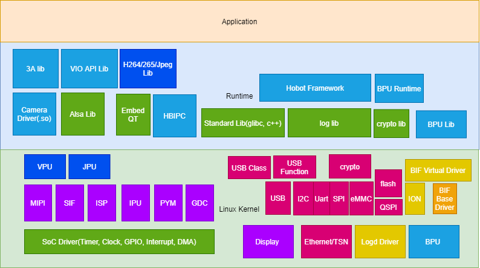

## 7.2.2 配置uboot和kernel选项参数

在系统软件开发中，经常需要对uboot和Kernel的功能选项进行配置，本章节介绍几个常用的配置方法，供用户参考使用。

### 7.2.2.1 配置uboot选项参数

首先进入`uboot`目录，执行`make ARCH=arm64 xj3_soc_defconfig `。因为`make`命令将首先执行顶级目录下的 Makefile 文件。其中对于以config结尾的目标都有一个共同的入口：

```makefile
%config: scripts_basic outputmakefile FORCE
        $(Q)$(MAKE) $(build)=scripts/kconfig $@
```

展开后的执行命令是：

```
make -f ./scripts/Makefile.build obj=scripts/kconfig xj3_soc_defconfig
```

本命令执行后会在`uboot`的源码根目录下会生成 `.config`的文件。

```bash
make ARCH=arm64 xj3_soc_defconfig

  HOSTCC  scripts/basic/fixdep
  HOSTCC  scripts/kconfig/conf.o
  YACC    scripts/kconfig/zconf.tab.c
  LEX     scripts/kconfig/zconf.lex.c
  HOSTCC  scripts/kconfig/zconf.tab.o
  HOSTLD  scripts/kconfig/conf
#
# configuration written to .config
#
```

然后就可以执行`make ARCH=arm64 menuconfig`打开图形化的配置界面进行uboot的选项参数配置。


在menuconfig的配置界面上完成配置后，选择 `Exit`退出，根据提示选择 `Yes` 或者`No`保存修改到`.config`文件中。

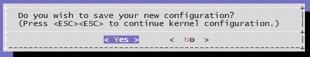

保存配置后，可以执行命令 `diff .config configs/xj3_soc_defconfig` 对比一下差异，再次确认一下修改是否符合预期。

如果修改正确，请执行 `cp .config configs/xj3_soc_defconfig`替换默认的配置文件。

### 7.2.2.2 配置kernel选项参数

通过`menuconfig`方式配置`kernel`与配置`uboot`的的过程是一样的。命令执行过程如下：

首先进入`boot/kernel`目录，然后按照以下步骤配置`kernel`选项。

- 使用`xj3_perf_ubuntu_defconfig`来配置生成`.config`，如果源码做过全量编译，则`.config`文件会配置好

```
make ARCH=arm64 xj3_perf_ubuntu_defconfig
```

- 执行以下命令来修改配置

```
make ARCH=arm64 menuconfig
```

- 修改后，可以先看看修改后和修改前的差异

```
diff .config arch/arm64/configs/xj3_perf_ubuntu_defconfig
```

- 把新配置覆盖`xj3_perf_ubuntu_defconfig`

```
cp .config arch/arm64/configs/xj3_perf_ubuntu_defconfig
```

- 在进入到 `build` 目录执行编译

```
./xbuild.sh boot
```

## 7.2.3 UART驱动调试指南

X3 芯片共有4路串口：UART0、UART1，UART2，UART3

- UART0 用作调试串口，只有 UART1 支持硬件流控
- 支持比特率 115.2Kbps，230.4Kbps，460.8Kbps，921.6Kbps，1.5Mbps，2Mbps，4Mbps。2M以上速录需要使能TOI
- 支持基于中断或基于 DMA 的模式

### 7.2.3.1 驱动代码

#### 代码路径

```
drivers/tty/serial/hobot_serial.c
drivers/tty/serial/hobot_serial.h
```

#### 内核配置

CONFIG_SERIAL_HOBOT_UART

SERIAL_HOBOT_UART_CONSOLE


#### DTS设备节点配置

在 hobot-xj3.dtsi 文件中有uart0-3的通用配置，此文件内配置一般不做修改，当需要使能对应的串口时，可以到具体的板子配置设备树中修改、添加自定义配置，例如在 hobot-x3-sdb.dts 文件内使能 uart0、1、3

```c
/* arch/arm64/boot/dts/hobot/hobot-xj3.dtsi */
uart0: serial@0xA5000000 {
    compatible = "hobot,hobot-uart";
    reg = <0 0xA5000000 0 0x1000>;
    interrupt-parent = <&gic>;
    interrupts = <0 29 4>;
    clocks = <&uart0_mclk>;
    pinctrl-names = "default";
    pinctrl-0 = <&uart0_func>;
    status = "disabled";
};
```

```c
/* arch/arm64/boot/dts/hobot/hobot-x3-sdb.dts */
&uart0 {
	status = "okay";
};

&uart1 {
	status = "okay"; /* 4 wire uart for bt */
	pinctrl-0 = <&uart1_func_rtscts>; /* <&uart1_func>;  uart 1 connect to bt with rtscts*/
};

&uart3 {
	status = "okay"; /* 4 wire uart for bt */
};
```


### 7.2.3.2 UART测试{#uart_test}

硬件上把uart3的TX和RX进行连接。

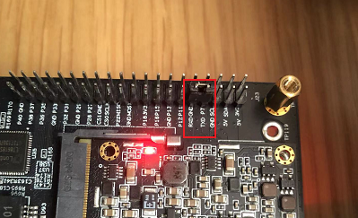

编译uart_duplex.c 代码，具体代码如附录A

```
/opt/gcc-ubuntu-9.3.0-2020.03-x86_64-aarch64-linux-gnu/bin/aarch64-linux-gnu-gcc -o uart_duplex uart_duplex.c  -lpthread
```

回环测试命令：打开/dev/ttyS3，默认波特率4Mbps，默认每轮测试1MB数据，测试100轮，读写同时进行，每发、收512字节做一轮数据校验，完整一轮测试结束后，如果没有出错则打印校验正确。

```
# ./uart_duplex -c 100 -d /dev/ttyS3
test size:1024 Kbytes, baud:4000000
Start receive thread
Start send thread
Start recv_check thread
This is receive test 1 times
This is uart send 1 times
receive sum:102416 bytes
receive sum:205312 bytes
...
receive sum:924164 bytes
receive sum:1027076 bytes
send 1024Kbytes,time:2700.000000ms, BPS:379259.250000
This is receive test 2 times
### Check the received data is correct ###
```

uart_duplex命令是测试uart的，可以阅读它的帮助信息获取更多使用方法。

### 7.2.3.3 附录

### 7.2.3.4 A 测试代码

```c
#include <stdio.h>
#include <stdint.h>
#include <stdlib.h>
#include <unistd.h>
#include <fcntl.h>
#include <termios.h>
#include <errno.h>
#include <string.h>
#include <getopt.h>
#include <sys/time.h>
#include <pthread.h>
#include <semaphore.h>
#include <stdlib.h>

#define BUFF_SIZE (20 * 1024 * 1024)
pthread_t recv_thread_id;
pthread_t recv_check_thread_id;
pthread_t send_thread_id;
char send_buffer[BUFF_SIZE] = {0};
char recv_buffer[BUFF_SIZE] = {0};
static uint32_t test_size = 1024;
static uint32_t baud = 4000000;
static uint32_t test_count = 0;
int g_fd;
uint64_t recv_total = 0;
sem_t sem_check;

#define FRAME_LEN 512
#if 1
static void dump_recv_data(uint32_t sum, uint32_t len)
{
	int ii = 0;
	printf("dump receive data:\n");
	for (ii = 0; ii < len; ii += 4) {
		printf("0x%x: 0x%x, 0x%x, 0x%x, 0x%x\n", sum + ii,
				recv_buffer[sum + ii],
				recv_buffer[sum + ii + 1],
				recv_buffer[sum + ii + 2],
				recv_buffer[sum + ii + 3]);

	}

}

static void dump_send_data(uint32_t sum, uint32_t len)
{
	int ii = 0;
	printf("dump send data:\n");
	for (ii = 0; ii < len; ii += 4) {
		printf("0x%x: 0x%x, 0x%x, 0x%x, 0x%x\n", sum + ii,
				send_buffer[sum + ii],
				send_buffer[sum + ii + 1],
				send_buffer[sum + ii + 2],
				send_buffer[sum + ii + 3]);

	}

}
#endif

static void set_baudrate(int fd, int nSpeed)
{
	struct termios newtio;

	tcgetattr(fd, &newtio);

	switch (nSpeed) {
	case 2400:
		cfsetispeed(&newtio, B2400);
		cfsetospeed(&newtio, B2400);
		break;

	case 4800:
		cfsetispeed(&newtio, B4800);
		cfsetospeed(&newtio, B4800);
		break;

	case 9600:
		cfsetispeed(&newtio, B9600);
		cfsetospeed(&newtio, B9600);
		break;

	case 19200:
		cfsetispeed(&newtio, B19200);
		cfsetospeed(&newtio, B19200);
		break;

	case 38400:
		cfsetispeed(&newtio, B38400);
		cfsetospeed(&newtio, B38400);
		break;

	case 57600:
		cfsetispeed(&newtio, B57600);
		cfsetospeed(&newtio, B57600);
		break;

	case 115200:
		cfsetispeed(&newtio, B115200);
		cfsetospeed(&newtio, B115200);
		break;
	case 230400:
		cfsetispeed(&newtio, B230400);
		cfsetospeed(&newtio, B230400);
		break;
	case 921600:
		cfsetispeed(&newtio, B921600);
		cfsetospeed(&newtio, B921600);
		break;
	case 1000000:
		cfsetispeed(&newtio, B1000000);
		cfsetospeed(&newtio, B1000000);
		break;

	case 1152000:
		cfsetispeed(&newtio, B1152000);
		cfsetospeed(&newtio, B1152000);
		break;
	case 1500000:
		cfsetispeed(&newtio, B1500000);
		cfsetospeed(&newtio, B1500000);
		break;
	case 2000000:
		cfsetispeed(&newtio, B2000000);
		cfsetospeed(&newtio, B2000000);
		break;
	case 2500000:
		cfsetispeed(&newtio, B2500000);
		cfsetospeed(&newtio, B2500000);
		break;
	case 3000000:
		cfsetispeed(&newtio, B3000000);
		cfsetospeed(&newtio, B3000000);
		break;
	case 3500000:
		cfsetispeed(&newtio, B3500000);
		cfsetospeed(&newtio, B3500000);
		break;

	case 4000000:
		cfsetispeed(&newtio, B4000000);
		cfsetospeed(&newtio, B4000000);
		break;

	default:
		printf("\tSorry, Unsupported baud rate, use previous baudrate!\n\n");
		break;
	}
	tcsetattr(fd,TCSANOW,&newtio);
}

static void set_termios(int fd)
{
	struct termios term;

	tcgetattr(fd, &term);
	term.c_cflag &= ~(CSIZE | CSTOPB | PARENB | INPCK);
	term.c_cflag |= (CS8 | CLOCAL | CREAD);
	term.c_lflag &= ~(ICANON | ECHO | ECHOE | ISIG);
	term.c_oflag &= ~(OPOST | ONLCR | OCRNL);
	term.c_iflag &= ~(ICRNL |INLCR | IXON | IXOFF | IXANY);
	term.c_cc[VTIME] = 0;
	term.c_cc[VMIN] = 1;
	tcsetattr(fd, TCSAFLUSH, &term);
}

static void *send_test(void *times)
{
	/*send thread*/
	struct timeval start, end;
	int32_t i = 0;
	uint32_t j = 0;
	uint32_t tmp = 0;
	uint32_t exe_count = 0;
	int32_t ret = 0;
	float ts = 0;

	printf("Start send thread\n");

	sleep(1);
	if (test_count == 0) {
		tmp = 10;
	} else
		tmp = test_count;
	for (j = 0; j < tmp; j++) {
		if (test_count == 0)
			j = 0;
		sleep(1);
		printf("This is uart send %d times\n", ++exe_count);
		gettimeofday(&start, NULL);
		for (i = 0; i <  test_size * 1024; i = i + FRAME_LEN) {
			ret = write(g_fd, &send_buffer[i], FRAME_LEN);
			if (ret < FRAME_LEN) {
				printf("write ttyS2 error\n");
				return NULL;
			}
		}
#if 1
		gettimeofday(&end, NULL);
		//		printf("start %ld sec, %ld usec, end %ld sec, %ld usec\n", start.tv_sec, start.tv_usec, end.tv_sec, end.tv_usec);
		ts = ((end.tv_sec * 1000000 + end.tv_usec) - (start.tv_sec * 1000000 + start.tv_usec)) / 1000;
		printf("send %dKbytes,time:%fms, BPS:%f\n", test_size, ts, test_size * 1000 / (ts / 1000));
#endif
	}
	close(g_fd);
	return NULL;
}

static void *recv_test(void *times)
{
	int32_t j = 0;
	uint32_t exe_count = 0;
	int tmp = 0;
	int size = 0;
	int sum = 0;
	int last_count = 0;
	int len = 0;
	int len_frame = 0; /*use to get correct frame len*/

	printf("Start receive thread\n");

	memset(recv_buffer, 0, sizeof(recv_buffer));

	if (test_count == 0) {
		tmp = 10;
	} else
		tmp = test_count;
	for (j = 0; j < tmp; j++) {
		sum = 0;
		last_count = 0;
		if (test_count == 0)
			j = 0;
		printf("This is receive test %d times\n", ++exe_count);
		//gettimeofday(&start, NULL);
		size = test_size * 1024;
		while (size > 0) {
			len = read(g_fd, &recv_buffer[sum], FRAME_LEN);
			if (len < 0) {
				printf("read error\n");
				return NULL;
			}
			recv_total += len;
			len_frame += len;
			if (len_frame >= FRAME_LEN) {
				len_frame -= FRAME_LEN;
				sem_post(&sem_check);
			}

#if 0
			ret = memcmp(&recv_buffer[sum], &send_buffer[sum], len);
			if (ret != 0) {
				printf("data compare error\n");
				return NULL;
			}
#endif
			sum +=len;
			size -= len;
			if ((sum - last_count) > 100 * 1024) {
				printf("receive sum:%d bytes\n", sum);
				last_count = sum;
			}
		}
#if 0
		gettimeofday(&end, NULL);
		printf("start %ld sec, %ld usec, end %ld sec, %ld usec\n", start.tv_sec, start.tv_usec, end.tv_sec, end.tv_usec);
		ts = ((end.tv_sec * 1000000 + end.tv_usec) - (start.tv_sec * 1000000 + start.tv_usec)) / 1000;

		printf("receive %dKbytes,time:%fms, BPS:%f\n", test_size, ts, test_size * 1000 / (ts / 1000));
#endif
	}
	close(g_fd);
	return NULL;
}

int32_t error_bit(uint64_t *data1, uint64_t *data2, int32_t len)
{
	uint64_t c=0;
	int32_t sum = 0;
	int i = 0;
	for(i = 0; i < len / 8; i++) {
		c = data1[i] ^ data2[i];
		while(c!=0) {
			c &= (c - 1);
			sum++;
		}
	}
	return sum;
}

static void *recv_check_test(void *times)
{
	int32_t check_pos = 0;
	uint32_t *cur_frame = NULL;
	int32_t error_bit_cnt = 0;
	printf("Start recv_check thread\n");
	while (1) {
		sem_wait(&sem_check);
		/*check data*/
		cur_frame = (uint32_t *)&recv_buffer[check_pos];
		if (*cur_frame != check_pos / FRAME_LEN) {
			printf("error: may lost frame, curruent frame is %d, expected frame is %d position: 0x%x\n",
					*cur_frame, check_pos / FRAME_LEN, check_pos);
			//dump_recv_data(check_pos, FRAME_LEN);
			//dump_send_data(check_pos, FRAME_LEN);
			error_bit_cnt = 0;
			error_bit_cnt = error_bit((uint64_t *)&recv_buffer[check_pos],
					(uint64_t *)&send_buffer[check_pos],
					FRAME_LEN / 8);
			check_pos += FRAME_LEN;
			printf("test total data: 0x%lx, error bit count:%d\n", recv_total, error_bit_cnt);
			if (check_pos == test_size * 1024) {
				//exit(1);
				printf("uart: frame head error\n");

			}
			continue;
		}
		error_bit_cnt = 0;
		error_bit_cnt = error_bit((uint64_t *)&recv_buffer[check_pos],
				(uint64_t *)&send_buffer[check_pos],
				FRAME_LEN / 8);
		if (error_bit_cnt) {
			printf("test total data: 0x%lx!!!!!!!, error bit count:%d\n", recv_total, error_bit_cnt);
			//dump_recv_data(check_pos, FRAME_LEN);
			//dump_send_data(check_pos, FRAME_LEN);
			check_pos += FRAME_LEN;
			if (check_pos == test_size * 1024) {
				//exit(1);
				printf("uart: frame data error\n");
			}
			continue;
		}
		memset(&recv_buffer[check_pos], 0, FRAME_LEN);
		check_pos += FRAME_LEN;
		if (check_pos == test_size * 1024) {
			check_pos = 0;
			printf("### Check the received data is correct ###\n");
		}
	}
	return NULL;
}

static const char short_options[] = "s:u:c:b:d:h";
static const struct option long_options[] = {
	{"size", required_argument, NULL, 's'},
	{"baudrate", required_argument, NULL, 'b'},
	{"count", required_argument, NULL, 'c'},
	{"device", required_argument, NULL, 'd'},
	{"help", no_argument, NULL, 'h'},
	{0, 0, 0, 0}};
int main(int argc, char *argv[])
{
	int ret = 0;
	char *pDevice = NULL;
	int i = 0;
	int32_t cmd_parser_ret = 0;
	uint32_t *frame_num = NULL;
	uint32_t *frame_value = NULL;

	while ((cmd_parser_ret = getopt_long(argc, argv, short_options, long_options, NULL)) != -1) {
		switch (cmd_parser_ret) {
		case 's':
			test_size = atoi(optarg);
			break;

		case 'b':
			baud = atoi(optarg);
			break;

		case 'c':
			test_count = atoi(optarg);
			break;
		case 'd':
			pDevice = optarg;
			break;

		case 'h':
			printf("**********UART STRESS TEST HELP INFORMATION*********\n");
			printf(">>> -s/--size     [test size,unit--Kbytes,default is 1M, MAX is 20M]\n");
			printf(">>> -b/--baudrate  [baud,default is 4M]\n");
			printf(">>> -c/--count  [test count,default is forever]\n");
			printf(">>> -d/--uart  [uart device, user must set this]\n");
			return 0;
		}
	}
	if (baud > 4000000) {
		printf("baud is larger than max baud\n");
		return -1;
	}
	g_fd = open(pDevice, O_RDWR | O_NOCTTY);
	if (0 > g_fd) {
		printf("open fail\n");
		return -1;
	}
	set_baudrate(g_fd, baud);
	set_termios(g_fd);
	printf("test size:%d Kbytes, baud:%d\n", test_size, baud);
	for (i = 0; i < test_size * 1024; i+=4) {
		if (i % FRAME_LEN) {
			frame_value = (uint32_t *)&send_buffer[i];
			*frame_value = rand();
		}

	}
	for (i = 0; i < test_size * 1024 / FRAME_LEN; i++) {
		frame_num = (uint32_t *)&send_buffer[i * FRAME_LEN];
		*frame_num = i;
		//        printf("pos:0x%x, value:0x%x\n", i * FRAME_LEN, *frame_num);
	}

	sem_init(&sem_check, 0, 0);
	ret = pthread_create(&recv_thread_id,
			NULL,
			recv_test,
			NULL);
	if (ret < 0) {
		printf("create uart1 test thread failed\n");
		return -1;
	}
	ret = pthread_create(&send_thread_id,
			NULL,
			send_test,
			NULL);
	if (ret < 0) {
		printf("create uart2 test thread failed\n");
		return -1;
	}
	ret = pthread_create(&recv_check_thread_id,
			NULL,
			recv_check_test,
			NULL);
	if (ret < 0) {
		printf("create receive check thread failed\n");
		return -1;
	}
	pthread_join(recv_thread_id, NULL);
	pthread_join(recv_check_thread_id, NULL);
	pthread_join(send_thread_id, NULL);
	return 0;
}
```

## 7.2.4 I2C调试指南

### 7.2.4.1 前言

X3芯片提供了标准的I2C总线，I2C总线控制器通过串行数据线（SDA）和串行时钟（SCL）线在连接到总线的器件间传递信息。
每个器件都有一个唯一的地址（无论是微控制器——MCU、LCD控制器、存储器或键盘接口），而且都可以作为一个发送器和一个接收器（由器件的功能决定），而且都可以作为一个发送器或接收器（由器件的功能决定）。I2C控制器支持以下功能：

-   兼容I2C与SMBUS总线

-   频率支持100KHz 和 400KHz

-   支持7位和10位寻址模式

### 7.2.4.2 驱动代码
```bash
drivers/i2c/busses/i2c-hobot.c # I2C驱动代码源文件
inlcude/linux/i2c-hobot.h # I2C驱动代码头文件
```
#### 内核配置位置

CONFIG_I2C_HOBOT


#### 内核DTS节点配置

X3芯片最大支持6路i2c总线，dts配置如下所示。

```c
/* arch/arm64/boot/dts/hobot/hobot-xj3.dtsi */
i2c0: i2c@0xA5009000 {
    compatible = "hobot,hobot-i2c";
    reg = <0 0xA5009000 0 0x100>;
    interrupt-parent = <&gic>;
    interrupts = <0 38 4>;
    clocks = <&i2c0_mclk>;
    clock-names = "i2c_mclk";
    bus-speed = <400000>;
    resets = <&rst 0x50 10>;
    reset-names = "i2c0";
    status = "disabled";
    pinctrl-names = "default";
    pinctrl-0 = <&i2c0_func>;
};
```
 备注：  
hobot-xj3.dtsi中的节点主要声明一些寄存器、中断的resource，均为soc共有特性，和具体电路板无关，一般情况下不用修改。

### 7.2.4.3 I2C使用

对于I2C的使用说明在Linux Kernel的Documentation/i2c下有详细的说明，本文主要列出X3J3 I2C驱动接口特殊的部分。

#### Kernel Space

X3J3 I2C驱动在Kernel Space下提供了可以设置I2C传输频率的接口，使用方法如下：
```c
#include <linux/i2c-hobot.h>
...
{
    struct client_request *client_data = (struct client_request *)(client->adapter->algo_data);
    ...
    client_data->client_req_freq = 100000; //设置I2C传输频率为100k
    ret = i2c_transfer(client->adapter, request, ARRAY_SIZE(request));
    ...
}
```
需要注意的是，如果目标传输频率和默认频率不一致，那么在每次I2C传输前，都需要设置目标频率，即频率更改只对单次传输生效，这样设计也是为了保证某个驱动调用I2C驱动更改频率并传输不会对其它驱动造成影响，有关代码在i2c-hobot.c中的实现如下：
```bash
/* 检查是否需要更改频率，如果是，按照目标频率进行设置 */
static void recal_clk_div(struct hobot_i2c_dev *dev)
{
        u32 clk_freq = 0;
        int temp_div = 0;
        struct client_request *client_req;

        client_req = (struct client_request *)dev->adapter.algo_data;
        clk_freq = clk_get_rate(dev->clk);
        if (client_req->client_req_freq != 0) {
                temp_div = DIV_ROUND_UP(clk_freq, client_req->client_req_freq) - 1;
        } else {
        temp_div = DIV_ROUND_UP(clk_freq, dev->default_trans_freq) - 1;
        }
        dev->clkdiv = DIV_ROUND_UP(temp_div, 8) - 1;
        if (dev->clkdiv > I2C_MAX_DIV) {
                dev_warn(dev->dev, "clkdiv too large, set to 255");
                dev->clkdiv = I2C_MAX_DIV;
        }
}

/* reset I2C 频率为默认频率 */
static void reset_client_freq(struct hobot_i2c_dev *dev)
{
        struct client_request *client_req;

        client_req = (struct client_request *)dev->adapter.algo_data;
        client_req->client_req_freq = 0;
}

/* I2C master_xfer 函数 */
static int hobot_i2c_xfer(struct i2c_adapter *adap, struct i2c_msg msgs[], int num)
{
    ...
    recal_clk_div(dev);
    ... /* I2C transfer */
    reset_client_freq(dev);
    ...
}
```
#### User Space

通常，I2C设备由内核驱动程序控制，但也可以从用户态访问总线上的所有设备，通过/dev/i2c-%d接口来访问，Kernel下面的Documentation/i2c/dev-interface文档里有详细的介绍。

##### 频率设置

查看i2C-N的频率,以i2c-0为例
```bash
root@x3dvbx3-hynix1G-2666:~# cat /sys/bus/i2c/devices/i2c-0/speed
400000
```
设置i2c-N的频率，以i2c-0为例
```bash
root@x3dvbx3-hynix1G-2666:~# echo 100000 > /sys/bus/i2c/devices/i2c-0/speed
root@x3dvbx3-hynix1G-2666:~# cat /sys/bus/i2c/devices/i2c-0/speed
100000
```
和Kernel Space下设置I2C频率只针对单次传输有效不同，User Space下设置I2C频率是持久有效的，谨慎使用！

##### I2c-tools

i2c-tools是一套开源工具，该工具已经被交叉编译并包含在在X3J3 系统软件的rootfs中，客户可以直接使用：

-   i2cdetect — 用来列举I2C bus及该bus上的所有设备
-   i2cdump — 显示i2c设备的所有register值
-   i2cget — 读取i2c设备某个register的值
-   i2cset — 写入i2c设备某个register的值
-   i2ctransfer — 可以读、写i2c设备某个或者多个register的值

## 7.2.5 GPIO调试指南

X3 芯片共有121个IO功能管脚，每个管脚都可以配置工作在gpio模式下，但是需要注意和其他功能管脚的复用关系。

### 7.2.5.1 管脚查询

IO管脚的复用和配置可以在 [datasheets](http://archive.sunrisepi.tech/downloads/datasheets/) 查阅《PL-2500-3-X3 PIN SW Reg-V1.2.xls》 和《RM-2500-5-X3M Register Reference Manual-GPIO&PIN-V1.1.pdf》。

在 《PL-2500-3-X3 PIN SW Reg-V1.2.xls》可以比较直观的查询到管脚的上电默认状态、复用、驱动能力、上下拉、施密特触发配置。

在 《RM-2500-5-X3M Register Reference Manual-GPIO&PIN-V1.1.pdf》文档中查询对应管脚的gpio寄存器信息。

#### 示例

以查询`gpio120`号管脚的复用、方向控制、数据寄存器地址为例进行说明：

**功能复用寄存器说明：**

- 打开 《PL-2500-3-X3 PIN SW Reg-V1.2.xls》，选择  `PIN SW Register` 的数据表。
- 第一行会标明功能复用的基地为`0xA6004000`。

-  在`GPIO`列找到 `GPIO[120]`，这一项对应的信息即是管脚 `120`的上电默认状态、复用、驱动能力、上下拉、施密特触发配置。如下图所示。


- 找到以上配置项后，基地址加上偏移的值即该管家的复用控制寄存器，例如`GPIO120`的复用寄存器为 `0xA6004000 + 0x1E0 = 0xA600410E0`。
- 配置功能复用寄存器时，建议先把该值先读出来，然后设置想要设置的对应bit后再写回。例如配置`GPIO120`为`GPIO`模式，则只设置 `0xA600410E0` 寄存器的低两位为`0x3`，保持其他启动强度、上下拉、斯密特触发配置不变，除非你明确知道你需要对它们也做修改。

**GPIO控制和数据寄存器：**

- 打开 《RM-2500-5-X3M Register Reference Manual-GPIO&PIN-V1.1.pdf》，本文档分两个主要章节，`GPIO`章节是描述管脚的控制寄存器、输出数据寄存器、输入数据寄存器和管脚电压域配置寄存器（偏移为0x170 和 0x174的两个寄存器是管脚电压域配置寄存器）。`Pin Group`章节与寄存器复用《PL-2500-3-X3 PIN SW Reg-V1.2.xls》表内容一样。
- 控制、数据寄存器的基地址在每页表格的第一行会显示，为`BASE_ADDR:0xA600_3000 `，查询到的偏移地址加上本基地址就是对应的完整寄存器地址。
- 旭日X3M芯片总共有`120`个可用的管脚，分成7个bank，每个bank最多16个管脚，控制和数据寄存器以一个bank为一个控制单元。例如`GPIO120`的bank为`120除以16后取整为7`，在bank中的管脚编号为`120对16取余数为8`。由此我们就可以找到对应的寄存器地址为如下图所示。`GPIO120`的寄存器即以下图中寄存器`GPIO7_xxx`中对应的`bit8`（从bit0开始计算）。


#### GPIO帮助工具

通过以上章节，相信你已经具备自主查询、设置各管脚的配置的能力。针对旭日X3M芯片，地平线还提供了一个小软件帮助用户快速完成以上寄存器的查询，并且提供管脚设置的帮助命令，可以从 [地平线GPIO帮助工具](https://pan.horizon.ai/index.php/s/JTitK4g8SLzSGa6/download?path=%2FGpio_tools&files=%E5%9C%B0%E5%B9%B3%E7%BA%BFGPIO%E5%B8%AE%E5%8A%A9%E5%B7%A5%E5%85%B7v1.0.exe)下载使用。

工具的界面如下图所示，用户可以控制输入 `GPIO编号` 或者 `GPIO管脚 `来查询管脚的各种寄存器地址，并且生成gpio功能的帮助命令，命令说明请查看 [GPIO用户空间使用说明](#user-space)了解详情。


### 7.2.5.2 驱动代码

```bash
drivers/gpio/gpio-hobot-x3.c # gpio驱动源文件
```
#### 内核配置

CONFIG_GPIO_HOBOT_X3


#### 内核DTS配置
```c
/* arch/arm64/boot/dts/hobot/hobot-xj3.dtsi */
gpios: gpio@0xA6003000 {
    compatible = "hobot,x3-gpio";
    reg = <0 0xA6003000 0 0x100>;
    gpio-controller;
    #gpio-cells = <2>; 
    gpio-ranges = <&pinctrl 0 0 121>;
    interrupts = <0 54 4>;
    interrupt-parent = <&gic>;
    interrupt-controller;
    #interrupt-cells = <2>; 
};
```
:::info 备注
hobot-xj3.dtsi中的节点主要声明一些寄存器、中断的resource，均为soc共有特性，和具体电路板无关，一般情况下不用修改。
:::
### 7.2.5.3 GPIO使用

#### Kernel Space

##### DTS配置

GPIO设备树节点的属性命名方式一般为names-gpios或names-gpio，举例如下：
```c
/* arch/arm64/boot/dts/hobot/hobot/hobot-x3-sdb.dtsi */
&usb_id {
        status = "okay";  
        id-gpio = <&gpios 65 GPIO_ACTIVE_HIGH>;
        host-rst-gpio = <&gpios 115 GPIO_ACTIVE_HIGH>;
        host-exrst-gpio = <&gpios 38 GPIO_ACTIVE_LOW>;
};
```
##### 驱动代码接口

```c
/* include/linux/gpio.h */
/* 申请GPIO */
int gpio_request(unsigned gpio, const char *label);
/* GPIO初始化为输出。并设置输出电平*/
int gpio_direction_output(unsigned gpio, int value);
/* GPIO初始化为输入 */
int gpio_direction_input(unsigned gpio);
/* 获取GPIO的电平 */
int gpio_get_value(unsigned int gpio);
/* 设置GPIO的电平 */
void gpio_set_value(unsigned int gpio, int value);
/* 释放GPIO */
void gpio_free(unsigned gpio)
/* 申请GPIO中断，返回的值可以传给request_irq和free_irq */
int gpio_to_irq(unsigned int gpio);
```
##### X3J3 GPIO IRQ

X3 GPIO共有121个pin，硬件中断数量为4个，使用时通过GPIO模块寄存器的设置可以将121个pin中的最多4个pin映射到4个IRQ中断上，映射过程由GPIO驱动管理，通过gpio_to_irq申请GPIO IRQ号，4个irq都被申请完，后续申请都会失败，irq映射管理的代码如下：
```bash
/* drivers/gpio/gpio-hobot-x3.c */
/* 初始化irq映射表 */
void init_irqbank*struct x3_gpio *gpo) {
    int i = 0;
    for (i = 0; i < GPIO_IRQ_BANK_NUM; i++) {
        gpo->irqbind[i] = GPIO_IRQ_NO_BIND;
    }
}

/* request irq并更新映射表 */
int request_irqbank(struct x3_gpio *gpo, unsigned long gpio) {
    int i = 0, index = GPIO_IRQ_NO_BIND;
    index = find_irqbank(gpo, gpio);
    if(index == GPIO_IRQ_NO_BIND) {
        for (i = 0; i < GPIO_IRQ_BANK_NUM; i++) {
            if(gpo->irqbind[i] == GPIO_IRQ_NO_BIND) {
                gpo->irqbind[i] = gpio;
                index = i;
                break;
            }
        }
    } else {
        dev_err(gpo->dev, "gpio(%ld) has be binded\n", gpio);
        return GPIO_IRQ_NO_BIND;
    }
    return index;
}

/* free gpio并更新映射表 */
void release_irqbank(struct x3_gpio *gpo, unsigned long gpio) {
    int index = GPIO_IRQ_NO_BIND;
    index = find_irqbank(gpo, gpio);
    if(index != GPIO_IRQ_NO_BIND) {
        gpo->irqbind[index] = GPIO_IRQ_NO_BIND;
    }
}
```
:::info 备注 
X3 GPIO在Kernel Space的接口都是Linux的标准接口，更多使用方法请参考Documentation/gpio/consumer.txt。
:::
#### User Space{#user-space}

##### 控制接口
```bash
/sys/class/gpio/export #用户空间可以通过写入gpio号申请将gpio的控制权导出到用户空间，比如 echo 42 > export
/sys/class/gpio/unexport # 和export相反
/sys/class/gpio/gpiochip0 # gpio控制器
```
##### 调用接口

使用export导出gpio的控制权以后会有路径/sys/class/gpio/gpio42/，路径下有如下属性：

-   direction：表示GPIO端口方向，读取为"in"或"out"，写入"in"或者"out"可以设置输入或输出
-   value：表示GPIO的电平，0为低电平，1为高电平，如果GPIO配置为输出，则value值可写
-   edge：表示中断触发方式，有"none" "rising" "falling" "both" 4种类型，"none"表示GPIO不为中断引脚，"rising"表示引脚为上升沿触发的中断，"falling"表示引脚为下降沿触发的中断，"both"表示引脚为边沿触发的中断。

##### 调用示例

以下示例演示导出  JTG_TRSTN 管脚，设置为输出模式，输出高电平，最后反导出。

```bash
echo 4 > /sys/class/gpio/export
echo out > /sys/class/gpio/gpio4/direction
echo 1 > /sys/class/gpio/gpio4/value
# echo 0 > /sys/class/gpio/gpio4/value
echo 4 > /sys/class/gpio/unexport
```

##### 调试接口

如果在内核配置中打开了Linux Kernel的CONFIG_DEBUG_FS 选项，并且挂载了debugfs文件系统

```
mount -t debugfs none /sys/kernel/debug
```

则可以通过如下节点查看GPIO的申请列表。

```bash
root@x3dvbx3-hynix1G-2666:~# cat /sys/kernel/debug/gpio
gpiochip0: GPIOs 0-120, parent: platform/a6003000.gpio:
gpio-42  (           |sysfs     ) in hi
gpio-64  (           |cd        ) in lo IRQ
gpio-65  (           |id        ) in hi IRQ
gpio-100 (           |?         ) out lo
gpio-120 (           |?         ) out hi
root@x3dvbx3-hynix1G-2666:~#
```
:::info 备注  
X3 GPIO在User Space的接口都是Linux的标准接口，更多使用方法请参考Documentation/gpio/sysfs.txt
:::
## 7.2.6 Pinctrl调试指南

### 7.2.6.1 前言

X3 Pinctrl使用Linux Kernel主线代码的pinctl-single作为驱动，主要通过配置DTS来实现pinctrl功能。

### 7.2.6.2 管脚查询

IO管脚的复用和配置可以在 [datasheets](http://archive.sunrisepi.tech/downloads/datasheets/) 查阅《PL-2500-3-X3 PIN SW Reg-V1.2.xls》。

在 《PL-2500-3-X3 PIN SW Reg-V1.2.xls》可以比较直观的查询到管脚的上电默认状态、复用、驱动能力、上下拉、施密特触发配置。

#### 驱动代码

```bash
drivers/pinctrl/pinctrl-single.c # pinctrl 驱动代码源文件
include/linux/platform_data/pinctrl-single.h # pinctrl 驱动代码头文件
```
#### 内核配置

CONFIG_PINCTRL_SINGLE

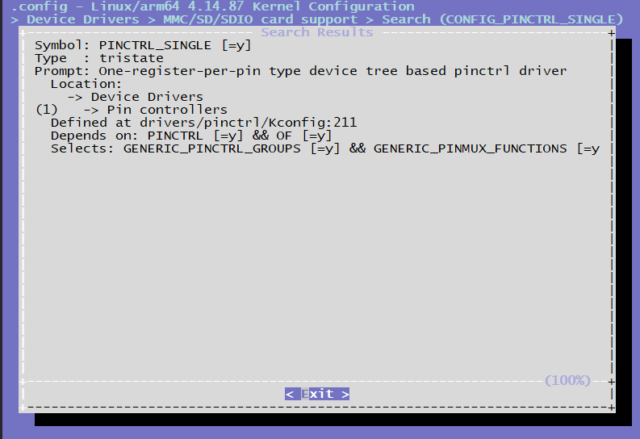

#### Pinctrl的DTS配置

```c
/* arch/arm64/boot/dts/hobot/hobot-pinctrl-xj3.dtsi */
pinctrl: pinctrl@0xA6004000 {
    compatible = "pinctrl-single";
    reg = <0x0 0xA6004000 0x0 0x200>;
    #pinctrl-cells = <1>;
    #gpio-range-cells = <0x3>;
    pinctrl-single,register-width = <32>;
    pinctrl-single,function-mask = <0x3FF>;
    /* pin base, nr pins & gpio function */
    pinctrl-single,gpio-range = <&range 0 120 3>;

    i2c0_func: i2c0_func {
        pinctrl-single,pins = < 
            0x020   (MUX_F0 | DRIVE2_09MA | SCHMITT2_DIS | PULL2_UP)
            0x024   (MUX_F0 | DRIVE2_09MA | SCHMITT2_DIS | PULL2_UP)
            >;
    };
    ...
}
```

### 7.2.6.3 Pinctrl使用

#### 驱动DTS配置

驱动在使用Pinctrl的接口前，需要在DTS里配置相应的pinctrl配置组，当驱动probe的时候，会将"default"对应的这组Pinctrl配置到寄存器里面，而其它组的配置需要在代码里面解析出来，再选择切换使用，以iar为例：
```c
/* arch/arm64/boot/dts/hobot/hobot-xj3.dtsi */
iar: iar@0xA4001000 {
    compatible = "hobot,hobot-iar";
    reg = <0 0xA4301000 0 0x400>, <0 0xA4355000 0 0x1000>;
    clocks = <&iar_pix_clk>, <&iar_ipi_clk>, <&sif_mclk>;
    clock-names = "iar_pix_clk","iar_ipi_clk", "sif_mclk";
    interrupt-parent = <&gic>;
    interrupts = <0 69 4>;
    resets = <&rst 0x40 12>;
    pinctrl-names = "bt_func", "rgb_func", "rgb_gpio_func", "bt1120_voltage_func";
    pinctrl-0 = <&btout_func>;
    pinctrl-1 = <&rgb_func>;
    pinctrl-2 = <&rgb_gpio_func>;
    pinctrl-3 = <&bt1120_1_8v_func>;
    disp_panel_reset_pin = <28>;
    reset-names = "iar";
    status = "disabled";
};
```
iar pinctrl中引用的配置组在arch/arm64/boot/dts/hobot/hobot-pinctrl-xj3.dtsi中，内容如下：
```c
btout_func: btout_func {
    pinctrl-single,pins = <
        0x138   (MUX_F0 | DRIVE1_12MA | SCHMITT2_ENA | PULL2_DOWN) /*BT1120_OUT_CLK*/
        0x13c   (MUX_F0 | DRIVE1_12MA | SCHMITT2_DIS | PULL2_DOWN) /*BT1120_OUT_DAT0*/
        0x140   (MUX_F0 | DRIVE1_12MA | SCHMITT2_DIS | PULL2_DOWN)
        0x144   (MUX_F0 | DRIVE1_12MA | SCHMITT2_DIS | PULL2_DOWN)
        0x148   (MUX_F0 | DRIVE1_12MA | SCHMITT2_DIS | PULL2_DOWN)
        0x14c   (MUX_F0 | DRIVE1_12MA | SCHMITT2_DIS | PULL2_DOWN)
        0x150   (MUX_F0 | DRIVE1_12MA | SCHMITT2_DIS | PULL2_DOWN)
        0x154   (MUX_F0 | DRIVE1_12MA | SCHMITT2_DIS | PULL2_DOWN)
        0x158   (MUX_F0 | DRIVE1_12MA | SCHMITT2_DIS | PULL2_DOWN) /*BT1120_OUT_DAT7*/
        0x15c   (MUX_F0 | DRIVE1_12MA | SCHMITT2_DIS | PULL2_DOWN) /*BT1120_OUT_DAT8*/
        0x160   (MUX_F0 | DRIVE1_12MA | SCHMITT2_DIS | PULL2_DOWN)
        0x164   (MUX_F0 | DRIVE1_12MA | SCHMITT2_DIS | PULL2_DOWN)
        0x168   (MUX_F0 | DRIVE1_12MA | SCHMITT2_DIS | PULL2_DOWN)
        0x16c   (MUX_F0 | DRIVE1_12MA | SCHMITT2_DIS | PULL2_DOWN)
        0x170   (MUX_F0 | DRIVE1_12MA | SCHMITT2_DIS | PULL2_DOWN)
        0x174   (MUX_F0 | DRIVE1_12MA | SCHMITT2_DIS | PULL2_DOWN)
        0x178   (MUX_F0 | DRIVE1_12MA | SCHMITT2_DIS | PULL2_DOWN) /*BT1120_OUT_DAT15*/
        >;
};
```
pinctrl配置组将多个pin配置组合到一起，每个pin的配置包含2列，第一列表示pin脚配置寄存器的偏移地址，值为pin脚号乘以4，例如BT1120_OUT_CLK的Pin脚号为78，因此偏移地址为 78 * 4 = 312 ，转换为16进制就是0x138；第二列表示Pin的功能复用配置 Pin-mux。

#### Pin-mux配置

X3 每个芯片的Pin脚支持最多4种功能，在配置某个功能时，客户可以通过寄存器手册查看对应功能的pinmux值，例如Pin脚78的mux配置为0，也就是MUX_F0时Pin的功能为BT1120_OUT_CLK。
```c
/* include/dt-bindings/pinctrl/hobot-xj3.h */
/* MUX functions for pins */
#define MUX_F0          0
#define MUX_F1          1
#define MUX_F2          2
#define MUX_F3          3
```
#### 驱动强度配置

X3 每个Pin脚支持配置最大的输出电流，驱动电流的配置在Pin脚配置寄存器中占输出电流的配置主要分为两类，同样的寄存器值在不同类的Pin上表示的驱动电流不一致，例如DRIVE1上0表示3mA，而DRIVE2上表示6mA，具体某个Pin脚属于哪一类，客户可以通过arch/arm64/boot/dts/hobot/hobot-pinctrl-xj3.dtsi来查看，hobot-pinctrl-xj3.dtsi中已经列出了X3芯片的所有pin脚。
```c
/* include/dt-bindings/pinctrl/hobot-xj3.h */
/* drive strength definition */
#define DRIVE_MASK      (4 << 2)
#define DRIVE1_03MA     (0 << 2)
#define DRIVE2_06MA     (0 << 2)
#define DRIVE1_06MA     (1 << 2)
#define DRIVE2_09MA     (1 << 2)
#define DRIVE1_09MA     (2 << 2)
#define DRIVE2_12MA     (2 << 2)
#define DRIVE1_12MA     (3 << 2)
#define DRIVE2_15MA     (3 << 2)
#define DRIVE1_17MA     (4 << 2)
#define DRIVE2_18MA     (4 << 2)
#define DRIVE1_20MA     (5 << 2)
#define DRIVE2_21MA     (5 << 2)
#define DRIVE1_22MA     (6 << 2)
#define DRIVE2_24MA     (6 << 2)
#define DRIVE1_25MA     (7 << 2)
#define DRIVE2_27MA     (7 << 2)
#define DRIVE1_33MA     (8 << 2)
#define DRIVE2_30MA     (8 << 2)
#define DRIVE1_35MA     (9 << 2)
#define DRIVE2_33MA     (9 << 2)
#define DRIVE1_37MA     (10 << 2)
#define DRIVE2_36MA     (10 << 2)
#define DRIVE1_39MA     (11 << 2)
#define DRIVE2_39MA     (11 << 2)
#define DRIVE1_41MA     (12 << 2)
#define DRIVE2_41MA     (12 << 2)
#define DRIVE1_42_5MA   (13 << 2)
#define DRIVE2_42_5MA   (13 << 2)
#define DRIVE1_44MA     (14 << 2)
#define DRIVE2_44MA     (14 << 2)
#define DRIVE1_45MA     (15 << 2)
#define DRIVE2_45MA     (15 << 2)
```
#### 上下拉配置

X3J3每个Pin脚也支持上下拉配置，和驱动强度配置类似，上下拉的配置也分为两类，两类需要操作的寄存器bit位置不同，具体Pin脚的上下拉类别，
hobot-pinctrl-xj3.dtsi中已经列出，在客户可以通过hobot-pinctrl-xj3.dtsi查找即可。
```c
/* include/dt-bindings/pinctrl/hobot-xj3.h */
/*
 * PULL1 -> bit7(0==pulldown, 1==pullup)
 * bit6(0==pull disable, 1==pull enable)
 *
 * PULL2 -> bit8(0==pullup enable, 1==pullup enable)
 * bit7(0==pulldown diable, 1==pulldown enable)
*/

/* pin states bits */
#define PULL1_MASK      (3 << 6)
#define PULL2_MASK      (3 << 7)
#define PULL1_EN     (1 << 6)
#define PULL1_DIS       (0)
#define PULL2_DIS       (0)
#define PULL1_UP        (PULL1_EN | (1 << 7))
#define PULL2_UP        (1 << 8)
#define PULL1_DOWN      (PULL1_EN | (0 << 7))
#define PULL2_DOWN      (1 << 7)
```
#### 施密特触发配置

X3J3每个Pin脚也支持上下拉配置，和驱动强度配置类似，施密特触发的配置也分为两类，两类需要操作的寄存器bit位置不同，具体Pin脚的施密特触发配置类别，
hobot-pinctrl-xj3.dtsi中已经列出，在客户可以通过hobot-pinctrl-xj3.dtsi查找即可。
```c
/* include/dt-bindings/pinctrl/hobot-xj3.h */

/*
* SCHMITT1 -> bit8(0==diable, 1==enable)
*
* SCHMITT2 -> bit9(0==diable, 1==enable)
*/
/* pin schmitt */
#define SCHMITT1_ENA    (1 << 8)
#define SCHMITT1_DIS    (0 << 8)
 
#define SCHMITT2_ENA    (1 << 9)
#define SCHMITT2_DIS    (0 << 9)
```
#### 驱动调用示例代码

驱动先通过Pinctrl-names查找对应的pinctrl state，然后再切换到对应的state。
```c
static int hobot_xxx_probe(struct platform_device *pdev)
{
    ...
    g_xxx_dev->pinctrl = devm_pinctrl_get(&pdev->dev);
    if (IS_ERR(g_xxx_dev->pinctrl)) {
        dev_warn(&pdev->dev, "pinctrl get none\n");
        g_xxx_dev->pins_xxxx = NULL;
    }
    ...
        /* 按照 pinctrl-names lookup state */
        g_xxx_dev->pins_xxxx = pinctrl_lookup_state(g_xxx_dev->pinctrl, "xxx_func");
    if (IS_ERR(g_xxx_dev->pins_xxxx)) {
        dev_info(&pdev->dev, "xxx_func get error %ld\n",
                PTR_ERR(g_xxx_dev->pins_xxxx));
        g_xxx_dev->pins_xxxx = NULL;
    }
    ...
}
int xxxx_pinmux_select(void)
{
    if (!g_xxx_dev->pins_xxxx)
        return -ENODEV;
    /* 切换到对应的state */
        return pinctrl_select_state(g_xxx_dev->pinctrl, g_xxx_dev->pins_xxxx);
}
```
#### 用户空间调试

如果在内核配置中打开了Linux Kernel的 CONFIG_DEBUG_FS 选项，并且挂载了debugfs文件系统

```
mount -t debugfs none /sys/kernel/debug
```

那么在用户空间的/sys/kernel/debug/pinctrl/a6004000.pinctrl/目录下有一些节点可以查看pinctrl的信息，例如：

```bash
cat /sys/kernel/debug/pinctrl/a6004000.pinctrl/pinmux-pins
```
可以查看哪些pin脚被配置为配置组。

## 7.2.7 IO-DOMAIN调试指南
### 7.2.7.1 前言
IO-Domain用来配置X3J3部分模块的电压域，以RGMII接口为例，如果电路设计时外接电压域为3.3V，则需要配置RGMII模块的IO-DOMAIN为3.3V，如果电路设计时外接电压域为1.8V，则需要配置为1.8v，需要注意的是：
-   外接电压域为3.3V而对应的IO-DOMAIN配置为1.8V时，可能会对芯片有损伤；
-   外接电压域为1.8V而对应的IO-DOMAIN配置为3.3V时，相应的模块可能无法正常工作；

### 7.2.7.2 管脚查询

IO管脚的复用和配置可以在 [datasheets](http://archive.sunrisepi.tech/downloads/datasheets/) 查阅《PL-2500-3-X3 PIN SW Reg-V1.2.xls》 和《RM-2500-5-X3M Register Reference Manual-GPIO&PIN-V1.1.pdf》。

在 《PL-2500-3-X3 PIN SW Reg-V1.2.xls》可以比较直观的查询到管脚的上电默认状态、复用、驱动能力、上下拉、施密特触发配置。

在 《RM-2500-5-X3M Register Reference Manual-GPIO&PIN-V1.1.pdf》文档中查阅 SD_MODE_CTRL 和 IO_MODE_CTRL 两个寄存器来确定电压域配置。

### 7.2.7.3 驱动代码

#### 代码位置
```bash
drivers/pinctrl/pinctrl-single.c # pinctrl 驱动代码源文件
include/linux/platform_data/pinctrl-single.h # pinctrl 驱动代码头文件
```
#### IO-DOMAIN的DTS
```c
/* arch/arm64/boot/dts/hobot/hobot-pinctrl-xj3.dtsi */
/* pinctrl_voltage used to config X/J3 pin mode, for example,
* when SD2 external power supply is 3.3v, we need config pin-mode to
* 3.3v, otherwise X/J3 chip will be damaged.
* when SD2 external power supply is 1.8v, we need config pin-mode to
* 1.8v, otherwise SD2 will not work.
*/
pinctrl_voltage: pinctrl_voltag@0xA6003000 {
    compatible = "pinctrl-single";
    reg = <0x0 0xA6003170 0x0 0x8>;
    #pinctrl-cells = <2>;
    #gpio-range-cells = <0x3>;
    pinctrl-single,bit-per-mux;
    pinctrl-single,register-width = <32>;
    pinctrl-single,function-mask = <0x1>;
    status = "okay";
    /* rgmii 1.8v func */
        rgmii_1_8v_func: rgmii_1_8v_func {
            pinctrl-single,bits = <
                0x4 MODE_1_8V RGMII_MODE_P1
                0x4 MODE_1_8V RGMII_MODE_P0
                >;
        };
    /*rgmii 3.3v func */
        rgmii_3_3v_func: rgmii_3_3v_func {
            pinctrl-single,bits = <
                0x4 MODE_3_3V RGMII_MODE_P1
                0x4 MODE_3_3V RGMII_MODE_P0
                >;
        };
    ...
};
```
由于IO-DOMAIN在Pinctrl-single的框架下实现，因此其DTS和Pinctrl的类似，在IO-DOMAIN的DTS里已经列出了所有模块1.8V和3.3V的配置组，客户一般不需要修改，在具体开发时根据实际情况选择使用即可。
#### 驱动调用时DTS配置
和Pinctrl的使用方法类似，驱动在自己的DTS中引用需要配置的IO-DOMAIN，以bt1120驱动为例，配置如下：
```c
xxx: xxx@0xA6000000 {
    ...
    pinctrl-names = "default", "xxx_voltage_func", ;
    pinctrl-0 = <&xxx_func>;
    pinctrl-1 = <&xxx_1_8v_func>; // pinctrl-3为1.8v的IO-DOMAIN配置
    ...
};
```
#### 驱动调用示例代码
和Pinctrl调用方法一致，驱动先通过Pinctrl-names查找对应的pinctrl state，然后再切换到对应的state。
```c
static int hobot_xxx_probe(struct platform_device *pdev)
{
    ...
    g_xxx_dev->pinctrl = devm_pinctrl_get(&pdev->dev);
    if (IS_ERR(g_xxx_dev->pinctrl)) {
        dev_warn(&pdev->dev, "pinctrl get none\n");
        g_xxx_dev->pins_voltage = NULL;
    }
    ...
        /* 按照pinctrl-names lookup state */
        g_xxx_dev->pins_voltage = pinctrl_lookup_state(g_xxx_dev->pinctrl,
                "xxx_voltage_func");
    if (IS_ERR(g_xxx_dev->pins_voltage)) {
        dev_info(&pdev->dev, "xxx_voltage_func get error %ld\n",
                PTR_ERR(g_xxx_dev->pins_voltage));
        g_xxx_dev->pins_voltage = NULL;
    }
    ...
        /* select state */
        if (g_xxx_dev->pins_voltage) {
            ret = pinctrl_select_state(g_xxx_dev->pinctrl, g_xxx_dev->pins_voltage);
            if (ret) {
                dev_info(&pdev->dev, "xxx_voltage_func set error %d\n", ret);
            }
        }
    ...
}
```

### 7.2.7.4 uboot下修改电压域

在uboot源码 board/hobot/xj3/xj3.c 文件中，根据硬件实际电压情况，调用init_io_vol接口配置电压域，如果硬件上面管脚的电源域是1.8v那么改管脚对应的位是1，如果是3.3v则该管脚对应的bit是0，最后面把拼成的16进制值value写入base+0x170和base+0x174中（base： 0xA6003000），寄存器详细说明可以查阅《RM-2500-5-X3 Register Reference Manual-GPIO&PIN-V1.1.pdf》

```c
int init_io_vol(void)
{
    uint32_t value = 0;
    uint32_t base_board_id = 0;
    struct hb_info_hdr *bootinfo = (struct hb_info_hdr*)HB_BOOTINFO_ADDR;

    hb_board_id = bootinfo->board_id;
    /* work around solution for xj3 bring up ethernet,
     * all io to v1.8 except bt1120
     * BIFSPI and I2C2 is 3.3v in J3DVB, the other is 1.8v
     */
    /*
     * 1'b0=3.3v mode;  1'b1=1.8v mode
     * 0x170 bit[3]       sd2
     *       bit[2]       sd1
     *       bit[1:0]     sd0
     *
     * 0x174 bit[11:10]   rgmii
     *       bit[9]       i2c2
     *       bit[8]       i2c0
     *       bit[7]       reserved
     *       bit[6:4]     bt1120
     *       bit[3:2]     bifsd
     *       bit[1]       bifspi
     *       bit[0]       jtag
     */
    value = 0xF0F;
    base_board_id = hb_base_board_type_get();
    if (base_board_id == BASE_BOARD_J3_DVB) {
        value = 0xD0D;
    }
    writel(value, GPIO_BASE + 0x174);
    writel(0xF, GPIO_BASE + 0x170);
    return 0;
}
```

## 7.2.8 SPI调试指南{#SPI_debug_guide}
### 7.2.8.1 驱动代码
#### 代码路径
```bash
drivers/spi/spidev.c # 生成字符设备节点，可供用户空间操作
drivers/spi/spi.c # spi框架层代码
drivers/spi/spi-hobot.c # spi驱动层代码
```
#### 内核配置

CONFIG_SPI_SPIDEV=y # spidev.c配置选项

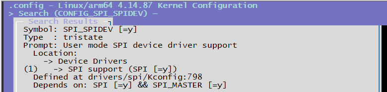

CONFIG_SPI_SLAVE=y # CONFIG_SPI_SPIDEV依赖的配置选项

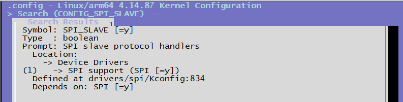

CONFIG_SPI_HOBOT=y # spi-hobot.c驱动层配置选项


#### DTS设备节点配置
在下述文件中添加相应的设备节点，并对内核进行编译。
文件路径为：arch/arm64/boot/dts/hobot/hobot-xj3.dtsi
```c
spi0: spi@0xA5004000 {
    compatible = "hobot,hobot-spi";
    reg = <0 0xA5004000 0 0x1000>;
    clocks = <&spi0_mclk>;
    clock-names = "spi_mclk";
    interrupt-parent = <&gic>;
    interrupts = <0 33 4>;
    resets = <&rst 0x50 4>;
    reset-names = "spi0";
    pinctrl-names = "default";
    pinctrl-0 = <&spi0_func>;
    status = "disabled";
    #address-cells = <1>;
    #size-cells = <0>;
};
```
文件路径：arch/arm64/boot/dts/hobot/hobot-x3-sdb.dts
```c
/* 配置为master */
&spi0 {
    status = "okay";
    spidev@0x00 {
        compatible = "rohm,dh2228fv";
        spi-max-frequency = <20000000>;
        reg = <0>;
    };
};
/* 配置为slave */
&spi2 {
    status = "okay";
    slave = <1>;
    slave@0x00 {
        compatible = "rohm,dh2228fv";
        spi-max-frequency = <20000000>;
        reg = <0>;
    };
};
```
以spi0和spi2配置为例
-   hobot-xj3.dtsi中的节点为公用的节点基本不用修改，针对不同的硬件，会在对应的dts中进行修改
-   spi0配置为spi master，spi2配置为spi slave，其中spi2中 isslave = \<1\>
    属性表示该spi配置为slave
-   两个节点中的spidev@0x00、slave@0x00节点会在spidev.c中被识别成为/dev/spidev0.0和/dev/spidev2.0设备节点，供用户空间操作
### 7.2.8.2 SPI驱动
驱动位于：drivers/spi/spi-hobot.c
#### SPI master/slave配置
```c
static int hb_spi_probe(struct platform_device *pdev)
{
    ...
    /* master or slave mode select */
    isslave = of_property_read_bool(pdev->dev.of_node, "slave");
    if (isslave == MASTER_MODE) {
        ctlr = spi_alloc_master(&pdev->dev, sizeof(*hbspi));
        if (!ctlr) {
            dev_err(&pdev->dev, "failed to alloc spi master\n");
            return -ENOMEM;
        }
    } else if (isslave == SLAVE_MODE) {
        ctlr = spi_alloc_slave(&pdev->dev, sizeof(*hbspi));
        if (!ctlr) {
            dev_err(&pdev->dev, "failed to alloc spi slave, try master\n");
            return -ENOMEM;
        }
    }
    ...
}
```
#### SPI注册
向内核注册SPI控制器
```c
static int hb_spi_probe(struct platform_device *pdev)
{
    ...
    if (isslave == MASTER_MODE) {
        hbspi->isslave = MASTER_MODE;
        snprintf(ctrl_mode, sizeof(ctrl_mode), "%s", "master");
        ctlr->bus_num = pdev->id;
        // ctlr->num_chipselect = HB_SPI_MAX_CS;
        ctlr->mode_bits = SPI_CPOL | SPI_CPHA | SPI_LSB_FIRST | SPI_CS_HIGH |
            SPI_NO_CS;
        ctlr->setup = hb_spi_setup;
        ctlr->prepare_transfer_hardware = hb_spi_prepare_xfer_hardware;
        ctlr->transfer_one = hb_spi_transfer_one;
        ctlr->unprepare_transfer_hardware = hb_spi_unprepare_xfer_hardware;
        ctlr->set_cs = hb_spi_chipselect;
        ctlr->dev.of_node = pdev->dev.of_node;
    } else if (isslave == SLAVE_MODE) {
        hbspi->isslave = SLAVE_MODE;
        snprintf(ctrl_mode, sizeof(ctrl_mode), "%s", "slave");
        ctlr->mode_bits = SPI_CPOL | SPI_CPHA | SPI_LSB_FIRST;
        ctlr->setup = hb_spi_slave_setup;
        ctlr->prepare_message = hb_spi_slave_prepare_message;
        ctlr->transfer_one = hb_spi_slave_transfer_one;
        ctlr->slave_abort = hb_spi_slave_abort;
    }
    /* register spi controller */
        ret = devm_spi_register_controller(&pdev->dev, ctlr);
    if (ret) {
        dev_err(&pdev->dev, "failed to register %s controller(%d)\n",
                ctrl_mode, ret);
        goto clk_dis_mclk;
    }
    ...
}
```
#### 硬件初始化
硬件初始化函数如下，寄存器含义可通过与地平线相关确认
```c
/* spi hw init */
static void hb_spi_init_hw(struct hb_spi *hbspi)
{
    u32 val = 0;
    /* First, should reset the whole controller */
    hb_spi_reset(hbspi);
    hb_spi_en_ctrl(hbspi, HB_SPI_OP_CORE_DIS, HB_SPI_OP_NONE,
            HB_SPI_OP_NONE);
    hb_spi_wr(hbspi, HB_SPI_INTSETMASK_REG, HB_SPI_INT_ALL);
    /* clear all interrupt pending */
    hb_spi_wr(hbspi, HB_SPI_SRCPND_REG, HB_SPI_INT_ALL);
    /* init rfto */
    hb_spi_wr(hbspi, HB_SPI_RFTO_REG, 0x27F);
    /* no instruction */
    hb_spi_wr(hbspi, HB_SPI_INST_REG, 0x0);
    hb_spi_wr(hbspi, HB_SPI_INST_MASK_REG, 0xFFFFFFFF);
    /* spi master mode */
    val = hb_spi_rd(hbspi, HB_SPI_CTRL_REG);
    if (hbspi->isslave == SLAVE_MODE)
        val |= HB_SPI_SLAVE_MODE;
    else
        val &= (~HB_SPI_SLAVE_MODE);
    if (hbspi->isslave == MASTER_MODE)
        val &= (~HB_SPI_SAMP_SEL);
    hb_spi_wr(hbspi, HB_SPI_CTRL_REG, val);
    if (debug)
        dev_err(hbspi->dev, "%s CTRL=%08X\n",
                __func__, hb_spi_rd(hbspi, HB_SPI_CTRL_REG));
    hb_spi_config(hbspi);
    hb_spi_en_ctrl(hbspi, HB_SPI_OP_CORE_EN, 0, 0);
}
```
#### 调试参数
下列为spi驱动中输出的调试参数：
```c
static int debug;
static int slave_tout = 2000;
static int master_tout = 1000;
module_param(debug, int, 0644);
MODULE_PARM_DESC(debug, "spi: 0 close debug, other open debug");
module_param(slave_tout, int, 0644);
MODULE_PARM_DESC(slave_tout, "spi: slave timeout(sec), default 10 s");
module_param(master_tout, int, 0644);
MODULE_PARM_DESC(master_tout, "spi: master timeout(sec), default 2 s");
```
-   debug等级可以设置为0，1，2，默认值为0
-   slave超时时间默认是2s，有效最大值是100s
-   master超时时间默认是1s，有效最大值是10s

在内核命令行内使用sysfs的修改方法如下，sysfs内单位均为毫秒。
找到可用参数：如下，包含3个参数

```bash
ls /sys/module/spi_hobot/parameters/
```
以下打印应出现
```bash
root@x3dvbj3-hynix2G-2666:~# ls /sys/module/spi_hobot/parameters/
debug master_tout slave_tout
```
获取当前debug参数的值：默认值为0，即不开启debug
```bash
cat /sys/module/spi_hobot/parameters/debug
```
以下打印应出现
```bash
root@x3dvbj3-hynix2G-2666:~# cat /sys/module/spi_hobot/parameters/debug
0
```
设置debug参数值为1，并再次确认设置成功：
```bash
echo 1 > /sys/module/spi_hobot/parameters/debug
cat /sys/module/spi_hobot/parameters/debug
```
以下打印应出现：
```bash
root@x3dvbj3-hynix2G-2666:~# echo 1 > /sys/module/spi_hobot/parameters/debug
root@x3dvbj3-hynix2G-2666:~# cat /sys/module/spi_hobot/parameters/debug
1
```
获取当前master\_tout参数，即作为master超时时间的值：默认值为2s
```bash
cat /sys/module/spi_hobot/parameters/master_tout
```
以下打印应出现：
```bash
root@x3dvbj3-hynix2G-2666:~# cat /sys/module/spi_hobot/parameters/master_tout
1000
```
获取当前slave\_tout参数，即作为slave超时时间的值：默认值为1s
```bash
cat /sys/module/spi_hobot/parameters/slave_tout
```
以下打印应出现：
```bash
root@x3dvbj3-hynix2G-2666:~# cat /sys/module/spi_hobot/parameters/slave_tout
2000
```
### 7.2.8.3 SPI测试

#### 硬件回环测试

内核dts使能spi0为master模式：

```
/* 配置为master */
&spi0 {
    status = "okay";
    spidev@0x00 {
        compatible = "rohm,dh2228fv";
        spi-max-frequency = <20000000>;
        reg = <0>;
    };
};
```

可以观察到spidev0.0设备节点

```
# ls /dev/spidev0.0 
/dev/spidev0.0
```

使用连接器把spi的MOSI 和 MISO 两个管脚连接起来

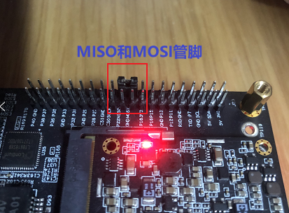

#### 测试代码

编译spidev_tc.c 代码，具体代码如附录A

```
/opt/gcc-ubuntu-9.3.0-2020.03-x86_64-aarch64-linux-gnu/bin/aarch64-linux-gnu-gcc -o spidev_tc spidev_tc.c -lpthread
```

回环测试命令：打开/dev/spidev0.0，设置12MHz速率，读写同时进行，每次读写1000个字节，测试50轮

```
# ./spidev_tc -D /dev/spidev0.0 -s 12000000 -m 3 -e 1000 -t 50
spi mode: 0x0
bits per word: 8
max speed: 12000000 Hz (12000 KHz)
userspace spi read and write test, len=1000 times=50
test: OK, times=0
test: OK, times=1
...
test: OK, times=49
```

spidev_tc 命令是测试spi的工具集命令，可以阅读它的帮助信息获取更多使用方法。

### 7.2.8.4 附录
#### A spidev_tc.c测试代码
```c
/*
 * SPI testing utility (using spidev driver)
 *
 * Copyright (c) 2007  MontaVista Software, Inc.
 * Copyright (c) 2007  Anton Vorontsov <avorontsov@ru.mvista.com>
 *
 * This program is free software; you can redistribute it and/or modify
 * it under the terms of the GNU General Public License as published by
 * the Free Software Foundation; either version 2 of the License.
 *
 * Cross-compile with cross-gcc -I/path/to/cross-kernel/include
 */

#include <stdint.h>
#include <unistd.h>
#include <stdio.h>
#include <stdlib.h>
#include <string.h>
#include <getopt.h>
#include <fcntl.h>
#include <time.h>
#include <sys/ioctl.h>
#include <linux/ioctl.h>
#include <sys/stat.h>
#include <linux/types.h>
#include <linux/spi/spidev.h>

#define ARRAY_SIZE(a) (sizeof(a) / sizeof((a)[0]))

static void pabort(const char *s)
{
    perror(s);
    abort();
}

static const char *device = "/dev/spidev0.0";
static uint32_t mode;
static uint8_t bits = 8;
static char *input_file;
static char *output_file;
static uint32_t speed = 500000;
static uint16_t delay;
static int verbose;
static int transfer_size;
static int iterations;
static int interval = 5; /* interval in seconds for showing transfer rate */
static int rw_mode = 0; //1: read, 2: write, 3: write and read
static int rw_len = 4;
static int rw_times = 5;

uint8_t default_tx[] = {
    0xFF, 0xFF, 0xFF, 0xFF, 0xFF, 0xFF,
    0x40, 0x00, 0x00, 0x00, 0x00, 0x95,
    0xFF, 0xFF, 0xFF, 0xFF, 0xFF, 0xFF,
    0xFF, 0xFF, 0xFF, 0xFF, 0xFF, 0xFF,
    0xFF, 0xFF, 0xFF, 0xFF, 0xFF, 0xFF,
    0xF0, 0x0D,
};

uint8_t default_rx[ARRAY_SIZE(default_tx)] = {0, };
char *input_tx;

static void hex_dump(const void *src, size_t length, size_t line_size,
        char *prefix)
{
    int i = 0;
    const unsigned char *address = src;
    const unsigned char *line = address;
    unsigned char c;

    printf("%s | ", prefix);
    while (length-- > 0) {
        printf("%02X ", *address++);
        if (!(++i % line_size) || (length == 0 && i % line_size)) {
            if (length == 0) {
                while (i++ % line_size)
                    printf("__ ");
            }
            printf(" | ");  /* right close */
            while (line < address) {
                c = *line++;
                printf("%c", (c < 33 || c == 255) ? 0x2E : c);
            }
            printf("\n");
            if (length > 0)
                printf("%s | ", prefix);
        }
    }
}

static void hex_dump2(const void *src, size_t length, size_t line_size,
        char *prefix)
{
    int i = 0;
    const unsigned char *address = src;
    const unsigned char *line = address;
    unsigned char c;

    printf("%s | ", prefix);
    while (length-- > 0) {
        printf("%02X ", *address++);
        if (!(++i % line_size) || (length == 0 && i % line_size)) {
            if (length == 0) {
                while (i++ % line_size)
                    printf("__ ");
            }
            printf("\n");
            if (length > 0)
                printf("%s | ", prefix);
        }
    }
    printf("\n");
}

/*
 *  Unescape - process hexadecimal escape character
 *      converts shell input "\x23" -> 0x23
 */
static int unescape(char *_dst, char *_src, size_t len)
{
    int ret = 0;
    int match;
    char *src = _src;
    char *dst = _dst;
    unsigned int ch;

    while (*src) {
        if (*src == '\\' && *(src+1) == 'x') {
            match = sscanf(src + 2, "%2x", &ch);
            if (!match)
                pabort("malformed input string");

            src += 4;
            *dst++ = (unsigned char)ch;
        } else {
            *dst++ = *src++;
        }
        ret++;
    }
    return ret;
}

static void transfer(int fd, uint8_t const *tx, uint8_t const *rx, size_t len)
{
    int ret;
    int out_fd;
    struct spi_ioc_transfer tr = {
        .tx_buf = (unsigned long)tx,
        .rx_buf = (unsigned long)rx,
        .len = len,
        .delay_usecs = delay,
        .speed_hz = speed,
        .bits_per_word = bits,
    };

    if (mode & SPI_TX_QUAD)
        tr.tx_nbits = 4;
    else if (mode & SPI_TX_DUAL)
        tr.tx_nbits = 2;
    if (mode & SPI_RX_QUAD)
        tr.rx_nbits = 4;
    else if (mode & SPI_RX_DUAL)
        tr.rx_nbits = 2;
    if (!(mode & SPI_LOOP)) {
        if (mode & (SPI_TX_QUAD | SPI_TX_DUAL))
            tr.rx_buf = 0;
        else if (mode & (SPI_RX_QUAD | SPI_RX_DUAL))
            tr.tx_buf = 0;
    }

    ret = ioctl(fd, SPI_IOC_MESSAGE(1), &tr);
    if (ret < 1)
        pabort("can't send spi message");

    if (verbose)
        hex_dump(tx, len, 32, "TX");

    if (output_file) {
        out_fd = open(output_file, O_WRONLY | O_CREAT | O_TRUNC, 0666);
        if (out_fd < 0)
            pabort("could not open output file");

        ret = write(out_fd, rx, len);
        if (ret != len)
            pabort("not all bytes written to output file");

        close(out_fd);
    }

    if (verbose)
        hex_dump(rx, len, 32, "RX");
}

static void transfer2(int fd, uint8_t const *tx, uint8_t const *rx, size_t len)
{
    int ret;
    int out_fd;
    struct spi_ioc_transfer tr = {
        .tx_buf = (unsigned long)tx,
        .rx_buf = (unsigned long)rx,
        .len = len,
        .delay_usecs = delay,
        .speed_hz = speed,
        .bits_per_word = bits,
    };

    if (mode & SPI_TX_QUAD)
        tr.tx_nbits = 4;
    else if (mode & SPI_TX_DUAL)
        tr.tx_nbits = 2;
    if (mode & SPI_RX_QUAD)
        tr.rx_nbits = 4;
    else if (mode & SPI_RX_DUAL)
        tr.rx_nbits = 2;
    if (!(mode & SPI_LOOP)) {
        if (mode & (SPI_TX_QUAD | SPI_TX_DUAL))
            tr.rx_buf = 0;
        else if (mode & (SPI_RX_QUAD | SPI_RX_DUAL))
            tr.tx_buf = 0;
    }

    if (verbose && rw_mode >> 1)
        hex_dump2(tx, len, 32, "TX");

    ret = ioctl(fd, SPI_IOC_MESSAGE(1), &tr);
    if (ret < 1) {
        //pabort("can't send spi message");
        printf("can't send spi message");
    } else {
        if (output_file) {
            out_fd = open(output_file, O_WRONLY | O_CREAT | O_TRUNC, 0666);
            if (out_fd < 0)
                pabort("could not open output file");

            ret = write(out_fd, rx, len);
            if (ret != len)
                pabort("not all bytes written to output file");

            close(out_fd);
        }

        if (verbose && rw_mode&0x01)
            hex_dump2(rx, len, 32, "RX");
    }

}

static void print_usage(const char *prog)
{
    printf("Usage: %s [-DsbdlHOLC3vpNR24SImet]\n", prog);
    puts("  -D --device   device to use (default /dev/spidev1.1)\n"
            "  -s --speed    max speed (Hz)\n"
            "  -d --delay    delay (usec)\n"
            "  -b --bpw      bits per word\n"
            "  -i --input    input data from a file (e.g. \"test.bin\")\n"
            "  -o --output   output data to a file (e.g. \"results.bin\")\n"
            "  -l --loop     loopback\n"
            "  -H --cpha     clock phase\n"
            "  -O --cpol     clock polarity\n"
            "  -L --lsb      least significant bit first\n"
            "  -C --cs-high  chip select active high\n"
            "  -3 --3wire    SI/SO signals shared\n"
            "  -v --verbose  Verbose (show tx buffer)\n"
            "  -p            Send data (e.g. \"1234\\xde\\xad\")\n"
            "  -N --no-cs    no chip select\n"
            "  -R --ready    slave pulls low to pause\n"
            "  -2 --dual     dual transfer\n"
            "  -4 --quad     quad transfer\n"
            "  -S --size     transfer size\n"
            "  -I --iter     iterations\n"
            "  -m --rw-mode  1 read, 2 write, 3 write and read\n"
            "  -e --rw-len   read or write len\n"
            "  -t --rw-times read or write times\n");
    exit(1);
}

static void parse_opts(int argc, char *argv[])
{
    while (1) {
        static const struct option lopts[] = {
            { "device",  1, 0, 'D' },
            { "speed",   1, 0, 's' },
            { "delay",   1, 0, 'd' },
            { "bpw",     1, 0, 'b' },
            { "input",   1, 0, 'i' },
            { "output",  1, 0, 'o' },
            { "loop",    0, 0, 'l' },
            { "cpha",    0, 0, 'H' },
            { "cpol",    0, 0, 'O' },
            { "lsb",     0, 0, 'L' },
            { "cs-high", 0, 0, 'C' },
            { "3wire",   0, 0, '3' },
            { "no-cs",   0, 0, 'N' },
            { "ready",   0, 0, 'R' },
            { "dual",    0, 0, '2' },
            { "verbose", 0, 0, 'v' },
            { "quad",    0, 0, '4' },
            { "size",    1, 0, 'S' },
            { "iter",    1, 0, 'I' },
            { "rw-mode",    1, 0, 'm' },
            { "rw-len",    1, 0, 'e' },
            { "rw-times",    1, 0, 't' },
            { NULL, 0, 0, 0 },
        };
        int c;

        c = getopt_long(argc, argv, "D:s:d:b:i:o:lHOLC3NR24p:vS:I:m:e:t:",
                lopts, NULL);
        //printf("optind: %d\n", optind);
        //printf("optarg: %s\n", optarg);
        //printf("option: %c\n", c);

        if (c == -1)
            break;

        switch (c) {
        case 'D':
            device = optarg;
            break;
        case 's':
            speed = atoi(optarg);
            break;
        case 'd':
            delay = atoi(optarg);
            break;
        case 'b':
            bits = atoi(optarg);
            break;
        case 'i':
            input_file = optarg;
            break;
        case 'o':
            output_file = optarg;
            break;
        case 'l':
            mode |= SPI_LOOP;
            break;
        case 'H':
            mode |= SPI_CPHA;
            break;
        case 'O':
            mode |= SPI_CPOL;
            break;
        case 'L':
            mode |= SPI_LSB_FIRST;
            break;
        case 'C':
            mode |= SPI_CS_HIGH;
            break;
        case '3':
            mode |= SPI_3WIRE;
            break;
        case 'N':
            mode |= SPI_NO_CS;
            break;
        case 'v':
            verbose = 1;
            break;
        case 'R':
            mode |= SPI_READY;
            break;
        case 'p':
            input_tx = optarg;
            break;
        case '2':
            mode |= SPI_TX_DUAL;
            break;
        case '4':
            mode |= SPI_TX_QUAD;
            break;
        case 'S':
            transfer_size = atoi(optarg);
            break;
        case 'I':
            iterations = atoi(optarg);
            break;
        case 'm':
            rw_mode = atoi(optarg);
            break;
        case 'e':
            rw_len = atoi(optarg);
            break;
        case 't':
            rw_times = atoi(optarg);
            break;
        default:
            print_usage(argv[0]);
            break;
        }
    }
    if (mode & SPI_LOOP) {
        if (mode & SPI_TX_DUAL)
            mode |= SPI_RX_DUAL;
        if (mode & SPI_TX_QUAD)
            mode |= SPI_RX_QUAD;
    }
}

static void transfer_escaped_string(int fd, char *str)
{
    size_t size = strlen(str);
    uint8_t *tx;
    uint8_t *rx;

    tx = malloc(size);
    if (!tx)
        pabort("can't allocate tx buffer");

    rx = malloc(size);
    if (!rx)
        pabort("can't allocate rx buffer");

    size = unescape((char *)tx, str, size);
    printf("size: %d\n", size);
    transfer(fd, tx, rx, size);
    free(rx);
    free(tx);
}

static void transfer_file(int fd, char *filename)
{
    ssize_t bytes;
    struct stat sb;
    int tx_fd;
    uint8_t *tx;
    uint8_t *rx;

    if (stat(filename, &sb) == -1)
        pabort("can't stat input file");

    tx_fd = open(filename, O_RDONLY);
    if (tx_fd < 0)
        pabort("can't open input file");

    tx = malloc(sb.st_size);
    if (!tx)
        pabort("can't allocate tx buffer");

    rx = malloc(sb.st_size);
    if (!rx)
        pabort("can't allocate rx buffer");

    bytes = read(tx_fd, tx, sb.st_size);
    if (bytes != sb.st_size)
        pabort("failed to read input file");

    transfer(fd, tx, rx, sb.st_size);
    free(rx);
    free(tx);
    close(tx_fd);
}

static uint64_t _read_count;
static uint64_t _write_count;

static void show_transfer_rate(void)
{
    static uint64_t prev_read_count, prev_write_count;
    double rx_rate, tx_rate;

    rx_rate = ((_read_count - prev_read_count) * 8) / (interval*1000.0);
    tx_rate = ((_write_count - prev_write_count) * 8) / (interval*1000.0);

    printf("rate: tx %.1fkbps, rx %.1fkbps\n", rx_rate, tx_rate);

    prev_read_count = _read_count;
    prev_write_count = _write_count;
}

static void transfer_buf(int fd, int len)
{
    uint8_t *tx;
    uint8_t *rx;
    int i;

    tx = malloc(len);
    if (!tx)
        pabort("can't allocate tx buffer");
    for (i = 0; i < len; i++)
        tx[i] = random();

    rx = malloc(len);
    if (!rx)
        pabort("can't allocate rx buffer");

    transfer(fd, tx, rx, len);

    _write_count += len;
    _read_count += len;

    if (mode & SPI_LOOP) {
        if (memcmp(tx, rx, len)) {
            fprintf(stderr, "transfer error !\n");
            hex_dump(tx, len, 32, "TX");
            hex_dump(rx, len, 32, "RX");
            exit(1);
        }
    }

    free(rx);
    free(tx);
}

static void transfer_read_write(int fd)
{
    uint8_t *tx;
    uint8_t *rx;
    int i, j;
    int len, times;
    char str[64] = {0};

    len = rw_len > 0 ? rw_len : 4;
    times = rw_times > 0 ? rw_times : 4;
    if (rw_mode == 2)
        sprintf(str, "write");
    else if (rw_mode == 3)
        sprintf(str, "read and write");
    else {
        rw_mode = 1;
        sprintf(str, "read");
    }

    printf("userspace spi %s test, len=%d times=%d\n", str, len, times);

    tx = malloc(len + 4);
    if (!tx)
        pabort("can't allocate tx buffer");
    rx = malloc(len + 4);
    if (!rx)
        pabort("can't allocate rx buffer");

    for (j = 0; j < rw_times; j++) {
        memset(tx, 0 ,len);
        memset(rx, 0, len);

        if (rw_mode >> 1) {
            for (i = 0; i < len; i++)
                tx[i] = random();
        } else {
            for (i = 0; i < len; i++)
                tx[i] = i << 2;
        }
        transfer2(fd, tx, rx, len);
        printf("test: %s, times=%d\n", strncmp(tx, rx, len) == 0 ? "OK" : "Failed", j);
        //sleep(2);
    }
}

int main(int argc, char *argv[])
{
    int ret = 0;
    int fd;

    parse_opts(argc, argv);

    fd = open(device, O_RDWR);
    if (fd < 0)
        pabort("can't open device");

    /*
     * spi mode
     */
    ret = ioctl(fd, SPI_IOC_WR_MODE32, &mode);
    if (ret == -1)
        pabort("can't set spi mode");

    ret = ioctl(fd, SPI_IOC_RD_MODE32, &mode);
    if (ret == -1)
        pabort("can't get spi mode");

    /*
     * bits per word
     */
    ret = ioctl(fd, SPI_IOC_WR_BITS_PER_WORD, &bits);
    if (ret == -1)
        pabort("can't set bits per word");

    ret = ioctl(fd, SPI_IOC_RD_BITS_PER_WORD, &bits);
    if (ret == -1)
        pabort("can't get bits per word");

    /*
     * max speed hz
     */
    ret = ioctl(fd, SPI_IOC_WR_MAX_SPEED_HZ, &speed);
    if (ret == -1)
        pabort("can't set max speed hz");

    ret = ioctl(fd, SPI_IOC_RD_MAX_SPEED_HZ, &speed);
    if (ret == -1)
        pabort("can't get max speed hz");

    printf("spi mode: 0x%x\n", mode);
    printf("bits per word: %d\n", bits);
    printf("max speed: %d Hz (%d KHz)\n", speed, speed/1000);

    if (input_tx && input_file)
        pabort("only one of -p and --input may be selected");

    if (input_tx)
        transfer_escaped_string(fd, input_tx);
    else if (input_file)
        transfer_file(fd, input_file);
    else if (transfer_size) {
        struct timespec last_stat;

        clock_gettime(CLOCK_MONOTONIC, &last_stat);

        while (iterations-- > 0) {
            struct timespec current;

            transfer_buf(fd, transfer_size);

            clock_gettime(CLOCK_MONOTONIC, &current);
            if (current.tv_sec - last_stat.tv_sec > interval) {
                show_transfer_rate();
                last_stat = current;
            }
        }
        printf("total: tx %.1fKB, rx %.1fKB\n",
                _write_count/1024.0, _read_count/1024.0);
    } else if (rw_mode) {
        transfer_read_write(fd);
    } else
        transfer(fd, default_tx, default_rx, sizeof(default_tx));

    close(fd);

    return ret;
}
```
#### B SPI时序


## 7.2.9 PWM 驱动调试指南
X3有两类控制器：一类是标准PWM，有3组，每组三个，共9个，另一类是LPWM，主要用于支持Sensor的同步曝光。
- PWM 默认支持频率范围是192MHz到46.8KHz，每组PWM的占空比寄存器RATIO精度为8bit。
- LPWM 默认支持频率范围是100KHz到24.4Hz，没有占空比寄存器，只有一个高电平持续时间HIGH，HIGH寄存器配置单位是us，最大支持设置高电平为160us，所以LPWM的占空比与频率有关。
- LPWM是为了Sensor 同步设计的，不是一个通用的PWM，**单纯PWM功能建议使用PWM。**
### 7.2.9.1 驱动代码
#### 代码路径
```c
drivers/pwm/pwm-hobot.c
```
#### 内核配置
```bash
Device Drivers
    ->  Pulse-Width Modulation (PWM) Support
        ->  Hobot PWM controller support
        ->  Hobot lite PWM controller support
```
#### DTS节点配置
在`hobot-xj3.dtsi`这个文件里面有`pwm`和`lpwm`的配置，一般来讲不需要做任何修改。
```c
/* arch/arm64/boot/dts/hobot/hobot-xj3.dtsi */
lpwm: lpwm@0xA500D000 {
    compatible = "hobot,hobot-lpwm";
    reg = <0 0xA5018000 0 0x1000>;
    interrupt-parent = <&gic>;
    interrupts = <0 68 4>;
    pinctrl-names = "lpwm0", "lpwm1","lpwm2","lpwm3", "lpwm_pps";
    pinctrl-0 = <&lpwm0_func>;
    pinctrl-1 = <&lpwm1_func>;
    pinctrl-2 = <&lpwm2_func>;
    pinctrl-3 = <&lpwm3_func>;
    pinctrl-4 = <&lpwm_pps>;
    clocks = <&lpwm_mclk>;
    clock-names = "lpwm_mclk";
    status = "disabled";
};

pwm_c0: pwm@0xA500D000 {
    compatible = "hobot,hobot-pwm";
    #pwm-cells = <3>;
    reg = <0 0xA500D000 0 0x1000>;
    interrupt-parent = <&gic>;
    interrupts = <0 44 4>;
    pinctrl-names = "pwm0", "pwm1","pwm2";
    pinctrl-0 = <&pwm0_func>;
    pinctrl-1 = <&pwm1_func>;
    pinctrl-2 = <&pwm2_func>;
    clocks = <&pwm0_mclk>;
    clock-names = "pwm_mclk";
    status = "disabled";
};
...
```

当需要使能对应串口的时候，可以到对应的板级文件修改，这里以`hobot-x3-sdb_v4.dts`为例，使能`pwm0-2`、`pwm3-5`。
```c
/* arch/arm64/boot/dts/hobot/hobot-x3-sdb_v4.dts */
...
&pwm_c0 {
	status = "okay";
	pinctrl-0 = <&pwm0_func>;
	pinctrl-1 = <>;
	pinctrl-2 = <>;
};
&pwm_c1 {
	status = "okay";
	pinctrl-0 = <>;
	pinctrl-1 = <&pwm4_func>;
	pinctrl-2 = <>;
};
...
```
### 7.2.9.2 测试
用户可以使用如下脚本进行`pwm`功能测试，并进行信号测量，验证`pwm`工作是否正常。
```shell
echo 8 8 8 8  > /proc/sys/kernel/printk
for i in 0 3
do
        cd /sys/class/pwm/pwmchip${i}
        echo 0 > export
        echo 1 > export
        echo 2 > export
 
        cd pwm0
        echo 10000 > period
        echo 3000  > duty_cycle
        echo 1 > enable
  
        cd ../pwm1
        echo 10000 > period
        echo 1000  > duty_cycle
        echo 1 > enable
 
        cd ../pwm2
        echo 10000 > period
        echo 1000  > duty_cycle
        echo 1 > enable
done
#以下是进行寄存器读取
echo "pwm0 pinctrl:`devmem 0xa6004010 32`"
echo "pwm1 pinctrl:`devmem 0xa6004058 32`"
echo "pwm2 pinctrl:`devmem 0xa600405C 32`"
echo "pwm3 pinctrl:`devmem 0xa6004060 32`"
echo "pwm4 pinctrl:`devmem 0xa6004064 32`"
echo "pwm5 pinctrl:`devmem 0xa6004048 32`"
echo "pwm6 pinctrl:`devmem 0xa600404C 32`"
echo "pwm7 pinctrl:`devmem 0xa6004030 32`"
echo "pwm8 pinctrl:`devmem 0xa6004034 32`"
 
echo "Regs of PWM 0 1 2:"
echo "PWM_EN      `devmem 0xA500d000 32`"
echo "PWM_SLICE   `devmem 0xA500d004 32`"
echo "PWM_FREQ    `devmem 0xA500d008 32`"
echo "PWM_FREQ1   `devmem 0xA500d00C 32`"
echo "PWM_RATIO   `devmem 0xA500d014 32`"
echo "PWM_SRCPND  `devmem 0xA500d01C 32`"
echo "PWM_INTMASK `devmem 0xA500d020 32`"
 
echo "Regs of PWM 3 4 5:"
echo "PWM_EN      `devmem 0xA500e000 32`"
echo "PWM_SLICE   `devmem 0xA500e004 32`"
echo "PWM_FREQ    `devmem 0xA500e008 32`"
echo "PWM_FREQ1   `devmem 0xA500e00C 32`"
echo "PWM_RATIO   `devmem 0xA500e014 32`"
echo "PWM_SRCPND  `devmem 0xA500e01C 32`"
echo "PWM_INTMASK `devmem 0xA500e020 32`"
```

## 7.2.10 BPU驱动sysfs调试接口
### 7.2.10.1 BPU sysfs节点说明
```bash
/sys/devices/system/bpu
```


各个文件节点可以使用“cat”命令获取信息，“echo”命令设置。具体内容如下：

-   bpu\*：目录，bpu0，bpu1分别对应bpu的两个核，每个目录内的节点设置如下：

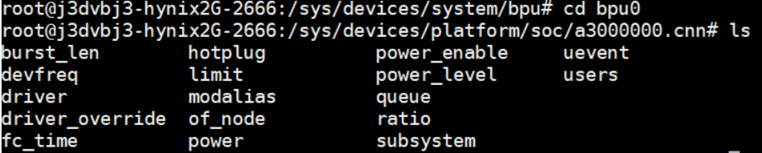

-   burst_len：读写文件，该Core核心对应的burst_len

-   hotplug：读写文件，该Core核心热拔插是否开启：
    -   0：关闭；
    -   1：开启；

-   power_enable：读写文件，该Core核心开关，用于开启/关闭对应BPU核心硬件电源；

-   devfreq：读写文件，用于读取/设置该Core核心频率：
    - 以BPU0为例，将调频策略设为userspace

      ```
      echo userspace > /sys/devices/system/bpu/bpu0/devfreq/devfreq*/governor
      ```

    - 查看BPU支持频率：

      ```
      cat /sys/devices/system/bpu/bpu0/devfreq/devfreq\*/available_frequencies
      ```
    - 设置BPU为目标频率，目标频率需要被BPU支持：

      ```
      echo 200000000 > /sys/devices/system/bpu/bpu0/devfreq/devfreq*/userspace/set_freq
      ```
    - 确认被设置的频率：

      ```
      cat /sys/devices/system/bpu/bpu0/devfreq/devfreq*/available_frequencies
      ```

-   limit：读写文件，用于设置该Core核心硬件相关的缓冲数量，默认值为0，任何大于0的值为实际数量，与优先级相关，越小的正值优先级越高，
    该任务越早被调度执行，但是任务切换的效率会对应降低。请用户根据实际情况设置；

-   power_level：读写文件，用于设置该Core核心工作的功率级别（包括工作电源及频率）：
    -   1：linux dvf动态调节
    -   0：性能优先，最高功耗
    -   < 0：在范围内，值越小，功耗等级越低。

-   users：只读文件，用于获取使用该Core的用户信息。详细信息请参考下文users一项；
- queue：只读文件，获取驱动当前可设置的FunctionCall数量；

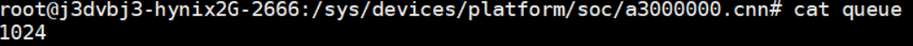

-   ratio：只读文件，获取该Core核心的使用率信息；

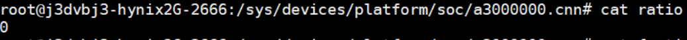

-   fc_time：获取该Core上处理过的fc任务信息，对应每一个任务有如下子项：

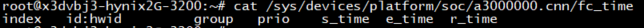

- index：该任务位于BPU硬件FIFO中的位置
-   id：用户设置的中断id
-   hwid：底层驱动维护的中断id
-   group：用户设置的组id，用户进程号
-   prio：任务优先级
-   s_time：任务处理开始的时间戳
-   e_time：任务处理结束的时间戳
-   r_time：任务被处理的总耗时
-   core_num：只读文件，BPU中核心Core的数量
- group：只读文件，运行在BPU上的任务组信息。通过“cat group”可得：


-   group：用户设置的组id和进程号；
    -   prop：用户设置的比例值
    -   ratio：当前实际的运行占用率
-   ratio：只读文件，当前BPU的使用率
-   users：只读文件，当前使用BPU的用户信息，用户会被归类为通过BPU框架设置任务的用户和指定各个Core设置任务的用户。通过“cat users”可得：


-   user：用户进程号
-   ratio：该用户对应Core上的占用率

### 7.2.10.2 使用示例
下文所有案例均已BPU0为目标，所有命令可以在运行模型应用后执行。
#### 关闭BPU Core
执行以下命令：
```bash
echo 0 > /sys/devices/system/bpu/bpu0/power_enable
```
#### 热拔插BPU Core
热拔插不影响单核模型应用运行，不支持双核模型应用。热拔插功能启用后，不会默认关闭，如需关闭热拔插，请手动设置（echo  0至对应sysfs节点）。
依次执行以下命令：
```bash
echo 1 > /sys/devices/system/bpu/bpu0/hotplug
echo 0 > /sys/devices/system/bpu/bpu0/power_enable
```
#### 降低BPU Core功耗
该命令不会关闭BPU核心，只会降低对应核心频率/功耗，具体值及对应含义，请查照上文：
```bash
echo -2 > /sys/devices/system/bpu/bpu0/power_level
```
#### 优先级模型使用
根据HBDK编译器相关说明编译和使用优先级模型。
使用hb_bpu_core_set_fc_prio接口或者特定group_id的hb_bpu_core_set_fc_group接口设置任务：

```bash
echo 2 > /sys/devices/system/bpu/bpu0/limit
```
limit接口可以用于调试，用户也可在执行应用时使用以下命令设置环境变量实现：
```bash
export BPLAT_CORELIMIT=2
```

## 7.2.11 Thermal 系统

### 7.2.11.1 温度传感器

在X3芯片上有一个温度传感器，直接反应的是X3芯片DIE的温度。

在/sys/class/hwmon/下有hwmon0目录下包含温度传感器的相关参数。

重要文件：name和temp1_input.

-   name是指温度传感器的名字。
-   temp1_input是指温度的值，默认精度是0.001摄氏度。

```
# cat /sys/class/hwmon/hwmon0/name
pvt_ts
# cat /sys/class/hwmon/hwmon0/temp1_input
55892
# 55892 代表55.892摄氏度
```

这个hwmon0设备的温度直接作用到  cat /sys/class/thermal/thermal_zone0/temp 设备，两者的数值是一摸一样。

### 7.2.11.2 Thermal

Linux Thermal 是 Linux 系统下温度控制相关的模块，主要用来控制系统运行过程中芯片产生的热量，使芯片温度和设备外壳温度维持在一个安全、舒适的范围。

要想达到合理控制设备温度，我们需要了解以下三个模块：

- 获取温度的设备：在 Thermal 框架中被抽象为 Thermal Zone Device，这个就是温度传感器 thermal_zone0；
- 需要降温的设备：在 Thermal 框架中被抽象为 Thermal Cooling Device，有CPU和BPU；
- 控制温度策略：在 Thermal 框架中被抽象为 Thermal Governor;

以上模块的信息和控制都可以在 /sys/class/thermal 目录下获取。

在x3里面一共有三个cooling(降温)设备：

- cooling_device0: cnn0
- cooling_device1: cnn1
- cooling_device2: cpu

目前默认的策略通过以下命令可知是使用的 step_wise。

```
cat /sys/class/thermal/thermal_zone0/policy
```

 通过以下命令可看到支持的策略：user_space、step_wise一共两种。

```
cat /sys/class/thermal/thermal_zone0/available_policies
```

- user_space 是通过uevent将温区当前温度，温控触发点等信息上报到用户空间，由用户空间软件制定温控的策略。
- step_wise 是每个轮询周期逐级提高冷却状态，是一种相对温和的温控策略

具体选择哪种策略是根据产品需要自己选择。可在编译的时候指定或者通过sysfs动态切换。

例如：动态切换策略为 user_space模式

```
echo user_space > /sys/class/thermal/thermal_zone0/policy 
```

执行以下命令可看到有三个trip_point（触发温度）。

```
ls -l  /sys/devices/virtual/thermal/thermal_zone0
```

目前默认选择的trip-point是trip_point_1_temp（温度是75度）。

```
trip_point_*_hyst (*:0 - 2) # 滞后温度
trip_point_*_temp (*: 0 - 2) # 触发温度
trip_point_*_type (*: 0 - 2) # 触发点的类型
```

如果想要结温到85摄氏度才去降频：

```
echo 85000 > /sys/devices/virtual/thermal/thermal_zone0/trip_point_1_temp
```

如果想要调整关机温度为105摄氏度： 

```
echo 105000 > /sys/devices/virtual/thermal/thermal_zone0/trip_point_2_temp
```

ps：以上设置断电重启后需要重新设置

### 7.2.11.3 thermal参考文档

kernel/Documentation/thermal/


## 7.2.12 修改BPU保留内存大小

### 7.2.12.1 临时设置BPU保留内存

当ion选择cma作为内存池时，通过cma区域来为BPU mem划分空间，以此兼顾cma的灵活性和预留空间的效率，该空间大小可在系统启动后通过修改/sys节点修改：

```bash
echo 100 > /sys/class/misc/ion/cma_carveout_size
```

通过上述方式修改该空间大小单位为Mbyte，需根据实际场景需求做不同配置(如多路场景下若vio报ion_alloc错误，则可适当降低该空间大小，最小可到0)，设置0值表示BPU只使用cma来动态分配(若无sys该节点表示该版本暂不支持此方式配置)。

注意：只有当没有用户使用BPU_MEM时才可以修改成功，由于该空间为从cma中申请的连续物理地址空间，可申请到的最大大小无法达到cma总大小。当BPU_MEM无法从该空间中申请到足够的内存时，系统会尝试从该空间之外的cma空间申请。

因为这部分预留是从cma中分配出的连续物理空间，所以设置有可能失败，设置了之后再cat一下这个节点，成功的话就是设置的值，失败就是0。

### 7.2.12.2 在设备树中设置ion_cam size

1、串口或者ssh终端登录X3Pi

2、确认当前硬件使用的dtb文件

X3Pi 一般是 `hobot-x3-pi.dtb`
X3CM 是`hobot-x3-cm.dtb`

可以通过 `cat /sys/firmware/devicetree/base/model`  命令确定

3、使用以下命令把dtb文件转成方便阅读的dts文件：

```
dtc -I dtb -O dts -o hobot-x3-pi.dts /boot/hobot/hobot-x3-pi.dtb 
```

其中，/boot/hobot/hobot-x3-pi.dtb 是要编辑的DTB文件的路径。该命令将DTB文件转换为DTS文件（设备树源文件）。
在文本编辑器中，可以编辑DTS文件并保存更改。

4、修改 ion size

打开dts文件后， 找到 ion_cma 节点，修改 alloc-ranges 和 size 属性中的 0x2a000000 为需要的内存大小值，在修改此值之前，请确保明确了解它的含义，包括允许的设置范围。

```
ion_cma {
		compatible = "shared-dma-pool";
		alloc-ranges = <0x00 0x4000000 0x00 0x2a000000>;
		alignment = <0x00 0x100000>;
		size = <0x00 0x2a000000>;
		reusable;
};
```

例如，如果要将 ion_cma size 设置为 1.5GB，可以将其更改为下面的示例。

```
ion_cma {
		compatible = "shared-dma-pool";
		alloc-ranges = <0x00 0x4000000 0x00 0x5dc00000>;
		alignment = <0x00 0x100000>;
		size = <0x00 0x5dc00000>;
		reusable;
};
```

5、保存修改后，使用以下命令将 DTS 文件转换回 DTB 格式。在执行此操作之前，请备份原始文件。

```
dtc -I dts -O dtb -o /boot/hobot/hobot-x3-pi.dtb hobot-x3-pi.dts
```

保存后，建议将其转换回 dts 文件并确认修改是否正确，以避免因笔误等原因导致修改的值不符合预期。

6、最后，重启您的系统以使更改生效

注意事项：

- 修改DTB文件可能会影响您的系统的稳定性和安全性。在修改DTB文件之前，请确保您了解您要更改的内容的含义，并备份原始DTB文件以防止意外错误。
- /boot/hobot/ 下文件由地平线软件包管理，如果升级了系统软件，则用户的修改会被重置为默认配置（672MB）

## 7.2.13 DDR压力测试方案

### 7.2.13.1 目的

本文主要介绍DDR颗粒在高低温环境下长时间大压力运行的测试方法。

### 7.2.13.2 名词解释

判定术语：
PASS：测试完成后，DUT所有功能、性能符合预期，无异常发生
FAIL：测试完成后，DUT功能出现损坏或功能失效，或未达到指标要求

### 7.2.13.3 测试项

| **测试类别**    | **环境温度** | **测试时长** |
| --------------- | ------------ | ------------ |
| DDR常温压力测试 | 25度         | 48H          |
| DDR高温压力测试 | 60度         | 48H          |
| DDR低温压力测试 | -25度        | 48H          |

### 7.2.13.4 测试环境

#### DUT压力程序

| **ITEM** | **版本号/设备编号**   | **适用测试项** |
| -------- | --------------------- | -------------- |
| 测试脚本 | xj3_ddr_stress.tar.gz | 压力测试通用   |
| DUT数量  | 5台及以上             | 压力测试通用   |

从 [unittest](http://archive.sunrisepi.tech/downloads/unittest/) 选择对应sdk版本的目录下载 `xj3_ddr_stress_gcc9.3.tar.gz`

#### 压力程序使用方法

1、通过网口或者其他工具将 `xj3_ddr_stress_gcc9.3.tar.gz`  传输到 XJ3 的 userdata 目录下

2、进入 XJ3 侧的 userdata 目录 cd /userdata

3、解压测试文件

```
tar -zxvf xj3_ddr_stress_gcc9.3.tar.gz 
```

4、给 xj3_ddr_stress 文件夹加权限

```
 chmod 777 xj3_ddr_stress 
```

5、进入 cd xj3_ddr_stress 目录

```
cd xj3_ddr_stress 
```

6、设置CPU模式和降频温度

```
# 若设备重启需再次配置这两条指令
echo performance > /sys/devices/system/cpu/cpufreq/policy0/scaling_governor 
echo 105000 > /sys/devices/virtual/thermal/thermal_zone0/trip_point_1_temp
```

7、执行压力测试脚本, 后台运行cpu test和bpu test

```
sh ./scripts/xj3-stress.sh
```

8、top检查运行状态


9、cpu test log存放目录在 /userdata/cpu-stress.log， 查看当前运行状态

```
# 10s 会打印一次
tail /userdata/cpu-stress.log
```


注：程序默认连续运行48h（如下图-s参数后面的172800，单位：s） 

10、bpu test log 存放在/userdata/bpu-stress.log，查看当前运行状态

```
# 只要 log 在更新，就是在测试，默认一直运行
tail /userdata/bpu-stress.log
```

11、检查cpu test result, 如果/userdata/cpu-stress.log最后Status显示PASS，且日志中未出现"error" 或者 "miscompare" 关键字，表示测试PASS; 

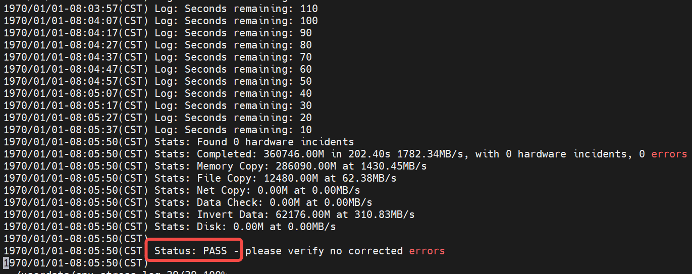

12、如果/userdata/cpu-stress.log最后Status显示FAIL，或者日志中出现了"error" 或者 "miscompare" 关键字，表示测试FAIL;  

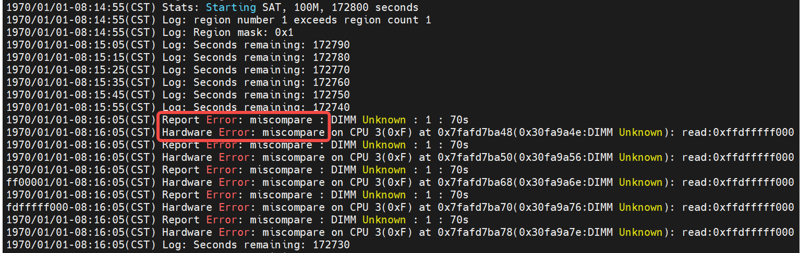

13、检查bpu test result, 如果bpu_stress.log 中出现 error 或者 system hung 等关键字，表示测试FAIL。 


## 7.2.14 RTC 调试指南

注： 以pcf8563芯片为例说明

### 7.2.14.1 驱动代码

```
drivers/rtc/rtc-pcf8563.c
```

### 7.2.14.2 内核配置

CONFIG_RTC_DRV_PCF8563


### 7.2.14.3 RTC使用

驱动加载成功后，会出现 /dev/rtc1 设备节点，对应的就是pcf-8563，可以使用以下命令进行测试。

```bash
# 建立 /dev/rtc1 到 /dev/rtc 的软连接

ln -sf /dev/rtc1 /dev/rtc

# 测试命令
date -s 2022.01.21-21:24:00   	# 设置系统时间
hwclock -w       				# 将系统时间写入RTC
hwclock -r       				# 读取RTC时间，确认时间是否写入成功
hwclock -s       				# 如果rtc电池存在，断电后，再上电，将RTC时间更新到系统时间
date             				# 读取系统时间
```

:::info 备注  
如果需要保证 RTC 断电后依然能够记录时间，需要给RTC提供单独的供电，供电接口为 RTC Battery Con 。
:::

## 7.2.15 看门狗驱动调试指南

代码路径

```
drivers/watchdog/hobot_wdt.c # watchdog 驱动代码源文件
include/linux/watchdog.h # watchdog 驱动代码头文件
```

dts配置

```
/* arch/arm64/boot/dts/hobot/hobot-xj3.dtsi */
watchdog: watchdog@0xA1002000 {
    compatible = "hobot,hobot-wdt";
    reg = <0 0xA1002000 0 0x1000>;
    clocks = <&timer0_mclk>;
    clock-names = "watchdog_mclk";
    interrupt-parent = <&gic>;
    interrupts = <0 15 4>;
    pet-time = <6>;
    bark-time = <11>;
    bite-time = <15>;
    status = "disabled";
};

/* arch/arm64/boot/dts/hobot/hobot-x3-sdb.dts */
&watchdog {
	status = "okay";
};

/* arch/arm64/boot/dts/hobot/hobot-xj3-xvb.dtsi */
&watchdog {
	status = "okay";
};

```

内核配置

```
/* arch/arm64/configs/xj3_debug_defconfig */
CONFIG_WATCHDOG=y
CONFIG_WATCHDOG_CORE=y
# CONFIG_WATCHDOG_NOWAYOUT is not set
CONFIG_WATCHDOG_HANDLE_BOOT_ENABLED=y
# CONFIG_WATCHDOG_SYSFS is not set
#
# Watchdog Device Drivers
#
# CONFIG_SOFT_WATCHDOG is not set
# CONFIG_GPIO_WATCHDOG is not set
# CONFIG_XILINX_WATCHDOG is not set
# CONFIG_ZIIRAVE_WATCHDOG is not set
# CONFIG_ARM_SP805_WATCHDOG is not set
# CONFIG_ARM_SBSA_WATCHDOG is not set
# CONFIG_CADENCE_WATCHDOG is not set
# CONFIG_DW_WATCHDOG is not set
# CONFIG_MAX63XX_WATCHDOG is not set
CONFIG_HOBOT_WATCHDOG=y
# CONFIG_HOBOT_WATCHDOG_ENABLE is not set/*打开这个选项系统会自动喂狗*/
CONFIG_HOBOT_WATCHDOG_TEST=y
# CONFIG_MEN_A21_WDT is not set

/* arch/arm64/configs/xj3_debug_defconfig */
CONFIG_WATCHDOG=y
CONFIG_WATCHDOG_CORE=y
# CONFIG_WATCHDOG_NOWAYOUT is not set
CONFIG_WATCHDOG_HANDLE_BOOT_ENABLED=y
# CONFIG_WATCHDOG_SYSFS is not set

#
# Watchdog Device Drivers
#
# CONFIG_SOFT_WATCHDOG is not set
# CONFIG_GPIO_WATCHDOG is not set
# CONFIG_XILINX_WATCHDOG is not set
# CONFIG_ZIIRAVE_WATCHDOG is not set
# CONFIG_ARM_SP805_WATCHDOG is not set
# CONFIG_ARM_SBSA_WATCHDOG is not set
# CONFIG_CADENCE_WATCHDOG is not set
# CONFIG_DW_WATCHDOG is not set
# CONFIG_MAX63XX_WATCHDOG is not set
CONFIG_HOBOT_WATCHDOG=y
CONFIG_HOBOT_WATCHDOG_ENABLE=y/*打开这个选项系统会自动喂狗*/
# CONFIG_HOBOT_WATCHDOG_TEST is not set
# CONFIG_MEN_A21_WDT is not set
```

使用示例

```
#include <stdio.h>
#include <stdlib.h>
#include <unistd.h> //UNIX标准函数定义
#include <sys/types.h>
#include <sys/stat.h>
#include <fcntl.h>  //文件控制定义
#include <termios.h>    //PPSIX终端控制定义
#include <errno.h>  //错误号定义
#include <pthread.h>
#include <linux/watchdog.h>
#include <string.h>
#include <sys/ioctl.h>

int watchdogfd;
int feeddog = 1;

void* feeddogthread()
{
	int feeddogvalue;
	int returnval;

	feeddogvalue = 65535;

	while (feeddog) {
		//每隔10秒，将重载看门狗计数寄存器的值
		printf("feed dog\n");
		returnval = write(watchdogfd, &feeddogvalue, sizeof(int));
		sleep(10);
	}
}

int main()
{
	pthread_t watchdogThd;
	//int watchdogfd;
	int returnval;
	char readline[32], *p;

	//打开看门狗设备
	if ((watchdogfd = open("/dev/watchdog", O_RDWR|O_NONBLOCK)) < 0) {
		printf("cannot open the watchdog device\n");
		exit(0);
	}

	int timeout = 15;
	int timeleft;
    ioctl(watchdogfd, WDIOC_SETTIMEOUT, &timeout);
    printf("The timeout was set to %d seconds\n", timeout);

	//创建喂狗线程
	returnval = pthread_create(&watchdogThd, NULL, feeddogthread, NULL);
	if (returnval < 0)
		printf("cannot create feeddog thread\n");

	while (1) {
		printf("Command (e quit): ");
		memset(readline, '\0', sizeof(readline));
        fgets(readline, sizeof(readline), stdin);
    
        /* 去字符串前部空字符 */
        p = readline;
        while(*p == ' ' || *p == '\t')
                p++;

        switch(*p) {
        case 'g':
        	ioctl(watchdogfd, WDIOC_GETTIMEOUT, &timeout);
    		printf("The timeout was is %d seconds\n", timeout);
    		break;
    	case 'e':
			printf("Close watchdog an exit safety!\n");
			//write(watchdogfd, "V", 1);
			int disable_dog = WDIOS_DISABLECARD;
			ioctl(watchdogfd, WDIOC_SETOPTIONS, &disable_dog);
			close(watchdogfd);
			break;
		case 's':
			printf("stop feed dog\n");
			feeddog = 0;
			break;
		case 't':
			ioctl(watchdogfd, WDIOC_GETTIMELEFT, &timeleft);
    		printf("The timeout was is %d seconds\n", timeleft);
    		break;
		case 'r': 
			printf("we don't close watchdog. The machine will reboot in a few seconds!\n");
			printf("wait......\n");
			break;
		default:
			printf("get error char: %c\n", *p);
        }
		
	}

	return 0;
}

```
