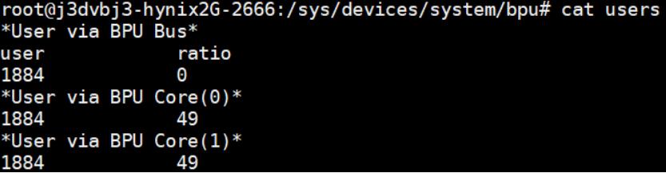

# BPU驱动sysfs调试接口

## BPU sysfs节点说明

```bash
/sys/devices/system/bpu
```


各个文件节点可以使用“cat”命令获取信息，“echo”命令设置。具体内容如下：

-   bpu\*：目录，bpu0，bpu1分别对应bpu的两个核，每个目录内的节点设置如下：


- burst_len：读写文件，该Core核心对应的burst_len

- hotplug：读写文件，该Core核心热拔插是否开启：

  -   0：关闭；
  -   1：开启；

- power_enable：读写文件，该Core核心开关，用于开启/关闭对应BPU核心硬件电源；

- devfreq：读写文件，用于读取/设置该Core核心频率：

  - 以BPU0为例，将调频策略设为userspace

    ```
    echo userspace > /sys/devices/system/bpu/bpu0/devfreq/devfreq*/governor
    ```

  - 查看BPU支持频率：

    ```
    cat /sys/devices/system/bpu/bpu0/devfreq/devfreq\*/available_frequencies
    ```

  - 设置BPU为目标频率，目标频率需要被BPU支持：

    ```
    echo 200000000 > /sys/devices/system/bpu/bpu0/devfreq/devfreq*/userspace/set_freq
    ```

  - 确认被设置的频率：

    ```
    cat /sys/devices/system/bpu/bpu0/devfreq/devfreq*/available_frequencies
    ```

- limit：读写文件，用于设置该Core核心硬件相关的缓冲数量，默认值为0，任何大于0的值为实际数量，与优先级相关，越小的正值优先级越高，
  该任务越早被调度执行，但是任务切换的效率会对应降低。请用户根据实际情况设置；

- power_level：读写文件，用于设置该Core核心工作的功率级别（包括工作电源及频率）：

  -   1：linux dvf动态调节
  -   0：性能优先，最高功耗
  -   < 0：在范围内，值越小，功耗等级越低。

- users：只读文件，用于获取使用该Core的用户信息。详细信息请参考下文users一项；

- queue：只读文件，获取驱动当前可设置的FunctionCall数量；


-   ratio：只读文件，获取该Core核心的使用率信息；


-   fc_time：获取该Core上处理过的fc任务信息，对应每一个任务有如下子项：


- index：该任务位于BPU硬件FIFO中的位置
- id：用户设置的中断id
- hwid：底层驱动维护的中断id
- group：用户设置的组id，用户进程号
- prio：任务优先级
- s_time：任务处理开始的时间戳
- e_time：任务处理结束的时间戳
- r_time：任务被处理的总耗时
- core_num：只读文件，BPU中核心Core的数量
- group：只读文件，运行在BPU上的任务组信息。通过“cat group”可得：


-   group：用户设置的组id和进程号；
    -   prop：用户设置的比例值
    -   ratio：当前实际的运行占用率
-   ratio：只读文件，当前BPU的使用率
-   users：只读文件，当前使用BPU的用户信息，用户会被归类为通过BPU框架设置任务的用户和指定各个Core设置任务的用户。通过“cat users”可得：



-   user：用户进程号
-   ratio：该用户对应Core上的占用率

## 使用示例

下文所有案例均已BPU0为目标，所有命令可以在运行模型应用后执行。

### 关闭BPU Core

执行以下命令：

```bash
echo 0 > /sys/devices/system/bpu/bpu0/power_enable
```

### 热拔插BPU Core

热拔插不影响单核模型应用运行，不支持双核模型应用。热拔插功能启用后，不会默认关闭，如需关闭热拔插，请手动设置（echo  0至对应sysfs节点）。
依次执行以下命令：

```bash
echo 1 > /sys/devices/system/bpu/bpu0/hotplug
echo 0 > /sys/devices/system/bpu/bpu0/power_enable
```

### 降低BPU Core功耗

该命令不会关闭BPU核心，只会降低对应核心频率/功耗，具体值及对应含义，请查照上文：

```bash
echo -2 > /sys/devices/system/bpu/bpu0/power_level
```

### 优先级模型使用

根据HBDK编译器相关说明编译和使用优先级模型。
使用hb_bpu_core_set_fc_prio接口或者特定group_id的hb_bpu_core_set_fc_group接口设置任务：

```bash
echo 2 > /sys/devices/system/bpu/bpu0/limit
```

limit接口可以用于调试，用户也可在执行应用时使用以下命令设置环境变量实现：

```bash
export BPLAT_CORELIMIT=2
```
