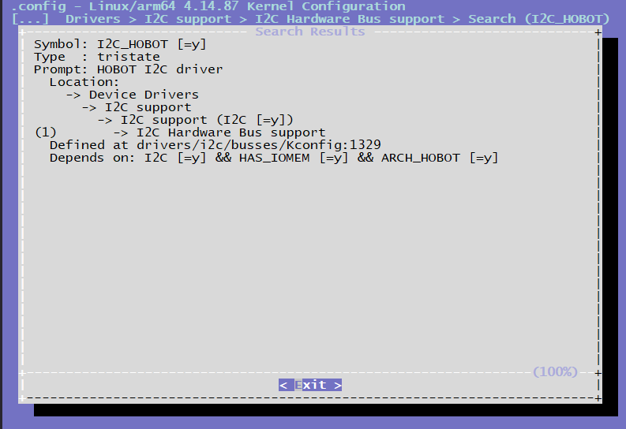

# I2C调试指南

## 前言

X3芯片提供了标准的I2C总线，I2C总线控制器通过串行数据线（SDA）和串行时钟（SCL）线在连接到总线的器件间传递信息。
每个器件都有一个唯一的地址（无论是微控制器——MCU、LCD控制器、存储器或键盘接口），而且都可以作为一个发送器和一个接收器（由器件的功能决定），而且都可以作为一个发送器或接收器（由器件的功能决定）。I2C控制器支持以下功能：

-   兼容I2C与SMBUS总线

-   频率支持100KHz 和 400KHz

-   支持7位和10位寻址模式

## 驱动代码

```bash
drivers/i2c/busses/i2c-hobot.c # I2C驱动代码源文件
inlcude/linux/i2c-hobot.h # I2C驱动代码头文件
```

### 内核配置位置

CONFIG_I2C_HOBOT



### 内核DTS节点配置

X3芯片最大支持6路i2c总线，dts配置如下所示。

```c
/* arch/arm64/boot/dts/hobot/hobot-xj3.dtsi */
i2c0: i2c@0xA5009000 {
    compatible = "hobot,hobot-i2c";
    reg = <0 0xA5009000 0 0x100>;
    interrupt-parent = <&gic>;
    interrupts = <0 38 4>;
    clocks = <&i2c0_mclk>;
    clock-names = "i2c_mclk";
    bus-speed = <400000>;
    resets = <&rst 0x50 10>;
    reset-names = "i2c0";
    status = "disabled";
    pinctrl-names = "default";
    pinctrl-0 = <&i2c0_func>;
};
```

 备注：  
hobot-xj3.dtsi中的节点主要声明一些寄存器、中断的resource，均为soc共有特性，和具体电路板无关，一般情况下不用修改。

## I2C使用

对于I2C的使用说明在Linux Kernel的Documentation/i2c下有详细的说明，本文主要列出X3J3 I2C驱动接口特殊的部分。

### Kernel Space

X3J3 I2C驱动在Kernel Space下提供了可以设置I2C传输频率的接口，使用方法如下：

```c
#include <linux/i2c-hobot.h>
...
{
    struct client_request *client_data = (struct client_request *)(client->adapter->algo_data);
    ...
    client_data->client_req_freq = 100000; //设置I2C传输频率为100k
    ret = i2c_transfer(client->adapter, request, ARRAY_SIZE(request));
    ...
}
```

需要注意的是，如果目标传输频率和默认频率不一致，那么在每次I2C传输前，都需要设置目标频率，即频率更改只对单次传输生效，这样设计也是为了保证某个驱动调用I2C驱动更改频率并传输不会对其它驱动造成影响，有关代码在i2c-hobot.c中的实现如下：

```bash
/* 检查是否需要更改频率，如果是，按照目标频率进行设置 */
static void recal_clk_div(struct hobot_i2c_dev *dev)
{
        u32 clk_freq = 0;
        int temp_div = 0;
        struct client_request *client_req;

        client_req = (struct client_request *)dev->adapter.algo_data;
        clk_freq = clk_get_rate(dev->clk);
        if (client_req->client_req_freq != 0) {
                temp_div = DIV_ROUND_UP(clk_freq, client_req->client_req_freq) - 1;
        } else {
        temp_div = DIV_ROUND_UP(clk_freq, dev->default_trans_freq) - 1;
        }
        dev->clkdiv = DIV_ROUND_UP(temp_div, 8) - 1;
        if (dev->clkdiv > I2C_MAX_DIV) {
                dev_warn(dev->dev, "clkdiv too large, set to 255");
                dev->clkdiv = I2C_MAX_DIV;
        }
}

/* reset I2C 频率为默认频率 */
static void reset_client_freq(struct hobot_i2c_dev *dev)
{
        struct client_request *client_req;

        client_req = (struct client_request *)dev->adapter.algo_data;
        client_req->client_req_freq = 0;
}

/* I2C master_xfer 函数 */
static int hobot_i2c_xfer(struct i2c_adapter *adap, struct i2c_msg msgs[], int num)
{
    ...
    recal_clk_div(dev);
    ... /* I2C transfer */
    reset_client_freq(dev);
    ...
}
```

### User Space

通常，I2C设备由内核驱动程序控制，但也可以从用户态访问总线上的所有设备，通过/dev/i2c-%d接口来访问，Kernel下面的Documentation/i2c/dev-interface文档里有详细的介绍。

#### 频率设置

查看i2C-N的频率,以i2c-0为例

```bash
root@x3dvbx3-hynix1G-2666:~# cat /sys/bus/i2c/devices/i2c-0/speed
400000
```

设置i2c-N的频率，以i2c-0为例

```bash
root@x3dvbx3-hynix1G-2666:~# echo 100000 > /sys/bus/i2c/devices/i2c-0/speed
root@x3dvbx3-hynix1G-2666:~# cat /sys/bus/i2c/devices/i2c-0/speed
100000
```

和Kernel Space下设置I2C频率只针对单次传输有效不同，User Space下设置I2C频率是持久有效的，谨慎使用！

#### I2c-tools

i2c-tools是一套开源工具，该工具已经被交叉编译并包含在在X3J3 系统软件的rootfs中，客户可以直接使用：

-   i2cdetect — 用来列举I2C bus及该bus上的所有设备
-   i2cdump — 显示i2c设备的所有register值
-   i2cget — 读取i2c设备某个register的值
-   i2cset — 写入i2c设备某个register的值
-   i2ctransfer — 可以读、写i2c设备某个或者多个register的值
