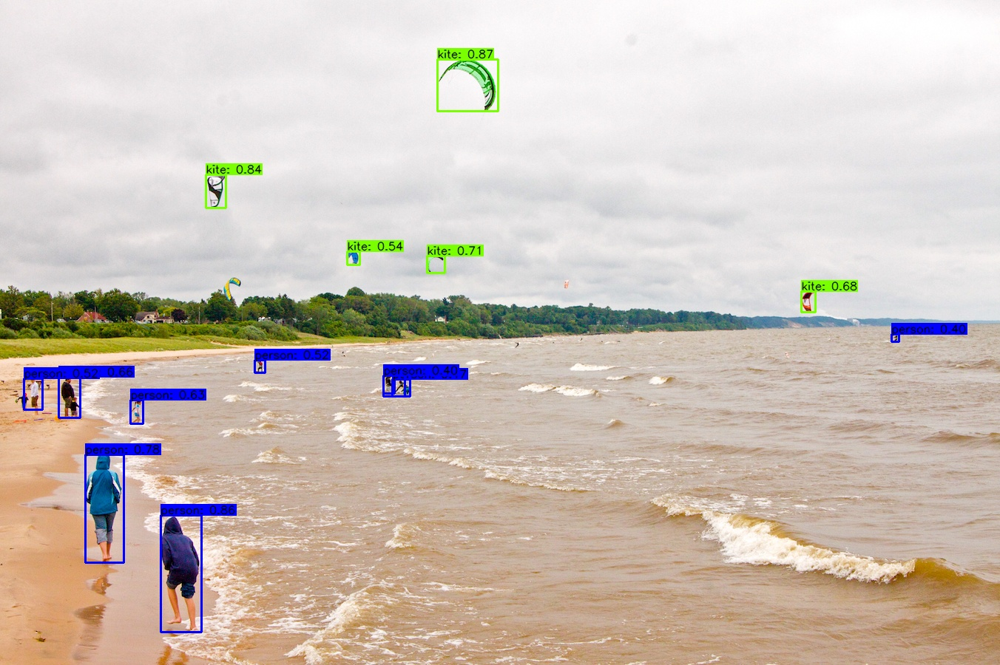
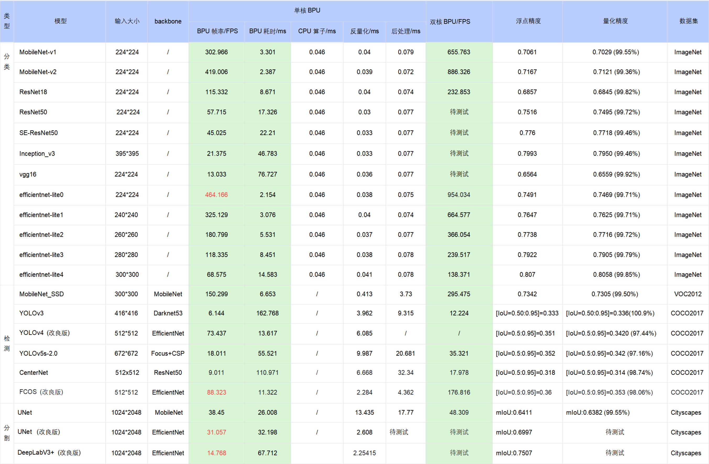

# 9.2 入门指南

## 概述


本指南用于介绍地平线算法工具链中训练后量化PTQ方法的使用流程，若您是第一次使用地平线算法工具链的用户，建议您根据本指南章节步骤进行学习；若您已完成入门指南章节内容的学习，下一步可以参考本指南的[**快速体验**](#quick_experiments)章节步骤来进行私有模型的模型转换及上板运行；
如果需要了解地平线算法工具链的更多内容，请跳转至[**进阶指南**](./intermediate) 章节。


## 环境安装{#env_install}


本章节主要介绍使用地平线算法工具链前必须的环境准备工作。


**硬件环境**

为了顺利地使用地平线算法工具链，地平线建议您选择的开发机应满足以下要求：


  | 硬件/操作系统 | 要求                                 |
  |---------------|--------------------------------------|
  | CPU           | CPU I3以上或者同级别E3/E5的处理器    |
  | 内存          | 16G或以上级别                        |
  | GPU(可选)     | CUDA11.6、驱动版本Linux:>= 510.39.01*<br/>适配显卡包括但不限于：<br/>1)GeForce RTX 3090<br/>2)GeForce RTX 2080 Ti<br/>3)NVIDIA TITAN V<br/>4)Tesla V100S-PCIE-32GB              
  | 系统          | Ubuntu 20.04                        |


**开发机部署**

:::caution 注意

  在进行模型转换前，请确保已在开发机的Ubuntu或Centos系统中安装完成支持 Python 3.8.x 版本的 ``Anaconda3`` 环境。  
:::

- 1.开发机中执行如下命令，获取模型转换资料包：
```bash
    wget -c ftp://xj3ftp@vrftp.horizon.ai/ai_toolchain/ai_toolchain.tar.gz --ftp-password=xj3ftp@123$%

    wget -c ftp://xj3ftp@vrftp.horizon.ai/model_convert_sample/yolov5s_v2.0.tar.gz --ftp-password=xj3ftp@123$%
```

:::tip 小技巧
  1. 若需更多公版模型转换示例，可执行命令： ``wget -c ftp://xj3ftp@vrftp.horizon.ai/model_convert_sample/horizon_model_convert_sample.tar.gz --ftp-password=xj3ftp@123$%`` 获取。
  2. 地平线同时提供有支持模型转换的Docker镜像，若需使用Docker环境，请阅读 [**进阶指南-使用docker环境**](./intermediate/environment_config#使用docker环境) 章节。
:::

- 2.创建模型转换环境：
```bash
    //horizon_bpu 为环境名，可自行设置

    conda create -n horizon_bpu python=3.8 -y   
```

- 3.进入模型转换环境：
```bash
    // horizon_bpu 为上文创建python环境名，  conda环境命令会根据不同的操作系统有所差异，以下两条命令请选择其中能进入conda模型转换环境的命令来使用

    source activate horizon_bpu 或 conda activate horizon_bpu  
```

- 4.解压模型转换环境和示例模型安装包并进行相关依赖的安装：
```bash
    tar -xvf yolov5s_v2.0.tar.gz

    tar -xvf ai_toolchain.tar.gz

    pip install ai_toolchain/h* -i https://mirrors.aliyun.com/pypi/simple

    pip install pycocotools -i https://mirrors.aliyun.com/pypi/simple
```


在顺利完成安装后，您可以键入 hb_mapper --help 命令验证是否可以正常得到帮助信息，若打印如下信息，说明环境已安装完成：
```bash
    hb_mapper --help
    Usage: hb_mapper [OPTIONS] COMMAND [ARGS]...

      hb_mapper is an offline model transform tool provided by horizon.

    Options:
      --version   Show the version and exit.
      -h, --help  Show this message and exit.

    Commands:
      checker    check whether the model meet the requirements.
      infer      inference and dump output feature as float vector.
      makertbin  transform caffe model to quantization model, generate runtime...
```

:::tip 小技巧

  后续进行模型转换时，请首先使用命令 ``source activate horizon_bpu`` 或 ``conda activate horizon_bpu`` 进入模型转换环境!

  地平线算法工具链环境安装包整体大小 ``200M`` 左右，下载安装包和安装依赖包受网络速率影响，整个安装过程耗时大约20分钟左右，请您耐心等候安装完成。
:::

## 快速体验{#quick_experiments}

本章节中，我们为您介绍地平线算法工具链PTQ方案的基本使用流程，便于您实现快速上手。 这里我们以 **RDK X3** 开发板上运行的 yolov5s 模型为例，为您进行使用演示，地平线算法工具链PTQ方案的更多详细内容，请阅读 [**进阶指南-PTQ原理及步骤详解**](/toolchain_development/intermediate/ptq_process) 章节。
:::tip 小技巧
  若要转换RDK Ultra支持的模型，请将以下章节步骤中的``0x_xx_X3.sh``脚本命令替换为 ``0x_xx_Ultra.sh`` 脚本命令进行模型转换即可。
:::

### 开发环境准备

若未准备开发环境，请参考 [**环境安装**](#env_install) 章节进行环境安装。

### 模型准备

若开发环境已准备完成，请使用命令：``source activate horizon_bpu`` 或 ``conda activate horizon_bpu`` 进入开发机模型转换环境。

执行以下命令，检查yolov5s浮点模型是否存在：

```bash
    ls -l yolov5s_v2.0/04_detection/03_yolov5s/mapper
```

命令执行完毕后，若出现以下日志，说明模型已准备完成：

```bash
    -rwxr-xr-x 1 10488 10501      640 Jul 31 18:35 01_check_Ultra.sh
    -rwxr-xr-x 1 10488 10501      645 Jul 31 18:35 01_check_X3.sh
    -rwxr-xr-x 1 10488 10501      661 Jul 31 18:24 02_preprocess.sh
    -rwxr-xr-x 1 10488 10501      609 Jul 31 18:34 03_build_Ultra.sh
    -rwxr-xr-x 1 10488 10501      606 Aug 14 16:49 03_build_X3.sh
    -rwxr-xr-x 1 10488 10501     2752 Mar  9 11:34 README.cn.md
    -rwxr-xr-x 1 10488 10501     1422 Jul 31 18:24 README.md
    -rwxr-xr-x 1 10488 10501 29999538 Mar  9 14:01 YOLOv5s.onnx
    -rwxr-xr-x 1 10488 10501    13039 Jul 31 18:24 postprocess.py
    -rwxr-xr-x 1 10488 10501     3133 Jul 31 18:24 preprocess.py
    -rwxr-xr-x 1 10488 10501    11304 Jul 31 18:34 yolov5s_config_Ultra.yaml
    -rwxr-xr-x 1 10488 10501    11275 Jul 31 18:25 yolov5s_config_X3.yaml

```

若执行命令后，未出现以上日志，请阅读 [**环境安装**](#env_install) 章节下载模型示例包。

### 模型验证

若示例浮点模型已准备完成，根据以下步骤进行模型验证，确保其符合地平线RDK X3处理器的支持约束。

-   进入浮点模型转换示例yolov5s模型目录

```bash
    cd yolov5s_v2.0/04_detection/03_yolov5s/mapper
```

-   模型检查

```bash
    #确认模型结构及算子是否支持，并提供每个算子执行硬件的分配情况（BPU/CPU），RDK X3 执行脚本：01_check_X3.sh ； RDK Ultra 执行脚本：01_check_Ultra.sh
    bash 01_check_X3.sh
```

命令执行完毕后，若出现以下日志，说明模型校验成功

```bash
    2022-12-21 22:29:51,153 INFO [Wed Dec 21 22:29:51 2022] End to Horizon NN Model Convert.
    2022-12-21 22:29:51,181 INFO ONNX model output num : 3
    2022-12-21 22:29:51,219 INFO End model checking....
```

### 模型转换

模型检查通过后，根据以下步骤进行模型转换。

-   进行校准数据预处理

```bash
    bash 02_preprocess.sh
```

命令执行完毕后，若出现以下日志并无任何报错，说明数据预处理成功

```bash
    write:./calibration_data_rgb_f32/COCO_val2014_000000181677.rgb
    write:./calibration_data_rgb_f32/COCO_val2014_000000181714.rgb
    write:./calibration_data_rgb_f32/COCO_val2014_000000181739.rgb
```

-   模型转换

```bash
    #转换时所需的配置文件 yolov5s_config_X3.yaml，已存放在03_build_X3.sh脚本同级文件夹下，RDK X3 执行脚本：03_build_X3.sh ； RDK Ultra 执行脚本：03_build_Ultra.sh
    bash 03_build_X3.sh
```

命令执行完毕后，若出现以下日志并无任何报错，说明模型转换成功

```bash
    2022-12-21 22:36:48,087 INFO Convert to runtime bin file sucessfully!
    2022-12-21 22:36:48,087 INFO End Model Convert
```

模型转换完成后，会在 ``model_output`` 文件夹下保存模型文件和静态性能评估文件。

-   torch-jit-export_subgraph_0.html        # 静态性能评估文件（可读性更好）
-   torch-jit-export_subgraph_0.json        # 静态性能评估文件
-   hb_model_modifier.log                   # 模型转换步骤生成日志信息
-   cache.json                              # 缓存文件（RDK Ultra 优化等级optimize_level配置为O3场景下会自动生成）
-   yolov5s_672x672_nv12.bin     # 用于在地平线处理器上加载运行的模型
-   yolov5s_672x672_nv12_calibrated_model.onnx      # 中间过程模型文件，可用于后续模型的精度校验
-   yolov5s_672x672_nv12_optimized_float_model.onnx # 中间过程模型文件，可用于后续模型的精度校验
-   yolov5s_672x672_nv12_original_float_model.onnx # 中间过程模型文件，可用于后续模型的精度校验
-   yolov5s_672x672_nv12_quantized_model.onnx # 中间过程模型文件，可用于后续模型的精度校验


### 模型上板运行

**注意事项**：模型上板运行前，请确保已按照 [**安装系统**](../installation/install_os) 章节完成 开发板  端的环境部署。
将 ``yolov5s_672x672_nv12.bin`` 定点模型拷贝 **替换** 至开发板的 `/app/pydev_demo/models` 目录下，调用以下命令运行

```bash
    cd /app/pydev_demo/07_yolov5_sample/
    sudo python3 ./test_yolov5.py
```

运行成功后，会输出图像的分割结果，并且dump出分割效果图: result.jpg

```bash
    ......
    detected item num:  15
    person is in the picture with confidence:0.8555
    person is in the picture with confidence:0.7774
    person is in the picture with confidence:0.6599
    person is in the picture with confidence:0.6310
    person is in the picture with confidence:0.6091
    person is in the picture with confidence:0.5242
    person is in the picture with confidence:0.5182
    person is in the picture with confidence:0.4737
    person is in the picture with confidence:0.4037
    person is in the picture with confidence:0.4023
    kite is in the picture with confidence:0.8651
    kite is in the picture with confidence:0.8428
    kite is in the picture with confidence:0.7063
    kite is in the picture with confidence:0.6806
    kite is in the picture with confidence:0.5446
    ......
```



常用API示例，请参考 [**yolov5目标检测算法**](/python_development/pydev_dnn_demo/static_image#detection_yolov5) 章节内容。

更多模型推理API使用说明，请参考 [**Python开发指南-模型推理接口使用说明**](../python_development/pydev_dnn_api) 和 [**C/C++开发指南-模型推理接口使用说明**](../clang_development/cdev_dnn_api) 章节内容。


### 公版模型性能精度指标

下表提供了典型深度神经网络模型在地平线 ``RDK X3`` 开发板上的性能、精度指标。



**注意**：

1. 表格中的数据均为在地平线RDK X3开发板的实测结果，测试模型均来自于 [horizon_model_convert_sample](./beginner) 模型示例包；

2. 对于模型示例包中的 BPU/CPU 混合异构模型，单帧的耗时主要由输入量化CPU节点、模型BPU算子、模型CPU算子、输出反量化CPU节点、CPU后处理等模块构成，具体说明如下：

    a. 输入量化CPU节点：完成float32到int8的输入量化操作，该节点只在使用 featuremap 输入的模型中包含。量化耗时与输入 shape 大小成正比

    b. 模型CPU算子：

        ⅰ. 检测模型中未包含 CPU 算子
        
        ⅱ. 分类模型尾部的 Softmax 和 Reshape 为 CPU 算子
        
        ⅲ. 分割模型 DeepLabV3+ 尾部的 Argmax 为 CPU 算子

    c. 输出反量化CPU节点：完成int8到float32的输出反量化操作。量化耗时与输出 shape 大小成正比

    d. 地平线目前支持将模型的 量化/反量化节点手动摘除，由用户自行融入前后处理代码中实现，以减少数据重复遍历的损耗。以 EfficientDet 模型为例，摘除了反量化节点合入后处理，推理性能从 66FPS提高到100FPS

    e. 目前地平线示例模型的后处理均未做针对性的性能优化，您可以根据实际需求采用如近似高效实现等优化手段进行代码级加速

3. 在实际应用中，BPU 和 CPU 可以并发运行，提高整体推理速度。