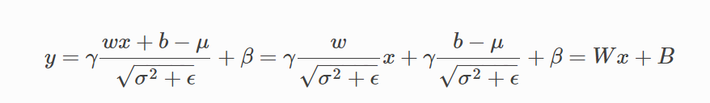

# 深入探索

## 自定义 qconfig

自定义 qconfig 要求用户对具体的处理器限制认知清晰，详细了解训练工具的工作原理，详细了解如何通过 qconfig 体现处理器的限制。量化训练需要一定的训练成本，qconfig 定义出错可能导致模型无法正常收敛、模型无法编译等问题，因此，对于普通用户不推荐自定义 qconfig。

horizon_plugin_pytorch 采用 PyTorch 提供的 partial function 的方法实现 qcofnig 的定义，关于该方法的使用见[**官方说明**](https://github.com/pytorch/pytorch/blob/v2.0.0/torch/ao/quantization/observer.py#L77)，对该方法不了解的用户在继续阅读之前，请先自行学习该方法。

目前，qconfig 处理两类信息：

1. activation 的量化信息
2. weight 的量化信息

### Activation 的量化信息

```python
activation_8bit_fake_quant = FakeQuantize.with_args(
                         observer=MovingAveragePerTensorMinMaxObserver,
                         dtype="qint8",
                         ch_axis=0,
                         averaging_constant=0 # 自定义 observer 的参数
)
```

### Weight 的量化信息

```python
weight_8bit_fake_quant = FakeQuantize.with_args(
                         observer=MovingAveragePerChannelMinMaxObserver,
                         dtype="qint8",
                         ch_axis=0,
                         averaging_constant=1 # 自定义 observer 的参数
)
```

### QConfig

通过 `Qconfig` 把 activation 和 weight 的量化信息封装起来，即可得到 qconfig

```python
qat_8bit_qconfig = QConfig(
    activation=activation_8bit_fake_quant, weight=weight_8bit_fake_quant
)
```

## FX Quantization 原理介绍

阅读此文档前，建议先阅读 [torch.fx — PyTorch documentation](https://pytorch.org/docs/stable/fx.html)，以对 torch 的 FX 机制有初步的了解。

FX 采用符号执行的方式，可以在 `nn.Module` 或 function 的层面对模型建图，从而实现自动化的 fuse 以及其他基于图的优化。

### 量化流程

#### Fuse（可选）

FX 可以感知计算图，所以可以实现自动化的算子融合，用户不再需要手动指定需要融合的算子，直接调用接口即可。

```python
fused_model = horizon.quantization.fuse_fx(model)
```

- 注意 `fuse_fx` 没有 `inplace` 参数，因为内部需要对模型做 symbolic trace 生成一个 `GraphModule`，所以无法做到 inplace 的修改
- `fused_model` 和 `model` 会共享几乎所有属性（包括子模块、算子等），因此在 fuse 之后请不要对 `model` 做任何修改，否则可能影响到 `fused_model`
- 用户不必显式调用 `fuse_fx` 接口，因为后续的 `prepare_qat_fx` 接口内部集成了 fuse 的过程

#### Prepare

用户在调用 `prepare_qat_fx` 接口之前必须根据目标硬件平台设置全局的 march。接口内部会先执行 fuse 过程（即使模型已经 fuse 过了），再将模型中符合条件的算子替换为 `horizon.nn.qat` 中的实现。

- 用户可以根据需要选择合适的 qconfig（Calibtaion 或 QAT，注意两种 qconfig 不能混用）
- 和 `fuse_fx` 类似，此接口不支持 `inplace` 参数，且在 `prepare_qat_fx` 之后请不要对输入的模型做任何修改

```python
# 设置 march **RDK X3** 设置BERNOULLI2， **RDK Ultra** 设置为BAYES。
horizon.march.set_march(horizon.march.March.BAYES)
qat_model = horizon.quantization.prepare_qat_fx(
    model,
    {
        "": horizon.qconfig.default_calib_8bit_fake_quant_qconfig,
        "module_name": {
            "<module_name>": custom_qconfig,
        },
    },)
```

#### Convert

- 和 `fuse_fx` 类似，此接口不支持 `inplace` 参数，且在 `convert_fx` 之后请不要对输入的模型做任何修改

```python
quantized_model = horizon.quantization.convert_fx(qat_model)
```

#### Eager Mode 兼容性

大部分情况下，FX 量化的接口可以直接替换 eager mode 量化的接口（`prepare_qat` -> `prepare_qat_fx`, `convert` -> `convert_fx`），但是不能和 eager mode 的接口混用。部分模型在以下情况下需要对代码结构做一定的修改。

- FX 不支持的操作：torch 的 symbolic trace 支持的操作是有限的，例如不支持将非静态变量作为判断条件、默认不支持 torch 以外的 pkg（如 numpy）等，且未执行到的条件分支将被丢弃
- 不想被 FX 处理的操作：如果模型的前后处理中使用了 torch 的 op，FX 在 trace 时会将他们视为模型的一部分，产生不符合预期的行为（例如将 torch 的某些 function 调用替换为 FloatFunctional）。

以上两种情况，都可以采用 warp 的方法来避免，下面以 RetinaNet 为例进行说明。

```python
from horizon_plugin_pytorch.utils.fx_helper import wrap as fx_warp

class RetinaNet(nn.Module):
    def __init__(
        self,
        backbone: nn.Module,
        neck: Optional[nn.Module] = None,
        head: Optional[nn.Module] = None,
        anchors: Optional[nn.Module] = None,
        targets: Optional[nn.Module] = None,
        post_process: Optional[nn.Module] = None,
        loss_cls: Optional[nn.Module] = None,
        loss_reg: Optional[nn.Module] = None,
    ):
        super(RetinaNet, self).__init__()

        self.backbone = backbone
        self.neck = neck
        self.head = head
        self.anchors = anchors
        self.targets = targets
        self.post_process = post_process
        self.loss_cls = loss_cls
        self.loss_reg = loss_reg

    def rearrange_head_out(self, inputs: List[torch.Tensor], num: int):
        outputs = []
        for t in inputs:
            outputs.append(t.permute(0, 2, 3, 1).reshape(t.shape[0], -1, num))
        return torch.cat(outputs, dim=1)

    def forward(self, data: Dict):
        feat = self.backbone(data["img"])
        feat = self.neck(feat) if self.neck else feat
        cls_scores, bbox_preds = self.head(feat)

        if self.post_process is None:
            return cls_scores, bbox_preds

        # 将不需要建图的操作封装为一个 method 即可，FX 将不再关注 method 内部的逻辑，
        # 仅将它原样保留（method 中调用的 module 仍可被设置 qconfig，被
        # prepare_qat_fx 和 convert_fx 替换）
        return self._post_process( data, feat, cls_scores, bbox_preds)

    @fx_warp()  # fx_wrap 支持直接装饰 class method
    def _post_process(self, data, feat, cls_scores, bbox_preds)
        anchors = self.anchors(feat)

        # 对 self.training 的判断必须封装起来，否则在 symbolic trace 之后，此判断
        # 逻辑会被丢掉
        if self.training:
            cls_scores = self.rearrange_head_out(
                cls_scores, self.head.num_classes
            )
            bbox_preds = self.rearrange_head_out(bbox_preds, 4)
            gt_labels = [
                torch.cat(
                    [data["gt_bboxes"][i], data["gt_classes"][i][:, None] + 1],
                    dim=-1,
                )
                for i in range(len(data["gt_classes"]))
            ]
            gt_labels = [gt_label.float() for gt_label in gt_labels]
            _, labels = self.targets(anchors, gt_labels)
            avg_factor = labels["reg_label_mask"].sum()
            if avg_factor == 0:
                avg_factor += 1
            cls_loss = self.loss_cls(
                pred=cls_scores.sigmoid(),
                target=labels["cls_label"],
                weight=labels["cls_label_mask"],
                avg_factor=avg_factor,
            )
            reg_loss = self.loss_reg(
                pred=bbox_preds,
                target=labels["reg_label"],
                weight=labels["reg_label_mask"],
                avg_factor=avg_factor,
            )
            return {
                "cls_loss": cls_loss,
                "reg_loss": reg_loss,
            }
        else:
            preds = self.post_process(
                anchors,
                cls_scores,
                bbox_preds,
                [torch.tensor(shape) for shape in data["resized_shape"]],
            )
            assert (
                "pred_bboxes" not in data.keys()
            ), "pred_bboxes has been in data.keys()"
            data["pred_bboxes"] = preds
            return data
```


## RGB888 数据部署

### 场景

BPU 中图像金字塔的输出图像是 centered YUV444 的格式，其数据范围是 [-128, 127]，但在训练阶段中，您的训练数据集有可能是 RGB 格式的，因此您需要对训练集的图片格式进行处理，避免出现训练的模型只能接受 RGB 的数据输入而无法正常上板推理的情况。通常，我们推荐您在训练时，在图像预处理阶段将 RGB 格式的图片转为 YUV 格式，与推理时 BPU 的数据流对齐。

由于编译器目前不支持颜色空间转换，用户可以手动插入颜色空间转换节点，从而绕过编译器的限制。

### YUV 格式简介

YUV 一般用来描述模拟电视系统的颜色空间，在 BT.601 中 YUV 主要有两种制式：YUV studio swing（Y：16~235，UV：16~240）和 YUV full swing（YUV：0~255）。

BPU 支持的 YUV 格式是 full swing，因此在调用我们的工具中 YUV 的相关函数时，应确保指定了 full 作为 swing 格式。

### 在训练时对 RGB 输入进行预处理

在训练时，您可以使用 `horizon.functional.rgb2centered_yuv` 或 `horizon.functional.bgr2centered_yuv` 将 RGB 图像转换为 BPU 所支持的 YUV 格式。以 `rgb2centered_yuv` 为例，该函数的定义如下：

```python
def rgb2centered_yuv(input: Tensor, swing: str = "studio") -> Tensor:
    """Convert color space.

    Convert images from RGB format to centered YUV444 BT.601

    Args:
        input: input image in RGB format, ranging 0~255
        swing: "studio" for YUV studio swing (Y: -112~107,
                U, V: -112~112)
                "full" for YUV full swing (Y, U, V: -128~127).
                default is "studio"

    Returns:
        output: centered YUV image
    """
```

函数输入为 RGB 图像，输出为 centered YUV 图像。其中，centered YUV 是指减去了 128 的偏置的 YUV 图像，这是 BPU 图像金字塔输出的标准图像格式。对于 full swing 而言，其范围应为 -128~127。您可以通过 `swing` 参数控制 full 和 studio 的取向。为了和 BPU 数据流格式对齐，**请您将 `swing` 设为 "full"**。

### 在推理时对 YUV 输入进行实时转换

在任何情况下，我们都推荐您使用上述介绍的方案，即在训练时就将 RGB 图像转成 YUV 格式，这样可以避免在推理时引入额外的性能开销和精度损失。但如果您已经使用了 RGB 图像训练了模型，我们也提供了补救措施，通过在推理的时候在模型输入处插入颜色空间转换算子，将输入的 YUV 图像实时转换为 RGB 格式，从而支持 RGB 模型的上板部署，避免您重新训练模型给您带来时间成本和资源上的损失。由于该算子随模型运行在 BPU 上，底层采用定点运算实现，因而不可避免地会引入一定的精度损失，因此仅作为补救方案，请您尽可能按照我们所推荐的方式对数据进行处理。

#### 算子定义

您可以在推理模型的开头（QuantStub 的后面）插入 `horizon.functional.centered_yuv2rgb` 或 `horizon.functional.centered_yuv2bgr` 算子实现该功能。以 `centered_yuv2rgb` 为例，其定义为：

```python
def centered_yuv2rgb(
    input: QTensor,
    swing: str = "studio",
    mean: Union[List[float], Tensor] = (128.0,),
    std: Union[List[float], Tensor] = (128.0,),
    q_scale: Union[float, Tensor] = 1.0 / 128.0,
) -> QTensor:
```

`swing` 为 YUV 的格式，可选项为 "full" 和 "studio"。为了和 BPU 的 YUV 数据格式对齐，**请您将 `swing` 设为 "full"**。
`mean`, `std` 均为您在训练时 RGB 图像所使用的归一化均值、标准差，支持 list 和 torch.Tensor 两种输入类型，支持单通道或三通道的归一化参数。如您的归一化均值为 \[128, 0, -128\] 时，您可以传入一个 \[128., 0., -128.\] 的 list 或 torch.tensor(\[128., 0., -128.\])。
`q_scale` 为您在量化训练阶段所用的 QuantStub 的 scale 数值。支持 float 和 torch.Tensor 两种数据类型。

该算子完成了以下操作：

1. 根据给定的 `swing` 所对应的转换公式将输入图像转换成 RGB 格式
2. 使用给定的 `mean` 和 `std` 对 RGB 图像进行归一化
3. 使用给定的 `q_scale` 对 RGB 图像进行量化

由于该算子已经包括了对 RGB 图像的量化操作，因此在插入这个算子后您需要手动地将模型 QuantStub 的 scale 参数更改为 1。

插入该算子后的部署模型如下图所示：


:::caution 注意

该算子为部署专用算子，请勿在训练阶段使用该算子。
:::

#### 使用方法

在您使用 RGB 图像完成量化训练后，您需要：

1. 获取量化训练时模型 QuantStub 所使用的 scale 值，以及 RGB 图像所使用的归一化参数；
2. 调用 `convert_fx` 接口将 qat 模型转换为 quantized 模型；
3. 在模型的 QuantStub 后面插入 `centered_yuv2rgb` 算子，算子需要传入步骤 1 中所获取的参数；
4. 将 QuantStub 的 `scale` 参数修改成 1。


示例：

```python
import torch
from horizon_plugin_pytorch.quantization import (
    QuantStub,
    prepare_qat_fx,
    convert_fx,
)
from horizon_plugin_pytorch.functional import centered_yuv2rgb
from horizon_plugin_pytorch.quantization.qconfig import (
    default_qat_8bit_fake_quant_qconfig,
)
from horizon_plugin_pytorch import set_march

class Net(torch.nn.Module):
    def __init__(self):
        super().__init__()
        self.quant = QuantStub()
        self.conv = torch.nn.Conv2d(3, 3, 3)
        self.bn = torch.nn.BatchNorm2d(3)
        self.relu = torch.nn.ReLU()

    def forward(self, input):
        x = self.quant(input)
        x = self.conv(x)
        x = self.bn(x)
        x = self.relu(x)
        return x

    def set_qconfig(self):
        self.qconfig = default_qat_8bit_fake_quant_qconfig


data = torch.rand(1, 3, 28, 28)
net = Net()

# 设置 march **RDK X3** 设置为bernoulli2， **RDK Ultra** 设置为bayes。
set_march("bayes")

net.set_qconfig()
qat_net = prepare_qat_fx(net)
qat_net(data)
quantized_net = convert_fx(qat_net)
traced = quantized_net
print("Before centered_yuv2rgb")
traced.graph.print_tabular()

# Replace QuantStub nodes with centered_yuv2rgb
patterns = ["quant"]
for n in traced.graph.nodes:
    if any(n.target == pattern for pattern in patterns):
        with traced.graph.inserting_after(n):
            new_node = traced.graph.call_function(centered_yuv2rgb, (n,), {"swing": "full"})
            n.replace_all_uses_with(new_node)
            new_node.args = (n,)

traced.quant.scale.fill_(1.0)
traced.recompile()
print("\nAfter centered_yuv2rgb")
traced.graph.print_tabular()
```

对比前后 Graph 可以看到修改后的图中插入了颜色空间转换节点：

```sh
Before centered_yuv2rgb
opcode       name     target    args        kwargs
-----------  -------  --------  ----------  --------
placeholder  input_1  input     ()          {}
call_module  quant    quant     (input_1,)  {}
call_module  conv     conv      (quant,)    {}
output       output   output    (conv,)     {}

After centered_yuv2rgb
opcode         name              target                                         args                 kwargs
-------------  ----------------  ---------------------------------------------  -------------------  -----------------
placeholder    input_1           input                                          ()                   {}
call_module    quant             quant                                          (input_1,)           {}
call_function  centered_yuv2rgb  <function centered_yuv2rgb at 0x7fa1c2b48040>  (quant,)             {'swing': 'full'}
call_module    conv              conv                                           (centered_yuv2rgb,)  {}
output         output            output                                         (conv,)              {}
```

## 模型分段部署

### 场景

在一些场景下，用户可能存在将作为一个整体训练的模型拆分成多段进行上板部署的需求。例如对于下图的两阶段检测模型，若 DPP 需要在 CPU 上执行，DPP 的输出（roi）作为 RoiAlign 的输入，则用户需要按虚线框的标注将模型拆分为 Stage1 和 Stage2，分开编译上板。上板运行时，backbone 输出的定点数据直接作为 RoiAlign 的输入。



### 方法



1. 模型修改：如上图所示，在正常可以进行量化训练的模型基础上，用户需要在 prepare_qat 前在模型分段的分界点后插入 QuantStub，注意若使用了 horizon_plugin_pytorch.quantization.QuantStub，必须设置 scale = None。

2. QAT 训练：正常作为一个整体对修改后的模型进行量化感知训练，插入的 QuantStub 会将 Stage2 模型输入数据的 scale 记录在 buffer 中

3. 转定点：正常作为一个整体使用 convert 接口将训练好的 QAT 模型转为定点

4. 拆分和编译：将模型按照上板后的形态进行拆分，对拆分出的多段模型分别进行 trace 和编译。需要注意的是，虽然在训练时 Stage2 的输入为量化数据，但是在对 Stage2 做 trace 时的 example_input 依然需要是浮点的形式，Stage2 中插入的 QuantStub 会负责给数据配置正确的 scale 并进行量化。


## 算子融合{#op_fusion}

训练工具支持的算子融合可分为两大类：1. 吸收 BN；2. 融合 Add、ReLU(6)

### 吸收 BN

吸收 `BN` 的目的是为了减少模型的计算量。因为 `BN` 是线性变换过程，因此，当 `BN` 和 `Conv` 一起出现的时候，可以把 `BN` 的参数吸收到 `Conv` 的参数中，从而在部署的模型中消除 `BN` 的计算。

吸收的计算过程如下：



通过吸收 `BN` ，可以把 `Conv2d + BN2d` 简化为 `Conv2d`



### 融合 Add、ReLU(6)

和 CUDA Kernel Fusion 中将 CUDA Kernel 融合以提高计算速度不同，训练工具支持的融合更加偏重量化层面

BPU 硬件针对常见的模型基本结构做了优化，在计算 `Conv -> Add -> ReLU` 这种算子组合时，可使算子间的数据传递保留高精度的状态，提高模型整体的数值精度。因此在对模型进行量化时，我们可以将 `Conv -> Add -> ReLU` 视为一个整体

由于训练工具对模型进行量化改造时以 `torch.nn.Module` 为单位，为了在量化时将 `Conv -> Add -> ReLU` 视为一个整体，需要将它们合并为一个 `Module`

算子融合除了可以使中间结果保留高精度状态之外，也可以省去将中间结果转化为低精度表示的过程，因此执行速度和不融合相比也会更快

*（由于算子融合既可以提高模型精度，又可以提高模型速度，一般应该对所有可融合的部分进行融合）*

### 实现原理

得益于 FX 可以获取计算图的优势，训练工具可以自动化地对模型的计算图进行分析，根据预定义的 fusion pattern 对可融合部分进行匹配，并通过 submodule 替换实现融合的操作。下面举例进行说明

*（吸收 BN 和融合 Add、ReLU(6) 可以通过相同的机制完成，因此在融合时不需要进行区分）*

```python
import torch
from torch import nn
from torch.quantization import DeQuantStub
from horizon_plugin_pytorch.quantization import QuantStub
from horizon_plugin_pytorch.quantization import fuse_fx


class ModelForFusion(torch.nn.Module):
    def __init__(
        self,
    ):
        super(ModelForFusion, self).__init__()
        self.quantx = QuantStub()
        self.quanty = QuantStub()
        self.conv = nn.Conv2d(3, 3, 3)
        self.bn = nn.BatchNorm2d(3)
        self.relu = nn.ReLU()
        self.dequant = DeQuantStub()

    def forward(self, x, y):
        x = self.quantx(x)
        y = self.quanty(y)
        x = self.conv(x)
        x = self.bn(x)
        x = x + y
        x = self.relu(x)
        x = self.dequant(x)

        return x


float_model = ModelForFusion()
fused_model = fuse_fx(float_model)

print(fused_model)
"""
ModelForFusion(
  (quantx): QuantStub()
  (quanty): QuantStub()
  (conv): Identity()
  (bn): Identity()
  (relu): Identity()
  (dequant): DeQuantStub()
  (_generated_add_0): ConvAddReLU2d(
    (conv): Conv2d(3, 3, kernel_size=(3, 3), stride=(1, 1))
    (relu): ReLU()
  )
)


def forward(self, x, y):
    quantx = self.quantx(x);  x = None
    quanty = self.quanty(y);  y = None
    _generated_add_0 = self._generated_add_0
    add_1 = self._generated_add_0(quantx, quanty);  quantx = quanty = None
    dequant = self.dequant(add_1);  add_1 = None
    return dequant
"""
```

可以看到，对模型执行算子融合操作后，BN 被吸收进 Conv 中，且 Conv、Add、ReLU 被融合进一个 Module 中（`_generated_add_0`）。原本的 submodule 被替换为 `Identity`，且不在 `forward` 代码中调用

*（FX 自动地将模型中 `x = x + y` 的加号替换为了名为 `_generated_add_0` 的 `Module` 形式，以支持算子融合和量化的相关操作）*

### 可以融合的算子

目前支持的可融合的算子组合见以下函数定义

```python
import operator
import torch
from torch import nn
from horizon_plugin_pytorch import nn as horizon_nn


def register_fusion_patterns():
    convs = (
        nn.Conv2d,
        nn.ConvTranspose2d,
        nn.Conv3d,
        nn.Linear,
    )
    bns = (nn.BatchNorm1d, nn.BatchNorm2d, nn.BatchNorm3d, nn.SyncBatchNorm)
    adds = (
        nn.quantized.FloatFunctional.add,
        horizon_nn.quantized.FloatFunctional.add,
        torch.add,
        operator.add,  # 即代码中使用的加号
    )
    relus = (nn.ReLU, nn.ReLU6, nn.functional.relu, nn.functional.relu6)

    for conv in convs:
        for bn in bns:
            for add in adds:
                for relu in relus:
                    # conv bn
                    register_fusion_pattern((bn, conv))(ConvBNAddReLUFusion)

                    # conv relu
                    register_fusion_pattern((relu, conv))(ConvBNAddReLUFusion)

                    # conv add
                    register_fusion_pattern((add, conv, MatchAllNode))(
                        ConvBNAddReLUFusion
                    )  # conv 的输出作为 add 的第一个输入
                    register_fusion_pattern((add, MatchAllNode, conv))(
                        ConvBNAddedReLUFusion
                    )  # conv 的输出作为 add 的第二个输入

                    # conv bn relu
                    register_fusion_pattern((relu, (bn, conv)))(
                        ConvBNAddReLUFusion
                    )

                    # conv bn add
                    register_fusion_pattern((add, (bn, conv), MatchAllNode))(
                        ConvBNAddReLUFusion
                    )
                    register_fusion_pattern((add, MatchAllNode, (bn, conv)))(
                        ConvBNAddedReLUFusion
                    )

                    # conv add relu
                    register_fusion_pattern((relu, (add, conv, MatchAllNode)))(
                        ConvBNAddReLUFusion
                    )
                    register_fusion_pattern((relu, (add, MatchAllNode, conv)))(
                        ConvBNAddedReLUFusion
                    )

                    # conv bn add relu
                    register_fusion_pattern(
                        (relu, (add, (bn, conv), MatchAllNode))
                    )(ConvBNAddReLUFusion)
                    register_fusion_pattern(
                        (relu, (add, MatchAllNode, (bn, conv)))
                    )(ConvBNAddedReLUFusion)
```

