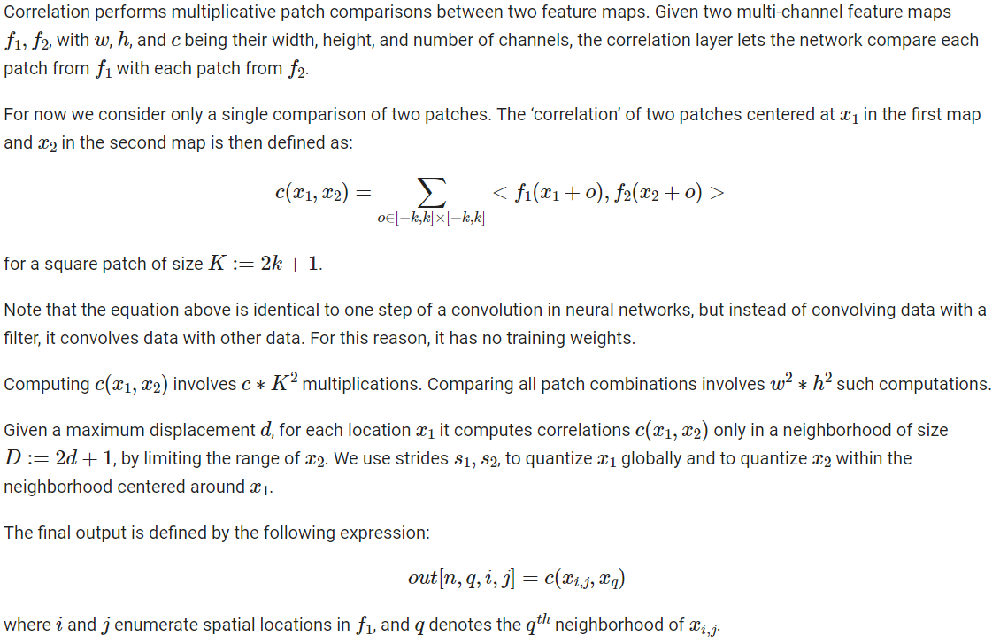

# API手册


## March

```python
class horizon_plugin_pytorch.march.March
```

BPU platform.

- **BAYES**: Bayes platform

- **BERNOULLI2**: Bernoulli2 platform


## qconfig

```python
horizon_plugin_pytorch.quantization.get_default_qconfig(activation_fake_quant: Optional[str] = 'fake_quant', weight_fake_quant: Optional[str] = 'fake_quant', activation_observer: Optional[str] = 'min_max', weight_observer: Optional[str] = 'min_max', activation_qkwargs: Optional[Dict] = None, weight_qkwargs: Optional[Dict] = None)

```

Get default qconfig.

**参数**

- **activation_fake_quant** – FakeQuantize type of activation, default is fake_quant. Avaliable items are fake_quant, lsq, pact.

- **weight_fake_quant** – FakeQuantize type of weight, default is fake_quant. Avaliable items are fake_quant, lsq and pact.

- **activation_observer** – Observer type of activation, default is min_max. Avaliable items are min_max, fixed_scale, clip, percentile, clip_std, mse, kl.

- **weight_observer** – Observer type of weight, default is min_max. Avaliable items are min_max, fixed_scale, clip, percentile, clip_std, mse.

- **activation_qkwargs** – A dict contain activation Observer type, args of activation FakeQuantize and args of activation Observer.

- **weight_qkwargs** – A dict contain weight Observer type, args of weight FakeQuantize and args of weight Observer.

### qconfig 定义示例

- **RDK X3** 使用示例如下：

```python

default_qat_8bit_fake_quant_qconfig = get_default_qconfig(
    activation_fake_quant="fake_quant",
    weight_fake_quant="fake_quant",
    activation_observer="min_max",
    weight_observer="min_max",
    activation_qkwargs=None,
    weight_qkwargs={"qscheme": torch.per_channel_symmetric, "ch_axis": 0,},
    )

default_qat_out_8bit_fake_quant_qconfig = get_default_qconfig(
    activation_fake_quant=None,
    weight_fake_quant="fake_quant",
    activation_observer=None,
    weight_observer="min_max",
    activation_qkwargs=None,
    weight_qkwargs={"qscheme": torch.per_channel_symmetric, "ch_axis": 0,},
    )

default_calib_8bit_fake_quant_qconfig = get_default_qconfig(
    activation_fake_quant="fake_quant",
    weight_fake_quant="fake_quant",
    activation_observer="percentile",
    weight_observer="min_max",
    activation_qkwargs=None,
    weight_qkwargs={"qscheme": torch.per_channel_symmetric, "ch_axis": 0,},
    )

default_calib_out_8bit_fake_quant_qconfig = (
    default_qat_out_8bit_fake_quant_qconfig
    )

default_qat_8bit_lsq_quant_qconfig = get_default_qconfig(
    activation_fake_quant="lsq",
    weight_fake_quant="lsq",
    activation_observer="min_max",
    weight_observer="min_max",
    activation_qkwargs={"use_grad_scaling": True, "averaging_constant": 1.0,},
    weight_qkwargs={"qscheme": torch.per_channel_symmetric, "ch_axis": 0, "use_grad_scaling": True,"averaging_constant": 1.0,},
    )

```


- **RDK Ultra** 使用示例如下：

```python

default_qat_8bit_fake_quant_qconfig = get_default_qconfig(
        activation_fake_quant="fake_quant",
        weight_fake_quant="fake_quant",
        activation_observer="min_max",
        weight_observer="min_max",
        activation_qkwargs=None,
        weight_qkwargs={"qscheme": torch.per_channel_symmetric, "ch_axis": 0,},
        )

    default_qat_8bit_weight_32bit_out_fake_quant_qconfig = get_default_qconfig(
        activation_fake_quant=None,
        weight_fake_quant="fake_quant",
        activation_observer=None,
        weight_observer="min_max",
        activation_qkwargs=None,
        weight_qkwargs={"qscheme": torch.per_channel_symmetric, "ch_axis": 0,},
        )

    default_calib_8bit_fake_quant_qconfig = get_default_qconfig(
        activation_fake_quant="fake_quant",
        weight_fake_quant="fake_quant",
        activation_observer="percentile",
        weight_observer="min_max",
        activation_qkwargs=None,
        weight_qkwargs={"qscheme": torch.per_channel_symmetric, "ch_axis": 0,},
        )

    default_calib_8bit_weight_32bit_out_fake_quant_qconfig = (
        default_qat_out_8bit_fake_quant_qconfig
        )

    default_qat_8bit_weight_16bit_act_fake_quant_qconfig = get_default_qconfig(
        activation_fake_quant="fake_quant",
        weight_fake_quant="fake_quant",
        activation_observer="min_max",
        weight_observer="min_max",
        activation_qkwargs={"dtype": qint16,},
        weight_qkwargs={"qscheme": torch.per_channel_symmetric, "ch_axis": 0,},
    )

    default_calib_8bit_weight_16bit_act_fake_quant_qconfig = get_default_qconfig(
        activation_fake_quant="fake_quant",
        weight_fake_quant="fake_quant",
        activation_observer="percentile",
        weight_observer="min_max",
        activation_qkwargs={"dtype": qint16,},
        weight_qkwargs={"qscheme": torch.per_channel_symmetric, "ch_axis": 0,},
    )

```

## 伪量化算子

```python
class horizon_plugin_pytorch.quantization.FakeQuantize(observer: type = <class 'horizon_plugin_pytorch.quantization.observer.MovingAverageMinMaxObserver'>, saturate: bool = None, in_place: bool = False, compat_mask: bool = True, channel_len: int = 1, **observer_kwargs)
```

Simulate the quantize and dequantize operations in training time.

The output of this module is given by

- x_out = (clamp(round(x/scale + zero_point), quant_min, quant_max)-zero_point)*scale # noqa

- scale defines the scale factor used for quantization.

- zero_point specifies the quantized value to which 0 in floating point maps to

- quant_min specifies the minimum allowable quantized value.

- quant_max specifies the maximum allowable quantized value.

- fake_quant_enabled controls the application of fake quantization on tensors, note that statistics can still be updated.

- observer_enabled controls statistics collection on tensors

- dtype specifies the quantized dtype that is being emulated with fake-quantization, the allowable values is qint8 and qint16. The values of quant_min and quant_max should be chosen to be consistent with the dtype

**参数**

- **observer** – Module for observing statistics on input tensors and calculating scale and zero-point.

- **saturate** – Whether zero out the grad for value out of quanti range.

- **in_place** – Whether use in place fake quantize.

- **compat_mask** – Whether pack the bool mask into bitfield when saturate = True.

- **channel_len** – Size of data at channel dim.

- **observer_kwargs** – Arguments for the observer module

```python
observer
```

User provided module that collects statistics on the input tensor and provides a method to calculate scale and zero-point.

```python
extra_repr()
```

Set the extra representation of the module

To print customized extra information, you should re-implement this method in your own modules. Both single-line and multi-line strings are acceptable.

```python
forward(x)
```

Defines the computation performed at every call.

Should be overridden by all subclasses.

:::info 注解

Although the recipe for forward pass needs to be defined within this function, one should call the Module instance afterwards instead of this since the former takes care of running the registered hooks while the latter silently ignores them.
:::

```python
set_qparams(scale: Union[torch.Tensor, Sequence, float], zero_point: Optional[Union[torch.Tensor, Sequence, int]] = None)
```

Set qparams, default symmetric.

```python
classmethod with_args(**kwargs)
```

Wrapper that allows creation of class factories.

This can be useful when there is a need to create classes with the same constructor arguments, but different instances. Can be used in conjunction with _callable_args

Example:

```python
>>> # xdoctest: +SKIP("Undefined vars")
>>> Foo.with_args = classmethod(_with_args)
>>> foo_builder = Foo.with_args(a=3, b=4).with_args(answer=42)
>>> foo_instance1 = foo_builder()
>>> foo_instance2 = foo_builder()
>>> id(foo_instance1) == id(foo_instance2)
False
```


## QAT

```python
horizon_plugin_pytorch.quantization.convert(module, mapping=None, inplace=False, remove_qconfig=True, fast_mode=False)
```

Convert modules.

Convert submodules in input module to a different module according to mapping by calling from_float method on the target module class. And remove qconfig at the end if remove_qconfig is set to True.

**参数**

- **module** – input module

- **mapping** – a dictionary that maps from source module type to target module type, can be overwritten to allow swapping user defined Modules

- **inplace** – carry out model transformations in-place, the original module is mutated

- **fast_mode** – whether to accelerate quantized model forward. If set True, quantized model cannot be compiled

```python
horizon_plugin_pytorch.quantization.convert_fx(graph_module: torch.fx.graph_module.GraphModule, inplace: bool = False, convert_custom_config_dict: Optional[Dict[str, Any]] = None, _remove_qconfig: bool = True, fast_mode: bool = False) → horizon_plugin_pytorch.quantization.fx.graph_module.QuantizedGraphModule
```

Convert a calibrated or trained model to a quantized model.

**参数**

- **graph_module** – A prepared and calibrated/trained model (GraphModule)

- **inplace** – Carry out model transformations in-place, the original module is mutated.

- **convert_custom_config_dict** –

dictionary for custom configurations for convert function:

```python
convert_custom_config_dict = {
    # We automativally preserve all attributes, this option is
    # just in case and not likely to be used.
    "preserved_attributes": ["preserved_attr"],
}
```

- **_remove_qconfig** – Option to remove the qconfig attributes in the model after convert. for internal use only.

- **fast_mode** – whether to accelerate quantized model forward. If set True, quantized model cannot be compiled.

**返回**

A quantized model (GraphModule)

Example: convert fx example:

```python
# prepared_model: the model after prepare_fx/prepare_qat_fx and
# calibration/training
quantized_model = convert_fx(prepared_model)
```

```python
horizon_plugin_pytorch.quantization.fuse_fx(model: torch.nn.modules.module.Module, fuse_custom_config_dict: Optional[Dict[str, Any]] = None) → horizon_plugin_pytorch.quantization.fx.graph_module.GraphModuleWithAttr
```

Fuse modules like conv+add+bn+relu etc.

Fusion rules are defined in horizon_plugin_pytorch.quantization.fx.fusion_pattern.py

**参数**

- **model** – a torch.nn.Module model

- **fuse_custom_config_dict** –

Dictionary for custom configurations for fuse_fx, e.g.

```python
fuse_custom_config_dict = {
    # We automativally preserve all attributes, this option is
    # just in case and not likely to be used.
    "preserved_attributes": ["preserved_attr"],
}
```

Example: fuse_fx example:

```python
from torch.quantization import fuse_fx
m = fuse_fx(m)
```

```python
horizon_plugin_pytorch.quantization.fuse_known_modules(mod_list, is_qat=False, additional_fuser_method_mapping=None)
```

Fuse modules.

Return a list of modules that fuses the operations specified in the input module list.

Fuses only the following sequence of modules: conv, bn; conv, bn, relu; conv, relu; conv, bn, add; conv, bn, add, relu; conv, add; conv, add, relu; linear, bn; linear, bn, relu; linear, relu; linear, bn, add; linear, bn, add, relu; linear, add; linear, add, relu. For these sequences, the first element in the output module list performs the fused operation. The rest of the elements are set to nn.Identity()

```python
horizon_plugin_pytorch.quantization.fuse_modules(model, modules_to_fuse, inplace=False, fuser_func=<function fuse_known_modules>, fuse_custom_config_dict=None)
```

Fuses a list of modules into a single module.

Fuses only the following sequence of modules: conv, bn; conv, bn, relu; conv, relu; conv, bn, add; conv, bn, add, relu; conv, add; conv, add, relu; linear, bn; linear, bn, relu; linear, relu; linear, bn, add; linear, bn, add, relu; linear, add; linear, add, relu. For these sequences, the first element in the output module list performs the fused operation. The rest of the elements are set to nn.Identity()

**参数**

- **model** – Model containing the modules to be fused

- **modules_to_fuse** – list of list of module names to fuse. Can also be a list of strings if there is only a single list of modules to fuse.

- **inplace** – bool specifying if fusion happens in place on the model, by default a new model is returned

- **fuser_func** – Function that takes in a list of modules and outputs a list of fused modules of the same length. For example, fuser_func([convModule, BNModule]) returns the list [ConvBNModule, nn.Identity()] Defaults to torch.ao.quantization.fuse_known_modules

- **fuse_custom_config_dict** – custom configuration for fusion

```python
# Example of fuse_custom_config_dict
fuse_custom_config_dict = {
    # Additional fuser_method mapping
    "additional_fuser_method_mapping": {
        (torch.nn.Conv2d, torch.nn.BatchNorm2d): fuse_conv_bn
    },
}
```

**返回**

model with fused modules. A new copy is created if inplace=True.

Examples:

```python
>>> # xdoctest: +SKIP
>>> m = M().eval()
>>> # m is a module containing the sub-modules below
>>> modules_to_fuse = [ ['conv1', 'bn1', 'relu1'],
                      ['submodule.conv', 'submodule.relu']]
>>> fused_m = fuse_modules(
                m, modules_to_fuse)
>>> output = fused_m(input)

>>> m = M().eval()
>>> # Alternately provide a single list of modules to fuse
>>> modules_to_fuse = ['conv1', 'bn1', 'relu1']
>>> fused_m = fuse_modules(
                m, modules_to_fuse)
>>> output = fused_m(input)
```

```python
horizon_plugin_pytorch.quantization.prepare_qat(model: torch.nn.modules.module.Module, mapping: Optional[Dict[Type[torch.nn.modules.module.Module], Type[torch.nn.modules.module.Module]]] = None, inplace: bool = False, optimize_graph: bool = False, hybrid: bool = False, optimize_kwargs: Optional[Dict[str, Tuple]] = None)

```

Prepare qat.

Prepare a copy of the model for quantization-aware training and converts it to quantized version.

Quantization configuration should be assigned preemptively to individual submodules in .qconfig attribute.

**参数**

- **model** – input model to be modified in-place

- **mapping** – dictionary that maps float modules to quantized modules to be replaced.

- **inplace** – carry out model transformations in-place, the original module is mutated

- **optimize_graph** – whether to do some process on origin model for special purpose. Currently only support using torch.fx to fix cat input scale(only used on Bernoulli)

- **hybrid** – whether to generate a hybrid model that some intermediate operation is computed in float. There are some constraints for this functionality now: 1. The hybrid model cannot pass check_model and cannot be compiled. 2. Some quantized operation cannot directly accept input from float operation, user need to manually insert QuantStub.

- **optimize_kwargs** –

a dict for optimize graph with the following format:

```python
optimize_kwargs = {
    # optional, specify which type of optimization to do. Only
    # support "unify_inputs_scale" now
    "opt_types": ("unify_inputs_scale",),

    # optional, modules start with qualified name to optimize
    "module_prefixes": ("backbone.conv",),

    # optional, modules in these types will be optimize
    "module_types": (horizon.nn.qat.conv2d,),

    # optional, functions to optimize
    "functions": (torch.clamp,),

    # optional, methods to optimize. Only support
    # FloatFunctional methods now
    "methods": ("add",),
}
```

```python

horizon_plugin_pytorch.quantization.prepare_qat_fx(model: Union[torch.nn.modules.module.Module, torch.fx.graph_module.GraphModule], qconfig_dict: Optional[Dict[str, Any]] = None, prepare_custom_config_dict: Optional[Dict[str, Any]] = None, optimize_graph: bool = False, hybrid: bool = False, hybrid_dict: Optional[Dict[str, List]] = None) → horizon_plugin_pytorch.quantization.fx.graph_module.ObservedGraphModule
```

Prepare a model for quantization aware training.

**参数**

- **model** – torch.nn.Module model or GraphModule model (maybe from fuse_fx)

- **qconfig_dict** –

qconfig_dict is a dictionary with the following configurations:

```python

qconfig_dict = {
    # optional, global config
    "": qconfig,

    # optional, used for module types
    "module_type": [
        (torch.nn.Conv2d, qconfig),
        ...,
    ],

    # optional, used for module names
    "module_name": [
        ("foo.bar", qconfig)
        ...,
    ],
    # priority (in increasing order):
    #   global, module_type, module_name, module.qconfig
    # qconfig == None means quantization should be
    # skipped for anything matching the rule.
    # The qconfig of function or method is the same as the
    # qconfig of its parent module, if it needs to be set
    # separately, please wrap this function as a module.
}
```

- **prepare_custom_config_dict** –

customization configuration dictionary for quantization tool:

```python
prepare_custom_config_dict = {
    # We automativally preserve all attributes, this option is
    # just in case and not likely to be used.
    "preserved_attributes": ["preserved_attr"],
}
```

- **optimize_graph** – whether to do some process on origin model for special purpose. Currently only support using torch.fx to fix cat input scale(only used on Bernoulli)

- **hybrid** – Whether prepare model in hybrid mode. Default value is False and model runs on BPU completely. It should be True if the model is quantized by model convert or contains some CPU ops. In hybrid mode, ops which aren’t supported by BPU and ops which are specified by the user will run on CPU. How to set qconfig: Qconfig in hybrid mode is the same as qconfig in non-hybrid mode. For BPU op, we should ensure the input of this op is quantized, the activation qconfig of its previous non-quantstub op should not be None even if its previous non-quantstub op is a CPU op. How to specify CPU op: Define CPU module_name or module_type in hybrid_dict.

- **hybrid_dict** –

hybrid_dict is a dictionary to define user-specified CPU op:

```python
hybrid_dict = {
    # optional, used for module types
    "module_type": [torch.nn.Conv2d, ...],

    # optional, used for module names
    "module_name": ["foo.bar", ...],
}
# priority (in increasing order): module_type, module_name
# To set a function or method as CPU op, wrap it as a module.
```

**返回**

A GraphModule with fake quant modules (configured by qconfig_dict), ready for quantization aware training

Example: prepare_qat_fx example:

```python

import torch
from horizon_plugin_pytorch.quantization import get_default_qat_qconfig
from horizon_plugin_pytorch.quantization import prepare_qat_fx

qconfig = get_default_qat_qconfig()
def train_loop(model, train_data):
    model.train()
    for image, target in data_loader:
        ...

qconfig_dict = {"": qconfig}
prepared_model = prepare_qat_fx(float_model, qconfig_dict)
# Run QAT training
train_loop(prepared_model, train_loop)
```

Extended tracer and wrap of torch.fx.

This file defines a inherit tracer of torch.fx.Tracer and a extended wrap to allow wrapping of user-defined Module or method, which help users do some optimization of their own module by torch.fx

```python
horizon_plugin_pytorch.utils.fx_helper.wrap(skip_compile: bool = False)
```

Extend torch.fx.warp.

This function can be:
- 1) called or used as a decorator on a string to register a builtin function as a “leaf function”

- 2) called or used as a decorator on a function to register this function as a “leaf function”

- 3) called or used as a decorator on subclass of torch.nn.Module to register this module as a “leaf module”, and register all user defined method in this class as “leaf method”

- 4) called or used as a decorator on a class method to register it as “leaf method”

**参数**

skip_compile – Whether the wrapped part should not be compiled.

**返回**

The actural decorator.

**返回类型**

wrap_inner


## ONNX

```python
horizon_plugin_pytorch.utils.onnx_helper.export_to_onnx(model, args, f, export_params=True, verbose=False, training=<TrainingMode.EVAL: 0>, input_names=None, output_names=None, operator_export_type=<OperatorExportTypes.ONNX_FALLTHROUGH: 3>, opset_version=11, do_constant_folding=True, dynamic_axes=None, keep_initializers_as_inputs=None, custom_opsets=None)
```

Export a (float or qat)model into ONNX format.

**参数**

- **model** (torch.nn.Module/torch.jit.ScriptModule/ScriptFunction) – the model to be exported.

- **args** (tuple or torch.Tensor) –

    args can be structured either as:

    a. ONLY A TUPLE OF ARGUMENTS:

    ```python
        args = (x, y, z)
    ```

    The tuple should contain model inputs such that model(*args) is a valid invocation of the model. Any non-Tensor arguments will be hard-coded into the exported model; any Tensor arguments will become inputs of the exported model, in the order they occur in the tuple.

    b. A TENSOR:

    ```python
        args = torch.Tensor([1])
    ```

    This is equivalent to a 1-ary tuple of that Tensor.

    c. A TUPLE OF ARGUMENTS ENDING WITH A DICTIONARY OF NAMED ARGUMENTS:

    ```python
        args = (x,
                {'y': input_y,
                'z': input_z})
    ```

    All but the last element of the tuple will be passed as non-keyword arguments, and named arguments will be set from the last element. If a named argument is not present in the dictionary , it is assigned the default value, or None if a default value is not provided.

- **f** – a file-like object or a string containing a file name. A binary protocol buffer will be written to this file.

- **export_params** (bool, default True) – if True, all parameters will be exported.

- **verbose** (bool, default False) – if True, prints a description of the model being exported to stdout, doc_string will be added to graph. doc_string may contaion mapping of module scope to node name in future torch onnx.

- **training** (enum, default TrainingMode.EVAL) –

    if model.training is False and in training mode if model.training is True.

    ``TrainingMode.EVAL``: export the model in inference mode.

    ``TrainingMode.PRESERVE``: export the model in inference mode

    ``TrainingMode.TRAINING``: export the model in training mode. Disables optimizations which might interfere with training.

- **input_names** (list of str, default empty list) – names to assign to the input nodes of the graph, in order.

- **output_names** (list of str, default empty list) – names to assign to the output nodes of the graph, in order.

- **operator_export_type** (enum, default ONNX_FALLTHROUGH) –

    ``OperatorExportTypes.ONNX``: Export all ops as regular ONNX ops (in the default opset domain).

    ``OperatorExportTypes.ONNX_FALLTHROUGH``: Try to convert all ops to standard ONNX ops in the default opset domain.

    ``OperatorExportTypes.ONNX_ATEN``: All ATen ops (in the TorchScript namespace “aten”) are exported as ATen ops.

    ``OperatorExportTypes.ONNX_ATEN_FALLBACK``: Try to export each ATen op (in the TorchScript namespace “aten”) as a regular ONNX op. If we are unable to do so,fall back to exporting an ATen op.

- **opset_version** (int, default 11) – by default we export the model to the opset version of the onnx submodule.

- **do_constant_folding** (bool, default False) – Apply the constant-folding optimization. Constant-folding will replace some of the ops that have all constant inputs with pre-computed constant nodes.

- **dynamic_axes** (dict<str, list(int)/dict<int, str>>, default empty dict) –

    By default the exported model will have the shapes of all input and output tensors set to exactly match those given in args (and example_outputs when that arg is required). To specify axes of tensors as dynamic (i.e. known only at run-time), set dynamic_axes to a dict with schema:

    ``KEY (str)``: an input or output name. Each name must also be provided in input_names or output_names.

    ``VALUE (dict or list)``: If a dict, keys are axis indices and values are axis names. If a list, each element is an axis index.

- **keep_initializers_as_inputs** (bool, default None) – If True, all the initializers (typically corresponding to parameters) in the exported graph will also be added as inputs to the graph. If False, then initializers are not added as inputs to the graph, and only the non-parameter inputs are added as inputs. This may allow for better optimizations (e.g. constant folding) by backends/runtimes.

- **custom_opsets** (dict<str, int>, default empty dict) –

    A dict with schema:

    ``KEY (str)``: opset domain name

    ``VALUE (int)``: opset version

    If a custom opset is referenced by model but not mentioned in this dictionary, the opset version is set to 1.


## TorchScript 模型保存和加载

```python
horizon_plugin_pytorch.jit.load(f, map_location=None, _extra_files=None)
```

Load ScriptModule previously saved with horizon.jit.save.

In addition to loaded plugin version comparsion with current plugin version, this function is same as torch.jit.save.

**参数**

- **f** – a file-like object(has to implement read, readline, tell, and seek), or a string containing a file name

- **map_location** (string or torch.device) – A simplified version of map_location in torch.jit.save used to dynamically remap storages to an alternative set of devices.

- **_extra_files** (dictionary of filename to content) – The extra filenames given in the map would be loaded and their content would be stored in the provided map.

**返回**

A ScriptModule object.

```python
horizon_plugin_pytorch.jit.save(m, f, _extra_files=None)
```

Save ScriptModule.

In addition to plugin version saved, this function is same as torch.jit.save.

**参数**

- **m** – A ScriptModule to save.

- **f** – A file-like object (has to implement write and flush) or a string containing a file name.

- **_extra_files** – Map from filename to contents which will be stored as part of f.


## Horizon 算子

```python
horizon_plugin_pytorch.nn.functional.filter(*inputs: Union[Tuple[torch.Tensor], Tuple[horizon_plugin_pytorch.qtensor.QTensor]], threshold: float, idx_range: Optional[Tuple[int, int]] = None) → List[List[torch.Tensor]]
```

Filter.

The output order is different with bpu, because that the compiler do some optimization and slice input following complex rules, which is hard to be done by plugin.

All inputs are filtered along HW by the max value within a range in channel dim of the first input. Each NCHW input is splited, transposed and flattened to List[Tensor[H * W, C]] first. If input is QTensor, the output will be dequantized.

**参数**

- **inputs** – Data in NCHW format. Each input shold have the same size in N, H, W. The output will be selected according to the first input.

- **threshold** – Threshold, the lower bound of output.

- **idx_range** – The index range of values counted in compare of the first input. Defaults to None which means use all the values.

**返回**

A list with same length of batch size, and each element contains:

- **max_value**: Flattened max value within idx_range in channel dim.

- **max_idx**: Flattened max value index in channel dim.

- **coord**: The original coordinates of the output data in the input data in the shape of [M, (h, w)].

(multi) data: Filtered data in the shape of [M, C].

**返回类型**

Union[List[List[Tensor]], List[List[QTensor]]]

```python
horizon_plugin_pytorch.nn.functional.point_pillars_preprocess(points_list: List[torch.Tensor], pc_range: torch.Tensor, voxel_size: torch.Tensor, max_voxels: int, max_points_per_voxel: int, use_max: bool, norm_range: torch.Tensor, norm_dims: torch.Tensor) → Tuple[torch.Tensor, torch.Tensor]
```

Preprocess PointPillars.

**参数**

- **points_list** – [(M1, ndim), (M2, ndim),…], List of PointCloud data.

- **pc_range** – (6,), indicate voxel range, format: [x_min, y_min, z_min, x_max, y_max, z_max]

- **voxel_size** – (3,), xyz, indicate voxel size.

- **max_voxels** – Indicate maximum voxels.

- **max_points_per_voxel** – Indicate maximum points contained in a voxel.

- **use_max** – Whether to use max_voxels, for deploy should be True.

- **norm_range** – Feature range, like [x_min, y_min, z_min, …, x_max, y_max, z_max, …].

- **norm_dims** – Dims to do normalize.

**返回**

(features, coords), encoded feature and coordinates in (idx, z, y, x) format.

**返回类型**
(Tensor, Tensor)

```python
class horizon_plugin_pytorch.nn.BgrToYuv444(channel_reversal: bool = False)
```

Convert image color format from bgr to yuv444.

**参数**

- **channel_reversal** – Color channel order, set to True when used on RGB input. Defaults to False.

```python
forward(input: torch.Tensor)
```

Forward pass of BgrToYuv444.

```python
class horizon_plugin_pytorch.nn.Correlation(kernel_size: int = 1, max_displacement: int = 1, stride1: int = 1, stride2: int = 1, pad_size: int = 0, is_multiply: bool = True)
```

Perform multiplicative patch comparisons between two feature maps.



**参数**

- **kernel_size** – kernel size for Correlation must be an odd number

- **max_displacement** – Max displacement of Correlation

- **stride1** – stride1 quantize data1 globally

- **stride2** – stride2 quantize data2 within neighborhood centered around data1

- **pad_size** – pad for Correlation

- **is_multiply** – operation type is either multiplication or subduction, only support True now

```python
forward(data1: Union[torch.Tensor, horizon_plugin_pytorch.qtensor.QTensor], data2: Union[torch.Tensor, horizon_plugin_pytorch.qtensor.QTensor]) → torch.Tensor
```

Forward for Horizon Correlation.

**参数**

- **data1** – shape of [N,C,H,W]

- **data2** – shape of [N,C,H,W]

**返回**

output

**返回类型**

Tensor

```python
class horizon_plugin_pytorch.nn.DetectionPostProcess(score_threshold: int = 0, regression_scale: Optional[Tuple[float, float, float, float]] = None, background_class_idx: Optional[int] = None, size_threshold: Optional[float] = None, image_size: Optional[Tuple[int, int]] = None, pre_decode_top_n: Optional[int] = None, post_decode_top_n: Optional[int] = None, iou_threshold: Optional[float] = None, pre_nms_top_n: Optional[int] = None, post_nms_top_n: Optional[int] = None, nms_on_each_level: bool = False, mode: str = 'normal')
```

General post process for object detection models.

Compatible with YOLO, SSD, RetinaNet, Faster-RCNN (RPN & RCNN), etc. Note that this is a float OP, please use after DequantStubs.

**参数**

- **score_threshold** – Filter boxes whose score is lower than this. Defaults to 0.

- **regression_scale** – Scale to be multiplyed to box regressions. Defaults to None.

- **background_class_idx** – Specify the class index to be ignored. Defaults to None.

- **size_threshold** – Filter bixes whose height or width smaller than this. Defaults to None.

- **image_size** – Clip boxes to image sizes. Defaults to None.

- **pre_decode_top_n** – Get top n boxes by objectness (first element in the score vector) before decode. Defaults to None.

- **post_decode_top_n** – Get top n boxes by score after decode. Defaults to None.

- **iou_threshold** – IoU threshold for nms. Defaults to None.

- **pre_nms_top_n** – Get top n boxes by score before nms. Defaults to None.

- **post_nms_top_n** – Get top n boxes by score after nms. Defaults to None.

- **nms_on_each_level** – Whether do nms on each level seperately. Defaults to False.

- **mode** – Only support ‘normal’ and ‘yolo’. If set to ‘yolo’: 1. Box will be filtered by objectness rathen than classification scores. 2. dx, dy in regressions will be treated as absolute offset. 3. Objectness will be multiplyed to classification scores. Defaults to ‘normal’.

```python
forward(boxes: List[torch.Tensor], scores: List[torch.Tensor], regressions: List[torch.Tensor], image_shapes: Optional[torch.Tensor] = None) → Tuple[Tuple[torch.Tensor], Tuple[torch.Tensor], Tuple[torch.Tensor]]
```

Forward pass of DetectionPostProcess.

```python
class horizon_plugin_pytorch.nn.DetectionPostProcessV1(num_classes: int, box_filter_threshold: float, class_offsets: List[int], use_clippings: bool, image_size: Tuple[int, int], nms_threshold: float, pre_nms_top_k: int, post_nms_top_k: int, nms_padding_mode: Optional[str] = None, nms_margin: float = 0.0, use_stable_sort: Optional[bool] = None, bbox_min_hw: Tuple[float, float] = (0, 0))
```

Post process for object detection models. Only supported on bernoulli2.

This operation is implemented on BPU, thus is expected to be faster than cpu implementation. This operation requires input_scale = 1 / 2 ** 4, or a rescale will be applied to the input data. So you can manually set the output scale of previous op (Conv2d for example) to 1 / 2 ** 4 to avoid the rescale and get best performance and accuracy.

Major differences with DetectionPostProcess:

1. Each anchor will generate only one pred bbox totally, but in DetectionPostProcess each anchor will generate one bbox for each class (num_classes bboxes totally).
2. NMS has a margin param, box2 will only be supressed by box1 when box1.score - box2.score > margin (box1.score > box2.score in DetectionPostProcess).
3. A offset can be added to the output class indices ( using class_offsets).

**参数**

- **num_classes** – Class number.

- **box_filter_threshold** – Default threshold to filter box by max score.

- **class_offsets** – Offset to be added to output class index for each branch.

- **use_clippings** – Whether clip box to image size. If input is padded, you can clip box to real content by providing image size.

- **image_size** – Fixed image size in (h, w), set to None if input have different sizes.

- **nms_threshold** – IoU threshold for nms.

- **nms_margin** – Only supress box2 when box1.score - box2.score > nms_margin

- **pre_nms_top_k** – Maximum number of bounding boxes in each image before nms.

- **post_nms_top_k** – Maximum number of output bounding boxes in each image.

- **nms_padding_mode** – The way to pad bbox to match the number of output bounding bouxes to post_nms_top_k, can be None, “pad_zero” or “rollover”.

- **bbox_min_hw** – Minimum height and width of selected bounding boxes.

```python
forward(data: List[torch.Tensor], anchors: List[torch.Tensor], image_sizes: Tuple[int, int] = None) → torch.Tensor
```

Forward pass of DetectionPostProcessV1.

**参数**

- **data** – (N, (4 + num_classes) * anchor_num, H, W)

- **anchors** – (N, anchor_num * 4, H, W)

- **image_sizes** – Defaults to None.

**返回**

list of (bbox (x1, y1, x2, y2), score, class_idx).

**返回类型**

List[Tuple[Tensor, Tensor, Tensor]]

```python
class horizon_plugin_pytorch.nn.PointPillarsScatter(output_shape=None)

forward(voxel_features: torch.Tensor, coords: torch.Tensor, output_shape: Optional[Union[torch.Tensor, list, tuple]] = None) → torch.Tensor
```

Forward of Horizon PointPillarsScatter.

**参数**

- **voxel_features** – [M, …], dimention after M will be flattened.

- **coords** – [M, (n, …, y, x)], only indices on N, H and W are used.

- **output_shape** – Expected output shape. Defaults to None.

**返回**

The NCHW pseudo image.

**返回类型**

Tensor

```python
class horizon_plugin_pytorch.nn.RcnnPostProcess(image_size: Tuple[int, int] = (1024, 1024), nms_threshold: float = 0.3, box_filter_threshold: float = 0.1, num_classes: int = 1, post_nms_top_k: int = 100, delta_mean: List[float] = (0.0, 0.0, 0.0, 0.0), delta_std: List[float] = (1.0, 1.0, 1.0, 1.0))
```

Post Process of RCNN output.

Given bounding boxes and corresponding scores and deltas, decodes bounding boxes and performs NMS. In details, it consists of:

Argmax on multi-class scores

Filter out those belows the given threshold

Non-linear Transformation, convert box deltas to original image coordinates

Bin-sort remaining boxes on score

Apply class-aware NMS and return the firstnms_output_box_num of boxes

**参数**

- **image_size** – a int tuple of (h, w), for fixed image size

- **nms_threshold** – bounding boxes of IOU greater than nms_threshold will be suppressed

- **box_filter_threshold** – bounding boxes of scores less than box_filter_threshold will be discarded

- **num_classes** – total number of classes

- **post_nms_top_k** – number of bounding boxes after NMS in each image

- **delta_mean** – a float list of size 4

- **delta_std** – a float list of size 4

```python
forward(boxes: List[torch.Tensor], scores: torch.Tensor, deltas: torch.Tensor, image_sizes: Optional[torch.Tensor] = None)
```

Forward of RcnnPostProcess.

**参数**

- **boxes** – list of box of shape [box_num, (x1, y1, x2, y2)]. can be Tensor(float), QTensor(float, int)

- **scores** – shape is [num_batch * num_box, num_classes + 1, 1, 1,], dtype is float32

- **deltas** – shape is [num_batch * num_box, (num_classes + 1) * 4, 1, 1,], dtype is float32

- **image_sizes** – shape is [num_batch, 2], dtype is int32, for dynamic image size, can be None. Defaults to None

**返回**

output data in format
[x1, y1, x2, y2, score, class_index], dtype is float32 if the output boxes number is less than post_nms_top_k, they are padded with -1.0

**返回类型**

Tensor[num_batch, post_nms_top_k, 6]

horizon plugin.

```python
horizon_plugin_pytorch.bgr2centered_gray(input: torch.Tensor) → torch.Tensor
```

Convert color space.

Convert images from BGR format to centered gray

**参数**

- **input** – input image in BGR format of shape [N, 3, H, W], ranging 0~255

**返回**

centered gray image of shape [N, 1, H, W], ranging -128~127

**返回类型**

Tensor

```python
horizon_plugin_pytorch.bgr2centered_yuv(input: torch.Tensor, swing: str = 'studio') → torch.Tensor
```

Convert color space.

Convert images from BGR format to centered YUV444 BT.601

**参数**

- **input** – input image in BGR format, ranging 0~255

- **swing** – “studio” for YUV studio swing (Y: -112~107, U, V: -112~112). “full” for YUV full swing (Y, U, V: -128~127). default is “studio”

**返回**

centered YUV image

**返回类型**

Tensor

```python
horizon_plugin_pytorch.bgr2gray(input: torch.Tensor) → torch.Tensor
```

Convert color space.

Convert images from BGR format to gray

**参数**

- **input** – input image in BGR format of shape [N, 3, H, W], ranging 0~255

**返回**

gray image of shape [N, 1, H, W], ranging 0~255

**返回类型**

Tensor

```python
horizon_plugin_pytorch.bgr2rgb(input: torch.Tensor) → torch.Tensor
```

Convert color space.

Convert images from BGR format to RGB

**参数**

- **input** – image in BGR format with shape [N, 3, H, W]

**返回**

image in RGB format with shape [N, 3, H, W]

**返回类型**

Tensor

```python
horizon_plugin_pytorch.bgr2yuv(input: torch.Tensor, swing: str = 'studio') → torch.Tensor
```

Convert color space.

Convert images from BGR format to YUV444 BT.601

**参数**

- **input** – input image in BGR format, ranging 0~255

- **swing** – “studio” for YUV studio swing (Y: 16~235, U, V: 16~240). “full” for YUV full swing (Y, U, V: 0~255). default is “studio”

**返回**

YUV image

**返回类型**

Tensor

```python
horizon_plugin_pytorch.centered_yuv2bgr(input: horizon_plugin_pytorch.qtensor.QTensor, swing: str = 'studio', mean: Union[List[float], torch.Tensor] = (128.0,), std: Union[List[float], torch.Tensor] = (128.0,), q_scale: Union[float, torch.Tensor] = 0.0078125) → horizon_plugin_pytorch.qtensor.QTensor
```

Convert color space.

Convert images from centered YUV444 BT.601 format to transformed and quantized BGR. Only use this operator in the quantized model. Insert it after QuantStub. Pass the scale of QuantStub to the q_scale argument and set scale of QuantStub to 1 afterwards.

**参数**

- **input** – Input images in centered YUV444 BT.601 format, centered by the pyramid with -128.

- **swing** – “studio” for YUV studio swing (Y: -112~107, U, V: -112~112). “full” for YUV full swing (Y, U, V: -128~127). default is “studio”

- **mean** – BGR mean, a list of float, or torch.Tensor, can be a scalar [float], or [float, float, float] for per-channel mean.

- **std** – BGR standard deviation, a list of float, or torch.Tensor, can be a scalar [float], or [float, float, float] for per-channel std.

- **q_scale** – BGR quantization scale.

**返回**

Transformed and quantized image in BGR color, dtype is qint8.

**返回类型**

QTensor

```python
horizon_plugin_pytorch.centered_yuv2rgb(input: horizon_plugin_pytorch.qtensor.QTensor, swing: str = 'studio', mean: Union[List[float], torch.Tensor] = (128.0,), std: Union[List[float], torch.Tensor] = (128.0,), q_scale: Union[float, torch.Tensor] = 0.0078125) → horizon_plugin_pytorch.qtensor.QTensor
```

Convert color space.

Convert images from centered YUV444 BT.601 format to transformed and quantized RGB. Only use this operator in the quantized model. Insert it after QuantStub. Pass the scale of QuantStub to the q_scale argument and set scale of QuantStub to 1 afterwards.

**参数**

- **input** – Input images in centered YUV444 BT.601 format, centered by the pyramid with -128.

- **swing** – “studio” for YUV studio swing (Y: -112~107, U, V: -112~112). “full” for YUV full swing (Y, U, V: -128~127). default is “studio”

- **mean** – RGB mean, a list of float, or torch.Tensor, can be a scalar [float], or [float, float, float] for per-channel mean.

- **std** – RGB standard deviation, a list of float, or torch.Tensor, can be a scalar [float], or [float, float, float] for per-channel std.

- **q_scale** – RGB quantization scale.

**返回**

Transformed and quantized image in RGB color, dtype is qint8.

**返回类型**

QTensor

```python
horizon_plugin_pytorch.rgb2bgr(input: torch.Tensor) → torch.Tensor
```

Convert color space.

Convert images from RGB format to BGR

**参数**

- **input** – image in RGB format with shape [N, 3, H, W]

**返回**

image in BGR format with shape [N, 3, H, W]

**返回类型**

Tensor

```python
horizon_plugin_pytorch.rgb2centered_gray(input: torch.Tensor) → torch.Tensor
```

Convert color space.

Convert images from RGB format to centered gray

**参数**

- **input** – input image in RGB format of shape [N, 3, H, W], ranging 0~255

**返回**

centered gray image of shape [N, 1, H, W], ranging -128~127

**返回类型**

Tensor

```python
horizon_plugin_pytorch.rgb2centered_yuv(input: torch.Tensor, swing: str = 'studio') → torch.Tensor
```

Convert color space.

Convert images from RGB format to centered YUV444 BT.601

**参数**

- **input** – input image in RGB format, ranging 0~255

- **swing** – “studio” for YUV studio swing (Y: -112~107, U, V: -112~112). “full” for YUV full swing (Y, U, V: -128~127). default is “studio”

**返回**

centered YUV image

**返回类型**

Tensor

```python
horizon_plugin_pytorch.rgb2gray(input: torch.Tensor) → torch.Tensor
```

Convert color space.

Convert images from RGB format to gray

**参数**

- **input** – input image in RGB format of shape [N, 3, H, W], ranging 0~255

**返回**

gray image of shape [N, 1, H, W], ranging 0~255

**返回类型**

Tensor

```python
horizon_plugin_pytorch.rgb2yuv(input: torch.Tensor, swing: str = 'studio') → torch.Tensor
```

Convert color space.

Convert images from RGB format to YUV444 BT.601

**参数**

- **input** – input image in RGB format, ranging 0~255

- **swing** – “studio” for YUV studio swing (Y: 16~235, U, V: 16~240). “full” for YUV full swing (Y, U, V: 0~255). default is “studio”

**返回**

YUV image

**返回类型**

Tensor

## 模型编译

```python
horizon_plugin_pytorch.quantization.check_model(module: Union[torch.jit._script.ScriptModule, torch.nn.modules.module.Module], example_inputs: tuple, march: Optional[str] = None, input_source: Union[Sequence[str], str] = 'ddr', advice: Optional[int] = None, check_quanti_param: bool = True)
```

Check if nn.Module or jit.ScriptModule can be compiled by HBDK.

Dump advices for improving performance on BPU.

**参数**

- **module** (nn.Module or jit.ScriptModule.) –

- **example_inputs** (A tuple of example inputs, in torch.tensor format.) – For jit.trace and shape inference.

- **march** (Specify the target march of bpu.) – Valid options are bayes and bernoulli2. If not provided, use horizon plugin global march.

- **input_source** (Specify input features' sources(ddr/resizer/pyramid)) –

- **advice** (Print HBDK compiler advices for improving the utilization of the) – model on bpu if layers of the model become slow by more than the specified time (in microseconds)

- **check_quanti_param** (Check quanti param) –

**返回**

flag – 0 if pass, otherwise not.

**返回类型**

int

```python
horizon_plugin_pytorch.quantization.compile_model(module: Union[torch.jit._script.ScriptModule, torch.nn.modules.module.Module], example_inputs: tuple, hbm: str, march: Optional[str] = None, name: Optional[str] = None, input_source: Union[Sequence[str], str] = 'ddr', input_layout: Optional[str] = None, output_layout: str = 'NCHW', opt: Union[str, int] = 'O2', balance_factor: int = 2, progressbar: bool = True, jobs: int = 16, debug: bool = True, extra_args: Optional[list] = None)
```

Compile the nn.Module or jit.ScriptModule.

**参数**

- **module** (nn.Module or jit.ScriptModule.) –

- **example_inputs** (A tuple of example inputs, in torch.tensor format.) – For jit.trace and shape inference.

- **hbm** (Specify the output path of hbdk-cc.) –

- **march** (Specify the target march of bpu.) – Valid options are bayes and bernoulli2. If not provided, use horizon plugin global march.

- **name** (Name of the model, recorded in hbm.) – Can be obtained by hbdk-disas or hbrtGetModelNamesInHBM in runtime.

- **input_source** (Specify input features' sources(ddr/resizer/pyramid)) –

- **input_layout** (Specify input layout of all model inputs.) – Available layouts are NHWC, NCHW, BPU_RAW.

- **output_layout** (Specify input layout of all model inputs.) – Available layouts are NHWC, NCHW, BPU_RAW.

- **opt** (Specify optimization options.) – Available options are O0, O1, O2, O3, ddr, fast, balance.

- **balance_factor** (Specify the balance ratio when optimization options is) – ‘balance’.

- **progressbar** (Show compilation progress to alleviate anxiety.) –

- **jobs** (Specify number of threads launched during compiler optimization.) – Default is ‘16’. 0 means use all available hardware concurrency.

- **debug** (Enable debugging info in hbm.) –

- **extra_args** (specify extra args listed in "hbdk-cc -h".) – format in list of string: e.g. [’–ability-entry’, str(entry_value), …]

**返回**

flag – 0 if pass, otherwise not.

**返回类型**

int

```python
horizon_plugin_pytorch.quantization.export_hbir(module: Union[torch.jit._script.ScriptModule, torch.nn.modules.module.Module], example_inputs: tuple, hbir: str, march: Optional[str] = None)
```

Export the nn.Module or jit.ScriptModule to hbdk3.HBIR.

**参数**

- **module** (nn.Module or jit.ScriptModule.) –

- **example_inputs** (A tuple of example inputs, in torch.tensor format.) – For jit.trace and shape inference.

- **hbir** (Specify the output path of hbir.) –

- **march** (Specify march to export hbir.) – Valid options are bayes and bernoulli2. If not provided, use horizon plugin global march.

**返回**
**返回类型**

input names and output names

```python
horizon_plugin_pytorch.quantization.perf_model(module: Union[torch.jit._script.ScriptModule, torch.nn.modules.module.Module], example_inputs: tuple, march: Optional[str] = None, out_dir: str = '.', name: Optional[str] = None, hbm: Optional[str] = None, input_source: Union[Sequence[str], str] = 'ddr', input_layout: Optional[str] = None, output_layout: str = 'NCHW', opt: Union[str, int] = 'O3', balance_factor: int = 2, progressbar: bool = True, jobs: int = 16, layer_details: bool = False, extra_args: Optional[list] = None)
```

Estimate the performance of nn.Module or jit.ScriptModule.

**参数**

- **module** (nn.Module or jit.ScriptModule.) –

- **example_inputs** (A tuple of example inputs, in torch.tensor format.) – For jit.trace and shape inference.

- **march** (Specify the target march of bpu.) – Valid options are bayes and bernoulli2. If not provided, use horizon plugin global march.

- **out_dir** (Specify the output directry to hold the performance results.) –

- **name** (Name of the model, recorded in hbm.) – Can be obtained by hbdk-disas or hbrtGetModelNamesInHBM in runtime.

- **hbm** (Specify the output path of hbdk-cc.) –

- **input_source** (Specify input features' sources(ddr/resizer/pyramid)) –

- **input_layout** (Specify input layout of all model inputs.) – Available layouts are NHWC, NCHW, BPU_RAW.

- **output_layout** (Specify input layout of all model inputs.) – Available layouts are NHWC, NCHW, BPU_RAW.

- **opt** (Specify optimization options.) – Available options are O0, O1, O2, O3, ddr, fast, balance.

- **balance_factor** (Specify the balance ratio when optimization options is) – ‘balance’.

- **progressbar** (Show compilation progress to alleviate anxiety.) –

- **jobs** (Specify number of threads launched during compiler optimization.) – Default is ‘16’. 0 means use all available hardware concurrency.

- **layer_details** (show layer performance details. (dev use only)) –

- **extra_args** (specify extra args listed in "hbdk-cc -h".) – format in list of string: e.g. [’–ability-entry’, str(entry_value), …]

**返回**
**返回类型**

Performance details in json dict. Or error code when fail.

```python
horizon_plugin_pytorch.quantization.visualize_model(module: Union[torch.jit._script.ScriptModule, torch.nn.modules.module.Module], example_inputs: tuple, march: Optional[str] = None, save_path: Optional[str] = None, show: bool = True)
```

Visualize nn.Module or jit.ScriptModule at the view of HBDK.

**参数**

- **module** (nn.Module or jit.ScriptModule.) –

- **example_inputs** (A tuple of example inputs, in torch.tensor format.) – For jit.trace and shape inference.

- **march** (Specify the target march of bpu.) – Valid options are bayes and bernoulli2. If not provided, use horizon plugin global march.

- **save_path** (Specify path to save the plot image.) –

- **show** (Display the plotted image via display.) – Make sure X-server is correctly configured.

**返回**
**返回类型**

None


